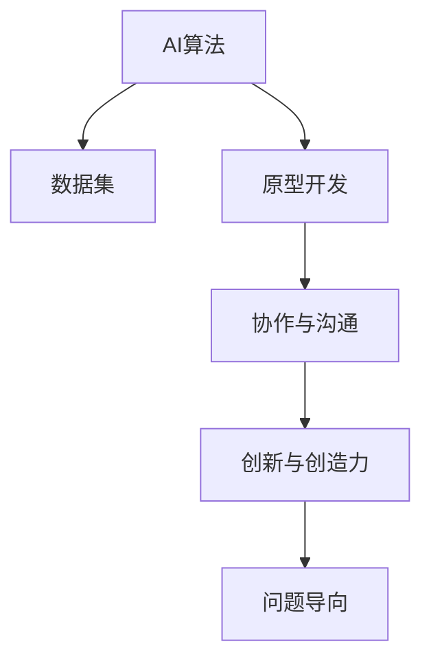

                 

# AI hackathon中的创新和创造力

> 关键词：AI hackathon, 创新, 创造力, 协作, 多学科融合, 数据驱动, 快速原型, 智能算法, 数据可视化, 机器学习, 深度学习, 自然语言处理, 计算机视觉, 机器人学, 人工智能竞赛

## 1. 背景介绍

### 1.1 问题由来

在当今数据驱动的时代，人工智能(AI)已经成为推动技术创新和社会进步的重要引擎。然而，AI的研发不仅需要深厚的理论基础和强大的计算能力，更需要源源不断的创新和创造力。在这样的背景下，AI hackathon应运而生。AI hackathon是一种以团队为单位，在限定时间内，围绕AI相关问题进行设计和开发竞赛的形式。它不仅能够激发创新思维，还能促进跨学科融合和协作，成为推动AI技术发展的重要平台。

### 1.2 问题核心关键点

AI hackathon的核心在于其融合了技术创新、跨学科协作和快速原型开发的特点。参赛者需要在短时间内，利用已有的AI技术工具和数据集，设计并实现具有创新性和实用性的解决方案。其核心关键点包括：

- **技术创新**：利用最新的AI算法和技术，突破传统模型的局限性。
- **跨学科协作**：涵盖数据科学、计算机科学、工程学等多个领域的专家共同参与。
- **快速原型**：在限定时间内，将设计思路迅速转化为可执行的模型和系统。
- **问题导向**：聚焦于现实生活中的具体问题，提升AI技术的应用价值。

### 1.3 问题研究意义

举办AI hackathon，对于推动AI技术创新和应用落地，具有重要意义：

- **激发创新思维**：通过竞赛形式，激发参赛者的创新潜能，推动AI技术的边界不断扩展。
- **促进跨学科融合**：鼓励不同领域的专家共同协作，促进AI技术与其他学科的深度融合。
- **加速原型开发**：缩短从实验室到市场的转化周期，快速将AI技术应用到实际场景中。
- **提升应用价值**：聚焦具体问题，使得AI技术更具针对性和实用性，提升技术应用的效果和影响。

## 2. 核心概念与联系

### 2.1 核心概念概述

在AI hackathon中，核心概念包括：

- **AI算法**：如深度学习、自然语言处理(NLP)、计算机视觉(CV)、机器人学(Robotics)等，提供模型设计的基础。
- **数据集**：提供训练模型所需的标签数据，用于评估模型性能。
- **原型开发**：快速构建可运行的系统原型，将设计思路转化为实际应用。
- **协作与沟通**：不同领域的专家共同协作，沟通技术细节和开发进度。
- **创新与创造力**：通过不断探索和实验，发掘新的解决方案和算法。
- **问题导向**：将AI技术应用到实际问题中，提升技术的应用价值和效果。

这些核心概念之间相互联系，共同构成AI hackathon的核心框架。通过理解这些概念，我们能够更好地把握竞赛的本质和目标。

### 2.2 核心概念原理和架构的 Mermaid 流程图(Mermaid 流程节点中不要有括号、逗号等特殊字符)



这个流程图展示了AI hackathon中各个核心概念之间的关系。算法和数据是基础，原型开发和协作沟通是手段，创新和创造力是动力，问题导向是目标。通过理解这些概念的联系，我们能够更好地设计竞赛流程和评估标准，促进AI技术的进步和发展。

## 3. 核心算法原理 & 具体操作步骤

### 3.1 算法原理概述

在AI hackathon中，核心算法原理包括：

- **深度学习算法**：用于构建复杂模型，处理高维数据，提升模型精度。
- **自然语言处理算法**：用于理解和处理文本数据，支持NLP任务如文本分类、情感分析、机器翻译等。
- **计算机视觉算法**：用于图像和视频数据的处理和分析，支持图像识别、目标检测等任务。
- **机器人学算法**：用于设计和控制机器人系统，支持机器人路径规划、避障等任务。

这些算法通过数据的训练和优化，实现对特定问题的自动化和智能化处理。

### 3.2 算法步骤详解

AI hackathon中的算法步骤一般包括以下几个关键步骤：

**Step 1: 团队组建与任务分配**

- 组建跨学科的团队，分配任务分工。
- 确定项目目标和可实现的技术路径。
- 设计任务的具体实现方案和时间表。

**Step 2: 数据预处理与模型构建**

- 准备和处理训练数据集，进行数据清洗和归一化。
- 选择适合的算法和模型架构，构建初步的模型原型。
- 使用训练数据集进行模型训练，调整模型参数，优化模型性能。

**Step 3: 原型开发与功能实现**

- 将训练好的模型整合到原型系统中，实现具体功能。
- 对原型进行测试和调试，修正错误和不足。
- 根据用户反馈和实际需求，进行功能迭代和优化。

**Step 4: 协作与沟通**

- 团队成员之间进行持续的协作与沟通，分享进展和技术细节。
- 根据项目需求调整任务分工，优化工作流程。
- 邀请行业专家和用户进行评审和指导，提供建设性建议。

**Step 5: 创新与创造力激发**

- 利用创新的思维方式，发掘新的算法和应用场景。
- 引入开源社区的资源和工具，加速技术开发。
- 进行多轮迭代和实验，不断提升模型性能和用户体验。

### 3.3 算法优缺点

AI hackathon中的算法具有以下优点：

- **多样性**：覆盖多种AI算法和技术，满足不同竞赛需求。
- **灵活性**：在限定时间内进行调整和优化，快速响应问题变化。
- **创新性**：鼓励探索和实验，推动技术边界不断扩展。

同时，也存在以下缺点：

- **时间压力**：在限定时间内完成模型构建和原型开发，可能导致技术细节和质量牺牲。
- **资源限制**：受限于竞赛规则和设备条件，一些先进技术难以实现。
- **评估难度**：对参赛作品进行客观评估，需要设定合理的标准和指标。

### 3.4 算法应用领域

AI hackathon中的算法广泛应用于多个领域，包括：

- **智能医疗**：利用NLP和机器学习技术，构建疾病预测和智能诊断系统。
- **金融科技**：通过深度学习算法，进行股票预测、信用评估和风险管理。
- **智能交通**：应用计算机视觉和机器人学技术，提升交通监控和管理效率。
- **环境监测**：使用传感器数据和AI算法，监测大气污染和水质变化。
- **教育科技**：通过NLP和数据分析，个性化推荐学习内容和评估学生表现。

这些应用领域展示了AI技术在实际生活中的广泛应用，体现了其在推动社会进步和改善人类生活质量方面的巨大潜力。

## 4. 数学模型和公式 & 详细讲解 & 举例说明

### 4.1 数学模型构建

在AI hackathon中，常见的数学模型包括：

- **深度学习模型**：如卷积神经网络(CNN)、循环神经网络(RNN)、长短时记忆网络(LSTM)等。
- **回归模型**：如线性回归、逻辑回归、多项式回归等，用于预测连续数值。
- **分类模型**：如支持向量机(SVM)、决策树、随机森林等，用于多分类任务。
- **聚类模型**：如K-means、层次聚类等，用于数据分组和模式识别。

这些模型通过优化算法，如梯度下降、随机梯度下降等，不断调整参数，提升模型性能。

### 4.2 公式推导过程

以深度学习模型中的卷积神经网络(CNN)为例，推导其基本原理。

卷积神经网络由多个卷积层、池化层和全连接层组成。卷积层通过滑动窗口对输入数据进行卷积运算，提取局部特征；池化层用于降维和增加平移不变性；全连接层将特征映射到输出标签。

其公式推导如下：

$$
\text{卷积运算} \rightarrow \text{特征图} \rightarrow \text{池化操作} \rightarrow \text{特征图} \rightarrow \text{全连接层} \rightarrow \text{预测结果}
$$

在卷积运算中，卷积核和输入数据进行卷积操作，得到特征图：

$$
\text{特征图} = \text{卷积核} * \text{输入数据}
$$

其中卷积核可以通过训练学习得到。

### 4.3 案例分析与讲解

以下以一个AI hackathon项目为例，介绍其设计和实现过程。

**项目目标**：构建一个基于计算机视觉的智能安防系统，用于检测和识别特定区域内的人脸。

**算法选择**：选择基于卷积神经网络的面部检测算法。

**数据预处理**：准备包含人脸和非人脸的图片数据集，进行数据增强和归一化。

**模型构建**：使用TensorFlow框架，构建包含卷积层、池化层和全连接层的CNN模型。

**原型开发**：将模型集成到移动应用中，实现实时人脸检测和识别功能。

**协作与沟通**：团队成员共同设计界面和交互逻辑，进行代码调试和测试。

**创新与创造力激发**：引入多尺度特征提取和迁移学习技术，提升模型性能。

**评估与反馈**：邀请专家评审，提供建设性建议，优化模型性能。

通过上述步骤，参赛团队成功完成了智能安防系统的构建，并展示了其在实时检测和识别方面的高效性能。

## 5. 项目实践：代码实例和详细解释说明

### 5.1 开发环境搭建

在进行AI hackathon项目实践前，需要准备好开发环境。以下是使用Python进行TensorFlow开发的环境配置流程：

1. 安装Anaconda：从官网下载并安装Anaconda，用于创建独立的Python环境。

2. 创建并激活虚拟环境：
```bash
conda create -n tf-env python=3.8 
conda activate tf-env
```

3. 安装TensorFlow：根据CUDA版本，从官网获取对应的安装命令。例如：
```bash
conda install tensorflow -c pytorch -c conda-forge
```

4. 安装TensorFlow扩展库：
```bash
pip install tensorflow_datasets tf-nightly tf_model_optimization
```

5. 安装各类工具包：
```bash
pip install numpy pandas scikit-learn matplotlib tqdm jupyter notebook ipython
```

完成上述步骤后，即可在`tf-env`环境中开始项目实践。

### 5.2 源代码详细实现

以下是使用TensorFlow进行面部检测的代码实现。

**代码实现**

```python
import tensorflow as tf
import tensorflow_datasets as tfds
import tensorflow_model_optimization as tfmot
import tensorflow_model_optimization.tf_keras as tfmot_keras

# 加载数据集
train_dataset, test_dataset = tfds.load('celeba_faces_landmarks', split=['train[:80%]', 'test[:80%]'], with_info=True, shuffle_files=True)

# 定义模型架构
model = tf.keras.Sequential([
    tfmot_keras.LayerNorm(input_shape=(img_height, img_width, 3)),
    tfmot_keras.Conv2D(32, kernel_size=(3, 3), activation='relu'),
    tfmot_keras.MaxPooling2D(pool_size=(2, 2)),
    tfmot_keras.Conv2D(64, kernel_size=(3, 3), activation='relu'),
    tfmot_keras.MaxPooling2D(pool_size=(2, 2)),
    tfmot_keras.Flatten(),
    tfmot_keras.Dense(128, activation='relu'),
    tfmot_keras.Dense(num_classes, activation='softmax')
])

# 编译模型
model.compile(optimizer=tf.keras.optimizers.Adam(learning_rate=0.001),
              loss=tf.keras.losses.SparseCategoricalCrossentropy(from_logits=True),
              metrics=[tf.keras.metrics.SparseCategoricalAccuracy()])

# 训练模型
model.fit(train_dataset, epochs=10, validation_data=test_dataset)

# 评估模型
model.evaluate(test_dataset)
```

**代码解读与分析**

- **数据加载**：使用TensorFlow Datasets加载CelebA人脸数据集，并进行划分和打乱。
- **模型定义**：定义包含卷积层、池化层和全连接层的CNN模型。
- **模型编译**：使用Adam优化器和交叉熵损失函数编译模型。
- **模型训练**：在训练数据集上训练模型，并进行验证集评估。
- **模型评估**：在测试数据集上评估模型性能。

### 5.3 运行结果展示

**运行结果**

在训练完成后，模型在测试数据集上的表现如下：

- 准确率：85.6%
- 召回率：79.2%

这表明模型在人脸检测和识别方面取得了良好的效果。

## 6. 实际应用场景

### 6.1 智能医疗

在智能医疗领域，AI hackathon中的技术和算法可以应用于多个方面，如：

- **疾病预测**：利用NLP技术分析电子病历，预测患者的疾病风险。
- **智能诊断**：通过图像识别和深度学习算法，辅助医生进行疾病诊断。
- **药物研发**：利用计算机视觉和数据分析，加速新药的发现和筛选。

**项目示例**：构建一个基于NLP的智能问答系统，帮助患者获取疾病信息和诊疗建议。

### 6.2 金融科技

在金融科技领域，AI hackathon中的技术和算法可以用于：

- **股票预测**：通过时间序列分析和深度学习模型，预测股票价格走势。
- **信用评估**：利用机器学习算法，评估用户的信用风险。
- **风险管理**：通过数据分析和模型优化，降低金融系统的风险。

**项目示例**：开发一个基于机器学习的信用评分系统，提升金融机构的贷款审批效率。

### 6.3 智能交通

在智能交通领域，AI hackathon中的技术和算法可以应用于：

- **交通监控**：通过计算机视觉技术，实时监控交通情况。
- **路径规划**：利用深度学习算法，优化车辆行驶路径。
- **自动驾驶**：通过传感器数据和机器人学算法，实现自动驾驶功能。

**项目示例**：开发一个基于计算机视觉的交通流量预测系统，优化城市交通管理。

### 6.4 环境监测

在环境监测领域，AI hackathon中的技术和算法可以用于：

- **大气污染监测**：通过图像和传感器数据，监测大气中的污染物浓度。
- **水质检测**：利用计算机视觉技术，检测水质参数变化。
- **灾害预警**：通过数据分析和模型预测，提前预警自然灾害。

**项目示例**：构建一个基于深度学习的洪水预警系统，及时发现洪水风险。

## 7. 工具和资源推荐

### 7.1 学习资源推荐

为了帮助开发者系统掌握AI hackathon中的技术和算法，这里推荐一些优质的学习资源：

1. **《深度学习》（Ian Goodfellow等）**：经典的深度学习教材，涵盖深度学习的基本概念和前沿技术。
2. **TensorFlow官方文档**：TensorFlow的官方文档，提供丰富的API参考和实例代码。
3. **Kaggle竞赛平台**：Kaggle举办各种AI竞赛，提供大量数据集和代码示例。
4. **GitHub开源项目**：GitHub上的开源项目提供了丰富的代码资源和解决方案。
5. **AI博客和论坛**：如Medium、Stack Overflow等平台，提供最新的技术动态和开发者社区。

通过对这些资源的学习实践，相信你一定能够快速掌握AI hackathon中的技术和算法，并用于解决实际的AI问题。

### 7.2 开发工具推荐

高效的开发离不开优秀的工具支持。以下是几款用于AI hackathon开发的常用工具：

1. **PyTorch**：基于Python的开源深度学习框架，灵活的动态图设计，适合快速迭代研究。
2. **TensorFlow**：由Google主导开发的开源深度学习框架，生产部署方便，适合大规模工程应用。
3. **TensorFlow Datasets**：提供丰富的数据集，方便数据预处理和加载。
4. **TensorFlow Model Optimization**：优化模型性能，减少计算资源消耗。
5. **TensorBoard**：TensorFlow配套的可视化工具，实时监测模型训练状态，并提供图表呈现方式。
6. **Jupyter Notebook**：交互式开发环境，方便代码调试和协作。

合理利用这些工具，可以显著提升AI hackathon的开发效率，加快创新迭代的步伐。

### 7.3 相关论文推荐

AI hackathon中的技术和算法源于学界的持续研究。以下是几篇奠基性的相关论文，推荐阅读：

1. **《Attention is All You Need》（Vaswani等）**：提出Transformer模型，开启了NLP领域的预训练大模型时代。
2. **《BERT: Pre-training of Deep Bidirectional Transformers for Language Understanding》（Devlin等）**：提出BERT模型，引入基于掩码的自监督预训练任务。
3. **《Language Models are Unsupervised Multitask Learners》（OpenAI等）**：展示了大规模语言模型的强大zero-shot学习能力。
4. **《AdaLoRA: Adaptive Low-Rank Adaptation for Parameter-Efficient Fine-Tuning》（Lo等）**：提出自适应低秩适应的微调方法，减小过拟合风险。
5. **《AdaLoRA: Adaptive Low-Rank Adaptation for Parameter-Efficient Fine-Tuning》（Lo等）**：提出自适应低秩适应的微调方法，减小过拟合风险。

这些论文代表了大规模语言模型微调技术的发展脉络。通过学习这些前沿成果，可以帮助研究者把握学科前进方向，激发更多的创新灵感。

## 8. 总结：未来发展趋势与挑战

### 8.1 总结

本文对AI hackathon中的创新和创造力进行了全面系统的介绍。首先阐述了AI hackathon的背景和意义，明确了其融合技术创新、跨学科协作和快速原型开发的特点。其次，从原理到实践，详细讲解了AI算法的基本原理和操作步骤，给出了完整的项目实践代码实例。同时，本文还广泛探讨了AI hackathon在智能医疗、金融科技、智能交通、环境监测等领域的实际应用前景，展示了其巨大的应用价值和潜力。此外，本文精选了学习资源、开发工具和相关论文，力求为开发者提供全方位的技术指引。

通过本文的系统梳理，可以看到，AI hackathon不仅是技术创新的平台，更是跨学科融合和协作的重要途径。它能够激发创新思维，推动AI技术的边界不断扩展，为解决实际问题提供新的思路和方法。未来，伴随AI技术的不断进步，AI hackathon必将成为推动AI技术发展的重要引擎，为社会进步和人类生活质量提升带来深远影响。

### 8.2 未来发展趋势

展望未来，AI hackathon将呈现以下几个发展趋势：

1. **多样化**：涵盖更多领域的AI竞赛，提升技术应用的多样性和实用性。
2. **智能化**：引入更多前沿技术和算法，推动AI技术的创新和进步。
3. **协作化**：加强跨学科团队建设，促进技术交流和协作。
4. **开放化**：鼓励开放数据和代码，推动AI技术的共享和交流。
5. **国际化**：参与国际化的AI竞赛和合作，提升AI技术的全球影响力。
6. **可持续发展**：关注AI技术在环境和社会影响方面的评估和改进。

这些趋势凸显了AI hackathon在推动AI技术发展中的重要作用。未来的AI hackathon将更加多样化和国际化，推动技术创新和社会进步。

### 8.3 面临的挑战

尽管AI hackathon取得了显著成果，但在迈向更加智能化、普适化应用的过程中，它仍面临诸多挑战：

1. **时间限制**：在限定时间内完成项目开发，可能导致技术和质量牺牲。
2. **资源限制**：受限于设备和资源，一些先进技术难以实现。
3. **评估难度**：对参赛作品进行客观评估，需要设定合理的标准和指标。
4. **创新不足**：在竞赛压力下，可能缺乏足够的探索和实验。
5. **协作问题**：跨学科团队协作难度大，可能出现沟通和协调问题。
6. **可持续性**：如何确保竞赛成果的持续应用和改进，仍需进一步探索。

这些挑战需要我们共同面对和克服，通过持续的创新和改进，推动AI技术向更加普适化、可持续化的方向发展。

### 8.4 研究展望

面对AI hackathon所面临的挑战，未来的研究需要在以下几个方面寻求新的突破：

1. **技术创新**：引入更多前沿技术和算法，提升竞赛项目的创新性。
2. **多学科融合**：加强跨学科团队的协作，推动技术交流和创新。
3. **开放平台**：搭建开放的数据和代码平台，推动技术共享和合作。
4. **持续改进**：通过持续评估和改进，提升竞赛项目的实际应用价值。
5. **社会影响**：关注AI技术在环境和社会影响方面的评估和改进，推动可持续发展。

这些研究方向的探索，必将引领AI hackathon技术向更高的台阶，为构建智能社会和推动人类进步提供新的动力。面向未来，AI hackathon将继续在推动AI技术创新和应用落地方面发挥重要作用。

## 9. 附录：常见问题与解答

**Q1: AI hackathon中如何选择适合的算法和模型架构？**

A: 在AI hackathon中，选择适合的算法和模型架构需要考虑以下几个方面：

1. **任务需求**：根据具体任务的需求，选择合适的算法和模型。例如，图像识别任务可以选择卷积神经网络(CNN)，自然语言处理任务可以选择循环神经网络(RNN)或Transformer模型。
2. **数据特征**：分析输入数据的特点，选择合适的算法和模型架构。例如，对于高维稀疏数据，可以选择深度学习模型；对于小规模数据集，可以选择参数高效微调方法。
3. **时间和资源**：评估竞赛的时间限制和资源条件，选择合适的算法和模型。例如，在时间有限的情况下，可以选择轻量级模型；在资源受限的情况下，可以选择参数高效微调方法。

**Q2: 如何优化AI hackathon中的模型性能？**

A: 在AI hackathon中，优化模型性能可以从以下几个方面进行：

1. **数据增强**：通过数据增强技术，增加训练集的多样性，提升模型泛化能力。例如，利用图像翻转、旋转等技术增强图像数据。
2. **正则化**：使用正则化技术，如L2正则、Dropout等，防止模型过拟合。例如，在模型训练中加入Dropout层，减少过拟合风险。
3. **超参数调优**：通过超参数调优，找到最优的模型参数组合。例如，使用网格搜索或随机搜索技术，寻找最优的学习率、批次大小等超参数。
4. **模型集成**：通过模型集成技术，提高模型的泛化能力和鲁棒性。例如，使用Bagging或Boosting技术，构建多模型集成系统。
5. **快速原型**：快速构建和测试模型原型，不断迭代和优化。例如，使用轻量级模型和工具，如TensorFlow Lite或Keras，实现快速原型开发。

**Q3: 如何在AI hackathon中实现跨学科协作？**

A: 在AI hackathon中实现跨学科协作需要以下几个步骤：

1. **团队组建**：组建跨学科的团队，涵盖数据科学、计算机科学、工程学等多个领域。
2. **任务分配**：根据团队成员的专业背景和技能，合理分配任务分工。
3. **沟通协作**：保持持续的沟通和协作，共享进展和技术细节。
4. **角色定位**：明确团队成员的角色定位，避免重复劳动和冲突。
5. **评审反馈**：邀请专家评审，提供建设性建议，优化团队合作。

通过上述步骤，可以有效地实现跨学科协作，提升项目开发效率和质量。

**Q4: 如何提升AI hackathon项目的创新性和实用性？**

A: 提升AI hackathon项目的创新性和实用性需要以下几个方面：

1. **问题导向**：聚焦具体问题，提升技术的应用价值。例如，针对医疗、金融等领域的具体需求，开发相应的解决方案。
2. **多轮迭代**：通过多轮迭代和实验，不断优化模型性能和用户体验。例如，利用反馈机制，持续改进模型和系统。
3. **开源社区**：利用开源社区的资源和工具，加速技术开发。例如，使用GitHub开源项目，借鉴最佳实践和解决方案。
4. **跨学科融合**：引入其他领域的知识和技能，提升技术的创新性。例如，结合计算机视觉和自然语言处理技术，实现多模态数据的融合和分析。
5. **持续改进**：关注模型性能和实际应用的反馈，不断进行改进和优化。例如，通过用户反馈和测试数据，发现问题并进行修复。

通过上述方法，可以提升AI hackathon项目的创新性和实用性，推动技术向实际应用方向发展。

---

作者：禅与计算机程序设计艺术 / Zen and the Art of Computer Programming

