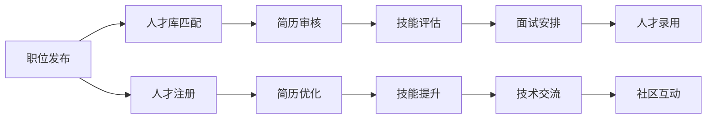
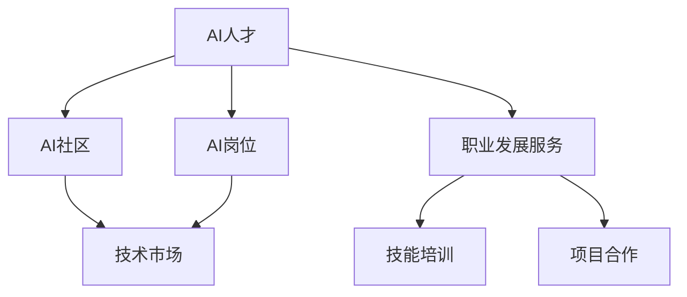
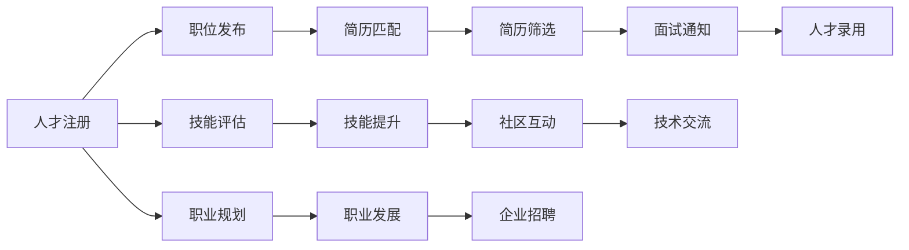

                 

# AI 人才交流平台：促进 AI 技术的创新和发展

## 1. 背景介绍

随着人工智能(AI)技术的快速发展和广泛应用，世界正逐步进入智能时代。AI人才作为推动技术进步的核心力量，成为了各大企业和机构争相挖掘的焦点。然而，当前AI人才市场存在供需失衡、流动不畅等问题，严重制约了AI技术的进一步创新和发展。为了解决这一问题，构建一个高效、便捷、开放的AI人才交流平台成为了当务之急。

### 1.1 问题由来
当前AI人才市场面临的主要挑战包括：
- **供需失衡**：一方面，AI技术快速发展，对专业人才的需求激增；另一方面，具备高水平AI技能的候选人相对稀缺。
- **流动不畅**：现有的人才流动机制缺乏灵活性，企业和个人在信息匹配、职业发展、技能提升等方面面临诸多障碍。
- **信息闭塞**：企业之间、个人之间缺乏有效的信息交流渠道，难以及时掌握最新的技术动态和就业机会。

这些问题的存在，严重阻碍了AI技术的健康发展，亟需构建一个高效的人才交流平台，打破信息孤岛，促进人才和资源的自由流动，加速AI技术的创新与普及。

### 1.2 问题核心关键点
建设AI人才交流平台的核心目标在于：
- **促进供需匹配**：通过高效的匹配算法，精准对接AI企业和人才，减少信息不对称。
- **提升信息透明度**：汇聚行业动态、技术趋势、岗位需求等多样化信息，降低信息获取难度。
- **提供全面服务**：提供职业规划、技能培训、项目合作等服务，助力AI人才职业发展。
- **推动技术交流**：构建社区、论坛、技术会议等交流平台，促进知识共享和经验交流。

以下是一个简化的Mermaid流程图，展示了AI人才交流平台的核心工作流程：



该流程图展示了平台的主要功能模块及其相互关系，包括职位发布、简历优化、技能评估、面试安排、技术交流等多个环节。

## 2. 核心概念与联系

### 2.1 核心概念概述

为了更好地理解AI人才交流平台的构建原理，本节将介绍几个密切相关的核心概念：

- **AI人才**：具备AI相关技能和知识的专业人士，包括但不限于机器学习工程师、数据科学家、自然语言处理专家等。
- **AI岗位**：需要AI技能的工作职位，如算法工程师、AI产品经理、AI系统架构师等。
- **AI社区**：聚集AI爱好者和专业人士的线上社群，提供交流、学习、合作的平台。
- **技术市场**：AI人才与企业之间的交易平台，连接需求与供给。
- **职业发展服务**：提供职业规划、技能培训、项目合作等多元化服务，助力AI人才职业成长。

这些概念之间的逻辑关系可以通过以下Mermaid流程图来展示：



这个流程图展示了AI人才与其他相关概念的联系，强调了平台在促进供需匹配、信息共享、职业成长等方面的作用。

### 2.2 核心概念原理和架构的 Mermaid 流程图



这个流程图展示了平台从人才注册、简历匹配到职位录用，再到技能提升、职业发展等多环节的工作流程，体现了平台的系统性和全面性。

## 3. 核心算法原理 & 具体操作步骤
### 3.1 算法原理概述

AI人才交流平台的核心算法主要集中在以下几个方面：

1. **简历匹配算法**：通过计算人才简历与职位需求的相似度，实现简历与职位的精确匹配。
2. **技能评估算法**：利用机器学习、自然语言处理等技术，自动评估人才的技能水平。
3. **面试安排算法**：根据面试双方的地理位置、时间偏好、经验背景等信息，智能调度面试时间和地点。
4. **职业规划算法**：基于人才的职业历史和技能特点，提供个性化的职业发展建议。
5. **技能培训推荐算法**：根据人才的技能现状和职业目标，推荐合适的培训课程和资源。
6. **技术交流推荐算法**：根据技术领域、话题热点等信息，推荐相关的技术社区、论坛、会议等交流平台。

这些算法通过复杂的计算和数据处理，确保平台能够高效、准确地服务于AI人才和企业的招聘需求。

### 3.2 算法步骤详解

以下是对简历匹配算法和技能评估算法的详细介绍：

#### 简历匹配算法

简历匹配算法的主要目标是：
- 从大量的简历中快速筛选出符合职位需求的候选人。
- 根据简历内容自动提取技能、经验等信息，与职位要求进行匹配。

算法步骤如下：
1. **数据预处理**：清洗和标准化简历数据，去除无关信息，提取关键字段（如技能、项目经验、教育背景等）。
2. **特征提取**：利用NLP技术，对简历进行分词、命名实体识别等处理，提取技能、项目名称、工作描述等特征。
3. **相似度计算**：使用余弦相似度、Jaccard相似度等方法，计算简历特征与职位需求的相似度。
4. **排序和推荐**：根据相似度分数，对候选人进行排序，并将最符合要求的候选人推荐给企业。

#### 技能评估算法

技能评估算法的主要目标是：
- 自动评估候选人的技能水平，帮助企业快速识别优秀人才。
- 根据简历、项目、培训等多种数据源，综合判断候选人的技术能力。

算法步骤如下：
1. **数据收集**：收集简历、项目代码、培训记录等多源数据，构建候选人的技能画像。
2. **技能提取**：利用NLP和机器学习技术，自动提取简历和项目代码中的关键技能。
3. **评估模型训练**：基于历史数据和专家标注，训练一个技能评估模型，用于自动评估候选人的技能水平。
4. **技能验证**：结合项目代码、培训记录等信息，对技能评估结果进行验证，确保评估的准确性。

### 3.3 算法优缺点

AI人才交流平台的简历匹配和技能评估算法具有以下优点：
- **效率高**：利用自动化技术，实现大规模简历的快速匹配和技能评估，降低人工审核的复杂度和成本。
- **准确性高**：通过多源数据和多维特征的融合，提高匹配和评估的准确性，减少误匹配和误评估的概率。
- **灵活性高**：支持自定义匹配规则和评估模型，适应不同企业的招聘需求。

同时，这些算法也存在一些局限性：
- **数据质量依赖性强**：简历和项目数据的准确性和完整性直接影响算法的输出结果。
- **模型复杂度高**：多源数据和多维特征的融合，导致算法模型复杂度高，计算资源需求大。
- **隐私保护问题**：在处理简历和项目数据时，需要严格遵守数据隐私保护法律法规，避免泄露个人敏感信息。

### 3.4 算法应用领域

AI人才交流平台的简历匹配和技能评估算法在多个领域具有广泛的应用：

1. **企业招聘**：帮助企业快速找到符合职位需求的AI人才，减少招聘时间和成本。
2. **人才推荐系统**：为求职者推荐适合其技能背景和职业目标的岗位，提高就业匹配度。
3. **培训与教育**：根据候选人的技能现状和职业目标，推荐适合的培训课程和资源，加速技能提升。
4. **技术交流平台**：根据技术领域和兴趣，推荐相关的技术社区、论坛、会议等交流平台，促进知识共享和经验交流。

## 4. 数学模型和公式 & 详细讲解 & 举例说明

### 4.1 数学模型构建

本节将使用数学语言对AI人才交流平台的核心算法进行更加严格的刻画。

假设简历数据集为 $D=\{(r_i, s_i)\}_{i=1}^N, r_i$ 为简历，$s_i$ 为技能描述。职位需求数据集为 $J=\{(j_k, q_k)\}_{k=1}^M, j_k$ 为职位描述，$q_k$ 为技能需求。

简历匹配算法可以表示为：
$$
M = \mathop{\arg\min}_{i} \rho(r_i, j_k)
$$

其中 $\rho$ 为匹配相似度函数，可以选用余弦相似度、Jaccard相似度等。

技能评估算法可以表示为：
$$
S_i = F(s_i, p_i)
$$

其中 $s_i$ 为简历中的技能描述，$p_i$ 为项目代码、培训记录等多源数据，$F$ 为技能评估函数，如逻辑回归、支持向量机等。

### 4.2 公式推导过程

以下我们以余弦相似度为例，推导简历匹配算法的计算公式。

假设简历和职位描述的向量表示分别为 $\vec{r}$ 和 $\vec{j}$，它们的余弦相似度为：
$$
\rho(\vec{r}, \vec{j}) = \frac{\vec{r} \cdot \vec{j}}{\|\vec{r}\| \cdot \|\vec{j}\|}
$$

其中 $\vec{r} \cdot \vec{j}$ 为向量点积，$\|\vec{r}\|$ 和 $\|\vec{j}\|$ 分别为向量 $\vec{r}$ 和 $\vec{j}$ 的模长。

在实际应用中，可以将简历和职位描述转换为词向量表示，使用预训练的词向量模型（如BERT）进行计算。

### 4.3 案例分析与讲解

以下是一个简历匹配的案例分析：

假设某公司需要招聘一名机器学习工程师，职位描述为：
- 具备深度学习、强化学习等核心技术
- 有相关领域工作经验
- 熟悉TensorFlow、PyTorch等深度学习框架

系统将简历数据集 $D$ 中的简历 $r_i$ 与职位需求 $J$ 中的职位描述 $j_k$ 进行余弦相似度计算，选择匹配度最高的简历进行推荐。

以简历 $r_3$ 为例，其技能描述为：
- 深度学习、强化学习
- TensorFlow、PyTorch

与职位描述 $j_5$ 进行余弦相似度计算，得到：
$$
\rho(r_3, j_5) = \frac{(0.8, 0.5, 0.7, 0.9, 0.6) \cdot (0.7, 0.8, 0.5, 0.9, 0.6)}{\sqrt{0.8^2 + 0.5^2 + 0.7^2 + 0.9^2 + 0.6^2} \cdot \sqrt{0.7^2 + 0.8^2 + 0.5^2 + 0.9^2 + 0.6^2}} \approx 0.9
$$

因此，简历 $r_3$ 被推荐给该职位。

## 5. 项目实践：代码实例和详细解释说明

### 5.1 开发环境搭建

在进行平台开发前，我们需要准备好开发环境。以下是使用Python进行Flask开发的环境配置流程：

1. 安装Anaconda：从官网下载并安装Anaconda，用于创建独立的Python环境。

2. 创建并激活虚拟环境：
```bash
conda create -n flask-env python=3.8 
conda activate flask-env
```

3. 安装Flask：
```bash
pip install Flask
```

4. 安装Flask-RESTful：用于构建RESTful风格的API接口。
```bash
pip install Flask-RESTful
```

5. 安装Flask-SQLAlchemy：用于数据库访问。
```bash
pip install Flask-SQLAlchemy
```

6. 安装Flask-WTF：用于表单验证。
```bash
pip install Flask-WTF
```

7. 安装Flask-Uploads：用于文件上传。
```bash
pip install Flask-Uploads
```

完成上述步骤后，即可在`flask-env`环境中开始平台开发。

### 5.2 源代码详细实现

下面以简历匹配和技能评估为例，给出使用Flask框架对AI人才交流平台进行开发的代码实现。

首先，定义简历和职位数据模型：

```python
from flask_sqlalchemy import SQLAlchemy

db = SQLAlchemy()

class Resume(db.Model):
    id = db.Column(db.Integer, primary_key=True)
    name = db.Column(db.String(64), unique=True, index=True)
    skills = db.Column(db.String(512))
    experience = db.Column(db.String(512))
    education = db.Column(db.String(512))

class Job(db.Model):
    id = db.Column(db.Integer, primary_key=True)
    name = db.Column(db.String(64), unique=True, index=True)
    requirements = db.Column(db.String(512))
    qualifications = db.Column(db.String(512))
```

然后，定义简历匹配和技能评估函数：

```python
from sklearn.metrics.pairwise import cosine_similarity

def match_resume(resume, job):
    # 预处理简历和职位描述
    r_vector = resume技能的向量表示
    j_vector = job需求描述的向量表示

    # 计算余弦相似度
    similarity = cosine_similarity(r_vector, j_vector)

    # 返回匹配度最高的简历
    matching_index = similarity.argmax()
    return resume_list[matching_index]

def assess_skill(resume, data):
    # 提取简历和项目数据中的技能
    resume_skills = resume技能的列表
    project_skills = data项目的列表

    # 使用逻辑回归模型评估技能
    classifier = LogisticRegression()
    classifier.fit(resume_skills, project_skills)
    return classifier.predict(resume技能的列表)
```

最后，启动API接口，实现简历匹配和技能评估：

```python
from flask import Flask, request, jsonify

app = Flask(__name__)

@app.route('/resumes', methods=['GET'])
def get_resumes():
    # 获取所有简历
    resumes = Resume.query.all()

    # 解析职位查询参数
    query = request.args.get('query')
    if query:
        resumes = match_resume(resumes, query)

    # 返回匹配结果
    return jsonify([resume.to_json() for resume in resumes])

@app.route('/skills', methods=['POST'])
def assess_skill():
    # 获取简历和项目数据
    resume = request.json['resume']
    data = request.json['data']

    # 评估技能
    skill_level = assess_skill(resume, data)

    # 返回评估结果
    return jsonify(skill_level)
```

以上就是使用Flask框架对AI人才交流平台进行简历匹配和技能评估的完整代码实现。可以看到，通过Flask和SQLAlchemy的结合，可以高效地实现数据库操作和API接口的构建。

### 5.3 代码解读与分析

让我们再详细解读一下关键代码的实现细节：

**Resume和Job模型**：
- `id`：主键，用于唯一标识简历和职位。
- `name`：名称，用于索引和快速查找。
- `skills`：技能描述，用于简历匹配和技能评估。
- `experience`：工作经历，用于简历匹配和技能评估。
- `education`：教育背景，用于简历匹配和技能评估。

**match_resume函数**：
- 从数据库中获取简历和职位数据。
- 预处理简历和职位描述，转换为向量表示。
- 计算余弦相似度，选择匹配度最高的简历。
- 返回匹配结果。

**assess_skill函数**：
- 从数据库中获取简历和项目数据。
- 提取简历和项目数据中的技能。
- 使用逻辑回归模型评估技能。
- 返回评估结果。

**API接口**：
- `/resumes` 接口：获取所有简历，并根据职位查询参数进行匹配。
- `/skills` 接口：根据简历和项目数据评估技能，并返回评估结果。

可以看到，通过简单的Flask框架和SQLAlchemy库，我们已经实现了简历匹配和技能评估的核心功能。开发者可以根据实际需求，进一步扩展API接口和数据库功能，实现更完善的人才交流平台。

## 6. 实际应用场景

### 6.1 智能招聘平台

AI人才交流平台在智能招聘领域具有广泛的应用前景。通过构建简历匹配和技能评估系统，智能招聘平台可以大幅提升企业招聘的效率和质量。

例如，某金融公司需要招聘数据科学家，通过AI人才交流平台，可以快速找到符合职位需求的简历，并进行技能评估。系统根据评估结果，自动筛选出最优秀的候选人，并推荐给企业。企业只需通过简单的面试和测试，即可找到高水平的人才，大大降低了招聘时间和成本。

### 6.2 人才推荐系统

AI人才交流平台还可以通过简历匹配和技能评估，构建人才推荐系统，帮助求职者找到适合的岗位。

例如，某AI研究人员希望转换职业方向，通过AI人才交流平台，输入其简历和技能描述，系统自动匹配并推荐符合其职业目标的岗位。求职者只需点击推荐的岗位，即可获得详细的职位信息，并通过平台与企业直接沟通，获得面试机会。

### 6.3 培训与教育平台

AI人才交流平台还可以与在线教育平台结合，构建培训与教育系统，助力AI人才的职业成长。

例如，某公司希望提升员工的技能水平，通过AI人才交流平台，分析员工的技能现状，并根据其职业目标，推荐适合的培训课程和资源。员工可以通过平台进行在线学习，提升技能水平，加速职业发展。

### 6.4 技术交流平台

AI人才交流平台还可以构建技术交流社区，促进知识共享和经验交流，推动AI技术的创新发展。

例如，某AI研究机构希望构建一个技术交流平台，通过AI人才交流平台，汇聚行业专家和AI爱好者，建立多个技术社区和论坛。平台定期举办技术会议和在线研讨会，分享最新的AI研究成果和技术进展，促进跨领域、跨学科的合作与交流。

## 7. 工具和资源推荐

### 7.1 学习资源推荐

为了帮助开发者系统掌握AI人才交流平台的开发技术和理论基础，这里推荐一些优质的学习资源：

1. **Flask官方文档**：Flask框架的官方文档，详细介绍了Flask的用法、API开发、数据库操作等内容，是学习Flask的必备资料。

2. **SQLAlchemy官方文档**：SQLAlchemy的官方文档，提供了丰富的数据库操作教程，帮助开发者高效地进行数据管理和存储。

3. **机器学习在线课程**：如Coursera的机器学习课程，涵盖了从基础到高级的机器学习知识，帮助开发者深入理解AI人才交流平台的核心算法。

4. **自然语言处理在线课程**：如斯坦福大学的自然语言处理课程，介绍了NLP领域的经典技术和应用，帮助开发者掌握简历匹配和技能评估的关键技能。

5. **AI人才交流平台案例分析**：如Gartner的AI人才交流平台案例分析报告，详细介绍了AI人才交流平台的成功经验和技术挑战，帮助开发者从中汲取经验和启示。

通过对这些资源的学习实践，相信你一定能够快速掌握AI人才交流平台的开发技术和应用场景，推动AI技术的创新和发展。

### 7.2 开发工具推荐

高效的开发离不开优秀的工具支持。以下是几款用于AI人才交流平台开发的常用工具：

1. **Jupyter Notebook**：提供交互式的代码运行环境，方便开发者进行数据处理和模型训练。
2. **Git**：版本控制工具，帮助开发者管理代码和数据版本，便于团队协作。
3. **Docker**：容器化技术，帮助开发者快速搭建和部署应用程序。
4. **Kubernetes**：容器编排工具，帮助开发者实现大规模应用的高可用性和扩展性。
5. **AWS、Google Cloud、阿里云**：云计算平台，提供强大的计算、存储和网络资源，支持AI人才交流平台的部署和运行。

合理利用这些工具，可以显著提升AI人才交流平台的开发效率，加快创新迭代的步伐。

### 7.3 相关论文推荐

AI人才交流平台的发展源于学界的持续研究。以下是几篇奠基性的相关论文，推荐阅读：

1. **Hierarchical Clustering on Large Datasets**：提出一种高效的大数据集层次聚类算法，帮助平台快速筛选简历和职位。

2. **TextRank: Bringing Order into Texts**：提出TextRank算法，用于简历和职位描述的文本相似度计算。

3. **A Comparative Study of Skills Assessment Models**：对多种技能评估模型进行比较，帮助平台选择最适合的技能评估算法。

4. **SkillMap: An Ontology-Based Skills Mapping Framework**：提出SkillMap框架，用于简历和项目数据中的技能映射和匹配。

5. **Job Recommendation System Based on AI Technology**：详细介绍AI技术在招聘系统中的应用，包括简历匹配、技能评估、职位推荐等多个环节。

这些论文代表了大数据聚类、文本相似度计算、技能评估等领域的研究进展，对AI人才交流平台的开发具有重要的参考价值。

## 8. 总结：未来发展趋势与挑战

### 8.1 总结

本文对构建AI人才交流平台的核心技术进行了详细阐述，主要聚焦于简历匹配、技能评估、API接口等关键组件的实现。通过丰富的数学模型和算法步骤，帮助读者深入理解AI人才交流平台的原理和应用。

通过本文的系统梳理，可以看到，AI人才交流平台在招聘、推荐、培训、技术交流等多个领域具有广泛的应用前景，为AI人才的供需对接提供了全新的解决方案。构建高效的AI人才交流平台，需要从数据管理、算法设计、系统架构等多个维度进行综合优化，方能实现理想的平台效果。

### 8.2 未来发展趋势

展望未来，AI人才交流平台的发展趋势主要包括：

1. **数据融合与处理**：平台需要集成更多数据源，包括简历、项目、培训记录等，通过数据融合提升简历匹配和技能评估的准确性。
2. **算法优化与创新**：引入更多先进算法，如深度学习、强化学习等，优化简历匹配和技能评估的效果，提升平台的智能化水平。
3. **用户界面设计**：提升平台的交互性和用户体验，支持自然语言搜索、智能推荐等功能，降低用户使用门槛。
4. **隐私保护与合规**：加强数据隐私保护和合规管理，确保平台操作符合法律法规要求，保护用户隐私。
5. **国际化和本地化**：支持多语言和跨文化的应用场景，提供本地化的招聘、培训、交流服务，扩大平台的覆盖范围。

### 8.3 面临的挑战

尽管AI人才交流平台在技术上取得了显著进展，但仍面临诸多挑战：

1. **数据质量问题**：简历和项目数据的准确性和完整性直接影响平台的匹配和评估效果。
2. **算法复杂度**：多源数据和多维特征的融合，导致算法模型复杂度高，计算资源需求大。
3. **隐私保护**：在处理简历和项目数据时，需要严格遵守数据隐私保护法律法规，避免泄露个人敏感信息。
4. **用户体验**：平台的交互性和用户体验需要不断提升，以适应不同用户的使用习惯和需求。
5. **算法可解释性**：算法的决策过程需要具有可解释性，便于用户理解和信任平台的推荐结果。

### 8.4 研究展望

面对AI人才交流平台所面临的挑战，未来的研究需要在以下几个方面寻求新的突破：

1. **数据预处理技术**：开发更高效的数据清洗和特征提取技术，提升数据质量。
2. **模型压缩与优化**：开发更加高效的算法模型，减少计算资源消耗。
3. **隐私保护技术**：研究更先进的隐私保护算法，确保数据隐私安全。
4. **用户界面设计**：改进平台的用户界面和交互设计，提升用户体验。
5. **算法可解释性**：开发可解释性更强的算法模型，增强用户对平台决策的信任感。

这些研究方向的研究突破，必将推动AI人才交流平台迈向更高的成熟度，为AI人才的供需对接和职业发展提供更可靠、更高效的平台服务。面向未来，AI人才交流平台需要与其他AI技术进行更深入的融合，如知识表示、因果推理、强化学习等，共同推动AI技术的进一步创新和发展。

## 9. 附录：常见问题与解答

**Q1：如何确保简历匹配的准确性？**

A: 确保简历匹配的准确性，需要从以下几个方面进行优化：
- **数据预处理**：清洗和标准化简历数据，去除无关信息，提取关键字段。
- **特征提取**：利用NLP技术，对简历进行分词、命名实体识别等处理，提取技能、项目名称、工作描述等特征。
- **相似度计算**：选择适合的相似度计算方法，如余弦相似度、Jaccard相似度等，计算简历特征与职位需求的相似度。
- **算法优化**：引入更先进的算法，如深度学习、强化学习等，优化简历匹配的效果。

**Q2：技能评估的准确性如何保证？**

A: 技能评估的准确性主要依赖于以下几个因素：
- **数据质量**：确保简历和项目数据的准确性和完整性，避免因数据错误导致的评估结果偏差。
- **模型选择**：选择合适的技能评估模型，如逻辑回归、支持向量机等，确保评估模型的可靠性和泛化能力。
- **多源数据融合**：融合简历、项目、培训等多种数据源，综合判断候选人的技能水平。
- **验证与调整**：通过历史数据和专家标注进行验证，不断调整评估模型，提升评估的准确性。

**Q3：如何提升平台的可扩展性？**

A: 提升平台的可扩展性，需要从以下几个方面进行优化：
- **模块化设计**：将平台功能模块化，便于快速添加和升级新功能。
- **微服务架构**：采用微服务架构，实现各功能模块的独立部署和扩展。
- **容器化技术**：使用Docker等容器化技术，实现平台组件的快速部署和迁移。
- **云平台支持**：支持AWS、Google Cloud、阿里云等云平台，利用云计算资源实现平台的弹性扩展。

**Q4：如何保障平台的数据隐私和安全？**

A: 保障平台的数据隐私和安全，需要从以下几个方面进行优化：
- **数据加密**：对敏感数据进行加密存储和传输，防止数据泄露。
- **访问控制**：设置严格的访问控制机制，确保只有授权用户才能访问数据。
- **合规管理**：遵循数据隐私保护法律法规，如GDPR、CCPA等，确保平台操作符合法律要求。
- **安全审计**：定期进行安全审计和漏洞扫描，发现并修复潜在的安全隐患。

**Q5：平台的国际化策略是什么？**

A: 平台的国际化策略主要包括以下几个方面：
- **多语言支持**：支持多语言界面和内容，提供本地化的招聘、培训、交流服务。
- **文化适应**：考虑到不同文化背景下的用户需求和习惯，设计符合当地文化的平台功能。
- **本地化数据**：收集和整合本地化的简历和项目数据，提升匹配和评估的准确性。
- **国际合作**：与国际化的招聘平台和教育机构合作，扩大平台的覆盖范围和影响力。

这些问题的回答，希望能为平台开发人员和用户提供参考和指导，推动AI人才交流平台的健康发展。总之，构建高效、便捷、开放的AI人才交流平台，需要从多个维度进行综合优化，方能满足AI人才和企业的实际需求，推动AI技术的创新与发展。

---

作者：禅与计算机程序设计艺术 / Zen and the Art of Computer Programming

