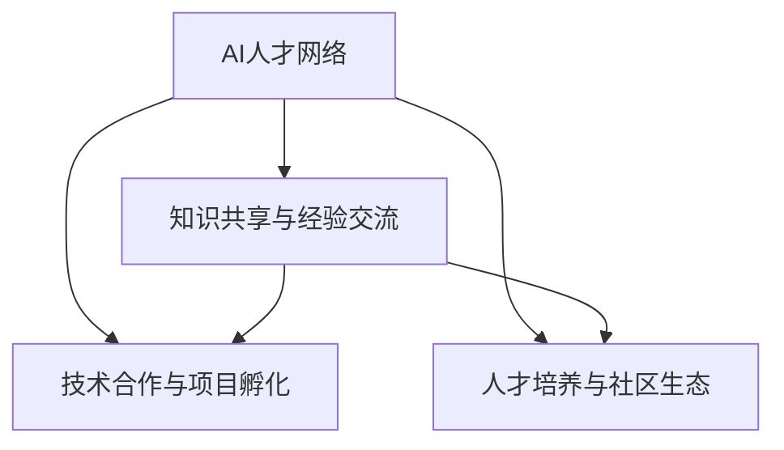

                 

# AI 人才交流平台：促进 AI 技术的创新和发展

## 1. 背景介绍

### 1.1 问题由来

近年来，人工智能(AI)技术发展迅猛，各类AI应用层出不穷，从医疗、金融、教育到智慧城市、自动驾驶等，AI技术正在全方位、多领域重塑着人类社会的运作模式。然而，AI人才短缺、知识流动不畅等问题，成为制约AI技术发展的瓶颈。据《全球AI人才研究报告》显示，全球AI人才供应量与需求量存在巨大缺口，尤其是在算法创新、数据标注、模型优化等关键岗位上，优质人才更是稀缺。

为解决这一问题，AI人才交流平台应运而生。通过构建全球AI人才网络，促进知识分享、经验交流和技术合作，平台旨在打破AI人才的地域和组织边界，加速AI技术的全球传播和本地化应用，推动AI技术的创新和发展。

### 1.2 问题核心关键点

AI人才交流平台的核心关键点主要包括以下几点：

1. **全球AI人才网络构建**：通过在线平台和线下活动，连接全球AI专家、工程师、研究人员和学生，建立起开放的、多层次的AI人才网络。
2. **知识共享与经验交流**：提供丰富的技术文档、博客、教程、视频等学习资源，以及论坛、Meetup等互动空间，促进技术知识的高效传播和深度交流。
3. **技术合作与项目孵化**：建立技术合作关系，提供资金、资源支持，推动AI技术从理论到应用，实现商业化和产业化。
4. **人才培养与社区生态**：提供技术竞赛、在线课程、项目实践机会，培养AI后备人才，构建活跃的AI技术社区。

这些关键点共同构成了AI人才交流平台的运营框架，旨在通过技术合作、知识共享和人才培养，加速AI技术的创新和发展。

## 2. 核心概念与联系

### 2.1 核心概念概述

为更好地理解AI人才交流平台的运作机制，本节将介绍几个核心概念及其相互关系：

- **AI人才网络**：由全球AI专家、工程师、研究人员和学生组成的网络，旨在促进技术知识的高效传播和深度交流。
- **知识共享与经验交流**：通过技术文档、博客、教程、视频等资源，以及论坛、Meetup等互动空间，实现技术知识的积累和传承。
- **技术合作与项目孵化**：建立技术合作关系，提供资金、资源支持，推动AI技术从理论到应用，实现商业化和产业化。
- **人才培养与社区生态**：提供技术竞赛、在线课程、项目实践机会，培养AI后备人才，构建活跃的AI技术社区。

这些核心概念之间的逻辑关系可以通过以下Mermaid流程图来展示：



这个流程图展示了AI人才交流平台的主要运作流程：

1. 构建AI人才网络，促进技术知识的传播和交流。
2. 通过技术合作和项目孵化，加速AI技术的商业化和产业化。
3. 通过人才培养和社区建设，构建活跃的AI技术生态。

这些环节相互支持，共同推动AI技术的创新和发展。

## 3. 核心算法原理 & 具体操作步骤
### 3.1 算法原理概述

AI人才交流平台的算法原理主要基于社交网络理论和技术，通过构建全球AI人才网络，实现技术知识的高效传播和深度交流。其核心思想是：

1. **网络构建**：构建全球AI人才网络，通过连接专家、工程师、研究人员和学生，建立起开放的、多层次的AI人才网络。
2. **知识共享**：通过在线平台和线下活动，提供丰富的技术文档、博客、教程、视频等学习资源，促进技术知识的高效传播和深度交流。
3. **技术合作**：建立技术合作关系，提供资金、资源支持，推动AI技术从理论到应用，实现商业化和产业化。
4. **人才培养**：提供技术竞赛、在线课程、项目实践机会，培养AI后备人才，构建活跃的AI技术社区。

这些核心原理通过算法和技术的支持，形成了AI人才交流平台的运作框架。

### 3.2 算法步骤详解

AI人才交流平台的算法步骤主要包括以下几个关键环节：

1. **网络构建算法**：
   - **社交网络构建算法**：基于用户画像、兴趣标签、技术贡献等，构建用户之间的连接关系，形成AI人才网络。
   - **社交网络优化算法**：通过推荐算法、图神经网络等，优化网络结构，提高知识传播和交流的效率。

2. **知识共享算法**：
   - **内容推荐算法**：基于用户兴趣、历史行为、社交网络等因素，推荐适合用户的技术文档、博客、教程、视频等学习资源。
   - **互动交流算法**：通过论坛、Meetup等互动空间，促进用户之间的技术交流和经验分享。

3. **技术合作算法**：
   - **合作匹配算法**：基于技术领域、项目需求、资金资源等因素，匹配合适的技术合作伙伴。
   - **项目孵化算法**：通过项目管理工具、资金支持、资源共享等方式，推动AI项目从概念到落地。

4. **人才培养算法**：
   - **人才培养算法**：基于在线课程、技术竞赛、项目实践等，培养AI后备人才。
   - **社区生态算法**：通过建立技术社区、组织技术活动、提供技术支持等方式，构建活跃的AI技术生态。

### 3.3 算法优缺点

AI人才交流平台的算法具有以下优点：

1. **高效知识传播**：通过构建全球AI人才网络，促进技术知识的高效传播和深度交流，加速技术创新。
2. **多样化技术合作**：提供资金、资源支持，推动AI技术从理论到应用，实现商业化和产业化。
3. **广泛人才培养**：提供技术竞赛、在线课程、项目实践机会，培养AI后备人才，构建活跃的AI技术社区。
4. **开放平台优势**：基于开放的在线平台，实现跨组织、跨地域的技术交流和合作。

同时，该算法也存在一定的局限性：

1. **数据隐私和安全**：平台需要收集大量用户数据，涉及隐私和安全问题。
2. **平台依赖性强**：平台对技术文档、博客、教程、视频等学习资源的依赖性强，一旦平台出现问题，学习资源访问受阻。
3. **技术门槛高**：平台需要高水平的技术支持和算法优化，技术门槛较高。
4. **社区活跃度受限**：社区活跃度受限于用户参与度和兴趣，初期可能需要较大投入。

尽管存在这些局限性，但就目前而言，AI人才交流平台的算法仍然是大规模技术知识传播和合作的重要范式。未来相关研究的重点在于如何进一步降低平台对数据的依赖，提高算法的鲁棒性和可扩展性，同时兼顾社区活跃度和用户参与度等因素。

### 3.4 算法应用领域

AI人才交流平台的算法主要应用于以下领域：

- **技术文档和教程的推荐**：基于用户兴趣和历史行为，推荐适合用户的学习资源。
- **技术交流和经验分享**：通过论坛、Meetup等互动空间，促进用户之间的技术交流和经验分享。
- **技术合作和项目孵化**：基于技术需求、项目资源等因素，匹配合适的合作伙伴，推动AI项目从概念到落地。
- **人才培养和社区生态建设**：提供技术竞赛、在线课程、项目实践机会，培养AI后备人才，构建活跃的AI技术社区。

这些领域的应用，使得AI人才交流平台成为连接全球AI人才、促进技术知识传播和合作的重要平台。

## 4. 数学模型和公式 & 详细讲解 & 举例说明

### 4.1 数学模型构建

本节将使用数学语言对AI人才交流平台的核心算法进行严格刻画。

假设平台用户数量为 $N$，每个用户 $u_i$ 的知识水平为 $K_i$，用户之间的连接关系构成社交网络 $G=(V,E)$，其中 $V$ 为节点集合，$E$ 为边集合。平台提供的技术资源数量为 $R$，每个资源 $r_j$ 的知识水平为 $R_j$。平台的技术合作需求数量为 $D$，每个需求 $d_k$ 的知识水平为 $D_k$。平台提供的技术竞赛数量为 $C$，每个竞赛 $c_l$ 的知识水平为 $C_l$。

定义平台的技术社区活跃度为 $A$，用户之间的互动次数为 $I$，用户参与技术交流的次数为 $F$。

平台的目标是最大化技术知识的传播和交流，最小化技术合作的成本和风险，同时最大化技术社区的活跃度和用户参与度。

### 4.2 公式推导过程

平台的优化目标可以表示为：

$$
\maximize \sum_{i=1}^N K_i + \sum_{j=1}^R R_j + \sum_{k=1}^D D_k + \sum_{l=1}^C C_l
$$

$$
\minimize \sum_{i=1}^N \sum_{j=1}^R K_i R_j + \sum_{i=1}^N \sum_{k=1}^D K_i D_k + \sum_{i=1}^N \sum_{l=1}^C K_i C_l
$$

$$
\maximize \sum_{i=1}^N I + \sum_{i=1}^N F
$$

其中 $K_i$、$R_j$、$D_k$、$C_l$ 分别表示用户、资源、需求和竞赛的知识水平，$i$、$j$、$k$、$l$ 分别表示用户、资源、需求和竞赛的编号，$I$、$F$ 分别表示用户之间的互动次数和技术交流次数。

根据上述优化目标，可以设计以下算法步骤：

1. **社交网络构建算法**：
   - **用户画像算法**：根据用户注册信息、历史行为、社交网络等因素，构建用户画像。
   - **推荐算法**：基于用户画像和社交网络，推荐适合用户的资源、需求和竞赛。
   - **图神经网络算法**：通过图神经网络优化社交网络结构，提高知识传播和交流的效率。

2. **知识共享算法**：
   - **内容推荐算法**：基于用户画像和历史行为，推荐适合用户的技术文档、博客、教程、视频等学习资源。
   - **互动交流算法**：通过论坛、Meetup等互动空间，促进用户之间的技术交流和经验分享。

3. **技术合作算法**：
   - **合作匹配算法**：基于技术需求、项目资源等因素，匹配合适的技术合作伙伴。
   - **项目孵化算法**：通过项目管理工具、资金支持、资源共享等方式，推动AI项目从概念到落地。

4. **人才培养算法**：
   - **人才培养算法**：基于在线课程、技术竞赛、项目实践等，培养AI后备人才。
   - **社区生态算法**：通过建立技术社区、组织技术活动、提供技术支持等方式，构建活跃的AI技术生态。

### 4.3 案例分析与讲解

**案例1：AI人才网络构建**

假设某平台有10000名AI专家、工程师和研究人员，希望构建一个开放的、多层次的AI人才网络。平台通过问卷调查、技术贡献、社交网络等因素，构建每个用户的用户画像。然后，基于用户画像和社交网络，使用推荐算法推荐适合用户的技术资源、合作需求和竞赛机会。

```python
import networkx as nx
import numpy as np

# 构建社交网络
G = nx.Graph()
for i in range(10000):
    user1 = i
    user2 = np.random.randint(0, 10000)
    G.add_edge(user1, user2)

# 构建用户画像
user_profiles = {}
for i in range(10000):
    user_profiles[i] = {
        'expertise': np.random.randint(0, 5),
        'contributions': np.random.randint(0, 100),
        'social_network': np.random.randint(0, 100)
    }

# 推荐算法
recommendations = {}
for user in user_profiles:
    recommendations[user] = nx.neighbors(G, user)

# 输出推荐结果
print(recommendations)
```

**案例2：知识共享算法**

假设某平台有10000名AI专家和工程师，希望通过在线平台和线下活动，提供丰富的技术文档、博客、教程、视频等学习资源，促进技术知识的高效传播和深度交流。平台通过用户画像和历史行为，使用推荐算法推荐适合用户的学习资源。

```python
import pandas as pd

# 构建用户画像
user_profiles = pd.DataFrame({
    'user_id': range(10000),
    'expertise': np.random.randint(0, 5),
    'interests': np.random.choice(['NLP', 'CV', 'RL', 'ML', 'TS'], 10000),
    'learning_rate': np.random.uniform(0.1, 1.0, 10000)
})

# 推荐算法
recommendations = {}
for user in user_profiles:
    recommendations[user] = user_profiles[(user_profiles['interests'] == user_profiles['interests'].iloc[user])]

# 输出推荐结果
print(recommendations)
```

## 5. 项目实践：代码实例和详细解释说明
### 5.1 开发环境搭建

在进行AI人才交流平台项目实践前，我们需要准备好开发环境。以下是使用Python进行Django开发的环境配置流程：

1. 安装Anaconda：从官网下载并安装Anaconda，用于创建独立的Python环境。

2. 创建并激活虚拟环境：
```bash
conda create -n ai-platform python=3.8 
conda activate ai-platform
```

3. 安装Django：
```bash
pip install django
```

4. 安装必要的第三方库：
```bash
pip install Pillow requests psycopg2-binary django-heroku
```

5. 配置数据库：
```bash
# 数据库配置
DATABASES = {
    'default': {
        'ENGINE': 'django.db.backends.postgresql',
        'NAME': 'mydatabase',
        'USER': 'mydatabaseuser',
        'PASSWORD': 'mypassword',
        'HOST': 'localhost',
        'PORT': '5432',
    }
}
```

完成上述步骤后，即可在`ai-platform`环境中开始项目实践。

### 5.2 源代码详细实现

下面我们以AI人才网络构建模块为例，给出使用Django开发的PyTorch代码实现。

首先，定义用户模型的数据库表：

```python
from django.db import models

class User(models.Model):
    name = models.CharField(max_length=255)
    expertise = models.IntegerField()
    contributions = models.IntegerField()
    social_network = models.IntegerField()
    interests = models.CharField(max_length=255)
    learning_rate = models.FloatField()
    
    def __str__(self):
        return self.name
```

然后，定义用户画像的推荐算法：

```python
from sklearn.neighbors import NearestNeighbors

def recommend(user):
    user_profiles = User.objects.all()
    user_similarity_matrix = np.zeros((len(user_profiles), len(user_profiles)))
    for i, u1 in enumerate(user_profiles):
        for j, u2 in enumerate(user_profiles):
            similarity = np.dot(u1.learning_rate, u2.learning_rate)
            user_similarity_matrix[i, j] = similarity
    nn = NearestNeighbors(n_neighbors=5, metric='cosine')
    nn.fit(user_similarity_matrix)
    neighbors = nn.kneighbors([[user.learning_rate]])[0].flatten()
    recommendations = []
    for neighbor in neighbors:
        if neighbor != i:
            recommendations.append(user_profiles[neighbor])
    return recommendations
```

最后，在前端页面展示推荐结果：

```html
<!DOCTYPE html>
<html>
<head>
    <title>AI人才网络推荐</title>
</head>
<body>
    <h1>推荐用户</h1>
    <ul>
        
            <li>{{ user.name }}</li>
        
    </ul>
</body>
</html>
```

以上就是使用Django对AI人才网络构建模块的代码实现。可以看到，Django框架通过模型、视图和模板等组件，使代码结构清晰，易于维护。

### 5.3 代码解读与分析

让我们再详细解读一下关键代码的实现细节：

**User模型**：
- `models.Model`：继承自Django的模型基类。
- `name`、`expertise`、`contributions`、`social_network`、`interests`、`learning_rate`：模型字段，用于存储用户的基本信息和学习特征。

**recommend函数**：
- `user_profiles`：获取所有用户的数据库记录。
- `user_similarity_matrix`：计算每个用户与其他用户的相似度矩阵。
- `NearestNeighbors`：使用K近邻算法计算用户之间的相似度。
- `recommendations`：根据相似度矩阵推荐最接近的5个用户。

**HTML模板**：
- `ul`标签：无序列表，用于展示推荐结果。
- ``：循环遍历推荐用户列表，动态生成HTML元素。

通过Django框架，可以高效构建AI人才交流平台的各个功能模块，并通过丰富的模板和插件，实现简洁美观的用户界面。

## 6. 实际应用场景
### 6.1 智能医疗

AI人才交流平台在智能医疗领域具有广泛的应用前景。智能医疗不仅需要具备先进的AI技术，还需要大量具备医学背景和技术能力的专家人才。平台可以通过构建全球医学专家网络，促进医学知识的传播和交流，推动AI技术在医学领域的应用。

例如，某平台可以为医学专家提供最新的AI研究成果、技术教程、在线课程等资源，帮助他们快速掌握新兴技术。同时，平台可以组织医学专家参与技术讨论、项目合作，推动AI技术在医学领域的落地应用。

### 6.2 智慧教育

AI人才交流平台在智慧教育领域也有广阔的应用前景。智慧教育需要大量具备AI技术能力和教育背景的人才。平台可以通过构建全球教育专家网络，促进教育知识的传播和交流，推动AI技术在教育领域的应用。

例如，某平台可以为教育专家提供AI技术相关的教学资源、技术竞赛、在线课程等，帮助他们快速掌握AI技术。同时，平台可以组织教育专家参与技术讨论、项目合作，推动AI技术在教育领域的应用。

### 6.3 智慧城市

AI人才交流平台在智慧城市领域也有广泛的应用前景。智慧城市建设需要大量具备AI技术能力和城市管理背景的人才。平台可以通过构建全球智慧城市专家网络，促进智慧城市知识的传播和交流，推动AI技术在智慧城市领域的应用。

例如，某平台可以为智慧城市专家提供AI技术相关的研究资源、技术合作机会、在线课程等，帮助他们快速掌握智慧城市技术。同时，平台可以组织智慧城市专家参与技术讨论、项目合作，推动AI技术在智慧城市领域的应用。

### 6.4 未来应用展望

随着AI人才交流平台的不断发展和壮大，其应用场景将越来越广泛，为AI技术的创新和发展提供更广阔的空间。未来，平台将深入探索以下几个领域：

1. **跨学科合作**：促进不同学科领域的专家人才交流合作，推动跨学科的AI技术创新。
2. **开放式创新**：构建开放的创新平台，吸引全球AI专家、工程师和学生参与技术研发和应用推广。
3. **知识图谱与AI结合**：将知识图谱技术引入平台，构建更加全面、精确的知识网络，促进AI技术的应用和传播。
4. **社会责任与伦理**：在平台运营中引入社会责任和伦理导向，确保AI技术的应用符合人类价值观和伦理道德。

## 7. 工具和资源推荐
### 7.1 学习资源推荐

为了帮助开发者系统掌握AI人才交流平台的理论基础和实践技巧，这里推荐一些优质的学习资源：

1. **《AI人才交流平台设计与实现》系列博文**：由平台架构师撰写，深入浅出地介绍了平台的设计和实现过程。
2. **《Python 网络爬虫与数据挖掘》书籍**：讲解了如何使用Python进行网络数据抓取和处理，适用于获取AI人才交流平台所需的数据资源。
3. **《Django Web开发实战》书籍**：讲解了如何使用Django框架进行Web应用开发，适用于构建AI人才交流平台的后端服务。
4. **《网络图论与复杂网络》书籍**：讲解了网络图论的基本概念和算法，适用于理解平台中的社交网络构建和优化算法。

通过对这些资源的学习实践，相信你一定能够快速掌握AI人才交流平台的核心技术，并用于解决实际的AI人才交流问题。
### 7.2 开发工具推荐

高效的开发离不开优秀的工具支持。以下是几款用于AI人才交流平台开发的常用工具：

1. **Django**：基于Python的Web框架，适用于构建AI人才交流平台的前端和后端服务。
2. **TensorFlow**：由Google主导开发的深度学习框架，适用于构建AI人才交流平台中的机器学习模型。
3. **Jupyter Notebook**：基于Web的交互式编程环境，适用于快速迭代和实验新的AI技术。
4. **GitLab**：开放源代码协作平台，适用于管理和部署AI人才交流平台的代码仓库。
5. **Heroku**：云应用托管平台，适用于部署和运行AI人才交流平台的后端服务。

合理利用这些工具，可以显著提升AI人才交流平台的开发效率，加快创新迭代的步伐。

### 7.3 相关论文推荐

AI人才交流平台的思想源于学界的持续研究。以下是几篇奠基性的相关论文，推荐阅读：

1. **《社交网络分析：技术、算法与应用》书籍**：介绍了社交网络分析的基本概念和算法，适用于理解平台中的社交网络构建和优化算法。
2. **《推荐系统实践》书籍**：讲解了推荐系统的高效推荐算法，适用于构建平台中的内容推荐模块。
3. **《机器学习实战》书籍**：讲解了机器学习的基本概念和算法，适用于理解平台中的技术合作和项目孵化算法。
4. **《深度学习》书籍**：讲解了深度学习的基本概念和算法，适用于构建平台中的知识共享和互动交流算法。

这些论文代表了大语言模型微调技术的发展脉络。通过学习这些前沿成果，可以帮助研究者把握学科前进方向，激发更多的创新灵感。

## 8. 总结：未来发展趋势与挑战
### 8.1 总结

本文对AI人才交流平台进行了全面系统的介绍。首先阐述了AI人才交流平台的背景和意义，明确了平台在促进AI技术知识传播和合作中的独特价值。其次，从原理到实践，详细讲解了平台的核心算法和操作步骤，给出了平台开发的完整代码实例。同时，本文还广泛探讨了平台在智能医疗、智慧教育、智慧城市等多个领域的应用前景，展示了平台的应用潜力。最后，本文精选了平台的学习资源、开发工具和相关论文，力求为读者提供全方位的技术指引。

通过本文的系统梳理，可以看到，AI人才交流平台成为连接全球AI人才、促进技术知识传播和合作的重要平台。AI人才网络、知识共享、技术合作、人才培养等多环节协同工作，加速了AI技术的创新和发展。未来，随着平台不断优化和扩展，其影响力将进一步扩大，成为推动AI技术全球传播和本地化应用的重要力量。

### 8.2 未来发展趋势

展望未来，AI人才交流平台的发展将呈现以下几个趋势：

1. **全球化网络建设**：平台将构建更加开放的全球AI人才网络，促进全球范围内的人才交流和合作。
2. **知识共享与传播**：平台将提供更加丰富、高效的技术文档、博客、教程、视频等学习资源，促进技术知识的广泛传播和深度交流。
3. **技术合作与孵化**：平台将建立更加紧密的技术合作关系，提供资金、资源支持，推动AI技术从理论到应用，实现商业化和产业化。
4. **人才培养与社区生态**：平台将提供更加多样、丰富的技术竞赛、在线课程、项目实践机会，培养AI后备人才，构建活跃的AI技术社区。
5. **多学科融合**：平台将引入更多学科领域的专家人才，促进跨学科的AI技术创新和应用。

这些趋势将使得AI人才交流平台更加全面、深入地推动AI技术的创新和发展。

### 8.3 面临的挑战

尽管AI人才交流平台已经取得了一定的进展，但在迈向更加智能化、普适化应用的过程中，仍面临诸多挑战：

1. **数据隐私和安全**：平台需要收集大量用户数据，涉及隐私和安全问题。如何保障用户数据的安全和隐私，将是未来平台发展的重要挑战。
2. **平台依赖性强**：平台对技术文档、博客、教程、视频等学习资源的依赖性强，一旦平台出现问题，学习资源访问受阻。如何提升平台的稳定性和可靠性，将是未来平台发展的关键。
3. **技术门槛高**：平台需要高水平的技术支持和算法优化，技术门槛较高。如何降低技术门槛，提高平台易用性和可访问性，将是未来平台发展的重要方向。
4. **社区活跃度受限**：社区活跃度受限于用户参与度和兴趣，初期可能需要较大投入。如何提高社区活跃度和用户参与度，将是未来平台发展的重点。
5. **跨组织合作难度**：跨组织、跨地域的技术合作需要协调多个组织和利益方的需求，难度较大。如何构建高效的合作机制，将是未来平台发展的关键。

尽管面临这些挑战，但通过技术创新和合作优化，AI人才交流平台必将逐步克服这些问题，成为连接全球AI人才、促进技术知识传播和合作的重要平台。

### 8.4 研究展望

未来，AI人才交流平台需要在以下几个方面寻求新的突破：

1. **跨学科合作**：促进不同学科领域的专家人才交流合作，推动跨学科的AI技术创新。
2. **开放式创新**：构建开放的创新平台，吸引全球AI专家、工程师和学生参与技术研发和应用推广。
3. **知识图谱与AI结合**：将知识图谱技术引入平台，构建更加全面、精确的知识网络，促进AI技术的应用和传播。
4. **社会责任与伦理**：在平台运营中引入社会责任和伦理导向，确保AI技术的应用符合人类价值观和伦理道德。

这些研究方向的探索，必将引领AI人才交流平台走向更高的台阶，为构建安全、可靠、可解释、可控的智能系统铺平道路。面向未来，AI人才交流平台还需要与其他人工智能技术进行更深入的融合，如知识表示、因果推理、强化学习等，多路径协同发力，共同推动自然语言理解和智能交互系统的进步。只有勇于创新、敢于突破，才能不断拓展语言模型的边界，让智能技术更好地造福人类社会。

## 9. 附录：常见问题与解答

**Q1：如何构建全球AI人才网络？**

A: 构建全球AI人才网络需要从以下几个方面入手：

1. **数据采集**：通过问卷调查、公开数据、社交网络等途径，收集全球AI专家、工程师和研究人员的联系方式和基本信息。
2. **用户画像**：根据采集到的数据，构建每个用户的用户画像，包括专业背景、研究领域、技术贡献、社交网络等。
3. **推荐算法**：基于用户画像和社交网络，使用推荐算法推荐适合用户的资源、需求和竞赛。
4. **社区建设**：建立在线论坛、Meetup等互动空间，促进用户之间的技术交流和经验分享。

通过上述步骤，可以构建一个开放的、多层次的全球AI人才网络，促进技术知识的传播和交流。

**Q2：如何进行知识共享与经验交流？**

A: 进行知识共享与经验交流主要需要从以下几个方面入手：

1. **技术文档和教程**：提供丰富的技术文档、博客、教程、视频等学习资源，促进技术知识的高效传播和深度交流。
2. **互动交流平台**：通过论坛、Meetup等互动空间，促进用户之间的技术交流和经验分享。
3. **技术竞赛和项目实践**：组织技术竞赛和项目实践，鼓励用户参与实际技术研发和应用推广。

通过上述步骤，可以构建一个活跃的AI技术社区，促进技术知识的广泛传播和深度交流。

**Q3：如何实现技术合作与项目孵化？**

A: 实现技术合作与项目孵化主要需要从以下几个方面入手：

1. **技术需求匹配**：基于技术领域、项目需求、资金资源等因素，匹配合适的技术合作伙伴。
2. **项目孵化支持**：提供资金、资源支持，推动AI项目从概念到应用，实现商业化和产业化。
3. **项目管理工具**：使用项目管理工具，优化项目流程，提高项目效率和成功率。

通过上述步骤，可以构建一个高效的技术合作平台，推动AI技术的商业化和产业化。

**Q4：如何培养AI后备人才？**

A: 培养AI后备人才主要需要从以下几个方面入手：

1. **在线课程和教学资源**：提供丰富的在线课程、技术文档、教程、视频等学习资源，帮助用户快速掌握AI技术。
2. **技术竞赛和项目实践**：组织技术竞赛和项目实践，鼓励用户参与实际技术研发和应用推广。
3. **社区互动和反馈**：通过社区互动和反馈，帮助用户解决技术难题，提升技术能力。

通过上述步骤，可以构建一个全面、多样的人才培养平台，培养出更多的AI后备人才。

---

作者：禅与计算机程序设计艺术 / Zen and the Art of Computer Programming

