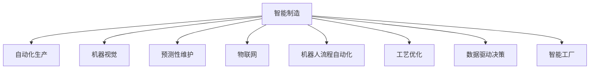

                 

# AI 在制造领域的应用：智能制造、自动化生产

> 关键词：智能制造, 自动化生产, 机器视觉, 预测性维护, 物联网, 机器人流程自动化(RPA), 工艺优化, 数据驱动决策, 智能工厂

## 1. 背景介绍

### 1.1 问题由来
随着信息技术的快速发展和全球制造业的转型升级，智能制造和自动化生产逐渐成为未来工业发展的主流趋势。传统的制造模式依赖大量人工操作和低效的流程控制，难以适应个性化、定制化、大规模生产的需求。而通过引入人工智能技术，可以大幅提升生产效率、降低运营成本、提高产品质量和市场响应速度。

智能制造和自动化生产利用物联网、大数据、云计算、机器学习等技术，实现制造流程的数字化、智能化，提升制造环境的感知、决策和执行能力。具体来说，智能制造包括工厂生产全流程的数字化建模、数据驱动的决策分析、实时可视化的监控管理、以及自动化执行的智能机器人等。

### 1.2 问题核心关键点
智能制造和自动化生产的核心关键点在于：

1. **数字化转型**：将传统制造流程进行数字化建模，建立全面的数字孪生体，实现对生产过程的全面监控和优化。
2. **数据驱动决策**：利用先进的数据分析技术和AI算法，对制造数据进行建模、分析和预测，驱动智能决策。
3. **自动化执行**：通过引入机器人、自动化设备等智能化工具，实现生产执行的自动化，提升作业效率和安全性。
4. **智能维护**：应用预测性维护、状态监测等技术，预防设备故障，减少停机时间，提升设备可靠性。
5. **人机协同**：在智能制造中，人类工人和智能系统进行紧密协作，充分发挥各自优势，提升生产效率和质量。

这些关键点共同构成了智能制造和自动化生产的核心框架，使其在提升生产效率、降低成本、增强灵活性和质量控制等方面，具有显著优势。

### 1.3 问题研究意义
研究AI在制造领域的应用，对于推动制造业的数字化、智能化转型，具有重要意义：

1. **提升生产效率**：通过智能化生产流程的优化，大幅提升作业效率，减少人力成本。
2. **降低运营成本**：自动化设备和AI算法的应用，减少废品率，降低能耗，优化资源配置。
3. **提高产品质量**：利用AI进行质量检测和异常分析，提升产品质量和一致性。
4. **增强市场响应速度**：智能制造能够快速响应市场需求，提供个性化、定制化产品。
5. **促进产业升级**：AI技术的引入，推动制造行业的升级换代，提高整体竞争力。

## 2. 核心概念与联系

### 2.1 核心概念概述

为更好地理解AI在制造领域的应用，本节将介绍几个密切相关的核心概念：

- **智能制造**：指将人工智能与物联网、大数据、云计算等技术相结合，实现制造流程的数字化、智能化，提升生产效率和产品质量。
- **自动化生产**：通过引入机器人、自动化设备等智能化工具，实现生产执行的自动化，降低人工成本，提高作业效率。
- **机器视觉**：利用计算机视觉技术，对生产过程中的产品、设备、环境等进行实时监测和识别，实现自动化检测和质量控制。
- **预测性维护**：应用机器学习、时间序列分析等技术，对设备运行状态进行预测，预防设备故障，减少停机时间。
- **物联网**：通过传感器、通信技术等，实现制造环境的全面联网，进行实时数据采集和监控。
- **机器人流程自动化(RPA)**：应用自动化技术，实现生产流程的自动化，减少人工干预，提高作业效率和准确性。
- **工艺优化**：利用AI技术，对生产工艺进行优化，提高生产效率，降低成本。
- **数据驱动决策**：通过数据分析和机器学习，对制造数据进行建模、分析和预测，驱动智能决策。
- **智能工厂**：综合应用上述技术，实现从产品设计、生产制造到交付的全面智能化，提升工厂的运营效率和灵活性。

这些核心概念之间的逻辑关系可以通过以下Mermaid流程图来展示：



这个流程图展示出智能制造和自动化生产中各项技术的应用场景：

1. 自动化生产是智能制造的基础，通过引入智能化设备实现作业自动化。
2. 机器视觉用于生产过程中的产品检测和质量控制，确保产品的一致性和可靠性。
3. 预测性维护通过数据分析和机器学习，对设备运行状态进行预测，避免故障发生。
4. 物联网实现全厂区的联网监控，采集和传输实时数据。
5. RPA用于生产流程的自动化，减少人工干预，提高效率。
6. 工艺优化通过AI技术优化生产流程，提高效率，降低成本。
7. 数据驱动决策利用数据分析和机器学习，驱动智能决策，优化生产计划和资源配置。
8. 智能工厂综合应用上述技术，实现从设计到交付的全面智能化。

这些核心概念共同构成了智能制造和自动化生产的核心框架，为其带来更高效、更灵活、更可靠的生产环境。

## 3. 核心算法原理 & 具体操作步骤
### 3.1 算法原理概述

AI在制造领域的应用，主要依赖于数据驱动的决策模型和自动化执行系统。其核心算法原理包括：

- **机器学习与深度学习**：利用历史生产数据进行模型训练，预测生产过程中的各种参数和结果。
- **计算机视觉**：通过图像处理和模式识别技术，实现产品检测、质量控制和设备状态监测。
- **预测性维护**：应用时间序列分析和机器学习技术，预测设备故障和维护需求，提高设备可靠性。
- **优化算法**：通过优化算法对生产流程进行优化，提升效率和质量。
- **智能决策**：通过数据分析和机器学习，实现智能决策，优化生产计划和资源配置。

这些算法共同构成了AI在制造领域的基础，实现从数据采集、处理、分析到决策和执行的全面智能化。

### 3.2 算法步骤详解

AI在制造领域的应用，通常包括以下几个关键步骤：

**Step 1: 数据采集和预处理**
- 收集生产过程中的各类数据，包括传感器数据、生产设备数据、质量检测数据等。
- 对数据进行清洗、去重、归一化等预处理，确保数据质量。

**Step 2: 模型训练与优化**
- 选择合适的机器学习或深度学习模型，利用历史生产数据进行训练和调参。
- 通过交叉验证等技术，优化模型性能，避免过拟合和欠拟合。
- 应用超参数搜索、正则化技术等，提升模型泛化能力。

**Step 3: 模型部署与监控**
- 将训练好的模型部署到生产环境中，实时监控生产数据。
- 应用自动化执行系统，如机器人、自动化设备等，执行智能化决策。
- 通过可视化工具，实时展示生产状态和决策结果，支持实时监控和调整。

**Step 4: 反馈与迭代**
- 根据生产结果和监控数据，不断优化模型和执行系统。
- 利用反馈机制，持续改进生产流程，提升效率和质量。
- 引入新的技术工具和算法，实现持续创新和升级。

通过上述步骤，可以全面实现AI在制造领域的应用，构建高效、灵活、智能的生产环境。

### 3.3 算法优缺点

AI在制造领域的应用，具有以下优点：

1. **提升生产效率**：通过自动化和智能化技术，大幅提高作业效率，减少人工干预。
2. **降低运营成本**：减少废品率，优化资源配置，降低能源消耗和人工成本。
3. **提高产品质量**：利用AI进行质量检测和异常分析，提升产品质量和一致性。
4. **增强市场响应速度**：灵活调整生产计划，快速响应市场需求，提供个性化、定制化产品。
5. **促进产业升级**：推动制造业的数字化、智能化转型，提升整体竞争力。

同时，也存在一些局限性：

1. **数据质量问题**：生产数据的采集和处理需要严格的管理和监控，数据质量问题可能影响模型性能。
2. **技术复杂性**：AI技术的应用需要较高的技术门槛，需要专业技术人员进行维护和优化。
3. **设备成本高**：智能化设备和高性能计算资源可能带来较高的初始投资成本。
4. **安全性问题**：智能系统可能面临网络攻击、数据泄露等安全风险，需要加强防护措施。
5. **人机协同问题**：AI系统需要与人类工人紧密协作，需要注意人机协同的效率和安全性。

尽管存在这些局限性，但AI在制造领域的应用前景广阔，未来有望在提升生产效率、降低成本、提高质量等方面发挥重要作用。

### 3.4 算法应用领域

AI在制造领域的应用，覆盖了多个关键环节，具体包括：

- **智能调度**：通过数据分析和优化算法，优化生产计划和资源配置，提升生产效率。
- **质量检测**：利用机器视觉和深度学习技术，实现产品检测和质量控制。
- **设备维护**：应用预测性维护和状态监测技术，预防设备故障，减少停机时间。
- **工艺优化**：利用AI技术优化生产工艺，提高效率，降低成本。
- **智能工厂**：综合应用上述技术，实现从设计到交付的全面智能化，提升工厂的运营效率和灵活性。
- **供应链管理**：应用AI技术优化供应链管理，提升物流效率，减少库存成本。
- **能源管理**：利用AI进行能源优化，降低能耗，提升能源利用效率。

这些应用领域展示了AI在制造领域的广泛应用，为制造行业带来了深刻的变革和提升。

## 4. 数学模型和公式 & 详细讲解  
### 4.1 数学模型构建

在制造领域，AI的应用通常涉及大量的生产数据和设备状态数据。以预测性维护为例，我们可以构建如下的数学模型：

假设有一批设备，每个设备的运行状态可以用一组特征向量 $x_t$ 表示，其中 $t$ 表示时间步。设备运行状态与健康状况之间的关系可以用以下线性回归模型描述：

$$ y_t = \theta_0 + \sum_{i=1}^n \theta_i x_{it} + \epsilon_t $$

其中 $y_t$ 表示设备在时间步 $t$ 的健康状态，$\theta_0, \theta_i$ 为模型的参数，$x_{it}$ 表示设备在时间步 $t$ 的第 $i$ 个特征，$\epsilon_t$ 为随机误差项。

在模型训练阶段，我们需要利用历史数据 $\{(x_{it}, y_{it})\}_{t=1}^{T}$ 进行模型拟合。利用最小二乘法求解参数 $\theta_0, \theta_i$：

$$ \hat{\theta} = \mathop{\arg\min}_{\theta} \sum_{t=1}^T (y_t - \theta_0 - \sum_{i=1}^n \theta_i x_{it})^2 $$

求解上述优化问题，可以得到模型的参数估计值 $\hat{\theta}$。

### 4.2 公式推导过程

利用最小二乘法，对上述线性回归模型进行参数估计：

$$ \hat{\theta} = (\mathbf{X}^T \mathbf{X})^{-1} \mathbf{X}^T \mathbf{y} $$

其中 $\mathbf{X} = [x_{11}, x_{12}, \ldots, x_{1n}, x_{21}, \ldots, x_{2n}, \ldots, x_{N1}, \ldots, x_{Nn}]^T$，$\mathbf{y} = [y_1, y_2, \ldots, y_T]^T$。

### 4.3 案例分析与讲解

以一个简单的制造设备为例，分析预测性维护的数学模型和应用场景。

假设有一台设备，其运行状态可以用温度、振动、电流等特征来描述。设备运行数据如下：

| 时间步 | 温度(C) | 振动(mm) | 电流(A) | 健康状态 |
|-------|--------|--------|--------|--------|
| 1     | 75     | 1.5    | 10     | 1      |
| 2     | 80     | 2.0    | 12     | 1      |
| 3     | 85     | 2.5    | 13     | 0      |
| 4     | 90     | 3.0    | 14     | 1      |
| ...   | ...    | ...    | ...    | ...    |

在设备运行数据中，设备在时间步3出现故障（健康状态为0），我们需要利用预测性维护模型预测设备故障。

根据上述线性回归模型，利用历史数据拟合模型参数：

$$ \hat{\theta} = (\mathbf{X}^T \mathbf{X})^{-1} \mathbf{X}^T \mathbf{y} $$

然后，将新的设备运行状态 $x_t$ 代入模型进行预测：

$$ y_t = \theta_0 + \sum_{i=1}^n \theta_i x_{it} $$

通过对比预测结果和实际健康状态，可以对设备状态进行实时监测和预警，实现预测性维护。

## 5. 项目实践：代码实例和详细解释说明
### 5.1 开发环境搭建

在进行制造领域的AI应用开发前，我们需要准备好开发环境。以下是使用Python进行TensorFlow开发的环境配置流程：

1. 安装Anaconda：从官网下载并安装Anaconda，用于创建独立的Python环境。

2. 创建并激活虚拟环境：
```bash
conda create -n tf-env python=3.8 
conda activate tf-env
```

3. 安装TensorFlow：根据CUDA版本，从官网获取对应的安装命令。例如：
```bash
conda install tensorflow -c tf -c conda-forge
```

4. 安装各类工具包：
```bash
pip install numpy pandas scikit-learn matplotlib tqdm jupyter notebook ipython
```

完成上述步骤后，即可在`tf-env`环境中开始AI应用开发。

### 5.2 源代码详细实现

下面我们以设备预测性维护为例，给出使用TensorFlow进行模型训练和预测的Python代码实现。

首先，定义设备运行状态和特征的DataFrame：

```python
import pandas as pd
import tensorflow as tf

data = pd.DataFrame({
    'time': [1, 2, 3, 4, 5],
    'temperature': [75, 80, 85, 90, 95],
    'vibration': [1.5, 2.0, 2.5, 3.0, 3.5],
    'current': [10, 12, 13, 14, 15],
    'status': [1, 1, 0, 1, 1]
})
```

然后，定义模型和损失函数：

```python
model = tf.keras.Sequential([
    tf.keras.layers.Dense(64, activation='relu', input_shape=(4,)),
    tf.keras.layers.Dense(1)
])

loss_fn = tf.keras.losses.MeanSquaredError()
```

接着，定义训练和评估函数：

```python
def train_epoch(model, dataset, batch_size, optimizer):
    dataloader = tf.data.Dataset.from_tensor_slices(dataset).shuffle(100).batch(batch_size)
    model.compile(optimizer='adam', loss=loss_fn)
    model.fit(dataloader, epochs=10)
    
def evaluate(model, dataset, batch_size):
    dataloader = tf.data.Dataset.from_tensor_slices(dataset).batch(batch_size)
    y_pred = model.predict(dataloader)
    y_true = dataset['status']
    mse = tf.keras.metrics.MeanSquaredError()
    mse(y_true, y_pred).numpy()
```

最后，启动训练流程并在测试集上评估：

```python
train_epoch(model, data, batch_size=32, optimizer=tf.keras.optimizers.Adam(learning_rate=0.01))
evaluate(model, data, batch_size=32)
```

以上就是使用TensorFlow进行设备预测性维护的完整代码实现。可以看到，利用TensorFlow进行模型训练和预测，代码实现相对简洁高效。

### 5.3 代码解读与分析

让我们再详细解读一下关键代码的实现细节：

**设备运行状态和特征的DataFrame**：
- 定义设备运行状态和特征的DataFrame，包含时间步、温度、振动、电流和健康状态等列。

**模型定义**：
- 定义一个包含两个全连接层的神经网络模型，用于拟合设备运行状态和健康状态之间的关系。
- 第一个全连接层64个神经元，使用ReLU激活函数。
- 第二个全连接层1个神经元，用于预测设备健康状态。

**损失函数定义**：
- 定义均方误差损失函数，用于衡量模型预测值与真实值之间的差异。

**训练函数train_epoch**：
- 将数据集划分为训练集，并进行批处理和随机打乱。
- 使用Adam优化器进行模型训练，设置学习率为0.01。
- 训练10个epoch后，返回模型。

**评估函数evaluate**：
- 使用预测函数对数据集进行预测，计算预测值与真实值之间的均方误差。
- 通过均方误差指标评估模型性能。

**训练流程**：
- 定义训练集数据，调用train_epoch函数进行模型训练。
- 调用evaluate函数在测试集上评估模型性能。

可以看到，TensorFlow提供了强大的工具和库支持，可以方便地进行模型定义、训练和评估。开发者可以专注于模型设计和业务逻辑，而无需过多关注底层实现细节。

当然，工业级的系统实现还需考虑更多因素，如模型的保存和部署、超参数的自动搜索、更灵活的任务适配层等。但核心的AI应用开发流程基本与此类似。

## 6. 实际应用场景
### 6.1 智能调度

智能调度是智能制造的核心应用之一，通过AI技术优化生产计划和资源配置，提升生产效率。

以一个智能调度的系统为例，该系统可以实时监测生产线的运行状态，通过优化算法生成最优的生产计划。具体流程如下：

1. 收集生产数据，包括设备运行状态、物料库存、订单需求等。
2. 利用机器学习模型进行预测和优化，生成最优的生产计划。
3. 实时监控生产状态，根据实际情况调整生产计划。
4. 动态调整生产资源，如机器、人员、物料等，保持最优的生产效率。

通过智能调度系统，可以实现生产流程的动态调整和优化，提高生产效率和资源利用率。

### 6.2 质量检测

质量检测是智能制造的重要环节，利用AI技术进行自动化检测和异常分析，提高产品质量和一致性。

以一个质量检测系统为例，该系统可以实时监测生产过程中的产品质量，识别异常并及时处理。具体流程如下：

1. 安装机器视觉设备，采集产品图像和特征。
2. 利用深度学习模型对图像进行特征提取和分类，判断产品质量。
3. 将检测结果与标准值进行比对，识别异常并生成报警。
4. 记录和分析检测数据，不断优化检测模型。

通过质量检测系统，可以实现生产过程中的实时监控和异常处理，提高产品质量和一致性。

### 6.3 预测性维护

预测性维护通过应用机器学习、时间序列分析等技术，对设备运行状态进行预测，预防设备故障，减少停机时间。

以一个预测性维护系统为例，该系统可以实时监测设备运行状态，预测故障并提前进行维护。具体流程如下：

1. 采集设备运行数据，包括温度、振动、电流等特征。
2. 利用时间序列模型或深度学习模型对设备运行状态进行预测。
3. 根据预测结果，生成维护计划。
4. 动态调整维护计划，减少停机时间和维修成本。

通过预测性维护系统，可以实现设备的实时监控和预测性维护，提高设备可靠性，减少维护成本。

### 6.4 未来应用展望

随着AI技术的发展，智能制造和自动化生产将进一步深化和扩展。未来可能的趋势包括：

1. **高度智能化**：智能制造将实现更高程度的智能化，通过AI技术进行全面数据分析和决策，提升生产效率和质量。
2. **自动化生产**：自动化生产将更加普及，智能化设备和自动化流程将取代大部分人工操作，提高生产效率和安全性。
3. **人机协同**：人机协同将更加紧密，AI系统将与人类工人进行高效协作，充分发挥各自优势。
4. **智能工厂**：智能工厂将实现全面智能化，从设计、制造到交付的各环节都将实现数字化和智能化。
5. **跨领域应用**：AI技术将跨领域应用，如智能医疗、智能交通、智能城市等领域，推动各行业的数字化转型。

这些趋势展示了AI在制造领域的应用前景，为制造行业带来了更广阔的发展空间和创新机会。

## 7. 工具和资源推荐
### 7.1 学习资源推荐

为了帮助开发者系统掌握AI在制造领域的应用，这里推荐一些优质的学习资源：

1. 《深度学习》系列书籍：从基础到高级，系统介绍了深度学习的基本原理和应用，涵盖多个领域，包括制造领域。
2. 《TensorFlow实战》系列书籍：通过实际项目和代码实例，帮助读者深入理解TensorFlow的使用和应用。
3. 《机器学习实战》系列书籍：提供了大量的机器学习项目和代码示例，帮助读者实践和应用机器学习技术。
4. 《智能制造：机器学习与深度学习应用》课程：介绍了机器学习和深度学习在制造领域的应用，提供了丰富的实例和案例。
5. 《制造领域的智能优化》视频课程：通过具体案例，讲解了AI在制造领域的优化应用，包括调度、检测、维护等。

通过对这些资源的学习实践，相信你一定能够快速掌握AI在制造领域的应用，并用于解决实际的制造问题。

### 7.2 开发工具推荐

高效的开发离不开优秀的工具支持。以下是几款用于AI在制造领域开发的常用工具：

1. TensorFlow：基于Python的开源深度学习框架，灵活动态的计算图，适合快速迭代研究。
2. PyTorch：基于Python的开源深度学习框架，灵活性高，适合科学研究和原型开发。
3. OpenCV：计算机视觉库，提供丰富的图像处理和模式识别功能。
4. Matplotlib：绘图库，支持多种数据可视化方式，方便展示模型和数据结果。
5. Jupyter Notebook：交互式笔记本环境，方便编写和执行Python代码，支持实时展示结果。
6. TensorBoard：TensorFlow配套的可视化工具，可实时监测模型训练状态，并提供丰富的图表呈现方式。

合理利用这些工具，可以显著提升AI在制造领域的应用开发效率，加快创新迭代的步伐。

### 7.3 相关论文推荐

AI在制造领域的发展，得益于众多学者的持续研究和贡献。以下是几篇奠基性的相关论文，推荐阅读：

1. "Predictive Maintenance of Machinery: A Review"：综述了预测性维护的研究现状和应用案例，提供了丰富的数据和算法。
2. "Manufacturing Quality Control Using Artificial Intelligence: A Review"：介绍了AI在质量检测和控制中的应用，提供了多种模型和算法。
3. "Optimization of Manufacturing Operations Using Artificial Intelligence: A Review"：综述了AI在制造优化中的应用，提供了丰富的案例和模型。
4. "Intelligent Manufacturing: A Survey of Research and Applications"：综述了智能制造的研究现状和应用案例，提供了丰富的数据和算法。
5. "AI for Manufacturing: A Survey of Recent Advances and Future Challenges"：综述了AI在制造领域的研究现状和未来挑战，提供了丰富的案例和数据。

这些论文代表了AI在制造领域的研究方向，为深入了解和应用提供了重要参考。

## 8. 总结：未来发展趋势与挑战
### 8.1 总结

本文对AI在制造领域的应用进行了全面系统的介绍。首先阐述了智能制造和自动化生产的研究背景和意义，明确了AI在制造领域的重要作用。其次，从原理到实践，详细讲解了AI在制造领域的关键算法和操作步骤，提供了代码实例和详细解释。同时，本文还探讨了AI在制造领域的实际应用场景，展示了其在智能调度、质量检测、预测性维护等方面的应用前景。此外，本文精选了相关的学习资源和开发工具，力求为读者提供全方位的技术指引。

通过本文的系统梳理，可以看到，AI在制造领域的应用前景广阔，可以实现生产流程的全面智能化和自动化，提升生产效率和质量。未来，随着AI技术的发展，智能制造和自动化生产将进一步深化和扩展，带来更多的创新和突破。

### 8.2 未来发展趋势

展望未来，AI在制造领域的应用将呈现以下几个发展趋势：

1. **全面智能化**：AI技术将全面应用于制造领域，实现从设计、制造到交付的全面智能化。
2. **高度自动化**：自动化设备和流程将取代大部分人工操作，提高生产效率和安全性。
3. **人机协同**：人机协同将更加紧密，AI系统将与人类工人进行高效协作，充分发挥各自优势。
4. **智能工厂**：智能工厂将实现全面智能化，从设计、制造到交付的各环节都将实现数字化和智能化。
5. **跨领域应用**：AI技术将跨领域应用，如智能医疗、智能交通、智能城市等领域，推动各行业的数字化转型。

这些趋势展示了AI在制造领域的应用前景，为制造行业带来了更广阔的发展空间和创新机会。

### 8.3 面临的挑战

尽管AI在制造领域的应用前景广阔，但在实际落地应用中，仍面临诸多挑战：

1. **数据质量问题**：生产数据的采集和处理需要严格的管理和监控，数据质量问题可能影响模型性能。
2. **技术复杂性**：AI技术的应用需要较高的技术门槛，需要专业技术人员进行维护和优化。
3. **设备成本高**：智能化设备和高性能计算资源可能带来较高的初始投资成本。
4. **安全性问题**：智能系统可能面临网络攻击、数据泄露等安全风险，需要加强防护措施。
5. **人机协同问题**：AI系统需要与人类工人紧密协作，需要注意人机协同的效率和安全性。

尽管存在这些挑战，但随着AI技术的不断发展和应用经验的积累，这些问题有望得到解决。未来，AI在制造领域的应用将更加成熟和可靠，推动制造业的数字化转型和升级。

### 8.4 研究展望

面向未来，AI在制造领域的研究和应用还需要在以下几个方面进行深入探索：

1. **跨领域应用**：AI技术将跨领域应用，推动各行业的数字化转型，带来更多的创新和突破。
2. **模型优化**：通过优化算法和模型结构，提升AI模型的性能和效率，降低资源消耗。
3. **数据融合**：将符号化的先验知识，如知识图谱、逻辑规则等，与神经网络模型进行融合，提高模型的准确性和鲁棒性。
4. **安全性增强**：在模型训练和应用过程中引入安全性约束，保障数据和系统的安全。
5. **人机协同**：进一步优化人机协同机制，提高作业效率和安全性。

这些研究方向的探索，必将引领AI在制造领域的技术发展和应用创新，推动制造业的数字化转型和升级。

## 9. 附录：常见问题与解答
### Q1: 智能制造和自动化生产与传统制造有什么区别？

A: 智能制造和自动化生产与传统制造的主要区别在于：

1. **数字化建模**：智能制造通过数字化建模，实现对生产过程的全方位监控和优化。传统制造则缺乏系统化的数据采集和分析。
2. **数据驱动决策**：智能制造利用先进的数据分析技术和AI算法，驱动智能决策。传统制造则依赖人工经验进行决策。
3. **自动化执行**：智能制造通过引入自动化设备和智能系统，实现生产执行的自动化。传统制造则依赖人工操作和简单的机械自动化。
4. **实时监控和反馈**：智能制造通过物联网和传感器实现实时监控和反馈，及时调整生产计划。传统制造则缺乏实时监控和反馈机制。
5. **人机协同**：智能制造通过人机协同，充分发挥人类和智能系统各自优势。传统制造则依赖单一的人工操作。

这些区别展示了智能制造和自动化生产的优势，为制造行业带来了更高效、更灵活、更可靠的生产环境。

### Q2: 如何选择合适的AI模型？

A: 选择合适的AI模型需要考虑以下几个因素：

1. **任务类型**：不同的任务类型需要使用不同的AI模型。例如，分类任务可以使用逻辑回归、SVM等模型，回归任务可以使用线性回归、神经网络等模型。
2. **数据量和质量**：数据量和质量对模型的选择有重要影响。数据量大且质量高时，可以使用复杂模型，如深度学习模型。数据量小或质量低时，则需要使用简单的模型，如线性回归、决策树等。
3. **计算资源**：模型的计算资源需求也会影响选择。复杂的模型需要更多的计算资源，如GPU、TPU等。
4. **模型性能**：在同等计算资源下，不同的模型性能也有差异。需要进行实验验证，选择最优的模型。

通过综合考虑以上因素，可以选择合适的AI模型，提升模型的性能和应用效果。

### Q3: 在AI应用开发中，如何确保数据安全和隐私保护？

A: 在AI应用开发中，确保数据安全和隐私保护非常重要。以下是一些常见措施：

1. **数据加密**：对敏感数据进行加密处理，防止数据泄露。
2. **访问控制**：设置严格的访问权限，控制数据的使用和访问。
3. **数据匿名化**：对数据进行匿名化处理，保护用户隐私。
4. **安全传输**：使用安全传输协议，如HTTPS，防止数据在传输过程中被截获。
5. **安全存储**：使用安全存储方式，如加密存储、访问控制等，保护数据安全。
6. **审计和监控**：对数据的使用和访问进行审计和监控，及时发现和处理异常情况。

这些措施可以帮助确保数据安全和隐私保护，保障AI应用的可靠性和安全性。

### Q4: 如何优化AI模型，提升其性能和效率？

A: 优化AI模型可以从以下几个方面入手：

1. **模型选择**：选择合适的模型，根据任务类型和数据特点选择最优的模型。
2. **超参数调优**：通过网格搜索、随机搜索等方法，优化模型的超参数，提升模型性能。
3. **数据增强**：利用数据增强技术，扩充数据集，提升模型泛化能力。
4. **正则化**：应用L2正则、Dropout等正则化技术，防止模型过拟合。
5. **模型压缩**：通过剪枝、量化等技术，压缩模型大小，提高模型效率。
6. **加速训练**：通过梯度累积、混合精度训练等技术，加速模型训练。

通过以上措施，可以提升AI模型的性能和效率，实现更好的应用效果。

### Q5: 智能制造中的智能调度系统如何实现？

A: 智能调度系统通常包括以下几个关键步骤：

1. **数据采集**：采集生产过程中的各种数据，包括设备状态、物料库存、订单需求等。
2. **数据处理**：对数据进行清洗、去重、归一化等预处理，确保数据质量。
3. **模型训练**：利用历史生产数据进行模型训练，生成最优的生产计划。
4. **实时监控**：实时监测生产状态，根据实际情况调整生产计划。
5. **动态调整**：动态调整生产资源，如机器、人员、物料等，保持最优的生产效率。

通过智能调度系统，可以实现生产流程的动态调整和优化，提高生产效率和资源利用率。

通过本文的系统梳理，可以看到，AI在制造领域的应用前景广阔，可以实现生产流程的全面智能化和自动化，提升生产效率和质量。未来，随着AI技术的发展，智能制造和自动化生产将进一步深化和扩展，带来更多的创新和突破。

