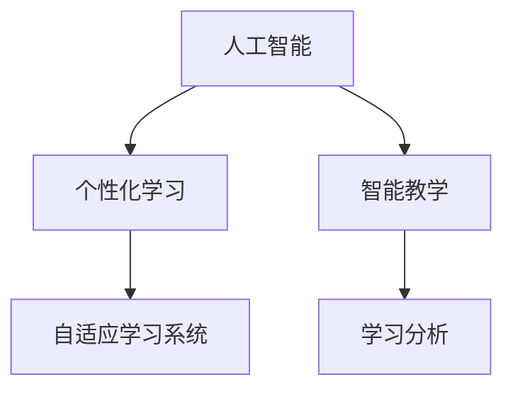

                 

# AI 在教育领域的应用：个性化学习、智能教学

在数字化转型的浪潮中，人工智能（AI）技术正在全面渗透到教育领域，为个性化学习、智能教学等新型教育模式提供了全新的可能性。本文将系统梳理AI在教育中的应用，探讨其原理、操作步骤、具体案例，以及未来趋势和面临的挑战。

## 1. 背景介绍

### 1.1 问题由来
随着互联网和移动设备的普及，人们获取知识的途径更加多元化。传统的“一刀切”教学模式已经无法满足学生个性化的学习需求。AI技术，特别是深度学习技术，以其强大的数据处理和模式识别能力，成为推动个性化学习的重要手段。

### 1.2 问题核心关键点
AI在教育领域的应用主要集中在个性化学习和智能教学两个方向。个性化学习通过分析学生的学习习惯、兴趣、知识水平等数据，为其量身定制学习计划，实现差异化的教学。智能教学则利用AI技术，如自然语言处理、计算机视觉等，辅助教师进行课堂管理、作业批改、答疑等，提升教学效果。

### 1.3 问题研究意义
AI在教育领域的应用，不仅能提升学生的学习效果，还能减轻教师的负担，为教育公平提供技术支持。同时，通过数据分析和反馈机制，可以不断优化教学过程，推动教育系统的整体进步。

## 2. 核心概念与联系

### 2.1 核心概念概述

为更好地理解AI在教育领域的应用，本节将介绍几个密切相关的核心概念：

- **人工智能（AI）**：利用计算机模拟人脑的认知和行为能力，通过数据驱动的学习和推理，实现自动化、智能化操作。
- **个性化学习**：根据每个学生的学习特点和需求，提供量身定制的学习内容和方法，实现因材施教。
- **智能教学**：利用AI技术，自动辅助教师进行课堂管理和教学活动，提高教学质量和效率。
- **自适应学习系统（Adaptive Learning System）**：通过AI技术实时分析学生的学习数据，动态调整学习内容和策略，以适应学生的多样化需求。
- **学习分析（Learning Analytics）**：通过收集和分析学习数据，评估学习效果，提供个性化学习建议，帮助教师优化教学方案。

这些核心概念之间的逻辑关系可以通过以下Mermaid流程图来展示：



这个流程图展示了个AI技术在教育中的主要应用场景：

1. AI提供数据驱动的学习建议，个性化学习系统根据这些建议为学生定制学习计划。
2. AI辅助教师进行课堂管理，智能教学系统则利用这些辅助提升教学效果。
3. 学习分析系统收集和分析学习数据，为个性化学习提供数据支撑。

## 3. 核心算法原理 & 具体操作步骤
### 3.1 算法原理概述

AI在教育中的应用主要基于机器学习算法，尤其是深度学习算法。这些算法通过学习大量样本数据，自动提取特征和规律，实现对学生行为和学习效果的预测和分析。以下以个性化学习和智能教学为例，介绍其核心算法原理。

### 3.2 算法步骤详解

#### 3.2.1 个性化学习算法

**Step 1: 数据收集与预处理**
- 收集学生的学习行为数据，如课堂表现、作业完成情况、测试成绩等。
- 对数据进行清洗和标准化处理，去除噪声和异常值。

**Step 2: 特征工程**
- 提取学生的学习特征，如学习时间、学科成绩、兴趣爱好等。
- 将特征进行编码，转换为模型可处理的数值形式。

**Step 3: 模型训练**
- 选择合适的算法，如决策树、随机森林、神经网络等。
- 使用历史学习数据对模型进行训练，调整模型参数，优化学习效果。

**Step 4: 学习计划生成**
- 根据训练好的模型对当前学生的学习数据进行分析。
- 生成个性化学习计划，包括推荐的学习内容、学习时长、学习方式等。

**Step 5: 反馈与调整**
- 收集学生对学习计划的反馈，持续优化模型参数。
- 定期评估学习效果，根据评估结果调整学习计划。

#### 3.2.2 智能教学算法

**Step 1: 数据收集**
- 收集课堂上的互动数据，如学生的提问次数、回答正确率、参与度等。
- 收集教师的教学数据，如课程内容、教学风格、教学难点等。

**Step 2: 模型训练**
- 使用机器学习算法对数据进行建模，识别学生的学习模式和教师的教学风格。
- 对模型进行优化，提高准确性和鲁棒性。

**Step 3: 智能辅助教学**
- 根据模型预测，为教师提供教学建议，如调整教学策略、重难点讲解等。
- 辅助教师进行课堂管理，如自动解答学生提问、生成课堂互动内容等。

**Step 4: 教学效果评估**
- 收集教学后的效果数据，如学生的学习成果、教师的教学满意度等。
- 对教学效果进行评估，提供改进建议，持续优化教学系统。

### 3.3 算法优缺点

个性化学习和智能教学的AI算法具有以下优点：
- 高效性：通过数据驱动，可以快速分析大量学生数据，生成个性化学习计划和智能教学建议。
- 个性化：能够根据每个学生的学习情况，提供量身定制的解决方案，提升学习效果。
- 灵活性：适应不同学科、不同学习阶段的需求，灵活调整教学策略。

同时，这些算法也存在一定的局限性：
- 数据依赖：模型的准确性高度依赖于数据的数量和质量。
- 模型复杂性：复杂的深度学习模型可能需要较长的训练时间，对计算资源要求较高。
- 解释性不足：黑盒模型的决策过程难以解释，教师和学生难以理解其逻辑。

尽管存在这些局限性，但AI在教育领域的应用前景广阔，未来仍需进一步优化和改进。

### 3.4 算法应用领域

AI在教育中的应用已经覆盖了从基础教育到高等教育的多个层面：

- **基础教育**：通过AI辅助的个性化学习系统，为学生提供因材施教的服务，提升基础教育质量。
- **职业教育**：在技能培训、企业内训等场景中，利用AI进行职业规划、技能评估和职业发展指导。
- **高等教育**：在科研、论文写作、项目管理等高阶学术任务中，AI提供智能辅助和决策支持。
- **终身学习**：利用AI进行知识推荐、学习路径规划，助力终身学习和职业发展。

此外，AI在教育领域的应用还延伸到在线教育、虚拟教室、远程教育等多个场景，为传统教育模式注入了新的活力。

## 4. 数学模型和公式 & 详细讲解 & 举例说明

### 4.1 数学模型构建

为了更加系统地理解AI在教育中的应用，本节将构建一些基本的数学模型，并对其进行详细讲解。

#### 4.1.1 个性化学习模型

假设我们有 $n$ 个学生，每个学生的学习行为可以表示为一个向量 $x_i=(x_{i1}, x_{i2}, \cdots, x_{im})$，其中 $x_{ij}$ 表示学生 $i$ 在特征 $j$ 上的表现。学习效果 $y_i$ 可以表示为向量 $y_i=(y_{i1}, y_{i2}, \cdots, y_{im})$。

个性化学习模型的目标是通过分析 $x_i$ 和 $y_i$，找到最优的权重向量 $w=(w_1, w_2, \cdots, w_m)$，使得模型的预测值 $y'_i=w^T x_i$ 与实际值 $y_i$ 尽量接近。

#### 4.1.2 智能教学模型

智能教学模型通常涉及多类数据，如课堂互动数据 $x_t$、教师教学数据 $x_t'$ 和学生学习数据 $x_s$。模型的目标是预测学生 $i$ 在课程 $t$ 中的学习效果 $y_i$，同时辅助教师调整教学策略 $z_t'$。

使用线性回归模型，可以表示为：
$$
y_i = w_1 x_{ti} + w_2 x_{ti}' + w_3 x_{si} + b
$$

其中 $w_1, w_2, w_3$ 为模型参数，$b$ 为截距。教师可以根据预测结果，动态调整教学策略 $z_t'$。

### 4.2 公式推导过程

以下分别对两个模型的公式进行推导：

#### 4.2.1 个性化学习模型

根据回归模型，目标函数为：
$$
\min_{w} \frac{1}{2} \sum_{i=1}^n ||y_i - w^T x_i||^2 + \lambda ||w||^2
$$

其中 $\lambda$ 为正则化系数。

通过求解上述目标函数，可以得到最优权重向量 $w$。常见的求解方法包括梯度下降法、最小二乘法等。

#### 4.2.2 智能教学模型

目标函数为：
$$
\min_{w_1, w_2, w_3} \sum_{i=1}^n ||y_i - (w_1 x_{ti} + w_2 x_{ti}' + w_3 x_{si} + b)||^2 + \lambda_1 ||w_1||^2 + \lambda_2 ||w_2||^2 + \lambda_3 ||w_3||^2
$$

通过求解上述目标函数，可以得到最优的权重向量 $w_1, w_2, w_3$，进而辅助教师调整教学策略。

### 4.3 案例分析与讲解

假设有一个在线教育平台，想要通过AI实现个性化学习推荐和智能课堂管理。

**案例背景**：某在线教育平台收集了大量学生的学习行为数据，包括课堂参与度、作业完成情况、测试成绩等。平台希望根据这些数据，为每个学生生成个性化的学习计划，并在课堂上提供智能辅助教学。

**解决方案**：

**Step 1: 数据收集与预处理**
- 收集每个学生的学习行为数据，如出勤率、作业完成情况、测试成绩等。
- 对数据进行清洗和标准化处理，去除异常值和噪声。

**Step 2: 特征工程**
- 提取学生的学习特征，如学习时间、学科成绩、兴趣爱好等。
- 将特征进行编码，转换为模型可处理的数值形式。

**Step 3: 模型训练**
- 使用回归算法对历史学习数据进行建模，训练个性化学习模型。
- 对模型进行优化，调整模型参数，提高预测准确性。

**Step 4: 个性化学习计划生成**
- 根据训练好的模型对当前学生的学习数据进行分析。
- 生成个性化学习计划，包括推荐的学习内容、学习时长、学习方式等。

**Step 5: 智能辅助教学**
- 在课堂上，使用AI技术自动识别学生的学习难点和兴趣点。
- 根据学生的学习状态，生成个性化的课堂互动内容，如提问、演示等。

**Step 6: 教学效果评估**
- 收集教学后的效果数据，如学生的学习成果、教师的教学满意度等。
- 对教学效果进行评估，提供改进建议，持续优化教学系统。

## 5. 项目实践：代码实例和详细解释说明

### 5.1 开发环境搭建

在进行AI教育应用开发前，我们需要准备好开发环境。以下是使用Python进行TensorFlow开发的环境配置流程：

1. 安装Anaconda：从官网下载并安装Anaconda，用于创建独立的Python环境。

2. 创建并激活虚拟环境：
```bash
conda create -n tf-env python=3.8 
conda activate tf-env
```

3. 安装TensorFlow：根据CUDA版本，从官网获取对应的安装命令。例如：
```bash
conda install tensorflow tensorflow-gpu -c conda-forge
```

4. 安装各类工具包：
```bash
pip install numpy pandas scikit-learn matplotlib tqdm jupyter notebook ipython
```

完成上述步骤后，即可在`tf-env`环境中开始AI教育应用的开发。

### 5.2 源代码详细实现

下面我们以智能教学系统为例，给出使用TensorFlow进行开发的PyTorch代码实现。

首先，定义智能教学系统的训练函数：

```python
import tensorflow as tf
from tensorflow.keras.layers import Input, Dense, Dropout
from tensorflow.keras.models import Model

# 定义输入层
input_t = Input(shape=(timesteps, features_t))
input_s = Input(shape=(features_s,))

# 定义隐层
x_t = Dense(64, activation='relu')(input_t)
x_s = Dense(64, activation='relu')(input_s)

# 定义输出层
output = Dense(1)(tf.concat([x_t, x_s], axis=1))

# 定义模型
model = Model(inputs=[input_t, input_s], outputs=output)

# 编译模型
model.compile(optimizer=tf.keras.optimizers.Adam(lr=0.001), loss='mse')

# 训练模型
model.fit([X_train, Y_train], y_train, epochs=100, batch_size=32)
```

然后，定义智能教学系统的预测函数：

```python
def predict(model, input_t, input_s):
    x_t = model.layers[0](input_t)
    x_s = model.layers[2](input_s)
    return model.predict([x_t, x_s])
```

最后，定义智能教学系统的应用接口：

```python
from flask import Flask, request, jsonify

app = Flask(__name__)

@app.route('/predict', methods=['POST'])
def predict_api():
    input_t = request.json['input_t']
    input_s = request.json['input_s']
    result = predict(model, input_t, input_s)
    return jsonify(result.tolist())

if __name__ == '__main__':
    app.run(debug=True)
```

以上就是使用TensorFlow进行智能教学系统开发的完整代码实现。可以看到，TensorFlow提供了强大的深度学习库，使得模型的构建和训练过程变得简单易行。

### 5.3 代码解读与分析

让我们再详细解读一下关键代码的实现细节：

**智能教学系统训练函数**：
- 定义输入层，其中 `timesteps` 和 `features_t` 分别表示时间步数和特征数。
- 定义隐层，使用 `Dense` 层进行特征提取。
- 定义输出层，使用 `Dense` 层进行回归预测。
- 定义模型，并编译模型。
- 使用 `fit` 方法训练模型，`epochs` 和 `batch_size` 分别表示训练轮数和批次大小。

**智能教学系统预测函数**：
- 使用 `predict` 方法进行预测，输入为训练好的模型和新的输入数据。
- 将隐层输出拼接，并返回预测结果。

**智能教学系统应用接口**：
- 使用 Flask 框架搭建 HTTP 服务，接收 POST 请求。
- 解析请求体中的输入数据，并调用 `predict` 函数进行预测。
- 返回预测结果。

以上代码展示了TensorFlow在AI教育应用开发中的应用。TensorFlow的灵活性和易用性，使得开发者可以快速构建和训练深度学习模型，为智能教学系统提供强大的技术支持。

## 6. 实际应用场景

### 6.1 智能教育平台

智能教育平台是AI在教育领域的重要应用之一。通过AI技术，平台可以提供个性化的学习推荐、智能课堂管理、学习效果评估等增值服务，提升教育质量和学习体验。

例如，某在线教育平台利用AI技术，根据学生的学习行为数据，生成个性化的学习计划，推荐适合的学习资源和课程。同时，平台还利用AI技术辅助教师进行课堂管理，自动解答学生提问，生成个性化的课堂互动内容，提升教学效果。

### 6.2 教育机器人

教育机器人是AI在教育领域的新型应用形态。通过结合AI技术和先进的交互技术，教育机器人可以为学生提供个性化、互动式的学习体验，弥补传统教学模式的不足。

例如，某教育机器人利用自然语言处理技术，能够识别学生的学习需求和情感状态，并根据需求调整教学策略。通过语音交互和表情识别，机器人可以实时反馈学生的学习状态，提升学习效果。

### 6.3 在线课程

在线课程是AI在教育领域的另一个重要应用场景。通过AI技术，在线课程可以实现个性化推荐、智能答疑、自动批改等高效功能，提升课程质量和学习效果。

例如，某在线课程平台利用AI技术，根据学生的学习数据，自动推荐适合的学习资源和习题。通过AI辅助的自动批改功能，平台可以快速反馈学生的作业完成情况，提升教学效率。

### 6.4 未来应用展望

随着AI技术的发展，未来AI在教育领域的应用将更加广泛和深入。以下是一些可能的未来应用方向：

- **自适应学习系统**：通过AI技术实时分析学生的学习数据，动态调整学习内容和策略，以适应学生的多样化需求。
- **智能教师助手**：利用AI技术辅助教师进行课堂管理、作业批改、答疑等，提升教学效果。
- **虚拟教室**：通过AI技术构建虚拟教室，提供互动式、沉浸式的学习体验，提升学习效果。
- **情感分析**：利用AI技术分析学生的情感状态，调整教学策略，提升学习体验。
- **个性化推荐**：利用AI技术进行知识推荐、学习路径规划，助力终身学习和职业发展。

## 7. 工具和资源推荐
### 7.1 学习资源推荐

为了帮助开发者系统掌握AI在教育领域的应用，这里推荐一些优质的学习资源：

1. 《深度学习与教育》系列博文：由大模型技术专家撰写，深入浅出地介绍了深度学习在教育中的应用。

2. 《机器学习与教育》课程：斯坦福大学开设的机器学习课程，涵盖机器学习在教育领域的基本概念和经典模型。

3. 《教育机器学习》书籍：介绍机器学习在教育中的各种应用，包括个性化学习、智能教学等。

4. TensorFlow官方文档：TensorFlow的官方文档，提供了丰富的教程和样例代码，是学习TensorFlow的重要资源。

5. Kaggle竞赛：Kaggle平台上有大量教育领域的机器学习竞赛，可以通过实际问题学习和应用AI技术。

通过对这些资源的学习实践，相信你一定能够快速掌握AI在教育领域的应用精髓，并用于解决实际的NLP问题。

### 7.2 开发工具推荐

高效的开发离不开优秀的工具支持。以下是几款用于AI教育应用开发的常用工具：

1. TensorFlow：由Google主导开发的开源深度学习框架，生产部署方便，适合大规模工程应用。

2. PyTorch：基于Python的开源深度学习框架，灵活动态的计算图，适合快速迭代研究。

3. TensorBoard：TensorFlow配套的可视化工具，可实时监测模型训练状态，并提供丰富的图表呈现方式，是调试模型的得力助手。

4. Weights & Biases：模型训练的实验跟踪工具，可以记录和可视化模型训练过程中的各项指标，方便对比和调优。

5. Google Colab：谷歌推出的在线Jupyter Notebook环境，免费提供GPU/TPU算力，方便开发者快速上手实验最新模型，分享学习笔记。

合理利用这些工具，可以显著提升AI教育应用开发的效率，加快创新迭代的步伐。

### 7.3 相关论文推荐

AI在教育领域的发展源于学界的持续研究。以下是几篇奠基性的相关论文，推荐阅读：

1. "Adaptive Learning in Education: A Survey of Approaches and Technologies"（教育领域的自适应学习综述）：总结了当前自适应学习技术的研究进展和应用场景。

2. "Intelligent Tutoring Systems: An Overview"（智能教学系统综述）：介绍了智能教学系统的基本概念和应用实例。

3. "Deep Learning in Education: An Overview"（深度学习在教育中的应用综述）：总结了深度学习在教育中的各种应用。

4. "A Survey of Adaptive Learning Technologies"（自适应学习技术的综述）：详细介绍了自适应学习技术的研究进展和应用实例。

5. "Building Smart Teaching Assistants: A Survey"（构建智能教学助手综述）：介绍了AI辅助教学的技术和应用实例。

这些论文代表了大规模学习技术的发展脉络。通过学习这些前沿成果，可以帮助研究者把握学科前进方向，激发更多的创新灵感。

## 8. 总结：未来发展趋势与挑战

### 8.1 总结

本文对AI在教育领域的应用进行了全面系统的介绍。首先阐述了AI在个性化学习和智能教学中的应用背景和意义，明确了AI在提升教育质量和效果方面的独特价值。其次，从原理到实践，详细讲解了AI在教育领域的核心算法和操作步骤，给出了AI教育应用开发的完整代码实例。同时，本文还广泛探讨了AI在教育领域的应用场景，展示了AI技术的广阔前景。

通过本文的系统梳理，可以看到，AI在教育领域的应用正在不断拓展，为个性化学习、智能教学等新型教育模式提供了新的可能性。未来，伴随AI技术的发展和教育需求的提升，AI在教育领域的应用将更加深入和广泛，为教育的全面数字化、智能化铺平道路。

### 8.2 未来发展趋势

展望未来，AI在教育领域的应用将呈现以下几个发展趋势：

1. **自适应学习系统**：通过AI技术实时分析学生的学习数据，动态调整学习内容和策略，以适应学生的多样化需求。
2. **智能教师助手**：利用AI技术辅助教师进行课堂管理、作业批改、答疑等，提升教学效果。
3. **虚拟教室**：通过AI技术构建虚拟教室，提供互动式、沉浸式的学习体验，提升学习效果。
4. **情感分析**：利用AI技术分析学生的情感状态，调整教学策略，提升学习体验。
5. **个性化推荐**：利用AI技术进行知识推荐、学习路径规划，助力终身学习和职业发展。

以上趋势凸显了AI在教育领域的应用前景。这些方向的探索发展，必将进一步提升教育系统的性能和应用范围，为教育公平提供技术支持。

### 8.3 面临的挑战

尽管AI在教育领域的应用前景广阔，但在迈向更加智能化、普适化应用的过程中，它仍面临着诸多挑战：

1. **数据依赖**：模型的准确性高度依赖于数据的数量和质量，如何获取和处理大规模、高质量的教育数据，是亟待解决的问题。
2. **模型复杂性**：复杂的深度学习模型可能需要较长的训练时间，对计算资源要求较高，如何优化模型结构和算法，提高训练效率，是技术发展的方向。
3. **解释性不足**：黑盒模型的决策过程难以解释，教师和学生难以理解其逻辑，如何增强模型的可解释性和可控性，是重要的研究方向。
4. **伦理道德**：AI在教育领域的应用可能涉及学生隐私、教育公平等问题，如何保障数据安全、避免偏见，是亟需关注的问题。

尽管存在这些挑战，但通过不断的技术创新和伦理规范的完善，AI在教育领域的应用前景仍然广阔，未来必将在教育公平、个性化学习、智能教学等方面发挥重要作用。

### 8.4 研究展望

面对AI在教育领域的应用挑战，未来的研究需要在以下几个方面寻求新的突破：

1. **数据收集与处理**：开发高效的数据收集和处理技术，获取大规模、高质量的教育数据，为AI应用提供数据支撑。
2. **模型优化**：优化模型结构，提高训练效率，降低对计算资源的需求，促进AI技术的广泛应用。
3. **可解释性研究**：研究可解释性算法和技术，增强模型的可解释性和可控性，提升教师和学生的信任感。
4. **伦理规范**：建立AI在教育领域的伦理规范，保障数据安全、避免偏见，确保AI技术的公平性和公正性。
5. **跨领域融合**：将AI技术与教育领域的其他技术进行融合，如知识图谱、逻辑推理、自然语言处理等，形成更加全面、准确的教育系统。

这些研究方向的探索，必将引领AI在教育领域的应用走向成熟，为构建公平、普适、智能的教育系统提供技术保障。面向未来，AI在教育领域的应用还需要跨学科、跨领域的协同发力，才能实现教育的全面数字化、智能化。

## 9. 附录：常见问题与解答

**Q1：AI在教育领域的应用是否适用于所有年龄段的学生？**

A: AI在教育领域的应用不仅适用于基础教育，对于职业教育和成人教育同样具有重要价值。AI技术可以根据学生的学习特点和需求，提供量身定制的学习计划和教学策略，提升学习效果。同时，AI技术还可以用于职业规划、技能评估和职业发展指导，帮助学生更好地适应职业市场的需求。

**Q2：AI在教育领域的应用是否会对学生的隐私造成影响？**

A: 在AI在教育领域的应用中，数据隐私和安全问题不容忽视。为了保障学生的隐私，教育机构需要建立完善的数据保护机制，如数据匿名化、数据加密等。同时，AI模型的设计和使用也需要遵循相关伦理规范，确保数据使用的透明性和可控性。

**Q3：AI在教育领域的应用是否会取代教师的作用？**

A: AI在教育领域的应用是为了辅助教师进行教学，提升教学效果，而不是取代教师的作用。AI技术可以提供个性化的学习建议、智能课堂管理等功能，减轻教师的负担，使教师能够更好地关注学生的个性化需求和情感状态，提升教学质量。

**Q4：AI在教育领域的应用是否适用于所有的学科？**

A: AI在教育领域的应用不仅适用于文科、理科等传统学科，对于艺术、体育等学科同样具有重要价值。AI技术可以通过数据分析和模式识别，帮助教师进行课程设计、教学评估等，提升教学效果。同时，AI技术还可以用于艺术创作、体育训练等个性化教学场景，提升学生的学习体验。

**Q5：AI在教育领域的应用是否会对学生的学习动机产生负面影响？**

A: 如果应用得当，AI在教育领域的应用可以提升学生的学习效果和体验，增强学习动机。例如，AI技术可以根据学生的学习数据，提供个性化的学习建议和激励措施，激发学生的学习兴趣和积极性。但需要注意的是，AI应用的设计和实施过程中，也需要避免对学生的学习动机产生负面影响，如过度依赖、过度干涉等。

综上所述，AI在教育领域的应用前景广阔，但也需要关注数据隐私、教师角色、学科适用性等关键问题。通过不断的技术创新和伦理规范的完善，AI在教育领域的应用必将在提升教育质量和效果方面发挥重要作用。

---

作者：禅与计算机程序设计艺术 / Zen and the Art of Computer Programming

