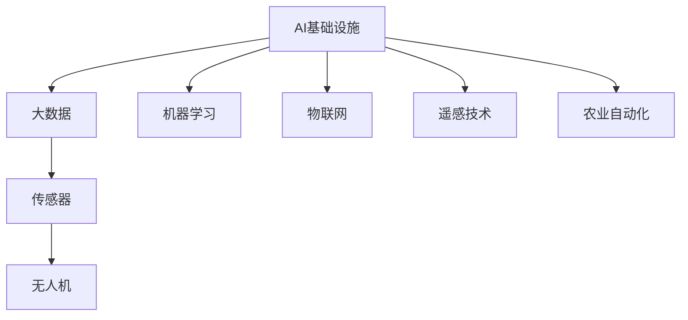

                 

# AI 基础设施的农业现代化：精准农业的技术支撑

> 关键词：AI基础设施、精准农业、大数据、物联网、机器学习、无人机、遥感技术、农业自动化、环境监测

## 1. 背景介绍

### 1.1 问题由来
随着全球人口的不断增长和城市化的加速发展，农业资源和环境的压力日益增大。传统农业模式以粗放经营为主，难以有效提高生产效率和资源利用率。精准农业技术的崛起，为农业现代化注入了新的动力。精准农业通过引入AI基础设施，将大数据、物联网、机器学习等现代技术手段引入农田，实现对农业生产环境的实时监测、资源优化配置、农作物生长周期分析、病虫害预警等，大幅提升农业生产的智能化、自动化水平。

精准农业的技术支撑涵盖了从农田勘测、种植管理到农产品收获、质量检测等全流程，涉及无人机、遥感技术、传感器、智能机器人等各类物联网设备，以及AI模型和大数据分析工具。本文将详细介绍精准农业在技术层面的关键支撑点，帮助读者全面理解这一前沿领域的发展动向和应用前景。

### 1.2 问题核心关键点
精准农业的核心在于通过信息获取和处理，实现对农业生产过程的精准管理。其关键点包括：
- **信息获取**：通过传感器、无人机、遥感等手段，获取农田的环境数据和作物生长状态。
- **数据处理**：利用云计算和大数据技术，对海量数据进行存储、处理和分析。
- **智能决策**：通过机器学习模型，实现对生产过程的预测、优化和控制。
- **自动化执行**：通过智能机器人等执行设备，实现对农业操作的自动化。

本文将围绕这些核心关键点，从基础设施、技术实现、应用场景等角度进行深入探讨。

## 2. 核心概念与联系

### 2.1 核心概念概述

为更好地理解精准农业的技术支撑，本节将介绍几个密切相关的核心概念：

- **AI基础设施**：包括硬件设备和软件工具，如服务器、存储、网络、传感器、无人机等，以及数据分析平台、机器学习框架等软件工具。这些基础设施为精准农业提供了技术实现的基础平台。

- **精准农业**：通过引入传感器、无人机、遥感等技术手段，获取农田环境数据，利用AI基础设施实现对作物生长周期的精准管理，以提高资源利用效率和生产效率。

- **大数据**：精准农业涉及的海量数据，如农田土壤、气象、作物生长状态等，需要通过大数据技术进行存储、处理和分析，以支持智能决策。

- **物联网(IoT)**：通过传感器、无人机等设备将农田环境信息采集到云端，构建起一个覆盖全农田的实时数据网络。

- **机器学习(ML)**：精准农业中的智能决策、自动化执行等功能，都依赖于机器学习模型。通过不断训练和学习，模型能够实时预测并优化农业生产过程。

- **无人机(UAV)**：搭载传感器、摄像头的无人机，能够快速获取农田高清图像和环境数据，支持作物病虫害检测、农田勘测等任务。

- **遥感技术**：通过卫星或无人机等手段，对农田进行高分辨率成像，实时监测作物生长情况和农田环境变化。

- **农业自动化**：结合智能决策和自动化执行，实现农业生产的自动化控制，如自动化播种、施肥、收割等。

这些核心概念之间的逻辑关系可以通过以下Mermaid流程图来展示：



这个流程图展示了精准农业的关键技术支撑点及其相互关系：

1. AI基础设施为精准农业提供了硬件和软件平台。
2. 大数据技术用于处理农田环境数据。
3. 传感器、无人机和遥感技术用于信息获取。
4. 机器学习用于智能决策和预测。
5. 物联网将各类信息采集设备连接起来，形成实时数据网络。
6. 农业自动化实现生产操作的自动化控制。

这些概念共同构成了精准农业的技术实现框架，为其发展奠定了坚实基础。

## 3. 核心算法原理 & 具体操作步骤

### 3.1 算法原理概述

精准农业的算法原理主要围绕信息获取、数据处理、智能决策和自动化执行四个环节展开。以下详细介绍这些算法的基本原理和操作步骤。

### 3.2 算法步骤详解

#### 3.2.1 信息获取

信息获取是精准农业的首要步骤，通过各类传感器、无人机、遥感设备等手段，获取农田环境数据和作物生长状态。

- **传感器**：包括土壤湿度、温度、PH值等传感器，用于实时监测土壤环境。
- **无人机**：配备高分辨率摄像头、光谱传感器等，进行农田勘测、病虫害检测等任务。
- **遥感技术**：利用卫星或无人机获取农田高分辨率成像数据，用于作物生长状态监测和环境变化分析。

#### 3.2.2 数据处理

数据处理是指对采集到的大量数据进行存储、处理和分析，以支持智能决策。

- **存储**：通过分布式存储系统，如Hadoop、Spark，存储海量农田数据。
- **处理**：利用大数据处理工具，如Hive、Spark Streaming，进行数据清洗、特征提取等预处理操作。
- **分析**：通过数据挖掘、机器学习等技术，对数据进行模式识别、趋势分析等操作，提取有用的农业生产信息。

#### 3.2.3 智能决策

智能决策是指通过机器学习模型，实现对农业生产过程的预测、优化和控制。

- **模型训练**：使用历史数据训练各种机器学习模型，如随机森林、支持向量机、神经网络等。
- **预测优化**：基于模型进行实时预测和优化，如病虫害预警、作物生长周期分析、资源优化配置等。
- **决策执行**：将预测结果转化为具体的农业操作指令，如调整灌溉量、施肥量、病虫害防治措施等。

#### 3.2.4 自动化执行

自动化执行是指结合智能决策和执行设备，实现农业操作的自动化。

- **智能机器人**：根据决策结果，控制智能机器人进行播种、施肥、收割等操作。
- **自动化灌溉系统**：根据土壤湿度数据，自动调整灌溉系统的开关和灌溉量。
- **自动施肥系统**：根据作物生长状态，自动控制施肥量和时间。

### 3.3 算法优缺点

精准农业的算法主要具有以下优点：

- **高效率**：通过自动化执行，大幅提高了农业生产的效率和精度。
- **资源优化**：通过智能决策，优化资源配置，提高资源利用效率。
- **精准管理**：通过实时监测和智能分析，实现对农田的精准管理。

同时，精准农业算法也存在一些局限性：

- **高成本**：初始建设和维护成本较高，包括传感器、无人机、数据分析平台等。
- **技术复杂性**：需要综合运用多种技术手段，技术复杂性较高，需要专业人才支持。
- **数据准确性**：传感器、无人机等设备采集的数据可能存在误差，需要可靠的数据校验和处理机制。

### 3.4 算法应用领域

精准农业的算法主要应用于以下几个领域：

- **农田勘测与勘察**：利用无人机和遥感技术，进行农田地形勘测、土地利用规划等。
- **作物生长管理**：通过传感器和无人机，监测作物生长状态，优化灌溉、施肥等操作。
- **病虫害防治**：利用无人机和传感器，实时检测病虫害情况，及时采取防治措施。
- **环境监测与预测**：通过遥感技术和传感器，监测农田环境变化，预测天气、灾害等。
- **资源优化配置**：通过数据分析和机器学习，优化水、肥、农药等资源的使用，减少浪费。
- **智能农机设备**：与智能农机设备配合，实现农机的自动化操作和智能调度。

这些应用领域展示了精准农业在提升农业生产效率、保障粮食安全等方面的巨大潜力。

## 4. 数学模型和公式 & 详细讲解 & 举例说明

### 4.1 数学模型构建

精准农业的数学模型构建主要围绕数据处理和智能决策展开。

- **数据处理模型**：包括数据存储、清洗、特征提取等操作，使用大数据处理技术。
- **智能决策模型**：包括预测、优化、控制等操作，使用机器学习算法。

以预测模型为例，其数学模型构建如下：

假设农田有 $n$ 个传感器，每个传感器 $i$ 在时间 $t$ 时刻采集到的环境数据为 $x_{it}$，作物生长状态数据为 $y_{it}$。我们希望建立模型 $f(x_t)$ 来预测作物生长状态 $y_t$。

数据处理模型可以表示为：

$$
\mathcal{D} = \{(x_{it}, y_{it})\}_{i=1}^n, \quad t \in [0, T]
$$

其中，$\mathcal{D}$ 表示所有采集到的数据，$t$ 表示时间，$T$ 表示总时间长度。

智能决策模型可以表示为：

$$
y_t = f(x_t) = \sum_{i=1}^n w_i g_i(x_{it})
$$

其中，$f(x_t)$ 表示预测函数，$w_i$ 表示传感器 $i$ 的权重，$g_i(x_{it})$ 表示传感器 $i$ 对作物生长状态的贡献函数。

### 4.2 公式推导过程

以下以一个简单的线性回归模型为例，推导智能决策模型的公式。

假设智能决策模型为一个线性回归模型，即：

$$
y_t = \beta_0 + \sum_{i=1}^n \beta_i x_{it} + \epsilon_t
$$

其中，$\beta_0$ 和 $\beta_i$ 为模型的系数，$\epsilon_t$ 为误差项。

通过最小二乘法求解模型系数，得到：

$$
\beta_1, \beta_2, \ldots, \beta_n = \arg\min_{\beta} \sum_{t=1}^T (y_t - \sum_{i=1}^n \beta_i x_{it})^2
$$

求解该最小化问题，得到：

$$
\beta_i = \frac{\sum_{t=1}^T (x_{it} - \bar{x}_i)(y_t - \bar{y})}{\sum_{t=1}^T (x_{it} - \bar{x}_i)^2}, \quad i = 1, 2, \ldots, n
$$

其中，$\bar{x}_i$ 和 $\bar{y}$ 分别表示传感器 $i$ 和作物生长状态数据的均值。

### 4.3 案例分析与讲解

以下以一个农田灌溉系统为例，介绍精准农业算法在实际应用中的具体实现。

假设某农田有 $n$ 个传感器，每个传感器采集到的土壤湿度数据为 $x_{it}$，作物生长状态数据为 $y_{it}$。我们希望建立模型 $f(x_t)$ 来预测最佳的灌溉时间。

首先，采集历史数据，构建训练集 $\mathcal{D} = \{(x_{it}, y_{it})\}_{i=1}^n$。

其次，利用数据处理模型对数据进行清洗、特征提取等操作，得到特征矩阵 $\mathbf{X}$ 和目标向量 $\mathbf{y}$。

然后，使用线性回归模型进行智能决策，求解最优系数 $\beta$。

最后，利用模型进行实时预测，根据预测结果自动调整灌溉系统的开关和灌溉量。

## 5. 项目实践：代码实例和详细解释说明

### 5.1 开发环境搭建

在进行精准农业项目实践前，我们需要准备好开发环境。以下是使用Python进行PyTorch和TensorFlow开发的环境配置流程：

1. 安装Anaconda：从官网下载并安装Anaconda，用于创建独立的Python环境。

2. 创建并激活虚拟环境：
```bash
conda create -n pytorch-env python=3.8 
conda activate pytorch-env
```

3. 安装PyTorch：根据CUDA版本，从官网获取对应的安装命令。例如：
```bash
conda install pytorch torchvision torchaudio cudatoolkit=11.1 -c pytorch -c conda-forge
```

4. 安装TensorFlow：
```bash
pip install tensorflow
```

5. 安装各类工具包：
```bash
pip install numpy pandas scikit-learn matplotlib tqdm jupyter notebook ipython
```

完成上述步骤后，即可在`pytorch-env`环境中开始项目实践。

### 5.2 源代码详细实现

下面以一个基于TensorFlow的精准农业灌溉系统为例，给出完整的代码实现。

首先，定义模型和优化器：

```python
import tensorflow as tf

# 定义模型参数
def create_model(n_sensors):
    model = tf.keras.Sequential([
        tf.keras.layers.Dense(32, activation='relu', input_shape=(n_sensors,)),
        tf.keras.layers.Dense(1)
    ])
    return model

# 定义优化器
optimizer = tf.keras.optimizers.Adam(learning_rate=0.001)
```

然后，加载数据并进行预处理：

```python
# 加载数据
data = pd.read_csv('irrigation_data.csv')

# 特征提取
X = data[['x1', 'x2', 'x3']]  # 假设传感器有3个
y = data['y']  # 灌溉时间

# 数据标准化
scaler = MinMaxScaler()
X_scaled = scaler.fit_transform(X)
```

接着，训练模型并进行预测：

```python
# 划分训练集和验证集
train_size = int(0.8 * len(X_scaled))
X_train, X_val = X_scaled[:train_size], X_scaled[train_size:]
y_train, y_val = y[:train_size], y[train_size:]

# 构建模型
model = create_model(n_sensors=3)

# 定义损失函数
def mse(y_true, y_pred):
    return tf.keras.losses.mean_squared_error(y_true, y_pred)

# 定义评估指标
metrics = [tf.keras.metrics.Mean()]

# 训练模型
model.compile(optimizer=optimizer, loss=mse, metrics=metrics)
model.fit(X_train, y_train, validation_data=(X_val, y_val), epochs=100)

# 预测灌溉时间
X_test = [[0.1, 0.2, 0.3]]  # 测试数据
y_pred = model.predict(X_test)
print(y_pred)
```

最后，输出结果并进行模型评估：

```python
# 输出预测结果
print(y_pred)

# 评估模型性能
loss, _, accuracy = model.evaluate(X_test, y_test)
print(f"Test loss: {loss:.3f}, Test accuracy: {accuracy:.3f}")
```

以上就是使用TensorFlow实现精准农业灌溉系统的完整代码实现。可以看到，通过简单的模型构建、数据处理和训练预测，我们便能够实现农业生产过程的智能决策和优化。

### 5.3 代码解读与分析

让我们再详细解读一下关键代码的实现细节：

**create_model函数**：
- 定义了一个简单的线性回归模型，包含两个全连接层。
- 第一层包含32个神经元，使用ReLU激活函数。
- 第二层只有一个神经元，用于输出预测结果。

**mse函数**：
- 定义了均方误差损失函数，用于衡量模型预测与真实值之间的差异。

**训练模型**：
- 使用Adam优化器进行模型训练。
- 定义了损失函数和评估指标。
- 使用fit函数进行模型训练，并设置验证集。

**预测和评估**：
- 使用predict函数进行模型预测。
- 输出预测结果，并使用evaluate函数评估模型性能。

可以看到，通过TensorFlow进行精准农业项目的实现，我们能够快速搭建模型、训练预测，并评估模型性能。TensorFlow强大的计算能力和丰富的工具集，使得精准农业算法的实现变得简单高效。

当然，实际的精准农业项目可能需要更复杂的模型和更多的数据处理，但核心的实现流程与此类似。

## 6. 实际应用场景

### 6.1 智能农场管理

智能农场管理系统通过引入各类传感器、无人机和智能设备，实现对农场环境的实时监控和资源优化配置。

- **传感器网络**：安装各类传感器，实时监测土壤湿度、温度、PH值等环境数据。
- **无人机勘测**：配备高分辨率摄像头和光谱传感器，进行农田勘测和病虫害检测。
- **智能灌溉系统**：根据土壤湿度数据，自动调整灌溉系统的开关和灌溉量。
- **智能施肥系统**：根据作物生长状态，自动控制施肥量和时间。

通过智能农场管理系统，农场主可以实时掌握农田环境状态，及时采取优化措施，提高生产效率和资源利用率。

### 6.2 精准农业保险

精准农业保险通过引入AI和大数据技术，对农田环境进行实时监测和风险评估，实现更精确的保险赔付。

- **环境监测**：通过无人机和传感器，实时监测农田环境变化，如干旱、洪涝等灾害情况。
- **风险评估**：利用机器学习模型，对农田风险进行预测和评估。
- **赔付计算**：根据风险评估结果，自动计算保险赔付金额，提高赔付的精准性和公平性。

通过精准农业保险，保险公司能够更准确地评估风险，减少欺诈和道德风险，提高客户满意度。

### 6.3 智能作物生长管理

智能作物生长管理系统通过传感器和无人机，实时监测作物生长状态，优化施肥、灌溉等操作，提高作物产量和质量。

- **传感器网络**：安装各类传感器，实时监测作物的生长状态，如叶绿素含量、叶片角度等。
- **无人机勘测**：配备高分辨率摄像头和光谱传感器，进行作物健康状况检测。
- **智能施肥系统**：根据作物生长状态，自动控制施肥量和时间。
- **智能灌溉系统**：根据土壤湿度数据，自动调整灌溉系统的开关和灌溉量。

通过智能作物生长管理系统，农民能够更精准地掌握作物生长状态，及时采取优化措施，提高产量和质量。

### 6.4 未来应用展望

随着AI和大数据技术的不断进步，精准农业的未来应用前景广阔。

- **无人驾驶拖拉机**：结合智能决策和自动驾驶技术，实现农业机械的自动化操作。
- **农业机器人**：结合智能决策和机械臂技术，实现农业操作的自动化和智能化。
- **智能温室管理**：通过传感器和无人机，实时监测温室环境，实现精准灌溉、施肥等操作。
- **智慧农业平台**：构建覆盖全农业生产过程的智慧平台，实现数据共享和协同管理。

精准农业的全面发展，将大幅提升农业生产效率和资源利用率，为实现农业现代化奠定坚实基础。

## 7. 工具和资源推荐
### 7.1 学习资源推荐

为了帮助开发者系统掌握精准农业技术，这里推荐一些优质的学习资源：

1. **《AI基础设施的农业现代化》系列博文**：由精准农业技术专家撰写，深入浅出地介绍了精准农业的基础设施、技术实现和应用前景。

2. **CS229《机器学习》课程**：斯坦福大学开设的机器学习课程，涵盖机器学习的基本概念和经典算法。

3. **《深度学习》书籍**：Ian Goodfellow等人著作的深度学习经典书籍，全面介绍了深度学习的基础理论和实践方法。

4. **Kaggle农业数据集**：提供丰富的农业数据集，包含土壤、气象、作物生长状态等各类数据，适合数据驱动的精准农业项目开发。

5. **Arxiv论文库**：包含大量关于精准农业的最新研究成果，涵盖各类前沿技术和新应用场景。

通过这些资源的学习实践，相信你一定能够快速掌握精准农业的核心技术，并应用于实际项目中。

### 7.2 开发工具推荐

精准农业的开发离不开优秀的工具支持。以下是几款用于精准农业开发的常用工具：

1. **TensorFlow**：由Google主导开发的深度学习框架，适合大规模工程应用。支持GPU加速和分布式训练，适合处理大数据集。

2. **PyTorch**：由Facebook主导开发的深度学习框架，灵活动态的计算图，适合快速迭代研究。

3. **Hadoop**：Apache基金会开源的大数据处理框架，适合处理海量数据。

4. **Spark**：Apache基金会开源的大数据处理框架，支持分布式计算和流处理。

5. **RapidMiner**：开源数据科学平台，提供数据预处理、建模和分析的一站式解决方案。

6. **Jupyter Notebook**：开源的交互式开发环境，支持Python、R等多种编程语言，适合科研和工程开发。

合理利用这些工具，可以显著提升精准农业项目的开发效率，加快创新迭代的步伐。

### 7.3 相关论文推荐

精准农业技术的发展源于学界的持续研究。以下是几篇奠基性的相关论文，推荐阅读：

1. **《农业物联网》（AgriIoT）**：研究了基于物联网的农业监控和决策支持系统，涵盖传感器、无人机、智能设备等各类技术手段。

2. **《基于机器学习的农业保险定价模型》**：利用机器学习模型对农田风险进行预测和评估，提高保险赔付的精准性和公平性。

3. **《精准农业中的智能决策模型》**：研究了基于数据驱动的精准农业智能决策模型，涵盖数据预处理、模型训练和预测优化等环节。

4. **《农业机器人技术进展》**：综述了各类农业机器人技术的最新进展，涵盖自主导航、作业控制等关键技术。

5. **《智能温室管理系统的设计与实现》**：介绍了智能温室管理系统的设计和实现，涵盖传感器网络、智能控制等技术手段。

这些论文代表了大数据和AI技术在精准农业中的应用方向，值得深入阅读和研究。

## 8. 总结：未来发展趋势与挑战

### 8.1 总结

本文对精准农业在技术层面的关键支撑点进行了全面系统的介绍。首先阐述了精准农业的背景和意义，明确了AI基础设施在精准农业中的核心地位。其次，从信息获取、数据处理、智能决策和自动化执行四个环节，详细讲解了精准农业的算法原理和操作步骤。最后，探讨了精准农业在未来农业现代化中的巨大应用前景和面临的挑战。

通过本文的系统梳理，可以看到，精准农业技术为农业生产的智能化、自动化提供了强大支撑，具有广阔的发展前景。未来，伴随AI和大数据技术的不断进步，精准农业必将在提升农业生产效率、保障粮食安全等方面发挥更大作用。

### 8.2 未来发展趋势

展望未来，精准农业的发展将呈现以下几个趋势：

1. **自动化水平提升**：随着农业机器人、无人驾驶拖拉机等自动化设备的发展，农业生产将实现更高程度的自动化和智能化。

2. **智能化决策增强**：机器学习和大数据分析技术的进步，将进一步增强精准农业的智能决策能力，实现更加精准的生产控制。

3. **多模态信息融合**：结合无人机、遥感、传感器等多模态信息，实现更全面的农业环境监测和作物健康评估。

4. **实时性增强**：基于5G、物联网等技术，实现实时数据采集和处理，提高精准农业的响应速度和决策效率。

5. **模型可解释性提升**：通过可解释性机器学习模型，提高精准农业决策过程的透明度和可解释性，增强用户信任。

6. **跨学科融合**：结合农业科学、计算机科学、工程学等多学科知识，实现精准农业技术的更全面发展。

以上趋势凸显了精准农业技术的广阔前景，必将为农业现代化注入新的动力。

### 8.3 面临的挑战

尽管精准农业技术取得了瞩目成就，但在迈向更加智能化、普适化应用的过程中，仍面临诸多挑战：

1. **技术复杂性高**：精准农业涉及传感器、无人机、大数据、机器学习等多个技术领域，技术复杂性较高，需要专业人才支持。

2. **硬件成本高**：初始建设和维护成本较高，包括传感器、无人机、数据分析平台等。

3. **数据质量问题**：传感器、无人机等设备采集的数据可能存在误差，需要可靠的数据校验和处理机制。

4. **隐私和安全问题**：农业数据涉及隐私和安全问题，需要制定相应的数据保护措施。

5. **法律和伦理问题**：精准农业的应用涉及伦理和法律问题，需要制定相应的法律法规和伦理规范。

6. **知识技能不足**：农业从业人员的技术知识不足，需要加强技术培训和教育。

这些挑战需要产业界和学术界的共同努力，通过技术创新、政策支持和教育培训，逐步克服。只有解决好这些挑战，才能真正实现精准农业技术的规模化应用。

### 8.4 研究展望

面向未来，精准农业技术的研究方向包括：

1. **智能决策优化**：研究如何进一步提升精准农业的智能决策能力，实现更精准的生产控制。

2. **跨领域融合**：结合农业科学、计算机科学、工程学等多学科知识，实现精准农业技术的更全面发展。

3. **隐私保护技术**：研究如何保护农业数据隐私，确保数据安全。

4. **伦理和法律规范**：制定相应的法律法规和伦理规范，确保精准农业的公平和透明。

5. **跨模态信息融合**：研究如何融合多种数据源，实现更全面的农业环境监测和作物健康评估。

这些研究方向将为精准农业技术的可持续发展提供新的思路和解决方案，推动精准农业技术的全面发展。

## 9. 附录：常见问题与解答

**Q1：精准农业的硬件成本是否过高？**

A: 相对于传统农业模式，精准农业的硬件成本确实较高，包括传感器、无人机、数据分析平台等。但随着技术进步和规模化生产，硬件成本有望逐步下降，同时提升生产效率和资源利用率，最终实现经济效益的提升。

**Q2：精准农业的数据质量如何保证？**

A: 数据质量是精准农业的核心问题之一。为保证数据质量，可以采取以下措施：

1. 定期校准传感器和无人机等设备，确保采集数据的准确性。
2. 使用数据清洗和校验工具，去除噪声和异常数据。
3. 建立数据采集和处理的标准流程，确保数据的一致性和完整性。
4. 使用多种传感器和数据源，相互验证和校准，提高数据的可靠性。

通过这些措施，可以有效提升精准农业的数据质量，确保智能决策的精准性和可靠性。

**Q3：精准农业是否存在隐私和安全问题？**

A: 精准农业的数据涉及隐私和安全问题，需要制定相应的数据保护措施：

1. 数据匿名化处理：对敏感数据进行匿名化处理，保护用户隐私。
2. 访问控制和权限管理：建立严格的访问控制机制，确保数据访问的安全性。
3. 数据加密和传输安全：使用数据加密和传输安全技术，防止数据泄露和篡改。
4. 合规性和法规遵从：遵守相关的数据保护法规和标准，确保数据处理过程的合规性和合法性。

通过这些措施，可以有效保护精准农业数据的安全性和隐私性。

**Q4：精准农业的伦理和法律问题如何解决？**

A: 精准农业的应用涉及伦理和法律问题，需要制定相应的法律法规和伦理规范：

1. 数据使用透明性：建立数据使用透明机制，确保数据使用的合法性和合规性。
2. 用户知情同意：在使用数据前，确保用户对数据使用的知情同意，保护用户权益。
3. 伦理审查和监督：建立伦理审查和监督机制，确保数据使用的伦理性和公平性。
4. 法规遵从和合规性：遵守相关的法律法规和标准，确保数据处理的合法性和合规性。

通过这些措施，可以有效解决精准农业的伦理和法律问题，确保技术的健康发展。

**Q5：精准农业的未来发展方向是什么？**

A: 精准农业的未来发展方向包括：

1. **自动化水平提升**：随着农业机器人、无人驾驶拖拉机等自动化设备的发展，农业生产将实现更高程度的自动化和智能化。
2. **智能化决策增强**：机器学习和大数据分析技术的进步，将进一步增强精准农业的智能决策能力，实现更加精准的生产控制。
3. **多模态信息融合**：结合无人机、遥感、传感器等多模态信息，实现更全面的农业环境监测和作物健康评估。
4. **实时性增强**：基于5G、物联网等技术，实现实时数据采集和处理，提高精准农业的响应速度和决策效率。
5. **模型可解释性提升**：通过可解释性机器学习模型，提高精准农业决策过程的透明度和可解释性，增强用户信任。
6. **跨学科融合**：结合农业科学、计算机科学、工程学等多学科知识，实现精准农业技术的更全面发展。

通过这些方向的研究和实践，精准农业必将在提升农业生产效率、保障粮食安全等方面发挥更大作用。

---

作者：禅与计算机程序设计艺术 / Zen and the Art of Computer Programming

