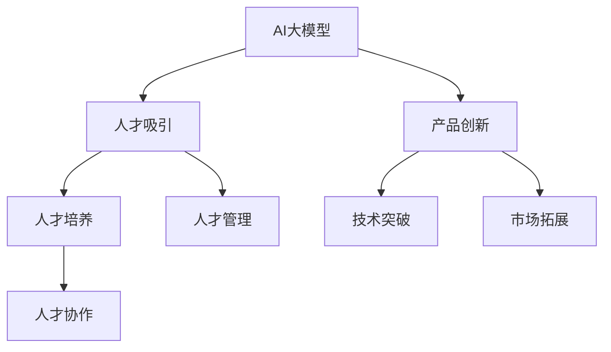
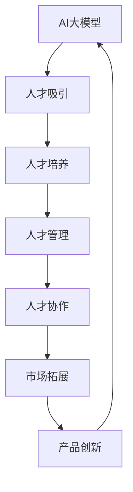

                 

# AI 大模型创业：如何利用人才优势？

## 1. 背景介绍

### 1.1 问题由来
近年来，人工智能(AI)大模型的研究取得了显著进展，如BERT、GPT-3等模型，具有强大的语言处理能力，在各种自然语言处理(NLP)任务中表现优异。这些大模型不仅推动了AI技术的发展，也引发了大量的创业机会。无论是技术型初创公司还是传统的IT企业，都希望通过AI大模型创业，抢占市场先机。

然而，AI大模型的创业并非易事。除了需要深厚的技术积累和丰富的资金支持外，还需要一支强大的人才团队，充分利用人才优势，才能确保项目顺利推进和成功落地。如何吸引、培养、管理优秀人才，成为当前AI大模型创业企业面临的一个重要课题。

### 1.2 问题核心关键点
在AI大模型创业过程中，人才优势的利用关键在于以下几个方面：

1. **人才吸引与招聘**：如何在竞争激烈的人才市场中脱颖而出，吸引高素质的AI人才？
2. **人才培养与成长**：如何构建有效的团队培训体系，提升团队整体的技术水平和创新能力？
3. **人才管理与激励**：如何构建公平、透明的人才管理体系，实现人才的长期稳定发展？
4. **人才协作与协同**：如何促进不同背景、技能的人才之间的协作，实现高效的团队运作？

本文将从上述几个关键点出发，探讨AI大模型创业如何利用人才优势，推动项目成功落地。

## 2. 核心概念与联系

### 2.1 核心概念概述

为了更好地理解如何利用人才优势，首先需明确几个核心概念及其相互关系：

- **AI大模型**：如BERT、GPT-3等，具有强大语言处理能力的模型，广泛应用于自然语言处理(NLP)任务。
- **人才吸引**：通过优厚的待遇、良好的职业发展前景等方式，吸引高素质AI人才。
- **人才培养**：通过培训、实践、交流等方式，提升团队成员的技术水平和创新能力。
- **人才管理**：通过公平、透明、激励的制度，确保人才的长期稳定发展。
- **人才协作**：通过跨部门、跨学科的合作，实现高效团队运作。

这些概念之间的关系可以通过以下Mermaid流程图来展示：



此图展示了AI大模型与人才各个环节的联系：

1. 利用AI大模型技术，实现产品创新和技术突破。
2. 通过产品创新和技术突破，驱动市场拓展。
3. 市场拓展需要吸纳高素质人才。
4. 人才通过吸引、培养、管理、协作，提升整体团队能力。

### 2.2 核心概念原理和架构的 Mermaid 流程图



此图展示了AI大模型与人才各环节的详细流程：

1. 利用AI大模型进行产品创新和技术突破。
2. 产品创新和技术突破促进市场拓展。
3. 市场拓展吸引高素质人才。
4. 高素质人才通过培训、管理、协作提升团队能力。
5. 提升后的团队能力反哺产品创新和技术突破。

## 3. 核心算法原理 & 具体操作步骤

### 3.1 算法原理概述

AI大模型的创业过程中，人才优势的利用主要体现在以下几个方面：

- **人才吸引**：通过提供优厚的待遇、良好的职业发展前景等，吸引高素质的AI人才。
- **人才培养**：通过系统化的培训、实践、交流等机制，提升团队成员的技术水平和创新能力。
- **人才管理**：通过公平、透明、激励的制度，确保人才的长期稳定发展。
- **人才协作**：通过跨部门、跨学科的合作，实现高效团队运作。

这些步骤的算法原理如下：

- **人才吸引**：通过市场调研、人才需求分析、薪酬福利设计等，确定吸引人才的具体措施。
- **人才培养**：通过课程设计、实践项目、团队交流等机制，系统提升团队成员的技术和创新能力。
- **人才管理**：通过绩效评估、晋升机制、职业发展规划等，确保人才的长期稳定发展。
- **人才协作**：通过跨部门、跨学科的合作平台，促进不同背景、技能的人才协作，实现高效的团队运作。

### 3.2 算法步骤详解

**Step 1: 人才吸引**
- **市场调研**：分析目标人才群体的特点、需求、竞争态势等，制定有针对性的吸引策略。
- **岗位设计**：根据团队需求，设计合适的岗位职责、考核指标等，吸引高素质人才。
- **薪酬福利**：提供优厚的薪酬待遇、丰厚的福利、良好的工作环境等，增强人才的吸引力和留存率。
- **职业发展**：提供清晰的职业发展路径、多样化的成长机会，提升人才的职业满足感。

**Step 2: 人才培养**
- **课程设计**：根据团队需求和技术发展趋势，设计系统化的培训课程，涵盖AI大模型、NLP、机器学习等领域。
- **实践项目**：通过实战项目，让团队成员在实际应用中提升技术能力，积累经验。
- **团队交流**：组织跨部门、跨学科的交流活动，促进知识共享和技术融合。
- **知识共享**：建立内部知识库、技术博客等平台，促进技术知识和创新成果的传播。

**Step 3: 人才管理**
- **绩效评估**：通过公平、透明的绩效评估机制，激励人才不断提升工作表现。
- **晋升机制**：设计科学合理的晋升机制，鼓励优秀人才的职业发展。
- **职业发展规划**：提供个性化的职业发展规划，帮助人才实现个人和团队的双赢。
- **激励机制**：通过奖励、荣誉等方式，激发人才的积极性和创造力。

**Step 4: 人才协作**
- **合作平台**：建立跨部门、跨学科的合作平台，促进不同背景、技能的人才协作。
- **项目管理**：采用敏捷开发、迭代改进等项目管理方法，提升协作效率和项目成功率。
- **知识共享**：建立内部知识库、技术博客等平台，促进知识共享和技术融合。
- **团队建设**：组织团队建设活动，增强团队凝聚力和归属感。

### 3.3 算法优缺点

利用人才优势在AI大模型创业中具有以下优点：

1. **快速推进项目**：通过吸引高素质人才，快速提升团队的技术水平和创新能力，推动项目快速落地。
2. **提升产品竞争力**：通过人才培养和协作，实现技术和产品的不断创新，提升产品的市场竞争力。
3. **增强团队凝聚力**：通过公平、透明的人才管理体系，增强团队凝聚力和归属感，提高团队稳定性和长期发展能力。

然而，利用人才优势也存在以下缺点：

1. **人才成本高**：高素质人才的吸引和培养成本较高，可能对企业资金造成一定压力。
2. **管理难度大**：不同背景、技能的人才需要不同的管理方式，需要更加精细化的管理。
3. **人才流失风险**：优秀人才可能因市场机会、薪酬待遇等原因选择离开，对项目带来风险。

### 3.4 算法应用领域

利用人才优势的AI大模型创业方法，在各个行业领域都有广泛应用：

- **科技公司**：如Google、Facebook、Amazon等，通过吸引和培养顶级AI人才，推动技术创新和业务发展。
- **传统企业**：如金融、医疗、零售等，通过引入AI大模型和人才，实现业务数字化转型。
- **初创公司**：通过聚焦特定领域，吸引具有丰富经验的高素质人才，快速推进项目。

## 4. 数学模型和公式 & 详细讲解 & 举例说明

### 4.1 数学模型构建

为了更好地理解如何利用人才优势，本文将从数学模型的角度进行详细讲解。

假设有一个AI大模型创业项目，团队由N个成员组成，每个成员的技能和贡献可以通过如下数学模型表示：

$$
\text{技能矩阵} = \begin{bmatrix}
s_{11} & s_{12} & \cdots & s_{1N} \\
s_{21} & s_{22} & \cdots & s_{2N} \\
\vdots & \vdots & \ddots & \vdots \\
s_{N1} & s_{N2} & \cdots & s_{NN} \\
\end{bmatrix}
$$

其中，$s_{ij}$ 表示第i个成员在j方面的技能值。技能矩阵可以表示为：

$$
\text{技能矩阵} = [s_{ij}]_{N \times M}
$$

其中M为技能维度，如AI大模型、NLP、机器学习等。

### 4.2 公式推导过程

基于上述技能矩阵，可以推导出人才利用效果的数学公式：

$$
\text{人才利用效果} = \text{技能矩阵} \times \text{技能利用系数矩阵}
$$

其中，技能利用系数矩阵包含各个成员在不同场景下的利用系数，可以表示为：

$$
\text{技能利用系数矩阵} = [c_{ij}]_{N \times K}
$$

其中K为场景维度，如产品创新、技术突破、市场拓展等。

假设某个场景下的技能利用系数矩阵为：

$$
\text{场景系数矩阵} = \begin{bmatrix}
c_{11} & c_{12} & \cdots & c_{1K} \\
c_{21} & c_{22} & \cdots & c_{2K} \\
\vdots & \vdots & \ddots & \vdots \\
c_{N1} & c_{N2} & \cdots & c_{NK} \\
\end{bmatrix}
$$

其中，$c_{ij}$ 表示第i个成员在j场景下的利用系数。利用系数矩阵可以表示为：

$$
\text{场景系数矩阵} = [c_{ij}]_{N \times K}
$$

### 4.3 案例分析与讲解

假设某AI大模型创业公司，团队由N个成员组成，技能矩阵如下：

$$
\text{技能矩阵} = \begin{bmatrix}
3 & 2 & 4 & 5 \\
4 & 3 & 5 & 6 \\
\vdots & \vdots & \ddots & \vdots \\
2 & 3 & 4 & 5 \\
\end{bmatrix}
$$

其中，技能矩阵的第一行表示第一个成员在AI大模型、NLP、机器学习、项目管理四个方面的技能值分别为3、2、4、5。

场景系数矩阵如下：

$$
\text{场景系数矩阵} = \begin{bmatrix}
0.8 & 0.5 & 0.6 & 0.4 \\
0.7 & 0.6 & 0.7 & 0.5 \\
\vdots & \vdots & \ddots & \vdots \\
0.5 & 0.6 & 0.5 & 0.4 \\
\end{bmatrix}
$$

其中，场景系数矩阵的第一行表示第一个成员在产品创新、技术突破、市场拓展、团队协作四个场景下的利用系数分别为0.8、0.5、0.6、0.4。

通过计算，可以得出人才利用效果的公式：

$$
\text{人才利用效果} = \text{技能矩阵} \times \text{场景系数矩阵}
$$

具体计算如下：

$$
\text{人才利用效果} = \begin{bmatrix}
0.8 \times 3 + 0.5 \times 2 + 0.6 \times 4 + 0.4 \times 5 \\
0.7 \times 3 + 0.6 \times 2 + 0.7 \times 4 + 0.5 \times 5 \\
\vdots \\
0.5 \times 3 + 0.6 \times 2 + 0.5 \times 4 + 0.4 \times 5 \\
\end{bmatrix}
$$

$$
= \begin{bmatrix}
8.8 \\
8.4 \\
\vdots \\
8.4 \\
\end{bmatrix}
$$

通过计算，可以得出每个成员在各个场景下的人才利用效果，从而优化人才利用策略，提升团队整体表现。

## 5. 项目实践：代码实例和详细解释说明

### 5.1 开发环境搭建

为了更好地进行人才利用效果的计算，需要一个完整的开发环境。以下是使用Python进行开发的环境配置流程：

1. 安装Python：从官网下载并安装Python，适用于3.6及以上版本。
2. 安装NumPy、Pandas等常用库：
```bash
pip install numpy pandas
```

3. 安装SciPy、Scikit-learn等高级库：
```bash
pip install scipy scikit-learn
```

4. 安装Matplotlib、Seaborn等可视化库：
```bash
pip install matplotlib seaborn
```

完成上述步骤后，即可在Python环境中进行人才利用效果的计算。

### 5.2 源代码详细实现

以下是一个使用Python计算人才利用效果的示例代码：

```python
import numpy as np

# 技能矩阵
skill_matrix = np.array([[3, 2, 4, 5], [4, 3, 5, 6], [2, 3, 4, 5]])

# 场景系数矩阵
scene_matrix = np.array([[0.8, 0.5, 0.6, 0.4], [0.7, 0.6, 0.7, 0.5], [0.5, 0.6, 0.5, 0.4]])

# 计算人才利用效果
人才利用效果 = np.dot(skill_matrix, scene_matrix)

print(人才利用效果)
```

### 5.3 代码解读与分析

在上述代码中，我们使用了NumPy库进行矩阵运算。具体步骤包括：

1. 定义技能矩阵和场景系数矩阵。
2. 使用NumPy的dot函数进行矩阵乘法运算。
3. 输出计算结果。

通过这段代码，可以清晰地理解如何通过数学模型计算人才利用效果，并根据结果优化人才利用策略。

## 6. 实际应用场景

### 6.1 智能客服系统

在智能客服系统中，利用人才优势可以显著提升客户体验和满意度。通过吸引和培养高素质的人才，构建高效的团队协作，可以及时响应客户咨询，快速解决客户问题。例如，在智能客服系统中，引入顶尖的NLP人才，结合AI大模型，可以实现实时语音识别、自然语言理解、智能对话等功能，提升客户体验和满意度。

### 6.2 金融舆情监测

在金融舆情监测领域，利用人才优势可以实时监测市场舆论动向，及时预警风险。通过吸引和培养专业的金融分析人才，结合AI大模型，可以实现实时文本分析、情感分析等功能，提前发现潜在的风险和机会，为金融决策提供支持。

### 6.3 个性化推荐系统

在个性化推荐系统中，利用人才优势可以提升推荐精准度，满足用户个性化需求。通过吸引和培养深度学习、NLP、数据挖掘等领域的专家，结合AI大模型，可以实现用户行为分析、兴趣预测、推荐模型优化等功能，提升推荐系统的准确性和个性化程度。

### 6.4 未来应用展望

未来，随着AI大模型的进一步发展，人才在AI创业中的重要性将更加凸显。以下几个方向值得关注：

1. **多模态融合**：结合视觉、语音、文本等多种模态数据，实现多模态AI系统的开发和应用。
2. **跨领域协作**：通过跨领域的人才协作，提升AI系统的泛化能力和应用场景。
3. **前沿技术探索**：积极探索和应用前沿AI技术，如联邦学习、边缘计算等，提升AI系统的安全性和效率。

## 7. 工具和资源推荐

### 7.1 学习资源推荐

为了帮助开发者系统掌握人才利用在大模型创业中的应用，这里推荐一些优质的学习资源：

1. **《AI创业指南》**：全面介绍AI大模型创业的过程、技术和商业模式的书籍，适合初学者和创业者阅读。
2. **《数据科学与机器学习》课程**：斯坦福大学开设的机器学习课程，讲解了数据科学和机器学习的基本原理和应用。
3. **《AI大模型实战》**：涵盖AI大模型开发、微调、应用等各个环节的实战教程，适合有基础的技术人员学习。
4. **Kaggle**：一个数据科学和机器学习竞赛平台，提供丰富的数据集和实战项目，帮助开发者提升技能。

通过对这些资源的学习实践，相信你一定能够更好地理解和利用人才优势，推动AI大模型创业项目的成功落地。

### 7.2 开发工具推荐

高效的开发离不开优秀的工具支持。以下是几款用于大模型创业开发的常用工具：

1. **Jupyter Notebook**：一个强大的交互式编程环境，支持Python、R等语言，适合数据分析和机器学习项目开发。
2. **Git**：一个版本控制系统，支持代码版本管理、协作开发等功能，是软件开发的重要工具。
3. **Docker**：一个容器化平台，支持快速部署和管理应用，适合大规模应用开发。
4. **Kubernetes**：一个容器编排平台，支持大规模分布式应用的部署和运维，适合云原生应用开发。

合理利用这些工具，可以显著提升大模型创业的开发效率，加快创新迭代的步伐。

### 7.3 相关论文推荐

大模型和人才利用技术的发展源于学界的持续研究。以下是几篇奠基性的相关论文，推荐阅读：

1. **《AI创业的挑战与机遇》**：一篇探讨AI创业面临的挑战和机遇的综述论文，提供了丰富的案例和策略。
2. **《AI大模型的人才需求分析》**：一篇分析AI大模型创业中人才需求和吸引策略的论文，提供系统的建议和参考。
3. **《AI人才管理和激励机制研究》**：一篇研究AI人才管理和激励机制的论文，提供实用的方法和策略。

这些论文代表了大模型和人才利用技术的发展脉络。通过学习这些前沿成果，可以帮助研究者把握学科前进方向，激发更多的创新灵感。

## 8. 总结：未来发展趋势与挑战

### 8.1 总结

本文对AI大模型创业中如何利用人才优势进行了全面系统的介绍。首先阐述了人才优势在AI大模型创业中的重要性，明确了人才吸引、培养、管理、协作的关键点。其次，从原理到实践，详细讲解了利用人才优势的数学模型和计算方法，给出了人才利用效果的计算代码实例。同时，本文还广泛探讨了人才利用在大模型创业中的应用场景，展示了人才优势的巨大潜力。此外，本文精选了人才利用技术的各类学习资源，力求为读者提供全方位的技术指引。

通过本文的系统梳理，可以看到，利用人才优势在AI大模型创业中具有重要的作用，能够快速提升团队技术水平和创新能力，推动项目顺利推进和成功落地。未来，伴随大模型和人才利用技术的持续演进，相信AI大模型创业必将在更广阔的领域取得新的突破，为经济社会发展注入新的动力。

### 8.2 未来发展趋势

展望未来，AI大模型创业中人才利用技术将呈现以下几个发展趋势：

1. **人才结构多样化**：吸引和培养不同领域、不同背景的人才，提升团队的多样性和创新能力。
2. **人才管理智能化**：引入AI技术进行人才评估和管理，提高人才管理的效率和公平性。
3. **人才协作网络化**：构建跨部门、跨学科的人才协作网络，实现高效的团队运作。
4. **人才激励机制化**：通过科学的激励机制，激发人才的积极性和创造力，促进人才的长期稳定发展。

这些趋势将推动AI大模型创业向更加智能化、普适化方向发展，实现更加高效、可靠、可控的AI系统。

### 8.3 面临的挑战

尽管人才利用在大模型创业中具有重要作用，但在实施过程中仍面临以下挑战：

1. **人才招聘成本高**：高素质人才的吸引和培养成本较高，可能对企业资金造成一定压力。
2. **人才管理难度大**：不同背景、技能的人才需要不同的管理方式，需要更加精细化的管理。
3. **人才流失风险**：优秀人才可能因市场机会、薪酬待遇等原因选择离开，对项目带来风险。
4. **知识共享难题**：不同领域、背景的人才存在知识差异，需要有效的知识共享机制。

### 8.4 研究展望

面对人才利用面临的挑战，未来的研究需要在以下几个方面寻求新的突破：

1. **人才引进策略优化**：通过市场调研、人才需求分析等，优化人才引进策略，降低成本。
2. **人才管理机制创新**：引入AI技术进行人才评估和管理，提高人才管理的效率和公平性。
3. **人才协作平台建设**：构建跨部门、跨学科的人才协作平台，促进知识共享和技术融合。
4. **知识共享机制优化**：建立内部知识库、技术博客等平台，促进知识共享和技术融合。

这些研究方向将推动AI大模型创业向更加智能化、普适化方向发展，实现更加高效、可靠、可控的AI系统。

## 9. 附录：常见问题与解答

**Q1：如何吸引高素质AI人才？**

A: 吸引高素质AI人才需要多方面的努力，以下是一些建议：

1. **优厚的待遇**：提供具有竞争力的薪酬、福利、股权激励等，吸引顶尖人才。
2. **职业发展前景**：提供清晰的职业发展路径、丰富的培训机会，提升人才的职业满足感。
3. **团队文化**：营造积极向上、包容多元的团队文化，增强人才的归属感和认同感。
4. **创新环境**：提供自由创新的环境，鼓励人才探索前沿技术，提升其创新能力。

**Q2：如何培养高素质AI人才？**

A: 培养高素质AI人才需要系统化的培训和实践，以下是一些建议：

1. **课程设计**：设计系统化的培训课程，涵盖AI大模型、NLP、机器学习等领域。
2. **实战项目**：通过实战项目，让团队成员在实际应用中提升技术能力，积累经验。
3. **团队交流**：组织跨部门、跨学科的交流活动，促进知识共享和技术融合。
4. **知识共享**：建立内部知识库、技术博客等平台，促进技术知识和创新成果的传播。

**Q3：如何管理高素质AI人才？**

A: 管理高素质AI人才需要公平、透明、激励的制度，以下是一些建议：

1. **绩效评估**：通过公平、透明的绩效评估机制，激励人才不断提升工作表现。
2. **晋升机制**：设计科学合理的晋升机制，鼓励优秀人才的职业发展。
3. **职业发展规划**：提供个性化的职业发展规划，帮助人才实现个人和团队的双赢。
4. **激励机制**：通过奖励、荣誉等方式，激发人才的积极性和创造力。

**Q4：如何促进人才协作？**

A: 促进人才协作需要建立有效的协作平台和机制，以下是一些建议：

1. **合作平台**：建立跨部门、跨学科的合作平台，促进不同背景、技能的人才协作。
2. **项目管理**：采用敏捷开发、迭代改进等项目管理方法，提升协作效率和项目成功率。
3. **知识共享**：建立内部知识库、技术博客等平台，促进知识共享和技术融合。
4. **团队建设**：组织团队建设活动，增强团队凝聚力和归属感。

**Q5：如何提升人才利用效果？**

A: 提升人才利用效果需要优化人才利用策略，以下是一些建议：

1. **人才吸引**：通过优厚的待遇、良好的职业发展前景等，吸引高素质AI人才。
2. **人才培养**：通过系统化的培训、实践、交流等机制，提升团队成员的技术水平和创新能力。
3. **人才管理**：通过公平、透明、激励的制度，确保人才的长期稳定发展。
4. **人才协作**：通过跨部门、跨学科的合作平台，促进不同背景、技能的人才协作，实现高效的团队运作。

---

作者：禅与计算机程序设计艺术 / Zen and the Art of Computer Programming

