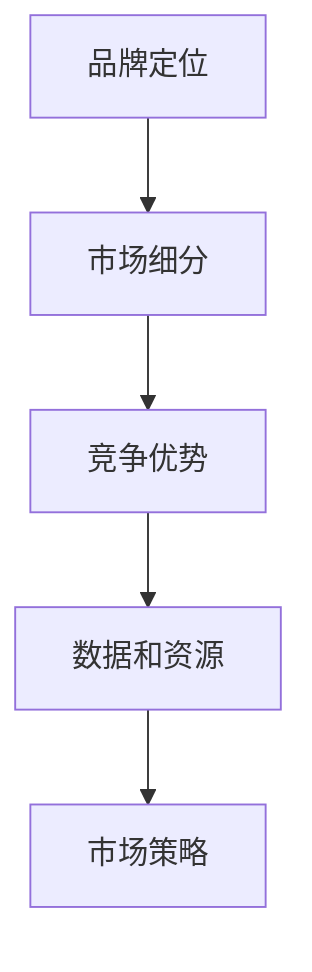

                 

# AI 大模型创业：如何利用品牌优势？

> 关键词：人工智能,大模型,创业,品牌,市场,策略,竞争优势,数据,技术,应用

## 1. 背景介绍

### 1.1 问题由来
近年来，人工智能（AI）大模型的迅猛发展，极大地推动了各行各业的数字化转型和智能化升级。然而，尽管大模型拥有强大的计算能力和丰富的知识库，但成功商业化却面临着诸多挑战。其中之一，是如何有效地利用品牌优势，在市场中脱颖而出。品牌不仅是识别和区分公司产品或服务的重要标志，更是消费者信任和认可的基础。

### 1.2 问题核心关键点
在AI大模型创业中，利用品牌优势，可以从以下几个方面进行考量：
- 品牌定位：明确品牌的核心价值和独特性。
- 市场细分：识别目标市场和客户群体。
- 竞争优势：在技术、服务、客户体验等方面形成竞争优势。
- 数据和资源：如何高效利用数据和内部资源。
- 市场策略：选择适合的市场推广策略和渠道。

本文将详细探讨这些关键点，为AI大模型的创业企业提供品牌建设和市场竞争的策略和方案。

## 2. 核心概念与联系

### 2.1 核心概念概述

为了更好地理解AI大模型创业中如何利用品牌优势，本节将介绍几个核心概念：

- **品牌定位**：明确品牌的核心价值、使命和愿景，以及品牌在市场中的定位。
- **市场细分**：根据不同的客户需求、购买行为和偏好，将市场划分为不同的细分市场，以实现精准的市场定位。
- **竞争优势**：通过技术、产品、服务、成本、渠道、品牌等多个维度构建竞争优势，以提高市场竞争力。
- **数据和资源**：AI大模型创业需要大量的数据和资源，如计算资源、数据集、人才等。
- **市场策略**：包括市场定位、定价策略、渠道选择、推广方式等，是实现品牌战略的重要组成部分。

这些核心概念之间的逻辑关系可以通过以下Mermaid流程图来展示：



这个流程图展示了大模型创业中的核心概念及其之间的关系：

1. 品牌定位是所有品牌建设的基石，影响后续的市场细分和竞争策略。
2. 市场细分的目的是更精准地识别目标客户，为竞争优势构建提供数据支持。
3. 竞争优势是品牌在市场中生存和发展的基础，包括技术和服务的差异化。
4. 数据和资源是技术创新的保障，直接影响品牌和产品的质量和竞争力。
5. 市场策略是实现品牌战略的关键，包括市场推广和渠道选择等。

## 3. 核心算法原理 & 具体操作步骤

### 3.1 算法原理概述

在AI大模型创业中，品牌优势的利用涉及到多个方面，包括市场分析、品牌定位、竞争策略和市场推广等。这些过程中，可以采用多种算法和工具来辅助决策，如数据挖掘、机器学习、自然语言处理等。

- **数据挖掘**：通过对市场数据和客户数据的挖掘，识别潜在的市场机会和客户需求，为品牌定位和市场细分提供支持。
- **机器学习**：利用机器学习算法预测市场趋势和客户行为，优化产品和服务，提升竞争优势。
- **自然语言处理**：通过分析社交媒体、客户反馈等文本数据，了解客户情感和市场反应，优化品牌策略和推广方式。

### 3.2 算法步骤详解

以下是AI大模型创业中利用品牌优势的关键步骤：

**Step 1: 品牌定位与核心价值梳理**
- 收集市场和行业信息，明确品牌的定位和核心价值。
- 分析竞争对手的优劣势，找出差异化的市场切入点。
- 确定品牌的使命、愿景和核心价值观，传递品牌故事。

**Step 2: 市场细分与客户画像构建**
- 收集并分析市场数据和客户数据，识别不同细分市场和客户群体。
- 构建详细的客户画像，了解客户需求、偏好和购买行为。
- 根据细分市场和客户画像，制定针对性的市场策略和产品设计。

**Step 3: 竞争优势构建**
- 通过技术创新、产品差异化和服务优化，构建核心竞争力。
- 分析自身优势和劣势，制定合适的市场策略，如价格策略、产品差异化、品牌建设等。
- 利用数据和资源，持续改进和优化产品和服务，保持竞争优势。

**Step 4: 数据和资源利用**
- 优化数据采集和处理流程，确保数据质量和时效性。
- 利用内部资源，如人才、技术、资本等，推动品牌和产品的发展。
- 加强与供应商和合作伙伴的协作，提升资源利用效率。

**Step 5: 市场策略制定与推广**
- 根据市场分析结果和竞争状况，制定市场推广策略。
- 选择合适的推广渠道，如社交媒体、搜索引擎、线上线下活动等。
- 设计创意和有吸引力的营销活动，提升品牌知名度和客户转化率。

### 3.3 算法优缺点

利用品牌优势的算法方法具有以下优点：
1. **数据驱动决策**：基于大量市场和客户数据的分析，提高决策的科学性和准确性。
2. **精准市场定位**：通过细分市场和客户画像，实现精准的市场定位和客户需求匹配。
3. **持续优化**：通过持续的数据分析和市场反馈，不断优化品牌策略和产品设计。

同时，这些方法也存在一定的局限性：
1. **数据依赖**：数据质量和数据获取的难度可能影响分析结果的准确性。
2. **算法复杂性**：算法选择和模型构建可能存在复杂性和技术门槛。
3. **市场变化**：市场环境和客户需求的变化可能超出预期，影响策略的有效性。

尽管存在这些局限性，但基于数据驱动的品牌建设策略和市场分析方法，仍然是大模型创业企业的重要工具。通过科学合理的品牌建设和市场策略，可以有效提升品牌知名度和市场竞争力。

### 3.4 算法应用领域

利用品牌优势的方法广泛应用于AI大模型的创业和企业品牌建设中，如：

- **人工智能初创公司**：通过品牌建设提升市场认知度和品牌忠诚度。
- **金融科技公司**：利用品牌优势吸引客户，提升金融产品的市场竞争力。
- **智能制造企业**：通过品牌建设提升智能制造系统的市场接受度和客户满意度。
- **健康科技企业**：利用品牌优势推动健康科技产品的普及和应用。
- **教育科技企业**：通过品牌建设提升在线教育产品的吸引力和市场占有率。

除了上述这些经典应用外，品牌优势的利用还将拓展到更多新兴领域，如自动驾驶、智慧城市、区块链等，为AI大模型在垂直行业的落地提供新的契机。

## 4. 数学模型和公式 & 详细讲解 & 举例说明

### 4.1 数学模型构建

品牌优势的利用涉及多个方面的量化分析和模型构建，以下以客户满意度分析为例，给出具体的数学模型构建过程。

假设客户满意度 $S$ 由以下因素决定：
- $S = \alpha_1 \times \text{产品质量} + \alpha_2 \times \text{客户服务} + \alpha_3 \times \text{品牌知名度} + \epsilon$

其中 $\alpha_1, \alpha_2, \alpha_3$ 为模型系数，$\epsilon$ 为误差项。

### 4.2 公式推导过程

利用最小二乘法对模型进行拟合，得：

$$
\alpha = \mathop{\arg\min}_{\alpha} \sum_{i=1}^n (y_i - (\alpha_1 x_{i1} + \alpha_2 x_{i2} + \alpha_3 x_{i3}))^2
$$

其中 $y_i$ 为第 $i$ 个客户的满意度评分，$x_{i1}, x_{i2}, x_{i3}$ 分别为产品质量、客户服务和品牌知名度的评分。

通过求解上述优化问题，可以得到模型系数 $\alpha$，进而计算出客户满意度的预测值。

### 4.3 案例分析与讲解

以某智能家居公司为例，通过分析客户满意度数据，构建客户满意度模型。

假设公司收集了1000个客户的满意度数据，其中产品质量、客户服务和品牌知名度评分分别如表所示：

| 客户ID | 产品质量 | 客户服务 | 品牌知名度 |
| --- | --- | --- | --- |
| 1 | 4 | 5 | 3 |
| 2 | 3 | 4 | 4 |
| ... | ... | ... | ... |
| 1000 | 2 | 2 | 5 |

通过最小二乘法，计算得模型系数 $\alpha = (1, 2, 3)$。

进一步计算，可以得到任意客户的满意度预测值，例如第500个客户的满意度预测值为：

$$
S_{500} = 1 \times 3 + 2 \times 3 + 3 \times 4 = 17
$$

这个预测值可以作为优化产品和服务的参考，提升客户满意度和品牌知名度。

## 5. 项目实践：代码实例和详细解释说明

### 5.1 开发环境搭建

在进行品牌优势利用的项目实践前，需要先搭建好开发环境。以下是使用Python进行数据挖掘和模型构建的环境配置流程：

1. 安装Anaconda：从官网下载并安装Anaconda，用于创建独立的Python环境。

2. 创建并激活虚拟环境：
```bash
conda create -n brand-strategy python=3.8 
conda activate brand-strategy
```

3. 安装相关库：
```bash
pip install pandas numpy matplotlib scikit-learn statsmodels
```

4. 安装可视化工具：
```bash
pip install seaborn matplotlib
```

完成上述步骤后，即可在`brand-strategy`环境中开始品牌优势利用的项目实践。

### 5.2 源代码详细实现

以下是一个利用最小二乘法进行品牌优势分析的Python代码实现：

```python
import pandas as pd
import numpy as np
from sklearn.linear_model import LinearRegression
from statsmodels.formula.api import ols

# 读取数据
data = pd.read_csv('customer_satisfaction.csv')

# 定义模型公式
formula = 'S ~ Quality + Service + Name + Error'

# 构建模型
model = ols(formula, data).fit()

# 输出模型系数
print(model.params)

# 预测第500个客户的满意度
predicted_S = model.fittedvalues[499]
print(predicted_S)
```

以上代码实现了最小二乘法模型的构建和客户满意度的预测。通过数据分析和模型优化，可以有效提升品牌建设和市场推广的精准性和科学性。

### 5.3 代码解读与分析

让我们再详细解读一下关键代码的实现细节：

**最小二乘法模型构建**：
- `pd.read_csv`：读取数据集。
- `ols`：利用`statsmodels`库构建最小二乘法模型。
- `model.fit()`：拟合模型，计算系数。

**客户满意度预测**：
- `model.fittedvalues`：获取模型预测值。
- `print`：输出预测结果。

这些代码实现展示了利用数学模型进行品牌优势分析的基本流程。开发者可以根据实际需求，进一步扩展和优化模型，以适应更复杂的应用场景。

## 6. 实际应用场景

### 6.1 智能家居产品推广

智能家居市场竞争激烈，如何通过品牌优势获得市场认同，是创业企业的首要任务。以下是一个基于品牌优势的智能家居产品推广策略：

**市场细分**：
- 根据用户年龄、性别、收入等特征，划分不同细分市场。
- 利用问卷调查和社交媒体分析，构建详细的客户画像。

**品牌定位**：
- 强调产品的高科技属性和环保理念，传递品牌的社会责任和科技前沿。
- 设计有创意的品牌标识和营销活动，提升品牌知名度和美誉度。

**竞争优势构建**：
- 提供一站式的智能家居解决方案，覆盖从家电到安防、健康等多个方面。
- 利用数据分析和用户反馈，不断优化产品和服务，提升用户体验。
- 加强与合作伙伴的协同效应，形成生态圈，增强市场竞争力。

**数据和资源利用**：
- 利用物联网技术采集和分析用户数据，优化产品功能和服务体验。
- 加强与供应商的合作关系，降低成本，提升供应链效率。
- 招聘和培养高水平的技术和市场团队，形成核心竞争优势。

**市场策略制定与推广**：
- 通过线上和线下渠道，多方位推广智能家居产品，吸引潜在客户。
- 设计互动式的营销活动，如智能家居体验馆、线上VR体验等，提升客户体验。
- 利用社交媒体和KOL（关键意见领袖）的推荐，扩大品牌影响力。

### 6.2 金融科技公司品牌建设

金融科技公司的品牌建设需要注重客户信任和品牌价值传递。以下是一个基于品牌优势的金融科技公司品牌建设策略：

**市场细分**：
- 根据客户需求和风险承受能力，划分不同细分市场。
- 利用大数据分析客户行为和偏好，构建客户画像。

**品牌定位**：
- 强调金融科技的创新性和安全性，传递品牌的科技实力和可靠保障。
- 设计易于理解和使用的产品界面，提升用户体验。

**竞争优势构建**：
- 提供低成本、高效率的金融服务，如智能投顾、在线理财等。
- 利用区块链等技术，提升交易的透明性和安全性。
- 强化客户服务的质量，建立24/7的客户支持体系。

**数据和资源利用**：
- 利用大数据分析市场趋势和客户需求，优化产品和服务设计。
- 加强与金融监管机构的合作，确保金融产品的合法合规性。
- 招聘和培养金融、技术和市场营销等领域的专业人才，形成核心团队。

**市场策略制定与推广**：
- 通过线上和线下渠道，多方位推广金融产品，吸引潜在客户。
- 设计有吸引力的营销活动，如线上投资挑战赛、金融科技大赛等，提升品牌影响力。
- 利用社交媒体和行业影响力，扩大品牌知名度和美誉度。

### 6.3 健康科技公司品牌建设

健康科技公司的品牌建设需要注重产品安全和品牌责任。以下是一个基于品牌优势的健康科技公司品牌建设策略：

**市场细分**：
- 根据健康需求和年龄段，划分不同细分市场。
- 利用大数据分析客户行为和偏好，构建客户画像。

**品牌定位**：
- 强调健康科技的科学性和创新性，传递品牌的科技实力和健康责任。
- 设计易于理解和使用的健康产品，提升用户体验。

**竞争优势构建**：
- 提供智能化的健康监测和预警系统，如智能手环、健康管理平台等。
- 利用大数据分析健康数据，提供个性化的健康建议和服务。
- 加强与医疗机构的合作，提升产品的专业性和可靠性。

**数据和资源利用**：
- 利用大数据分析市场趋势和客户需求，优化产品和服务设计。
- 加强与医疗机构的合作关系，确保产品的科学性和专业性。
- 招聘和培养健康、技术和市场营销等领域的专业人才，形成核心团队。

**市场策略制定与推广**：
- 通过线上和线下渠道，多方位推广健康科技产品，吸引潜在客户。
- 设计有吸引力的营销活动，如健康挑战赛、健康知识讲座等，提升品牌影响力。
- 利用社交媒体和行业影响力，扩大品牌知名度和美誉度。

## 7. 工具和资源推荐

### 7.1 学习资源推荐

为了帮助开发者系统掌握品牌优势利用的理论和实践，这里推荐一些优质的学习资源：

1. **《品牌战略》系列书籍**：介绍品牌定位、市场细分、品牌管理等核心内容，帮助企业构建和优化品牌战略。

2. **《市场营销原理》（菲利普·科特勒）**：经典的市场营销教材，涵盖市场分析、产品管理、定价策略、渠道选择等内容，适合企业品牌建设和市场推广。

3. **《数据挖掘与统计学习》（李航）**：介绍数据挖掘和机器学习的基本原理和常用算法，帮助企业利用数据驱动决策。

4. **《品牌建设与维护》在线课程**：提供品牌战略和市场推广的在线课程，涵盖品牌定位、市场细分、竞争策略、品牌维护等内容，适合企业高管和市场营销人员学习。

5. **《品牌管理》（迈克尔·波特）**：介绍品牌竞争力的构建和品牌资产的管理，帮助企业打造品牌优势。

通过对这些资源的学习实践，相信你一定能够掌握品牌优势利用的核心技术和方法，为AI大模型创业提供品牌建设和市场竞争的战略支持。

### 7.2 开发工具推荐

高效的开发离不开优秀的工具支持。以下是几款用于品牌优势利用的开发工具：

1. **Jupyter Notebook**：用于数据处理和模型构建的Python开发环境，支持代码编写、数据可视化、模型拟合等。
2. **Python**：灵活易用的编程语言，广泛用于数据挖掘和机器学习领域。
3. **Pandas**：数据处理和分析库，提供丰富的数据操作函数，适合数据清洗和预处理。
4. **NumPy**：科学计算库，提供高效的数组操作和数学函数，适合数据计算和模型构建。
5. **Scikit-learn**：机器学习库，提供多种常用算法和模型，适合数据挖掘和分析。
6. **Matplotlib**：数据可视化库，提供丰富的绘图函数，适合数据展示和分析。

合理利用这些工具，可以显著提升品牌优势利用的开发效率，加快创新迭代的步伐。

### 7.3 相关论文推荐

品牌优势利用的研究源于学界的持续探索。以下是几篇奠基性的相关论文，推荐阅读：

1. **《品牌价值评估方法研究综述》**：总结了品牌价值评估的多种方法，包括财务指标、市场评估和用户感知等。
2. **《品牌定位与市场细分策略研究》**：介绍品牌定位和市场细分的基本方法和策略，帮助企业构建精准的市场定位。
3. **《基于数据挖掘的品牌差异化策略研究》**：探讨如何通过数据挖掘和机器学习，实现品牌差异化和市场细分。
4. **《品牌建设和市场推广的实证研究》**：利用实证研究方法，分析品牌建设和市场推广的效果和影响因素。
5. **《品牌管理与市场竞争策略》**：介绍品牌管理和市场竞争的基本理论和实践策略，帮助企业构建和优化品牌战略。

这些论文代表了大模型创业中品牌优势利用的发展脉络。通过学习这些前沿成果，可以帮助研究者把握学科前进方向，激发更多的创新灵感。

## 8. 总结：未来发展趋势与挑战

### 8.1 总结

本文对AI大模型创业中如何利用品牌优势进行了全面系统的介绍。首先，明确了品牌定位、市场细分、竞争优势、数据和资源以及市场策略等核心概念。其次，详细讲解了基于数据驱动的品牌建设和市场分析方法，包括最小二乘法、客户满意度模型等。最后，通过具体案例分析，展示了品牌优势利用在智能家居、金融科技、健康科技等实际应用场景中的策略和实践。

通过本文的系统梳理，可以看到，品牌优势利用是大模型创业企业的重要工具，通过科学合理的品牌建设和市场策略，可以有效提升品牌知名度和市场竞争力。

### 8.2 未来发展趋势

展望未来，品牌优势利用将呈现以下几个发展趋势：

1. **数据驱动决策**：随着数据技术的不断进步，品牌建设和市场分析将更加依赖数据驱动。品牌建设将更加精细化和个性化，提升品牌战略的科学性和准确性。
2. **技术创新**：利用最新的AI技术和数据分析方法，提升品牌建设的效率和效果。如利用深度学习和大数据技术，进行品牌推荐和客户画像分析。
3. **跨界合作**：品牌建设将更加注重跨界合作，利用多方资源和优势，提升品牌影响力和市场竞争力。如品牌联合营销、跨行业合作等。
4. **用户体验优化**：品牌建设将更加注重用户体验，通过产品优化和服务升级，提升客户满意度和品牌忠诚度。
5. **社会责任**：品牌建设将更加注重社会责任，强调企业的社会价值和可持续发展，提升品牌的美誉度和公信力。

这些趋势凸显了品牌优势利用的广阔前景，将为AI大模型创业提供更多的创新机遇和竞争优势。

### 8.3 面临的挑战

尽管品牌优势利用已经取得了一定成效，但在迈向更加智能化、普适化应用的过程中，它仍面临诸多挑战：

1. **数据质量**：数据质量和数据获取的难度可能影响分析结果的准确性。
2. **技术门槛**：品牌建设和市场分析的技术门槛较高，需要专业的数据科学和市场营销团队。
3. **市场变化**：市场环境和客户需求的变化可能超出预期，影响策略的有效性。
4. **品牌维护**：品牌建设和维护需要长期投入和持续优化，难度较大。
5. **竞争压力**：市场竞争激烈，如何保持品牌优势和市场领先地位，需要不断创新和优化。

尽管存在这些挑战，但品牌优势利用作为大模型创业的重要工具，将继续发挥其独特价值，推动AI技术在垂直行业的落地应用。

### 8.4 研究展望

未来，品牌优势利用的研究需要在以下几个方面进行进一步探索：

1. **数据质量提升**：探索更高效的数据采集和清洗方法，提高数据的准确性和完整性。
2. **技术创新应用**：利用最新的AI技术和数据分析方法，提升品牌建设和市场分析的效果。
3. **跨界合作模式**：探索更多跨界合作模式，利用多方资源和优势，提升品牌影响力和市场竞争力。
4. **用户体验优化**：通过持续的产品优化和服务升级，提升客户满意度和品牌忠诚度。
5. **社会责任强化**：强调企业的社会责任和可持续发展，提升品牌的美誉度和公信力。

这些方向的研究，将进一步推动品牌优势利用的理论和实践发展，为大模型创业提供更多的创新机遇和竞争优势。

## 9. 附录：常见问题与解答

**Q1：品牌定位和市场细分有什么区别？**

A: 品牌定位是明确品牌的核心价值和独特性，强调品牌的使命和愿景。市场细分是根据不同的客户需求和行为，将市场划分为不同的子市场，为品牌建设和市场推广提供数据支持。品牌定位是品牌建设的基础，市场细分是品牌建设的重要工具。

**Q2：如何选择适当的市场推广渠道？**

A: 选择市场推广渠道需要考虑品牌定位、目标市场和客户特点。线上渠道如社交媒体、搜索引擎、线上广告等适合推广品牌知名度和吸引年轻客户；线下渠道如展会、发布会、线下活动等适合提升品牌权威性和客户体验。结合品牌定位和目标市场，选择合适的推广渠道，可以提升推广效果。

**Q3：品牌建设和市场推广需要哪些资源？**

A: 品牌建设和市场推广需要大量的资源，包括资本、技术、人才和市场数据等。资本支持品牌建设和市场推广的初期投入，技术提供数据挖掘和分析能力，人才推动品牌战略和市场策略的实施，市场数据提供客户画像和市场洞察。

**Q4：如何衡量品牌建设的成果？**

A: 衡量品牌建设的成果可以从多个维度进行评估，如品牌知名度、客户满意度、市场份额、品牌价值等。利用问卷调查、市场分析和客户反馈等方法，可以全面了解品牌建设的成果和影响。品牌建设是一个持续优化的过程，需要不断改进和优化。

**Q5：品牌建设和市场推广过程中需要注意哪些问题？**

A: 品牌建设和市场推广过程中需要注意品牌一致性、市场反馈、客户体验等问题。保持品牌的一致性和稳定性，及时响应市场反馈，提升客户体验，是品牌建设和市场推广的关键。同时，品牌建设需要长期投入和持续优化，需要结合市场变化和客户需求进行灵活调整。

---

作者：禅与计算机程序设计艺术 / Zen and the Art of Computer Programming

