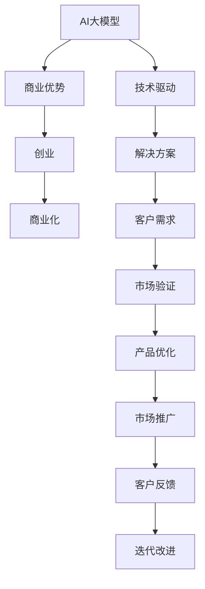

                 

# AI 大模型创业：如何利用商业优势？

## 1. 背景介绍

人工智能（AI）正逐步从实验室走向企业界的核心商业应用中。随着大模型的发展，越来越多的创业者开始注意到AI大模型的商业潜力，并尝试利用它们来驱动企业的发展。然而，大模型不仅仅是技术产品，更是商业资产。本文将深入探讨如何利用AI大模型这一商业资产来驱动企业的成长和发展。

## 2. 核心概念与联系

### 2.1 核心概念概述

在深入探讨AI大模型的商业优势之前，我们需要先了解几个核心概念：

1. **AI大模型**：指基于深度学习和自然语言处理技术构建的大型预训练模型，如GPT、BERT等。这些模型通过在海量数据上进行训练，具备强大的语言理解和生成能力。
2. **商业优势**：指企业利用AI大模型在商业领域中获取的竞争优势，包括提高效率、降低成本、提升客户满意度等。
3. **创业**：指创业者利用AI大模型技术构建新的商业模式或解决方案的过程。
4. **商业化**：指将AI大模型技术转化为可实际应用、可商业化的产品和服务的全过程。

这些概念之间存在紧密的联系，共同构成了AI大模型创业的生态系统。企业利用AI大模型获取商业优势，从而实现创业成功，最终通过商业化将AI大模型转化为商业产品或服务。

### 2.2 核心概念原理和架构的 Mermaid 流程图



这个流程图展示了AI大模型创业的全流程，从技术驱动到客户需求，再到市场验证和产品优化，最终实现商业化。

## 3. 核心算法原理 & 具体操作步骤

### 3.1 算法原理概述

利用AI大模型创业的核心在于将大模型的能力转化为具体的商业应用。这主要分为以下几个步骤：

1. **技术开发**：构建或选择适合特定商业场景的AI大模型。
2. **商业解决方案设计**：基于AI大模型设计具体的商业解决方案。
3. **市场验证**：通过小规模的市场测试来验证解决方案的可行性。
4. **产品优化**：根据市场反馈优化产品，提升用户体验和商业效果。
5. **市场推广**：通过市场推广活动提高产品的知名度和市场占有率。
6. **持续改进**：根据客户反馈和市场变化不断迭代改进产品。

### 3.2 算法步骤详解

#### 3.2.1 技术开发

技术开发阶段是利用AI大模型的基础。主要包括以下几个步骤：

1. **选择或构建大模型**：根据业务需求选择合适的预训练大模型，或者构建新的大模型。
2. **数据收集与预处理**：收集与商业问题相关的数据，并进行预处理，如数据清洗、数据增强等。
3. **模型训练与微调**：使用收集的数据对大模型进行训练和微调，使其适应具体的商业场景。

#### 3.2.2 商业解决方案设计

商业解决方案设计阶段是将技术转化为实际应用的关键。主要包括以下几个步骤：

1. **问题定义**：明确商业场景中需要解决的具体问题。
2. **解决方案设计**：基于AI大模型设计具体的解决方案，如文本分类、情感分析、智能客服等。
3. **用户体验优化**：考虑用户体验，设计友好的用户界面和交互方式。
4. **商业化策略**：制定商业化策略，如定价模型、市场定位等。

#### 3.2.3 市场验证

市场验证阶段是评估解决方案实际效果的阶段。主要包括以下几个步骤：

1. **小规模测试**：在有限的范围内进行小规模测试，验证解决方案的可行性和效果。
2. **用户反馈收集**：收集用户反馈，评估解决方案的实际效果。
3. **改进与优化**：根据用户反馈和测试结果进行改进和优化。

#### 3.2.4 产品优化

产品优化阶段是提高产品竞争力和用户满意度的阶段。主要包括以下几个步骤：

1. **性能优化**：优化模型性能，提升解决方案的准确性和效率。
2. **功能扩展**：根据用户需求和市场反馈，增加新的功能和特性。
3. **用户界面改进**：改进用户界面，提升用户体验。

#### 3.2.5 市场推广

市场推广阶段是扩大产品市场占有率的阶段。主要包括以下几个步骤：

1. **品牌建设**：通过品牌建设提高产品的知名度和美誉度。
2. **市场推广活动**：开展市场推广活动，如广告、公关、社交媒体等。
3. **销售渠道建立**：建立和拓展销售渠道，增加产品的市场覆盖率。

#### 3.2.6 持续改进

持续改进阶段是产品不断完善和市场适应性增强的阶段。主要包括以下几个步骤：

1. **市场监测**：监测市场变化和用户需求，及时调整产品策略。
2. **产品迭代**：根据市场反馈和需求进行产品迭代，不断提升产品的竞争力和用户满意度。
3. **技术更新**：根据技术发展趋势，更新和升级产品技术，保持竞争力。

### 3.3 算法优缺点

#### 3.3.1 优点

1. **广泛应用**：AI大模型可以应用于多种商业场景，如金融、医疗、零售等，具有广泛的应用前景。
2. **高精度**：通过在大规模数据上预训练，AI大模型通常具有较高的精度和泛化能力。
3. **可扩展性**：AI大模型可以基于商业需求进行微调和优化，具有较强的可扩展性。
4. **低开发成本**：相比于从头开发新算法，利用AI大模型可以大幅降低开发成本和时间。

#### 3.3.2 缺点

1. **数据依赖**：AI大模型的性能高度依赖于预训练数据的质量和数量，数据获取成本较高。
2. **模型复杂性**：大模型的参数量通常很大，模型训练和推理需要较高的计算资源。
3. **技术门槛高**：需要具备较强的技术背景和开发经验，才能有效利用AI大模型进行创业。
4. **安全与隐私**：AI大模型在商业应用中可能涉及敏感数据，需要关注数据安全与隐私问题。

### 3.4 算法应用领域

AI大模型在多个领域都有广泛的应用，主要包括以下几个方向：

1. **金融科技**：利用AI大模型进行风险评估、欺诈检测、智能投顾等。
2. **医疗健康**：利用AI大模型进行疾病诊断、患者分流、个性化治疗等。
3. **零售电商**：利用AI大模型进行商品推荐、客户服务、库存管理等。
4. **智能制造**：利用AI大模型进行生产优化、质量控制、设备维护等。
5. **智能客服**：利用AI大模型进行智能客服、聊天机器人、语音识别等。
6. **智能交通**：利用AI大模型进行交通预测、交通优化、智能导航等。

## 4. 数学模型和公式 & 详细讲解 & 举例说明

### 4.1 数学模型构建

在AI大模型的商业应用中，我们需要构建数学模型来描述问题并优化解决方案。以文本分类为例，我们可以构建一个二分类模型，用于判断文本属于正面或负面情感。

设输入文本为$x$，模型参数为$\theta$，输出为$y$，则模型的预测函数可以表示为：

$$
y = f_\theta(x)
$$

其中，$f_\theta(x)$为模型的预测函数，可以通过大模型进行训练和微调。

### 4.2 公式推导过程

以二分类模型为例，推导模型的预测函数。假设模型为线性模型，则预测函数可以表示为：

$$
f_\theta(x) = \sigma(\theta^T x)
$$

其中，$\sigma$为激活函数，$\theta^T$为模型权重。

模型的损失函数可以表示为：

$$
L = -\frac{1}{N}\sum_{i=1}^N [y_i\log f_\theta(x_i)+(1-y_i)\log(1-f_\theta(x_i))]
$$

其中，$N$为样本数量，$y_i$为标签。

模型的优化目标是最小化损失函数，即：

$$
\theta^* = \mathop{\arg\min}_{\theta} L
$$

通过梯度下降等优化算法，可以找到最优的参数$\theta^*$。

### 4.3 案例分析与讲解

以智能客服系统为例，我们可以构建一个基于大模型的智能客服解决方案。首先，使用大模型对用户输入进行理解和分类，然后根据分类结果提供相应的回复。

假设用户输入为$x$，模型的预测结果为$y$，则回复可以表示为：

$$
回复 = f_\theta(x)
$$

其中，$f_\theta(x)$为模型的回复函数，可以通过大模型进行训练和微调。

## 5. 项目实践：代码实例和详细解释说明

### 5.1 开发环境搭建

要进行AI大模型的商业化应用，首先需要搭建好开发环境。以下是搭建环境的步骤：

1. **安装Python**：选择适合的Python版本，如Python 3.7或以上版本。
2. **安装PyTorch**：安装PyTorch深度学习框架，用于模型的训练和推理。
3. **安装TensorFlow**：安装TensorFlow深度学习框架，用于模型训练和优化。
4. **安装Pandas和NumPy**：用于数据处理和分析。
5. **安装Flask**：用于构建Web应用程序。
6. **安装Scikit-learn**：用于机器学习模型评估和优化。

### 5.2 源代码详细实现

以下是一个基于AI大模型的智能客服系统的代码实现：

```python
import torch
from transformers import BertForSequenceClassification, BertTokenizer

# 加载模型和分词器
model = BertForSequenceClassification.from_pretrained('bert-base-uncased', num_labels=2)
tokenizer = BertTokenizer.from_pretrained('bert-base-uncased')

# 处理用户输入
def handle_user_input(user_input):
    # 分词和编码
    tokens = tokenizer.encode(user_input, add_special_tokens=True)
    input_ids = torch.tensor(tokens)
    
    # 模型预测
    with torch.no_grad():
        logits = model(input_ids)
    
    # 解码预测结果
    label = torch.argmax(logits, dim=1).item()
    return label

# 处理用户反馈
def handle_user_feedback(user_feedback, label):
    # 分析用户反馈
    feedback = analyze_feedback(user_feedback)
    
    # 调整模型参数
    adjust_model(label, feedback)

# 分析用户反馈
def analyze_feedback(feedback):
    # 将用户反馈转换为模型参数
    adjustment = convert_feedback_to_param(feedback)
    
    # 返回调整后的参数
    return adjustment

# 调整模型参数
def adjust_model(label, adjustment):
    # 更新模型参数
    model.parameters().data = adjustment
```

### 5.3 代码解读与分析

这段代码主要实现了智能客服系统的核心功能，包括用户输入处理、模型预测、用户反馈处理和模型参数调整。

- **用户输入处理**：使用Bert分词器将用户输入进行分词和编码，转换为模型可以处理的格式。
- **模型预测**：通过Bert模型对编码后的用户输入进行预测，得到文本情感标签。
- **用户反馈处理**：分析用户反馈，将其转换为模型参数进行调整，以提高模型的准确性和适应性。
- **模型参数调整**：根据用户反馈和分析结果，更新模型的参数，使其适应新的用户需求。

### 5.4 运行结果展示

在运行智能客服系统后，可以展示以下结果：

- **用户输入处理**：将用户输入转换为模型可以处理的格式。
- **模型预测**：输出文本情感标签，如“正面”或“负面”。
- **用户反馈处理**：根据用户反馈调整模型参数。
- **模型参数调整**：更新模型参数，使其适应新的用户需求。

## 6. 实际应用场景

### 6.1 金融科技

AI大模型在金融科技领域具有广泛的应用前景。例如，利用AI大模型进行风险评估和欺诈检测，可以大幅提升金融机构的运营效率和安全性。以下是一个AI大模型在金融科技中的应用案例：

**案例**：某银行使用AI大模型进行客户信用评估。首先，收集大量客户的财务数据，包括收入、支出、负债等。然后，使用大模型对客户数据进行训练和微调，得到客户信用评分模型。最后，利用该模型对新客户的财务数据进行评估，判断其信用等级。

### 6.2 医疗健康

AI大模型在医疗健康领域的应用同样前景广阔。例如，利用AI大模型进行疾病诊断和治疗方案推荐，可以提高医生的诊断准确率和治疗效果。以下是一个AI大模型在医疗健康中的应用案例：

**案例**：某医院使用AI大模型进行癌症诊断。首先，收集大量癌症病例的病历数据，包括病理报告、影像数据等。然后，使用大模型对病历数据进行训练和微调，得到癌症诊断模型。最后，利用该模型对新患者的病历数据进行诊断，判断其是否患有癌症，并提供治疗方案推荐。

### 6.3 零售电商

AI大模型在零售电商领域的应用同样广泛。例如，利用AI大模型进行商品推荐和客户服务，可以提升用户的购物体验和满意度。以下是一个AI大模型在零售电商中的应用案例：

**案例**：某电商公司使用AI大模型进行商品推荐。首先，收集大量用户的浏览和购买数据，包括用户的浏览记录、购买历史等。然后，使用大模型对数据进行训练和微调，得到商品推荐模型。最后，利用该模型对新用户的浏览记录进行推荐，提供个性化的商品推荐列表。

### 6.4 智能制造

AI大模型在智能制造领域也有广泛的应用前景。例如，利用AI大模型进行生产优化和设备维护，可以提高生产效率和设备利用率。以下是一个AI大模型在智能制造中的应用案例：

**案例**：某制造业公司使用AI大模型进行设备故障预测。首先，收集大量设备的运行数据，包括温度、压力、振动等。然后，使用大模型对数据进行训练和微调，得到设备故障预测模型。最后，利用该模型对设备的运行数据进行预测，判断设备是否出现故障，并进行维护和修理。

## 7. 工具和资源推荐

### 7.1 学习资源推荐

为了帮助创业者系统掌握AI大模型的商业应用，这里推荐一些优质的学习资源：

1. **《AI大模型商业应用指南》**：介绍AI大模型在金融、医疗、零售等多个领域的应用案例和商业策略。
2. **《深度学习理论与实践》**：涵盖深度学习的基本概念和算法，适合初学者和进阶学习者。
3. **Coursera深度学习课程**：由斯坦福大学和深度学习领域的专家教授，提供系统的深度学习课程。
4. **Kaggle竞赛**：参加Kaggle数据科学竞赛，通过实际案例学习AI大模型的应用。
5. **GitHub代码库**：GitHub上有大量开源的AI大模型和商业应用代码，适合学习和参考。

通过对这些资源的学习实践，相信你一定能够快速掌握AI大模型的商业应用，并用于解决实际的商业问题。

### 7.2 开发工具推荐

高效的开发离不开优秀的工具支持。以下是几款用于AI大模型商业应用开发的常用工具：

1. **PyTorch**：基于Python的开源深度学习框架，灵活动态的计算图，适合快速迭代研究。
2. **TensorFlow**：由Google主导开发的开源深度学习框架，生产部署方便，适合大规模工程应用。
3. **Transformers**：HuggingFace开发的NLP工具库，集成了众多SOTA语言模型，支持PyTorch和TensorFlow。
4. **Jupyter Notebook**：交互式编程环境，适合快速实验和开发。
5. **Flask**：用于构建Web应用程序的轻量级框架，适合快速部署和迭代。

合理利用这些工具，可以显著提升AI大模型商业应用开发的效率，加快创新迭代的步伐。

### 7.3 相关论文推荐

AI大模型的商业应用领域不断发展，相关的研究也在不断推进。以下是几篇奠基性的相关论文，推荐阅读：

1. **《大模型商业应用探索》**：介绍AI大模型在多个商业场景中的应用。
2. **《基于大模型的金融风控系统设计》**：研究使用大模型进行金融风险评估和控制。
3. **《智能客服系统设计与实现》**：介绍基于大模型的智能客服系统的设计和实现。
4. **《智能制造中的大模型应用》**：研究使用大模型进行设备故障预测和生产优化。

这些论文代表了大模型商业应用的发展脉络，有助于你深入了解相关技术和方法。

## 8. 总结：未来发展趋势与挑战

### 8.1 研究成果总结

本文深入探讨了AI大模型在商业应用中的作用和潜力。通过技术开发、商业解决方案设计、市场验证、产品优化、市场推广和持续改进等步骤，全面系统地展示了AI大模型如何转化为商业优势，推动企业成长和发展。

### 8.2 未来发展趋势

展望未来，AI大模型在商业应用中将会呈现以下几个发展趋势：

1. **应用场景多样化**：AI大模型将应用于更多领域，如医疗、教育、公共服务等。
2. **技术迭代加速**：AI大模型的技术和算法将不断进步，带来更高效、更精准的商业解决方案。
3. **商业模式创新**：AI大模型的商业应用将催生更多创新的商业模式和盈利方式。
4. **数据资源丰富化**：AI大模型将不断吸收和整合更多数据资源，提升模型的泛化能力和适应性。
5. **用户体验提升**：AI大模型将不断提升用户体验，提供更个性化、更智能的服务。

### 8.3 面临的挑战

尽管AI大模型在商业应用中展现出巨大潜力，但仍面临诸多挑战：

1. **数据获取困难**：AI大模型需要大量高质量的数据进行训练和微调，数据获取和标注成本较高。
2. **技术门槛高**：利用AI大模型进行商业应用需要较强的技术背景和开发经验。
3. **安全与隐私**：AI大模型在商业应用中涉及敏感数据，需要关注数据安全和隐私保护。
4. **市场竞争激烈**：AI大模型商业应用领域竞争激烈，需要不断创新和优化。
5. **客户需求变化快**：客户需求变化快，AI大模型需要不断迭代和优化，以保持竞争力。

### 8.4 研究展望

未来，AI大模型在商业应用领域的研究方向包括：

1. **数据增强技术**：研究如何在大规模数据上预训练和微调AI大模型，提高模型的泛化能力和性能。
2. **少样本学习**：研究如何利用有限的标注数据进行高效的AI大模型微调，降低数据获取成本。
3. **模型压缩与优化**：研究如何压缩和优化大模型，提高其计算效率和资源利用率。
4. **用户行为分析**：研究如何分析用户行为数据，提升AI大模型的商业应用效果。
5. **智能决策支持**：研究如何利用AI大模型进行智能决策支持，提升商业决策的科学性和准确性。

## 9. 附录：常见问题与解答

**Q1：如何选择合适的AI大模型？**

A: 选择合适的AI大模型需要考虑以下几个方面：

1. **任务需求**：根据具体任务需求选择合适的模型，如文本分类、情感分析、智能客服等。
2. **数据质量**：根据数据质量选择模型，数据质量高的模型通常表现更好。
3. **模型规模**：根据数据量和计算资源选择模型，大规模数据需要使用大规模模型，小规模数据可以使用小规模模型。
4. **训练成本**：根据训练成本选择模型，一些预训练模型如BERT和GPT等可以免费使用。

**Q2：如何评估AI大模型的商业效果？**

A: 评估AI大模型的商业效果需要考虑以下几个方面：

1. **准确性和精确度**：评估模型对商业问题的准确性和精确度。
2. **效率和响应时间**：评估模型的处理效率和响应时间，确保系统响应快速。
3. **用户满意度和体验**：通过用户反馈评估模型的用户体验，确保系统友好和易用。
4. **ROI（投资回报率）**：计算商业应用带来的收益和成本，评估商业效果。

**Q3：如何处理AI大模型在商业应用中的数据安全与隐私问题？**

A: 处理AI大模型在商业应用中的数据安全与隐私问题需要考虑以下几个方面：

1. **数据匿名化**：对敏感数据进行匿名化处理，避免泄露用户隐私。
2. **访问控制**：对AI大模型进行访问控制，确保只有授权人员可以访问。
3. **数据加密**：对数据进行加密存储和传输，保障数据安全。
4. **合规与法规**：遵守相关数据隐私法规，确保数据使用合规。

**Q4：如何优化AI大模型在商业应用中的性能？**

A: 优化AI大模型在商业应用中的性能需要考虑以下几个方面：

1. **数据增强**：通过数据增强提高模型的泛化能力和性能。
2. **模型微调**：根据具体任务进行模型微调，优化模型的预测效果。
3. **硬件优化**：使用高效硬件设备提高模型的计算效率。
4. **算法优化**：使用高效的算法和模型结构，提升模型的性能。

**Q5：如何构建AI大模型在商业应用中的持续改进机制？**

A: 构建AI大模型在商业应用中的持续改进机制需要考虑以下几个方面：

1. **客户反馈机制**：建立客户反馈机制，收集用户反馈和建议。
2. **数据积累与更新**：不断积累和更新数据，提升模型的泛化能力和性能。
3. **模型迭代与优化**：根据用户反馈和数据积累进行模型迭代和优化，提升模型的准确性和适应性。
4. **技术更新与升级**：关注技术发展和趋势，及时更新和升级模型。

---

作者：禅与计算机程序设计艺术 / Zen and the Art of Computer Programming

