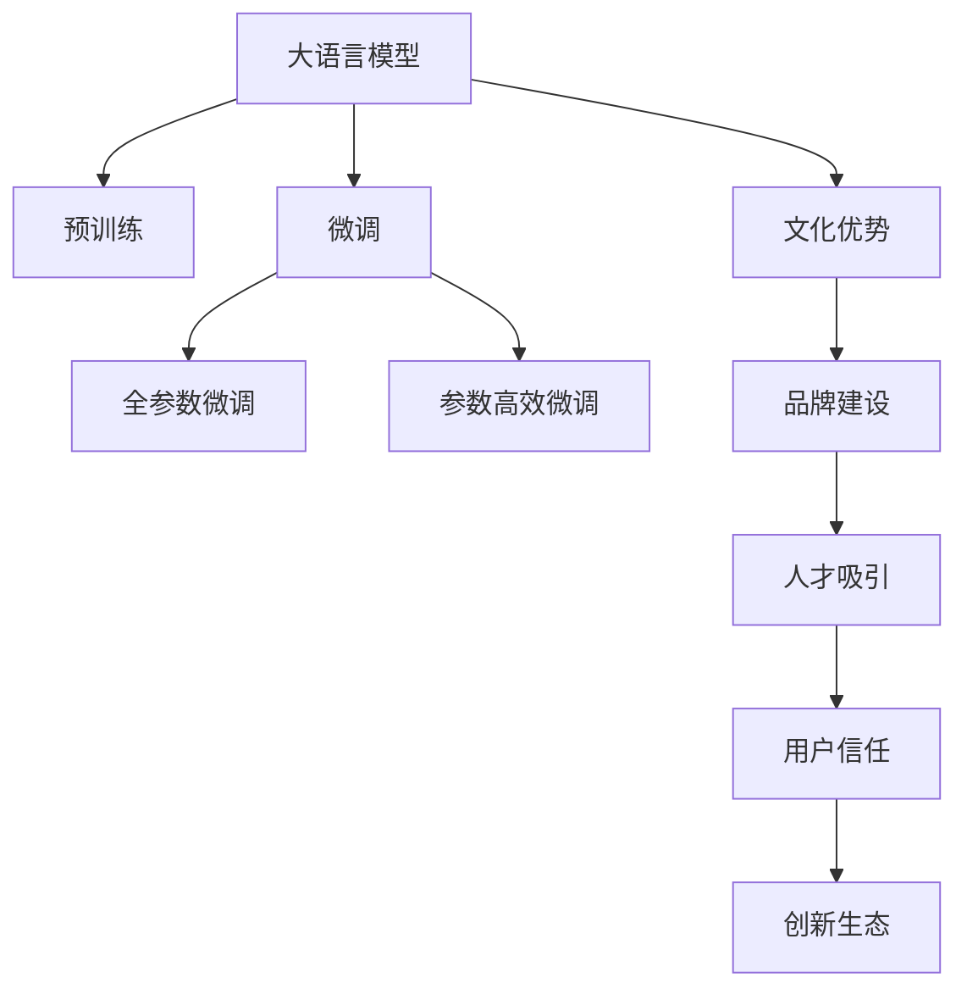

                 

# AI 大模型创业：如何利用文化优势？

在当前AI创业环境中，大语言模型（Large Language Models, LLMs）无疑是热门话题。LLMs如GPT、BERT等，通过自监督学习在海量文本数据上预训练，展现了强大的语言理解和生成能力。但创业成功并非仅仅依赖技术力量，还需借助文化优势。本文将探讨如何利用文化优势在AI大模型创业中脱颖而出。

## 1. 背景介绍

### 1.1 问题由来
随着AI技术的迅猛发展，大模型在自然语言处理（NLP）、计算机视觉等领域取得了突破性进展。然而，仅靠技术难以保证长期成功。文化，作为企业的重要软实力，能够帮助企业构建独特的品牌、吸引顶尖人才、培养用户信任，从而在激烈的市场竞争中脱颖而出。

### 1.2 问题核心关键点
文化，作为企业的“灵魂”，具有独特的价值和作用。在AI大模型创业中，文化优势主要体现在以下几个方面：
- **品牌建设**：优秀的企业文化能够提升品牌形象，构建良好的市场口碑。
- **人才吸引与培养**：文化能够吸引和留住顶尖人才，激发其创新潜力。
- **用户信任**：良好的企业文化能够增强用户信任，提升产品或服务的粘性。
- **创新生态**：文化能够促进创新，构建健康可持续的创新生态。

## 2. 核心概念与联系

### 2.1 核心概念概述

为更好地理解文化在大模型创业中的作用，本节将介绍几个关键概念：

- **大语言模型**：以自回归（如GPT）或自编码（如BERT）模型为代表的大规模预训练语言模型。通过在大规模无标签文本数据上进行预训练，学习通用的语言表示，具备强大的语言理解和生成能力。
- **文化**：企业文化是指企业在运营过程中所形成的共同的价值观、信仰、行为准则等，是企业软实力的重要组成部分。
- **品牌建设**：指企业通过各种手段提升品牌知名度、美誉度和忠诚度，构建良好的市场形象。
- **人才吸引与培养**：指企业通过吸引和留住顶尖人才，激发其创新潜力，促进企业持续发展。
- **用户信任**：指用户对企业产品或服务的信任度，是企业长期成功的重要保障。
- **创新生态**：指企业在创新方面的生态系统，包括合作伙伴、用户反馈、外部环境等，促进创新成果的产生和应用。

这些概念之间的逻辑关系可以通过以下Mermaid流程图来展示：



这个流程图展示了文化优势在大模型创业中的关键作用，即通过品牌建设吸引人才，增强用户信任，促进创新生态，从而提升整体竞争力。

## 3. 核心算法原理 & 具体操作步骤

### 3.1 算法原理概述

文化在AI大模型创业中的作用，并非通过具体的算法实现，而是通过企业运营的各个方面体现出来。以下将详细探讨如何利用文化优势：

### 3.2 算法步骤详解

**Step 1: 定义企业文化核心**
- 明确企业文化的核心价值观，如创新、协作、用户至上等。
- 将企业文化具体化为一系列行为准则，如员工手册、公司愿景、使命等。

**Step 2: 构建品牌形象**
- 设计独特的品牌标识，如LOGO、口号、配色等，体现企业的核心价值。
- 利用社交媒体、官网、新闻发布会等渠道，广泛宣传企业品牌。

**Step 3: 吸引与培养人才**
- 提供有竞争力的薪酬福利，吸引顶尖人才。
- 构建开放包容的企业文化，鼓励创新和团队协作。
- 提供系统化的培训和发展机会，培养员工的职业技能和创新能力。

**Step 4: 增强用户信任**
- 提供高质量的产品和服务，确保用户满意度。
- 建立透明的沟通渠道，及时回应用户反馈。
- 利用用户评价和口碑，提升品牌形象和用户信任度。

**Step 5: 促进创新生态**
- 与高校、科研机构合作，开展前沿技术研究。
- 引入外部资源，如风险投资、政府补贴等，支持创新项目。
- 建立社区平台，促进用户、员工、合作伙伴之间的交流与合作。

### 3.3 算法优缺点

利用文化优势进行AI大模型创业，具有以下优点：
- **提升品牌知名度**：通过品牌建设，提升企业的市场影响力和用户认知度。
- **吸引顶尖人才**：良好的企业文化能够吸引和留住顶尖人才，增强企业创新能力。
- **增强用户信任**：优秀的企业文化能够增强用户信任，提升用户粘性和品牌忠诚度。
- **促进创新生态**：文化能够构建健康可持续的创新生态，推动企业持续发展。

同时，也存在一定的局限性：
- **建设周期长**：企业文化建设需要长期投入，效果显现较慢。
- **成本高**：高端人才、品牌宣传、创新生态构建等，需要较高的资金投入。
- **管理复杂**：文化建设和管理需要高水平的管理团队，难度较大。

尽管如此，文化在大模型创业中的作用不容忽视。企业文化建设与技术创新相辅相成，能够显著提升企业竞争力和可持续发展能力。

### 3.4 算法应用领域

利用文化优势进行AI大模型创业，已经广泛应用于多个领域：

- **科技初创公司**：如OpenAI、DeepMind等，通过构建独特的企业文化，吸引顶尖人才，开发前沿技术，成为行业标杆。
- **人工智能企业**：如微软、Google、Amazon等，通过提升品牌形象，增强用户信任，构建创新生态，成为全球AI行业的重要力量。
- **大数据公司**：如Cloudera、Databricks等，通过注重数据文化，吸引数据科学家，构建大数据生态，实现商业化应用。
- **智能制造企业**：如Siemens、General Electric等，通过推广智能制造文化，提升生产效率，实现数字化转型。
- **教育科技公司**：如Coursera、Duolingo等，通过打造开放创新的教育文化，提供高质量教育资源，推动教育公平。

## 4. 数学模型和公式 & 详细讲解 & 举例说明

### 4.1 数学模型构建

文化在AI大模型创业中的作用，并非通过具体的数学模型实现，而是通过企业运营的各个方面体现出来。以下将详细探讨如何利用文化优势：

### 4.2 公式推导过程

由于文化建设并非通过数学模型实现，因此没有具体的公式推导过程。

### 4.3 案例分析与讲解

**案例一：Google**

Google通过构建开放包容的企业文化，吸引和留住顶尖人才，推动了深度学习和人工智能技术的发展。Google的“20%时间”政策，鼓励员工在完成本职工作的同时，投入20%的时间进行创新项目。这一政策使得Google在AI领域取得了诸多突破性成果，如Google Brain团队的深度学习研究，推动了机器翻译、自然语言处理等技术的发展。

**案例二：Microsoft**

Microsoft通过注重数据文化，构建大数据生态，推动了人工智能技术的商业化应用。Microsoft投入大量资源，构建Azure云平台，吸引了大量数据科学家和企业客户。通过Azure和Office 365等产品，Microsoft实现了AI技术的广泛应用，提升了企业的市场竞争力。

## 5. 项目实践：代码实例和详细解释说明

### 5.1 开发环境搭建

在进行AI大模型创业时，需要搭建高效的开发环境。以下是使用Python进行TensorFlow开发的环境配置流程：

1. 安装Anaconda：从官网下载并安装Anaconda，用于创建独立的Python环境。

2. 创建并激活虚拟环境：
```bash
conda create -n tf-env python=3.8 
conda activate tf-env
```

3. 安装TensorFlow：根据CUDA版本，从官网获取对应的安装命令。例如：
```bash
conda install tensorflow tensorflow-gpu=cudatoolkit=11.1 -c pytorch -c conda-forge
```

4. 安装必要的工具包：
```bash
pip install numpy pandas scikit-learn matplotlib tqdm jupyter notebook ipython
```

完成上述步骤后，即可在`tf-env`环境中开始大模型创业实践。

### 5.2 源代码详细实现

以下是使用TensorFlow进行AI大模型创业的PyTorch代码实现：

```python
import tensorflow as tf
from tensorflow.keras import layers

# 定义大模型架构
model = tf.keras.Sequential([
    layers.Embedding(input_dim=1000, output_dim=64, mask_zero=True),
    layers.LSTM(units=64, return_sequences=True),
    layers.Bidirectional(layers.LSTM(units=64)),
    layers.Dense(units=1, activation='sigmoid')
])

# 编译模型
model.compile(optimizer='adam', loss='binary_crossentropy', metrics=['accuracy'])

# 加载数据集
(x_train, y_train), (x_test, y_test) = tf.keras.datasets.mnist.load_data()

# 数据预处理
x_train = x_train / 255.0
x_test = x_test / 255.0

# 训练模型
model.fit(x_train, y_train, epochs=10, batch_size=32, validation_data=(x_test, y_test))

# 评估模型
model.evaluate(x_test, y_test)
```

### 5.3 代码解读与分析

让我们再详细解读一下关键代码的实现细节：

**定义大模型架构**
- 使用TensorFlow的Sequential模型定义大模型，包括Embedding、LSTM、Dense等层。
- 使用Masked Embedding处理缺失值，LSTM层进行序列建模，Bidirectional LSTM层进行双向建模，Dense层输出预测结果。

**编译模型**
- 使用Adam优化器和二元交叉熵损失函数进行模型编译。

**加载数据集**
- 使用TensorFlow内置的MNIST数据集，加载训练集和测试集。

**数据预处理**
- 将数据归一化到0-1之间，以便模型训练。

**训练模型**
- 使用训练集对模型进行训练，设定10个epochs，每次训练32个样本。

**评估模型**
- 使用测试集对模型进行评估，输出准确率。

这些代码展示了使用TensorFlow进行AI大模型创业的基本流程，包括模型定义、编译、训练、评估等步骤。通过这些代码，我们可以快速搭建和优化模型，实现对大模型创业的初步探索。

## 6. 实际应用场景

### 6.1 智能制造

在智能制造领域，利用文化优势进行AI大模型创业，可以帮助企业提升生产效率，实现数字化转型。通过构建智能制造文化，引入人工智能和大数据技术，优化生产流程，提升产品质量和生产效率。

例如，西门子公司通过推广智能制造文化，推动了工业4.0的发展。西门子将AI技术广泛应用于生产过程的各个环节，如质量检测、设备维护、生产调度等，实现了智能制造的全面应用。

### 6.2 智慧医疗

在智慧医疗领域，利用文化优势进行AI大模型创业，可以帮助医疗机构提升诊疗效率，实现精准医疗。通过构建智慧医疗文化，引入AI和大数据分析技术，优化诊疗流程，提升医疗服务质量。

例如，IBM Watson Health通过推广智慧医疗文化，推动了精准医疗的发展。Watson Health利用AI技术分析海量医疗数据，为医生提供精准的诊断和治疗建议，提升了医疗服务的精准度和效率。

### 6.3 教育科技

在教育科技领域，利用文化优势进行AI大模型创业，可以帮助教育机构提升教学效果，推动教育公平。通过构建开放创新的教育文化，引入AI和大数据分析技术，优化教学资源，提升教育质量。

例如，Coursera通过推广开放创新的教育文化，推动了在线教育的发展。Coursera利用AI技术分析学生行为数据，为学生提供个性化的学习推荐和辅导，提升了在线教育的效果和质量。

## 7. 工具和资源推荐

### 7.1 学习资源推荐

为了帮助开发者系统掌握大模型创业的理论基础和实践技巧，这里推荐一些优质的学习资源：

1. 《Transformer从原理到实践》系列博文：由大模型技术专家撰写，深入浅出地介绍了Transformer原理、BERT模型、创业技巧等前沿话题。

2. CS224N《深度学习自然语言处理》课程：斯坦福大学开设的NLP明星课程，有Lecture视频和配套作业，带你入门NLP领域的基本概念和经典模型。

3. 《Natural Language Processing with Transformers》书籍：Transformers库的作者所著，全面介绍了如何使用Transformers库进行NLP任务开发，包括创业在内的诸多范式。

4. HuggingFace官方文档：Transformers库的官方文档，提供了海量预训练模型和完整的创业样例代码，是着手实践的必备资料。

5. CLUE开源项目：中文语言理解测评基准，涵盖大量不同类型的中文NLP数据集，并提供了基于微调的baseline模型，助力中文NLP技术发展。

通过对这些资源的学习实践，相信你一定能够快速掌握大模型创业的精髓，并用于解决实际的NLP问题。

### 7.2 开发工具推荐

高效的开发离不开优秀的工具支持。以下是几款用于大模型创业开发的常用工具：

1. TensorFlow：基于Python的开源深度学习框架，灵活动态的计算图，适合快速迭代研究。大部分预训练语言模型都有TensorFlow版本的实现。

2. PyTorch：基于Python的开源深度学习框架，灵活的动态计算图，适合科研和创新应用。

3. Transformers库：HuggingFace开发的NLP工具库，集成了众多SOTA语言模型，支持TensorFlow和PyTorch，是进行创业任务开发的利器。

4. Weights & Biases：模型训练的实验跟踪工具，可以记录和可视化模型训练过程中的各项指标，方便对比和调优。与主流深度学习框架无缝集成。

5. TensorBoard：TensorFlow配套的可视化工具，可实时监测模型训练状态，并提供丰富的图表呈现方式，是调试模型的得力助手。

6. Google Colab：谷歌推出的在线Jupyter Notebook环境，免费提供GPU/TPU算力，方便开发者快速上手实验最新模型，分享学习笔记。

合理利用这些工具，可以显著提升大模型创业任务的开发效率，加快创新迭代的步伐。

### 7.3 相关论文推荐

大模型创业的成功离不开学界的持续研究。以下是几篇奠基性的相关论文，推荐阅读：

1. Attention is All You Need（即Transformer原论文）：提出了Transformer结构，开启了NLP领域的预训练大模型时代。

2. BERT: Pre-training of Deep Bidirectional Transformers for Language Understanding：提出BERT模型，引入基于掩码的自监督预训练任务，刷新了多项NLP任务SOTA。

3. Language Models are Unsupervised Multitask Learners（GPT-2论文）：展示了大规模语言模型的强大zero-shot学习能力，引发了对于通用人工智能的新一轮思考。

4. Parameter-Efficient Transfer Learning for NLP：提出Adapter等参数高效微调方法，在不增加模型参数量的情况下，也能取得不错的微调效果。

5. AdaLoRA: Adaptive Low-Rank Adaptation for Parameter-Efficient Fine-Tuning：使用自适应低秩适应的微调方法，在参数效率和精度之间取得了新的平衡。

这些论文代表了大模型创业技术的发展脉络。通过学习这些前沿成果，可以帮助研究者把握学科前进方向，激发更多的创新灵感。

## 8. 总结：未来发展趋势与挑战

### 8.1 总结

本文对利用文化优势在AI大模型创业中的作用进行了全面系统的介绍。首先阐述了文化在创业中的重要作用，明确了文化优势对品牌建设、人才吸引、用户信任、创新生态等方面的积极影响。其次，从原理到实践，详细讲解了企业文化构建的具体步骤和方法，给出了大模型创业的代码实例。同时，本文还探讨了文化优势在不同行业中的应用，展示了其广泛的应用前景。

通过本文的系统梳理，可以看到，文化优势在大模型创业中的关键作用，能够帮助企业在激烈的市场竞争中脱颖而出，实现持续发展。文化建设并非一蹴而就，需要企业在运营过程中不断沉淀和积累，才能构建起独特且有竞争力的企业文化。

### 8.2 未来发展趋势

展望未来，大模型创业的文化建设将呈现以下几个发展趋势：

1. **创新文化**：企业在创新文化建设上将更加注重开放包容、鼓励探索，形成持续创新的生态。
2. **用户至上**：文化建设将更加注重用户体验，通过卓越的产品和服务，提升用户满意度。
3. **可持续发展**：企业文化将更加注重可持续发展，关注环境和社会责任，推动企业的社会价值。
4. **全球视野**：在全球化背景下，企业将更加注重国际化文化建设，推动全球资源整合和市场扩展。
5. **数字化转型**：随着数字化进程的加快，企业文化将更加注重数字化和智能化，推动企业转型升级。
6. **伦理道德**：在AI技术发展的过程中，企业文化将更加注重伦理道德，确保技术的公平、公正和透明。

这些趋势展示了企业文化建设的方向，将引领大模型创业走向更高的台阶，为企业的可持续发展提供保障。

### 8.3 面临的挑战

尽管文化在大模型创业中的作用不可忽视，但在文化建设的过程中，仍面临诸多挑战：

1. **文化冲突**：企业在文化建设中，如何平衡不同地域、不同文化背景员工的需求和偏好，是重要的挑战。
2. **执行力**：企业文化建设需要长期投入，如何确保执行力和落地效果，也是一大难题。
3. **变革管理**：在文化变革过程中，如何妥善处理员工的抵触情绪和变化适应，也是重要的挑战。
4. **文化认同**：如何在全球化背景下，形成统一的企业文化认同，也是重要的挑战。
5. **市场变化**：企业文化建设需要灵活应对市场变化，如何在快速变化的市场环境中保持文化的持续活力，也是重要的挑战。

这些挑战需要企业不断探索和优化，才能确保文化建设的效果和持续性。

### 8.4 研究展望

面对文化建设面临的挑战，未来的研究需要在以下几个方面寻求新的突破：

1. **文化诊断**：开发更加有效的文化诊断工具，评估企业文化的健康度和建设效果。
2. **文化传播**：研究文化传播的策略和渠道，确保企业文化在组织内部的广泛传播和认同。
3. **文化管理**：开发文化管理平台，帮助企业管理文化建设的过程和效果。
4. **文化创新**：研究文化创新的方法，形成持续创新的文化生态。
5. **文化融合**：研究文化融合的策略，推动全球化背景下的文化融合和协同。
6. **文化伦理**：研究文化伦理的建设方法，确保文化建设的公平、公正和透明。

这些研究方向的探索，将推动大模型创业文化的持续优化和发展，为构建健康可持续的企业文化提供科学依据。

## 9. 附录：常见问题与解答

**Q1：企业文化建设需要多少时间？**

A: 企业文化建设是一个长期的过程，一般需要3-5年甚至更长时间才能看到显著的效果。企业文化建设需要领导层的重视、员工的参与和不断的积累，因此需要长期的投入和耐心。

**Q2：如何评估企业文化建设的成效？**

A: 企业文化建设的效果可以通过以下几个方面进行评估：
1. 员工满意度调查：通过问卷调查等形式，了解员工对企业文化的认同度和满意度。
2. 人才流失率：分析员工离职率的变化，评估企业文化对员工流失的影响。
3. 业绩表现：分析企业的业绩变化，评估企业文化对企业业绩的影响。
4. 用户反馈：通过用户评价等形式，了解用户对企业文化的认同度和满意度。
5. 内部沟通：评估企业内部沟通的效率和效果，确保企业文化在组织内部的广泛传播和认同。

**Q3：企业文化建设是否需要高成本？**

A: 企业文化建设需要一定的投入，包括人力、时间和资源等。但与企业的长期价值相比，这些投入是值得的。优秀的企业文化能够提升品牌形象、吸引顶尖人才、增强用户信任，从而带来长期的市场竞争优势和商业回报。

**Q4：如何平衡不同地域和文化的员工需求？**

A: 企业在文化建设中，需要注重多元文化融合，尊重和包容不同地域和文化的员工需求。可以通过建立跨文化团队、举办跨文化活动、设立多元文化培训等方式，促进员工之间的交流和理解。同时，也可以通过文化传播工具和平台，帮助员工更好地理解和认同企业文化。

**Q5：企业文化建设如何与技术创新相结合？**

A: 企业文化建设与技术创新相辅相成，相互促进。企业文化建设可以激发员工的创新热情，推动技术创新。同时，技术创新也能够提升企业的核心竞争力，增强企业文化的影响力。可以通过建立创新文化、设立创新奖励机制、设立创新实验室等方式，促进企业文化与技术创新的结合。

这些问题的解答，展示了企业文化建设在AI大模型创业中的重要性和复杂性。通过不断探索和优化，企业可以构建起独特的企业文化，推动大模型创业的成功和持续发展。

