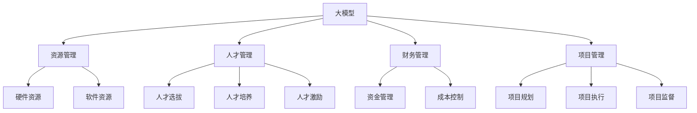

                 

## 1. 背景介绍

人工智能(AI)正在深刻改变各个行业，尤其是大模型创业领域。大模型创业公司需要深入理解AI的核心概念，并善于管理AI项目。本文将探讨如何利用管理优势，提升AI大模型创业的成效。

## 2. 核心概念与联系

### 2.1 核心概念概述

- **大模型 (Large Model)**：通常指具有数十亿参数的大型神经网络模型，用于处理大规模数据并输出精确结果。
- **创业 (Entrepreneurship)**：创建并管理新的商业企业，探索市场机会和创新解决方案。
- **管理 (Management)**：协调、控制并优化资源以达成目标的过程，包括项目、团队和财务等各个方面。

将AI大模型创业与核心管理概念联系起来，可以概括为：
- **资源管理**：合理配置硬件资源和软件资源，以高效开发和维护AI大模型。
- **人才管理**：选拔、培养和激励高素质的AI人才团队，以推动技术创新和商业化进程。
- **财务管理**：优化资金流动，控制成本，确保公司可持续发展。
- **项目管理**：有效规划、执行和监督AI项目，提升项目成功率和效率。

### 2.2 核心概念原理和架构的 Mermaid 流程图



此流程图展示了AI大模型创业的核心概念架构，其中每个节点代表一个关键的管理活动，相互关联以确保项目成功。

## 3. 核心算法原理 & 具体操作步骤

### 3.1 算法原理概述

AI大模型创业的关键在于建立高效的算法流程和数据管道，同时优化资源配置，以支持模型的开发和部署。算法流程通常包括以下步骤：

1. **数据准备**：收集、清洗和标注数据，以供模型训练。
2. **模型选择**：根据任务需求选择适当的大模型或定制模型。
3. **模型训练**：使用大量数据训练模型，以优化模型参数。
4. **模型评估**：评估模型性能，确保其满足业务需求。
5. **模型部署**：将模型部署到生产环境，以提供实时服务。

### 3.2 算法步骤详解

1. **数据准备**：
   - 收集多样化的数据，确保模型泛化能力强。
   - 数据清洗：删除无关数据、修复错误数据。
   - 数据标注：为数据添加标签，以供模型训练。

2. **模型选择**：
   - 评估不同模型的性能和复杂度，选择最适模型。
   - 考虑模型规模、资源需求和应用场景。

3. **模型训练**：
   - 使用高性能计算资源（如GPU、TPU）加速模型训练。
   - 采用分布式训练技术，提高训练效率。
   - 设置合适的学习率、优化器等参数。

4. **模型评估**：
   - 使用准确率、召回率等指标评估模型效果。
   - 进行交叉验证，确保模型稳定可靠。

5. **模型部署**：
   - 将模型封装为API或服务，便于调用。
   - 确保模型在不同环境下的兼容性和稳定性。
   - 监控模型性能，及时更新和优化。

### 3.3 算法优缺点

#### 优点：

1. **高效开发**：使用大模型可以快速开发高质量AI应用。
2. **资源利用**：合理配置资源，提高硬件和软件使用效率。
3. **技术领先**：选择先进的大模型和算法，保持技术领先地位。

#### 缺点：

1. **数据依赖**：高质量数据是模型性能的保障，但获取高质量数据成本高。
2. **资源消耗**：大模型训练和部署需要大量计算资源，成本高。
3. **模型复杂**：模型规模大，结构复杂，调试和维护难度大。

### 3.4 算法应用领域

- **自然语言处理(NLP)**：如文本分类、情感分析、机器翻译等。
- **计算机视觉(CV)**：如图像识别、物体检测、视频分析等。
- **语音处理**：如语音识别、语音合成、说话人识别等。
- **推荐系统**：如电商推荐、内容推荐、广告推荐等。
- **游戏AI**：如游戏智能体、游戏数据分析等。

## 4. 数学模型和公式 & 详细讲解 & 举例说明

### 4.1 数学模型构建

大模型创业中的数学模型主要关注模型训练的优化过程。以线性回归模型为例，其目标是最小化预测值与真实值之间的平方误差。数学模型可表示为：

$$ \min_{\theta} \sum_{i=1}^N (y_i - f_\theta(x_i))^2 $$

其中，$y_i$ 为真实值，$f_\theta(x_i)$ 为模型预测值，$\theta$ 为模型参数。

### 4.2 公式推导过程

使用梯度下降法求解上述最小化问题，公式推导如下：

1. 计算损失函数的梯度：
   $$ \nabla_\theta \mathcal{L}(\theta) = \nabla_\theta \sum_{i=1}^N (y_i - f_\theta(x_i))^2 $$
2. 更新模型参数：
   $$ \theta \leftarrow \theta - \eta \nabla_\theta \mathcal{L}(\theta) $$

其中，$\eta$ 为学习率，控制参数更新的幅度。

### 4.3 案例分析与讲解

以图像分类为例，假设使用卷积神经网络(CNN)作为大模型，训练数据集包含10000张图片，标签数为10。采用随机梯度下降法，设置学习率为0.01，训练50次。每次训练使用100张图片的小批量数据，计算梯度并更新模型参数。

## 5. 项目实践：代码实例和详细解释说明

### 5.1 开发环境搭建

1. **安装Python**：确保Python环境稳定。
2. **安装TensorFlow或PyTorch**：选择适合自己项目的深度学习框架。
3. **安装其他依赖**：如numpy、scikit-learn等。

### 5.2 源代码详细实现

以TensorFlow为例，代码如下：

```python
import tensorflow as tf
from tensorflow.keras import layers

# 定义模型
model = tf.keras.Sequential([
    layers.Conv2D(32, (3, 3), activation='relu', input_shape=(28, 28, 1)),
    layers.MaxPooling2D((2, 2)),
    layers.Conv2D(64, (3, 3), activation='relu'),
    layers.MaxPooling2D((2, 2)),
    layers.Flatten(),
    layers.Dense(10, activation='softmax')
])

# 编译模型
model.compile(optimizer=tf.keras.optimizers.Adam(0.01),
              loss='categorical_crossentropy',
              metrics=['accuracy'])

# 训练模型
model.fit(x_train, y_train, epochs=50, batch_size=32, validation_data=(x_val, y_val))
```

### 5.3 代码解读与分析

**数据准备**：
- 使用TensorFlow的数据集模块加载数据。
- 预处理图片数据，将像素值归一化。
- 将标签转换为one-hot编码。

**模型训练**：
- 使用Sequential模型定义网络结构。
- 使用优化器Adam训练模型。
- 设置损失函数为交叉熵，评估指标为准确率。

**模型评估**：
- 在验证集上评估模型，查看准确率和损失。
- 根据验证集表现调整模型参数。

### 5.4 运行结果展示

绘制训练过程中的准确率和损失变化图，以评估模型训练效果。

## 6. 实际应用场景

### 6.1 智能客服系统

智能客服系统利用大模型进行用户意图识别和对话生成，显著提升客户体验。

### 6.2 金融风险管理

使用大模型进行信用评分、欺诈检测等，降低金融风险。

### 6.3 智能推荐系统

推荐系统使用大模型进行用户兴趣分析，实现个性化推荐。

### 6.4 未来应用展望

未来大模型将在更多领域得到应用，如医疗、教育、城市管理等，带来颠覆性变革。

## 7. 工具和资源推荐

### 7.1 学习资源推荐

1. **Coursera**：提供深度学习、机器学习和AI领域的在线课程。
2. **edX**：提供多门与AI相关的高级课程。
3. **Kaggle**：提供数据科学和机器学习的竞赛和社区资源。
4. **arXiv**：提供最新的AI研究论文。

### 7.2 开发工具推荐

1. **Jupyter Notebook**：交互式编程环境，适合AI开发。
2. **TensorBoard**：可视化工具，帮助监控和调试模型。
3. **Visual Studio Code**：轻量级开发工具，支持多种语言。

### 7.3 相关论文推荐

1. **Large-Scale Deep Learning for Healthcare Prediction**：利用深度学习提升医疗预测准确率。
2. **Deep Learning for Recommender Systems**：使用深度学习进行个性化推荐。
3. **Adversarial Machine Learning**：介绍对抗机器学习的概念和应用。

## 8. 总结：未来发展趋势与挑战

### 8.1 研究成果总结

大模型创业在技术、商业和社会各个方面都有重要影响。其主要研究成果包括：
1. **技术突破**：提出新的算法和模型，提升AI性能。
2. **应用拓展**：解决跨领域问题，推动AI应用落地。
3. **商业模式创新**：创造新的商业模式和用户价值。

### 8.2 未来发展趋势

未来大模型创业的发展趋势包括：
1. **自动化与智能化**：自动化开发流程，提升效率。
2. **多模态融合**：结合图像、语音、文本等多种数据，提升模型能力。
3. **跨领域融合**：结合不同学科知识，推动AI技术创新。

### 8.3 面临的挑战

大模型创业面临的挑战包括：
1. **数据隐私与伦理**：保护用户隐私，避免数据滥用。
2. **计算资源限制**：高性能计算资源成本高，难以广泛应用。
3. **技术壁垒高**：技术难度大，需要高水平团队支撑。

### 8.4 研究展望

未来研究应关注以下方面：
1. **隐私保护**：研究隐私保护技术，确保数据安全。
2. **跨领域应用**：推动AI技术跨领域融合，实现多模态信息融合。
3. **边缘计算**：探索边缘计算解决方案，提升AI模型的实时性。

## 9. 附录：常见问题与解答

**Q1: 大模型在创业项目中的应用有哪些？**

A: 大模型可以应用于自然语言处理、计算机视觉、语音识别、推荐系统等领域，提供强大的AI能力。

**Q2: 如何管理AI大模型的资源？**

A: 合理配置硬件资源和软件资源，使用分布式训练技术，优化资源使用效率。

**Q3: 大模型创业如何保持技术领先？**

A: 定期更新模型，采用最先进的技术和算法，保持团队技术和知识更新。

**Q4: 如何处理AI模型的数据隐私问题？**

A: 采用数据脱敏、加密等技术保护用户隐私，确保数据合规。

**Q5: 如何管理AI模型的开发流程？**

A: 制定详细的项目计划，设置里程碑，确保按时完成任务。

---

作者：禅与计算机程序设计艺术 / Zen and the Art of Computer Programming

