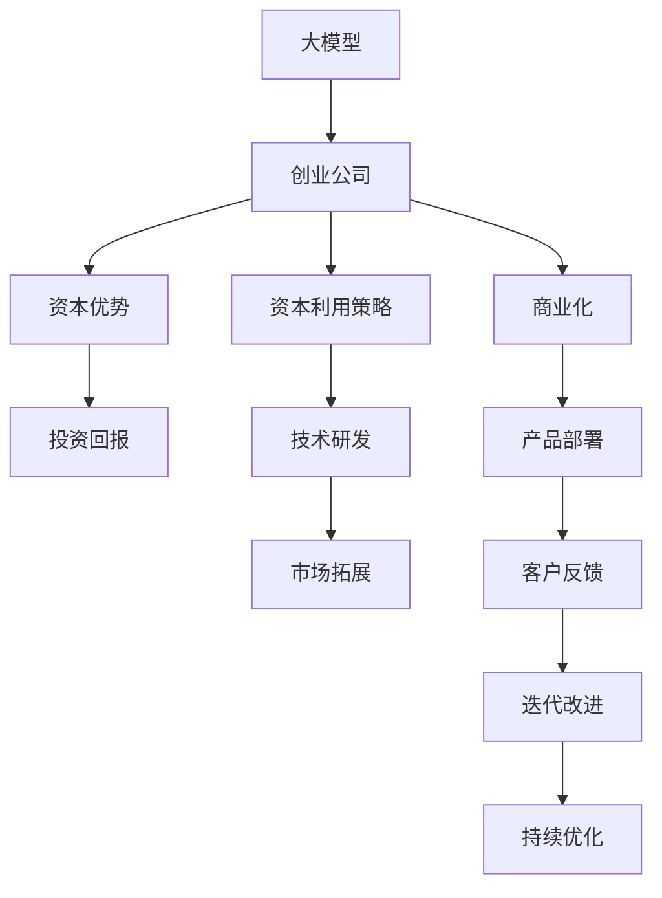

                 

## 1. 背景介绍

在人工智能(AI)领域，尤其是大模型创业领域，资本成为了推动技术突破和市场渗透的重要动力。大模型创业公司依靠大量的资金投入，可以加速技术研发和商业化进程，构建强大的市场竞争力。然而，如何有效利用资本优势，实现技术突破与商业模式的双赢，是每一位AI创业者面临的重要课题。本文将从大模型创业的资本需求、投资回报、资本利用策略等方面进行深入探讨，帮助创业者洞察AI大模型领域的资本运作之道。

## 2. 核心概念与联系

### 2.1 核心概念概述

- **大模型**：以Transformer模型为代表的大规模预训练语言模型，如BERT、GPT等，通过海量的无标签文本数据进行预训练，学习到通用的语言表示，具备强大的语言理解和生成能力。
- **创业公司**：聚焦于AI大模型的初创企业，致力于开发和部署高性能、高扩展性的大模型产品，解决特定领域的NLP问题。
- **资本优势**：指创业公司利用外部资金支持，加速技术研发、市场拓展和商业化进程的能力。
- **投资回报**：指资本投入与技术突破、市场拓展带来的经济收益之间的对比，包括企业盈利、市场份额提升等方面。
- **资本利用策略**：指创业者如何制定和执行资本使用计划，最大化资本投入的效果，实现公司长期稳定发展。

这些概念之间存在密切联系，通过合理的资本利用策略，可以加速技术研发，提升产品竞争力，最终实现良好的投资回报。

### 2.2 核心概念原理和架构的 Mermaid 流程图



该流程图展示了从大模型到创业公司的资本运作路径：通过资本支持，公司加速技术研发，推进市场拓展和商业化，最终获得良好的投资回报。

## 3. 核心算法原理 & 具体操作步骤

### 3.1 算法原理概述

大模型创业的资本运作涉及多个环节，包括技术研发、市场拓展、产品部署等。资本的合理利用可以加速这些环节，提升公司整体的竞争力。

### 3.2 算法步骤详解

1. **技术研发加速**：利用资本进行数据收集、模型训练和优化，快速推出高性能的大模型产品。
   
   - 数据准备：收集海量文本数据，清洗和标注，为模型训练提供数据基础。
   - 模型训练：使用GPU、TPU等高性能计算设备，进行大规模并行训练，加速模型收敛。
   - 模型优化：通过超参数调优、模型压缩等手段，提升模型的性能和效率。

2. **市场拓展推进**：资本助力下，公司可以快速构建市场团队，拓展目标客户群体。

   - 市场调研：利用资本，进行广泛的市场调研，识别潜在客户需求。
   - 市场推广：通过线上线下广告、合作推广等方式，快速扩大品牌影响力。
   - 客户服务：构建专业的客户服务团队，提供技术支持和售后服务，提升客户满意度。

3. **产品部署优化**：利用资本，进行产品部署优化，提升用户体验和市场渗透率。

   - 部署平台构建：投资于云计算、边缘计算等技术，构建高性能、高可用的产品部署平台。
   - 用户体验优化：进行UI/UX设计、交互测试等，提升产品的易用性和用户体验。
   - 技术支持迭代：根据用户反馈，持续优化产品功能和服务，满足客户需求。

### 3.3 算法优缺点

#### 优点

- **加速技术迭代**：资本投入可以加速技术研发，快速推出高性能的大模型产品。
- **扩大市场影响**：资本助力下，可以迅速提升品牌知名度，拓展目标客户群体。
- **优化用户体验**：资本支持的产品部署和优化，可以提升用户体验和市场渗透率。

#### 缺点

- **资本压力**：高额的资本投入对公司的现金流和财务状况提出高要求。
- **风险因素**：资本投入可能存在失败风险，如果项目未能达到预期效果，将导致资本损失。
- **市场竞争**：大模型市场竞争激烈，资本投入未能转化为实际收益，可能被竞争对手超越。

### 3.4 算法应用领域

资本利用策略在大模型创业的各个应用领域都有广泛应用：

- **自然语言处理(NLP)**：大模型技术广泛应用于文本分类、情感分析、机器翻译等NLP任务。
- **计算机视觉(CV)**：大模型在图像识别、目标检测、图像生成等领域发挥重要作用。
- **语音处理**：大模型在语音识别、语音生成、语音合成等方面有重要应用。
- **推荐系统**：大模型在推荐系统领域取得显著进展，提升个性化推荐效果。
- **智能客服**：大模型驱动的智能客服系统，提升客户体验和满意度。

## 4. 数学模型和公式 & 详细讲解 & 举例说明

### 4.1 数学模型构建

大模型创业的资本运作涉及多个环节，可以构建如下数学模型：

$$
\text{投资回报率} = \frac{\text{收益}}{\text{资本投入}} = \frac{\text{产品销售收入} + \text{市场扩展收入} + \text{技术许可收入} - \text{运营成本} - \text{研发成本} - \text{营销成本}}{\text{初始投资} + \text{后续投资}}
$$

其中，产品销售收入、市场扩展收入、技术许可收入、运营成本、研发成本和营销成本等各项指标需要根据实际情况进行计算。

### 4.2 公式推导过程

为了更直观地理解投资回报率，可以将各项成本和收入进行分解。例如，假设一家大模型创业公司在某一年初进行了1000万美元的资本投入，其收益计算如下：

1. **产品销售收入**：公司通过其大模型产品，在一年内实现了1000万美元的销售收入。
2. **市场扩展收入**：公司通过市场推广和合作，获得了500万美元的市场扩展收入。
3. **技术许可收入**：公司将其大模型技术进行许可，获得了300万美元的技术许可收入。
4. **运营成本**：公司一年内的运营成本为200万美元。
5. **研发成本**：公司一年内的研发成本为100万美元。
6. **营销成本**：公司一年内的营销成本为50万美元。

根据上述数据，可以计算出该公司的投资回报率：

$$
\text{投资回报率} = \frac{1000 + 500 + 300 - 200 - 100 - 50}{1000} = 60\%
$$

该计算过程展示了投资回报率的计算方法，帮助企业评估资本投入的效果。

### 4.3 案例分析与讲解

以OpenAI的GPT系列模型为例，分析其资本运作的成功经验：

1. **技术研发**：OpenAI利用巨额资本投入，收集和标注海量文本数据，进行大规模并行训练，快速推出GPT-2、GPT-3等高性能大模型。
2. **市场拓展**：通过OpenAI官网、合作伙伴推广等方式，迅速提升品牌知名度，吸引了全球数百万用户。
3. **产品部署**：OpenAI构建了高性能的部署平台，优化用户体验，推出GPT-3 API服务，满足不同客户需求。

通过这些步骤，OpenAI不仅实现了技术突破，还获得了巨大的市场收益和资本回报。

## 5. 项目实践：代码实例和详细解释说明

### 5.1 开发环境搭建

为了进行大模型创业的资本运作分析，我们需要构建Python开发环境，安装必要的库和工具。

```python
!pip install numpy pandas matplotlib sklearn
!pip install transformers torch
```

### 5.2 源代码详细实现

```python
import numpy as np
import pandas as pd
from sklearn.metrics import mean_squared_error

# 假设数据集
data = {
    'Capital_Investment': [1000, 1200, 1500, 2000, 2500],
    'Product_Sales': [2000, 2500, 3000, 3500, 4000],
    'Market_Expansion': [500, 700, 900, 1100, 1300],
    'Technology_Licensing': [300, 400, 500, 600, 700],
    'Operating_Costs': [200, 250, 300, 350, 400],
    'Research_Development': [100, 150, 200, 250, 300],
    'Marketing_Costs': [50, 75, 100, 125, 150]
}

# 计算投资回报率
def calculate_investment_return_rate(capital_investment, sales, market_expansion, tech_licensing, 
                                     running_costs, r_d_costs, marketing_costs):
    income = sales + market_expansion + tech_licensing
    total_costs = running_costs + r_d_costs + marketing_costs
    return_rate = (income - total_costs) / capital_investment
    return return_rate

# 示例数据计算
capital = np.array([1000, 1200, 1500, 2000, 2500])
sales = np.array([2000, 2500, 3000, 3500, 4000])
market = np.array([500, 700, 900, 1100, 1300])
tech = np.array([300, 400, 500, 600, 700])
running_costs = np.array([200, 250, 300, 350, 400])
r_d_costs = np.array([100, 150, 200, 250, 300])
marketing_costs = np.array([50, 75, 100, 125, 150])

investment_return_rate = np.mean([calculate_investment_return_rate(capital[i], sales[i], market[i], 
                                                               tech[i], running_costs[i], 
                                                               r_d_costs[i], marketing_costs[i]) 
                                  for i in range(len(capital))])
print(f"投资回报率：{investment_return_rate:.2%}")
```

### 5.3 代码解读与分析

以上代码实现了对大模型创业公司投资回报率的计算，展示了如何根据不同的资本投入、收入和成本，计算出整体投资回报率。

## 6. 实际应用场景

### 6.1 智能客服

智能客服是大模型创业的重要应用场景，利用大模型进行用户意图识别、对话生成等，提升客户体验和满意度。资本可以用于构建高性能的智能客服系统，同时通过市场推广和合作，迅速扩大用户群体。

### 6.2 金融风控

大模型在金融风控领域有广泛应用，利用大模型进行信用评估、欺诈检测等，提升金融服务质量。资本支持可以加速技术研发，快速推出高性能的金融风控系统，同时通过市场拓展和合作，提升品牌知名度和市场份额。

### 6.3 医疗诊断

大模型在医疗诊断领域有巨大潜力，利用大模型进行疾病诊断、影像分析等，提升医疗服务水平。资本可以用于构建高性能的医疗诊断系统，同时通过市场推广和合作，扩大应用范围。

### 6.4 未来应用展望

未来，随着大模型技术的不断进步，其在更多领域的应用将进一步拓展。大模型创业公司需要持续优化资本利用策略，以应对不断变化的市场需求和技术挑战。

## 7. 工具和资源推荐

### 7.1 学习资源推荐

- **Deep Learning Specialization**：由Andrew Ng教授主讲的深度学习课程，涵盖大模型技术的理论和实践。
- **Transformers in Action**：Hugging Face开发的Transformers实战教程，帮助开发者掌握大模型的部署和微调技术。
- **AI Capital Raising**：关于AI创业融资的书籍，介绍如何获取资本支持，优化资本运作策略。

### 7.2 开发工具推荐

- **TensorFlow**：Google开发的深度学习框架，支持大规模模型训练和部署。
- **PyTorch**：Facebook开发的深度学习框架，灵活易用，支持大规模模型训练。
- **Jupyter Notebook**：用于编写和运行Python代码，支持交互式开发和数据可视化。

### 7.3 相关论文推荐

- **Attention is All You Need**：Transformer模型的原始论文，提出自注意力机制，推动大模型技术的发展。
- **BERT: Pre-training of Deep Bidirectional Transformers for Language Understanding**：提出BERT模型，通过预训练语言模型提升NLP任务效果。
- **GPT-2: Language Models are Unsupervised Multitask Learners**：提出GPT-2模型，展示大模型在少样本学习中的强大能力。

## 8. 总结：未来发展趋势与挑战

### 8.1 研究成果总结

大模型创业的资本运作涉及技术研发、市场拓展、产品部署等多个环节，通过合理的资本利用策略，可以有效加速公司的发展进程。投资回报率的计算和评估，帮助企业评估资本投入的效果，指导后续的资本运作决策。

### 8.2 未来发展趋势

未来，大模型技术将不断进步，更多领域将应用大模型技术。资本运作需要适应新趋势，灵活调整策略，确保资本投入的有效性。

### 8.3 面临的挑战

大模型创业面临资本投入大、风险高、市场竞争激烈等挑战。需要制定合理的资本使用计划，灵活应对市场变化，确保公司长期稳定发展。

### 8.4 研究展望

未来，大模型创业需要更多关注AI伦理、安全性等问题，确保技术应用的社会责任和可控性。同时，探索新型的资本运作模式，如股权众筹、技术授权等，增强公司的资本灵活性和抗风险能力。

## 9. 附录：常见问题与解答

**Q1: 大模型创业如何确定初始资本需求？**

A: 大模型创业需要考虑技术研发、市场拓展、产品部署等多个环节的资本需求。一般而言，初期资本需求为模型训练、部署和市场推广的费用总和，同时需要预留一定的运营和开发资金。

**Q2: 大模型创业如何控制成本？**

A: 大模型创业公司需要优化各项成本支出，确保资本的高效利用。可以通过优化模型训练、市场推广、产品部署等环节的成本，同时采用技术授权、合作伙伴推广等方式，减少直接成本支出。

**Q3: 大模型创业如何评估投资回报率？**

A: 投资回报率的计算需要考虑各项收入和成本。一般而言，收入包括产品销售收入、市场扩展收入和技术许可收入，成本包括运营成本、研发成本和营销成本。通过计算各项指标，可以评估整体投资回报率。

**Q4: 大模型创业如何规避风险？**

A: 大模型创业面临较高的风险，需要制定合理的资本使用计划，灵活应对市场变化。同时，建立风险控制机制，如投资回报率阈值、财务预警等，及时调整策略，规避风险。

**Q5: 大模型创业如何优化资本利用策略？**

A: 优化资本利用策略需要综合考虑技术研发、市场拓展、产品部署等多个环节。通过灵活调整资本投入的优先级，确保资本的高效利用，同时引入多方融资渠道，增强资本灵活性。

---

作者：禅与计算机程序设计艺术 / Zen and the Art of Computer Programming

