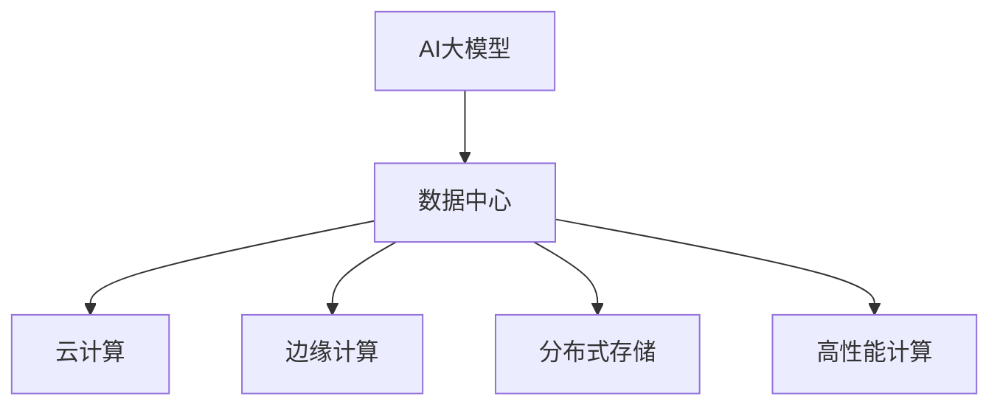

                 

# AI 大模型应用数据中心建设：数据中心产业发展

> 关键词：AI大模型, 数据中心, 云计算, 边缘计算, 分布式存储, 高性能计算

## 1. 背景介绍

### 1.1 问题由来
随着人工智能（AI）和大数据技术的飞速发展，AI大模型在众多应用场景中展现出了强大的潜力。它们依赖于海量数据和强大的计算能力，能够通过预训练和微调不断提升自身的性能，从而在自然语言处理、计算机视觉、推荐系统等领域取得突破性进展。然而，AI大模型的应用并非一帆风顺，其中数据中心的建设和运维成为了一个关键挑战。

### 1.2 问题核心关键点
数据中心是AI大模型应用的核心基础设施，其设计和运行效率直接影响到AI应用的质量和稳定性。本文将围绕数据中心的建设与运维，探讨如何构建高效、可靠、可持续发展的数据中心，以支持AI大模型的应用。

## 2. 核心概念与联系

### 2.1 核心概念概述

为更好地理解AI大模型应用的数据中心，本文将介绍几个核心概念：

- **AI大模型**：指通过预训练和微调方法，能够在特定任务上取得优异性能的大型神经网络模型，如BERT、GPT-3等。
- **数据中心**：大规模计算资源集中部署、管理和调度的设施，提供高性能计算、存储和网络服务。
- **云计算**：基于互联网的计算模式，用户按需访问计算资源，包括存储、计算、网络等服务。
- **边缘计算**：将计算任务分散到数据源附近进行，减少数据传输和延迟，适用于低带宽、高延迟场景。
- **分布式存储**：通过多台服务器协同工作，实现数据的高可用性、可扩展性和高性能存储。
- **高性能计算（HPC）**：指能够高效处理大数据和复杂计算任务的计算机系统，适用于深度学习和科学计算等场景。

这些概念之间的逻辑关系可以通过以下Mermaid流程图来展示：



这个流程图展示了大模型应用的数据中心与其他相关概念的关联：

1. AI大模型依托于数据中心提供的基础设施。
2. 数据中心通过云计算、边缘计算、分布式存储、高性能计算等技术，保障大模型的训练和推理。
3. 这些技术互为补充，共同支持AI大模型的高效运行。

## 3. 核心算法原理 & 具体操作步骤

### 3.1 算法原理概述

AI大模型的应用与数据中心的建设密不可分。大模型的训练和推理通常需要大量的计算资源和存储空间，数据中心的建设和运维成为了这一过程的关键。

在数据中心中，高性能计算、分布式存储和网络服务是支持AI大模型应用的核心。其中，高性能计算负责计算任务的处理，分布式存储负责数据的存储和管理，网络服务则负责数据和计算任务在数据中心内部的传输。

### 3.2 算法步骤详解

数据中心的建设和运维涉及多个环节，以下是具体的步骤：

**Step 1: 需求分析和规划**
- 根据AI大模型应用的需求，确定数据中心的规模、位置、性能等要求。
- 分析计算资源、存储资源、网络资源的需求量，进行资源规划。
- 确定数据中心的基础设施和部署方式，如IDC、私有云、公有云等。

**Step 2: 硬件和网络部署**
- 选择适合的高性能计算服务器和存储设备，配置必要的硬件和软件。
- 部署高速、低延迟的网络设备，如交换机、路由器等，确保数据传输的高效性。
- 实现网络隔离和冗余，保障数据中心的安全性和可靠性。

**Step 3: 分布式存储系统建设**
- 搭建分布式文件系统（如Hadoop、Ceph等），实现数据的分布式存储。
- 配置数据备份和恢复机制，确保数据的安全性和高可用性。
- 优化存储性能，如通过数据压缩、缓存等技术提高读写效率。

**Step 4: 高性能计算集群构建**
- 选择合适的计算平台（如AWS EC2、Google Compute Engine等），构建高性能计算集群。
- 配置任务调度系统（如Kubernetes、Slurm等），优化计算资源的利用率。
- 使用GPU、FPGA等加速硬件，提高计算效率。

**Step 5: 网络服务优化**
- 配置负载均衡器，实现计算任务的高效调度。
- 优化网络拓扑，减少数据传输的延迟和带宽占用。
- 实现网络监控和故障诊断，保障网络服务的稳定性。

**Step 6: 系统集成和测试**
- 将高性能计算、分布式存储、网络服务等组件集成到数据中心中。
- 进行系统测试，验证各组件的兼容性和性能。
- 优化系统配置，确保数据中心的高效运行。

**Step 7: 运维和优化**
- 实时监控数据中心运行状态，发现并解决问题。
- 定期更新和升级硬件、软件，提升数据中心的性能和稳定性。
- 根据业务需求，调整资源分配，优化资源利用率。

### 3.3 算法优缺点

构建高效的数据中心，可以为AI大模型的应用提供坚实的基础设施，但也面临以下挑战：

**优点**：
1. 高效支持大规模计算和存储需求。数据中心提供了高性能计算和分布式存储，能够处理AI大模型的训练和推理。
2. 保障了数据的安全性和高可用性。分布式存储和网络冗余机制能够保障数据的备份和恢复。
3. 灵活的资源调度，优化了计算资源的利用率。任务调度系统能够根据需求动态分配计算资源。

**缺点**：
1. 建设成本高。数据中心的建设需要大量的硬件设备和基础设施，初始投资较高。
2. 运维复杂。数据中心的运维需要专业的团队和技术支持，维护成本较高。
3. 能耗高。数据中心的高性能计算和存储设备能耗较大，对环境影响较大。
4. 扩展性有限。数据中心的扩展受限于物理空间的限制，难以大规模扩展。

尽管存在这些挑战，但数据中心仍是AI大模型应用不可或缺的基础设施。在设计和运维过程中，需要综合考虑成本、性能、扩展性等因素，力求构建高效、可靠、可持续发展的数据中心。

### 3.4 算法应用领域

AI大模型应用的数据中心技术在多个领域中得到了广泛应用，例如：

- 科学研究：如天气预测、分子模拟等科学计算任务，依赖于高性能计算和分布式存储。
- 金融行业：如高频交易、风险评估等金融分析任务，需要高性能计算和低延迟网络。
- 医疗行业：如基因组分析、医疗影像诊断等任务，需要强大的计算和存储能力。
- 自然语言处理：如语音识别、自然语言理解等任务，需要高性能计算和分布式存储。
- 计算机视觉：如图像处理、视频分析等任务，需要高性能计算和低延迟网络。

这些领域的数据中心建设和运维，都需要基于高性能计算、分布式存储和网络服务等核心技术，确保AI大模型的高效运行。

## 4. 数学模型和公式 & 详细讲解 & 举例说明

### 4.1 数学模型构建

为了更好地理解AI大模型应用的数据中心，本文将使用数学语言对数据中心的建设和运维进行更加严格的刻画。

假设数据中心的计算能力为 $C$，存储容量为 $S$，网络带宽为 $B$，其中 $C$、$S$、$B$ 的单位均为单位资源（如GPU个数、硬盘大小、带宽单位）。

定义数据中心在单位时间内的计算效率为 $E_C$，存储效率为 $E_S$，网络传输效率为 $E_B$，其中 $E_C$、$E_S$、$E_B$ 分别为计算、存储、网络传输单位资源单位时间的输出量。

则数据中心的整体效率 $E$ 为：

$$
E = \frac{E_C}{C} + \frac{E_S}{S} + \frac{E_B}{B}
$$

### 4.2 公式推导过程

数据中心建设和运维的目标是最大化整体效率 $E$。为了实现这一目标，需要对计算、存储、网络等资源进行合理的配置和调度。

**优化目标**：

$$
\max E = \frac{E_C}{C} + \frac{E_S}{S} + \frac{E_B}{B}
$$

**约束条件**：

$$
\begin{cases}
C \geq 0 \\
S \geq 0 \\
B \geq 0 \\
\end{cases}
$$

其中 $C$、$S$、$B$ 均非负。

### 4.3 案例分析与讲解

以下是一个简单的案例分析：

假设一个数据中心有 $C=1000$ 个GPU，$S=100$ TB 的硬盘空间，$B=100$ Gbps 的网络带宽。通过配置不同的资源分配策略，计算不同策略下的整体效率 $E$。

**策略1**：
- 将所有资源均匀分配到计算、存储、网络三个部分，即 $C_1=S_1=B_1=1000$。
- 计算效率 $E_C=1$，存储效率 $E_S=1$，网络传输效率 $E_B=1$。
- 整体效率 $E=1$。

**策略2**：
- 将所有资源集中分配到计算部分，即 $C_2=1000$，$S_2=B_2=0$。
- 计算效率 $E_C=1$，存储效率 $E_S=0$，网络传输效率 $E_B=0$。
- 整体效率 $E=1$。

**策略3**：
- 将所有资源集中分配到存储部分，即 $C_3=S_3=B_3=0$。
- 计算效率 $E_C=0$，存储效率 $E_S=1$，网络传输效率 $E_B=0$。
- 整体效率 $E=0$。

通过上述分析，可以看到，合理分配资源是提高数据中心整体效率的关键。不同应用场景下的资源需求不同，需要根据具体需求进行资源配置和调度。

## 5. 项目实践：代码实例和详细解释说明

### 5.1 开发环境搭建

在进行数据中心建设和运维的实践前，我们需要准备好开发环境。以下是使用Python进行数据中心管理系统开发的环境配置流程：

1. 安装Anaconda：从官网下载并安装Anaconda，用于创建独立的Python环境。

2. 创建并激活虚拟环境：
```bash
conda create -n dc-env python=3.8 
conda activate dc-env
```

3. 安装PyTorch、TensorFlow等深度学习框架：
```bash
conda install torch torchvision torchaudio cudatoolkit=11.1 -c pytorch -c conda-forge
conda install tensorflow -c tensorflow
```

4. 安装Flask、SQLAlchemy等Web开发框架和数据库工具：
```bash
pip install flask sqlalchemy pymysql
```

5. 安装监控工具，如Prometheus、Grafana：
```bash
pip install prometheus_client[http]
pip install grafana
```

完成上述步骤后，即可在`dc-env`环境中开始数据中心管理系统的开发。

### 5.2 源代码详细实现

下面以构建高性能计算集群为例，给出使用Python和Flask构建数据中心管理系统的代码实现。

首先，定义计算资源的类：

```python
class ComputeResource:
    def __init__(self, name, capacity, cost):
        self.name = name
        self.capacity = capacity
        self.cost = cost
        self.used_capacity = 0
    
    def available_capacity(self):
        return self.capacity - self.used_capacity
    
    def use_capacity(self, amount):
        self.used_capacity += amount
```

然后，定义计算任务和调度器的类：

```python
class ComputeTask:
    def __init__(self, name, required_capacity, cost, priority):
        self.name = name
        self.required_capacity = required_capacity
        self.cost = cost
        self.priority = priority
    
    def complete(self):
        return self.used_capacity == self.required_capacity

class ComputeScheduler:
    def __init__(self, compute_resources):
        self.resources = compute_resources
    
    def allocate_task(self, task):
        for resource in self.resources:
            if resource.available_capacity() >= task.required_capacity:
                resource.use_capacity(task.required_capacity)
                return True
        return False
```

接着，定义数据中心的类：

```python
class DataCenter:
    def __init__(self, compute_resources, storage_resources, network_resources):
        self.resources = {
            'compute': compute_resources,
            'storage': storage_resources,
            'network': network_resources
        }
    
    def allocate_task(self, task):
        if self.resources['compute'].allocate_task(task):
            return True
        else:
            return False
```

最后，定义Web接口，展示计算资源的可用性和任务调度情况：

```python
from flask import Flask, jsonify

app = Flask(__name__)

@app.route('/api/compute', methods=['GET'])
def get_compute_resources():
    resources = []
    for resource in data_center.resources['compute']:
        resources.append({
            'name': resource.name,
            'capacity': resource.capacity,
            'used_capacity': resource.used_capacity,
            'available_capacity': resource.available_capacity()
        })
    return jsonify(resources)

@app.route('/api/compute/task', methods=['POST'])
def allocate_task():
    task_data = request.get_json()
    task = ComputeTask(task_data['name'], task_data['required_capacity'], task_data['cost'], task_data['priority'])
    if data_center.allocate_task(task):
        return jsonify({'status': 'success', 'task': task.name})
    else:
        return jsonify({'status': 'failure', 'reason': 'Not enough resources available'})

if __name__ == '__main__':
    app.run()
```

在上述代码中，我们定义了计算资源类、计算任务类和调度器类，并通过Flask框架实现了Web接口。这些接口可以展示计算资源的可用性，并接受新的计算任务，返回任务调度的结果。

### 5.3 代码解读与分析

让我们再详细解读一下关键代码的实现细节：

**ComputeResource类**：
- `__init__`方法：初始化计算资源的基本信息。
- `available_capacity`方法：计算剩余可用容量。
- `use_capacity`方法：使用指定容量的资源。

**ComputeTask类**：
- `__init__`方法：初始化计算任务的基本信息。
- `complete`方法：判断任务是否完成。

**ComputeScheduler类**：
- `__init__`方法：初始化调度器，并存储计算资源。
- `allocate_task`方法：根据任务需求，选择可用资源进行分配。

**DataCenter类**：
- `__init__`方法：初始化数据中心，存储计算、存储和网络资源。
- `allocate_task`方法：将计算任务分配到合适的资源上。

**Flask接口**：
- `get_compute_resources`接口：展示计算资源的可用性。
- `allocate_task`接口：接受新的计算任务，并返回任务调度的结果。

通过这些代码，我们可以看到，使用Python和Flask框架，可以方便地实现数据中心管理系统的开发，对计算资源进行有效的分配和管理。

## 6. 实际应用场景

### 6.1 科学研究

科学研究是AI大模型应用的重要场景之一。在大数据和高性能计算的支撑下，AI大模型在天气预测、分子模拟等领域取得了显著进展。

以天气预测为例，气象数据通常具有海量的规模和高维度的特征。为了处理这些数据，需要构建高性能计算集群，使用分布式存储系统进行数据存储和管理。计算集群可以使用GPU、FPGA等加速硬件，提升计算速度和效率。

### 6.2 金融行业

金融行业对实时性和准确性的要求较高，AI大模型在风险评估、高频交易等领域有广泛应用。构建数据中心时，需要考虑网络延迟和带宽等性能指标，使用边缘计算等技术，将计算任务分配到数据源附近进行，减少数据传输和延迟，提升计算效率。

### 6.3 医疗行业

医疗行业对数据的安全性和隐私保护要求较高，AI大模型在医疗影像诊断、基因组分析等领域有重要应用。构建数据中心时，需要选择合适的硬件和软件，确保数据的高可用性和安全保护。同时，使用分布式存储和网络冗余机制，保障数据的备份和恢复。

### 6.4 自然语言处理

自然语言处理是AI大模型应用的重要领域之一。在大规模语料库的支持下，AI大模型在情感分析、文本分类、机器翻译等任务上取得了显著进展。构建数据中心时，需要配置高性能计算和分布式存储，确保模型的高效训练和推理。

### 6.5 计算机视觉

计算机视觉是AI大模型应用的另一个重要领域。在图像处理、视频分析等任务中，AI大模型需要处理高分辨率、高维度的数据。构建数据中心时，需要配置高速、低延迟的网络设备和高性能计算集群，确保模型的实时处理和响应。

## 7. 工具和资源推荐

### 7.1 学习资源推荐

为了帮助开发者系统掌握数据中心建设和运维的理论基础和实践技巧，这里推荐一些优质的学习资源：

1. **《数据中心建设与运维》系列博文**：深入浅出地介绍了数据中心的建设流程、运维策略和最佳实践。

2. **《云计算基础》课程**：涵盖云计算的核心概念、技术和应用，适合初学者快速入门。

3. **《高性能计算》课程**：介绍高性能计算的理论和实践，包括并行计算、分布式计算等内容。

4. **《分布式存储》课程**：介绍分布式存储系统的原理和实现，涵盖Hadoop、Ceph等主流存储系统。

5. **《网络设计与运维》课程**：介绍网络设计的原则和最佳实践，涵盖网络架构、安全管理等内容。

6. **《数据中心监控与故障诊断》课程**：介绍数据中心监控和故障诊断的工具和技术，涵盖Prometheus、Grafana等监控工具。

通过学习这些资源，相信你一定能够全面掌握数据中心建设和运维的技术，构建高效、可靠、可持续发展的数据中心。

### 7.2 开发工具推荐

高效的数据中心建设和运维需要依赖优秀的工具支持。以下是几款用于数据中心管理和运维的常用工具：

1. **Ansible**：自动化IT基础设施管理的工具，支持自动化配置、部署和管理。

2. **Nagios**：网络监控和故障诊断工具，提供实时监控和报警功能。

3. **Zabbix**：网络监控和告警系统，支持分布式监控和告警。

4. **Prometheus**：高性能开源监控系统，支持多维度数据监控和告警。

5. **Grafana**：可视化监控仪表盘，支持多种数据源和图表展示。

6. **Kubernetes**：容器编排和调度系统，支持自动扩展和负载均衡。

7. **OpenStack**：开源云计算平台，支持基础设施即服务（IaaS）。

合理利用这些工具，可以显著提升数据中心管理和运维的效率，保障AI大模型的稳定运行。

### 7.3 相关论文推荐

数据中心建设和运维的研究源于学界的持续研究。以下是几篇奠基性的相关论文，推荐阅读：

1. **《构建高性能计算集群》**：介绍高性能计算集群的设计和实现，涵盖资源分配、任务调度等内容。

2. **《分布式存储系统设计》**：介绍分布式存储系统的原理和实现，涵盖数据一致性、容错机制等内容。

3. **《云计算基础设施管理》**：介绍云计算基础设施的管理和优化，涵盖资源分配、负载均衡等内容。

4. **《数据中心监控与故障诊断》**：介绍数据中心监控和故障诊断的技术和方法，涵盖监控工具、告警机制等内容。

5. **《高性能计算优化技术》**：介绍高性能计算的优化技术，涵盖加速硬件、算法优化等内容。

这些论文代表了大数据中心建设和运维的发展脉络。通过学习这些前沿成果，可以帮助研究者把握学科前进方向，激发更多的创新灵感。

## 8. 总结：未来发展趋势与挑战

### 8.1 总结

本文对数据中心建设和运维的理论与实践进行了全面系统的介绍。首先，阐述了数据中心在AI大模型应用中的重要性，明确了数据中心建设和运维的目标和要求。其次，从原理到实践，详细讲解了数据中心的建设和运维方法，给出了数据中心管理系统的代码实现。同时，本文还探讨了数据中心在科学研究、金融、医疗、自然语言处理和计算机视觉等诸多领域的应用，展示了数据中心建设的广阔前景。

通过本文的系统梳理，可以看到，构建高效、可靠、可持续发展的数据中心，是大模型应用不可或缺的基础设施。面对未来的挑战和机遇，需要在成本、性能、扩展性等方面进行全面的优化和改进。

### 8.2 未来发展趋势

展望未来，数据中心建设和运维技术将呈现以下几个发展趋势：

1. **智能化和自动化**：引入AI技术，实现数据中心的智能化管理和自动化运维，提升运维效率和质量。

2. **边缘计算和分布式计算**：进一步扩展数据中心的计算和存储能力，支持边缘计算和分布式计算，提升数据中心的高可用性和弹性。

3. **绿色数据中心**：引入节能技术，优化数据中心的能耗，提升能源利用效率。

4. **多云和混合云架构**：构建多云和混合云架构，实现资源的高效利用和灵活调度。

5. **数据安全和隐私保护**：加强数据安全和隐私保护，确保数据中心和数据安全。

6. **软件定义数据中心**：引入软件定义网络（SDN）和网络功能虚拟化（NFV）技术，实现数据中心的集中管理和自动化运维。

这些趋势将进一步提升数据中心的高效性和可靠性，为AI大模型的应用提供更加坚实的支撑。

### 8.3 面临的挑战

尽管数据中心建设和运维技术已经取得了显著进展，但在迈向更加智能化和自动化的过程中，仍面临诸多挑战：

1. **能耗问题**：数据中心的高性能计算和存储设备能耗较高，如何降低能耗，提升能源利用效率，仍需深入研究。

2. **安全性问题**：数据中心存储大量敏感数据，如何保障数据的安全性和隐私保护，需要加强技术和管理措施。

3. **扩展性问题**：数据中心需要支持大规模的计算和存储需求，如何在不增加物理硬件的情况下，实现大规模扩展，仍需研究新的技术。

4. **运维复杂性**：数据中心的管理和运维复杂，如何实现自动化和智能化管理，提升运维效率，仍需深入研究。

5. **成本问题**：数据中心的建设和运维成本较高，如何降低成本，提升资源利用效率，仍需深入研究。

6. **一致性和可靠性**：分布式存储和网络系统需要保障数据的一致性和可靠性，如何提升系统的稳定性和可靠性，仍需深入研究。

面对这些挑战，未来的研究需要在技术和管理方面进行全面的优化和改进，才能构建高效、可靠、可持续发展的数据中心。

### 8.4 研究展望

面对数据中心建设和运维的挑战，未来的研究需要在以下几个方面寻求新的突破：

1. **智能化和自动化**：引入AI技术，实现数据中心的智能化管理和自动化运维，提升运维效率和质量。

2. **绿色数据中心**：引入节能技术，优化数据中心的能耗，提升能源利用效率。

3. **多云和混合云架构**：构建多云和混合云架构，实现资源的高效利用和灵活调度。

4. **数据安全和隐私保护**：加强数据安全和隐私保护，确保数据中心和数据安全。

5. **软件定义数据中心**：引入软件定义网络（SDN）和网络功能虚拟化（NFV）技术，实现数据中心的集中管理和自动化运维。

6. **数据中心性能优化**：引入高性能计算和分布式计算技术，提升数据中心的计算和存储能力。

这些研究方向将引领数据中心技术和运维方法的不断进步，为AI大模型的应用提供更加坚实的支撑。

## 9. 附录：常见问题与解答

**Q1：数据中心建设和运维需要考虑哪些关键因素？**

A: 数据中心建设和运维需要考虑以下关键因素：

1. 计算资源：包括服务器、GPU、FPGA等高性能计算设备。
2. 存储资源：包括硬盘、SSD等存储设备，以及分布式存储系统。
3. 网络资源：包括交换机、路由器等网络设备，以及网络带宽和延迟。
4. 安全性和隐私保护：包括数据加密、访问控制等安全措施。
5. 能耗和环境：包括冷却系统、节能技术等能耗管理措施。
6. 扩展性和弹性：包括水平和垂直扩展，以及弹性计算和存储资源。

这些因素需要在建设和运维过程中进行综合考虑，以构建高效、可靠、可持续发展的数据中心。

**Q2：如何优化数据中心的性能和资源利用率？**

A: 优化数据中心的性能和资源利用率需要从多个方面入手：

1. 合理配置资源：根据应用需求，合理配置计算、存储和网络资源，避免资源浪费。
2. 优化任务调度：使用任务调度系统，动态分配计算资源，提高资源利用率。
3. 引入加速硬件：使用GPU、FPGA等加速硬件，提升计算效率。
4. 采用分布式计算：使用分布式计算系统，提升计算和存储能力。
5. 优化网络传输：使用高速、低延迟的网络设备，优化网络传输效率。
6. 引入数据压缩和缓存技术：优化存储性能，提高读写效率。

通过这些措施，可以显著提升数据中心的性能和资源利用率，保障AI大模型的高效运行。

**Q3：如何保障数据中心的安全性和隐私保护？**

A: 保障数据中心的安全性和隐私保护需要从以下几个方面入手：

1. 数据加密：对敏感数据进行加密，防止数据泄露。
2. 访问控制：使用身份认证和授权机制，限制对敏感数据的访问。
3. 安全监控：使用入侵检测和告警系统，监控数据中心的异常行为。
4. 备份和恢复：使用数据备份和恢复机制，确保数据的高可用性和可恢复性。
5. 物理安全：加强数据中心的物理安全，防止设备被盗和损坏。
6. 法规遵从：确保数据中心的运营符合相关法规和标准，如GDPR、ISO 27001等。

通过这些措施，可以显著提升数据中心的安全性和隐私保护水平，保障数据的安全性和隐私。

**Q4：如何构建高效的数据中心网络？**

A: 构建高效的数据中心网络需要从以下几个方面入手：

1. 高速网络：使用高速、低延迟的网络设备，提升网络传输效率。
2. 负载均衡：使用负载均衡器，实现计算任务的高效调度。
3. 网络隔离：使用网络隔离技术，防止网络攻击和数据泄露。
4. 网络冗余：使用冗余网络设备，确保网络的可靠性和可用性。
5. 网络监控：使用网络监控工具，实时监控网络状态，发现并解决问题。
6. 网络优化：使用网络优化技术，如网络切片、虚拟化等，提升网络性能。

通过这些措施，可以显著提升数据中心的网络性能，保障AI大模型的高效运行。

**Q5：如何在数据中心中进行资源优化？**

A: 在数据中心中进行资源优化需要从以下几个方面入手：

1. 动态资源分配：根据任务需求，动态分配计算、存储和网络资源，提高资源利用率。
2. 任务优先级：根据任务的重要性和紧急性，设置任务的优先级，确保关键任务的资源保障。
3. 资源监测：实时监测资源使用情况，发现并解决资源瓶颈。
4. 资源预警：设置资源使用预警机制，及时通知管理员采取措施。
5. 资源调度算法：使用高效的资源调度算法，如公平调度、优先级调度等，优化资源分配。

通过这些措施，可以显著提升数据中心的资源利用率，保障AI大模型的高效运行。

---

作者：禅与计算机程序设计艺术 / Zen and the Art of Computer Programming

