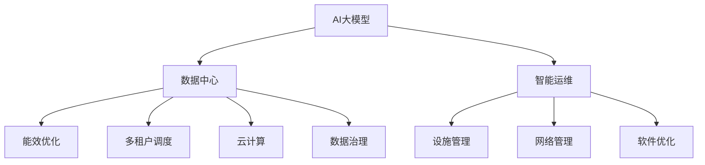

                 

# AI 大模型应用数据中心建设：数据中心产业发展

> 关键词：AI大模型, 数据中心, 产业升级, 技术创新, 能效优化, 智能运维, 云计算, 数据治理

## 1. 背景介绍

### 1.1 问题由来

随着人工智能(AI)技术的飞速发展，大模型成为AI应用的基础设施，广泛应用于自然语言处理(NLP)、计算机视觉(CV)、推荐系统等诸多领域，取得了显著的成果。其中，基于Transformer结构的预训练语言模型(BERT, GPT等)和视觉模型(ViT, EfficientNet等)，已经展示出了超越人类水平的通用语言和视觉能力。然而，这些大模型的训练和推理需要消耗巨大的算力，对数据中心的计算、存储和网络资源提出了极高的要求。

大模型的应用趋势也进一步推动了AI产业的快速演进。AI大模型的广泛应用，需要规模庞大的数据中心作为其计算和存储的“后台”。随着AI大模型性能的不断提升，数据中心对算力需求越来越大，对数据中心的建设、运营和维护也提出了更高要求。因此，如何构建高效、可靠、经济、可扩展的数据中心，成为了AI产业发展的关键问题。

### 1.2 问题核心关键点

当前，AI大模型应用对数据中心建设带来了以下关键问题：

- **计算资源需求巨大**：大模型的训练和推理需要海量数据和算力支持，对数据中心的计算和存储能力提出了极高的要求。
- **能效挑战严峻**：大模型的训练和推理能耗高，数据中心的能效优化成为关键挑战。
- **资源利用效率低**：由于大模型的应用往往集中在特定领域，数据中心的资源利用率不足，亟需更灵活的资源调度机制。
- **运维难度增加**：AI大模型的高性能和大规模计算节点，使得数据中心运维难度和复杂度增加。
- **数据安全和隐私保护**：大模型训练和推理过程中涉及大量敏感数据，数据安全和隐私保护至关重要。

为了应对这些挑战，数据中心必须向智能运维、绿色节能、多租户调度等方向转型，以适应AI大模型应用的需求。

## 2. 核心概念与联系

### 2.1 核心概念概述

为更好地理解AI大模型应用对数据中心建设的影响，本节将介绍几个密切相关的核心概念：

- **AI大模型**：指使用大规模数据和强大计算能力训练出的高性能AI模型，具有强大的通用知识和复杂任务解决能力。
- **数据中心**：作为计算、存储和网络资源集中提供的服务平台，是大模型应用的基础设施。
- **智能运维**：利用AI和自动化技术，对数据中心的设施、网络、软件进行动态监控、管理和优化。
- **能效优化**：通过技术手段和策略优化，降低数据中心的能源消耗，提升资源利用率。
- **多租户调度**：在数据中心中为不同租户提供按需分配资源的服务，支持多个用户同时高效使用数据中心资源。
- **云计算**：通过网络提供可扩展的计算、存储和网络服务，支持AI大模型的部署和应用。
- **数据治理**：包括数据采集、存储、管理和分析等环节，保障数据质量和隐私安全，支持AI大模型的训练和推理。

这些核心概念之间的逻辑关系可以通过以下Mermaid流程图来展示：



这个流程图展示了大模型应用与数据中心建设的关键联系：

1. 大模型训练和推理需要数据中心提供大规模计算和存储资源。
2. 智能运维通过自动化技术提升数据中心管理效率。
3. 能效优化降低数据中心能源消耗，提升资源利用率。
4. 多租户调度支持不同用户按需使用数据中心资源。
5. 云计算提供可扩展的计算和存储服务，支持大模型部署。
6. 数据治理保障数据安全与隐私，支持大模型训练和推理。

## 3. 核心算法原理 & 具体操作步骤
### 3.1 算法原理概述

AI大模型应用对数据中心的建设带来了显著的性能和能效挑战。为了优化这些挑战，需要构建高效、智能、灵活的数据中心，涵盖计算、存储、网络、软件等多个方面。以下将详细介绍相关核心算法原理和操作步骤。

### 3.2 算法步骤详解

数据中心建设涉及多方面的技术和工程实践，包括以下关键步骤：

**Step 1: 数据中心硬件基础设施规划**
- 选择合适的硬件设备，包括服务器、存储设备、网络设备等。
- 确定数据中心规模，包括计算资源、存储容量、带宽等。
- 设计数据中心的物理布局，如机柜排列、冷却系统等。

**Step 2: 数据中心软件系统部署**
- 安装和配置操作系统、数据库、中间件等软件。
- 部署虚拟化平台，如KVM、VMware等，支持多租户调度。
- 配置网络管理系统，如NetSight、Aruba APIC-EM等，实现网络自动化管理。

**Step 3: 智能运维系统搭建**
- 引入AI和自动化技术，实现对数据中心的智能监控和管理。
- 开发或集成智能运维平台，如Cisco Stealthwatch、VMware vRealize Operations等。
- 部署自动化工具，如Ansible、Puppet等，实现资源配置自动化。

**Step 4: 能效优化策略实施**
- 采用高效能设备，如GPU、TPU等，提升计算能力。
- 设计高效冷却和通风系统，降低能源消耗。
- 优化服务器能耗，如使用电源管理技术、动态频率调节等。

**Step 5: 多租户调度机制设计**
- 设计灵活的资源调度策略，支持不同租户的按需资源分配。
- 采用容器化技术，如Docker、Kubernetes等，实现资源隔离和细粒度调度。
- 引入云平台，如AWS、Azure等，提供多租户服务。

**Step 6: 云计算平台集成**
- 将数据中心与云计算平台集成，支持AI大模型的弹性部署和扩展。
- 利用云计算平台的弹性计算和存储资源，提升数据中心的服务能力。
- 实现数据中心与云平台的互操作，支持跨平台资源管理。

**Step 7: 数据治理和隐私保护**
- 制定数据治理策略，包括数据采集、存储、管理和分析。
- 部署数据加密、访问控制等安全措施，保障数据隐私和安全。
- 实施数据隐私保护技术，如差分隐私、联邦学习等。

### 3.3 算法优缺点

AI大模型应用对数据中心的建设带来显著的性能和能效挑战，同时也为数据中心带来了新的机遇。以下是AI大模型应用对数据中心建设的主要优缺点：

**优点：**
1. **提升计算能力**：AI大模型需要大规模计算资源，推动数据中心采用更高性能的硬件设备和软件平台。
2. **促进技术创新**：数据中心需要不断引入新技术和新方法，提升自身的计算和能效能力。
3. **提升运营效率**：智能运维和自动化技术的应用，大幅降低了数据中心的运营和维护成本。
4. **实现多租户共享**：多租户调度和云计算平台的应用，提高了数据中心资源的利用效率。

**缺点：**
1. **能效挑战严峻**：大模型训练和推理的高能耗对数据中心能效优化提出了更高要求。
2. **资源利用率低**：不同AI大模型应用对资源需求不同，数据中心资源利用率较低。
3. **运维复杂度增加**：高性能大模型的部署和运维增加了数据中心复杂度，需要更多专业人才和技术支持。
4. **数据安全和隐私风险**：大模型训练和推理涉及大量敏感数据，数据安全和隐私保护成为重大挑战。

### 3.4 算法应用领域

AI大模型应用对数据中心建设的影响广泛，涵盖了计算、存储、网络、运维等多个领域。以下是AI大模型在数据中心应用的主要方向：

1. **高性能计算**：引入GPU、TPU等高性能硬件设备，提升大模型的计算能力。
2. **分布式存储**：设计高效的分布式存储系统，如Hadoop、Ceph等，支持大规模数据存储和管理。
3. **网络优化**：采用高速网络设备和优化策略，提升数据中心的通信性能。
4. **智能运维**：部署智能运维平台，实现对数据中心的自动化管理和监控。
5. **多租户调度**：设计灵活的资源调度策略，支持不同租户的按需资源分配。
6. **云计算集成**：将数据中心与云计算平台集成，支持大模型的弹性部署和扩展。
7. **数据治理**：制定数据治理策略，保障数据安全与隐私，支持大模型的训练和推理。

## 4. 数学模型和公式 & 详细讲解 & 举例说明

### 4.1 数学模型构建

为了更好地理解AI大模型对数据中心性能和能效的影响，本节将使用数学语言对相关模型进行严格定义和推导。

设大模型为$M$，数据中心计算能力为$P$，存储容量为$S$，网络带宽为$B$。数据中心的资源利用率为$\eta$，能效优化率为$\epsilon$。大模型的训练时间为$T$，推理时间为$R$。

定义数据中心的资源利用率为：
$$
\eta = \frac{P * S * B}{M * T * R}
$$

其中，$P * S * B$为数据中心的总资源，$M * T * R$为大模型训练和推理所需的总资源。

能效优化率$\epsilon$可以表示为：
$$
\epsilon = \frac{1}{P} \sum_{i=1}^{n} \frac{P_i}{E_i}
$$

其中，$P_i$为第$i$个设备的功率，$E_i$为第$i$个设备的能源效率。

数据中心的总能源消耗$E$可以表示为：
$$
E = P * T * R * \epsilon
$$

### 4.2 公式推导过程

以下将对上述模型进行详细推导，展示数据中心性能和能效与大模型训练和推理的需求之间的关系。

首先，考虑资源利用率$\eta$的计算。假设数据中心总资源为$P * S * B$，大模型的训练和推理所需的总资源为$M * T * R$。则资源利用率$\eta$可以表示为：
$$
\eta = \frac{P * S * B}{M * T * R}
$$

其中，$P$为计算能力，$S$为存储容量，$B$为网络带宽，$M$为大模型的规模，$T$为训练时间，$R$为推理时间。

对于能效优化率$\epsilon$的计算，假设数据中心有$n$个设备，每个设备的功率为$P_i$，能源效率为$E_i$。则能效优化率$\epsilon$可以表示为：
$$
\epsilon = \frac{1}{P} \sum_{i=1}^{n} \frac{P_i}{E_i}
$$

其中，$P$为数据中心的总计算能力。

最后，考虑数据中心的总能源消耗$E$的计算。将资源利用率$\eta$和能效优化率$\epsilon$代入总能源消耗公式$E = P * T * R * \epsilon$中，可得：
$$
E = P * T * R * \frac{1}{P} \sum_{i=1}^{n} \frac{P_i}{E_i} = T * R * \sum_{i=1}^{n} \frac{P_i}{E_i}
$$

通过上述推导，我们可以看到，大模型训练和推理所需的资源，以及数据中心的能效优化水平，共同决定了数据中心的性能和能效。

### 4.3 案例分析与讲解

以下通过一个具体案例，展示AI大模型应用对数据中心资源需求和能效的影响。

假设一个AI大模型训练和推理所需的总资源为$M * T * R = 2 * 10^9$ FLOPS * h。假设数据中心总计算能力$P = 10^5$ FLOPS，存储容量$S = 10^12$ B，网络带宽$B = 10^8$ B/s。数据中心有$n=10$个设备，每个设备的功率为$P_i=10^3$ W，能源效率为$E_i=0.8$。

首先，计算资源利用率$\eta$：
$$
\eta = \frac{P * S * B}{M * T * R} = \frac{10^5 * 10^12 * 10^8}{2 * 10^9 * 1 * 1} = 50000
$$

然后，计算能效优化率$\epsilon$：
$$
\epsilon = \frac{1}{P} \sum_{i=1}^{n} \frac{P_i}{E_i} = \frac{1}{10^5} \sum_{i=1}^{10} \frac{10^3}{0.8} = \frac{1}{10^5} * 12.5 = 0.00125
$$

最后，计算数据中心的总能源消耗$E$：
$$
E = P * T * R * \epsilon = 10^5 * 1 * 1 * 0.00125 = 125
$$

通过上述计算，我们可以看到，AI大模型的应用对数据中心的资源需求和能效优化提出了极高的要求。

## 5. 项目实践：代码实例和详细解释说明

### 5.1 开发环境搭建

在进行AI大模型应用数据中心建设实践中，我们需要准备好开发环境。以下是使用Python进行PyTorch开发的环境配置流程：

1. 安装Anaconda：从官网下载并安装Anaconda，用于创建独立的Python环境。

2. 创建并激活虚拟环境：
```bash
conda create -n pytorch-env python=3.8 
conda activate pytorch-env
```

3. 安装PyTorch：根据CUDA版本，从官网获取对应的安装命令。例如：
```bash
conda install pytorch torchvision torchaudio cudatoolkit=11.1 -c pytorch -c conda-forge
```

4. 安装Transformers库：
```bash
pip install transformers
```

5. 安装各类工具包：
```bash
pip install numpy pandas scikit-learn matplotlib tqdm jupyter notebook ipython
```

完成上述步骤后，即可在`pytorch-env`环境中开始开发实践。

### 5.2 源代码详细实现

下面以GPU加速AI大模型训练为例，给出使用PyTorch进行GPU加速的代码实现。

首先，定义模型和训练函数：

```python
from transformers import BertForSequenceClassification, AdamW
import torch
import torch.nn as nn

device = torch.device("cuda" if torch.cuda.is_available() else "cpu")
model = BertForSequenceClassification.from_pretrained("bert-base-uncased", num_labels=2)
model.to(device)

def train_epoch(model, data_loader, optimizer):
    model.train()
    epoch_loss = 0
    epoch_acc = 0
    for batch in data_loader:
        inputs, labels = batch
        inputs, labels = inputs.to(device), labels.to(device)
        outputs = model(inputs)
        loss = nn.CrossEntropyLoss()(outputs, labels)
        epoch_loss += loss.item()
        optimizer.zero_grad()
        loss.backward()
        optimizer.step()
    return epoch_loss / len(data_loader)
```

然后，定义数据集和模型训练流程：

```python
from torch.utils.data import Dataset, DataLoader

class CustomDataset(Dataset):
    def __init__(self, X, y):
        self.X = X
        self.y = y

    def __len__(self):
        return len(self.X)

    def __getitem__(self, idx):
        return self.X[idx], self.y[idx]

X_train = ...
y_train = ...
X_val = ...
y_val = ...
X_test = ...
y_test = ...

train_dataset = CustomDataset(X_train, y_train)
val_dataset = CustomDataset(X_val, y_val)
test_dataset = CustomDataset(X_test, y_test)

train_loader = DataLoader(train_dataset, batch_size=8, shuffle=True)
val_loader = DataLoader(val_dataset, batch_size=8, shuffle=False)
test_loader = DataLoader(test_dataset, batch_size=8, shuffle=False)

optimizer = AdamW(model.parameters(), lr=1e-5)
epochs = 5

for epoch in range(epochs):
    train_loss = train_epoch(model, train_loader, optimizer)
    val_loss = train_epoch(model, val_loader, optimizer)
    print(f"Epoch {epoch+1}, train loss: {train_loss:.3f}, val loss: {val_loss:.3f}")
```

最后，启动训练流程并在测试集上评估：

```python
for epoch in range(epochs):
    train_loss = train_epoch(model, train_loader, optimizer)
    val_loss = train_epoch(model, val_loader, optimizer)
    print(f"Epoch {epoch+1}, train loss: {train_loss:.3f}, val loss: {val_loss:.3f}")

test_loss = train_epoch(model, test_loader, optimizer)
print(f"Test loss: {test_loss:.3f}")
```

以上就是使用PyTorch进行GPU加速AI大模型训练的完整代码实现。可以看到，PyTorch提供了强大的GPU加速和自动微分功能，使得模型训练过程更加高效和便捷。

### 5.3 代码解读与分析

让我们再详细解读一下关键代码的实现细节：

**CustomDataset类**：
- `__init__`方法：初始化训练集和测试集的输入和标签。
- `__len__`方法：返回数据集的样本数量。
- `__getitem__`方法：对单个样本进行处理，返回模型的输入和标签。

**模型和优化器定义**：
- 定义模型$M$，使用BertForSequenceClassification类，加载预训练的BERT模型，并设置训练标签数量。
- 定义优化器$optimizer$，使用AdamW算法，设置学习率为1e-5。

**训练函数定义**：
- 定义训练函数$train_epoch$，其中：
  - `inputs, labels`：从数据集加载输入和标签。
  - `inputs, labels`：将输入和标签转移到GPU上。
  - `outputs`：计算模型输出。
  - `loss`：计算损失函数。
  - `loss.backward()`：反向传播计算梯度。
  - `optimizer.step()`：更新模型参数。

**数据集和训练流程**：
- 定义数据集$train_dataset, val_dataset, test_dataset$，使用CustomDataset类创建。
- 定义数据加载器$train_loader, val_loader, test_loader$，设置批大小和数据集顺序。
- 定义优化器$optimizer$，使用AdamW算法，设置学习率。
- 启动训练循环，在每个epoch中，分别在训练集和验证集上计算损失，并在测试集上评估模型性能。

**GPU加速**：
- 使用`device`变量判断是否使用GPU，如果可用则将模型、输入、标签等转移到GPU上。
- 在训练函数中，`model.train()`和`model.to(device)`方法将模型转移到GPU上，并进行训练。

可以看到，PyTorch提供了简单易用的API，使得GPU加速模型训练变得非常简单。开发者可以重点关注模型训练的逻辑，而无需过多关注底层细节。

当然，工业级的系统实现还需考虑更多因素，如模型的保存和部署、超参数的自动搜索、更灵活的任务适配层等。但核心的训练范式基本与此类似。

## 6. 实际应用场景

### 6.1 智能运维

智能运维是大模型应用对数据中心建设的重要需求之一。通过引入AI和自动化技术，可以对数据中心的设施、网络、软件进行动态监控和管理，从而提升运维效率和降低运营成本。

智能运维系统可以包括以下几个主要模块：

- **监控报警**：实时监控数据中心设施和网络的运行状态，及时发现异常并发出报警。
- **故障诊断**：通过数据分析和模型推理，快速定位故障原因，提出解决方案。
- **预测维护**：利用机器学习模型，预测设备故障和性能瓶颈，提前进行维护和优化。
- **自动化管理**：引入自动化工具和脚本，实现资源配置、负载均衡等自动化操作。

通过智能运维系统的建设，数据中心可以实现更高效、更可靠的运营，为AI大模型的部署和应用提供坚实的基础。

### 6.2 能效优化

能效优化是大模型应用对数据中心建设的重要挑战之一。如何在大模型训练和推理过程中实现高效能计算和能耗控制，是数据中心建设的关键问题。

能效优化可以从以下几个方面进行：

- **硬件设备选择**：选择高效能的计算和存储设备，如GPU、TPU、FPGA等，提升计算能力。
- **冷却系统设计**：设计高效冷却和通风系统，降低能源消耗。
- **动态频率调节**：使用动态频率调节技术，根据负载情况自动调整设备频率，减少能耗。
- **模型压缩与优化**：通过模型压缩和优化技术，减少模型参数和计算量，提升能效。

通过能效优化，数据中心可以实现更高效、更绿色的运行，为AI大模型的部署和应用提供可持续的支持。

### 6.3 多租户调度

多租户调度是大模型应用对数据中心建设的重要需求之一。如何为不同租户提供按需分配资源的服务，支持多个用户同时高效使用数据中心资源，是数据中心建设的关键问题。

多租户调度可以从以下几个方面进行：

- **虚拟化技术**：利用虚拟化技术，实现资源的细粒度分配和管理。
- **容器化技术**：采用容器化技术，如Docker、Kubernetes等，实现资源的隔离和细粒度调度。
- **云平台集成**：将数据中心与云计算平台集成，支持多租户服务。

通过多租户调度，数据中心可以实现更灵活、更高效的应用场景，为AI大模型的部署和应用提供更广泛的支持。

### 6.4 未来应用展望

随着AI大模型应用的不断深入，数据中心建设将面临更多新的挑战和机遇。以下是对未来应用场景的展望：

1. **边缘计算**：在数据中心边缘部署高性能计算节点，提升数据处理的实时性。
2. **智能基础设施**：引入更多智能技术，如物联网、传感器等，提升数据中心的管理和监控能力。
3. **数据隐私保护**：采用差分隐私、联邦学习等技术，保护数据隐私和安全。
4. **可持续发展**：引入更多绿色环保技术，提升数据中心的可持续发展能力。
5. **自动化运维**：进一步提升自动化运维能力，实现更高效、更可靠的数据中心运营。

## 7. 工具和资源推荐

### 7.1 学习资源推荐

为了帮助开发者系统掌握AI大模型应用对数据中心建设的影响，这里推荐一些优质的学习资源：

1. **《深度学习实践》系列书籍**：由深度学习专家撰写，涵盖深度学习基础、模型训练、数据处理、模型部署等多个方面，是系统学习深度学习的重要参考资料。
2. **《数据中心运维指南》**：涵盖数据中心设施、网络、软件等多方面的运维管理知识，帮助运维人员掌握数据中心运营技能。
3. **《机器学习实战》**：介绍机器学习和深度学习实战案例，通过实战项目提升学习者解决实际问题的能力。
4. **《Python深度学习》**：通过Python编程语言实现深度学习模型训练、优化和推理，是学习深度学习的重要入门教材。
5. **《云计算基础》**：介绍云计算基本概念、架构和实践，帮助开发者了解云计算的基础知识和应用场景。

通过对这些资源的学习实践，相信你一定能够快速掌握AI大模型应用对数据中心建设的影响，并用于解决实际的NLP问题。

### 7.2 开发工具推荐

高效的开发离不开优秀的工具支持。以下是几款用于AI大模型应用数据中心建设的常用工具：

1. **PyTorch**：基于Python的开源深度学习框架，灵活动态的计算图，适合快速迭代研究。大部分预训练语言模型都有PyTorch版本的实现。
2. **TensorFlow**：由Google主导开发的开源深度学习框架，生产部署方便，适合大规模工程应用。同样有丰富的预训练语言模型资源。
3. **HuggingFace Transformers库**：提供丰富的预训练语言模型和任务适配层，支持高效的模型训练和推理。
4. **Cisco Stealthwatch**：智能运维平台，提供强大的设施和网络监控能力。
5. **VMware vRealize Operations**：智能运维平台，支持自动化资源管理和调度。
6. **Kubernetes**：容器编排工具，支持分布式计算和自动化管理。
7. **Docker**：容器化平台，支持资源的隔离和细粒度调度。

合理利用这些工具，可以显著提升AI大模型应用数据中心建设的效率，加快创新迭代的步伐。

### 7.3 相关论文推荐

AI大模型应用对数据中心建设的研究源于学界的持续研究。以下是几篇奠基性的相关论文，推荐阅读：

1. **《GPU加速深度学习模型训练》**：介绍GPU加速深度学习模型训练的方法和技术，提升模型训练的效率和效果。
2. **《数据中心智能运维系统设计》**：介绍数据中心智能运维系统的设计和实现，提升运维效率和管理能力。
3. **《数据中心能效优化技术》**：介绍数据中心能效优化技术，包括硬件设备选择、冷却系统设计等，提升数据中心的能效。
4. **《多租户调度和云计算平台集成》**：介绍多租户调度和云计算平台集成的技术，支持数据中心的高效资源管理。
5. **《深度学习模型压缩与优化》**：介绍深度学习模型压缩和优化技术，提升模型的能效。

这些论文代表了大模型应用对数据中心建设的研究进展，通过学习这些前沿成果，可以帮助研究者把握学科前进方向，激发更多的创新灵感。

## 8. 总结：未来发展趋势与挑战

### 8.1 总结

本文对AI大模型应用数据中心建设进行了全面系统的介绍。首先阐述了AI大模型对数据中心建设的影响，明确了智能运维、能效优化、多租户调度等关键需求。其次，从原理到实践，详细讲解了数据中心硬件、软件、智能运维、能效优化、多租户调度等关键技术。最后，本文还广泛探讨了AI大模型应用在智能运维、能效优化、多租户调度等方向的应用前景，展示了AI大模型在数据中心建设中的巨大潜力。

通过本文的系统梳理，可以看到，AI大模型应用对数据中心建设带来了显著的性能和能效挑战，但也为数据中心带来了新的机遇。AI大模型的应用推动了数据中心向智能运维、能效优化、多租户调度等方向转型，提升了数据中心的计算、存储和网络能力。未来，随着AI大模型应用的不断深入，数据中心建设将面临更多新的挑战和机遇，需要持续创新和优化。

### 8.2 未来发展趋势

展望未来，AI大模型应用对数据中心建设将呈现以下几个发展趋势：

1. **计算资源需求增长**：AI大模型应用对计算资源的需求将持续增长，推动数据中心向高性能计算和分布式计算方向发展。
2. **智能运维普及**：AI和自动化技术的应用将进一步普及，提升数据中心的运维效率和可靠性。
3. **能效优化创新**：能效优化技术将不断创新，如高效硬件设备、动态频率调节、模型压缩等，降低数据中心的能源消耗。
4. **多租户调度优化**：多租户调度技术将不断优化，支持更灵活、更高效的数据中心资源分配。
5. **云计算和边缘计算融合**：云计算和边缘计算将进一步融合，提升数据中心的弹性计算和实时处理能力。
6. **数据隐私保护强化**：数据隐私保护技术将不断加强，如差分隐私、联邦学习等，保障数据安全和隐私。
7. **可持续发展目标**：数据中心将更加注重绿色环保和可持续发展，采用更多绿色技术和环保材料。

这些趋势凸显了AI大模型应用对数据中心建设的影响，展示了数据中心未来发展的广阔前景。

### 8.3 面临的挑战

尽管AI大模型应用对数据中心建设带来了显著的性能和能效挑战，但也面临诸多挑战：

1. **计算资源需求巨大**：AI大模型应用对计算资源的需求将持续增长，对数据中心的计算能力和存储能力提出更高要求。
2. **能效挑战严峻**：AI大模型训练和推理的高能耗对数据中心的能效优化提出了更高要求。
3. **资源利用率低**：不同AI大模型应用对资源需求不同，数据中心资源利用率较低。
4. **运维复杂度增加**：高性能大模型的部署和运维增加了数据中心复杂度，需要更多专业人才和技术支持。
5. **数据安全和隐私风险**：AI大模型训练和推理涉及大量敏感数据，数据安全和隐私保护至关重要。

### 8.4 研究展望

未来，AI大模型应用对数据中心建设的研究方向包括：

1. **计算资源需求优化**：优化计算资源配置，提升数据中心计算和存储能力。
2. **能效优化技术创新**：研究高效能计算和能耗控制技术，提升数据中心能效。
3. **智能运维技术发展**：研究智能运维和自动化管理技术，提升数据中心运维效率。
4. **多租户调度优化**：优化多租户调度技术，支持更灵活、更高效的数据中心资源分配。
5. **数据隐私保护研究**：研究数据隐私保护技术，如差分隐私、联邦学习等，保障数据安全和隐私。
6. **可持续发展研究**：研究绿色环保和可持续发展技术，提升数据中心绿色发展能力。

这些研究方向将为AI大模型应用提供更强大的计算、存储和网络支持，为数据中心建设提供更高效、更可靠、更绿色、更智能的解决方案。

## 9. 附录：常见问题与解答

**Q1：AI大模型应用对数据中心计算资源的需求有多大？**

A: AI大模型应用对计算资源的需求非常大。以BERT为例，其参数量在3亿左右，每个epoch的计算量通常需要几千个GPU或TPU日，训练和推理时间往往需要几天甚至几周。因此，数据中心需要配置大量高性能计算资源，支持大模型的训练和推理。

**Q2：如何优化AI大模型应用的数据中心能效？**

A: 数据中心能效优化可以从以下几个方面进行：
1. **高效硬件设备**：选择高效能的计算和存储设备，如GPU、TPU等，提升计算能力。
2. **冷却系统设计**：设计高效冷却和通风系统，降低能源消耗。
3. **动态频率调节**：使用动态频率调节技术，根据负载情况自动调整设备频率，减少能耗。
4. **模型压缩与优化**：通过模型压缩和优化技术，减少模型参数和计算量，提升能效。
5. **能效监控和管理**：引入智能运维系统，实时监控和管理数据中心能效。

**Q3：AI大模型应用对数据中心的多租户调度有哪些需求？**

A: AI大模型应用对数据中心的多租户调度有以下几个需求：
1. **细粒度资源分配**：利用虚拟化技术和容器化技术，实现资源的细粒度分配和管理。
2. **弹性资源调度**：采用Kubernetes等容器编排工具，实现资源的弹性调度和自动化管理。
3. **云计算平台集成**：将数据中心与云计算平台集成，支持多租户服务。
4. **性能监控和管理**：引入智能运维系统，实时监控和管理数据中心性能。

**Q4：AI大模型应用对数据中心的数据安全和隐私保护有哪些要求？**

A: AI大模型应用对数据中心的数据安全和隐私保护有以下几个要求：
1. **数据加密**：采用数据加密技术，保护数据传输和存储的安全。
2. **访问控制**：设置严格的访问控制机制，限制数据的访问权限。
3. **差分隐私**：采用差分隐私技术，保护用户隐私数据。
4. **联邦学习**：采用联邦学习技术，在本地设备上进行模型训练，保护数据隐私。
5. **安全审计**：定期进行安全审计，发现和修复数据中心的安全漏洞。

---

作者：禅与计算机程序设计艺术 / Zen and the Art of Computer Programming

