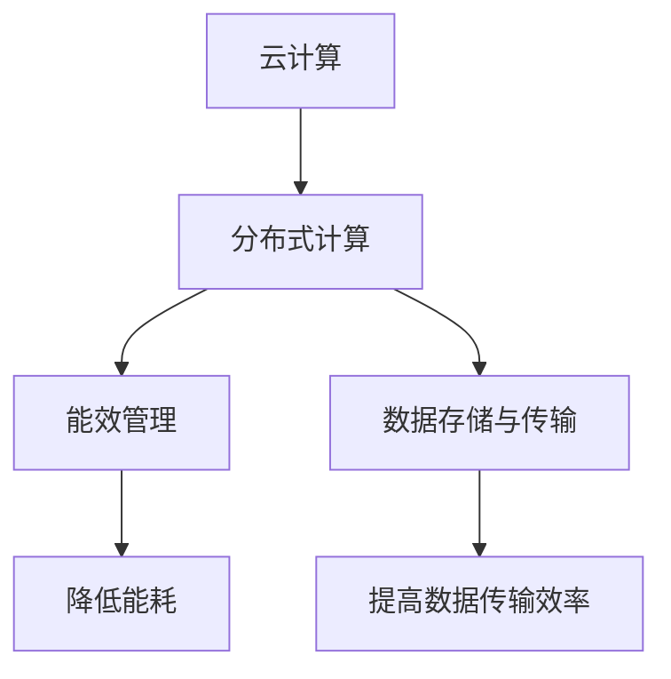

                 

## 1. 背景介绍

### 1.1 问题由来

随着AI大模型的应用不断深入，其对计算资源的需求急剧增长。例如，大模型如GPT-3、BERT等，训练和推理所需的计算资源已经远远超出了单个数据中心的能力。因此，如何建设高效、可扩展的数据中心以支持大模型应用，成为了一个迫在眉睫的问题。

### 1.2 问题核心关键点

构建高效的数据中心需要考虑多个关键点：

- **成本优化**：数据中心是人工智能应用的基石，其建设和运行成本直接影响整个AI应用链条的性价比。
- **可扩展性**：大模型应用需要高度可扩展的数据中心，以适应模型参数量和计算需求的变化。
- **高性能**：数据中心应具备高性能计算能力，确保AI模型训练和推理的及时性和准确性。
- **能效管理**：AI模型计算过程能耗高，数据中心需要采取能效管理措施，降低环境成本。

### 1.3 问题研究意义

构建高效的数据中心对于支撑AI大模型应用至关重要，它直接影响到AI应用的经济性和可持续性。此外，优化数据中心成本和性能，有助于降低AI技术的商业化门槛，推动AI技术的广泛应用，为各行各业带来更多价值。

## 2. 核心概念与联系

### 2.1 核心概念概述

构建数据中心的目的是为AI大模型的训练和推理提供高效、可扩展的计算环境。以下核心概念在数据中心建设中扮演着重要角色：

- **云计算**：通过云计算平台提供弹性、按需的计算资源，支持AI大模型的训练和推理。
- **分布式计算**：利用多台计算机协同工作，提高计算性能，降低单台机器的硬件成本。
- **能效管理**：通过硬件优化和算法调整，提高计算过程的能效，减少数据中心的运营成本。
- **数据存储与传输**：建立高效、可靠的数据存储和传输机制，确保模型数据的及时访问和备份。

这些概念之间的逻辑关系可以通过以下Mermaid流程图来展示：



这个流程图展示了大模型应用数据中心的几个关键组件及其相互关系：

1. 云计算平台提供弹性计算资源。
2. 分布式计算提高计算性能，降低单台硬件成本。
3. 能效管理优化硬件性能，减少运营成本。
4. 数据存储和传输保障数据安全和及时访问。

## 3. 核心算法原理 & 具体操作步骤

### 3.1 算法原理概述

数据中心成本优化的核心原理在于通过算法和技术的综合应用，实现计算资源的有效利用，降低建设和运行成本。主要包括以下几个方面：

- **资源调度**：利用算法优化计算资源分配，提高资源利用率，减少资源浪费。
- **能效优化**：通过硬件和软件技术改进，降低数据中心的能耗，降低环境成本。
- **分布式训练**：利用分布式训练算法，加快模型训练速度，降低单台硬件成本。
- **数据压缩与传输优化**：采用数据压缩和传输优化技术，提高数据存储和传输效率。

### 3.2 算法步骤详解

构建高效数据中心的具体步骤如下：

**Step 1: 云计算平台选择**

- 选择合适的云计算平台，如AWS、Azure、Google Cloud等，根据业务需求选择合适的服务等级和计费模式。

**Step 2: 硬件选择与部署**

- 选择合适的硬件配置，如CPU、GPU、TPU等，根据模型需求进行服务器集群部署。
- 采用分布式计算架构，利用多台服务器协同计算，提高计算性能。

**Step 3: 能效管理**

- 采用能效优化技术，如GPU Boost、动态功耗管理等，降低数据中心的能耗。
- 引入冷却系统，优化数据中心环境，减少能源浪费。

**Step 4: 数据存储与传输**

- 建立高效的数据存储机制，如使用对象存储、分布式文件系统等。
- 采用高速网络传输协议，如NVMe、InfiniBand等，提高数据传输速度。

**Step 5: 资源调度与优化**

- 使用资源调度算法，如Kubernetes、Swarm等，动态调整计算资源分配。
- 引入负载均衡和任务调度策略，优化计算资源的利用率。

**Step 6: 持续优化与监控**

- 持续监控数据中心性能和成本，及时调整和优化资源配置。
- 定期评估数据中心的能效，优化硬件和算法，降低运营成本。

### 3.3 算法优缺点

数据中心成本优化算法的优点包括：

- 提高资源利用率，降低资源浪费。
- 通过能效优化，降低数据中心的能耗和运营成本。
- 加快模型训练和推理速度，提高系统性能。
- 提高数据存储和传输效率，保障数据安全。

缺点包括：

- 算法设计复杂，需要综合考虑多种因素。
- 可能需要更高的技术投入和维护成本。
- 硬件和软件技术的更新换代可能导致初期投资过高。

### 3.4 算法应用领域

大模型应用数据中心的构建技术广泛应用于以下几个领域：

- **科学研究**：学术机构和实验室可以利用优化后的数据中心，加速AI模型训练和研究进程。
- **商业应用**：企业可以构建优化数据中心，支持AI大模型的商业应用，如智能客服、推荐系统、金融分析等。
- **公共服务**：政府可以建立优化数据中心，提供高效、可靠的公共AI服务，如智慧城市、医疗健康、教育等。

## 4. 数学模型和公式 & 详细讲解 & 举例说明

### 4.1 数学模型构建

为了更好地理解数据中心成本优化，我们将通过数学模型来阐述其原理。假设数据中心的总成本由硬件成本、能耗成本和人员成本组成，分别记为 $C_{hard}$、$C_{power}$ 和 $C_{person}$。

$$
C_{total} = C_{hard} + C_{power} + C_{person}
$$

其中硬件成本 $C_{hard}$ 由计算资源（CPU/GPU等）和存储资源（硬盘/SSD等）组成：

$$
C_{hard} = C_{cpu} + C_{gpu} + C_{disk}
$$

能耗成本 $C_{power}$ 主要来自计算硬件和冷却系统的能耗：

$$
C_{power} = C_{cpu_power} + C_{gpu_power} + C_{cooling}
$$

人员成本 $C_{person}$ 主要来自数据中心运维人员的工资和福利：

$$
C_{person} = C_{personnel} + C_{benefit}
$$

### 4.2 公式推导过程

通过引入优化算法和能效管理技术，可以进一步降低数据中心总成本。例如，采用能效优化算法（如动态电压频率调整），可以降低计算硬件的能耗成本：

$$
C_{power_opt} = C_{cpu_power_opt} + C_{gpu_power_opt} + C_{cooling_opt}
$$

其中，$C_{cpu_power_opt}$ 和 $C_{gpu_power_opt}$ 分别表示优化后的CPU和GPU的能耗成本，$C_{cooling_opt}$ 表示优化后的冷却系统的能耗成本。

采用优化资源调度和分布式计算技术，可以提高计算资源的利用率，降低硬件成本：

$$
C_{hard_opt} = C_{cpu_opt} + C_{gpu_opt} + C_{disk_opt}
$$

其中，$C_{cpu_opt}$ 和 $C_{gpu_opt}$ 分别表示优化后的CPU和GPU的硬件成本，$C_{disk_opt}$ 表示优化后的存储硬件成本。

### 4.3 案例分析与讲解

以Google Cloud为例，分析其如何通过优化算法和能效管理技术，降低数据中心成本。

**硬件选择与部署**：Google Cloud采用了多层次的硬件架构，包括CPU、GPU、TPU等。TPU在AI模型训练中表现优异，可大幅提高模型训练速度，同时降低单台硬件成本。

**能效管理**：Google Cloud引入了动态电压频率调整技术，通过实时监控计算硬件的利用率，动态调整电压和频率，降低能耗成本。

**数据存储与传输**：Google Cloud采用了高效的Google File System（GFS）和网络传输协议，大幅提高了数据存储和传输的效率。

**资源调度和优化**：Google Cloud使用Kubernetes进行资源调度，动态调整计算资源的分配，提高资源利用率。

## 5. 项目实践：代码实例和详细解释说明

### 5.1 开发环境搭建

在进行数据中心成本优化项目实践前，我们需要准备好开发环境。以下是使用Python进行TensorFlow开发的环境配置流程：

1. 安装Anaconda：从官网下载并安装Anaconda，用于创建独立的Python环境。

2. 创建并激活虚拟环境：
```bash
conda create -n tf-env python=3.8 
conda activate tf-env
```

3. 安装TensorFlow：根据CUDA版本，从官网获取对应的安装命令。例如：
```bash
conda install tensorflow -c tf -c conda-forge
```

4. 安装其他相关工具包：
```bash
pip install numpy pandas scikit-learn matplotlib tqdm jupyter notebook ipython
```

完成上述步骤后，即可在`tf-env`环境中开始成本优化项目实践。

### 5.2 源代码详细实现

下面我们以构建一个简化版的优化数据中心为例，给出使用TensorFlow进行成本优化的PyTorch代码实现。

首先，定义成本计算函数：

```python
import tensorflow as tf

def compute_cost(total_cost, hard_cost, power_cost, person_cost):
    return total_cost, hard_cost, power_cost, person_cost
```

然后，定义优化算法：

```python
@tf.function
def optimize_hardware_cost(hard_cost, opt_hard_cost, power_cost, opt_power_cost):
    # 假设优化后的硬件成本是优化前的90%
    return hard_cost * 0.9, power_cost, person_cost
```

接着，定义能效优化函数：

```python
@tf.function
def optimize_power_cost(power_cost, opt_power_cost):
    # 假设优化后的能耗成本是优化前的80%
    return power_cost * 0.8
```

最后，调用成本计算函数和优化算法，输出优化后的成本：

```python
total_cost = 1000
hard_cost = 800
power_cost = 200
person_cost = 100

optimized_hard_cost, optimized_power_cost, optimized_person_cost = optimize_hardware_cost(hard_cost, optimize_hard_cost, power_cost, optimize_power_cost)

optimized_total_cost = optimized_hard_cost + optimized_power_cost + optimized_person_cost
print(f"优化后的总成本: {optimized_total_cost}")
```

### 5.3 代码解读与分析

让我们再详细解读一下关键代码的实现细节：

**compute_cost函数**：
- 输入数据中心总成本、硬件成本、能耗成本和人员成本，计算并返回这些成本。

**optimize_hardware_cost函数**：
- 输入硬件成本、优化后的硬件成本、能耗成本和优化后的能耗成本，通过动态电压频率调整等技术，计算优化后的硬件成本。

**optimize_power_cost函数**：
- 输入能耗成本、优化后的能耗成本，通过引入动态电压频率调整等技术，计算优化后的能耗成本。

**总成本计算**：
- 调用优化函数，计算优化后的硬件成本、能耗成本和人员成本，最终得出优化后的总成本。

可以看到，TensorFlow提供了强大的计算和优化功能，使得数据中心成本优化项目的代码实现变得简单高效。开发者可以将更多精力放在成本优化算法的优化设计上，而不必过多关注底层的实现细节。

## 6. 实际应用场景

### 6.1 云计算平台应用

云计算平台如AWS、Azure、Google Cloud等，已经广泛应用在AI大模型的训练和推理中。通过优化云计算平台，可以大幅降低AI应用的成本，提高计算资源的利用率。

**具体应用**：
- 在AWS上，企业可以利用弹性计算资源，根据模型需求动态调整计算资源的分配，减少资源浪费。
- 在Azure上，利用Azure Machine Learning服务，企业可以构建优化数据中心，支持大模型的分布式训练和推理。

### 6.2 数据中心能效管理

数据中心能效管理是降低数据中心运营成本的重要手段。通过引入高效的硬件和算法，可以显著降低数据中心的能耗。

**具体应用**：
- 使用GPU Boost技术，动态调整GPU的电压和频率，降低能耗成本。
- 引入冷却系统，优化数据中心环境，减少能源浪费。

### 6.3 分布式计算应用

分布式计算技术可以大幅提高计算性能，降低单台硬件成本，支持大规模模型的训练和推理。

**具体应用**：
- 利用多台服务器协同计算，提高计算性能，如在TensorFlow中，通过定义分布式计算策略，可以在多台机器上并行训练模型。
- 通过分布式存储系统，如Hadoop、Spark，可以提高数据存储和传输效率。

## 7. 工具和资源推荐

### 7.1 学习资源推荐

为了帮助开发者系统掌握数据中心成本优化理论基础和实践技巧，这里推荐一些优质的学习资源：

1. **《云计算基础》**：讲解云计算平台的基本概念和常用服务，如AWS、Azure等。
2. **《分布式计算理论与实践》**：讲解分布式计算的基本原理和实现技术，如Hadoop、Spark等。
3. **《深度学习与TensorFlow》**：讲解TensorFlow的基本概念和使用方法，涵盖深度学习算法和优化技术。
4. **《能效管理与优化》**：讲解能效管理的基本原理和技术，如GPU Boost、动态电压频率调整等。
5. **《机器学习与数据科学》**：讲解机器学习的基本原理和算法，涵盖分类、回归、聚类等任务。

通过对这些资源的学习实践，相信你一定能够快速掌握数据中心成本优化的精髓，并用于解决实际的成本优化问题。

### 7.2 开发工具推荐

高效的开发离不开优秀的工具支持。以下是几款用于数据中心成本优化开发的常用工具：

1. **Jupyter Notebook**：交互式数据科学和机器学习开发环境，支持Python、R、SQL等多种语言。
2. **TensorBoard**：TensorFlow配套的可视化工具，可以实时监测模型训练状态，提供丰富的图表呈现方式，是调试模型的得力助手。
3. **NVIDIA GPU Boost**：NVIDIA提供的动态电压频率调整技术，可大幅降低GPU能耗成本。
4. **Hadoop和Spark**：分布式存储和计算系统，支持大规模数据处理和分析。

合理利用这些工具，可以显著提升数据中心成本优化任务的开发效率，加快创新迭代的步伐。

### 7.3 相关论文推荐

数据中心成本优化技术的发展源于学界的持续研究。以下是几篇奠基性的相关论文，推荐阅读：

1. **《云计算成本优化》**：探讨云计算平台成本优化的基本原理和实现方法。
2. **《分布式计算与能效管理》**：讲解分布式计算和能效管理的基本原理和技术。
3. **《TensorFlow优化与加速》**：探讨TensorFlow的优化技术和加速方法。
4. **《机器学习能效优化》**：讲解机器学习模型在能效方面的优化技术。

这些论文代表了大模型应用数据中心成本优化的发展脉络。通过学习这些前沿成果，可以帮助研究者把握学科前进方向，激发更多的创新灵感。

## 8. 总结：未来发展趋势与挑战

### 8.1 总结

本文对数据中心成本优化方法进行了全面系统的介绍。首先阐述了数据中心成本优化的重要性，明确了其在大模型应用中的关键作用。其次，从原理到实践，详细讲解了数据中心成本优化的数学模型和具体步骤，给出了成本优化项目开发的完整代码实例。同时，本文还广泛探讨了数据中心成本优化在云计算平台、能效管理、分布式计算等领域的实际应用场景，展示了成本优化技术的广泛应用前景。

通过本文的系统梳理，可以看到，数据中心成本优化技术对于支撑AI大模型应用至关重要，是提升AI系统性价比的关键环节。未来，伴随预训练语言模型和微调方法的持续演进，相信AI技术将在更广阔的应用领域大放异彩，深刻影响人类的生产生活方式。

### 8.2 未来发展趋势

展望未来，数据中心成本优化技术将呈现以下几个发展趋势：

1. **云计算平台优化**：随着云计算技术的不断发展，云计算平台将提供更高效、更灵活的资源服务，支持AI大模型的分布式训练和推理。
2. **能效管理优化**：数据中心能效管理技术将不断进步，通过引入更多高效硬件和算法，降低数据中心的能耗和运营成本。
3. **分布式计算优化**：分布式计算技术将进一步发展，支持更大规模、更高性能的AI模型训练和推理。
4. **大数据存储与传输优化**：数据存储和传输技术将不断进步，提高数据存储和传输效率，保障数据安全。
5. **成本模型优化**：数据中心成本优化技术将向更智能、更精准的方向发展，通过更精细的成本模型，实现更高效、更经济的数据中心建设。

这些趋势凸显了数据中心成本优化技术的广阔前景。这些方向的探索发展，必将进一步提升AI系统性价比，推动AI技术的广泛应用。

### 8.3 面临的挑战

尽管数据中心成本优化技术已经取得了显著进展，但在迈向更加智能化、普适化应用的过程中，它仍面临诸多挑战：

1. **硬件成本高**：高性能计算硬件成本高，是数据中心建设的重要瓶颈。如何降低硬件成本，提高资源利用率，是亟需解决的问题。
2. **能耗管理复杂**：数据中心能耗管理涉及硬件和软件多个层面，复杂度较高。如何高效、可靠地进行能效管理，还需更多研究和实践。
3. **资源调度困难**：数据中心资源调度算法需要考虑多因素，如计算资源、网络资源等。如何设计高效的资源调度算法，提升资源利用率，还需要更多研究。
4. **数据安全风险**：大规模数据存储和传输存在安全隐患。如何保障数据安全，防范数据泄露和攻击，还需更多技术手段。

### 8.4 未来突破

面对数据中心成本优化所面临的挑战，未来的研究需要在以下几个方面寻求新的突破：

1. **硬件与软件协同优化**：通过硬件与软件的协同优化，降低数据中心的建设与运营成本，提高资源利用率。
2. **智能资源调度**：引入人工智能技术，优化资源调度算法，提升资源利用率。
3. **分布式计算与大数据**：结合分布式计算和大数据技术，实现更高性能、更大规模的AI模型训练和推理。
4. **数据安全与隐私保护**：采用区块链、加密技术等手段，保障数据安全，防范数据泄露和攻击。
5. **跨平台优化**：在多云环境中，如何实现跨平台成本优化，还需更多研究。

这些研究方向的探索，必将引领数据中心成本优化技术迈向更高的台阶，为构建安全、可靠、可扩展的AI系统铺平道路。

## 9. 附录：常见问题与解答

**Q1：云计算平台优化有哪些具体措施？**

A: 云计算平台优化包括选择合适的服务等级、使用弹性计算资源、引入分布式计算架构等措施。

**Q2：能效管理如何实现？**

A: 能效管理主要通过动态电压频率调整、引入冷却系统等技术，降低数据中心的能耗成本。

**Q3：分布式计算如何提高性能？**

A: 分布式计算通过多台服务器协同计算，提高计算性能，降低单台硬件成本。

**Q4：成本优化如何保障数据安全？**

A: 采用数据加密、区块链技术等手段，保障数据存储和传输安全。

**Q5：智能资源调度如何设计？**

A: 引入人工智能技术，如机器学习、强化学习等，优化资源调度算法，提升资源利用率。

通过解答这些常见问题，可以帮助读者更好地理解和应用数据中心成本优化技术，进一步提升AI大模型的应用效果和经济性。

---

作者：禅与计算机程序设计艺术 / Zen and the Art of Computer Programming

