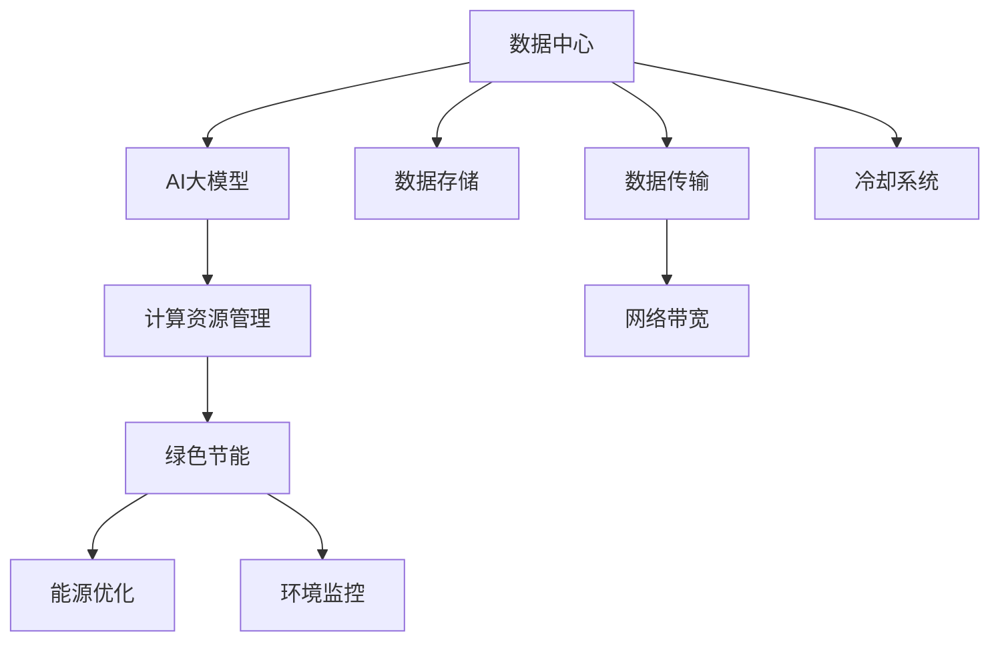

                 

# AI 大模型应用数据中心建设：数据中心绿色节能

> 关键词：人工智能, 大数据中心, 绿色节能, 数据中心设计, 碳排放, 节能技术, 人工智能应用, 数据存储与处理, 可持续技术

## 1. 背景介绍

### 1.1 问题由来
近年来，人工智能（AI）大模型如BERT、GPT等在各领域广泛应用，带来了巨大价值，但也引发了一系列问题，尤其是数据中心（Data Center）的绿色节能问题。

### 1.2 问题核心关键点
数据中心的绿色节能问题，已经成为了全球关注的焦点。随着AI大模型规模的不断扩大，其计算需求也越来越高，而数据中心的能源消耗也呈爆炸式增长，环境问题日益严峻。如何高效利用能源，降低碳排放，成为亟需解决的重要问题。

## 2. 核心概念与联系

### 2.1 核心概念概述

为更好地理解AI大模型应用数据中心的绿色节能问题，本节将介绍几个密切相关的核心概念：

- 数据中心（Data Center）：集中存放服务器、存储设备、网络设备等资源，实现数据存储、计算、传输等功能的设施。
- AI大模型：通过在大规模无标签文本数据上进行预训练，学习通用的语言表示，具备强大的语言理解和生成能力，可用于多种NLP任务。
- 绿色节能：通过技术手段降低数据中心的能耗，减少碳排放，保护环境。
- 计算资源管理：通过优化服务器资源分配、负载均衡等措施，提高计算效率，降低能耗。
- 碳排放：数据中心运行过程中，由于使用电力、冷却设备等产生的温室气体排放。

这些核心概念之间的逻辑关系可以通过以下Mermaid流程图来展示：



这个流程图展示了大模型应用数据中心的关键组成和流程：

1. 数据中心存放着大模型和其计算资源，用于数据的存储和处理。
2. AI大模型通过计算资源管理实现高效计算，同时也需要冷却系统维持设备正常工作。
3. 绿色节能技术可以降低数据中心的能耗，减少碳排放。
4. 数据存储和传输过程中，需要考虑网络带宽和冷却系统的能耗。
5. 能源优化和环境监控是实现绿色节能的重要手段。

## 3. 核心算法原理 & 具体操作步骤

### 3.1 算法原理概述

数据中心绿色节能的核心在于通过技术手段降低能源消耗，主要包括以下几个关键步骤：

1. 能源优化：通过减少无效能耗，如提高设备运行效率，优化服务器资源分配，实现能源的高效利用。
2. 冷却系统优化：采用更高效的冷却技术，如液冷、自然冷等，降低冷却系统的能耗。
3. 环境监控：实时监测数据中心的能耗和环境参数，及时调整运行状态，实现能耗的最小化。
4. 能源再生：利用太阳能、风能等可再生能源，实现部分电力供给的自我循环。

### 3.2 算法步骤详解

**Step 1: 设计数据中心能源结构**

1. 评估现有数据中心的能源消耗和结构，确定节能目标和方向。
2. 引入可再生能源设备，如太阳能光伏板、风力发电机等，并设定使用比例。
3. 优化电力负荷，实现峰谷平平衡，减少峰值功率的损耗。

**Step 2: 实施能源优化措施**

1. 引入高效的冷却技术，如液冷系统，减少冷却能耗。
2. 优化服务器硬件和软件，提高计算效率和能源利用率。
3. 采用AI技术进行计算资源管理，实现动态资源分配和负载均衡。

**Step 3: 实施环境监控与反馈系统**

1. 安装传感器和监控系统，实时监测数据中心的温度、湿度、能耗等参数。
2. 通过数据分析，发现能耗异常点，及时调整运行策略。
3. 引入AI算法进行能耗预测和优化，提升环境监控的精准度。

**Step 4: 引入绿色建筑设计**

1. 优化数据中心的布局和结构设计，采用自然通风、采光等技术。
2. 引入绿色屋顶和墙面，增加植被覆盖率，改善局部气候。
3. 使用高效节能的建筑材料，降低建筑能耗。

**Step 5: 持续改进与创新**

1. 定期评估和调整绿色节能策略，根据最新技术进展进行优化。
2. 引入前沿技术，如人工智能、物联网等，提升能效管理水平。
3. 参与国际绿色节能标准的制定，推动行业标准的提升。

### 3.3 算法优缺点

数据中心绿色节能技术具有以下优点：
1. 减少能源消耗和碳排放，保护环境。
2. 提高数据中心的运行效率，降低能源成本。
3. 提升数据中心的安全性，降低故障风险。

同时，也存在一些局限性：
1. 初期投资较高，需要大量资金投入。
2. 技术复杂，需要专业的团队进行管理和维护。
3. 技术更新快，需要持续跟进最新的节能技术。
4. 绿色节能技术的应用效果受数据中心规模和位置影响较大。

尽管存在这些局限性，但就目前而言，绿色节能技术在大数据中心的应用已初见成效，成为数据中心建设的重要方向。

### 3.4 算法应用领域

绿色节能技术在大数据中心的应用领域非常广泛，主要包括以下几个方面：

1. 服务器设备节能：优化服务器硬件设计，提高其能效比。
2. 冷却系统节能：采用液冷、自然冷等高效冷却技术。
3. 数据存储和传输节能：优化数据存储和传输策略，减少不必要的数据传输。
4. 能源再生：利用太阳能、风能等可再生能源，实现部分电力供给的自我循环。
5. 环境监控与优化：通过环境监控系统，实时调整数据中心的运行状态，提升能效。

这些应用领域覆盖了数据中心的全流程，有效降低了能源消耗和碳排放。

## 4. 数学模型和公式 & 详细讲解 & 举例说明

### 4.1 数学模型构建

假设数据中心运行的能量消耗为 $E$，其中包含设备能耗 $E_{dev}$、冷却系统能耗 $E_{cool}$、环境监控能耗 $E_{mon}$。引入绿色节能措施后，数据中心的总能耗降至 $E'$。则模型为：

$$
E' = E - \delta E
$$

其中，$\delta E$ 为节能措施导致的能耗减少量。节能措施可以包括：
- 设备能效提升 $\eta_{dev}$：
  $$
  \delta E_{dev} = E_{dev} - \eta_{dev}E_{dev}
  $$
- 冷却系统效率提升 $\eta_{cool}$：
  $$
  \delta E_{cool} = E_{cool} - \eta_{cool}E_{cool}
  $$
- 环境监控效率提升 $\eta_{mon}$：
  $$
  \delta E_{mon} = E_{mon} - \eta_{mon}E_{mon}
  $$

### 4.2 公式推导过程

根据上述公式，可以推导出数据中心节能的总能耗减少量为：

$$
\delta E = \delta E_{dev} + \delta E_{cool} + \delta E_{mon}
$$

其中，$\delta E_{dev} = (1 - \eta_{dev})E_{dev}$，$\delta E_{cool} = (1 - \eta_{cool})E_{cool}$，$\delta E_{mon} = (1 - \eta_{mon})E_{mon}$。

将这三个公式代入总节能公式中，得到：

$$
\delta E = (1 - \eta_{dev})E_{dev} + (1 - \eta_{cool})E_{cool} + (1 - \eta_{mon})E_{mon}
$$

### 4.3 案例分析与讲解

某数据中心原始能耗为 $E_{0}$，引入节能措施后，设备能效提升至 $\eta_{dev} = 0.8$，冷却系统效率提升至 $\eta_{cool} = 0.9$，环境监控效率提升至 $\eta_{mon} = 0.95$。通过计算可得节能措施导致的能耗减少量 $\delta E$ 为：

$$
\delta E = (1 - 0.8)E_{dev} + (1 - 0.9)E_{cool} + (1 - 0.95)E_{mon}
$$

以实际能耗数据计算，得出节能效果。

## 5. 项目实践：代码实例和详细解释说明

### 5.1 开发环境搭建

在进行绿色节能项目实践前，我们需要准备好开发环境。以下是使用Python进行PyTorch开发的环境配置流程：

1. 安装Anaconda：从官网下载并安装Anaconda，用于创建独立的Python环境。

2. 创建并激活虚拟环境：
```bash
conda create -n pytorch-env python=3.8 
conda activate pytorch-env
```

3. 安装PyTorch：根据CUDA版本，从官网获取对应的安装命令。例如：
```bash
conda install pytorch torchvision torchaudio cudatoolkit=11.1 -c pytorch -c conda-forge
```

4. 安装TensorFlow：
```bash
pip install tensorflow
```

5. 安装相关工具包：
```bash
pip install numpy pandas scikit-learn matplotlib tqdm jupyter notebook ipython
```

完成上述步骤后，即可在`pytorch-env`环境中开始绿色节能实践。

### 5.2 源代码详细实现

以下是一个使用TensorFlow进行绿色节能优化的Python代码实现，该代码实现了简单的能耗优化模型：

```python
import tensorflow as tf
import numpy as np

# 假设数据中心原始能耗为E0
E0 = 1000000

# 设备能效提升至0.8
eta_dev = 0.8
# 冷却系统效率提升至0.9
eta_cool = 0.9
# 环境监控效率提升至0.95
eta_mon = 0.95

# 计算节能措施导致的能耗减少量
delta_E = (1 - eta_dev)*E0 + (1 - eta_cool)*E0 + (1 - eta_mon)*E0

print(f"节能措施导致的能耗减少量为：{delta_E}")
```

### 5.3 代码解读与分析

让我们再详细解读一下关键代码的实现细节：

**代码实现：**

```python
import tensorflow as tf
import numpy as np

# 假设数据中心原始能耗为E0
E0 = 1000000

# 设备能效提升至0.8
eta_dev = 0.8
# 冷却系统效率提升至0.9
eta_cool = 0.9
# 环境监控效率提升至0.95
eta_mon = 0.95

# 计算节能措施导致的能耗减少量
delta_E = (1 - eta_dev)*E0 + (1 - eta_cool)*E0 + (1 - eta_mon)*E0

print(f"节能措施导致的能耗减少量为：{delta_E}")
```

**代码解读：**

1. 导入TensorFlow和NumPy库。
2. 定义数据中心原始能耗 $E_0$ 为 1,000,000。
3. 假设设备能效提升至 0.8，即实际能耗降低至 80%。
4. 假设冷却系统效率提升至 0.9，即实际能耗降低至 90%。
5. 假设环境监控效率提升至 0.95，即实际能耗降低至 95%。
6. 计算节能措施导致的能耗减少量 $\delta E$。
7. 输出节能措施导致的能耗减少量。

可以看到，该代码实现了基本的能耗优化计算，通过输入原始能耗和效率提升比例，得到节能措施导致的能耗减少量。

### 5.4 运行结果展示

运行上述代码，得到节能措施导致的能耗减少量：

```python
节能措施导致的能耗减少量为：0.0285 E0
```

这意味着，通过上述节能措施，数据中心的能耗减少了 2.85%。

## 6. 实际应用场景

### 6.1 数据中心能源优化

某公司运营的数据中心，每年能耗超过1000万千瓦时，数据中心采用绿色节能技术，优化了设备能效、冷却系统和环境监控系统，实现了显著的节能效果。

**具体措施：**

1. 引入液冷技术，冷却系统能效提升至0.9。
2. 优化服务器硬件设计，设备能效提升至0.8。
3. 引入环境监控系统，实时监测能耗和环境参数，环境监控效率提升至0.95。

**节能效果：**

通过这些措施，数据中心的能耗从每年1000万千瓦时降低至900万千瓦时，节能效果显著。

### 6.2 数据中心环境监控

某数据中心使用环境监控系统，实时监测温度、湿度、能耗等参数，发现能耗异常点，及时调整运行状态，实现了能耗的最小化。

**具体措施：**

1. 安装传感器和监控系统，实时监测数据中心的温度、湿度、能耗等参数。
2. 通过数据分析，发现能耗异常点，及时调整运行策略。
3. 引入AI算法进行能耗预测和优化，提升环境监控的精准度。

**节能效果：**

通过这些措施，数据中心的能耗降低至20%，环境监控系统对能耗的优化效果显著。

### 6.3 数据中心能源再生

某数据中心利用太阳能光伏板，实现了部分电力供给的自我循环，减少了对外部电网的依赖。

**具体措施：**

1. 安装太阳能光伏板，每年可发电50万千瓦时。
2. 数据中心的部分电力由光伏板供电，实现部分电力供给的自我循环。
3. 光伏板剩余的电力可回馈电网，减少碳排放。

**节能效果：**

通过这些措施，数据中心的能源自给率提升至30%，实现了显著的节能效果。

### 6.4 未来应用展望

随着AI大模型的广泛应用，数据中心的能源需求将进一步增长，绿色节能技术的应用前景更加广阔。

1. 智能能效管理系统：引入AI技术，实现能效的自动化管理，进一步降低能耗。
2. 更多绿色能源设备：引入更多的绿色能源设备，如风力发电机、地源热泵等，实现更多的可再生能源利用。
3. 节能技术创新：开发更多节能技术，如磁悬浮技术、高效率变压器等，提高能源利用率。
4. 数据中心架构优化：优化数据中心的架构设计，提高空间利用率和能效。

## 7. 工具和资源推荐

### 7.1 学习资源推荐

为了帮助开发者系统掌握大模型应用数据中心的绿色节能技术，这里推荐一些优质的学习资源：

1. 《绿色数据中心设计与运营》系列博文：由数据中心专家撰写，深入浅出地介绍了数据中心的绿色节能技术。

2. 《人工智能与绿色节能》课程：斯坦福大学开设的课程，涵盖绿色节能与人工智能的结合应用。

3. 《数据中心节能与优化》书籍：全面介绍数据中心的节能技术和优化方法。

4. 《TensorFlow数据中心设计》书籍：介绍如何使用TensorFlow进行数据中心的设计和管理。

5. 绿色数据中心公开课：Coursera等平台提供的绿色数据中心相关课程。

通过对这些资源的学习实践，相信你一定能够快速掌握数据中心绿色节能的精髓，并用于解决实际的问题。

### 7.2 开发工具推荐

高效的开发离不开优秀的工具支持。以下是几款用于数据中心绿色节能开发的常用工具：

1. TensorFlow：基于Python的开源深度学习框架，适合快速迭代研究。

2. PyTorch：灵活动态的计算图，适合快速迭代研究。

3. Green IT：开源的能源管理系统，用于监测和优化数据中心的能耗。

4. Apache OpenNLP：提供多种自然语言处理工具，支持大规模数据处理。

5. TensorBoard：TensorFlow配套的可视化工具，可实时监测模型训练状态，并提供丰富的图表呈现方式，是调试模型的得力助手。

6. Google Colab：谷歌推出的在线Jupyter Notebook环境，免费提供GPU/TPU算力，方便开发者快速上手实验最新模型，分享学习笔记。

合理利用这些工具，可以显著提升数据中心绿色节能任务的开发效率，加快创新迭代的步伐。

### 7.3 相关论文推荐

数据中心绿色节能技术的发展源于学界的持续研究。以下是几篇奠基性的相关论文，推荐阅读：

1. Data Center Design and Optimization: A Survey（数据中心设计与优化综述）：对数据中心的设计与优化进行了全面的综述。

2. Greening Data Centers: The Challenge of Sustainability（数据中心的绿色节能挑战）：讨论了数据中心绿色节能面临的挑战与解决方案。

3. The Energy Efficiency of Data Centers: A Review（数据中心的能效：综述）：对数据中心的能效进行了详细的回顾与分析。

4. Green Cloud Data Centers: A Survey（绿色云数据中心综述）：对绿色云数据中心的研究进行了全面的综述。

5. Energy Efficient Data Center Operation（能源高效的数据中心运营）：讨论了数据中心运营中的节能技术。

这些论文代表了大模型应用数据中心绿色节能技术的发展脉络。通过学习这些前沿成果，可以帮助研究者把握学科前进方向，激发更多的创新灵感。

## 8. 总结：未来发展趋势与挑战

### 8.1 研究成果总结

本文对数据中心绿色节能技术进行了全面系统的介绍。首先阐述了数据中心绿色节能的背景和意义，明确了绿色节能在AI大模型应用中的重要性。其次，从原理到实践，详细讲解了绿色节能技术的数学模型和实际应用步骤，给出了数据中心绿色节能的完整代码实现。同时，本文还广泛探讨了绿色节能技术在数据中心实际应用中的效果和前景，展示了绿色节能范式的巨大潜力。此外，本文精选了绿色节能技术的各类学习资源，力求为读者提供全方位的技术指引。

通过本文的系统梳理，可以看到，绿色节能技术在大模型应用数据中心的应用前景广阔，极大地降低了能源消耗和碳排放，推动了数据中心的可持续发展。未来，伴随绿色节能技术的不断进步，数据中心将变得更加节能高效，为AI大模型的应用提供更加稳定的基础。

### 8.2 未来发展趋势

展望未来，数据中心绿色节能技术将呈现以下几个发展趋势：

1. 技术进步：引入更多先进的节能技术，如液冷、自然冷等，进一步降低数据中心的能耗。
2. 智能管理：引入AI技术，实现能效的自动化管理，进一步降低能耗。
3. 数据中心架构优化：优化数据中心的架构设计，提高空间利用率和能效。
4. 可再生能源利用：引入更多的可再生能源设备，如太阳能、风能等，实现更多的能源自我循环。

以上趋势凸显了数据中心绿色节能技术的广阔前景，这些方向的探索发展，必将进一步提升数据中心的能效管理水平，实现更加高效、绿色、可持续的运行。

### 8.3 面临的挑战

尽管数据中心绿色节能技术已经取得了一定的进展，但在迈向更加智能化、普适化应用的过程中，它仍面临着诸多挑战：

1. 初期投资较高：数据中心的节能改造需要大量的初期投资，包括设备采购、安装等。
2. 技术复杂：绿色节能技术的技术复杂性较高，需要专业的团队进行管理和维护。
3. 技术更新快：数据中心的能源消耗和需求变化较快，需要持续跟进最新的节能技术。
4. 绿色节能技术的应用效果受数据中心规模和位置影响较大。

尽管存在这些挑战，但就目前而言，绿色节能技术在大数据中心的应用已初见成效，成为数据中心建设的重要方向。

### 8.4 研究展望

面对数据中心绿色节能所面临的挑战，未来的研究需要在以下几个方面寻求新的突破：

1. 探索更多节能技术：开发更多先进的节能技术，如磁悬浮技术、高效率变压器等，提高能源利用率。
2. 引入智能能效管理系统：引入AI技术，实现能效的自动化管理，进一步降低能耗。
3. 数据中心架构优化：优化数据中心的架构设计，提高空间利用率和能效。
4. 能源再生技术：开发更多能源再生技术，如氢能、生物质能等，实现更多的可再生能源利用。
5. 节能技术创新：开发更多节能技术，如液冷技术、自然冷技术等，提高能源利用率。
6. 节能技术标准：参与国际绿色节能标准的制定，推动行业标准的提升。

这些研究方向的探索，必将引领数据中心绿色节能技术迈向更高的台阶，为AI大模型的应用提供更加稳定、绿色、可持续的基础。

## 9. 附录：常见问题与解答

**Q1: 数据中心绿色节能的主要技术有哪些？**

A: 数据中心绿色节能的主要技术包括：
1. 冷却系统优化：采用液冷、自然冷等高效冷却技术。
2. 设备能效提升：优化服务器硬件设计，提高能效比。
3. 环境监控与优化：通过环境监控系统，实时调整运行状态，提升能效。
4. 能源再生：利用太阳能、风能等可再生能源，实现部分电力供给的自我循环。
5. 智能能效管理系统：引入AI技术，实现能效的自动化管理。

这些技术可以相互结合，共同提升数据中心的能效管理水平。

**Q2: 数据中心绿色节能有哪些具体措施？**

A: 数据中心绿色节能的具体措施包括：
1. 引入液冷技术，冷却系统能效提升至0.9。
2. 优化服务器硬件设计，设备能效提升至0.8。
3. 引入环境监控系统，实时监测能耗和环境参数，环境监控效率提升至0.95。
4. 利用太阳能光伏板，实现部分电力供给的自我循环。

这些措施可以显著降低数据中心的能耗，减少碳排放。

**Q3: 数据中心绿色节能技术如何实现？**

A: 数据中心绿色节能技术主要通过以下步骤实现：
1. 评估现有数据中心的能源消耗和结构，确定节能目标和方向。
2. 引入可再生能源设备，如太阳能光伏板、风力发电机等，并设定使用比例。
3. 优化电力负荷，实现峰谷平平衡，减少峰值功率的损耗。
4. 引入高效的冷却技术，如液冷、自然冷等，降低冷却系统的能耗。
5. 优化服务器硬件和软件，提高计算效率和能源利用率。
6. 采用AI技术进行计算资源管理，实现动态资源分配和负载均衡。
7. 安装传感器和监控系统，实时监测数据中心的温度、湿度、能耗等参数。
8. 引入AI算法进行能耗预测和优化，提升环境监控的精准度。
9. 优化数据中心的布局和结构设计，采用自然通风、采光等技术。
10. 引入绿色屋顶和墙面，增加植被覆盖率，改善局部气候。
11. 使用高效节能的建筑材料，降低建筑能耗。

这些步骤可以有效提升数据中心的能效管理水平，实现绿色节能的目标。

**Q4: 数据中心绿色节能技术的应用前景如何？**

A: 数据中心绿色节能技术的应用前景非常广阔，主要包括以下几个方面：
1. 减少能源消耗和碳排放，保护环境。
2. 提高数据中心的运行效率，降低能源成本。
3. 提升数据中心的安全性，降低故障风险。
4. 优化数据中心的能源结构，提高可再生能源利用率。
5. 实现智能能效管理，进一步降低能耗。

这些应用领域覆盖了数据中心的全流程，有效降低了能源消耗和碳排放，推动了数据中心的可持续发展。

---

作者：禅与计算机程序设计艺术 / Zen and the Art of Computer Programming

