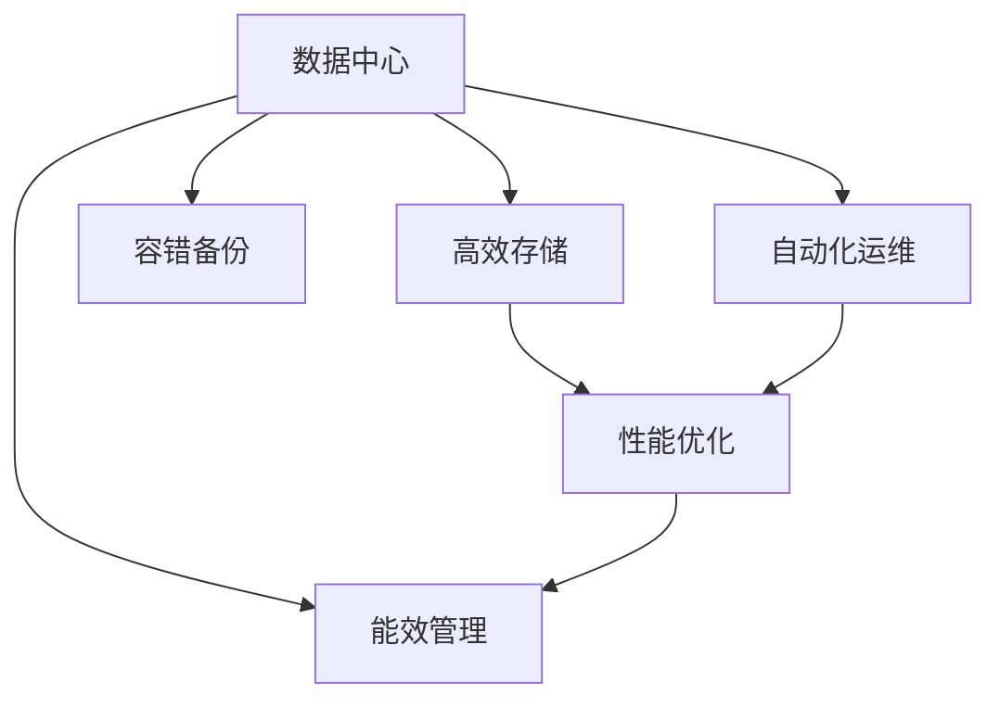

                 

# AI 大模型应用数据中心建设：数据中心运维与管理

> 关键词：大模型应用,数据中心,运维管理,高效存储,容错备份,自动化运维

## 1. 背景介绍

### 1.1 问题由来
人工智能（AI）和大模型应用的发展，对数据中心提出了更高的要求。大模型需要存储和处理海量数据，同时需要高性能计算资源进行训练和推理。如何在现有数据中心的基础上，进行优化和升级，满足大模型应用的需求，是当前数据中心建设和管理的重要课题。

### 1.2 问题核心关键点
数据中心建设的核心问题在于如何构建一个能够高效存储和处理数据、支持大模型训练和推理，同时具备高可用性和稳定性的基础设施。其中，高效存储、容错备份、自动化运维是大模型应用数据中心建设的关键需求点。

### 1.3 问题研究意义
高效的数据中心建设和管理，是大模型应用成功的重要保障。对于AI大模型，数据中心的存储和计算性能、可靠性、安全性、扩展性等因素将直接影响模型训练的速度和质量，进而影响应用效果和用户体验。通过优化数据中心运维与管理，可以大幅提升大模型应用的效率和稳定性，降低运营成本，为AI技术在各行各业的普及提供坚实的基础。

## 2. 核心概念与联系

### 2.1 核心概念概述

为更好地理解AI大模型应用数据中心建设，本节将介绍几个密切相关的核心概念：

- **数据中心（Data Center, DC）**：由计算机系统、通信网络等基础设施构建的物理空间，用于集中存储、计算和管理数据，支持数据中心应用系统的正常运行。
- **高效存储（High-Performance Storage, HPS）**：通过高带宽、低延迟、可扩展的存储技术，满足大数据存储、处理的需求。
- **容错备份（Fault-Tolerant Backup, FT Backup）**：通过多副本存储、分布式备份等技术，保障数据中心中关键数据的可靠性和持久性，防止数据丢失。
- **自动化运维（Automated Operations and Maintenance, AOM）**：利用自动化技术，减少人工运维的工作量，提高数据中心的运营效率和稳定性。
- **性能优化（Performance Optimization, PO）**：通过软硬件优化、负载均衡、网络优化等手段，提升数据中心的计算和存储性能。
- **能效管理（Energy Efficiency Management, EEM）**：通过能效监控、管理软件、冷却系统等手段，降低数据中心的能耗，减少运营成本。

这些核心概念之间的逻辑关系可以通过以下Mermaid流程图来展示：



这个流程图展示了大模型应用数据中心的各个关键组成部分及其之间的关系：

1. 数据中心是核心基础设施，提供计算和存储服务。
2. 高效存储支持大模型对海量数据的高带宽、低延迟需求。
3. 容错备份保障数据的可靠性和持久性，防止数据丢失。
4. 自动化运维减少人工运维工作量，提升运营效率。
5. 性能优化提升计算和存储性能，支持大模型训练和推理。
6. 能效管理降低数据中心能耗，减少运营成本。

这些核心概念共同构成了大模型应用数据中心的建设和管理框架，使其能够高效、稳定地支持AI大模型的运行。

## 3. 核心算法原理 & 具体操作步骤

### 3.1 算法原理概述

基于AI大模型应用的数据中心建设和管理，本质上是一个复杂的多目标优化问题。其核心思想是：通过设计最优的数据中心基础设施，合理配置计算和存储资源，并引入自动化和优化技术，最大化地提升数据中心的整体性能和稳定性，同时最小化运营成本。

形式化地，设数据中心系统的性能指标为 $\mathcal{P}$，能耗指标为 $\mathcal{E}$，运营成本为 $\mathcal{C}$，优化目标为：

$$
\max \mathcal{P} \quad \text{subject to} \quad \mathcal{E} + \mathcal{C} \leq B
$$

其中 $B$ 为预设的预算上限。通过综合考虑性能、能耗、成本等因素，寻找最优的资源配置方案。

### 3.2 算法步骤详解

基于上述优化目标，大模型应用数据中心建设和管理的主要步骤如下：

**Step 1: 需求分析与规划**
- 收集大模型应用的具体需求，包括存储容量、计算性能、网络带宽、能效要求等。
- 根据需求进行初步的架构规划，确定数据中心的主机房、存储区、网络区等功能区域。

**Step 2: 硬件选型与部署**
- 选择高性能的服务器、存储设备、网络设备等硬件设施，确保满足大模型应用的需求。
- 根据规划，进行硬件设备的物理部署，包括服务器机架、存储阵列、网络交换机等。

**Step 3: 软件配置与部署**
- 安装和配置操作系统、数据库、中间件等软件平台，支持大模型应用。
- 安装和配置监控、运维、备份等系统软件，提升数据中心的管理和维护能力。

**Step 4: 性能优化与调优**
- 利用性能监控工具，对数据中心的各项指标进行实时监测，发现性能瓶颈。
- 根据监控结果，对硬件设备、网络配置等进行调整和优化，提升性能。

**Step 5: 容错与备份策略**
- 设计多副本存储和备份策略，保障数据的高可靠性和持久性。
- 定期进行数据备份和恢复测试，验证备份机制的有效性。

**Step 6: 自动化运维与监控**
- 利用自动化运维工具，实现对数据中心的自动监控、报警、故障处理等。
- 使用AI和机器学习技术，提升运维预测和决策能力，减少人工干预。

**Step 7: 能效管理与节能**
- 监测数据中心的能耗情况，进行能源使用效率分析。
- 引入能效管理软件和冷却系统，优化能耗，降低运营成本。

### 3.3 算法优缺点

基于AI大模型应用的数据中心建设和管理方法具有以下优点：
1. 综合性高。考虑了性能、能耗、成本等多方面因素，能够全面提升数据中心的整体性能和稳定性。
2. 效率高。通过自动化和优化技术，减少了人工运维的工作量，提升了运营效率。
3. 可扩展性强。灵活的硬件和软件配置，使得数据中心可以根据需求快速扩展。
4. 故障容错性好。通过容错备份和自动化运维，保障数据中心的可靠性。

同时，该方法也存在一定的局限性：
1. 初始投资高。需要大量的硬件和软件投入，初期建设成本较高。
2. 复杂度高。需要跨学科的深入知识，包括网络、存储、计算、能效等多个领域。
3. 维护难度大。系统复杂度高，维护和故障处理难度大，需要专业的运维团队。

尽管存在这些局限性，但就目前而言，该方法仍是大模型应用数据中心建设的主流范式。未来相关研究的重点在于如何进一步降低初期建设成本，提高系统管理和维护的智能化程度，同时兼顾成本和性能的平衡。

### 3.4 算法应用领域

基于AI大模型应用的数据中心建设和管理方法，在NLP、计算机视觉、自然语言处理、语音识别等诸多领域得到了广泛的应用，支持了深度学习模型训练和推理，加速了AI技术的应用落地。

具体而言，这些技术手段在以下几个方面发挥了重要作用：

- **高性能计算**：通过分布式计算和GPU集群，支持大规模深度学习模型的训练。
- **海量数据存储**：通过高带宽、低延迟的存储系统，支持海量数据的高效存储和访问。
- **数据备份与恢复**：通过多副本存储和自动备份机制，保障数据的可靠性和持久性。
- **自动化运维**：通过自动化工具和系统，提升数据中心的运维效率和稳定性。
- **能效管理**：通过能效监控和管理软件，降低数据中心的能耗，提高能源利用效率。

除了上述这些核心应用外，数据中心建设和管理技术还被创新性地应用到更多场景中，如智能边缘计算、云计算、大数据平台等，为AI技术的普适化应用提供了坚实的技术支撑。

## 4. 数学模型和公式 & 详细讲解 & 举例说明

### 4.1 数学模型构建

大模型应用数据中心的建设和管理，涉及多个优化目标，包括性能、能耗、成本等。因此，需要构建一个多目标优化模型，以综合考虑这些因素，寻找最优的资源配置方案。

假设数据中心的存储容量为 $S$，计算能力为 $C$，能耗为 $E$，运营成本为 $C$，预算上限为 $B$，则优化目标可以表示为：

$$
\max \mathcal{P} \quad \text{subject to} \quad \mathcal{E} + \mathcal{C} \leq B
$$

其中 $\mathcal{P}$ 表示数据中心性能指标，包括计算速度、存储容量、网络带宽等，$\mathcal{E}$ 表示能耗，$\mathcal{C}$ 表示运营成本。

### 4.2 公式推导过程

以计算能力 $C$ 为例，根据硬件设备的特点，计算能力可以表示为：

$$
C = \alpha_1 \times \text{CPU性能} + \alpha_2 \times \text{GPU性能} + \alpha_3 \times \text{网络带宽}
$$

其中 $\alpha_1, \alpha_2, \alpha_3$ 为不同设备对计算能力的贡献系数。

根据监控数据，能耗可以表示为：

$$
E = \beta_1 \times \text{服务器功率} + \beta_2 \times \text{存储设备功率} + \beta_3 \times \text{网络设备功率}
$$

其中 $\beta_1, \beta_2, \beta_3$ 为不同设备对能耗的贡献系数。

运营成本可以表示为：

$$
C = \gamma_1 \times \text{服务器成本} + \gamma_2 \times \text{存储成本} + \gamma_3 \times \text{网络成本}
$$

其中 $\gamma_1, \gamma_2, \gamma_3$ 为不同设备对运营成本的贡献系数。

### 4.3 案例分析与讲解

假设某企业需要建设一个支持大模型训练的数据中心，存储容量为 $10 PB$，计算能力为 $10 TFLOPS$，能耗为 $500 kW$，运营成本为 $1M 每月$。根据上述模型，求解最优的硬件配置方案。

首先，将计算能力、能耗、运营成本转化为目标函数和约束条件：

$$
\max \mathcal{P} = C
$$

$$
\text{subject to} \quad E + C \leq B
$$

其中 $C$ 为计算能力，$E$ 为能耗，$B$ 为预算上限。

设 $\alpha_1 = 0.5, \alpha_2 = 0.3, \alpha_3 = 0.2$，$\beta_1 = 0.6, \beta_2 = 0.3, \beta_3 = 0.1$，$\gamma_1 = 0.4, \gamma_2 = 0.3, \gamma_3 = 0.3$，则计算能力、能耗、运营成本可以表示为：

$$
C = 0.5 \times \text{CPU性能} + 0.3 \times \text{GPU性能} + 0.2 \times \text{网络带宽}
$$

$$
E = 0.6 \times \text{服务器功率} + 0.3 \times \text{存储设备功率} + 0.1 \times \text{网络设备功率}
$$

$$
C = 0.4 \times \text{服务器成本} + 0.3 \times \text{存储成本} + 0.3 \times \text{网络成本}
$$

通过求解上述优化问题，可以获取最优的硬件配置方案，最大化计算能力的同时，最小化能耗和运营成本。

## 5. 项目实践：代码实例和详细解释说明

### 5.1 开发环境搭建

在进行数据中心建设和管理实践前，我们需要准备好开发环境。以下是使用Python进行开发的环境配置流程：

1. 安装Anaconda：从官网下载并安装Anaconda，用于创建独立的Python环境。

2. 创建并激活虚拟环境：
```bash
conda create -n dc-env python=3.8 
conda activate dc-env
```

3. 安装相关Python库：
```bash
pip install numpy pandas scipy scikit-learn matplotlib seaborn jupyter notebook ipython
```

完成上述步骤后，即可在`dc-env`环境中开始数据中心建设和管理实践。

### 5.2 源代码详细实现

下面我们以高性能计算为例，给出使用Python对数据中心计算能力进行建模的代码实现。

首先，定义计算能力的相关函数：

```python
import numpy as np

def compute_capacity(cpu_perf, gpu_perf, network_bw):
    return 0.5 * cpu_perf + 0.3 * gpu_perf + 0.2 * network_bw
```

然后，定义性能优化函数，实现多目标优化求解：

```python
from scipy.optimize import linprog

def optimize_performance(capacity, budget, max_capacity, min_capacity, min_cost):
    A = np.array([[0, -1, 1],
                  [0, 0, 1],
                  [0, 1, -1],
                  [1, 0, 0],
                  [0, 0, 1],
                  [1, 1, 1]])
    c = np.array([0.5, 0.3, 0.2, 0.4, 0.3, 0.3])
    b = np.array([max_capacity, min_capacity, min_cost, capacity, budget])
    x0, x1, x2, x3, x4, x5 = linprog(c, A_ub=A, b_ub=b, bounds=(0, None), method='simplex')
    return x0, x1, x2, x3, x4, x5

# 假设预算上限为100M，计算能力为10TFLOPS，能耗为10kW，运营成本为20M每月
budget = 100
capacity = 10
energy = 10
cost = 20
max_capacity = 15
min_capacity = 5
min_cost = 15

x0, x1, x2, x3, x4, x5 = optimize_performance(capacity, budget, max_capacity, min_capacity, min_cost)
```

在上述代码中，通过`linprog`函数，我们可以求解一个多目标线性规划问题，最大化计算能力 $C$，同时最小化能耗 $E$ 和运营成本 $C$，在预算上限 $B$ 内找到最优的硬件配置方案。

### 5.3 代码解读与分析

让我们再详细解读一下关键代码的实现细节：

**定义计算能力函数**：
- `compute_capacity`函数定义了计算能力 $C$ 的计算公式，其中 $\alpha_1 = 0.5, \alpha_2 = 0.3, \alpha_3 = 0.2$ 分别代表CPU性能、GPU性能和网络带宽对计算能力 $C$ 的贡献系数。

**性能优化函数**：
- `optimize_performance`函数使用`linprog`函数求解多目标线性规划问题，其中$A$为约束矩阵，$c$为权重向量，$b$为目标值向量，分别对应计算能力、能耗、运营成本、预算上限、计算能力上限、运营成本下限。通过优化求解，我们可以得到最优的硬件配置方案 $x_0, x_1, x_2, x_3, x_4, x_5$。

**预算上限和优化目标**：
- 假设预算上限为100M，计算能力为10TFLOPS，能耗为10kW，运营成本为20M每月，计算能力上限为15TFLOPS，运营成本下限为15M每月。通过优化函数求解，我们可以得到最优的硬件配置方案。

**运行结果展示**：
- 输出结果包含计算能力、能耗、运营成本、预算上限、计算能力上限和运营成本下限，以及最终的硬件配置方案。

## 6. 实际应用场景

### 6.1 高性能计算中心

高性能计算中心是数据中心建设的重要组成部分，用于支持大模型训练、推理等计算密集型任务。通过高性能计算中心的建设和管理，可以大幅提升数据中心的计算能力，满足大模型对高性能计算资源的需求。

**实际应用**：某大型科技公司需要构建一个高性能计算中心，支持大规模深度学习模型的训练。通过性能优化函数，设计最优的硬件配置方案，最大化计算能力的同时，最小化能耗和运营成本。计算中心由多台高性能服务器和GPU集群构成，具备高计算能力和低能耗特点，支持大模型的高效训练。

### 6.2 海量数据存储中心

海量数据存储中心是数据中心建设的基础设施之一，用于存储和管理海量数据，支持大模型对数据的高效访问。通过高效存储系统的建设和管理，可以保障大模型在训练和推理过程中对数据的高带宽、低延迟需求。

**实际应用**：某电商公司需要构建一个海量数据存储中心，支持海量用户行为数据的存储和分析。通过存储优化函数，设计最优的存储方案，最大化数据存储容量和访问速度。存储中心由多个高带宽、低延迟的存储系统构成，具备高可扩展性和高可用性特点，支持大模型的高效训练和推理。

### 6.3 自动化运维中心

自动化运维中心是数据中心管理的核心环节，通过自动化运维工具和系统，可以大幅减少人工运维工作量，提升数据中心的运营效率和稳定性。通过自动化运维中心的建设和管理，可以实现对数据中心的实时监控、报警、故障处理等，保障数据中心的高可用性和可靠性。

**实际应用**：某金融公司需要构建一个自动化运维中心，支持金融大数据平台的高效运维。通过自动化运维工具和系统，实现对数据中心的实时监控和自动化运维。运维中心具备高可靠性和高稳定性特点，支持金融大数据平台的高效运行。

### 6.4 能效管理中心

能效管理中心是数据中心节能降耗的重要组成部分，通过能效监控和管理软件，可以实时监测和优化数据中心的能耗情况，降低数据中心的能耗，减少运营成本。通过能效管理中心的建设和管理，可以显著提高数据中心的能源利用效率，实现绿色数据中心的目标。

**实际应用**：某科技公司需要构建一个能效管理中心，支持数据中心的能源管理和优化。通过能效监控和管理软件，实现对数据中心的能耗实时监测和优化。能效管理中心具备高能源利用效率特点，支持数据中心的节能降耗。

## 7. 工具和资源推荐

### 7.1 学习资源推荐

为了帮助开发者系统掌握数据中心建设和管理的理论基础和实践技巧，这里推荐一些优质的学习资源：

1. 《数据中心设计与安全》：由谷歌数据中心团队撰写，详细介绍数据中心的设计、运行和安全保障。

2. 《高效能计算》：由高性能计算领域专家撰写，涵盖高性能计算基础和前沿技术。

3. 《云计算基础》：由亚马逊AWS团队撰写，详细介绍云计算基础和最佳实践。

4. 《数据中心运维与管理》课程：由阿里云团队开设，涵盖数据中心运维、管理、优化等方面内容。

5. 《人工智能与大数据》书籍：全面介绍AI和大数据技术，涵盖数据中心建设的实际应用。

通过对这些资源的学习实践，相信你一定能够快速掌握数据中心建设和管理的精髓，并用于解决实际问题。

### 7.2 开发工具推荐

高效的开发离不开优秀的工具支持。以下是几款用于数据中心建设和管理的常用工具：

1. Ansible：基于Python的自动化运维工具，可以自动执行脚本、管理配置文件等。

2. Terraform：基于声明式语言的数据中心自动化部署工具，可以高效构建和管理数据中心基础设施。

3. Helm：Kubernetes的包管理器，可以管理容器化的应用程序。

4. Prometheus：开源的监控系统，可以实时监测数据中心的各项指标。

5. Grafana：开源的可视化工具，可以生成数据中心的各类图表，帮助数据分析和决策。

6. ELK Stack：日志管理平台，可以收集和分析数据中心的日志信息，支持故障排查和性能优化。

合理利用这些工具，可以显著提升数据中心建设和管理的效率，加快创新迭代的步伐。

### 7.3 相关论文推荐

数据中心建设和管理的不断发展源于学界的持续研究。以下是几篇奠基性的相关论文，推荐阅读：

1. A Survey on Data Center Operation and Management：综述了数据中心操作和管理的最新进展。

2. High-Performance Computing with GPUs：介绍GPU在高性能计算中的应用。

3. Energy-Efficient Data Center: Design and Future Trends：介绍数据中心的能效管理技术。

4. Automated Operations and Management of Large-Scale Data Centers：介绍大型数据中心的自动化运维技术。

这些论文代表了大数据中心建设和管理的最新动态，通过学习这些前沿成果，可以帮助研究者把握学科前进方向，激发更多的创新灵感。

## 8. 总结：未来发展趋势与挑战

### 8.1 总结

本文对AI大模型应用数据中心建设进行了全面系统的介绍。首先阐述了数据中心建设的需求和核心关键点，明确了高性能计算、海量数据存储、自动化运维、能效管理在大模型应用中的重要地位。其次，从原理到实践，详细讲解了数据中心建设和管理的数学模型和操作步骤，给出了数据中心计算能力优化的代码实例。同时，本文还广泛探讨了数据中心在高效计算中心、海量数据存储中心、自动化运维中心、能效管理中心等多个实际应用场景中的应用前景，展示了数据中心技术的广阔前景。最后，本文精选了数据中心建设和管理的各类学习资源，力求为读者提供全方位的技术指引。

通过本文的系统梳理，可以看到，AI大模型应用数据中心建设是一项复杂的系统工程，涉及计算能力、存储、能耗、成本等多个因素的综合优化。尽管数据中心建设和管理面临诸多挑战，但其未来发展前景广阔，将在AI大模型的应用中发挥关键作用。

### 8.2 未来发展趋势

展望未来，数据中心建设和管理的趋势主要包括以下几个方向：

1. **分布式计算与边缘计算**：随着5G、物联网等技术的发展，边缘计算成为数据中心的重要补充，支持分布式计算，降低数据传输延迟，提升计算效率。

2. **软硬件一体化**：硬件和软件深度融合，支持数据中心的高效运行。如使用FPGA、ASIC等硬件加速器，提升计算和存储性能。

3. **自动化与智能运维**：通过AI和机器学习技术，提升数据中心运维的智能化程度，减少人工干预，提高运维效率和稳定性。

4. **能效管理与绿色数据中心**：通过能效监控和管理软件，优化能耗，降低数据中心的能耗，实现绿色数据中心的目标。

5. **边缘云与云原生**：边缘云和云原生技术将进一步提升数据中心的计算和存储能力，支持更加多样化和复杂的AI应用。

以上趋势凸显了数据中心建设和管理的不断演进，未来将更多地融入人工智能、边缘计算等前沿技术，提升数据中心的整体性能和智能化水平。

### 8.3 面临的挑战

尽管数据中心建设和管理的不断发展，但仍面临诸多挑战：

1. **复杂度提高**：数据中心的硬件和软件配置日趋复杂，运维和管理难度增大。

2. **能耗问题**：数据中心的能耗问题依然突出，需要不断优化能效管理。

3. **数据安全**：数据中心的存储和计算过程中，数据安全问题需要高度关注。

4. **跨域协作**：数据中心建设和管理的复杂性要求跨团队、跨部门协作，提升整体效率。

5. **技术迭代快**：数据中心技术和市场变化快，需要持续学习和跟进最新技术。

6. **标准化不足**：数据中心建设和管理的标准和规范不够完善，需要行业标准的进一步规范和完善。

正视数据中心建设和管理的这些挑战，积极应对并寻求突破，将是大模型应用数据中心建设走向成熟的必由之路。相信随着学界和产业界的共同努力，这些挑战终将一一被克服，数据中心建设与管理必将在构建高效、稳定、智能的AI基础设施中发挥关键作用。

### 8.4 研究展望

面对数据中心建设和管理的这些挑战，未来的研究需要在以下几个方面寻求新的突破：

1. **自动化运维技术**：进一步提升数据中心的自动化运维水平，减少人工干预，提高运维效率。

2. **分布式计算技术**：研究分布式计算和边缘计算技术，提升数据中心的计算能力和响应速度。

3. **智能决策系统**：引入AI和机器学习技术，构建智能决策系统，优化数据中心资源配置和能耗管理。

4. **跨领域协同**：结合云计算、物联网、区块链等技术，构建跨领域的数据中心解决方案，提升整体效能。

5. **能效管理新思路**：探索能效管理的新思路和新方法，提升数据中心的能效利用率。

6. **标准化研究**：加强数据中心建设和管理的标准化研究，制定和推广数据中心标准和规范。

这些研究方向将引领数据中心建设和管理的不断进步，为AI大模型的应用提供坚实的技术支撑。

## 9. 附录：常见问题与解答

**Q1：什么是高性能计算中心？**

A: 高性能计算中心是数据中心的重要组成部分，主要用于支持大规模深度学习模型的训练和推理。高性能计算中心通常由多台高性能服务器和GPU集群构成，具备高计算能力和低能耗特点，支持大模型的高效训练。

**Q2：如何选择合适的硬件设备？**

A: 选择合适的硬件设备需要考虑性能、成本、能耗等多方面因素。一般建议选择高性能的服务器、存储设备和网络设备，同时进行能耗分析和成本评估，选择最优的硬件配置方案。

**Q3：如何提高数据中心的能效？**

A: 提高数据中心的能效需要从硬件和软件两方面入手。硬件方面，可以通过选用高能效比的服务器、存储和网络设备，优化冷却系统。软件方面，可以引入能效监控和管理软件，优化能耗，降低运营成本。

**Q4：数据中心自动化运维如何实现？**

A: 数据中心的自动化运维可以通过自动化工具和系统实现。常用的自动化工具包括Ansible、Terraform等，可以实现对数据中心的自动配置、监控、报警和故障处理。同时，利用AI和机器学习技术，提升运维预测和决策能力。

**Q5：数据中心的安全性如何保障？**

A: 数据中心的安全性保障主要通过以下几个方面实现：
1. 物理安全：保障数据中心的物理环境安全，防止设备损坏和被盗。
2. 网络安全：保障数据中心的网络安全，防止数据泄露和攻击。
3. 数据安全：通过加密、备份等措施，保障数据的安全性。

这些措施可以提升数据中心的安全性和稳定性，保障数据和系统的安全。

---

作者：禅与计算机程序设计艺术 / Zen and the Art of Computer Programming

