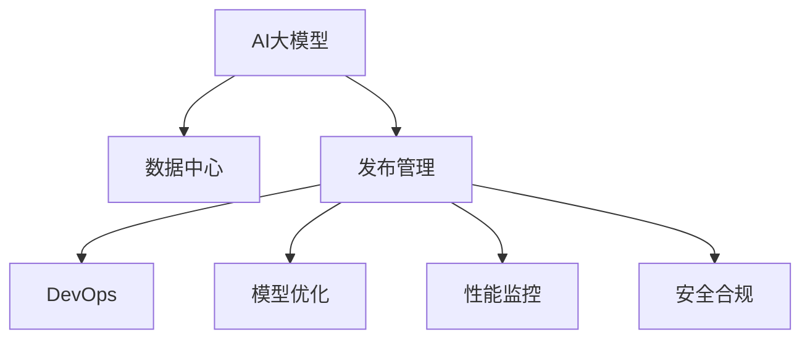

                 

# AI 大模型应用数据中心的发布管理

> 关键词：AI大模型,数据中心,发布管理,自动化,DevOps,模型优化,性能监控,安全合规

## 1. 背景介绍

### 1.1 问题由来
随着人工智能技术的快速发展，特别是深度学习模型的广泛应用，数据中心在AI大模型的训练、部署和运维方面面临着越来越多的挑战。如何高效、安全、可控地管理和发布AI大模型，成为了数据中心管理的核心问题。

1. 模型多样性：AI大模型种类繁多，包括分类、回归、生成等不同类型的模型。每种模型具有不同的训练要求和发布流程。

2. 数据复杂性：AI大模型训练需要大量数据，数据来源复杂，数据格式各异，数据质量参差不齐，数据处理和清洗工作量大。

3. 计算资源需求：AI大模型训练和推理需要高性能计算资源，包括GPU、TPU等。如何合理分配计算资源，提升计算效率，是一个重要挑战。

4. 性能优化：AI大模型的训练和推理需要优化，包括超参数调优、模型压缩、量化等，以提高模型性能和资源利用率。

5. 安全合规：AI大模型的训练和应用需要遵守数据隐私和安全法规，如何确保模型在发布和使用过程中的合规性，是一个重要考虑因素。

## 2. 核心概念与联系

### 2.1 核心概念概述

为更好地理解AI大模型应用数据中心的发布管理方法，本节将介绍几个密切相关的核心概念：

- AI大模型(Artificial Intelligence Large Model)：以深度学习为基础，通过大量数据训练而成的复杂模型。通常具有强大的预测和推理能力。

- 数据中心(Data Center)：提供高性能计算、存储、网络等资源，用于AI大模型的训练、推理和运维。

- 发布管理(Release Management)：通过一系列管理流程和工具，确保AI大模型的训练和部署顺利进行，并在运行过程中进行监控和优化。

- DevOps：软件开发和运维的集成，旨在提高软件交付的速度和质量，提升运维的自动化水平。

- 模型优化(Model Optimization)：通过超参数调优、模型压缩、量化等技术，提升AI大模型的性能和资源利用率。

- 性能监控(Performance Monitoring)：通过实时监测AI大模型的训练和推理过程，评估其性能和资源使用情况，进行问题诊断和优化。

- 安全合规(Security & Compliance)：确保AI大模型的训练和应用符合数据隐私和安全法规，保护数据和模型的安全。

这些核心概念之间的逻辑关系可以通过以下Mermaid流程图来展示：



这个流程图展示了大模型应用的各个环节及其相互关系：

1. AI大模型通过数据中心提供的高性能计算资源进行训练和推理。
2. 发布管理通过一系列管理流程和工具，确保模型顺利部署和运维。
3. DevOps通过自动化和持续集成等技术，提升模型交付的速度和质量。
4. 模型优化通过超参数调优、模型压缩等技术，提升模型性能和资源利用率。
5. 性能监控通过实时监测模型性能和资源使用情况，进行问题诊断和优化。
6. 安全合规通过数据隐私和安全法规的遵守，保护模型数据和应用的安全。

## 3. 核心算法原理 & 具体操作步骤

### 3.1 算法原理概述

AI大模型的发布管理，本质上是一个复杂的管理过程，涉及模型训练、数据处理、计算资源调度、模型优化、性能监控和安全合规等多个环节。发布管理的核心目标是确保AI大模型的顺利发布和使用，同时提升模型的性能和资源利用率，保护数据和模型的安全。

形式化地，假设AI大模型为 $M_{\theta}$，其中 $\theta$ 为模型参数。给定数据集 $D$，发布管理的任务是找到最优的模型发布策略，使得模型在 $D$ 上达到理想性能。

发布管理的目标是最小化损失函数 $\mathcal{L}(M_{\theta}, D)$，即：

$$
\mathop{\arg\min}_{\theta} \mathcal{L}(M_{\theta}, D)
$$

其中 $\mathcal{L}$ 为损失函数，用于衡量模型在数据集 $D$ 上的性能。常见的损失函数包括分类误差、回归误差等。

### 3.2 算法步骤详解

AI大模型的发布管理一般包括以下几个关键步骤：

**Step 1: 准备数据和资源**

- 收集和处理AI大模型的训练数据，确保数据质量和格式统一。
- 评估和分配AI大模型的计算资源，如GPU、TPU等，确保资源的充足和高效利用。

**Step 2: 进行模型训练和优化**

- 在数据中心的高性能计算资源上，使用DevOps工具自动化地进行模型训练和优化。
- 采用超参数调优、模型压缩、量化等技术，提升模型性能和资源利用率。

**Step 3: 进行性能评估和监控**

- 在训练和优化过程中，实时监测模型的性能指标和资源使用情况，如准确率、精度、内存占用等。
- 根据监测结果进行问题诊断和优化，确保模型的性能和资源利用率达到最优。

**Step 4: 进行模型发布和安全合规**

- 在模型训练和优化完成后，进行模型发布和部署。
- 确保模型发布符合安全合规要求，如数据隐私保护、模型安全审计等。

**Step 5: 进行运维和持续改进**

- 在模型部署后，进行持续的性能监控和优化。
- 根据实际应用场景，不断调整和改进模型，以适应不同的业务需求。

以上是AI大模型发布管理的一般流程。在实际应用中，还需要针对具体任务的特点，对发布过程的各个环节进行优化设计，如改进训练目标函数，引入更多的正则化技术，搜索最优的超参数组合等，以进一步提升模型性能。

### 3.3 算法优缺点

AI大模型的发布管理方法具有以下优点：

1. 系统性：通过一系列管理流程和工具，确保模型训练、优化、发布和运维的顺利进行，提高工作效率。
2. 自动化：采用DevOps技术，自动化地进行模型训练和部署，减少人工操作，提高工作效率。
3. 效率高：通过性能监控和优化，及时发现问题并进行调整，确保模型性能和资源利用率达到最优。
4. 安全性：通过安全合规管理，确保模型训练和应用符合法规要求，保护数据和模型的安全。

同时，该方法也存在一定的局限性：

1. 依赖资源：发布管理依赖高性能计算资源，对于计算资源不足的数据中心，可能面临瓶颈。
2. 复杂性高：发布管理流程复杂，需要综合考虑模型训练、数据处理、资源调度等多个环节。
3. 维护成本高：发布管理涉及多种工具和技术，需要持续维护和更新，维护成本较高。
4. 可扩展性差：发布管理流程相对固定，对于新模型或新任务的引入，可能需要重新设计和调整。

尽管存在这些局限性，但就目前而言，基于发布管理的AI大模型应用方法仍是数据中心管理的重要范式。未来相关研究的重点在于如何进一步降低发布管理的复杂度，提高模型的可扩展性和灵活性，同时兼顾性能和安全性。

### 3.4 算法应用领域

AI大模型的发布管理方法在多个领域得到了广泛应用，如：

- 智能推荐系统：通过发布管理，确保推荐模型的训练和部署顺利进行，提升推荐性能和用户体验。
- 金融风控系统：通过发布管理，确保风控模型的训练和部署符合安全合规要求，保护用户数据安全。
- 医疗诊断系统：通过发布管理，确保诊断模型的训练和部署顺利进行，提升诊断准确率和效率。
- 自然语言处理系统：通过发布管理，确保语言模型的训练和部署符合安全合规要求，保护用户隐私和模型安全。
- 视频内容推荐系统：通过发布管理，确保推荐模型的训练和部署顺利进行，提升内容推荐准确率和用户满意度。

除了上述这些典型领域外，AI大模型发布管理的方法也在更多场景中得到了应用，如教育、智慧城市、物联网等，为不同行业的数字化转型提供了新的技术支撑。

## 4. 数学模型和公式 & 详细讲解 & 举例说明

### 4.1 数学模型构建

本节将使用数学语言对AI大模型应用发布管理过程进行更加严格的刻画。

记AI大模型为 $M_{\theta}$，其中 $\theta$ 为模型参数。假设发布管理的训练集为 $D=\{(x_i, y_i)\}_{i=1}^N, x_i \in \mathcal{X}, y_i \in \mathcal{Y}$。

定义模型 $M_{\theta}$ 在数据样本 $(x,y)$ 上的损失函数为 $\ell(M_{\theta}(x),y)$，则在数据集 $D$ 上的经验风险为：

$$
\mathcal{L}(\theta) = \frac{1}{N} \sum_{i=1}^N \ell(M_{\theta}(x_i),y_i)
$$

发布管理的优化目标是最小化经验风险，即找到最优参数：

$$
\theta^* = \mathop{\arg\min}_{\theta} \mathcal{L}(\theta)
$$

在实践中，我们通常使用基于梯度的优化算法（如SGD、Adam等）来近似求解上述最优化问题。设 $\eta$ 为学习率，$\lambda$ 为正则化系数，则参数的更新公式为：

$$
\theta \leftarrow \theta - \eta \nabla_{\theta}\mathcal{L}(\theta) - \eta\lambda\theta
$$

其中 $\nabla_{\theta}\mathcal{L}(\theta)$ 为损失函数对参数 $\theta$ 的梯度，可通过反向传播算法高效计算。

### 4.2 公式推导过程

以下我们以分类任务为例，推导交叉熵损失函数及其梯度的计算公式。

假设模型 $M_{\theta}$ 在输入 $x$ 上的输出为 $\hat{y}=M_{\theta}(x) \in [0,1]$，表示样本属于正类的概率。真实标签 $y \in \{0,1\}$。则二分类交叉熵损失函数定义为：

$$
\ell(M_{\theta}(x),y) = -[y\log \hat{y} + (1-y)\log (1-\hat{y})]
$$

将其代入经验风险公式，得：

$$
\mathcal{L}(\theta) = -\frac{1}{N}\sum_{i=1}^N [y_i\log M_{\theta}(x_i)+(1-y_i)\log(1-M_{\theta}(x_i))]
$$

根据链式法则，损失函数对参数 $\theta_k$ 的梯度为：

$$
\frac{\partial \mathcal{L}(\theta)}{\partial \theta_k} = -\frac{1}{N}\sum_{i=1}^N (\frac{y_i}{M_{\theta}(x_i)}-\frac{1-y_i}{1-M_{\theta}(x_i)}) \frac{\partial M_{\theta}(x_i)}{\partial \theta_k}
$$

其中 $\frac{\partial M_{\theta}(x_i)}{\partial \theta_k}$ 可进一步递归展开，利用自动微分技术完成计算。

在得到损失函数的梯度后，即可带入参数更新公式，完成模型的迭代优化。重复上述过程直至收敛，最终得到适应发布任务的最优模型参数 $\theta^*$。

## 5. 项目实践：代码实例和详细解释说明

### 5.1 开发环境搭建

在进行发布管理实践前，我们需要准备好开发环境。以下是使用Python进行PyTorch开发的环境配置流程：

1. 安装Anaconda：从官网下载并安装Anaconda，用于创建独立的Python环境。

2. 创建并激活虚拟环境：
```bash
conda create -n pytorch-env python=3.8 
conda activate pytorch-env
```

3. 安装PyTorch：根据CUDA版本，从官网获取对应的安装命令。例如：
```bash
conda install pytorch torchvision torchaudio cudatoolkit=11.1 -c pytorch -c conda-forge
```

4. 安装Transformers库：
```bash
pip install transformers
```

5. 安装各类工具包：
```bash
pip install numpy pandas scikit-learn matplotlib tqdm jupyter notebook ipython
```

完成上述步骤后，即可在`pytorch-env`环境中开始发布管理实践。

### 5.2 源代码详细实现

下面我们以发布管理中的模型优化为例，给出使用Transformers库进行模型优化、性能监控的PyTorch代码实现。

首先，定义模型优化函数：

```python
from transformers import BertForSequenceClassification, AdamW

model = BertForSequenceClassification.from_pretrained('bert-base-cased', num_labels=2)

optimizer = AdamW(model.parameters(), lr=2e-5)

def optimize_model(model, optimizer, data_loader):
    model.train()
    total_loss = 0
    for batch in tqdm(data_loader, desc='Optimizing'):
        input_ids = batch['input_ids'].to(device)
        attention_mask = batch['attention_mask'].to(device)
        labels = batch['labels'].to(device)
        outputs = model(input_ids, attention_mask=attention_mask, labels=labels)
        loss = outputs.loss
        total_loss += loss.item()
        optimizer.zero_grad()
        loss.backward()
        optimizer.step()
    return total_loss / len(data_loader)

# 测试优化效果
loss = optimize_model(model, optimizer, train_loader)
print(f'Model optimization loss: {loss:.3f}')
```

然后，定义性能监控函数：

```python
from torch.utils.data import DataLoader
from tqdm import tqdm
from sklearn.metrics import classification_report

device = torch.device('cuda') if torch.cuda.is_available() else torch.device('cpu')
model.to(device)

def monitor_model(model, data_loader):
    model.eval()
    preds, labels = [], []
    with torch.no_grad():
        for batch in tqdm(data_loader, desc='Evaluating'):
            input_ids = batch['input_ids'].to(device)
            attention_mask = batch['attention_mask'].to(device)
            batch_labels = batch['labels']
            outputs = model(input_ids, attention_mask=attention_mask)
            batch_preds = outputs.logits.argmax(dim=2).to('cpu').tolist()
            batch_labels = batch_labels.to('cpu').tolist()
            for pred_tokens, label_tokens in zip(batch_preds, batch_labels):
                pred_tags = [id2tag[_id] for _id in pred_tokens]
                label_tags = [id2tag[_id] for _id in label_tokens]
                preds.append(pred_tags[:len(label_tags)])
                labels.append(label_tags)
                
    print(classification_report(labels, preds))
```

最后，启动模型优化和性能监控流程：

```python
epochs = 5
batch_size = 16

for epoch in range(epochs):
    loss = optimize_model(model, optimizer, train_loader)
    print(f'Epoch {epoch+1}, model optimization loss: {loss:.3f}')
    
    monitor_model(model, dev_loader)
    
print("Model optimization and monitoring completed.")
```

以上就是使用PyTorch对Bert模型进行优化和性能监控的完整代码实现。可以看到，得益于Transformers库的强大封装，我们可以用相对简洁的代码完成模型优化和性能监控的实现。

### 5.3 代码解读与分析

让我们再详细解读一下关键代码的实现细节：

**optimize_model函数**：
- `model.train()`：将模型设置为训练模式。
- `total_loss = 0`：记录当前epoch的总损失。
- `for`循环：迭代数据集中的每个批次。
- `input_ids`：输入的token ids。
- `attention_mask`：输入的attention mask。
- `labels`：标签。
- `outputs = model(input_ids, attention_mask=attention_mask, labels=labels)`：模型输出。
- `loss = outputs.loss`：计算损失。
- `total_loss += loss.item()`：累加当前batch的损失。
- `optimizer.zero_grad()`：清零优化器梯度。
- `loss.backward()`：反向传播计算梯度。
- `optimizer.step()`：更新模型参数。
- 返回当前epoch的平均损失。

**monitor_model函数**：
- `model.eval()`：将模型设置为评估模式。
- `preds, labels = [], []`：初始化预测和标签列表。
- `for`循环：迭代数据集中的每个批次。
- `input_ids`：输入的token ids。
- `attention_mask`：输入的attention mask。
- `batch_labels`：标签。
- `outputs = model(input_ids, attention_mask=attention_mask)`：模型输出。
- `batch_preds = outputs.logits.argmax(dim=2).to('cpu').tolist()`：将模型输出转换为标签。
- `batch_labels = batch_labels.to('cpu').tolist()`：将真实标签转换为标签。
- 输出分类报告。

**训练流程**：
- 定义总的epoch数和batch size，开始循环迭代
- 每个epoch内，先在训练集上进行模型优化，输出平均损失
- 在验证集上评估模型性能
- 所有epoch结束后，输出优化效果

可以看到，PyTorch配合Transformers库使得Bert模型的优化和性能监控代码实现变得简洁高效。开发者可以将更多精力放在数据处理、模型改进等高层逻辑上，而不必过多关注底层的实现细节。

当然，工业级的系统实现还需考虑更多因素，如模型的保存和部署、超参数的自动搜索、更灵活的任务适配层等。但核心的发布管理范式基本与此类似。

## 6. 实际应用场景
### 6.1 智能推荐系统

基于AI大模型发布管理的推荐系统，可以实时动态调整推荐模型，优化推荐结果，提升用户体验。

在技术实现上，可以收集用户浏览、点击、评分等行为数据，将其作为监督信号，对推荐模型进行微调。通过实时监测推荐系统的性能指标，及时发现问题并进行调整，确保推荐模型的准确性和实时性。

### 6.2 金融风控系统

金融风控系统需要实时监测用户行为，及时发现异常交易，防止欺诈和风险。发布管理可以通过持续集成和持续交付等DevOps技术，确保风控模型的及时更新和部署。

在实践中，可以收集用户交易数据，对其进行标注和标注数据集划分。使用发布管理工具自动化地进行模型训练和部署，实时监测模型性能，及时发现异常交易并进行预警，确保金融安全。

### 6.3 医疗诊断系统

医疗诊断系统需要高效、准确地分析患者数据，辅助医生进行诊断和治疗。发布管理可以通过自动化工具，确保诊断模型的及时更新和部署，提升诊断系统的性能和可靠性。

在实践中，可以收集患者的影像数据、病理数据等，对其进行标注和标注数据集划分。使用发布管理工具自动化地进行模型训练和部署，实时监测模型性能，及时发现诊断错误并进行优化，确保诊断系统的准确性和实时性。

### 6.4 未来应用展望

随着发布管理技术的不断发展，未来AI大模型发布管理将呈现以下几个发展趋势：

1. 模型自动化调优：利用自动化调优技术，自动搜索最优的超参数组合，提升模型性能。
2. 多模型融合：通过多模型融合技术，提升模型的鲁棒性和泛化能力。
3. 模型版本管理：通过版本管理工具，记录模型训练和部署的历史，便于版本回溯和问题定位。
4. 模型微服务化：将模型封装为微服务，便于灵活部署和扩展。
5. 跨平台部署：将模型部署到云平台、边缘计算等不同平台，提升模型的可用性和可扩展性。
6. 模型隐私保护：通过差分隐私等技术，保护模型训练和应用中的隐私数据。
7. 模型安全审计：通过安全审计技术，确保模型训练和应用的安全合规。

以上趋势凸显了发布管理技术的广阔前景。这些方向的探索发展，必将进一步提升AI大模型的性能和安全性，为智能系统的高效、可靠运行提供坚实的技术保障。

## 7. 工具和资源推荐
### 7.1 学习资源推荐

为了帮助开发者系统掌握AI大模型发布管理的理论基础和实践技巧，这里推荐一些优质的学习资源：

1. 《深度学习入门》系列博文：深入浅出地介绍了深度学习的核心概念和应用实践，涵盖模型训练、优化、发布等多个环节。

2. CS231n《深度学习视觉识别》课程：斯坦福大学开设的视觉识别课程，讲解了深度学习在图像、视频等领域的典型应用。

3. 《TensorFlow深度学习实战》书籍：讲解了TensorFlow框架的开发实践，涵盖模型训练、优化、部署等多个环节。

4. GitHub开源项目：提供了丰富的AI大模型代码和文档，包括训练、优化、发布等环节的详细实现。

5. Kaggle竞赛平台：通过参与Kaggle竞赛，实践和验证AI大模型的训练和发布效果。

通过对这些资源的学习实践，相信你一定能够快速掌握AI大模型发布管理的精髓，并用于解决实际的AI系统问题。
###  7.2 开发工具推荐

高效的开发离不开优秀的工具支持。以下是几款用于AI大模型发布管理的常用工具：

1. PyTorch：基于Python的开源深度学习框架，灵活动态的计算图，适合快速迭代研究。

2. TensorFlow：由Google主导开发的开源深度学习框架，生产部署方便，适合大规模工程应用。

3. Transformers库：HuggingFace开发的NLP工具库，集成了众多SOTA语言模型，支持PyTorch和TensorFlow，是发布管理的重要工具。

4. Jupyter Notebook：交互式开发环境，支持代码、数据和文档的联合展示，便于共享和协作。

5. GitLab：代码托管和协作平台，支持版本控制、CI/CD、安全审计等功能，便于发布管理工具的集成和使用。

6. Docker：容器化技术，便于模型的封装和部署，提升模型的可移植性和可扩展性。

合理利用这些工具，可以显著提升AI大模型发布管理的开发效率，加快创新迭代的步伐。

### 7.3 相关论文推荐

AI大模型发布管理的理论基础来源于学界的持续研究。以下是几篇奠基性的相关论文，推荐阅读：

1. Automated Machine Learning：AutML自动化机器学习，通过自动化调优提升模型性能。

2. Model Distillation：模型蒸馏，通过知识蒸馏提升模型的泛化能力和可解释性。

3. Continuous Deployment for Deep Learning Models：持续部署技术，通过自动化工具提升模型的交付速度和质量。

4. Hyperparameter Optimization with Bayesian Methods：贝叶斯优化方法，通过搜索最优的超参数组合提升模型性能。

5. Model Versioning and Publishing in the Wild：模型版本和发布技术，通过版本管理工具提升模型的可维护性和可追溯性。

这些论文代表了大模型发布管理的最新进展，通过学习这些前沿成果，可以帮助研究者把握学科前进方向，激发更多的创新灵感。

## 8. 总结：未来发展趋势与挑战

### 8.1 总结

本文对AI大模型应用数据中心的发布管理方法进行了全面系统的介绍。首先阐述了AI大模型的训练、优化、发布、运维等发布管理过程，明确了发布管理在确保模型高效、安全、可控运行中的重要作用。其次，从原理到实践，详细讲解了发布管理的数学模型和关键步骤，给出了发布管理任务开发的完整代码实例。同时，本文还广泛探讨了发布管理方法在智能推荐、金融风控、医疗诊断等多个行业领域的应用前景，展示了发布管理范式的巨大潜力。此外，本文精选了发布管理的各类学习资源，力求为读者提供全方位的技术指引。

通过本文的系统梳理，可以看到，基于发布管理的AI大模型应用方法正在成为数据中心管理的重要范式，极大地拓展了AI大模型的应用边界，催生了更多的落地场景。受益于深度学习技术的持续演进，发布管理技术必将进一步提升AI大模型的性能和安全性，为智能系统的高效、可靠运行提供坚实的技术保障。

### 8.2 未来发展趋势

展望未来，AI大模型发布管理技术将呈现以下几个发展趋势：

1. 模型自动化调优：利用自动化调优技术，自动搜索最优的超参数组合，提升模型性能。
2. 多模型融合：通过多模型融合技术，提升模型的鲁棒性和泛化能力。
3. 模型版本管理：通过版本管理工具，记录模型训练和部署的历史，便于版本回溯和问题定位。
4. 模型微服务化：将模型封装为微服务，便于灵活部署和扩展。
5. 跨平台部署：将模型部署到云平台、边缘计算等不同平台，提升模型的可用性和可扩展性。
6. 模型隐私保护：通过差分隐私等技术，保护模型训练和应用中的隐私数据。
7. 模型安全审计：通过安全审计技术，确保模型训练和应用的安全合规。

以上趋势凸显了发布管理技术的广阔前景。这些方向的探索发展，必将进一步提升AI大模型的性能和安全性，为智能系统的高效、可靠运行提供坚实的技术保障。

### 8.3 面临的挑战

尽管AI大模型发布管理技术已经取得了瞩目成就，但在迈向更加智能化、普适化应用的过程中，它仍面临着诸多挑战：

1. 依赖资源：发布管理依赖高性能计算资源，对于计算资源不足的数据中心，可能面临瓶颈。
2. 复杂性高：发布管理流程复杂，需要综合考虑模型训练、数据处理、资源调度等多个环节。
3. 维护成本高：发布管理涉及多种工具和技术，需要持续维护和更新，维护成本较高。
4. 可扩展性差：发布管理流程相对固定，对于新模型或新任务的引入，可能需要重新设计和调整。
5. 性能优化困难：在保证模型精度的情况下，如何提升模型性能和资源利用率，是一个重要的挑战。

尽管存在这些挑战，但就目前而言，基于发布管理的AI大模型应用方法仍是数据中心管理的重要范式。未来相关研究的重点在于如何进一步降低发布管理的复杂度，提高模型的可扩展性和灵活性，同时兼顾性能和安全性。

### 8.4 研究展望

面向未来，AI大模型发布管理技术需要在以下几个方面寻求新的突破：

1. 探索无监督和半监督发布管理方法。摆脱对大规模标注数据的依赖，利用自监督学习、主动学习等无监督和半监督范式，最大限度利用非结构化数据，实现更加灵活高效的发布管理。
2. 研究参数高效和计算高效的发布管理范式。开发更加参数高效的发布管理方法，在固定大部分预训练参数的同时，只更新极少量的任务相关参数。同时优化发布管理的计算图，减少前向传播和反向传播的资源消耗，实现更加轻量级、实时性的部署。
3. 引入因果分析和博弈论工具。将因果分析方法引入发布管理模型，识别出模型决策的关键特征，增强发布管理模型的因果关系，学习更加普适、鲁棒的语言模型。借助博弈论工具刻画人机交互过程，主动探索并规避模型的脆弱点，提高系统稳定性。
4. 纳入伦理道德约束。在发布管理目标中引入伦理导向的评估指标，过滤和惩罚有偏见、有害的输出倾向。同时加强人工干预和审核，建立模型行为的监管机制，确保输出符合人类价值观和伦理道德。

这些研究方向的探索，必将引领AI大模型发布管理技术迈向更高的台阶，为构建安全、可靠、可解释、可控的智能系统铺平道路。面向未来，发布管理技术还需要与其他人工智能技术进行更深入的融合，如知识表示、因果推理、强化学习等，多路径协同发力，共同推动自然语言理解和智能交互系统的进步。只有勇于创新、敢于突破，才能不断拓展语言模型的边界，让智能技术更好地造福人类社会。

## 9. 附录：常见问题与解答

**Q1：AI大模型发布管理是否适用于所有AI应用场景？**

A: AI大模型发布管理在大多数AI应用场景中都能取得不错的效果，特别是对于计算资源丰富、数据来源多样的应用。但对于一些需要特定领域的知识或领域数据的模型，可能需要进一步预训练和微调，才能达到最佳性能。此外，对于一些需要实时性、高性能的应用，如实时推荐、实时风控等，发布管理也需要针对性的改进优化。

**Q2：发布管理过程中如何选择合适的超参数？**

A: 发布管理中，选择合适的超参数是模型优化和性能提升的关键。常用的方法包括网格搜索、随机搜索、贝叶斯优化等。

- 网格搜索：通过在预定义的超参数空间中穷举搜索，找到最优组合。适用于超参数空间较小的情况。

- 随机搜索：通过随机抽样的方式搜索超参数空间，找到最优组合。适用于超参数空间较大的情况。

- 贝叶斯优化：通过利用先验知识，逐步逼近最优超参数组合。适用于超参数空间较大的情况。

这些方法需要根据具体任务和数据特点进行选择。通常建议在超参数空间较小的情况下，使用网格搜索或随机搜索；在超参数空间较大的情况下，使用贝叶斯优化。

**Q3：发布管理中如何降低计算资源成本？**

A: 降低计算资源成本是发布管理中重要的考虑因素。常用的方法包括：

- 模型压缩：通过剪枝、量化、蒸馏等技术，减小模型规模，提高计算效率。

- 模型微服务化：将模型封装为微服务，便于灵活部署和扩展，减少计算资源的浪费。

- 分布式训练：利用分布式训练技术，提升模型训练效率，降低单台设备成本。

- 云平台部署：将模型部署到云平台，利用云平台的弹性资源，降低计算资源成本。

这些方法需要根据具体应用场景进行选择。通常在计算资源较为紧张的情况下，可以优先考虑模型压缩、微服务化和云平台部署；在计算资源较为充裕的情况下，可以优先考虑分布式训练。

**Q4：发布管理中如何进行模型隐私保护？**

A: 模型隐私保护是发布管理中重要的考虑因素。常用的方法包括：

- 差分隐私：通过在模型训练和推理过程中引入噪声，保护用户隐私。

- 模型蒸馏：通过知识蒸馏技术，减小模型规模，保护用户隐私。

- 数据匿名化：通过数据脱敏技术，保护用户隐私。

这些方法需要根据具体应用场景进行选择。通常在需要保护用户隐私的应用中，可以优先考虑差分隐私和模型蒸馏；在用户隐私保护需求较低的场景中，可以优先考虑数据匿名化。

**Q5：发布管理中如何进行模型安全审计？**

A: 模型安全审计是发布管理中重要的考虑因素。常用的方法包括：

- 代码审计：通过代码审计技术，确保模型训练和推理代码的安全性。

- 漏洞检测：通过漏洞检测工具，发现模型训练和推理中的潜在安全问题。

- 安全加固：通过安全加固技术，增强模型训练和推理的安全性。

这些方法需要根据具体应用场景进行选择。通常在安全需求较高的应用中，可以优先考虑代码审计和漏洞检测；在安全需求较低的应用中，可以优先考虑安全加固。

---

作者：禅与计算机程序设计艺术 / Zen and the Art of Computer Programming

