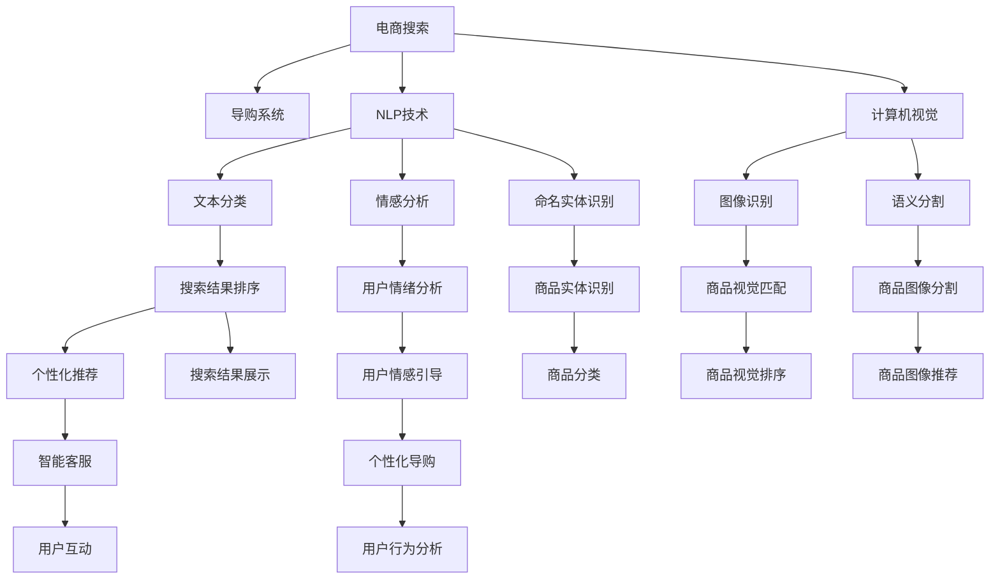

                 

# AI 技术与电商搜索导购：机遇与挑战并存

> 关键词：AI 技术，电商搜索，导购系统，机会，挑战，解决方案

## 1. 背景介绍

### 1.1 问题由来
在电子商务迅猛发展的今天，电商平台已经成为人们购物的首选平台之一。电商平台通过提供丰富的商品信息、精准的搜索排序和个性化的推荐，极大提升了用户体验和购买转化率。随着消费者对购物体验的期望不断提高，电商搜索导购系统也迎来了更多的挑战和机遇。

AI 技术的发展，尤其是深度学习、自然语言处理和计算机视觉技术的突破，为电商搜索导购系统的升级带来了新的契机。基于AI技术，电商搜索导购系统可以从文本、图片、音频等多模态数据中提取出丰富的商品信息，并根据用户的行为、兴趣和历史数据进行智能推荐，进一步提升用户购物的便捷性和满意度。

### 1.2 问题核心关键点
电商搜索导购系统是一个典型的AI应用场景，其主要功能包括商品搜索、商品推荐、智能客服、商品评价、优惠券发放等。其核心在于如何高效地从海量数据中提取有价值的信息，并以用户为中心，提供个性化的商品推荐和导购服务。

具体问题包括以下几个方面：
1. **信息提取与表示**：如何从商品描述、图片、视频等多源数据中提取出丰富的语义信息，并进行有效的表示。
2. **用户意图理解**：如何精准地理解用户搜索意图和偏好，并生成相应的搜索结果和推荐列表。
3. **推荐算法优化**：如何在有限的标注数据下，设计高效的推荐算法，提升推荐效果。
4. **实时性能优化**：如何在保证推荐效果的同时，提升系统的实时响应能力，以应对用户的高并发请求。
5. **用户体验提升**：如何通过个性化推荐和智能客服等手段，提升用户购物体验，增加用户粘性。

### 1.3 问题研究意义
电商搜索导购系统的成功与否直接关系到电商平台的销售转化率和用户体验。通过引入AI技术，电商搜索导购系统可以更高效、精准地理解和满足用户需求，提升搜索排序的准确性和推荐列表的相关性，从而提高用户满意度和忠诚度。

AI技术的引入不仅可以提升电商平台的竞争力，还可以推动AI技术在更广泛的行业中的应用，促进整个社会的信息化和智能化发展。因此，研究AI技术在电商搜索导购系统中的应用，具有重要的理论和实践意义。

## 2. 核心概念与联系

### 2.1 核心概念概述

为了更好地理解AI技术在电商搜索导购系统中的应用，本节将介绍几个关键概念：

- **电商搜索**：指用户在电商平台上通过关键词搜索获取相关商品的过程。
- **导购系统**：指通过AI技术对搜索结果进行排序、推荐和个性化展示的系统。
- **自然语言处理(NLP)**：指使用计算机处理和理解人类自然语言的技术，包括文本分类、情感分析、命名实体识别等。
- **计算机视觉**：指使用计算机处理和分析图像、视频等视觉数据的技术，包括图像识别、语义分割等。
- **深度学习**：指使用深度神经网络模型处理复杂数据和任务的机器学习方法，包括卷积神经网络(CNN)、循环神经网络(RNN)、变换器(Transformer)等。

这些核心概念之间的关系可以通过以下Mermaid流程图来展示：



这个流程图展示了电商搜索导购系统的核心组件和关键技术，以及它们之间的关系。这些技术相互协作，共同实现高效、精准的搜索和推荐。

## 3. 核心算法原理 & 具体操作步骤
### 3.1 算法原理概述

基于AI技术的电商搜索导购系统，主要分为两个阶段：信息提取与表示和推荐排序。

信息提取与表示阶段，通过自然语言处理和计算机视觉技术，将商品信息从文本、图片等多源数据中提取出来，并进行有效的表示。推荐排序阶段，通过设计高效的推荐算法，结合用户行为数据，对搜索结果进行排序和推荐。

具体来说，信息提取与表示阶段包括以下几个步骤：
1. **数据预处理**：对原始数据进行清洗、分词、归一化等处理。
2. **特征提取**：使用NLP和计算机视觉技术，从文本和图像中提取关键特征。
3. **语义表示**：将提取的特征通过深度学习模型进行编码，生成语义表示向量。

推荐排序阶段包括以下几个步骤：
1. **用户画像构建**：基于用户的历史行为数据和兴趣偏好，构建用户画像。
2. **商品匹配**：将商品语义表示向量与用户画像进行匹配，找到相关性高的商品。
3. **排序和推荐**：设计高效的推荐算法，对匹配到的商品进行排序和推荐。

### 3.2 算法步骤详解

#### 3.2.1 信息提取与表示

**Step 1: 数据预处理**
1. **文本数据清洗**：去除无关的标点符号、停用词等噪音，保留有用信息。
2. **文本分词**：将文本按照一定规则进行分词，生成词汇序列。
3. **文本归一化**：对分词后的词汇进行统一大小写、去除拼写错误等处理。

**Step 2: 特征提取**
1. **文本特征提取**：使用词向量模型(BOW、TF-IDF、Word2Vec等)将文本转换为向量表示。
2. **图像特征提取**：使用CNN模型对图像进行特征提取，生成图像向量。

**Step 3: 语义表示**
1. **编码表示**：使用预训练的深度学习模型(BERT、GPT等)对文本和图像向量进行编码，生成语义表示向量。

#### 3.2.2 推荐排序

**Step 1: 用户画像构建**
1. **行为数据收集**：收集用户的历史浏览、点击、购买等行为数据。
2. **用户画像建模**：使用协同过滤、深度学习等方法，构建用户画像。

**Step 2: 商品匹配**
1. **商品编码**：使用相同的深度学习模型对商品进行编码，生成语义表示向量。
2. **相似度计算**：使用余弦相似度、欧式距离等方法，计算商品向量与用户画像之间的相似度。

**Step 3: 排序和推荐**
1. **推荐算法选择**：根据任务需求，选择合适的推荐算法，如基于矩阵分解的协同过滤、基于深度学习的排序方法等。
2. **排序和推荐**：将相似度排序后，选择前N个商品进行推荐。

### 3.3 算法优缺点

基于AI技术的电商搜索导购系统具有以下优点：
1. **高效精准**：通过AI技术，可以快速、准确地从海量数据中提取信息并进行匹配，提升搜索排序的准确性和推荐效果。
2. **个性化推荐**：能够根据用户的行为和兴趣进行个性化推荐，提升用户满意度。
3. **实时响应**：通过分布式计算和缓存技术，实现实时响应，提升用户体验。

同时，该方法也存在以下缺点：
1. **数据依赖**：推荐效果高度依赖于数据的丰富性和质量，数据获取和处理成本较高。
2. **算法复杂**：深度学习模型和推荐算法的设计和训练较为复杂，需要较多的技术积累。
3. **用户隐私**：在推荐排序过程中，需要收集和处理大量的用户数据，涉及用户隐私保护问题。

### 3.4 算法应用领域

基于AI技术的电商搜索导购系统在多个领域得到了广泛应用，例如：

- **智能搜索**：通过自然语言处理技术，实现用户意图理解，生成个性化的搜索结果。
- **推荐系统**：通过协同过滤、深度学习等方法，生成精准的个性化推荐列表。
- **智能客服**：使用自然语言处理和知识图谱技术，实现智能客服聊天，解决用户疑问。
- **商品评价**：通过情感分析技术，对用户评价进行情感分类，生成情感倾向的推荐列表。
- **优惠券发放**：基于用户行为和兴趣，生成个性化的优惠券，提升用户购买转化率。

除了这些常见的应用外，电商搜索导购系统还可以扩展到更多领域，如商品分类、价格预测、库存管理等，为电商平台提供更全面、智能的解决方案。

## 4. 数学模型和公式 & 详细讲解
### 4.1 数学模型构建

电商搜索导购系统中的推荐排序过程可以建模为一个优化问题。假设用户画像为 $U$，商品向量为 $I$，用户和商品的相似度为 $S$，推荐列表为 $R$。目标是最小化用户和推荐列表之间的相似度损失，即：

$$
\min_{R} \sum_{u \in U} \sum_{i \in I} s_u(i) \cdot d(u, R)
$$

其中 $d(u, R)$ 为用户与推荐列表之间的距离，可以采用欧式距离或余弦相似度等。

### 4.2 公式推导过程

**欧式距离模型**：
假设用户画像 $u$ 和商品向量 $i$ 的语义表示向量分别为 $\overrightarrow{u}$ 和 $\overrightarrow{i}$，欧式距离 $d(u, i)$ 可以表示为：

$$
d(u, i) = \sqrt{\|\overrightarrow{u} - \overrightarrow{i}\|^2}
$$

**余弦相似度模型**：
假设用户画像 $u$ 和商品向量 $i$ 的语义表示向量分别为 $\overrightarrow{u}$ 和 $\overrightarrow{i}$，余弦相似度 $s_u(i)$ 可以表示为：

$$
s_u(i) = \frac{\overrightarrow{u} \cdot \overrightarrow{i}}{\|\overrightarrow{u}\| \cdot \|\overrightarrow{i}\|}
$$

### 4.3 案例分析与讲解

假设某电商平台的推荐系统使用了欧式距离模型进行推荐，用户画像 $u$ 和商品向量 $i$ 的语义表示向量分别为 $\overrightarrow{u} = [1, 2, 3]$ 和 $\overrightarrow{i} = [4, 5, 6]$。假设用户画像和商品向量的距离矩阵为 $D = \begin{bmatrix} d(u_1, i_1) & d(u_1, i_2) & \cdots \\ d(u_2, i_1) & d(u_2, i_2) & \cdots \\ \vdots & \vdots & \ddots \end{bmatrix}$。

假设用户画像 $u$ 和推荐列表 $R$ 之间的距离为 $d(u, R)$，则推荐列表 $R$ 可以表示为：

$$
R = \mathop{\arg\min}_{i_1, i_2, \cdots} \sum_{i \in I} s_u(i) \cdot d(u, i)
$$

通过最小化用户和推荐列表之间的相似度损失，得到最终的推荐结果。

## 5. 项目实践：代码实例和详细解释说明
### 5.1 开发环境搭建

在进行电商搜索导购系统的开发前，我们需要准备好开发环境。以下是使用Python进行TensorFlow开发的环境配置流程：

1. 安装Anaconda：从官网下载并安装Anaconda，用于创建独立的Python环境。

2. 创建并激活虚拟环境：
```bash
conda create -n tf-env python=3.8 
conda activate tf-env
```

3. 安装TensorFlow：根据CUDA版本，从官网获取对应的安装命令。例如：
```bash
conda install tensorflow -c tensorflow -c conda-forge
```

4. 安装TensorBoard：用于可视化模型训练和推理过程。

5. 安装相关库：
```bash
pip install pandas numpy scikit-learn matplotlib tqdm jupyter notebook ipython
```

完成上述步骤后，即可在`tf-env`环境中开始电商搜索导购系统的开发。

### 5.2 源代码详细实现

下面我们以电商平台商品推荐系统为例，给出使用TensorFlow进行推荐模型训练的代码实现。

首先，定义推荐模型的数据处理函数：

```python
import tensorflow as tf
from tensorflow.keras.layers import Input, Dense
from tensorflow.keras.models import Model

class RecommendationModel(tf.keras.Model):
    def __init__(self, embed_dim=64):
        super(RecommendationModel, self).__init__()
        self.embedding = tf.keras.layers.Embedding(input_dim=vocab_size, output_dim=embed_dim)
        self.dense1 = tf.keras.layers.Dense(units=64, activation='relu')
        self.dense2 = tf.keras.layers.Dense(units=num_classes, activation='sigmoid')

    def call(self, x):
        x = self.embedding(x)
        x = self.dense1(x)
        x = self.dense2(x)
        return x

# 构建推荐模型
model = RecommendationModel()

# 定义输入和输出
inputs = Input(shape=(max_seq_length,))
outputs = model(inputs)
```

然后，定义损失函数和优化器：

```python
# 定义交叉熵损失函数
loss = tf.keras.losses.BinaryCrossentropy()

# 定义优化器
optimizer = tf.keras.optimizers.Adam(learning_rate=0.001)

# 定义训练函数
def train_step(inputs, targets):
    with tf.GradientTape() as tape:
        logits = model(inputs)
        loss_value = loss(targets, logits)
    grads = tape.gradient(loss_value, model.trainable_variables)
    optimizer.apply_gradients(zip(grads, model.trainable_variables))
    return loss_value
```

最后，启动训练流程：

```python
# 定义训练参数
batch_size = 64
epochs = 10

# 定义训练集
train_dataset = ...

# 定义验证集
valid_dataset = ...

# 训练模型
for epoch in range(epochs):
    for (inputs, targets) in train_dataset:
        loss = train_step(inputs, targets)
        print(f"Epoch {epoch+1}, loss: {loss:.4f}")

    # 在验证集上评估模型
    valid_loss = 0
    for (inputs, targets) in valid_dataset:
        valid_loss += train_step(inputs, targets)
    valid_loss /= len(valid_dataset)
    print(f"Epoch {epoch+1}, valid loss: {valid_loss:.4f}")
```

以上就是使用TensorFlow对商品推荐模型进行训练的完整代码实现。可以看到，使用TensorFlow可以方便地构建推荐模型，并结合Keras的API进行高效的训练和评估。

### 5.3 代码解读与分析

让我们再详细解读一下关键代码的实现细节：

**RecommendationModel类**：
- `__init__`方法：初始化嵌入层、全连接层等关键组件。
- `call`方法：定义模型前向传播的计算过程。

**训练函数train_step**：
- 使用`tf.GradientTape`记录梯度信息，计算损失值。
- 使用`optimizer.apply_gradients`更新模型参数。
- 返回当前的损失值。

**训练循环**：
- 在训练集上迭代训练，记录每个epoch的平均损失值。
- 在验证集上评估模型，输出验证集的平均损失值。

通过以上代码，我们可以构建一个简单的商品推荐模型，并使用TensorFlow进行训练。在实际应用中，还需要结合用户画像、行为数据等进行进一步优化。

## 6. 实际应用场景

### 6.1 智能搜索

智能搜索是电商搜索导购系统的核心功能之一。通过自然语言处理技术，将用户搜索查询转换为向量表示，并匹配商品向量，生成个性化的搜索结果。具体流程包括：

1. **查询处理**：对用户搜索查询进行分词、词性标注等处理。
2. **查询向量生成**：使用预训练的深度学习模型(BERT、GPT等)将查询转换为向量表示。
3. **商品向量生成**：对商品描述、图片等进行特征提取，生成商品向量。
4. **匹配排序**：使用余弦相似度、欧式距离等方法，计算查询向量与商品向量之间的相似度，并排序生成搜索结果。

### 6.2 推荐系统

推荐系统是电商搜索导购系统的另一个核心功能。通过深度学习模型和协同过滤方法，对用户行为和商品信息进行建模，生成个性化的推荐列表。具体流程包括：

1. **用户画像构建**：使用协同过滤、深度学习等方法，构建用户画像。
2. **商品匹配**：将商品向量与用户画像进行匹配，计算相似度。
3. **排序和推荐**：根据相似度排序，选择前N个商品进行推荐。

### 6.3 智能客服

智能客服通过自然语言处理和知识图谱技术，实现智能聊天机器人，解答用户疑问。具体流程包括：

1. **意图识别**：使用自然语言处理技术，识别用户意图。
2. **知识图谱查询**：从知识图谱中查询相关知识，生成回答。
3. **回答生成**：使用自然语言生成技术，生成自然流畅的回答。

### 6.4 未来应用展望

随着AI技术的不断进步，电商搜索导购系统将迎来更多的应用场景和功能拓展。未来，电商搜索导购系统可以进一步扩展到以下领域：

- **多模态推荐**：结合图像、视频等多模态数据，提升推荐效果。
- **实时动态更新**：根据用户实时行为数据，动态调整推荐列表，提升推荐实时性。
- **跨平台推荐**：将电商平台的推荐结果与其他平台的推荐结果进行融合，提升跨平台推荐效果。
- **个性化展示**：根据用户浏览历史、行为数据等，生成个性化的展示效果，提升用户体验。
- **情感分析**：对用户评价进行情感分类，生成情感倾向的推荐列表。

## 7. 工具和资源推荐
### 7.1 学习资源推荐

为了帮助开发者系统掌握AI技术在电商搜索导购系统中的应用，这里推荐一些优质的学习资源：

1. 《深度学习》课程：斯坦福大学开设的深度学习课程，有Lecture视频和配套作业，带你入门深度学习的基本概念和经典模型。
2. 《TensorFlow教程》：TensorFlow官方提供的TensorFlow教程，涵盖从入门到进阶的各个方面，适合初学者学习。
3. 《自然语言处理与深度学习》书籍：全面介绍了自然语言处理和深度学习的基本原理和经典算法，适合深入学习。
4. 《Python深度学习》书籍：通过Python实现深度学习模型，介绍了深度学习在电商搜索导购系统中的应用。
5. Kaggle竞赛平台：提供了丰富的电商搜索导购系统相关的数据集和竞赛，适合实践和验证学习成果。

通过对这些资源的学习实践，相信你一定能够快速掌握AI技术在电商搜索导购系统中的应用，并用于解决实际的电商问题。

### 7.2 开发工具推荐

高效的开发离不开优秀的工具支持。以下是几款用于电商搜索导购系统开发的常用工具：

1. TensorFlow：由Google主导开发的开源深度学习框架，生产部署方便，适合大规模工程应用。
2. PyTorch：基于Python的开源深度学习框架，灵活动态的计算图，适合快速迭代研究。
3. Keras：TensorFlow的高级API，使用简便，适合快速构建深度学习模型。
4. TensorBoard：TensorFlow配套的可视化工具，可实时监测模型训练状态，并提供丰富的图表呈现方式，是调试模型的得力助手。
5. Weights & Biases：模型训练的实验跟踪工具，可以记录和可视化模型训练过程中的各项指标，方便对比和调优。

合理利用这些工具，可以显著提升电商搜索导购系统的开发效率，加快创新迭代的步伐。

### 7.3 相关论文推荐

电商搜索导购系统的发展离不开学界的持续研究。以下是几篇奠基性的相关论文，推荐阅读：

1. Attention Is All You Need：提出了Transformer结构，开启了NLP领域的预训练大模型时代。
2. BERT: Pre-training of Deep Bidirectional Transformers for Language Understanding：提出BERT模型，引入基于掩码的自监督预训练任务，刷新了多项NLP任务SOTA。
3. Recommendation Systems with Deep Learning：介绍深度学习在推荐系统中的应用，包括协同过滤和深度学习等方法。
4. Contextual Recommendations with Knowledge Graphs：探讨知识图谱在推荐系统中的应用，生成个性化的推荐列表。
5. AI in the age of e-commerce：全面介绍AI技术在电商搜索导购系统中的应用，涵盖自然语言处理、计算机视觉、深度学习等技术。

这些论文代表了大语言模型微调技术的发展脉络。通过学习这些前沿成果，可以帮助研究者把握学科前进方向，激发更多的创新灵感。

## 8. 总结：未来发展趋势与挑战
### 8.1 研究成果总结

本文对AI技术在电商搜索导购系统中的应用进行了全面系统的介绍。首先阐述了电商搜索导购系统的核心问题和挑战，明确了AI技术在该系统中的重要价值。其次，从信息提取与表示和推荐排序两个方面，详细讲解了电商搜索导购系统的核心算法原理和操作步骤。最后，通过具体代码实例和实际应用场景，展示了AI技术在电商搜索导购系统中的广泛应用。

通过本文的系统梳理，可以看到，AI技术在电商搜索导购系统中的应用正逐步成熟，为电商平台提供了更加智能、高效的解决方案。AI技术的引入不仅提升了搜索排序的准确性和推荐效果，还带来了智能客服、商品评价等新的功能，极大地提升了用户体验。

### 8.2 未来发展趋势

展望未来，AI技术在电商搜索导购系统中的应用将呈现以下几个发展趋势：

1. **多模态融合**：结合图像、视频等多模态数据，提升推荐效果。
2. **实时动态更新**：根据用户实时行为数据，动态调整推荐列表，提升推荐实时性。
3. **跨平台推荐**：将电商平台的推荐结果与其他平台的推荐结果进行融合，提升跨平台推荐效果。
4. **个性化展示**：根据用户浏览历史、行为数据等，生成个性化的展示效果，提升用户体验。
5. **情感分析**：对用户评价进行情感分类，生成情感倾向的推荐列表。

以上趋势凸显了AI技术在电商搜索导购系统中的广阔前景。这些方向的探索发展，必将进一步提升电商平台的竞争力，推动电商行业的信息化和智能化发展。

### 8.3 面临的挑战

尽管AI技术在电商搜索导购系统中的应用已经取得了显著进展，但在迈向更加智能化、普适化应用的过程中，它仍面临着诸多挑战：

1. **数据质量问题**：电商平台的商品信息、用户行为等数据质量参差不齐，数据清洗和处理成本较高。
2. **推荐算法复杂**：深度学习模型和推荐算法的设计和训练较为复杂，需要较多的技术积累。
3. **用户隐私保护**：在推荐排序过程中，需要收集和处理大量的用户数据，涉及用户隐私保护问题。
4. **实时性能瓶颈**：在大规模数据和用户请求下，推荐系统的实时响应性能受到挑战。

### 8.4 研究展望

面对电商搜索导购系统所面临的挑战，未来的研究需要在以下几个方面寻求新的突破：

1. **数据治理**：建立完善的数据治理体系，提高数据质量，减少数据清洗和处理的成本。
2. **算法简化**：开发更加简洁高效的推荐算法，提升算法可解释性和可维护性。
3. **隐私保护**：引入差分隐私等技术，保护用户隐私，提升用户信任度。
4. **实时优化**：优化算法和架构，提升推荐系统的实时响应能力，满足高并发请求。
5. **跨平台协同**：结合不同平台的推荐数据，提升跨平台推荐效果，实现多平台协同推荐。

这些研究方向的探索，必将引领电商搜索导购系统迈向更高的台阶，为电商行业带来更多的创新和突破。

## 9. 附录：常见问题与解答

**Q1：电商搜索导购系统中的信息提取与表示阶段有哪些关键技术？**

A: 电商搜索导购系统中的信息提取与表示阶段，主要依赖以下关键技术：

1. **自然语言处理(NLP)**：使用词向量模型(BOW、TF-IDF、Word2Vec等)将文本转换为向量表示。
2. **计算机视觉**：使用CNN模型对图像进行特征提取，生成图像向量。
3. **深度学习模型**：使用预训练的深度学习模型(BERT、GPT等)对文本和图像向量进行编码，生成语义表示向量。

这些技术相互协作，共同实现高效、准确的信息提取与表示。

**Q2：电商搜索导购系统中的推荐排序有哪些主要算法？**

A: 电商搜索导购系统中的推荐排序主要依赖以下算法：

1. **基于协同过滤的推荐算法**：通过用户和商品之间的相似度，生成推荐列表。
2. **基于深度学习的推荐算法**：使用深度学习模型对用户行为和商品信息进行建模，生成推荐列表。
3. **基于矩阵分解的推荐算法**：将用户和商品表示为矩阵，通过矩阵分解进行推荐。
4. **基于注意力机制的推荐算法**：使用注意力机制，对用户行为和商品信息进行加权融合，生成推荐列表。

这些算法各有优缺点，需要根据具体任务和数据特点进行选择。

**Q3：电商搜索导购系统中的智能客服有哪些关键技术？**

A: 电商搜索导购系统中的智能客服主要依赖以下关键技术：

1. **自然语言处理(NLP)**：使用NLP技术，识别用户意图，生成回答。
2. **知识图谱**：从知识图谱中查询相关知识，生成回答。
3. **自然语言生成(NLG)**：使用NLG技术，生成自然流畅的回答。

这些技术相互协作，共同实现智能客服功能。

**Q4：电商搜索导购系统中的实时性能优化有哪些方法？**

A: 电商搜索导购系统中的实时性能优化主要依赖以下方法：

1. **分布式计算**：使用分布式计算技术，提升系统的并行处理能力。
2. **缓存技术**：使用缓存技术，减少频繁的数据访问，提升响应速度。
3. **模型压缩**：使用模型压缩技术，减少模型大小和计算量，提升推理速度。
4. **异步处理**：使用异步处理技术，减少IO等待时间，提升响应速度。

这些方法可以结合使用，根据具体应用场景进行优化。

**Q5：电商搜索导购系统中的多模态推荐有哪些关键技术？**

A: 电商搜索导购系统中的多模态推荐主要依赖以下关键技术：

1. **多模态特征融合**：结合图像、视频等多模态数据，生成融合特征。
2. **多模态匹配**：使用多模态匹配技术，计算商品和用户的多模态相似度。
3. **多模态推荐算法**：使用多模态推荐算法，生成个性化的推荐列表。

这些技术可以提升推荐系统的效果，实现更精准、多样化的推荐。

---
作者：禅与计算机程序设计艺术 / Zen and the Art of Computer Programming

