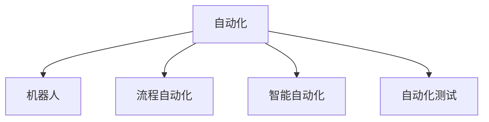

                 

# AI2.0时代：自动化的崭新开始

## 1. 背景介绍

### 1.1 问题由来

进入21世纪以来，人工智能(AI)技术蓬勃发展，不断催生出新的突破和应用。从AlphaGo的胜利到GAN的兴起，AI正不断改变我们的世界。然而，实现AI的普及应用仍面临诸多挑战，尤其是AI系统的可解释性、透明度、可靠性等问题。

AI2.0时代的到来，正是为了解决这些问题而提出的新阶段。AI2.0通过自动化、可解释化、透明化、安全化等手段，推动AI技术的普及和应用。自动化在其中扮演了至关重要的角色，通过自动化，让AI技术变得更加高效、可靠、可控，从而更好地服务于社会。

### 1.2 问题核心关键点

自动化是AI2.0时代的一个重要特征。它不仅可以提高工作效率，还可以减少人为错误，提升决策的准确性。本节将探讨如何实现AI自动化的不同层次，并讨论这些自动化技术的应用。

## 2. 核心概念与联系

### 2.1 核心概念概述

为了更好地理解AI2.0时代自动化技术，本节将介绍几个核心概念：

- 自动化(Automation)：指通过技术手段，自动完成重复性、规则性任务的过程。自动化技术可以帮助人类从繁琐的手工操作中解脱出来，专注于更有价值的工作。

- 机器人(Robotics)：指由计算机控制的机械装置，可以进行复杂的操作和决策。机器人是自动化的一个重要应用领域，能够执行危险、高精度的任务。

- 流程自动化(Process Automation)：指通过软件和硬件手段，自动化企业的业务流程，提高生产效率，降低成本。

- 智能自动化(Intelligent Automation)：指利用AI技术实现更为复杂、智能化的自动化。智能自动化结合了机器学习和自然语言处理等技术，能够处理非结构化数据，进行更为复杂的决策。

- 自动化测试(Automated Testing)：指使用自动化工具进行软件测试，提高测试效率，保证软件质量。

这些核心概念之间的逻辑关系可以通过以下Mermaid流程图来展示：



### 2.2 核心概念原理和架构的 Mermaid 流程图

下面展示自动化流程的 Mermaid 流程图，该图展示了自动化从简单到复杂的各个层次：

```mermaid
graph TB
    A[简单任务自动化] --> B[复杂的自动化工作流程]
    A --> C[高度定制化的自动化解决方案]
    A --> D[跨领域自动化技术]
    B --> E[业务流程再造(BPR)]
    C --> F[AI驱动的自动化]
    D --> G[机器人流程自动化(RPA)]
    F --> H[深度学习自动化]
```

## 3. 核心算法原理 & 具体操作步骤

### 3.1 算法原理概述

实现自动化有两种主要方法：基于规则的自动化和基于模型的自动化。

基于规则的自动化（Rule-based Automation）依赖于明确的规则集，这些规则可以编程实现。例如，自动化测试中的脚本编写就是基于规则的自动化。其原理是通过编程实现一系列步骤，按照预定义的规则执行任务。

基于模型的自动化（Model-based Automation）依赖于机器学习和人工智能技术，能够处理更加复杂、非结构化的数据。例如，智能推荐系统的个性化推荐就是基于模型的自动化。其原理是通过训练模型，学习用户行为和偏好，然后根据模型预测结果，自动化地生成推荐结果。

### 3.2 算法步骤详解

下面以基于模型的自动化为例，详细介绍其实现步骤：

1. **数据准备**：
   收集相关数据，进行数据清洗、特征提取等预处理。这一步是模型训练的基础。

2. **模型训练**：
   选择合适的机器学习或深度学习算法，使用训练集数据进行模型训练。这一步是自动化的核心，训练出的模型将成为自动化的决策依据。

3. **模型部署**：
   将训练好的模型部署到实际应用场景中，可以是单个应用，也可以是大规模的云平台。这一步是自动化的实现环节。

4. **结果评估**：
   对模型输出的结果进行评估，通过监测指标判断自动化效果是否达到预期。这一步是自动化的优化环节。

5. **持续改进**：
   根据评估结果，对模型进行优化，不断迭代改进，提升自动化效果。

### 3.3 算法优缺点

基于模型的自动化具有以下优点：

- 能够处理更加复杂的数据，如文本、图像、视频等非结构化数据。
- 能够进行更加智能化的决策，提高工作效率。
- 可以通过不断学习和优化，逐步提高自动化效果。

但是，基于模型的自动化也存在一些缺点：

- 需要大量标注数据，数据准备成本较高。
- 模型的训练和优化过程较复杂，需要专业知识。
- 模型可能存在过度拟合等问题，需要谨慎使用。

### 3.4 算法应用领域

基于模型的自动化在多个领域都有广泛应用：

- 金融领域：智能推荐系统、风险控制、自动交易等。
- 医疗领域：诊断系统、个性化治疗、医疗影像分析等。
- 制造业：质量检测、生产调度、智能仓储等。
- 物流领域：路径规划、配送调度、智能客服等。
- 零售领域：库存管理、销售预测、客户服务自动化等。

## 4. 数学模型和公式 & 详细讲解

### 4.1 数学模型构建

基于模型的自动化通常使用监督学习或无监督学习算法进行建模。以监督学习为例，其数学模型为：

$$
\hat{y} = f(x; \theta)
$$

其中 $x$ 为输入特征，$\hat{y}$ 为模型预测输出，$f$ 为模型函数，$\theta$ 为模型参数。

### 4.2 公式推导过程

以线性回归模型为例，其公式推导如下：

$$
\min_{\theta} \frac{1}{2m} \sum_{i=1}^m (\hat{y}_i - y_i)^2
$$

其中 $m$ 为训练样本数量，$y_i$ 为实际标签，$\hat{y}_i$ 为模型预测标签。通过求解上述最小二乘问题，即可得到最优模型参数 $\theta$。

### 4.3 案例分析与讲解

以机器学习在金融领域的应用为例，详细讲解模型的构建和优化过程。

首先，收集金融交易数据，进行特征提取，得到特征向量 $x$ 和标签向量 $y$。然后，使用线性回归模型对数据进行训练，得到最优参数 $\theta$。最后，将模型部署到交易系统中，实时进行股票买卖决策。

## 5. 项目实践：代码实例和详细解释说明

### 5.1 开发环境搭建

在进行自动化实践前，需要先搭建好开发环境。以下是在Python环境下搭建开发环境的详细步骤：

1. 安装Python：从官网下载并安装Python，建议安装最新版本。

2. 安装PyTorch：作为深度学习框架，PyTorch提供了丰富的自动学习功能，建议使用PyTorch进行模型训练和测试。

3. 安装TensorBoard：TensorBoard是TensorFlow的可视化工具，可以实时监测模型训练状态，并提供丰富的图表呈现方式。

4. 安装Flask：Flask是Python的Web框架，用于搭建Web应用，方便自动化模型部署。

### 5.2 源代码详细实现

以下是一个基于深度学习的自动化股票推荐系统的代码实现：

```python
import torch
import torch.nn as nn
import torch.optim as optim
from torch.utils.data import DataLoader
from sklearn.preprocessing import StandardScaler
from sklearn.model_selection import train_test_split
from sklearn.metrics import mean_squared_error

# 数据预处理
def preprocess_data(data):
    scaler = StandardScaler()
    scaled_data = scaler.fit_transform(data)
    return scaled_data

# 模型定义
class AutoMLModel(nn.Module):
    def __init__(self, input_size, hidden_size, output_size):
        super(AutoMLModel, self).__init__()
        self.fc1 = nn.Linear(input_size, hidden_size)
        self.fc2 = nn.Linear(hidden_size, output_size)

    def forward(self, x):
        x = torch.relu(self.fc1(x))
        x = self.fc2(x)
        return x

# 模型训练
def train_model(model, data_loader, epochs, learning_rate):
    optimizer = optim.Adam(model.parameters(), lr=learning_rate)
    loss_fn = nn.MSELoss()
    for epoch in range(epochs):
        for inputs, targets in data_loader:
            optimizer.zero_grad()
            outputs = model(inputs)
            loss = loss_fn(outputs, targets)
            loss.backward()
            optimizer.step()
        print(f"Epoch {epoch+1}, Loss: {loss.item()}")

# 模型评估
def evaluate_model(model, data_loader):
    with torch.no_grad():
        mae = 0
        for inputs, targets in data_loader:
            outputs = model(inputs)
            mae += mean_squared_error(outputs, targets)
        print(f"Mean Squared Error: {mae}")

# 数据加载
data = ...  # 读取数据
X, y = preprocess_data(data)[:, :-1], preprocess_data(data)[:, -1]
X_train, X_test, y_train, y_test = train_test_split(X, y, test_size=0.2)

# 模型训练和评估
model = AutoMLModel(input_size=X_train.shape[1], hidden_size=64, output_size=1)
train_model(model, DataLoader(torch.tensor(X_train), torch.tensor(y_train)), epochs=100, learning_rate=0.01)
evaluate_model(model, DataLoader(torch.tensor(X_test), torch.tensor(y_test)))
```

### 5.3 代码解读与分析

该代码实现了基于线性回归模型的自动化股票推荐系统，其逻辑步骤如下：

1. 数据预处理：使用sklearn库对数据进行标准化处理，以便后续训练。

2. 模型定义：使用PyTorch定义一个简单的线性回归模型。

3. 模型训练：使用Adam优化器进行模型训练，最小化均方误差损失。

4. 模型评估：使用测试集数据评估模型性能，输出均方误差。

## 6. 实际应用场景

### 6.1 智能制造

智能制造是制造业的未来方向，通过自动化技术，可以实现生产线的自动化控制，提高生产效率和产品质量。例如，智能仓储系统可以自动进行货物分拣、搬运和存储，智能工厂可以实现生产过程的自动化监控和优化。

### 6.2 智能交通

智能交通通过自动化技术实现交通管理系统的智能化，可以大幅提升交通效率，减少事故率。例如，智能交通信号灯可以根据实时交通情况动态调整，智能汽车可以通过自动驾驶技术实现无人驾驶。

### 6.3 智能医疗

智能医疗通过自动化技术实现医疗设备的智能化管理，可以提高医疗服务效率，降低误诊率。例如，智能医疗影像系统可以自动识别和标注医学影像，智能诊断系统可以根据历史数据自动生成诊断报告。

### 6.4 未来应用展望

随着自动化技术的不断进步，未来AI2.0时代的自动化将更加智能化、普适化。

1. 自动化将更加普及：自动化技术将被应用到更多的行业和场景中，实现全行业的自动化普及。

2. 自动化将更加智能：基于AI技术，自动化系统将具备更高的智能性，能够处理更加复杂和多样化的问题。

3. 自动化将更加普适：自动化系统将变得更加易于部署和维护，用户无需具备专业的技术知识，即可实现自动化应用。

4. 自动化将更加可控：自动化系统将具备更高的可控性，用户可以通过简单的界面进行配置和管理。

5. 自动化将更加安全：自动化系统将具备更高的安全性，通过多层次的安全防护，确保系统的稳定性和可靠性。

## 7. 工具和资源推荐

### 7.1 学习资源推荐

为了帮助开发者掌握自动化技术，以下推荐一些优质的学习资源：

1. 《Python深度学习》：深度学习领域的经典书籍，涵盖PyTorch等深度学习框架的详细介绍和代码实现。

2. 《TensorFlow实战》：TensorFlow官方文档，提供丰富的示例和案例，帮助开发者理解TensorFlow的使用。

3. 《机器学习实战》：基于scikit-learn等机器学习库的实战项目，适合初学者上手实践。

4. 《Flask Web开发》：Flask框架的使用指南，涵盖Web开发的各种知识点。

5. TensorBoard官方文档：TensorFlow的可视化工具，适合学习如何搭建和监测深度学习模型。

### 7.2 开发工具推荐

以下是几款常用的自动化开发工具：

1. PyTorch：深度学习框架，提供了丰富的自动学习功能，适合深度学习模型的训练和测试。

2. TensorFlow：深度学习框架，适合大规模分布式深度学习应用。

3. TensorBoard：TensorFlow的可视化工具，可以实时监测模型训练状态。

4. Flask：Python的Web框架，适合搭建自动化Web应用。

5. AutoML库：提供了自动学习和模型优化功能，帮助开发者快速实现自动化模型。

### 7.3 相关论文推荐

自动化技术的发展离不开学界的持续研究。以下是几篇重要的相关论文，推荐阅读：

1. 《深度学习在自然语言处理中的应用》：详细介绍了深度学习在自然语言处理领域的应用，包括机器翻译、情感分析、文本分类等。

2. 《自动化机器学习：一种新的机器学习方法》：介绍了自动化机器学习（AutoML）的概念和实现方法，展示了AutoML在实际应用中的效果。

3. 《自动化系统安全与隐私保护》：探讨了自动化系统安全性和隐私保护问题，提出了相应的解决方案。

## 8. 总结：未来发展趋势与挑战

### 8.1 研究成果总结

AI2.0时代的自动化技术取得了显著的进展，但仍面临一些挑战。

1. 数据准备和模型训练成本较高：自动化系统需要大量的标注数据和计算资源，如何降低这些成本是未来的一个重要研究方向。

2. 模型性能和可靠性问题：自动化系统的性能和可靠性仍需进一步提升，如何提高模型的准确性和鲁棒性是未来的一个重要方向。

3. 自动化系统的可解释性和透明性：自动化系统需要具备更高的可解释性和透明性，以便用户理解和信任自动化系统的决策。

### 8.2 未来发展趋势

未来，自动化技术将更加普及和智能化，其发展趋势如下：

1. 自动化将更加普适化：自动化技术将变得更加易于部署和维护，用户无需具备专业的技术知识，即可实现自动化应用。

2. 自动化将更加智能化：基于AI技术，自动化系统将具备更高的智能性，能够处理更加复杂和多样化的问题。

3. 自动化将更加安全化：自动化系统将具备更高的安全性，通过多层次的安全防护，确保系统的稳定性和可靠性。

4. 自动化将更加可控化：自动化系统将具备更高的可控性，用户可以通过简单的界面进行配置和管理。

### 8.3 面临的挑战

尽管自动化技术取得了显著进展，但在其普及和应用过程中仍面临一些挑战：

1. 数据准备和模型训练成本较高：自动化系统需要大量的标注数据和计算资源，如何降低这些成本是未来的一个重要研究方向。

2. 模型性能和可靠性问题：自动化系统的性能和可靠性仍需进一步提升，如何提高模型的准确性和鲁棒性是未来的一个重要方向。

3. 自动化系统的可解释性和透明性：自动化系统需要具备更高的可解释性和透明性，以便用户理解和信任自动化系统的决策。

### 8.4 研究展望

面对自动化技术所面临的挑战，未来的研究需要在以下几个方面寻求新的突破：

1. 探索更高效的数据预处理方法：通过数据压缩、特征选择等技术，降低数据准备和模型训练的成本。

2. 开发更高效、更稳健的算法模型：通过优化算法模型，提高模型的准确性和鲁棒性。

3. 提升自动化系统的可解释性和透明性：通过可视化技术，提升自动化系统的可解释性和透明性，增加用户对自动化系统的信任。

## 9. 附录：常见问题与解答

### Q1：自动化系统如何保证数据安全？

A：自动化系统需要具备高度的安全性，通过加密传输、访问控制等措施，确保数据安全。同时，定期进行数据备份，以防止数据丢失或损坏。

### Q2：自动化系统如何进行模型部署？

A：自动化系统的模型部署通常使用Web服务或移动应用，通过API接口实现数据交互。部署过程中需要进行服务化封装、负载均衡等操作，以确保系统的稳定性和可靠性。

### Q3：自动化系统如何进行持续优化？

A：自动化系统需要定期进行模型更新和优化，以适应数据分布的变化和业务需求的变化。可以通过A/B测试、灰度发布等方法，逐步优化系统。

### Q4：自动化系统如何进行测试和评估？

A：自动化系统的测试和评估通常包括单元测试、集成测试、性能测试等。测试过程中需要模拟不同的数据和场景，评估系统的稳定性和可靠性。

### Q5：自动化系统如何进行监控和告警？

A：自动化系统需要具备实时监控和告警功能，通过监测指标，判断系统的运行状态。当系统出现异常时，及时进行告警，保障系统的稳定性和可靠性。

---

作者：禅与计算机程序设计艺术 / Zen and the Art of Computer Programming

