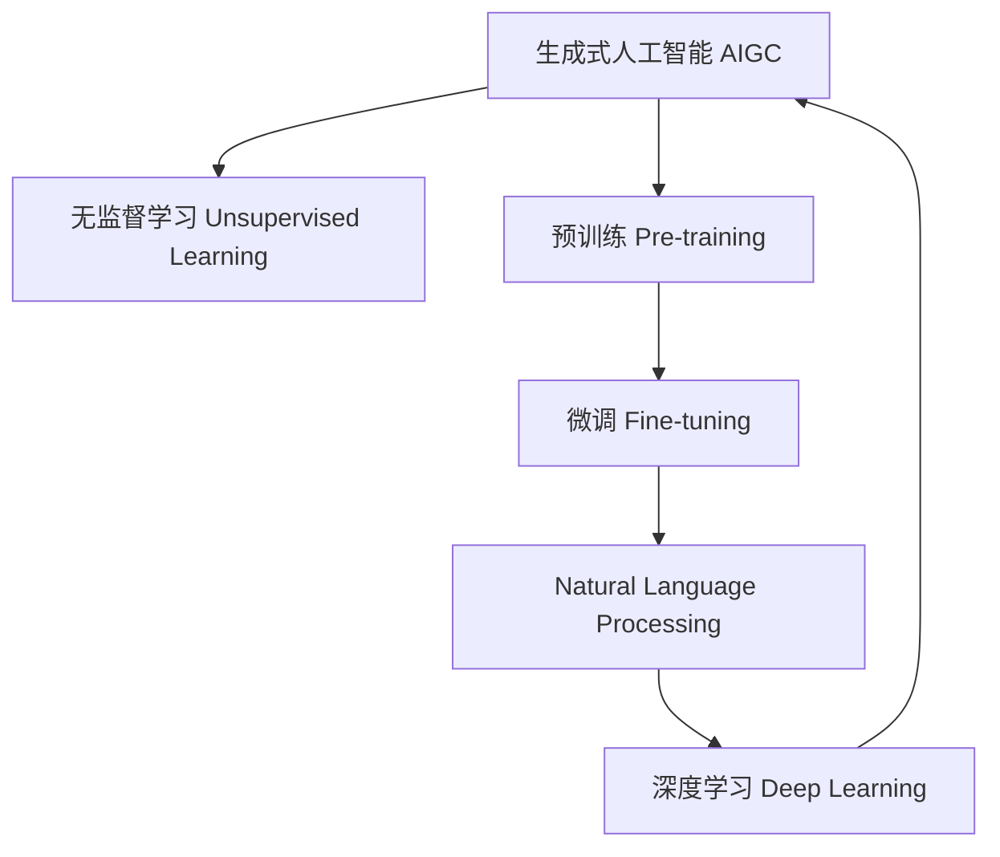

                 

## 1. 背景介绍

人工智能（AI）正在以前所未有的速度渗透到各行各业，这其中，生成式人工智能（Generative AI，简称AIGC）以其强大的创造力和应用潜力，成为新一代AI技术的热点。从文本生成到图像制作，从音乐创作到视频编辑，AIGC正推动各行各业进入创造性时代。

### 1.1 问题由来
在数字化浪潮的推动下，企业IT系统已从以数据为中心转向以内容为中心。无论是电商、金融、医疗、教育等传统行业，还是文娱、游戏、社交等新兴领域，数据和内容的生产、处理、传播等各个环节都正发生着根本性变革。然而，当前内容生产的瓶颈问题仍然明显：

- 数据驱动的决策和推荐系统，依赖海量标注数据，且成本高昂。
- 传统的内容创作依赖大量专业人才，耗时长、效率低。
- 行业内高质量内容供给不足，限制了数字化转型的速度。

AIGC技术通过大规模无监督学习和预训练，大大提升了内容生产的效率和质量。只需少量标注数据或零样本输入，AIGC即可生成高质量的内容，满足了数字化转型中“以内容为王”的需求，将AI从“帮人干活”转变为“代替人干活”，释放出人类的创造潜能，使人们能够从事更多有价值的工作。

### 1.2 问题核心关键点
AIGC的核心在于生成模型，通过大量无监督数据训练生成的隐式知识，能够指导模型在特定任务上进行生成。与传统的监督学习不同，AIGC的学习方式更倾向于自监督、自适应的方式。

AIGC模型主要包括三类：

1. **基于语言模型的文本生成**：如GPT-3等。通过自回归或自编码等方式，学习文本中的语言规律，生成高质量的自然语言文本。
2. **基于神经网络的结构生成**：如Neural Style Transfer等。通过生成对抗网络（GAN）、变分自编码器（VAE）等方法，生成图像、音乐等结构化内容。
3. **基于序列建模的视频生成**：如AlphaStar等。通过强化学习、序列建模等技术，生成游戏角色动作、剧情推进等内容。

这些模型各有特点，但共同目标是通过学习训练数据，掌握数据的隐含规律，并在此基础上生成新内容。这使得AIGC模型在内容生产效率、质量、创意性等方面，均优于传统的内容生成方法。

## 2. 核心概念与联系

### 2.1 核心概念概述

为更好地理解AIGC的应用，本节将介绍几个关键概念及其之间的联系：

- **生成式人工智能（AIGC）**：指通过机器学习模型生成新的文本、图像、视频等内容的技术。包括文本生成、图像生成、音频生成、视频生成等多种形式。
- **无监督学习（Unsupervised Learning）**：指在无标注数据上进行训练，模型自主学习数据中的隐含规律，提升模型泛化能力。
- **预训练（Pre-training）**：指在大规模无标注数据上预训练生成模型，学习到数据的统计规律，作为后续微调的基础。
- **微调（Fine-tuning）**：指在预训练的基础上，使用少量标注数据进行微调，使得模型在特定任务上表现更好。
- **自然语言处理（NLP）**：指处理和理解人类语言的技术，包括语言模型、文本分类、机器翻译、文本生成等。
- **深度学习（Deep Learning）**：指利用神经网络等深度模型进行复杂数据表示、模式识别、决策制定等任务的技术。

这些概念之间的联系可以通过以下Mermaid流程图来展示：



这个流程图展示了大语言模型从无监督学习到微调再到应用的逻辑关系：

1. 通过无监督学习，AIGC模型学习到大规模数据中的隐含规律，并进行预训练。
2. 在预训练的基础上，通过微调使模型适应特定任务，生成高质量的内容。
3. 生成的内容通过NLP技术进行处理、分析和优化。
4. 深度学习提供强大的模型和算法支持，进一步提升生成质量。
5. AIGC技术可以应用到各种领域，实现自动化、智能化内容生产。

## 3. 核心算法原理 & 具体操作步骤
### 3.1 算法原理概述

AIGC的核心在于生成模型，通过无监督学习预训练，并在此基础上进行微调，学习生成特定任务的内容。以文本生成为例，AIGC模型通过预训练学习语言的统计规律，然后微调学习文本生成任务的具体特征，最终生成高质量的文本。

形式化地，假设预训练模型为 $G_{\theta}$，其中 $\theta$ 为预训练得到的模型参数。给定文本生成任务 $T$ 的少量标注数据集 $D=\{(x_i,y_i)\}_{i=1}^N$，微调的目标是找到新的模型参数 $\hat{\theta}$，使得：

$$
\hat{\theta}=\mathop{\arg\min}_{\theta} \mathcal{L}(G_{\theta},D)
$$

其中 $\mathcal{L}$ 为针对任务 $T$ 设计的损失函数，用于衡量模型生成输出与真实标签之间的差异。常见的损失函数包括交叉熵损失、均方误差损失等。

通过梯度下降等优化算法，微调过程不断更新模型参数 $\theta$，最小化损失函数 $\mathcal{L}$，使得模型生成逼近真实标签。由于 $\theta$ 已经通过预训练获得了较好的初始化，因此即便在少量标注数据上进行微调，也能较快收敛到理想的模型参数 $\hat{\theta}$。

### 3.2 算法步骤详解

AIGC模型的微调一般包括以下几个关键步骤：

**Step 1: 准备预训练模型和数据集**
- 选择合适的预训练生成模型 $G_{\theta}$ 作为初始化参数，如 GPT-3、DALL-E 等。
- 准备文本生成任务 $T$ 的少量标注数据集 $D$，划分为训练集、验证集和测试集。一般要求标注数据与预训练数据的分布不要差异过大。

**Step 2: 添加任务适配层**
- 根据任务类型，在预训练模型顶层设计合适的输出层和损失函数。
- 对于文本生成任务，通常在顶层添加解码器输出概率分布，并以交叉熵损失函数为损失函数。

**Step 3: 设置微调超参数**
- 选择合适的优化算法及其参数，如 AdamW、SGD 等，设置学习率、批大小、迭代轮数等。
- 设置正则化技术及强度，包括权重衰减、Dropout、Early Stopping 等。
- 确定冻结预训练参数的策略，如仅微调顶层，或全部参数都参与微调。

**Step 4: 执行梯度训练**
- 将训练集数据分批次输入模型，前向传播计算损失函数。
- 反向传播计算参数梯度，根据设定的优化算法和学习率更新模型参数。
- 周期性在验证集上评估模型性能，根据性能指标决定是否触发 Early Stopping。
- 重复上述步骤直到满足预设的迭代轮数或 Early Stopping 条件。

**Step 5: 测试和部署**
- 在测试集上评估微调后模型 $G_{\hat{\theta}}$ 的性能，对比微调前后的生成质量提升。
- 使用微调后的模型对新文本进行生成，集成到实际的应用系统中。
- 持续收集新的文本数据，定期重新微调模型，以适应数据分布的变化。

以上是基于生成式微调的基本流程。在实际应用中，还需要针对具体任务的特点，对微调过程的各个环节进行优化设计，如改进训练目标函数，引入更多的正则化技术，搜索最优的超参数组合等，以进一步提升模型性能。

### 3.3 算法优缺点

AIGC模型的微调方法具有以下优点：
1. 高效生成。只需少量标注数据，即可生成高质量的内容，大幅提升内容生产效率。
2. 适应性强。能根据不同任务需求，灵活调整模型输出，适应各种内容生产场景。
3. 成本低廉。相较于传统内容生产方式，微调方法能大幅度降低人力和时间的投入。
4. 可扩展性高。支持各种形式的内容生成，如文本、图像、音频、视频等，适用范围广泛。

同时，该方法也存在一定的局限性：
1. 依赖预训练数据。AIGC模型的性能很大程度上取决于预训练数据的质量和量级。
2. 泛化能力有限。当目标任务与预训练数据的分布差异较大时，微调的性能提升有限。
3. 可解释性不足。AIGC模型的决策过程通常缺乏可解释性，难以对其生成逻辑进行分析和调试。
4. 风险不可控。AIGC模型可能生成有害、偏见性的内容，带来伦理和安全问题。

尽管存在这些局限性，但就目前而言，基于生成式微调的方法已成为内容生成的主流范式。未来相关研究的重点在于如何进一步降低微调对标注数据的依赖，提高模型的泛化能力，同时兼顾可解释性和伦理安全性等因素。

### 3.4 算法应用领域

AIGC模型的微调方法已经在文本生成、图像生成、音乐创作、视频编辑等多个领域得到了广泛应用，成为内容生产的重要手段。

- **文本生成**：自动生成新闻报道、技术文档、小说、诗歌等文本内容。通过微调模型，能够快速生成高质量的文章，减轻人工撰写压力。
- **图像生成**：自动生成艺术作品、插图、广告设计、游戏角色等图像内容。通过微调，能够生成符合需求的高质量图像，加速设计过程。
- **音乐创作**：自动生成歌曲、配乐、音效等音乐内容。通过微调，能够快速创作出有创意的音乐作品，提升内容创意性。
- **视频编辑**：自动生成短片、广告、宣传片等视频内容。通过微调，能够高效生成视频素材，提升制作效率。

此外，AIGC模型还在影视剧剧本创作、虚拟现实内容制作、虚拟主播、虚拟偶像等创新应用中展现了强大的应用潜力。

## 4. 数学模型和公式 & 详细讲解
### 4.1 数学模型构建

本节将使用数学语言对AIGC模型的微调过程进行更加严格的刻画。

记预训练生成模型为 $G_{\theta}$，其中 $\theta$ 为预训练得到的模型参数。假设微调任务的训练集为 $D=\{(x_i,y_i)\}_{i=1}^N, x_i \in \mathcal{X}, y_i \in \mathcal{Y}$。

定义模型 $G_{\theta}$ 在数据样本 $(x,y)$ 上的损失函数为 $\ell(G_{\theta}(x),y)$，则在数据集 $D$ 上的经验风险为：

$$
\mathcal{L}(\theta) = \frac{1}{N} \sum_{i=1}^N \ell(G_{\theta}(x_i),y_i)
$$

微调的优化目标是最小化经验风险，即找到最优参数：

$$
\theta^* = \mathop{\arg\min}_{\theta} \mathcal{L}(\theta)
$$

在实践中，我们通常使用基于梯度的优化算法（如SGD、Adam等）来近似求解上述最优化问题。设 $\eta$ 为学习率，$\lambda$ 为正则化系数，则参数的更新公式为：

$$
\theta \leftarrow \theta - \eta \nabla_{\theta}\mathcal{L}(\theta) - \eta\lambda\theta
$$

其中 $\nabla_{\theta}\mathcal{L}(\theta)$ 为损失函数对参数 $\theta$ 的梯度，可通过反向传播算法高效计算。

### 4.2 公式推导过程

以下我们以文本生成任务为例，推导交叉熵损失函数及其梯度的计算公式。

假设模型 $G_{\theta}$ 在输入 $x$ 上的生成结果为 $y=G_{\theta}(x) \in [0,1]$，表示样本属于某一类别的概率。真实标签 $y \in \{0,1\}$。则二分类交叉熵损失函数定义为：

$$
\ell(G_{\theta}(x),y) = -[y\log G_{\theta}(x)+(1-y)\log (1-G_{\theta}(x))]
$$

将其代入经验风险公式，得：

$$
\mathcal{L}(\theta) = -\frac{1}{N}\sum_{i=1}^N [y_i\log G_{\theta}(x_i)+(1-y_i)\log(1-G_{\theta}(x_i))]
$$

根据链式法则，损失函数对参数 $\theta_k$ 的梯度为：

$$
\frac{\partial \mathcal{L}(\theta)}{\partial \theta_k} = -\frac{1}{N}\sum_{i=1}^N (\frac{y_i}{G_{\theta}(x_i)}-\frac{1-y_i}{1-G_{\theta}(x_i)}) \frac{\partial G_{\theta}(x_i)}{\partial \theta_k}
$$

其中 $\frac{\partial G_{\theta}(x_i)}{\partial \theta_k}$ 可进一步递归展开，利用自动微分技术完成计算。

在得到损失函数的梯度后，即可带入参数更新公式，完成模型的迭代优化。重复上述过程直至收敛，最终得到适应下游任务的最优模型参数 $\theta^*$。

## 5. 项目实践：代码实例和详细解释说明
### 5.1 开发环境搭建

在进行AIGC模型微调实践前，我们需要准备好开发环境。以下是使用Python进行PyTorch开发的环境配置流程：

1. 安装Anaconda：从官网下载并安装Anaconda，用于创建独立的Python环境。

2. 创建并激活虚拟环境：
```bash
conda create -n pytorch-env python=3.8 
conda activate pytorch-env
```

3. 安装PyTorch：根据CUDA版本，从官网获取对应的安装命令。例如：
```bash
conda install pytorch torchvision torchaudio cudatoolkit=11.1 -c pytorch -c conda-forge
```

4. 安装Transformers库：
```bash
pip install transformers
```

5. 安装各类工具包：
```bash
pip install numpy pandas scikit-learn matplotlib tqdm jupyter notebook ipython
```

完成上述步骤后，即可在`pytorch-env`环境中开始AIGC模型微调实践。

### 5.2 源代码详细实现

下面我们以文本生成任务为例，给出使用Transformers库对GPT-3模型进行微调的PyTorch代码实现。

首先，定义文本生成任务的数据处理函数：

```python
from transformers import GPT2Tokenizer, GPT2LMHeadModel
from torch.utils.data import Dataset
import torch

class TextDataset(Dataset):
    def __init__(self, texts, tokenizer, max_len=512):
        self.texts = texts
        self.tokenizer = tokenizer
        self.max_len = max_len
        
    def __len__(self):
        return len(self.texts)
    
    def __getitem__(self, item):
        text = self.texts[item]
        
        encoding = self.tokenizer(text, return_tensors='pt', max_length=self.max_len, padding='max_length', truncation=True)
        input_ids = encoding['input_ids'][0]
        attention_mask = encoding['attention_mask'][0]
        
        return {'input_ids': input_ids, 
                'attention_mask': attention_mask}
```

然后，定义模型和优化器：

```python
from transformers import AdamW

model = GPT2LMHeadModel.from_pretrained('gpt2')
tokenizer = GPT2Tokenizer.from_pretrained('gpt2')

optimizer = AdamW(model.parameters(), lr=2e-5)
```

接着，定义训练和评估函数：

```python
from torch.utils.data import DataLoader
from tqdm import tqdm

device = torch.device('cuda') if torch.cuda.is_available() else torch.device('cpu')
model.to(device)

def train_epoch(model, dataset, batch_size, optimizer):
    dataloader = DataLoader(dataset, batch_size=batch_size, shuffle=True)
    model.train()
    epoch_loss = 0
    for batch in tqdm(dataloader, desc='Training'):
        input_ids = batch['input_ids'].to(device)
        attention_mask = batch['attention_mask'].to(device)
        model.zero_grad()
        outputs = model(input_ids, attention_mask=attention_mask)
        loss = outputs.loss
        epoch_loss += loss.item()
        loss.backward()
        optimizer.step()
    return epoch_loss / len(dataloader)

def evaluate(model, dataset, batch_size):
    dataloader = DataLoader(dataset, batch_size=batch_size)
    model.eval()
    preds, labels = [], []
    with torch.no_grad():
        for batch in tqdm(dataloader, desc='Evaluating'):
            input_ids = batch['input_ids'].to(device)
            attention_mask = batch['attention_mask'].to(device)
            batch_labels = None
            outputs = model(input_ids, attention_mask=attention_mask)
            batch_preds = outputs.logits.argmax(dim=2).to('cpu').tolist()
            for pred_tokens in batch_preds:
                preds.append(pred_tokens[:len(batch_labels)])
                if batch_labels is not None:
                    labels.append(batch_labels[:len(pred_tokens)])
                
    return preds, labels
```

最后，启动训练流程并在测试集上评估：

```python
epochs = 5
batch_size = 16

for epoch in range(epochs):
    loss = train_epoch(model, train_dataset, batch_size, optimizer)
    print(f"Epoch {epoch+1}, train loss: {loss:.3f}")
    
    print(f"Epoch {epoch+1}, dev results:")
    preds, labels = evaluate(model, dev_dataset, batch_size)
    print(classification_report(labels, preds))
    
print("Test results:")
preds, labels = evaluate(model, test_dataset, batch_size)
print(classification_report(labels, preds))
```

以上就是使用PyTorch对GPT-3进行文本生成任务微调的完整代码实现。可以看到，得益于Transformers库的强大封装，我们可以用相对简洁的代码完成GPT-3模型的加载和微调。

### 5.3 代码解读与分析

让我们再详细解读一下关键代码的实现细节：

**TextDataset类**：
- `__init__`方法：初始化文本、分词器等关键组件。
- `__len__`方法：返回数据集的样本数量。
- `__getitem__`方法：对单个样本进行处理，将文本输入编码为token ids，用于模型输入。

**损失函数**：
- 使用交叉熵损失函数计算模型生成的文本与真实标签之间的差异。

**训练和评估函数**：
- 使用PyTorch的DataLoader对数据集进行批次化加载，供模型训练和推理使用。
- 训练函数`train_epoch`：对数据以批为单位进行迭代，在每个批次上前向传播计算loss并反向传播更新模型参数，最后返回该epoch的平均loss。
- 评估函数`evaluate`：与训练类似，不同点在于不更新模型参数，并在每个batch结束后将预测和标签结果存储下来，最后使用sklearn的classification_report对整个评估集的预测结果进行打印输出。

**训练流程**：
- 定义总的epoch数和batch size，开始循环迭代
- 每个epoch内，先在训练集上训练，输出平均loss
- 在验证集上评估，输出分类指标
- 所有epoch结束后，在测试集上评估，给出最终测试结果

可以看到，PyTorch配合Transformers库使得GPT-3微调的代码实现变得简洁高效。开发者可以将更多精力放在数据处理、模型改进等高层逻辑上，而不必过多关注底层的实现细节。

当然，工业级的系统实现还需考虑更多因素，如模型的保存和部署、超参数的自动搜索、更灵活的任务适配层等。但核心的微调范式基本与此类似。

## 6. 实际应用场景
### 6.1 智能客服系统

基于AIGC技术的对话系统，可以广泛应用于智能客服系统的构建。传统客服往往需要配备大量人力，高峰期响应缓慢，且一致性和专业性难以保证。而使用AIGC对话模型，可以7x24小时不间断服务，快速响应客户咨询，用自然流畅的语言解答各类常见问题。

在技术实现上，可以收集企业内部的历史客服对话记录，将问题和最佳答复构建成监督数据，在此基础上对预训练对话模型进行微调。微调后的对话模型能够自动理解用户意图，匹配最合适的答案模板进行回复。对于客户提出的新问题，还可以接入检索系统实时搜索相关内容，动态组织生成回答。如此构建的智能客服系统，能大幅提升客户咨询体验和问题解决效率。

### 6.2 金融舆情监测

金融机构需要实时监测市场舆论动向，以便及时应对负面信息传播，规避金融风险。传统的人工监测方式成本高、效率低，难以应对网络时代海量信息爆发的挑战。基于AIGC文本生成技术，金融舆情监测可以得到新的解决方案。

具体而言，可以收集金融领域相关的新闻、报道、评论等文本数据，并对其进行主题标注和情感标注。在此基础上对预训练语言模型进行微调，使其能够自动判断文本属于何种主题，情感倾向是正面、中性还是负面。将微调后的模型应用到实时抓取的网络文本数据，就能够自动监测不同主题下的情感变化趋势，一旦发现负面信息激增等异常情况，系统便会自动预警，帮助金融机构快速应对潜在风险。

### 6.3 个性化推荐系统

当前的推荐系统往往只依赖用户的历史行为数据进行物品推荐，无法深入理解用户的真实兴趣偏好。基于AIGC技术，个性化推荐系统可以更好地挖掘用户行为背后的语义信息，从而提供更精准、多样的推荐内容。

在实践中，可以收集用户浏览、点击、评论、分享等行为数据，提取和用户交互的物品标题、描述、标签等文本内容。将文本内容作为模型输入，用户的后续行为（如是否点击、购买等）作为监督信号，在此基础上微调预训练语言模型。微调后的模型能够从文本内容中准确把握用户的兴趣点。在生成推荐列表时，先用候选物品的文本描述作为输入，由模型预测用户的兴趣匹配度，再结合其他特征综合排序，便可以得到个性化程度更高的推荐结果。

### 6.4 未来应用展望

随着AIGC技术的发展，其在更多领域的落地应用前景广阔。未来，基于AIGC技术的内容生成将进一步提升各行各业的数字化水平。

在智慧医疗领域，AIGC技术可以用于医疗问答、病历分析、医学影像识别等任务，提升医疗服务的智能化水平，辅助医生诊疗，加速新药研发进程。

在智能教育领域，AIGC技术可应用于作业批改、学情分析、知识推荐等方面，因材施教，促进教育公平，提高教学质量。

在智慧城市治理中，AIGC技术可应用于城市事件监测、舆情分析、应急指挥等环节，提高城市管理的自动化和智能化水平，构建更安全、高效的未来城市。

此外，在企业生产、社会治理、文娱传媒等众多领域，基于AIGC技术的AI应用也将不断涌现，为经济社会发展注入新的动力。相信随着技术的日益成熟，AIGC技术将成为各行各业智能化转型的重要引擎，深刻影响人类的生产生活方式。

## 7. 工具和资源推荐
### 7.1 学习资源推荐

为了帮助开发者系统掌握AIGC的理论基础和实践技巧，这里推荐一些优质的学习资源：

1. 《Transformers from Principles to Practice》系列博文：由大模型技术专家撰写，深入浅出地介绍了Transformer原理、预训练模型、微调技术等前沿话题。

2. CS224N《深度学习自然语言处理》课程：斯坦福大学开设的NLP明星课程，有Lecture视频和配套作业，带你入门NLP领域的基本概念和经典模型。

3. 《Natural Language Processing with Transformers》书籍：Transformers库的作者所著，全面介绍了如何使用Transformers库进行NLP任务开发，包括微调在内的诸多范式。

4. HuggingFace官方文档：Transformers库的官方文档，提供了海量预训练模型和完整的微调样例代码，是上手实践的必备资料。

5. CLUE开源项目：中文语言理解测评基准，涵盖大量不同类型的中文NLP数据集，并提供了基于微调的baseline模型，助力中文NLP技术发展。

通过对这些资源的学习实践，相信你一定能够快速掌握AIGC的精髓，并用于解决实际的NLP问题。
###  7.2 开发工具推荐

高效的开发离不开优秀的工具支持。以下是几款用于AIGC模型微调开发的常用工具：

1. PyTorch：基于Python的开源深度学习框架，灵活动态的计算图，适合快速迭代研究。大部分预训练语言模型都有PyTorch版本的实现。

2. TensorFlow：由Google主导开发的开源深度学习框架，生产部署方便，适合大规模工程应用。同样有丰富的预训练语言模型资源。

3. Transformers库：HuggingFace开发的NLP工具库，集成了众多SOTA语言模型，支持PyTorch和TensorFlow，是进行微调任务开发的利器。

4. Weights & Biases：模型训练的实验跟踪工具，可以记录和可视化模型训练过程中的各项指标，方便对比和调优。与主流深度学习框架无缝集成。

5. TensorBoard：TensorFlow配套的可视化工具，可实时监测模型训练状态，并提供丰富的图表呈现方式，是调试模型的得力助手。

6. Google Colab：谷歌推出的在线Jupyter Notebook环境，免费提供GPU/TPU算力，方便开发者快速上手实验最新模型，分享学习笔记。

合理利用这些工具，可以显著提升AIGC模型微调任务的开发效率，加快创新迭代的步伐。

### 7.3 相关论文推荐

AIGC技术的发展源于学界的持续研究。以下是几篇奠基性的相关论文，推荐阅读：

1. Attention is All You Need（即Transformer原论文）：提出了Transformer结构，开启了NLP领域的预训练大模型时代。

2. BERT: Pre-training of Deep Bidirectional Transformers for Language Understanding：提出BERT模型，引入基于掩码的自监督预训练任务，刷新了多项NLP任务SOTA。

3. Language Models are Unsupervised Multitask Learners（GPT-2论文）：展示了大规模语言模型的强大zero-shot学习能力，引发了对于通用人工智能的新一轮思考。

4. Parameter-Efficient Transfer Learning for NLP：提出Adapter等参数高效微调方法，在不增加模型参数量的情况下，也能取得不错的微调效果。

5. Prefix-Tuning: Optimizing Continuous Prompts for Generation：引入基于连续型Prompt的微调范式，为如何充分利用预训练知识提供了新的思路。

6. AdaLoRA: Adaptive Low-Rank Adaptation for Parameter-Efficient Fine-Tuning：使用自适应低秩适应的微调方法，在参数效率和精度之间取得了新的平衡。

这些论文代表了大语言模型微调技术的发展脉络。通过学习这些前沿成果，可以帮助研究者把握学科前进方向，激发更多的创新灵感。

## 8. 总结：未来发展趋势与挑战
### 8.1 总结

本文对基于生成式微调的大语言模型进行了全面系统的介绍。首先阐述了AIGC的兴起背景及其带来的职场新范式，明确了AIGC在提升内容生产效率、降低生产成本、增强内容创意性等方面的巨大价值。其次，从原理到实践，详细讲解了生成式微调的数学原理和关键步骤，给出了微调任务开发的完整代码实例。同时，本文还广泛探讨了AIGC技术在智能客服、金融舆情、个性化推荐等多个行业领域的应用前景，展示了AIGC技术的广阔潜力。此外，本文精选了AIGC技术的各类学习资源，力求为读者提供全方位的技术指引。

通过本文的系统梳理，可以看到，基于生成式微调的大语言模型正在成为内容生产的重要手段，极大地拓展了内容生产的效率和质量。得益于大规模语料的预训练，AIGC模型在生成文本、图像、音频、视频等多类内容上均展现出了强大的能力，为各行各业的内容生产带来了革命性变革。未来，伴随AIGC技术的持续演进，相信其将在更多领域发挥更大的作用，释放更多人类潜能，推动人类社会的数字化进程。

### 8.2 未来发展趋势

展望未来，AIGC技术将呈现以下几个发展趋势：

1. **模型规模持续增大**：随着算力成本的下降和数据规模的扩张，预训练语言模型的参数量还将持续增长。超大规模语言模型蕴含的丰富语言知识，有望支撑更加复杂多变的下游任务微调。

2. **生成能力增强**：未来AIGC模型将具备更强大的生成能力，不仅能在文本、图像、音频、视频等形式上表现出色，还能进行更加复杂的跨模态内容生成，如音乐生成、动画制作等。

3. **模型鲁棒性提升**：AIGC模型的鲁棒性将成为未来研究的重要方向。通过引入对抗训练、迁移学习等技术，提高模型在面对噪声、偏差数据时的鲁棒性和泛化能力。

4. **个性化和实时化**：AIGC模型将进一步向个性化和实时化方向发展，通过智能推荐系统、实时内容生成等技术，提供更符合用户需求的内容。

5. **多模态融合**：未来的AIGC模型将融合多模态数据，实现视觉、语音、文本等多种信息形式的协同生成和应用，增强内容的多样性和互动性。

6. **跨领域应用拓展**：AIGC技术将拓展到更多行业领域，如医疗、法律、金融等，实现自动化、智能化内容生产，推动各行业数字化转型。

以上趋势凸显了AIGC技术的广阔前景。这些方向的探索发展，必将进一步提升AIGC系统的性能和应用范围，为各行各业的内容生产提供更强大的技术支撑。

### 8.3 面临的挑战

尽管AIGC技术已经取得了瞩目成就，但在迈向更加智能化、普适化应用的过程中，它仍面临着诸多挑战：

1. **标注成本瓶颈**：尽管AIGC模型对标注数据的依赖较低，但对于长尾应用场景，高质量标注数据的获取依然具有挑战性。如何进一步降低微调对标注样本的依赖，将是一大难题。

2. **模型鲁棒性不足**：AIGC模型面对域外数据时，泛化性能往往大打折扣。对于测试样本的微小扰动，AIGC模型的生成结果也可能出现波动。如何提高AIGC模型的鲁棒性，避免灾难性遗忘，还需要更多理论和实践的积累。

3. **推理效率有待提高**：超大规模语言模型虽然精度高，但在实际部署时往往面临推理速度慢、内存占用大等效率问题。如何在保证性能的同时，简化模型结构，提升推理速度，优化资源占用，将是重要的优化方向。

4. **可解释性亟需加强**：AIGC模型的决策过程通常缺乏可解释性，难以对其生成逻辑进行分析和调试。对于医疗、金融等高风险应用，算法的可解释性和可审计性尤为重要。如何赋予AIGC模型更强的可解释性，将是亟待攻克的难题。

5. **安全性有待保障**：AIGC模型可能生成有害、偏见性的内容，带来伦理和安全问题。如何从数据和算法层面消除模型偏见，避免恶意用途，确保输出的安全性，也将是重要的研究课题。

6. **知识整合能力不足**：现有的AIGC模型往往局限于任务内数据，难以灵活吸收和运用更广泛的先验知识。如何让AIGC过程更好地与外部知识库、规则库等专家知识结合，形成更加全面、准确的信息整合能力，还有很大的想象空间。

正视AIGC面临的这些挑战，积极应对并寻求突破，将是大语言模型AIGC走向成熟的必由之路。相信随着学界和产业界的共同努力，这些挑战终将一一被克服，AIGC技术必将在构建人机协同的智能时代中扮演越来越重要的角色。

### 8.4 研究展望

面对AIGC技术所面临的种种挑战，未来的研究需要在以下几个方面寻求新的突破：

1. **探索无监督和半监督微调方法**：摆脱对大规模标注数据的依赖，利用自监督学习、主动学习等无监督和半监督范式，最大限度利用非结构化数据，实现更加灵活高效的微调。

2. **研究参数高效和计算高效的微调范式**：开发更加参数高效的微调方法，在固定大部分预训练参数的同时，只更新极少量的任务相关参数。同时优化微调模型的计算图，减少前向传播和反向传播的资源消耗，实现更加轻量级、实时性的部署。

3. **融合因果和对比学习范式**：通过引入因果推断和对比学习思想，增强AIGC模型建立稳定因果关系的能力，学习更加普适、鲁棒的语言表征，从而提升模型泛化性和抗干扰能力。

4. **引入更多先验知识**：将符号化的先验知识，如知识图谱、逻辑规则等，与神经网络模型进行巧妙融合，引导AIGC过程学习更准确、合理的语言模型。同时加强不同模态数据的整合，实现视觉、语音等多模态信息与文本信息的协同建模。

5. **结合因果分析和博弈论工具**：将因果分析方法引入AIGC模型，识别出模型决策的关键特征，增强输出解释的因果性和逻辑性。借助博弈论工具刻画人机交互过程，主动探索并规避模型的脆弱点，提高系统稳定性。

6. **纳入伦理道德约束**：在模型训练目标中引入伦理导向的评估指标，过滤和惩罚有偏见、有害的输出倾向。同时加强人工干预和审核，建立模型行为的监管机制，确保输出符合人类价值观和伦理道德。

这些研究方向的探索，必将引领AIGC技术迈向更高的台阶，为构建安全、可靠、可解释、可控的智能系统铺平道路。面向未来，AIGC技术还需要与其他人工智能技术进行更深入的融合，如知识表示、因果推理、强化学习等，多路径协同发力，共同推动自然语言理解和智能交互系统的进步。只有勇于创新、敢于突破，才能不断拓展语言模型的边界，让智能技术更好地造福人类社会。

## 9. 附录：常见问题与解答

**Q1：AIGC技术对标注数据的需求如何？**

A: AIGC技术对标注数据的需求相比传统的监督学习较低。尽管部分任务仍需少量标注数据进行微调，但在大多数情况下，通过预训练和零样本生成，AIGC模型已经能够生成高质量的内容。

**Q2：AIGC模型如何处理长尾应用场景？**

A: 对于长尾应用场景，可以通过以下方式提升AIGC模型的适应性：
1. 数据增强：使用数据合成、知识图谱等技术扩充数据集。
2. 迁移学习：在相关领域预训练模型上进行微调，降低新任务标注数据的依赖。
3. 多模型融合：结合多个预训练模型的优势，提升模型泛化能力。

**Q3：AIGC模型在生成质量方面有哪些优势？**

A: AIGC模型在生成质量方面有以下优势：
1. 高效生成：只需少量标注数据，即可生成高质量的内容，大幅提升内容生产效率。
2. 自适应性：能根据不同任务需求，灵活调整模型输出，适应各种内容生产场景。
3. 鲁棒性：通过预训练和微调，AIGC模型具有较强的鲁棒性和泛化能力，能在复杂环境中保持稳定输出。

**Q4：AIGC模型在应用过程中如何保障安全性？**

A: 保障AIGC模型的安全性可以从以下几个方面入手：
1. 数据筛选：在模型训练和生成过程中，严格筛选输入数据，避免有害信息的生成和传播。
2. 模型监控：实时监测模型输出，及时发现并纠正生成偏差或有害内容。
3. 模型评估：引入伦理导向的评估指标，定期评估模型输出，确保符合人类价值观和伦理道德。
4. 人机协作：引入人工干预和审核机制，确保模型输出可控、可信。

**Q5：AIGC模型在部署过程中需要注意哪些问题？**

A: 将AIGC模型转化为实际应用，还需要考虑以下因素：
1. 模型裁剪：去除不必要的层和参数，减小模型尺寸，加快推理速度。
2. 量化加速：将浮点模型转为定点模型，压缩存储空间，提高计算效率。
3. 服务化封装：将模型封装为标准化服务接口，便于集成调用。
4. 弹性伸缩：根据请求流量动态调整资源配置，平衡服务质量和成本。
5. 监控告警：实时采集系统指标，设置异常告警阈值，确保服务稳定性。

AIGC技术将内容生产从人工主导转向AI主导，极大地提升了内容生产效率和质量。通过合理利用AIGC技术，使人类能够从繁重的内容生成工作中解脱出来，专注于更高价值的创造性工作。相信随着AIGC技术的不断成熟和普及，AI将成为职场的新范式，开启人类社会的数字化新时代。

---

作者：禅与计算机程序设计艺术 / Zen and the Art of Computer Programming

