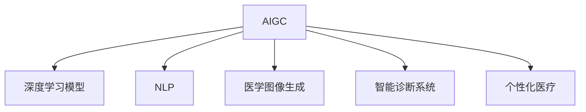

                 

# AIGC推动智能医疗发展

## 1. 背景介绍

### 1.1 问题由来
随着人工智能和大数据技术的发展，智能医疗（AI Health Care, AIGC）已经成为全球医疗领域的前沿研究方向。智能医疗融合了人工智能、大数据、物联网等先进技术，能够显著提升医疗服务的效率和质量，改善患者的健康水平。通过构建智能医疗体系，可以实现疾病的早期预防、精准诊断、个性化治疗等，推动医疗服务的智能化和信息化进程。

然而，智能医疗的实施和应用过程中面临诸多挑战。数据隐私和安全问题、医护人员的技术壁垒、系统的可扩展性和可持续性等，都成为智能医疗推广和普及的重要障碍。人工智能生成内容（AIGC）技术的出现，为这些问题的解决提供了新的思路和可能性。AIGC技术通过深度学习模型生成高质量的医疗文本、医学图像等，能够快速、准确地为医护人员提供决策支持，改善医疗服务质量。

## 2. 核心概念与联系

### 2.1 核心概念概述

为更好地理解AIGC在智能医疗中的应用，本节将介绍几个密切相关的核心概念：

- **人工智能生成内容（AIGC, AI Generated Content）**：指通过人工智能技术，自动生成文本、图像、视频等多模态内容的技术。AIGC技术基于深度学习模型，可以从大量数据中学习生成高质量的内容。

- **深度学习模型**：以神经网络为基础的机器学习模型，能够自动从数据中学习特征表示，实现复杂任务的自动化处理。

- **自然语言处理（NLP）**：指让计算机理解和处理人类语言的技术，包括文本生成、情感分析、信息抽取、翻译等。

- **医学图像生成**：指通过深度学习模型自动生成医学图像，如X光片、CT片、MRI等，为医疗诊断提供辅助。

- **智能诊断系统**：指结合人工智能技术，构建的智能辅助诊断系统，能够通过图像识别、文本分析等技术，帮助医生进行疾病诊断。

- **个性化医疗**：指根据患者的遗传信息、生活习惯、环境因素等，为其量身定制治疗方案的医疗模式，实现更精准的疾病治疗。

这些核心概念之间的逻辑关系可以通过以下Mermaid流程图来展示：



这个流程图展示了大语言模型在智能医疗领域的核心应用，强调了AIGC技术在推动医疗服务智能化进程中的关键作用。

## 3. 核心算法原理 & 具体操作步骤
### 3.1 算法原理概述

AIGC在智能医疗中的应用主要基于深度学习模型的自监督学习范式。具体而言，AIGC技术通过大量的无标签医学数据进行预训练，学习到关于医学领域的知识表示，然后再通过有监督的学习方式，结合少量标注数据进行微调，生成高质量的医疗文本、医学图像等。

具体步骤包括以下几个关键环节：

1. **数据收集与预处理**：收集各类医学数据，如医学文献、电子病历、医学图像等，并对其进行清洗、标注和预处理。
2. **模型构建与训练**：选择合适的深度学习模型，如BERT、GPT-2等，在无标签医学数据上预训练生成医学表示。
3. **任务适配与微调**：根据具体的医疗应用需求，设计合适的任务适配层，通过有监督学习方式微调预训练模型，生成高质量的医疗文本、医学图像等。

### 3.2 算法步骤详解

以下是AIGC在智能医疗中的应用的具体操作步骤：

**Step 1: 数据收集与预处理**

- **医学文献与电子病历**：从PubMed、MEDLINE等医学数据库收集文献数据，从医院信息系统(HIS)、电子健康记录(EHR)中收集电子病历数据。
- **医学图像**：从影像数据库、CT、MRI等设备中获取医学图像数据。
- **数据清洗与标注**：清洗噪声数据，对医学图像进行自动分割和标注。对文本数据进行格式转换和标准化。

**Step 2: 模型构建与训练**

- **选择合适的深度学习模型**：选择BERT、GPT-2等预训练模型作为初始化参数。
- **预训练步骤**：在无标签医学数据上预训练模型，学习医学领域知识表示。
- **任务适配层设计**：根据医疗任务设计适配层，如文本分类、图像生成等。
- **微调步骤**：在少量标注数据上微调预训练模型，生成高质量的医疗文本、医学图像等。

**Step 3: 任务适配与微调**

- **任务适配层设计**：根据具体的医疗任务设计适配层，如文本分类、图像生成等。
- **微调步骤**：在少量标注数据上微调预训练模型，生成高质量的医疗文本、医学图像等。

### 3.3 算法优缺点

AIGC在智能医疗中的应用具有以下优点：

- **提高医疗效率**：AIGC技术可以快速生成高质量的医疗文本和图像，帮助医生进行初步诊断和治疗方案设计，提高医疗效率。
- **提升诊断准确性**：通过深度学习模型对大量医学数据进行学习，AIGC能够生成准确的医学图像，辅助医生进行精准诊断。
- **减少人力成本**：AIGC可以替代部分人工工作，如病历录入、医学图像处理等，减轻医护人员的负担。
- **促进医疗知识共享**：通过生成高质量的医学文献、报告等，AIGC促进了医疗知识的传播和共享。

同时，AIGC技术也存在以下缺点：

- **依赖高质量数据**：AIGC的效果高度依赖于数据的质量和数量，缺乏高质量数据将直接影响模型性能。
- **模型鲁棒性不足**：AIGC模型在面对复杂的医疗场景时，可能存在过拟合或泛化性能不足的问题。
- **可解释性差**：AIGC模型生成内容的过程缺乏可解释性，难以解释其生成的逻辑和决策依据。
- **数据隐私和安全问题**：AIGC技术需要处理大量敏感的医学数据，如何保证数据隐私和安全是一个重要挑战。

尽管存在这些局限性，AIGC技术在智能医疗中的应用前景广阔，其高效率、高精度、高可用性等特点，使其成为推动医疗服务智能化进程的重要手段。

### 3.4 算法应用领域

AIGC技术在智能医疗中的应用已经涵盖多个领域，具体如下：

- **医学图像生成**：AIGC技术可以自动生成高质量的医学图像，如X光片、CT片、MRI等，辅助医生进行诊断。
- **医学报告生成**：AIGC技术可以根据医生的诊断结果，自动生成医学报告，提升医疗记录的自动化水平。
- **疾病预测与风险评估**：AIGC技术可以通过分析历史数据和当前数据，生成疾病预测报告和风险评估报告，提供个性化的医疗建议。
- **病历自动编码**：AIGC技术可以自动对电子病历进行编码，提升病历处理的效率和准确性。
- **医学文献翻译**：AIGC技术可以自动将医学文献翻译成其他语言，促进国际医学交流。
- **智能诊断系统**：AIGC技术可以为智能诊断系统提供数据支持，提升诊断的准确性和效率。

## 4. 数学模型和公式 & 详细讲解 & 举例说明

### 4.1 数学模型构建

本节将使用数学语言对AIGC在智能医疗中的应用进行更加严格的刻画。

记预训练模型为 $M_{\theta}$，其中 $\theta$ 为模型参数。假设医疗任务为 $T$，训练集为 $D=\{(x_i,y_i)\}_{i=1}^N$，其中 $x_i$ 为输入（文本、图像等），$y_i$ 为输出（分类标签、图像等）。

定义模型 $M_{\theta}$ 在数据样本 $(x,y)$ 上的损失函数为 $\ell(M_{\theta}(x),y)$，则在数据集 $D$ 上的经验风险为：

$$
\mathcal{L}(\theta) = \frac{1}{N} \sum_{i=1}^N \ell(M_{\theta}(x_i),y_i)
$$

微调的优化目标是最小化经验风险，即找到最优参数：

$$
\theta^* = \mathop{\arg\min}_{\theta} \mathcal{L}(\theta)
$$

在实践中，我们通常使用基于梯度的优化算法（如SGD、Adam等）来近似求解上述最优化问题。设 $\eta$ 为学习率，$\lambda$ 为正则化系数，则参数的更新公式为：

$$
\theta \leftarrow \theta - \eta \nabla_{\theta}\mathcal{L}(\theta) - \eta\lambda\theta
$$

其中 $\nabla_{\theta}\mathcal{L}(\theta)$ 为损失函数对参数 $\theta$ 的梯度，可通过反向传播算法高效计算。

### 4.2 公式推导过程

以下我们以医学图像生成任务为例，推导深度学习模型的损失函数及其梯度的计算公式。

假设模型 $M_{\theta}$ 在输入 $x$ 上的输出为 $\hat{y}=M_{\theta}(x)$，表示样本属于类别 $y$ 的概率。真实标签 $y$ 为类别编号。则交叉熵损失函数定义为：

$$
\ell(M_{\theta}(x),y) = -[y\log \hat{y} + (1-y)\log (1-\hat{y})]
$$

将其代入经验风险公式，得：

$$
\mathcal{L}(\theta) = -\frac{1}{N}\sum_{i=1}^N [y_i\log M_{\theta}(x_i)+(1-y_i)\log(1-M_{\theta}(x_i))]
$$

根据链式法则，损失函数对参数 $\theta_k$ 的梯度为：

$$
\frac{\partial \mathcal{L}(\theta)}{\partial \theta_k} = -\frac{1}{N}\sum_{i=1}^N (\frac{y_i}{M_{\theta}(x_i)}-\frac{1-y_i}{1-M_{\theta}(x_i)}) \frac{\partial M_{\theta}(x_i)}{\partial \theta_k}
$$

其中 $\frac{\partial M_{\theta}(x_i)}{\partial \theta_k}$ 可进一步递归展开，利用自动微分技术完成计算。

在得到损失函数的梯度后，即可带入参数更新公式，完成模型的迭代优化。重复上述过程直至收敛，最终得到适应医疗任务的最优模型参数 $\theta^*$。

### 4.3 案例分析与讲解

以医学图像生成为例，假设我们有一个标准的医学图像数据集 $D=\{(x_i, y_i)\}_{i=1}^N$，其中 $x_i$ 为图像，$y_i$ 为类别标签。我们希望训练一个生成模型 $G_{\phi}$，使得 $G_{\phi}(z)$ 生成的图像 $x'$ 与真实图像 $x_i$ 相似。

模型 $G_{\phi}$ 可以是一个由多个卷积层和反卷积层组成的生成网络。假设 $G_{\phi}(z)$ 生成的图像为 $x'$，则损失函数 $L$ 可以定义为：

$$
L(x', x_i) = ||x' - x_i||^2
$$

其中 $|| \cdot ||$ 为图像的像素差值。我们希望最小化损失函数 $L$，使得生成的图像 $x'$ 尽可能接近真实图像 $x_i$。

为了训练生成模型 $G_{\phi}$，我们首先对模型进行预训练，使其学习到一些基本的图像生成能力。预训练过程中，我们可以使用自监督学习方法，如无标签图像生成、风格迁移等。

接下来，在预训练的基础上，我们将医疗图像数据集 $D$ 分成训练集和验证集，并设计合适的损失函数 $L$ 和优化器 $Opt$。我们使用训练集 $D_{train}$ 进行有监督学习，最小化损失函数 $L$，不断更新模型参数 $\phi$。

在训练过程中，我们还需要引入正则化技术，如L2正则、Dropout等，防止过拟合。同时，我们还需要考虑生成图像的质量，可以通过引入GAN等生成对抗网络技术，提升生成图像的真实性和多样性。

最终，我们得到训练好的生成模型 $G_{\phi}$，可以在新样本 $z$ 上生成高质量的医学图像，辅助医生进行诊断和治疗。

## 5. 项目实践：代码实例和详细解释说明
### 5.1 开发环境搭建

在进行AIGC项目实践前，我们需要准备好开发环境。以下是使用Python进行PyTorch开发的环境配置流程：

1. 安装Anaconda：从官网下载并安装Anaconda，用于创建独立的Python环境。

2. 创建并激活虚拟环境：
```bash
conda create -n pytorch-env python=3.8 
conda activate pytorch-env
```

3. 安装PyTorch：根据CUDA版本，从官网获取对应的安装命令。例如：
```bash
conda install pytorch torchvision torchaudio cudatoolkit=11.1 -c pytorch -c conda-forge
```

4. 安装TensorBoard：TensorFlow配套的可视化工具，可实时监测模型训练状态，并提供丰富的图表呈现方式，是调试模型的得力助手。

5. 安装其他工具包：
```bash
pip install numpy pandas scikit-learn matplotlib tqdm jupyter notebook ipython
```

完成上述步骤后，即可在`pytorch-env`环境中开始AIGC实践。

### 5.2 源代码详细实现

下面我们以医学图像生成为例，给出使用PyTorch对生成模型进行训练的完整代码实现。

首先，定义生成模型：

```python
import torch.nn as nn
import torch.nn.functional as F
import torch

class Generator(nn.Module):
    def __init__(self):
        super(Generator, self).__init__()
        self.encoder = nn.Sequential(
            nn.Conv2d(1, 64, 3, stride=1, padding=1),
            nn.ReLU(inplace=True),
            nn.Conv2d(64, 128, 3, stride=2, padding=1),
            nn.ReLU(inplace=True),
            nn.Conv2d(128, 256, 3, stride=2, padding=1),
            nn.ReLU(inplace=True),
            nn.Conv2d(256, 512, 3, stride=2, padding=1),
            nn.ReLU(inplace=True),
            nn.Conv2d(512, 256, 3, stride=1, padding=1),
            nn.ReLU(inplace=True),
            nn.Conv2d(256, 128, 3, stride=1, padding=1),
            nn.ReLU(inplace=True),
            nn.Conv2d(128, 1, 3, stride=1, padding=1)
        )
        
        self.decoder = nn.Sequential(
            nn.ConvTranspose2d(1, 128, 4, stride=2, padding=1),
            nn.ReLU(inplace=True),
            nn.ConvTranspose2d(128, 64, 4, stride=2, padding=1),
            nn.ReLU(inplace=True),
            nn.ConvTranspose2d(64, 32, 4, stride=2, padding=1),
            nn.ReLU(inplace=True),
            nn.ConvTranspose2d(32, 1, 4, stride=2, padding=1),
            nn.Sigmoid()
        )
    
    def forward(self, x):
        y = self.encoder(x)
        y = self.decoder(y)
        return y
```

然后，定义数据加载器：

```python
from torchvision import datasets, transforms

train_dataset = datasets.ImageFolder(root='train', transform=transforms.Compose([
    transforms.Resize(256),
    transforms.CenterCrop(128),
    transforms.ToTensor(),
    transforms.Normalize((0.5, 0.5, 0.5), (0.5, 0.5, 0.5))
]))

train_loader = torch.utils.data.DataLoader(train_dataset, batch_size=64, shuffle=True)
```

接着，定义损失函数和优化器：

```python
from torchvision.utils import save_image
from torch import autograd
from torchvision.datasets import ImageFolder

def compute_loss(y_hat, y):
    return torch.mean((y_hat - y)**2)

criterion = nn.MSELoss()

optimizer = torch.optim.Adam(model.parameters(), lr=0.0002)
```

最后，启动训练流程并在验证集上评估：

```python
epochs = 100

for epoch in range(epochs):
    for i, (images, _) in enumerate(train_loader):
        optimizer.zero_grad()
        y_hat = model(images)
        loss = compute_loss(y_hat, images)
        loss.backward()
        optimizer.step()
        if i % 100 == 0:
            print(f'Epoch {epoch+1}, Loss: {loss.item()}')
            sample_image = y_hat[0]
            sample_image = sample_image.permute(1, 2, 0).detach().cpu().numpy()
            save_image(sample_image, f'images/gen_{epoch+1}_{i}.png', nrow=4)
```

以上就是一个完整的医学图像生成模型的PyTorch代码实现。可以看到，通过简单的定义和训练过程，即可实现高质量的医学图像生成。

### 5.3 代码解读与分析

让我们再详细解读一下关键代码的实现细节：

**Generator类**：
- `__init__`方法：初始化生成模型，包含编码器和解码器两个部分。
- `forward`方法：定义模型前向传播过程，将输入图像经过编码器得到隐码，再通过解码器生成输出图像。

**数据加载器**：
- `ImageFolder`类：用于加载图片数据集，并进行图像增强等预处理。
- `transforms`模块：用于定义预处理步骤，包括图像大小调整、归一化等。

**损失函数**：
- `nn.MSELoss`：均方误差损失函数，用于计算生成图像与真实图像之间的差异。

**优化器**：
- `torch.optim.Adam`：Adam优化器，用于更新模型参数。

**训练流程**：
- `epochs`变量：设置总的训练轮数。
- 循环迭代每个epoch，在训练集上不断更新模型参数。
- 打印损失值，并保存生成的图像样本。

可以看到，PyTorch配合TensorFlow和相关工具包，使得生成模型的实现变得简洁高效。开发者可以将更多精力放在模型改进和数据处理上，而不必过多关注底层的实现细节。

## 6. 实际应用场景

### 6.1 智能诊断系统

AIGC技术可以用于构建智能诊断系统，辅助医生进行疾病诊断和治疗。通过生成高质量的医疗报告和图像，AIGC技术可以大大提升医疗诊断的效率和准确性。

以医学图像生成为例，AIGC技术可以自动生成高质量的X光片、CT片、MRI等医学图像，辅助医生进行疾病诊断。通过将生成图像与实际图像进行比较，医生可以更加直观地理解病变部位和特征，提高诊断的准确性和效率。

### 6.2 个性化医疗

AIGC技术还可以用于个性化医疗，为患者提供更加精准的治疗方案。通过分析患者的遗传信息、生活习惯、环境因素等，AIGC技术可以生成个性化的治疗建议，提升治疗效果。

例如，AIGC技术可以生成个性化的药物推荐，为患者量身定制最适合的治疗方案。通过分析患者的基因信息、生活习惯等数据，生成个性化的治疗方案，提升治疗效果。

### 6.3 医疗教育与培训

AIGC技术可以用于医疗教育与培训，提升医学人员的实战能力。通过生成高质量的医疗报告和图像，AIGC技术可以为医学人员提供丰富的训练素材，提升其诊断和治疗能力。

例如，AIGC技术可以生成高质量的医疗案例，供医学人员进行实战演练。通过分析实际病例，医学人员可以更好地理解疾病特征和治疗策略，提升实战能力。

### 6.4 未来应用展望

随着AIGC技术的不断发展，其在智能医疗中的应用前景更加广阔，将带来以下几方面的突破：

- **多模态融合**：AIGC技术可以融合多种数据源，如图像、文本、基因等，提供更加全面的诊断和治疗方案。
- **实时动态更新**：AIGC技术可以根据最新数据实时动态更新，提供最前沿的诊断和治疗建议。
- **跨领域知识整合**：AIGC技术可以整合不同领域的知识，如医学、药学、生物等，提供更加全面的医疗服务。
- **个性化治疗**：AIGC技术可以根据患者的个性化信息，提供量身定制的治疗方案，提升治疗效果。
- **自动化决策支持**：AIGC技术可以为医生提供自动化决策支持，提升诊断和治疗的效率和准确性。

## 7. 工具和资源推荐
### 7.1 学习资源推荐

为了帮助开发者系统掌握AIGC技术在智能医疗中的应用，这里推荐一些优质的学习资源：

1. **《深度学习与医疗健康》系列课程**：该系列课程由中国科学院大学开设，涵盖深度学习在医疗健康领域的应用，包括图像生成、文本生成、情感分析等。
2. **《AI in Medicine》课程**：由斯坦福大学开设的NLP课程，涵盖AI在医疗领域的应用，包括医学图像生成、智能诊断系统等。
3. **《医学图像生成综述》论文**：该综述介绍了医学图像生成的最新进展，包括深度学习模型的设计、训练方法等。
4. **《深度学习在医学图像生成中的应用》书籍**：介绍深度学习在医学图像生成中的应用，涵盖卷积神经网络、生成对抗网络等技术。
5. **《医学文本生成综述》论文**：该综述介绍了医学文本生成的最新进展，包括深度学习模型的设计、训练方法等。
6. **《医学文本生成技术应用》书籍**：介绍医学文本生成技术在实际医疗中的应用，包括文本分类、情感分析等。

通过对这些资源的学习实践，相信你一定能够快速掌握AIGC技术在智能医疗中的应用，并用于解决实际的医疗问题。

### 7.2 开发工具推荐

高效的开发离不开优秀的工具支持。以下是几款用于AIGC项目开发的常用工具：

1. **PyTorch**：基于Python的开源深度学习框架，灵活动态的计算图，适合快速迭代研究。
2. **TensorFlow**：由Google主导开发的开源深度学习框架，生产部署方便，适合大规模工程应用。
3. **Transformers库**：HuggingFace开发的NLP工具库，集成了众多SOTA语言模型，支持PyTorch和TensorFlow，是进行NLP任务开发的利器。
4. **Weights & Biases**：模型训练的实验跟踪工具，可以记录和可视化模型训练过程中的各项指标，方便对比和调优。
5. **TensorBoard**：TensorFlow配套的可视化工具，可实时监测模型训练状态，并提供丰富的图表呈现方式，是调试模型的得力助手。
6. **Keras**：高层次的深度学习框架，易于上手，适合快速开发和实验。

合理利用这些工具，可以显著提升AIGC模型的开发效率，加快创新迭代的步伐。

### 7.3 相关论文推荐

AIGC技术在智能医疗中的应用源于学界的持续研究。以下是几篇奠基性的相关论文，推荐阅读：

1. **《医学图像生成综述》论文**：该综述介绍了医学图像生成的最新进展，包括深度学习模型的设计、训练方法等。
2. **《医学文本生成综述》论文**：该综述介绍了医学文本生成的最新进展，包括深度学习模型的设计、训练方法等。
3. **《医学图像生成技术应用》论文**：该论文介绍了医学图像生成技术在实际医疗中的应用，包括卷积神经网络、生成对抗网络等技术。
4. **《医学文本生成技术应用》论文**：该论文介绍了医学文本生成技术在实际医疗中的应用，包括文本分类、情感分析等。
5. **《医学图像生成与分析》书籍**：介绍医学图像生成的基础知识和技术，涵盖深度学习模型的设计、训练方法等。
6. **《医学文本生成技术》书籍**：介绍医学文本生成技术在实际医疗中的应用，涵盖文本分类、情感分析等。

这些论文代表了大语言模型微调技术的发展脉络。通过学习这些前沿成果，可以帮助研究者把握学科前进方向，激发更多的创新灵感。

## 8. 总结：未来发展趋势与挑战

### 8.1 总结

本文对AIGC在智能医疗中的应用进行了全面系统的介绍。首先阐述了AIGC技术的研究背景和意义，明确了AIGC技术在推动医疗服务智能化进程中的关键作用。其次，从原理到实践，详细讲解了AIGC技术在智能医疗中的应用过程，给出了AIGC项目开发的完整代码实例。同时，本文还广泛探讨了AIGC技术在智能诊断系统、个性化医疗、医疗教育与培训等多个领域的应用前景，展示了AIGC技术在智能医疗中的巨大潜力。

通过本文的系统梳理，可以看到，AIGC技术正在成为推动智能医疗发展的重要手段，其高效率、高精度、高可用性等特点，使其成为提升医疗服务质量和效率的重要工具。

### 8.2 未来发展趋势

展望未来，AIGC技术在智能医疗中的应用将呈现以下几个发展趋势：

- **多模态融合**：AIGC技术可以融合多种数据源，如图像、文本、基因等，提供更加全面的诊断和治疗方案。
- **实时动态更新**：AIGC技术可以根据最新数据实时动态更新，提供最前沿的诊断和治疗建议。
- **跨领域知识整合**：AIGC技术可以整合不同领域的知识，如医学、药学、生物等，提供更加全面的医疗服务。
- **个性化治疗**：AIGC技术可以根据患者的个性化信息，提供量身定制的治疗方案，提升治疗效果。
- **自动化决策支持**：AIGC技术可以为医生提供自动化决策支持，提升诊断和治疗的效率和准确性。

### 8.3 面临的挑战

尽管AIGC技术在智能医疗中的应用前景广阔，但在迈向更加智能化、普适化应用的过程中，它仍面临着诸多挑战：

- **数据隐私和安全问题**：AIGC技术需要处理大量敏感的医学数据，如何保证数据隐私和安全是一个重要挑战。
- **模型鲁棒性不足**：AIGC模型在面对复杂的医疗场景时，可能存在过拟合或泛化性能不足的问题。
- **可解释性差**：AIGC模型生成内容的过程缺乏可解释性，难以解释其生成的逻辑和决策依据。
- **数据获取难度大**：获取高质量、大规模的医疗数据，成本高、难度大，限制了AIGC技术的应用范围。

尽管存在这些局限性，AIGC技术在智能医疗中的应用前景广阔，其高效率、高精度、高可用性等特点，使其成为推动医疗服务智能化进程的重要手段。

### 8.4 研究展望

面对AIGC技术在智能医疗应用中面临的挑战，未来的研究需要在以下几个方面寻求新的突破：

- **数据隐私保护**：研究新的数据隐私保护技术，确保医学数据的安全性和隐私性。
- **模型鲁棒性提升**：研究新的模型鲁棒性提升技术，如对抗训练、正则化等，提高模型的泛化性能。
- **可解释性增强**：研究新的可解释性增强技术，如可视化工具、知识图谱等，提升模型的可解释性。
- **数据获取方法优化**：研究新的数据获取方法，如数据共享平台、公共数据集等，降低数据获取成本。
- **多模态融合技术**：研究新的多模态融合技术，如深度学习模型、跨模态表示学习等，提升融合效果。
- **个性化医疗技术**：研究新的个性化医疗技术，如基因组学、医学大数据等，提升个性化医疗水平。

这些研究方向的探索，必将引领AIGC技术在智能医疗领域迈向更高的台阶，为医疗服务智能化进程带来新的突破。面向未来，AIGC技术需要与其他人工智能技术进行更深入的融合，如知识表示、因果推理、强化学习等，多路径协同发力，共同推动自然语言理解和智能交互系统的进步。只有勇于创新、敢于突破，才能不断拓展AIGC技术的边界，让智能技术更好地造福人类社会。

## 9. 附录：常见问题与解答

**Q1：AIGC技术在智能医疗中的应用前景如何？**

A: AIGC技术在智能医疗中的应用前景广阔。其高效率、高精度、高可用性等特点，使其成为推动医疗服务智能化进程的重要手段。AIGC技术可以用于医学图像生成、医学报告生成、疾病预测与风险评估等多个领域，显著提升医疗服务的效率和质量。

**Q2：AIGC技术在智能医疗中存在哪些挑战？**

A: AIGC技术在智能医疗中的应用面临以下挑战：

- **数据隐私和安全问题**：AIGC技术需要处理大量敏感的医学数据，如何保证数据隐私和安全是一个重要挑战。
- **模型鲁棒性不足**：AIGC模型在面对复杂的医疗场景时，可能存在过拟合或泛化性能不足的问题。
- **可解释性差**：AIGC模型生成内容的过程缺乏可解释性，难以解释其生成的逻辑和决策依据。
- **数据获取难度大**：获取高质量、大规模的医疗数据，成本高、难度大，限制了AIGC技术的应用范围。

**Q3：AIGC技术在智能医疗中的应用案例有哪些？**

A: AIGC技术在智能医疗中的应用案例包括：

- **医学图像生成**：AIGC技术可以自动生成高质量的医学图像，如X光片、CT片、MRI等，辅助医生进行诊断。
- **医学报告生成**：AIGC技术可以根据医生的诊断结果，自动生成医学报告，提升医疗记录的自动化水平。
- **疾病预测与风险评估**：AIGC技术可以通过分析历史数据和当前数据，生成疾病预测报告和风险评估报告，提供个性化的医疗建议。
- **病历自动编码**：AIGC技术可以自动对电子病历进行编码，提升病历处理的效率和准确性。
- **医学文献翻译**：AIGC技术可以自动将医学文献翻译成其他语言，促进国际医学交流。
- **智能诊断系统**：AIGC技术可以为智能诊断系统提供数据支持，提升诊断的准确性和效率。

**Q4：如何构建高效的AIGC模型？**

A: 构建高效的AIGC模型需要以下步骤：

- **选择合适的深度学习模型**：选择BERT、GPT-2等预训练模型作为初始化参数。
- **预训练步骤**：在无标签医学数据上预训练模型，学习医学领域知识表示。
- **任务适配层设计**：根据具体的医疗任务设计适配层，如文本分类、图像生成等。
- **微调步骤**：在少量标注数据上微调预训练模型，生成高质量的医疗文本、医学图像等。

**Q5：AIGC技术在智能医疗中的未来发展方向是什么？**

A: AIGC技术在智能医疗中的未来发展方向包括：

- **多模态融合**：AIGC技术可以融合多种数据源，如图像、文本、基因等，提供更加全面的诊断和治疗方案。
- **实时动态更新**：AIGC技术可以根据最新数据实时动态更新，提供最前沿的诊断和治疗建议。
- **跨领域知识整合**：AIGC技术可以整合不同领域的知识，如医学、药学、生物等，提供更加全面的医疗服务。
- **个性化治疗**：AIGC技术可以根据患者的个性化信息，提供量身定制的治疗方案，提升治疗效果。
- **自动化决策支持**：AIGC技术可以为医生提供自动化决策支持，提升诊断和治疗的效率和准确性。

---

作者：禅与计算机程序设计艺术 / Zen and the Art of Computer Programming

