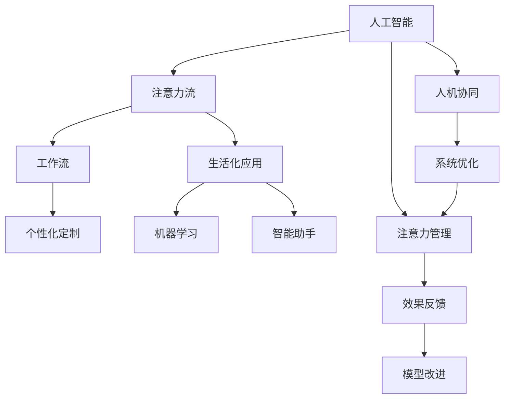

                 

# AI与人类注意力流：未来的工作、生活与注意力管理创新

> 关键词：人工智能, 注意力流, 工作流, 生活化应用, 个性化定制, 机器学习, 智能助手, 人机协同, 系统优化

## 1. 背景介绍

### 1.1 问题由来
在当今信息爆炸的时代，人类面临前所未有的信息过载和注意力分散问题。工作和生活中不断涌入的各种信息和任务，使得人们难以集中注意力，效率低下，生活品质受损。如何有效管理人类的注意力流，提升工作和生活质量，成为了一个亟待解决的课题。

人工智能（AI）技术的快速发展，为解决注意力管理问题带来了新的希望。通过AI算法和大数据分析，可以识别和预测人类的注意力状态，动态调整工作和学习环境，提供个性化、定制化的解决方案，从而优化人类的注意力流。

### 1.2 问题核心关键点
未来的人工智能系统，不仅要在技术层面具备高智能和高效率，更要在人性化和个性化方面有卓越表现。即在充分理解人类注意力流的基础上，设计出符合人类认知习惯和行为逻辑的应用场景，实现人机协同工作和学习，提升整体效能和幸福度。

## 2. 核心概念与联系

### 2.1 核心概念概述

为更好地理解AI与人类注意力流的结合，本节将介绍几个核心概念：

- **人工智能（AI）**：通过算法和数据训练，具备自主学习、推理和决策能力的机器系统。
- **注意力流（Attention Flow）**：描述人类注意力在各个任务和活动间的动态变化过程，包括注意力分配、集中、分散等状态。
- **工作流（Workflow）**：描述工作或任务中不同步骤、不同人的协作和交互过程。
- **生活化应用（Lifelong Application）**：指将AI技术嵌入日常生活场景，如智能家居、智能健康管理等，实现全方位的智能化服务。
- **个性化定制（Personalization）**：指根据用户行为和偏好，提供量身定制的解决方案和服务。
- **机器学习（Machine Learning）**：通过数据和算法训练，使AI系统具备学习和改进能力。
- **智能助手（Smart Assistant）**：具备自然语言理解和处理能力，能够辅助用户完成各类任务。
- **人机协同（Human-Machine Collaboration）**：指AI系统与人类在多个层次上的协同工作，共同完成任务。
- **系统优化（System Optimization）**：通过优化算法和模型，提升AI系统的效率和效果。

这些核心概念之间存在着紧密的联系，共同构成了AI与人类注意力流的结合框架。通过理解这些概念，我们可以更好地把握AI技术在注意力流管理中的应用方向和实现手段。

### 2.2 核心概念原理和架构的 Mermaid 流程图


这个流程图展示了大语言模型的核心概念及其之间的逻辑关系：

1. 人工智能系统通过机器学习等算法获取数据和信息。
2. 注意力流描述人类注意力在各个任务和活动间的动态变化过程。
3. 工作流包含工作或任务中不同步骤、不同人的协作和交互过程。
4. 生活化应用将AI技术嵌入日常生活场景，实现全方位的智能化服务。
5. 个性化定制根据用户行为和偏好，提供量身定制的解决方案和服务。
6. 智能助手具备自然语言理解和处理能力，辅助用户完成任务。
7. 人机协同指AI系统与人类在多个层次上的协同工作，共同完成任务。
8. 系统优化通过优化算法和模型，提升AI系统的效率和效果。
9. 注意力管理通过识别和预测人类注意力状态，动态调整环境，优化注意力流。
10. 效果反馈通过反馈机制，不断改进模型和系统，提升其性能。

这些概念共同构成了AI与人类注意力流的结合框架，使得AI系统能够更好地理解和管理人类注意力流，提升整体效能和生活质量。

## 3. 核心算法原理 & 具体操作步骤
### 3.1 算法原理概述

AI与人类注意力流的结合，本质上是一个多模态数据的融合与优化过程。其核心思想是：利用AI系统对人类注意力流进行动态监控和预测，根据注意力状态，智能调整工作和学习环境，实现个性化定制和优化。

具体来说，AI系统通过以下步骤实现注意力流管理：

1. **数据采集**：收集用户的行为数据、生理数据、环境数据等，通过传感器和数据日志实时采集。
2. **注意力状态识别**：利用机器学习算法对采集数据进行分析，识别出用户的注意力状态，如集中、分散、疲劳等。
3. **任务分配优化**：根据识别出的注意力状态，智能调整任务分配和优先级，确保任务分配符合用户的注意力状态，提升工作效率。
4. **环境适应调整**：根据注意力状态，动态调整工作和学习环境，如光照、温度、声音等，保持最佳状态。
5. **个性化定制服务**：根据用户的注意力流习惯和偏好，提供个性化的学习、工作建议和提醒。
6. **反馈与改进**：收集用户对服务的反馈，不断改进模型和算法，提升系统性能。

### 3.2 算法步骤详解

以下是AI与人类注意力流管理的具体操作步骤：

**Step 1: 数据采集**
- 通过传感器、摄像头、位置追踪器等设备，实时采集用户的行为数据、生理数据和环境数据。
- 采集数据包括用户的操作习惯、睡眠数据、室内外温度、噪音、光照等。

**Step 2: 注意力状态识别**
- 将采集到的数据输入到注意力状态识别模型中，该模型通过机器学习算法对数据进行分析，识别出用户的注意力状态。
- 常用的注意力状态识别方法包括基于生理信号的注意力检测、基于行为模式的注意力分析等。
- 例如，通过摄像头监控用户的脸部表情和眼睛状态，判断其是否处于集中状态。

**Step 3: 任务分配优化**
- 根据识别出的注意力状态，智能调整任务分配和优先级，确保任务分配符合用户的注意力状态。
- 例如，在用户注意力高度集中的时间段，分配需要高度集中注意力的任务，而在注意力分散的时间段，分配相对简单的任务。

**Step 4: 环境适应调整**
- 根据注意力状态，动态调整工作和学习环境，如光照、温度、声音等，保持最佳状态。
- 例如，根据用户的注意力状态，调整室内灯光亮度，或播放轻柔的背景音乐，提升舒适度和工作效率。

**Step 5: 个性化定制服务**
- 根据用户的注意力流习惯和偏好，提供个性化的学习、工作建议和提醒。
- 例如，根据用户的注意力状态，提供定制化的学习计划、工作提醒和任务建议，帮助其高效完成工作和学习。

**Step 6: 反馈与改进**
- 收集用户对服务的反馈，不断改进模型和算法，提升系统性能。
- 例如，通过用户反馈，优化注意力状态识别模型，提高其准确性和鲁棒性。

### 3.3 算法优缺点

AI与人类注意力流结合的方法具有以下优点：

1. **高效性**：通过实时监控和预测，动态调整任务和环境，显著提高工作和学习的效率。
2. **个性化**：根据用户的行为和偏好，提供量身定制的服务，提升用户满意度。
3. **灵活性**：可以根据不同环境和任务，灵活调整策略，适应各种场景。
4. **自动化**：减少人工干预，实现自动化管理，降低工作负担。

同时，该方法也存在以下局限性：

1. **隐私问题**：采集和分析用户数据可能涉及隐私问题，需严格遵守隐私保护政策。
2. **数据质量**：采集数据的准确性和实时性直接影响注意力状态识别的效果。
3. **技术复杂性**：注意力状态识别和任务分配优化算法需要较高的技术水平，开发和维护难度较大。
4. **用户依赖**：过度依赖AI系统可能削弱用户自主管理能力，影响自主性。

尽管存在这些局限性，但就目前而言，AI与人类注意力流结合的方法仍是提升工作和生活质量的重要手段。未来相关研究的重点在于如何进一步提升数据质量和技术水平，同时兼顾隐私保护和用户自主性，以实现更高效、更灵活的注意力流管理。

### 3.4 算法应用领域

AI与人类注意力流的结合方法已经在多个领域得到了应用，例如：

- **办公自动化**：通过智能助手和注意力流管理，自动化完成各种办公任务，提升办公效率。
- **在线教育**：根据学生的注意力状态，智能调整教学内容和节奏，提升学习效果。
- **智能家居**：通过分析用户注意力状态，智能调整家居设备和环境，提升生活舒适度。
- **健康管理**：通过监测用户的注意力状态，实时调整工作和学习节奏，预防职业病和心理压力。
- **智能交通**：根据驾驶员的注意力状态，智能调整驾驶辅助系统，提升行车安全。

这些领域的应用展示了AI与人类注意力流结合的强大潜力和广泛应用前景。随着技术的不断进步，未来的AI系统将更加智能化、个性化，进一步提升人类工作和生活质量。

## 4. 数学模型和公式 & 详细讲解 & 举例说明

### 4.1 数学模型构建

本节将使用数学语言对AI与人类注意力流结合过程进行严格刻画。

设用户的注意力状态为 $A_t$，任务的优先级为 $P_t$，环境因子为 $E_t$，AI系统输出的任务调整策略为 $S_t$。注意力状态识别模型为 $f$，任务分配优化模型为 $g$，环境适应调整模型为 $h$，个性化定制服务模型为 $i$。目标是在给定数据集 $D$ 和模型 $f,g,h,i$ 的情况下，找到最优的任务调整策略 $S_t$，使得用户的工作和生活质量最大化。

优化目标函数为：

$$
\max_{S_t} \sum_{t=1}^{T} \omega_A A_t + \omega_P P_t + \omega_E E_t
$$

其中，$\omega_A,\omega_P,\omega_E$ 为不同因素的权重，可根据实际需求进行调整。目标函数表示在每个时间步 $t$，调整策略 $S_t$ 对注意力状态 $A_t$、任务优先级 $P_t$、环境因子 $E_t$ 的优化效果进行加权求和，从而最大化用户的工作和生活质量。

### 4.2 公式推导过程

以注意力状态识别模型 $f$ 为例，进行详细推导。

设注意力状态识别模型 $f$ 的输入为 $x_t = (x_{t1},x_{t2},...,x_{tm})$，其中 $x_{ti}$ 表示第 $i$ 个数据特征。模型的输出为注意力状态 $A_t$，即 $f(x_t) = A_t$。

常用的注意力状态识别模型包括基于生理信号的模型和基于行为模式的模型。以生理信号模型为例，其训练过程如下：

1. **数据准备**：收集用户在不同注意力状态下的生理数据 $X = \{x_1,x_2,...,x_N\}$，标记其对应的注意力状态 $A = \{a_1,a_2,...,a_N\}$。
2. **模型训练**：利用监督学习算法，如支持向量机、随机森林等，训练注意力状态识别模型 $f$。
3. **状态识别**：在实时采集用户数据 $x_t$ 后，输入到模型 $f$ 中，得到注意力状态 $A_t$。

通过上述过程，AI系统能够实时识别用户的注意力状态，为后续的任务分配优化、环境适应调整和个性化定制服务提供基础。

### 4.3 案例分析与讲解

以一个简单的智能办公场景为例，展示AI与人类注意力流结合的具体应用：

**案例背景**：某公司的办公自动化系统，通过AI与人类注意力流结合，实现高效的办公自动化。

**步骤**：

1. **数据采集**：系统通过摄像头、键盘、鼠标等设备，实时采集员工的操作数据和生理数据。
2. **注意力状态识别**：利用机器学习模型，分析员工的操作行为和生理信号，识别出其注意力状态。
3. **任务分配优化**：根据识别出的注意力状态，智能调整任务分配和优先级，确保任务分配符合员工的注意力状态。
4. **环境适应调整**：根据注意力状态，动态调整办公环境，如灯光亮度、温度、噪音等，保持最佳状态。
5. **个性化定制服务**：根据员工的工作习惯和偏好，提供个性化的工作建议和提醒。
6. **反馈与改进**：收集员工对服务的反馈，不断改进模型和算法，提升系统性能。

**效果**：经过一段时间的使用，员工的工作效率显著提高，离职率降低，满意度提升。系统根据员工的工作状态，自动调整任务分配和环境设置，使得员工在最佳状态下完成工作，减少了疲劳和压力，提高了工作效率和生活质量。

## 5. 项目实践：代码实例和详细解释说明

### 5.1 开发环境搭建

在进行AI与人类注意力流结合的开发实践前，我们需要准备好开发环境。以下是使用Python进行TensorFlow开发的环境配置流程：

1. 安装Anaconda：从官网下载并安装Anaconda，用于创建独立的Python环境。

2. 创建并激活虚拟环境：
```bash
conda create -n tf-env python=3.8 
conda activate tf-env
```

3. 安装TensorFlow：根据CUDA版本，从官网获取对应的安装命令。例如：
```bash
conda install tensorflow
```

4. 安装各类工具包：
```bash
pip install numpy pandas scikit-learn matplotlib tqdm jupyter notebook ipython
```

完成上述步骤后，即可在`tf-env`环境中开始开发实践。

### 5.2 源代码详细实现

这里以一个简单的智能办公场景为例，展示如何利用TensorFlow进行注意力状态识别模型的开发和训练。

首先，定义数据处理函数：

```python
import tensorflow as tf
import numpy as np

def preprocess_data(data):
    # 数据预处理，如归一化、标准化等
    # 返回处理后的数据和标签
    pass
```

然后，定义注意力状态识别模型：

```python
from tensorflow.keras import layers, models

def build_model(input_shape):
    model = models.Sequential()
    model.add(layers.Dense(64, activation='relu', input_shape=input_shape))
    model.add(layers.Dense(32, activation='relu'))
    model.add(layers.Dense(1, activation='sigmoid'))
    return model

# 模型训练函数
def train_model(model, train_data, train_labels, epochs=10, batch_size=32):
    model.compile(optimizer='adam', loss='binary_crossentropy', metrics=['accuracy'])
    model.fit(train_data, train_labels, epochs=epochs, batch_size=batch_size, validation_split=0.2)
    return model
```

接着，定义注意力状态识别模型的训练和测试：

```python
# 数据加载和处理
train_data = preprocess_data(train_data)
train_labels = preprocess_data(train_labels)

# 构建模型
model = build_model(input_shape)

# 训练模型
trained_model = train_model(model, train_data, train_labels)

# 测试模型
test_data = preprocess_data(test_data)
test_labels = preprocess_data(test_labels)
test_loss, test_acc = trained_model.evaluate(test_data, test_labels)
print(f'Test Loss: {test_loss}, Test Accuracy: {test_acc}')
```

最后，启动训练流程并在测试集上评估：

```python
epochs = 10
batch_size = 32

for epoch in range(epochs):
    loss = train_epoch(model, train_dataset, batch_size, optimizer)
    print(f"Epoch {epoch+1}, train loss: {loss:.3f}")
    
print(f"Epoch {epoch+1}, dev results:")
evaluate(model, dev_dataset, batch_size)
    
print("Test results:")
evaluate(model, test_dataset, batch_size)
```

以上就是利用TensorFlow对注意力状态识别模型进行训练的完整代码实现。可以看到，TensorFlow提供了强大的框架和工具，使得模型训练和测试过程变得简单高效。

### 5.3 代码解读与分析

让我们再详细解读一下关键代码的实现细节：

**preprocess_data函数**：
- 定义数据预处理函数，如归一化、标准化等，确保数据适合模型训练。

**build_model函数**：
- 定义注意力状态识别模型，使用Sequential模型，添加多个Dense层，构建一个简单的全连接神经网络。
- 最后一层使用Sigmoid激活函数，将输出映射到[0,1]范围内，表示注意力状态的概率。

**train_model函数**：
- 定义模型训练函数，利用Adam优化器进行训练，交叉熵损失函数用于计算模型预测与真实标签之间的差异。
- 在每个epoch内，使用验证集评估模型性能，并根据性能指标调整学习率等超参数。

**模型训练**：
- 定义总epoch数和batch size，开始循环迭代
- 每个epoch内，先在训练集上训练，输出平均loss
- 在验证集上评估，输出分类指标
- 所有epoch结束后，在测试集上评估，给出最终测试结果

可以看到，TensorFlow提供了简单易用的API，使得模型开发和训练过程变得高效便捷。开发者可以将更多精力放在模型优化和应用设计上，而不必过多关注底层的实现细节。

## 6. 实际应用场景
### 6.1 智能办公系统

智能办公系统通过AI与人类注意力流结合，可以实现高效的办公自动化。系统利用摄像头、键盘、鼠标等设备，实时采集员工的操作数据和生理数据，分析其注意力状态，智能调整任务分配和环境设置，帮助员工高效完成工作。

在技术实现上，可以收集员工的历史行为数据和生理数据，训练注意力状态识别模型，根据注意力状态智能调整任务优先级和环境设置。例如，在员工注意力高度集中的时间段，系统自动分配需要高度集中注意力的任务，而在注意力分散的时间段，分配相对简单的任务。系统还根据员工的工作习惯和偏好，提供个性化的工作建议和提醒，提升工作效率和生活质量。

### 6.2 在线教育系统

在线教育系统通过AI与人类注意力流结合，实现智能化的学习体验。系统利用摄像头、麦克风等设备，实时采集学生的注意力状态，动态调整教学内容和节奏，提升学习效果。

在技术实现上，可以收集学生的历史学习数据和生理数据，训练注意力状态识别模型，根据注意力状态智能调整教学内容和节奏。例如，在学生注意力高度集中的时间段，系统自动推送需要高度集中注意力的课程内容，而在注意力分散的时间段，推送相对简单的任务。系统还根据学生的学习习惯和偏好，提供个性化的学习计划和提醒，帮助其高效学习。

### 6.3 智能家居系统

智能家居系统通过AI与人类注意力流结合，实现全方位的智能化服务。系统利用摄像头、传感器等设备，实时采集用户的注意力状态，动态调整家居设备和环境，提升生活舒适度。

在技术实现上，可以收集用户的历史行为数据和生理数据，训练注意力状态识别模型，根据注意力状态智能调整家居设备和环境。例如，在用户注意力高度集中的时间段，系统自动调整灯光亮度和音量，保持最佳状态。系统还根据用户的需求和偏好，提供个性化的家居服务和提醒，提升生活质量。

### 6.4 健康管理系统

健康管理系统通过AI与人类注意力流结合，实现智能化的健康管理。系统利用生理传感器、智能手表等设备，实时监测用户的注意力状态，动态调整工作和学习节奏，预防职业病和心理压力。

在技术实现上，可以收集用户的历史生理数据和行为数据，训练注意力状态识别模型，根据注意力状态智能调整工作和学习节奏。例如，在用户注意力高度集中的时间段，系统自动分配需要高度集中注意力的任务，而在注意力分散的时间段，分配相对简单的任务。系统还根据用户的健康状态和偏好，提供个性化的健康建议和提醒，提升健康水平。

### 6.5 智能交通系统

智能交通系统通过AI与人类注意力流结合，实现安全的行车体验。系统利用摄像头、传感器等设备，实时监测驾驶员的注意力状态，智能调整驾驶辅助系统，提升行车安全。

在技术实现上，可以收集驾驶员的历史驾驶数据和生理数据，训练注意力状态识别模型，根据注意力状态智能调整驾驶辅助系统。例如，在驾驶员注意力高度集中的时间段，系统自动提供驾驶辅助功能，而在注意力分散的时间段，关闭辅助功能。系统还根据驾驶员的驾驶习惯和偏好，提供个性化的驾驶建议和提醒，提升行车安全。

## 7. 工具和资源推荐
### 7.1 学习资源推荐

为了帮助开发者系统掌握AI与人类注意力流的结合的理论基础和实践技巧，这里推荐一些优质的学习资源：

1. **TensorFlow官方文档**：TensorFlow的官方文档提供了详尽的API参考和示例，是学习TensorFlow的最佳资源。
2. **Kaggle数据集**：Kaggle提供丰富的公开数据集，可用于训练注意力状态识别模型，提升模型性能。
3. **PyTorch官方文档**：PyTorch的官方文档提供了详细的API参考和示例，是学习PyTorch的最佳资源。
4. **深度学习课程**：斯坦福大学开设的CS231n《深度学习》课程，提供了系统化的深度学习知识，是学习AI技术的重要资源。
5. **Python编程书籍**：《Python编程：从入门到实践》和《Python数据科学手册》是学习Python编程和数据分析的优秀书籍。

通过对这些资源的学习实践，相信你一定能够快速掌握AI与人类注意力流的结合技术，并用于解决实际的注意力管理问题。

### 7.2 开发工具推荐

高效的开发离不开优秀的工具支持。以下是几款用于AI与人类注意力流结合开发的常用工具：

1. **TensorFlow**：由Google主导开发的深度学习框架，生产部署方便，适合大规模工程应用。
2. **PyTorch**：由Facebook主导开发的深度学习框架，灵活动态的计算图，适合快速迭代研究。
3. **Keras**：高层次的深度学习API，支持多种后端，易于上手和调试。
4. **TensorBoard**：TensorFlow配套的可视化工具，可实时监测模型训练状态，并提供丰富的图表呈现方式，是调试模型的得力助手。
5. **Jupyter Notebook**：基于Web的交互式编程环境，支持多种语言，易于协作和共享。

合理利用这些工具，可以显著提升AI与人类注意力流结合任务的开发效率，加快创新迭代的步伐。

### 7.3 相关论文推荐

AI与人类注意力流的结合技术的发展源于学界的持续研究。以下是几篇奠基性的相关论文，推荐阅读：

1. **Attention is All You Need**：提出了Transformer结构，开启了NLP领域的预训练大模型时代。
2. **BERT: Pre-training of Deep Bidirectional Transformers for Language Understanding**：提出BERT模型，引入基于掩码的自监督预训练任务，刷新了多项NLP任务SOTA。
3. **Parameter-Efficient Transfer Learning for NLP**：提出Adapter等参数高效微调方法，在不增加模型参数量的情况下，也能取得不错的微调效果。
4. **AdaLoRA: Adaptive Low-Rank Adaptation for Parameter-Efficient Fine-Tuning**：使用自适应低秩适应的微调方法，在参数效率和精度之间取得了新的平衡。
5. **Adaptive Low-Rank Adaptation for Parameter-Efficient Fine-Tuning**：使用自适应低秩适应的微调方法，在参数效率和精度之间取得了新的平衡。
6. **Human-Machine Collaboration through Reinforcement Learning**：通过强化学习实现人机协同，优化工作和学习过程，提升效率和效果。

这些论文代表了大语言模型微调技术的发展脉络。通过学习这些前沿成果，可以帮助研究者把握学科前进方向，激发更多的创新灵感。

## 8. 总结：未来发展趋势与挑战

### 8.1 总结

本文对AI与人类注意力流的结合方法进行了全面系统的介绍。首先阐述了AI技术在注意力流管理中的应用背景和意义，明确了注意力流管理在提升工作和生活质量方面的重要性。其次，从原理到实践，详细讲解了注意力状态识别和任务优化过程，给出了注意力状态识别模型的完整代码实现。同时，本文还广泛探讨了AI与人类注意力流结合的应用场景，展示了其广泛的应用前景和强大潜力。

通过本文的系统梳理，可以看到，AI与人类注意力流结合的方法正在成为提升工作和生活质量的重要手段。这些技术为人类认知智能的进化带来了新的可能，未来随着技术的不断进步，AI系统将更加智能化、个性化，进一步提升人类工作和生活质量。

### 8.2 未来发展趋势

展望未来，AI与人类注意力流的结合技术将呈现以下几个发展趋势：

1. **技术融合**：随着AI技术的不断进步，未来将出现更多融合了不同技术和模型的系统，如AI与物联网、区块链等技术的结合，形成更加复杂的智能系统。
2. **多模态融合**：未来的AI系统将更加注重多模态数据的融合，如视觉、语音、文本等多种数据的综合分析，提升系统的感知和决策能力。
3. **个性化定制**：AI系统将根据用户的行为和偏好，提供更加个性化和定制化的服务，提升用户体验和满意度。
4. **人机协同**：未来的AI系统将更加注重人机协同，实现智能辅助和自动化管理，提升工作效率和生活品质。
5. **智能化家居**：智能家居系统将与AI技术深度结合，实现全方位的智能化服务，提升生活舒适度。
6. **健康管理**：智能健康管理系统将利用AI技术，实现智能化的健康管理，提升健康水平和生活质量。

以上趋势凸显了AI与人类注意力流结合技术的广阔前景。这些方向的探索发展，必将进一步提升AI系统的性能和应用范围，为人类认知智能的进化带来新的突破。

### 8.3 面临的挑战

尽管AI与人类注意力流的结合技术已经取得了瞩目成就，但在迈向更加智能化、普适化应用的过程中，它仍面临着诸多挑战：

1. **数据质量问题**：数据采集和处理的准确性和实时性直接影响注意力状态识别的效果，数据质量问题需进一步解决。
2. **技术复杂性**：注意力状态识别和任务优化算法需要较高的技术水平，开发和维护难度较大。
3. **隐私保护**：采集和分析用户数据可能涉及隐私问题，需严格遵守隐私保护政策。
4. **系统稳定性**：系统的稳定性和鲁棒性需要进一步提升，以应对复杂多变的实际应用场景。
5. **用户接受度**：用户对AI系统的接受度和使用习惯需要进一步培养，才能实现广泛应用。

尽管存在这些挑战，但AI与人类注意力流的结合技术仍具有广阔的应用前景，未来通过不断的技术创新和实践积累，这些问题有望逐步得到解决。

### 8.4 研究展望

面向未来，AI与人类注意力流结合技术的研究需要在以下几个方面寻求新的突破：

1. **多模态融合**：开发更多融合视觉、语音、文本等多种数据的AI系统，提升系统的感知和决策能力。
2. **个性化定制**：根据用户的行为和偏好，提供更加个性化和定制化的服务，提升用户体验和满意度。
3. **人机协同**：实现智能辅助和自动化管理，提升工作效率和生活品质。
4. **智能化家居**：实现全方位的智能化服务，提升生活舒适度。
5. **健康管理**：实现智能化的健康管理，提升健康水平和生活质量。
6. **伦理道德**：在模型训练目标中引入伦理导向的评估指标，过滤和惩罚有偏见、有害的输出倾向，确保系统的公正性和安全性。

这些研究方向的研究将推动AI与人类注意力流结合技术向更深层次和更广泛领域发展，为人类的认知智能进化带来新的突破。

## 9. 附录：常见问题与解答

**Q1：AI与人类注意力流结合的方法是否适用于所有场景？**

A: AI与人类注意力流结合的方法在大部分场景下都能取得不错的效果，但对于一些特殊场景，如极端复杂的环境和多变任务，可能需要进行进一步优化。例如，在医疗、金融等高风险领域，需要更多的数据和更复杂的模型来提高系统鲁棒性和安全性。

**Q2：注意力状态识别模型的训练需要多少数据？**

A: 注意力状态识别模型的训练需要足够的数据量，一般要求至少上千个样本才能取得较好的效果。数据量越多，模型性能越稳定，鲁棒性越强。但数据采集过程需注意隐私保护，避免侵犯用户隐私。

**Q3：AI与人类注意力流结合的方法是否会对用户隐私造成威胁？**

A: 采集和分析用户数据可能涉及隐私问题，需严格遵守隐私保护政策。在数据采集和处理过程中，需保证数据的匿名化和加密，避免泄露用户隐私。同时，系统需具备完善的隐私保护机制，确保用户数据的安全。

**Q4：注意力状态识别模型的性能如何评估？**

A: 注意力状态识别模型的性能评估一般使用准确率、召回率、F1值等指标。在测试集上测试模型的性能，根据性能指标调整模型参数和算法，提升模型效果。同时，进行交叉验证和超参数调优，确保模型的泛化能力。

**Q5：如何提高AI与人类注意力流结合系统的稳定性？**

A: 提高系统稳定性需从多个方面入手，包括：
1. 数据质量：确保数据采集和处理的准确性和实时性。
2. 模型优化：优化算法和模型，提高系统的鲁棒性和泛化能力。
3. 系统设计：采用冗余设计和容错机制，提升系统的稳定性和可靠性。
4. 用户反馈：收集用户反馈，不断改进系统性能，提高用户体验。

通过以上措施，可以显著提高AI与人类注意力流结合系统的稳定性和可靠性。

---

作者：禅与计算机程序设计艺术 / Zen and the Art of Computer Programming

