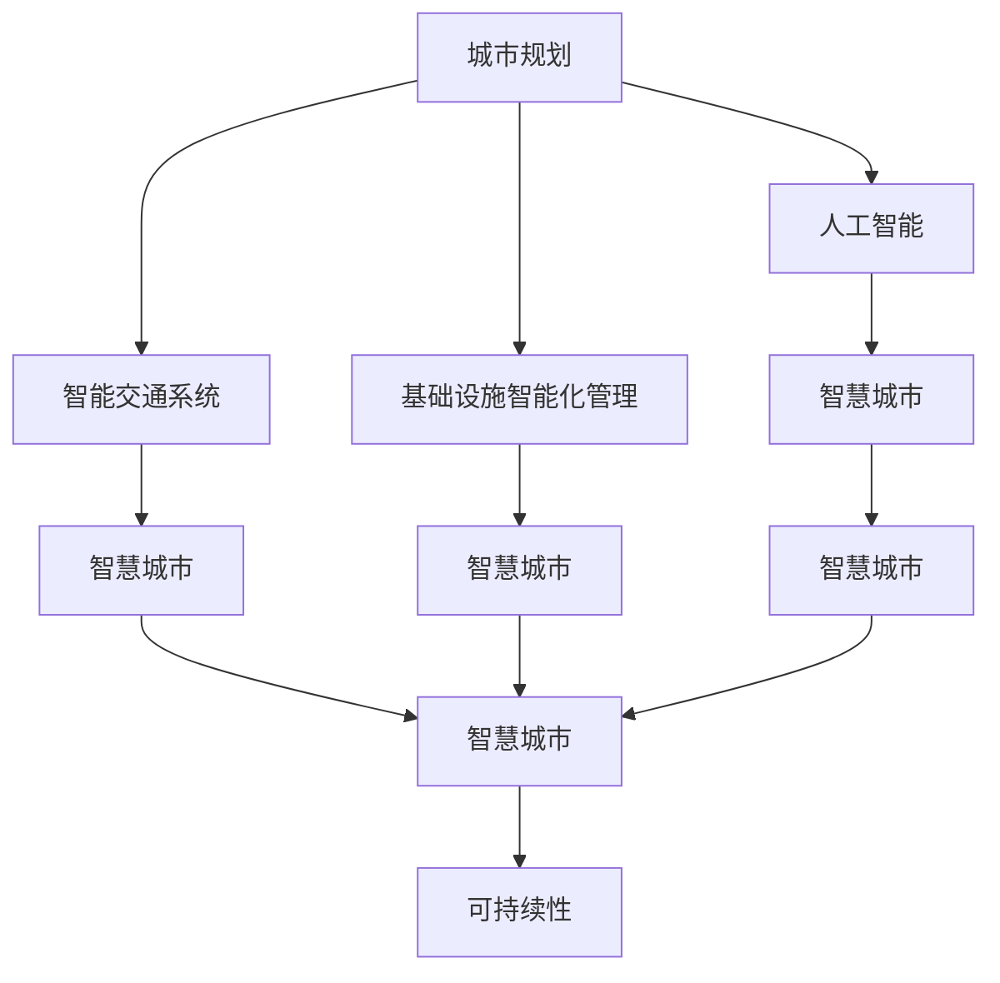

                 

# AI与人类计算：打造可持续发展的城市交通与基础设施

> 关键词：人工智能, 城市规划, 智能交通, 基础设施, 可持续性, 智慧城市, 智慧交通

## 1. 背景介绍

### 1.1 问题由来
随着城市化进程的不断加快，全球人口越来越多地向城市集中，这给城市的交通与基础设施带来了前所未有的压力。城市交通拥堵、基础设施老化、环境污染等问题的频发，使得城市治理变得尤为复杂和艰难。传统城市规划与建设方法难以应对这些挑战，需要更先进的技术手段来提供科学决策和智能管理。

近年来，人工智能技术的迅速发展为解决这些问题提供了新的可能。利用AI与人类计算相结合的方式，可以在城市规划和基础设施建设中实现智能决策，优化交通流，提高管理效率，最终实现可持续发展目标。

### 1.2 问题核心关键点
本文将围绕人工智能在城市交通与基础设施领域的应用，重点探讨以下几个核心关键点：

1. **人工智能在城市规划中的应用**：通过机器学习和大数据技术，分析城市发展趋势和空间资源，优化城市规划布局。
2. **智能交通系统构建**：利用AI技术优化交通信号控制、路径规划、车辆调度等，提高交通效率，缓解城市拥堵。
3. **基础设施智能化管理**：通过AI技术实现对建筑、桥梁、道路等基础设施的监测与维护，提升设施安全性和可靠性。
4. **智慧城市框架建设**：整合各种AI应用，形成城市管理决策支持平台，推动城市治理现代化。
5. **可持续发展目标的实现**：利用AI技术优化资源配置，减少碳排放，提升城市环境质量，实现绿色发展。

这些关键点构成了AI与人类计算在城市交通与基础设施领域应用的总体框架，旨在通过智能化手段提升城市管理水平，推动城市可持续发展。

### 1.3 问题研究意义
研究AI与人类计算在城市交通与基础设施中的应用，对城市治理和可持续发展具有重要意义：

1. **提升城市治理效率**：通过AI技术实现智能决策，减少人工干预，提高城市管理的响应速度和精准度。
2. **改善城市交通状况**：优化交通流和资源配置，缓解城市拥堵，提升居民出行体验。
3. **推动智慧城市建设**：构建统一、集成的城市管理平台，形成智能城市治理体系。
4. **促进绿色发展**：优化能源和资源使用，减少环境污染，实现城市绿色转型。
5. **保障公共安全**：通过实时监测和预测，提高基础设施安全性和灾害应对能力。

本文将系统梳理AI与人类计算在城市交通与基础设施领域的应用方法和实践案例，旨在为城市规划者和决策者提供科学依据和技术支持。

## 2. 核心概念与联系

### 2.1 核心概念概述

为更好地理解AI与人类计算在城市交通与基础设施中的应用，本节将介绍几个关键概念及其相互关系：

1. **人工智能 (AI)**：基于计算和数据驱动，模拟人类智能过程，实现智能决策、自动化和优化的一种技术手段。
2. **城市规划**：基于城市发展目标和需求，对城市空间资源的合理布局和分配。
3. **智能交通系统 (ITS)**：通过先进的信息技术和自动化技术，优化交通流和资源配置，提升交通效率和管理水平。
4. **基础设施智能化管理**：利用物联网、传感器和大数据技术，对城市基础设施进行实时监测、预测和维护，提升设施安全性和可靠性。
5. **智慧城市**：通过信息技术和AI技术整合，实现城市治理的智能化、精细化和持续化。
6. **可持续性**：在城市规划和建设中，考虑环境、社会和经济等多方面因素，追求长远发展的平衡和协调。

这些核心概念通过复杂的互动关系，共同构成了AI与人类计算在城市交通与基础设施领域应用的综合框架。

### 2.2 核心概念原理和架构的 Mermaid 流程图



这个流程图展示了城市规划与智能交通系统、基础设施智能化管理、智慧城市构建、可持续性实现之间的相互关系：

1. 城市规划作为起点，基于AI技术分析城市发展趋势和资源需求。
2. 智能交通系统通过优化交通流和资源配置，提高交通效率，为城市规划提供数据支持。
3. 基础设施智能化管理通过实时监测和预测，保障城市设施安全性和可靠性，支持智慧城市构建。
4. 智慧城市整合各类AI应用，形成统一的城市管理决策平台，推动城市治理现代化。
5. 可持续性贯穿始终，在城市规划、交通优化、设施管理等环节中，实现绿色发展和环境保护。

## 3. 核心算法原理 & 具体操作步骤

### 3.1 算法原理概述

AI与人类计算在城市交通与基础设施领域的应用，核心算法原理主要包括以下几个方面：

1. **数据驱动的决策支持**：通过收集、分析和预测城市数据，提供科学决策依据。
2. **优化算法与仿真技术**：利用优化算法和仿真技术，模拟城市系统运行状态，优化交通流和资源配置。
3. **智能感知与预测技术**：应用智能感知技术和预测算法，实时监测城市环境和基础设施状态，提前预测潜在问题。
4. **人机协作与自适应决策**：实现人机协作，通过AI技术辅助人类进行智能决策，并根据实际情况动态调整策略。

这些算法原理构成了AI与人类计算在城市交通与基础设施领域应用的技术基础。

### 3.2 算法步骤详解

AI与人类计算在城市交通与基础设施领域的具体操作步骤如下：

1. **数据收集与预处理**：收集城市交通、环境、基础设施等数据，进行清洗和预处理，构建数据集。
2. **模型训练与优化**：使用机器学习算法（如回归、分类、聚类等）训练模型，优化参数和超参数，提升模型预测精度。
3. **模型部署与应用**：将训练好的模型部署到实际场景中，实现智能决策和自动化管理。
4. **实时监测与反馈**：对城市交通、环境、基础设施等进行实时监测，根据反馈调整模型和策略，实现动态优化。
5. **评估与优化**：定期评估模型效果，结合实际应用情况，不断优化模型和算法，提升城市管理水平。

### 3.3 算法优缺点

AI与人类计算在城市交通与基础设施领域的应用，具有以下优点：

1. **提升决策效率与精准度**：通过数据驱动和智能算法，大幅提升城市决策的效率和精准度。
2. **优化资源配置**：通过优化算法和仿真技术，优化交通流和资源配置，提高资源使用效率。
3. **提升管理水平**：通过智能感知和预测技术，实现基础设施的实时监测和管理，提升城市安全性和可靠性。
4. **支持持续性发展**：通过智慧城市构建，实现城市治理的智能化、精细化和持续化，支持可持续发展目标。

同时，也存在以下缺点：

1. **数据质量依赖**：AI系统的效果高度依赖数据的质量和全面性，数据不完整或错误可能导致模型失效。
2. **模型复杂性**：大规模城市系统的复杂性使得模型设计和优化变得更加复杂和困难。
3. **技术成本高**：AI技术的研发和部署需要大量的资金和技术支持，对于一些中小城市可能面临成本压力。
4. **隐私和安全问题**：城市数据的收集和使用涉及到隐私和安全问题，需要建立完善的法律法规和隐私保护措施。

### 3.4 算法应用领域

AI与人类计算在城市交通与基础设施领域的应用，主要包括以下几个领域：

1. **城市规划与建设**：通过AI技术分析城市发展趋势和资源需求，优化城市规划布局和设计。
2. **智能交通系统**：通过优化交通信号控制、路径规划和车辆调度等，提高交通效率，缓解城市拥堵。
3. **基础设施智能化管理**：通过物联网、传感器和大数据技术，对建筑、桥梁、道路等基础设施进行实时监测和维护。
4. **智慧城市框架建设**：构建统一的智能决策支持平台，整合各种AI应用，形成城市治理的智慧体系。
5. **环境监测与保护**：利用AI技术进行空气质量监测、水资源管理等，提升城市环境保护水平。
6. **应急管理与灾害应对**：通过智能预测和预警，提高城市灾害应对能力和安全保障。

这些应用领域覆盖了城市治理和可持续发展的各个方面，展示了AI与人类计算的强大潜力。

## 4. 数学模型和公式 & 详细讲解 & 举例说明

### 4.1 数学模型构建

本节将通过数学模型构建，详细讲解AI与人类计算在城市交通与基础设施领域的应用。

假设城市交通流量为 $x$，车辆速度为 $v$，交通流量优化模型为：

$$
\min_{x, v} f(x, v)
$$

其中 $f$ 为交通流量的损失函数，通常定义为：

$$
f(x, v) = \sum_i c_i(x_i, v_i)
$$

其中 $c_i$ 为第 $i$ 个交通节点的损失函数，可以是时间、成本、能耗等。

### 4.2 公式推导过程

以下是对交通流量优化模型的详细推导过程：

假设城市交通网络由 $n$ 个节点和 $m$ 条边组成，节点 $i$ 的流量为 $x_i$，车辆速度为 $v_i$。节点 $i$ 的损失函数 $c_i$ 为：

$$
c_i(x_i, v_i) = \alpha_i x_i + \beta_i v_i + \gamma_i
$$

其中 $\alpha_i$ 为节点 $i$ 的流量成本系数，$\beta_i$ 为车辆速度成本系数，$\gamma_i$ 为常数项。

整个城市的交通流量损失函数 $f$ 为节点损失函数之和：

$$
f(x, v) = \sum_i c_i(x_i, v_i)
$$

交通流量优化问题转化为求解：

$$
\min_{x, v} f(x, v) \quad \text{s.t.} \quad \sum_i x_i = x_t
$$

其中 $x_t$ 为总交通流量。

根据线性规划理论，上述优化问题可以使用单纯形法等求解。

### 4.3 案例分析与讲解

以下是一个简单的交通流量优化案例：

假设城市有 $n=5$ 个节点，交通流量需求 $x_t=500$，节点损失函数系数 $\alpha_i=0.1$，$\beta_i=0.5$，$\gamma_i=0$。求解最优流量分配 $x_i$ 和速度 $v_i$。

设 $A$ 为节点流量系数矩阵，$b$ 为总交通流量向量，$C$ 为节点损失系数矩阵，则优化问题可表示为：

$$
\min_{x, v} x^T A C x + b^T C v
$$

根据线性规划理论，可以通过单纯形法求解。以节点 $1$ 为例，其最优流量 $x_1$ 和速度 $v_1$ 的计算公式为：

$$
x_1 = \frac{b_1}{A_{1*} C x}
$$

$$
v_1 = \frac{c_1(x_1, v_1)}{\partial c_1(x_1, v_1)/\partial v_1}
$$

通过以上步骤，即可求得整个城市的最优流量分配和速度，实现交通流量优化。

## 5. 项目实践：代码实例和详细解释说明

### 5.1 开发环境搭建

在进行AI与人类计算的城市交通与基础设施应用开发前，需要准备好开发环境。以下是使用Python进行Open Street Map (OSM)和GeoPandas库的数据处理与分析环境的配置流程：

1. 安装Anaconda：从官网下载并安装Anaconda，用于创建独立的Python环境。

2. 创建并激活虚拟环境：
```bash
conda create -n osm-env python=3.8 
conda activate osm-env
```

3. 安装Open Street Map库和GeoPandas库：
```bash
conda install pyosmium
conda install geopandas
```

4. 安装其他工具包：
```bash
pip install numpy pandas matplotlib seaborn
```

完成上述步骤后，即可在`osm-env`环境中开始城市交通数据分析与可视化。

### 5.2 源代码详细实现

下面以城市交通网络分析为例，给出使用GeoPandas库进行城市交通网络分析的Python代码实现。

首先，定义一个简单的城市交通网络：

```python
import geopandas as gpd

# 创建城市交通网络GeoDataFrame
network = gpd.GeoDataFrame(
    {'id': [1, 2, 3, 4, 5],
     'source': [0, 0, 0, 1, 1],
     'target': [0, 1, 2, 1, 3],
     'cost': [10, 20, 15, 30, 25],
     'distance': [5, 10, 7.5, 10, 8],
     'capacity': [100, 150, 200, 300, 250],
     'geometry': [gpd.Point([0, 0]), gpd.Point([5, 0]), gpd.Point([10, 0]), gpd.Point([5, 5]), gpd.Point([0, 10])],
     'name': ['road1', 'road2', 'road3', 'road4', 'road5']
)
```

然后，对城市交通网络进行可视化展示：

```python
# 绘制城市交通网络图
network.plot()
```

接着，计算城市交通网络的最小生成树：

```python
# 计算城市交通网络的最小生成树
mst = network.minimum_spanning_tree()

# 绘制最小生成树图
mst.plot()
```

最后，进行城市交通网络的最短路径分析：

```python
# 计算节点0到节点5的最短路径
shortest_path = network_shortest_path(network, source=0, target=5)

# 绘制最短路径图
shortest_path.plot()
```

以上就是使用GeoPandas库进行城市交通网络分析的完整代码实现。可以看到，GeoPandas库提供了一系列的地理数据处理与分析工具，可以方便地进行城市交通网络的数据建模、可视化和分析。

### 5.3 代码解读与分析

让我们再详细解读一下关键代码的实现细节：

**GeoPandas库**：
- `GeoDataFrame`：用于存储和操作地理数据，支持添加、删除和修改数据。
- `plot`：用于绘制地理数据，支持点、线、面等元素的可视化。
- `minimum_spanning_tree`：用于计算最小生成树，实现城市交通网络的优化。
- `network_shortest_path`：用于计算两点之间的最短路径，实现交通流量的优化。

**数据处理**：
- 城市交通网络数据存储在GeoDataFrame中，包含节点ID、源节点、目标节点、距离、成本、容量等属性。
- 通过GeoPandas库提供的函数，可以方便地进行数据处理、分析和可视化。

**优化计算**：
- 使用最小生成树算法和最短路径算法，计算城市交通网络的最优流量分配和速度。
- 通过GeoPandas库提供的绘图功能，可以将计算结果可视化，方便分析和展示。

## 6. 实际应用场景

### 6.1 智能交通系统构建

智能交通系统（ITS）通过AI技术优化交通信号控制、路径规划和车辆调度等，提高交通效率，缓解城市拥堵。在实际应用中，智能交通系统可以涵盖以下几个关键环节：

1. **交通信号控制**：通过实时监测交通流量，动态调整信号灯配时，优化交通流。
2. **路径规划与导航**：利用AI技术优化路径选择，提供最优路线建议，提升用户体验。
3. **车辆调度与监控**：通过AI技术实时监控车辆运行状态，优化调度策略，减少交通拥堵。
4. **交通数据采集与分析**：通过传感器和大数据分析技术，收集交通流量、速度、路况等数据，为决策提供支持。

### 6.2 基础设施智能化管理

基础设施智能化管理通过物联网、传感器和大数据技术，对建筑、桥梁、道路等基础设施进行实时监测和维护，提升设施安全性和可靠性。在实际应用中，基础设施智能化管理可以涵盖以下几个关键环节：

1. **基础设施监控**：通过传感器实时监测基础设施状态，如温度、湿度、应力等，实现健康监测。
2. **预测性维护**：利用AI技术预测设施故障，提前进行维护，减少意外损失。
3. **灾害预警**：通过智能感知技术监测自然灾害（如地震、洪水等），及时预警并采取措施。
4. **应急响应**：通过AI技术实时分析应急数据，优化应急资源配置，提高应急响应效率。

### 6.3 智慧城市框架建设

智慧城市框架建设通过整合各种AI应用，形成统一的城市管理决策平台，推动城市治理现代化。在实际应用中，智慧城市框架建设可以涵盖以下几个关键环节：

1. **数据融合与共享**：通过统一的数据平台，整合各类数据，实现数据融合与共享。
2. **智能决策支持**：利用AI技术辅助城市管理决策，提高决策效率和准确性。
3. **智能应用集成**：通过API接口和微服务架构，集成各类智能应用，形成统一的平台。
4. **用户互动与服务**：提供智能化的城市服务，如智能公交、智能停车等，提升用户体验。

## 7. 工具和资源推荐

### 7.1 学习资源推荐

为了帮助开发者系统掌握AI与人类计算在城市交通与基础设施领域的应用方法，这里推荐一些优质的学习资源：

1. **《人工智能与城市规划》系列博文**：由城市规划领域专家撰写，深入浅出地介绍了AI技术在城市规划中的应用方法和实践案例。
2. **《智能交通系统》课程**：由交通工程领域专家开设的在线课程，涵盖了智能交通系统的各个方面，包括传感器、通信技术、控制策略等。
3. **《智慧城市建设》书籍**：智慧城市领域经典著作，详细介绍了智慧城市建设的方法和案例，适合系统学习智慧城市的技术框架和管理体系。
4. **GeoPandas官方文档**：GeoPandas库的官方文档，提供了丰富的地理数据处理与分析工具和样例代码，适合快速上手实践。
5. **Open Street Map官方文档**：Open Street Map库的官方文档，详细介绍了如何获取和使用开源地图数据，适合进行城市交通网络分析和建模。

通过对这些资源的学习实践，相信你一定能够快速掌握AI与人类计算在城市交通与基础设施领域的应用方法，并用于解决实际的智能城市问题。

### 7.2 开发工具推荐

高效的开发离不开优秀的工具支持。以下是几款用于AI与人类计算的城市交通与基础设施开发常用的工具：

1. **GeoPandas库**：用于地理数据处理与分析的Python库，支持对GeoDataFrame进行数据建模、可视化和分析。
2. **Open Street Map库**：用于获取和使用开源地图数据，支持地理数据采集、处理和可视化。
3. **TensorFlow和PyTorch**：流行的深度学习框架，支持各种机器学习算法和大规模数据处理。
4. **Jupyter Notebook**：交互式编程环境，支持多种语言和库的集成，适合进行科学计算和数据可视化。
5. **Gephi**：开源的社交网络分析软件，支持复杂网络图谱的构建和分析。

合理利用这些工具，可以显著提升AI与人类计算在城市交通与基础设施领域的应用开发效率，加快创新迭代的步伐。

### 7.3 相关论文推荐

AI与人类计算在城市交通与基础设施领域的发展源于学界的持续研究。以下是几篇奠基性的相关论文，推荐阅读：

1. **《城市交通网络优化模型》**：提出了基于最小生成树和最短路径算法的城市交通网络优化模型，为智能交通系统提供理论支持。
2. **《基础设施智能化管理的AI技术应用》**：总结了AI技术在基础设施智能化管理中的应用案例，包括传感器、预测性维护等技术。
3. **《智慧城市框架的构建方法》**：提出了智慧城市框架的构建方法，包括数据融合、智能决策和应用集成等环节。
4. **《可持续发展的城市交通系统》**：提出了基于AI技术的可持续交通系统构建方法，包括智能信号控制、路径规划等技术。
5. **《基于AI的城市应急管理》**：提出了基于AI技术的应急响应和灾害预警方法，提升了城市应急管理的效率和效果。

这些论文代表了大规模AI技术在城市交通与基础设施领域的研究进展，通过学习这些前沿成果，可以帮助研究者把握学科前进方向，激发更多的创新灵感。

## 8. 总结：未来发展趋势与挑战

### 8.1 总结

本文对AI与人类计算在城市交通与基础设施领域的应用进行了全面系统的介绍。首先阐述了AI技术在城市规划、智能交通、基础设施智能化管理等各个领域的应用背景和意义，明确了其在推动城市治理和可持续发展中的独特价值。其次，从原理到实践，详细讲解了AI技术在城市交通与基础设施领域的具体实现方法，提供了城市交通网络分析、智能交通系统、基础设施智能化管理等实践案例。同时，本文还广泛探讨了AI技术在城市交通与基础设施领域的应用前景，展示了其在智能交通、智慧城市、环境监测等领域的广阔应用空间。

通过本文的系统梳理，可以看到，AI与人类计算在城市交通与基础设施领域的应用不仅具有重要的学术意义，更具有广阔的实践价值。其通过数据驱动和智能算法，大幅提升了城市管理水平，优化了交通流和资源配置，推动了城市治理的现代化和可持续发展。未来，随着AI技术的不断进步，其在城市交通与基础设施领域的应用将更加深入和广泛。

### 8.2 未来发展趋势

展望未来，AI与人类计算在城市交通与基础设施领域的应用将呈现以下几个发展趋势：

1. **智能化程度不断提高**：通过更加先进的数据处理和算法优化，AI系统将实现更高程度的智能化，进一步提升城市管理效率。
2. **跨领域融合发展**：AI技术与其他领域的融合将更加紧密，如智慧能源、智能农业等，形成更加综合的城市管理系统。
3. **个性化服务增强**：通过AI技术实现更精确的用户需求分析，提供更加个性化的城市服务，提升用户体验。
4. **人机协作更加深入**：通过人机协作和自适应决策，提升城市管理的灵活性和应对能力，实现更加智能化的城市治理。
5. **可持续发展目标的实现**：通过AI技术优化资源配置，减少碳排放，提升城市环境质量，实现绿色发展。

以上趋势凸显了AI与人类计算在城市交通与基础设施领域的应用潜力。这些方向的探索发展，必将进一步提升城市管理水平，推动城市治理的现代化和可持续发展。

### 8.3 面临的挑战

尽管AI与人类计算在城市交通与基础设施领域的应用已经取得了显著进展，但在迈向更加智能化、普适化应用的过程中，仍面临诸多挑战：

1. **数据获取与处理**：城市数据的获取与处理涉及到隐私和安全问题，需要建立完善的法律法规和隐私保护措施。
2. **模型复杂性**：大规模城市系统的复杂性使得模型设计和优化变得更加复杂和困难。
3. **技术成本高**：AI技术的研发和部署需要大量的资金和技术支持，对于一些中小城市可能面临成本压力。
4. **算法透明性与可解释性**：AI系统的决策过程往往缺乏可解释性，难以对其推理逻辑进行分析和调试，需要进一步提高算法的透明性和可解释性。
5. **技术标准与规范**：不同城市和区域在AI技术应用上存在差异，需要制定统一的技术标准和规范，保障系统互操作性。

这些挑战需要在未来的研究与实践中不断克服，以实现AI与人类计算在城市交通与基础设施领域的全面应用。

### 8.4 研究展望

面对AI与人类计算在城市交通与基础设施领域面临的挑战，未来的研究需要在以下几个方面寻求新的突破：

1. **数据隐私与安全**：研究如何在数据收集和处理过程中，保护用户隐私和安全，建立完善的法律法规和隐私保护机制。
2. **模型简化与优化**：研究更加轻量级和高效的模型结构，减少计算资源消耗，提升系统响应速度。
3. **算法透明性与可解释性**：研究如何提高AI算法的透明性和可解释性，提升算法的可信度和可靠性。
4. **跨领域融合与协同**：研究AI技术与其他领域的深度融合，提升系统的综合性和实用性。
5. **标准化与规范制定**：研究制定统一的技术标准和规范，保障系统互操作性，推动AI技术在城市交通与基础设施领域的广泛应用。

这些研究方向的探索，必将引领AI与人类计算在城市交通与基础设施领域的应用进入新的阶段，为实现智慧城市和可持续发展目标提供坚实的基础。面向未来，需要多方协同，共同推动AI技术与城市治理的深度融合，构建更加智能、高效、可持续的城市系统。

## 9. 附录：常见问题与解答

**Q1：AI与人类计算在城市交通与基础设施领域的应用是否会替代传统方法？**

A: AI与人类计算在城市交通与基础设施领域的应用，不是替代传统方法，而是辅助传统方法，通过数据驱动和智能算法，提升决策效率和精准度。AI技术与传统方法可以互补，共同推动城市治理的现代化。

**Q2：AI与人类计算在城市交通与基础设施领域的应用是否会带来数据隐私和安全问题？**

A: AI系统的数据获取和处理涉及到隐私和安全问题，需要建立完善的法律法规和隐私保护措施。通过数据匿名化、加密等技术，可以在保护隐私的前提下，利用城市数据进行智能分析和决策。

**Q3：AI与人类计算在城市交通与基础设施领域的应用是否会带来技术成本高的问题？**

A: AI技术的研发和部署需要大量的资金和技术支持，对于一些中小城市可能面临成本压力。可以通过分阶段实施、技术外包等方式，降低技术成本，推动AI技术在城市治理中的广泛应用。

**Q4：AI与人类计算在城市交通与基础设施领域的应用是否会带来算法透明性与可解释性不足的问题？**

A: AI系统的决策过程往往缺乏可解释性，难以对其推理逻辑进行分析和调试。需要通过提升算法的透明性和可解释性，建立可信任的AI系统，保障系统的可靠性。

**Q5：AI与人类计算在城市交通与基础设施领域的应用是否会带来标准化与规范制定困难的问题？**

A: 不同城市和区域在AI技术应用上存在差异，需要制定统一的技术标准和规范，保障系统互操作性。通过多方协作，制定行业标准和规范，可以推动AI技术在城市交通与基础设施领域的应用规范化和标准化。

通过这些问题的回答，相信你对AI与人类计算在城市交通与基础设施领域的应用有了更加全面的理解。通过本文的系统梳理，可以看到，AI与人类计算在城市交通与基础设施领域的应用不仅具有重要的学术意义，更具有广阔的实践价值。其通过数据驱动和智能算法，大幅提升了城市管理水平，优化了交通流和资源配置，推动了城市治理的现代化和可持续发展。未来，随着AI技术的不断进步，其在城市交通与基础设施领域的应用将更加深入和广泛。

作者：禅与计算机程序设计艺术 / Zen and the Art of Computer Programming

