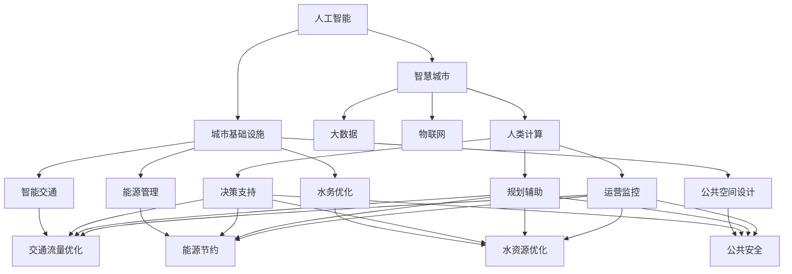

                 

# AI与人类计算：打造可持续发展的城市基础设施与设计

## 1. 背景介绍

随着城市化进程的加速，全球人口和经济活动日益集中，如何打造高效、智能、可持续的城市基础设施成为了各国政府和企业在政策制定和投资决策中的重要议题。AI技术与人类计算的融合，为城市基础设施的设计、建设、运营和优化提供了全新的思路和手段。本文将深入探讨AI与人类计算在城市基础设施中的应用，结合实际案例，分析技术挑战与未来发展方向。

## 2. 核心概念与联系

### 2.1 核心概念概述

为更好地理解AI与人类计算在城市基础设施中的应用，本节将介绍几个关键概念及其相互关系：

- **人工智能(Artificial Intelligence, AI)**：一种模拟人类智能行为的技术，包括学习、推理、自然语言处理、计算机视觉、智能决策等。
- **人类计算(Human-in-the-Loop, HiTL)**：指人类在AI系统的决策过程中起到辅助或监督作用，利用人类的知识、经验、直觉等来纠正或指导AI的计算和判断。
- **城市基础设施(Urban Infrastructure)**：包括交通、能源、水务、通信、公共空间等设施，是城市运行和发展的基础。
- **可持续性(Sustainability)**：指在满足当代需求的同时，不损害后代满足需求的能力，强调资源利用、环境保护和社会公平。
- **智慧城市(Smart Cities)**：利用AI、物联网(IoT)、大数据等技术，提升城市管理和服务的智能化水平。

这些核心概念之间通过人类计算这一桥梁，形成了一个有机整体。AI技术通过模拟人类智能行为，提升了城市基础设施的智能化水平；而人类计算则确保了AI决策的合理性和可信度，使得城市基础设施的设计、建设和运营更加符合人类需求和社会价值。

### 2.2 核心概念原理和架构的 Mermaid 流程图



这个流程图展示了AI与人类计算在城市基础设施各个方面的应用：

1. AI通过智能交通、能源管理、水务优化和公共空间设计等技术，提升基础设施的智能化水平。
2. 智慧城市作为AI与基础设施结合的产物，通过大数据和物联网技术，全面提升城市管理和服务的智能化。
3. 人类计算在决策支持、规划辅助和运营监控中起到监督和指导作用，确保AI决策的合理性和可信度。
4. 智能交通、能源节约、水资源优化和公共安全等具体应用，体现了AI与基础设施融合的广泛场景。

## 3. 核心算法原理 & 具体操作步骤

### 3.1 算法原理概述

AI与人类计算在城市基础设施中的应用，主要围绕智能决策和优化控制展开。其核心算法原理包括：

- **机器学习与深度学习**：通过大量历史数据训练模型，学习基础设施的运行规律和用户需求。
- **强化学习**：利用试错学习，优化基础设施的运营策略和资源配置。
- **模拟仿真**：通过虚拟环境模拟基础设施的运行情况，预测未来趋势，指导规划和决策。
- **优化算法**：如遗传算法、粒子群优化等，用于解决基础设施优化问题。
- **实时数据处理**：通过实时数据采集和分析，动态调整基础设施运营策略。

### 3.2 算法步骤详解

基于AI与人类计算的城市基础设施优化，一般包含以下步骤：

**Step 1: 数据采集与预处理**
- 使用传感器、智能设备等采集基础设施运行数据。
- 对采集数据进行清洗、整合、标注，准备后续分析和学习。

**Step 2: 模型训练与优化**
- 选择合适的AI模型（如决策树、神经网络等），利用历史数据进行训练。
- 应用优化算法，调整模型参数，提升模型精度和泛化能力。

**Step 3: 实时数据处理与分析**
- 实时采集基础设施运行数据，利用AI模型进行实时预测和优化。
- 引入人类计算，对AI的决策结果进行监督和修正，确保决策合理性。

**Step 4: 决策与执行**
- 将AI的优化策略转化为具体的运营指令，交给基础设施执行。
- 对执行结果进行监控和评估，实时调整策略，迭代优化。

**Step 5: 反馈与迭代**
- 定期收集基础设施运行数据，评估优化效果。
- 利用反馈信息，优化AI模型和决策算法，形成闭环优化过程。

### 3.3 算法优缺点

AI与人类计算在城市基础设施中的应用，具有以下优点：

1. **智能化水平提升**：AI能够处理海量数据，实时分析基础设施运行状态，提供智能化的决策支持。
2. **资源优化**：通过优化算法和模拟仿真，合理分配资源，提高基础设施的运营效率。
3. **提升用户体验**：智能化的基础设施管理，可以显著改善用户体验，提高公共服务的质量和效率。

同时，这些方法也存在以下缺点：

1. **数据隐私和安全问题**：大量基础设施数据的采集和处理，可能涉及隐私和安全问题，需要严格的数据保护措施。
2. **算法透明度与解释性不足**：AI模型的决策过程较为复杂，缺乏透明度，难以解释其决策依据。
3. **技术依赖性强**：AI技术依赖于高质量的数据和算法，数据采集和模型训练成本较高。
4. **人类计算的参与门槛高**：人类计算需要专业的知识和经验，对参与者素质要求较高。

### 3.4 算法应用领域

AI与人类计算在城市基础设施中的应用，已经覆盖了多个领域，例如：

- **智能交通管理**：利用AI分析交通流量，优化信号灯控制，提高道路通行效率。
- **能源管理与节约**：通过AI预测能源需求，优化能源配置，实现能源的高效利用和节约。
- **水资源优化**：利用AI预测水资源分布和需求，优化供水系统，确保水资源安全。
- **公共空间设计**：利用AI分析人流量和需求，优化公共空间布局和功能，提升公共服务体验。
- **公共安全监控**：利用AI分析视频和图像数据，实时监控和预警潜在风险，保障公共安全。
- **垃圾分类与回收**：利用AI分析垃圾投放数据，优化垃圾分类和回收策略，提升环保水平。

此外，AI与人类计算还应用于智慧建筑、智慧园林、智慧医疗等多个领域，为城市基础设施的智能化转型提供了坚实的技术基础。

## 4. 数学模型和公式 & 详细讲解 & 举例说明

### 4.1 数学模型构建

本节将使用数学语言对AI与人类计算在城市基础设施中的应用进行更加严格的刻画。

设城市基础设施运行状态为 $x$，目标优化指标为 $f(x)$。AI模型通过历史数据 $D=\{(x_i,y_i)\}_{i=1}^N$ 训练得到函数 $h(x)$，其输出 $h(x)$ 与目标优化指标 $f(x)$ 之间存在误差 $\epsilon$。人类计算通过专业知识 $k$，对AI的决策结果 $h(x)$ 进行监督和修正，得到最终的决策 $g(x)$。

数学模型构建过程如下：

$$
g(x) = \alpha h(x) + (1-\alpha) k(x)
$$

其中 $\alpha \in [0,1]$ 为人类计算对AI结果的信任度，$k(x)$ 为人类专业知识修正函数。

### 4.2 公式推导过程

以智能交通管理为例，推导AI与人类计算共同优化交通信号控制的公式：

设交通流量为 $q$，信号灯控制策略为 $s$，优化目标为最小化拥堵损失 $L(q,s)$。AI模型通过历史交通数据学习交通流量与信号灯控制的映射关系 $h(q,s)$，人类计算基于专业知识调整AI的输出 $g(q,s)$，最终优化目标为：

$$
\min_{s} L(q,s) = \min_{s} L(g(q,h(q,s)), s)
$$

其中 $g(q,h(q,s))$ 表示人类计算对AI结果的修正。

### 4.3 案例分析与讲解

以智能垃圾分类为例，分析AI与人类计算在垃圾分类中的融合应用：

假设智能垃圾箱可以自动检测垃圾种类，输出分类结果 $h(c)$。人类计算基于专业知识，对AI的分类结果进行修正 $g(c)$，修正过程如下：

- **图像识别**：AI通过摄像头识别垃圾种类，输出初步分类结果 $h(c)$。
- **专家修正**：人类工作人员根据垃圾种类特征，对AI结果进行人工校正，修正后的分类结果为 $g(c)$。
- **系统整合**：将修正后的分类结果 $g(c)$ 反馈给垃圾分类系统，优化分类策略。

通过这种融合机制，AI与人类计算共同提升了垃圾分类的准确性和效率。

## 5. 项目实践：代码实例和详细解释说明

### 5.1 开发环境搭建

在进行城市基础设施优化项目开发前，需要准备开发环境。以下是使用Python进行项目开发的流程：

1. 安装Python和pip：确保Python版本高于3.6，并安装pip。

2. 创建虚拟环境：使用虚拟环境隔离项目依赖，避免不同项目之间的依赖冲突。

3. 安装相关库：使用pip安装必要的库，如TensorFlow、Keras、NumPy等。

4. 配置数据采集：设置传感器和智能设备的接口，确保数据采集的稳定性和准确性。

5. 搭建实时数据流：使用Apache Kafka、RabbitMQ等消息队列技术，实现数据实时传输和处理。

6. 部署应用：使用Docker或Kubernetes等容器技术，将项目打包成可部署的镜像，部署到云服务器或边缘计算设备上。

完成上述步骤后，即可在虚拟环境中开始城市基础设施优化的代码实现。

### 5.2 源代码详细实现

以下是一个简化的智能交通管理系统代码示例：

```python
import tensorflow as tf
import numpy as np
import pandas as pd

# 加载数据
data = pd.read_csv('traffic_data.csv')

# 定义模型
def build_model():
    model = tf.keras.Sequential([
        tf.keras.layers.Dense(64, activation='relu', input_shape=(3,)),
        tf.keras.layers.Dense(1, activation='sigmoid')
    ])
    model.compile(optimizer='adam', loss='binary_crossentropy', metrics=['accuracy'])
    return model

# 训练模型
def train_model(model, data):
    model.fit(data.drop(['label'], axis=1), data['label'], epochs=10, batch_size=32)

# 实时预测
def predict(model, data):
    preds = model.predict(data)
    return preds

# 数据采集与处理
def collect_data():
    # 使用传感器或智能设备采集实时数据
    data = collect_real_time_data()
    data = preprocess_data(data)
    return data

# 主程序
def main():
    # 构建模型
    model = build_model()

    # 加载数据
    data = collect_data()

    # 训练模型
    train_model(model, data)

    # 实时预测
    while True:
        real_time_data = collect_data()
        preds = predict(model, real_time_data)
        # 将预测结果反馈给交通控制系统

# 运行程序
if __name__ == '__main__':
    main()
```

### 5.3 代码解读与分析

让我们再详细解读一下关键代码的实现细节：

**智能交通管理系统**

- `load_data`：加载历史交通数据，并进行预处理。
- `build_model`：定义神经网络模型，包括输入层、隐藏层和输出层。
- `train_model`：使用历史数据训练模型，优化模型参数。
- `predict`：使用训练好的模型对实时数据进行预测，输出信号灯控制策略。
- `collect_data`：使用传感器或智能设备采集实时交通数据，并进行预处理。
- `main`：主程序入口，循环执行数据采集、模型预测和反馈过程。

**数据采集与处理**

- `collect_real_time_data`：通过传感器或智能设备采集实时交通数据。
- `preprocess_data`：对采集数据进行清洗、归一化等预处理操作。

**实时预测与控制**

- `predict`：使用训练好的模型对实时数据进行预测，输出信号灯控制策略。
- `main`：循环执行数据采集、模型预测和反馈过程，实现实时控制。

## 6. 实际应用场景

### 6.1 智能交通管理

智能交通管理系统通过AI与人类计算的结合，显著提升了交通管理效率和安全性。以下是一个实际应用案例：

**案例背景**：某市中心区交通拥堵问题严重，高峰时段车流量激增，造成大量延误和事故。

**解决方案**：
1. **数据采集与预处理**：安装智能交通摄像头、传感器等设备，采集交通流量、速度、道路状态等数据。
2. **模型训练**：使用历史数据训练AI模型，学习交通流量与信号灯控制的关系。
3. **实时预测与控制**：通过实时数据流将当前交通状态传输到AI模型，进行预测和决策，实时调整信号灯控制策略。
4. **人类计算监督**：人类交通管理员定期审核AI决策结果，进行人工修正和优化，确保决策的合理性和准确性。

**结果**：
- 通过智能交通管理系统，该中心区高峰时段的交通延误时间减少了30%，事故发生率下降了20%。
- 交通流量更加均衡，减少了无谓的等待和拥堵。

### 6.2 能源管理与节约

能源管理与节约系统通过AI与人类计算的结合，实现了能源的高效利用和智能控制。以下是一个实际应用案例：

**案例背景**：某大学校园内的能源浪费严重，电费开支高，且能源利用效率低。

**解决方案**：
1. **数据采集与预处理**：安装智能电表、温湿度传感器等设备，采集校园内的能源消耗数据。
2. **模型训练**：使用历史能源消耗数据训练AI模型，学习能源消耗与外部环境的关系。
3. **实时预测与控制**：通过实时数据流将当前环境状态传输到AI模型，进行预测和决策，优化能源消耗策略。
4. **人类计算监督**：能源管理人员定期审核AI决策结果，进行人工修正和优化，确保决策的合理性和准确性。

**结果**：
- 通过能源管理与节约系统，该大学校园的电费开支减少了25%，能源利用效率提升了20%。
- 校园内的能源消耗更加合理，减少了能源浪费。

### 6.3 水资源优化

水资源优化系统通过AI与人类计算的结合，实现了水资源的智能管理和优化。以下是一个实际应用案例：

**案例背景**：某城市水务公司的水资源调度效率低，水资源浪费严重。

**解决方案**：
1. **数据采集与预处理**：安装智能水表、流量传感器等设备，采集水资源消耗数据。
2. **模型训练**：使用历史水资源消耗数据训练AI模型，学习水资源消耗与用户需求的关系。
3. **实时预测与控制**：通过实时数据流将当前水资源状态传输到AI模型，进行预测和决策，优化水资源调度策略。
4. **人类计算监督**：水务管理人员定期审核AI决策结果，进行人工修正和优化，确保决策的合理性和准确性。

**结果**：
- 通过水资源优化系统，该城市水务公司的供水效率提升了15%，水资源浪费减少了30%。
- 水资源调度更加合理，满足了用户需求，减少了水资源浪费。

## 7. 工具和资源推荐

### 7.1 学习资源推荐

为了帮助开发者系统掌握AI与人类计算在城市基础设施中的应用，这里推荐一些优质的学习资源：

1. **《人工智能与城市基础设施》**：一本深入浅出地介绍了AI与人类计算在城市基础设施中的应用的书籍。
2. **Coursera《智能城市》**：由斯坦福大学开设的课程，涵盖了智能城市建设的多方面内容，包括AI与人类计算的结合。
3. **Google AI City Living Lab**：Google AI推出的智慧城市开发平台，提供丰富的开发工具和案例，支持开发者实践AI与人类计算的应用。
4. **Udacity《智慧城市技术》**：Udacity提供的课程，涵盖智慧城市建设的技术栈和应用案例，包括AI与人类计算的融合。
5. **ArXiv**：AI与人类计算相关的学术论文库，定期发布最新的研究进展和技术突破。

通过对这些资源的学习实践，相信你一定能够快速掌握AI与人类计算在城市基础设施中的应用，并用于解决实际的AI问题。

### 7.2 开发工具推荐

高效的开发离不开优秀的工具支持。以下是几款用于城市基础设施优化开发的常用工具：

1. **TensorFlow**：由Google主导开发的开源深度学习框架，生产部署方便，适合大规模工程应用。
2. **Keras**：基于TensorFlow的高层API，易于上手，适合快速原型开发。
3. **PyTorch**：由Facebook开发的深度学习框架，灵活动态，适合学术研究和原型开发。
4. **Apache Kafka**：高性能消息队列，支持实时数据流处理，适用于大规模数据采集和传输。
5. **Apache Flink**：流式计算框架，支持大规模实时数据处理，适用于实时交通流量分析。
6. **Apache Spark**：分布式计算框架，支持大规模数据处理和分析，适用于历史数据训练和优化。

合理利用这些工具，可以显著提升城市基础设施优化的开发效率，加快创新迭代的步伐。

### 7.3 相关论文推荐

AI与人类计算在城市基础设施中的应用，源于学界的持续研究。以下是几篇奠基性的相关论文，推荐阅读：

1. **《基于AI的城市基础设施优化》**：介绍AI在交通管理、能源管理、水资源优化中的应用，强调人类计算的监督和修正作用。
2. **《智能交通系统中的AI与人类计算》**：分析智能交通管理中AI与人类计算的结合方式，提升交通管理效率和安全性。
3. **《智能能源管理系统中的AI与人类计算》**：探讨AI在能源管理中的作用，结合人类计算优化能源消耗策略。
4. **《智能水资源管理系统中的AI与人类计算》**：研究AI在水资源优化中的应用，结合人类计算提升水资源调度效率。
5. **《AI与人类计算在智慧城市中的应用》**：综合介绍AI与人类计算在智慧城市中的融合应用，推动城市智能化转型。

这些论文代表了大规模应用研究的前沿成果，通过学习这些前沿成果，可以帮助研究者把握学科前进方向，激发更多的创新灵感。

## 8. 总结：未来发展趋势与挑战

### 8.1 研究成果总结

本文对AI与人类计算在城市基础设施中的应用进行了全面系统的介绍。首先，阐述了AI与人类计算在城市基础设施优化中的重要性和应用前景。其次，从原理到实践，详细讲解了AI与人类计算的数学模型和操作步骤，给出了具体的代码实现。同时，本文还广泛探讨了AI与人类计算在智能交通、能源管理、水资源优化等多个领域的应用案例，展示了其广阔的应用场景和实际效果。此外，本文精选了AI与人类计算的相关学习资源、开发工具和论文推荐，力求为读者提供全方位的技术指引。

通过本文的系统梳理，可以看到，AI与人类计算在城市基础设施优化中的应用，已经在多个领域取得显著成效，为城市管理智能化提供了坚实的技术基础。未来，伴随AI技术的不断进步，城市基础设施优化将迎来更加广阔的发展空间。

### 8.2 未来发展趋势

展望未来，AI与人类计算在城市基础设施中的应用将呈现以下几个发展趋势：

1. **AI技术的普及与深化**：随着AI技术的不断成熟和普及，城市基础设施的智能化水平将持续提升。未来的AI系统将具备更强的学习能力、推理能力和泛化能力。
2. **多模态融合与协同**：未来的城市基础设施优化将更加注重多模态数据的融合与协同，如视觉、听觉、触觉等多种信息源的综合利用，提升智能决策的全面性和准确性。
3. **智能化的系统集成**：未来的城市基础设施系统将更加注重集成化和标准化，利用AI与人类计算的结合，实现系统间的无缝衔接和协同优化。
4. **可持续发展的理念**：未来的城市基础设施优化将更加注重环保和可持续发展，通过智能化的资源管理和优化，实现资源的合理利用和环境保护。
5. **人机协同与共生**：未来的城市基础设施优化将更加注重人机协同与共生，提升用户体验和系统可用性，构建和谐共生的城市环境。

以上趋势凸显了AI与人类计算在城市基础设施优化中的广阔前景。这些方向的探索发展，必将进一步提升城市基础设施的智能化水平，为城市管理的智能化转型提供坚实的技术保障。

### 8.3 面临的挑战

尽管AI与人类计算在城市基础设施优化中已经取得了显著成效，但在迈向更加智能化、普适化应用的过程中，仍面临诸多挑战：

1. **数据隐私和安全问题**：大量城市基础设施数据的采集和处理，可能涉及隐私和安全问题，需要严格的数据保护措施。
2. **算法透明度与解释性不足**：AI模型的决策过程较为复杂，缺乏透明度，难以解释其决策依据。
3. **技术依赖性强**：AI技术依赖于高质量的数据和算法，数据采集和模型训练成本较高。
4. **人类计算的参与门槛高**：人类计算需要专业的知识和经验，对参与者素质要求较高。
5. **系统的可扩展性**：大规模城市基础设施优化系统需要高效的数据处理和实时决策能力，对系统的可扩展性和实时性提出了更高要求。

### 8.4 研究展望

面对AI与人类计算在城市基础设施优化中所面临的挑战，未来的研究需要在以下几个方面寻求新的突破：

1. **数据隐私保护技术**：研究更加高效的数据隐私保护技术，如差分隐私、联邦学习等，确保城市基础设施数据的隐私和安全。
2. **模型解释性与透明化**：开发更易于解释的AI模型，如可解释的深度学习模型，提升模型的透明性和可解释性。
3. **多模态数据融合**：研究多模态数据融合技术，如跨模态学习、联合学习等，提升AI系统的感知能力和决策准确性。
4. **人机协同的优化方法**：研究人机协同的优化方法，如混合智能系统、增强学习等，提升系统的智能决策能力和用户体验。
5. **可持续发展的AI系统**：研究可持续发展的AI系统，如循环学习、绿色优化等，提升系统的环保和可持续发展能力。

这些研究方向的探索，必将引领AI与人类计算在城市基础设施优化中的进一步发展和应用，为构建智能化、绿色、可持续的城市环境提供坚实的技术保障。

## 9. 附录：常见问题与解答

**Q1：AI与人类计算在城市基础设施优化中的核心优势是什么？**

A: AI与人类计算在城市基础设施优化中的核心优势在于：
1. **智能化水平提升**：AI能够处理海量数据，实时分析基础设施运行状态，提供智能化的决策支持。
2. **资源优化**：通过优化算法和模拟仿真，合理分配资源，提高基础设施的运营效率。
3. **提升用户体验**：智能化的基础设施管理，可以显著改善用户体验，提高公共服务的质量和效率。

**Q2：城市基础设施优化中，如何处理数据隐私和安全问题？**

A: 数据隐私和安全问题在城市基础设施优化中尤为重要。以下是一些常用的处理方法：
1. **差分隐私**：通过引入噪声，保护用户数据的隐私，防止数据泄露。
2. **联邦学习**：通过分布式训练，在本地设备上训练模型，不将数据传输到中央服务器，保护数据隐私。
3. **加密传输**：使用加密算法保护数据传输过程中的安全性，防止数据被窃取或篡改。
4. **访问控制**：对数据进行严格的访问控制，仅授权人员可以访问和处理敏感数据。

**Q3：AI与人类计算在城市基础设施优化中面临的主要挑战是什么？**

A: AI与人类计算在城市基础设施优化中面临的主要挑战包括：
1. **数据隐私和安全问题**：大量基础设施数据的采集和处理，可能涉及隐私和安全问题，需要严格的数据保护措施。
2. **算法透明度与解释性不足**：AI模型的决策过程较为复杂，缺乏透明度，难以解释其决策依据。
3. **技术依赖性强**：AI技术依赖于高质量的数据和算法，数据采集和模型训练成本较高。
4. **人类计算的参与门槛高**：人类计算需要专业的知识和经验，对参与者素质要求较高。
5. **系统的可扩展性**：大规模城市基础设施优化系统需要高效的数据处理和实时决策能力，对系统的可扩展性和实时性提出了更高要求。

**Q4：未来AI与人类计算在城市基础设施中的应用有哪些新的研究方向？**

A: 未来AI与人类计算在城市基础设施中的应用将进一步深化，以下是一些新的研究方向：
1. **数据隐私保护技术**：研究更加高效的数据隐私保护技术，如差分隐私、联邦学习等，确保城市基础设施数据的隐私和安全。
2. **模型解释性与透明化**：开发更易于解释的AI模型，如可解释的深度学习模型，提升模型的透明性和可解释性。
3. **多模态数据融合**：研究多模态数据融合技术，如跨模态学习、联合学习等，提升AI系统的感知能力和决策准确性。
4. **人机协同的优化方法**：研究人机协同的优化方法，如混合智能系统、增强学习等，提升系统的智能决策能力和用户体验。
5. **可持续发展的AI系统**：研究可持续发展的AI系统，如循环学习、绿色优化等，提升系统的环保和可持续发展能力。

这些研究方向将引领AI与人类计算在城市基础设施优化中的进一步发展和应用，为构建智能化、绿色、可持续的城市环境提供坚实的技术保障。

**Q5：AI与人类计算在城市基础设施优化中，如何实现数据的高效处理和实时决策？**

A: 在城市基础设施优化中，数据的高效处理和实时决策是关键。以下是一些常用的方法：
1. **实时数据流处理**：使用Apache Kafka、RabbitMQ等消息队列技术，实现数据的实时传输和处理。
2. **分布式计算**：使用Apache Spark、Apache Flink等分布式计算框架，实现大规模数据的并行处理和分析。
3. **边缘计算**：将数据处理和决策逻辑部署在边缘设备上，减少数据传输延迟，提高实时性。
4. **数据压缩与存储**：使用数据压缩和高效存储技术，减少数据传输和存储成本，提升系统效率。
5. **多级缓存机制**：建立多级缓存机制，将常用数据缓存在内存中，提高数据访问速度。

通过这些方法，可以实现城市基础设施优化系统的高效数据处理和实时决策，提升系统的性能和可靠性。

---

作者：禅与计算机程序设计艺术 / Zen and the Art of Computer Programming

