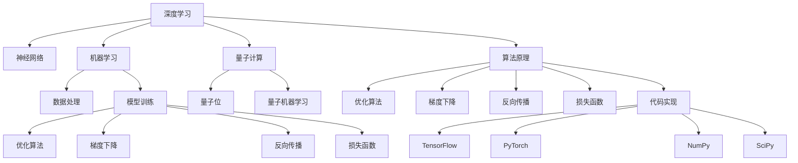

                 

# AI与物理学交叉原理与代码实战案例讲解

> 关键词：AI与物理学交叉,深度学习,机器学习,量子计算,量子机器学习,算法原理,代码实战,案例讲解

## 1. 背景介绍

### 1.1 问题由来
近年来，人工智能（AI）和物理学之间的交叉研究成为学术界和工业界的热点话题。这不仅是因为AI技术的发展为物理学研究提供了新的工具和方法，同时也因为物理学理论为AI提供了新的思路和灵感。在这篇博客中，我们将深入探讨AI与物理学的交叉原理，并通过代码实例讲解如何在实际项目中应用这些原理。

### 1.2 问题核心关键点
AI与物理学的交叉主要涉及以下几个方面：

- **理论基础**：AI与物理学的理论基础是深度学习（Deep Learning）和机器学习（Machine Learning）算法。这些算法为物理学研究提供了新的数据分析和模型构建方法。
- **实际应用**：量子计算和量子机器学习是当前AI与物理学交叉的热点领域，这些技术为物理学的研究提供了新的计算能力和模型优化方法。
- **前沿技术**：AI与物理学的交叉涉及深度学习、量子计算、优化算法等前沿技术，这些技术的综合应用为解决物理学中的复杂问题提供了新的可能。

### 1.3 问题研究意义
AI与物理学的交叉研究具有以下重要意义：

1. **提高计算效率**：量子计算和量子机器学习能够大幅提高物理学的计算效率，为解决复杂的物理学问题提供了新的解决方案。
2. **促进模型优化**：深度学习算法为物理学模型提供了新的优化方法，能够更好地处理物理学中的不确定性和复杂性。
3. **推动跨学科研究**：AI与物理学的交叉研究推动了跨学科的创新，为解决实际物理问题提供了新的视角和方法。
4. **提升物理学应用**：AI技术在物理学中的应用，如材料科学、宇宙学、生物物理等领域，能够显著提升这些领域的研究水平。
5. **促进产业发展**：AI与物理学的交叉研究推动了相关产业的发展，如量子计算设备、量子仿真软件等。

## 2. 核心概念与联系

### 2.1 核心概念概述

为更好地理解AI与物理学的交叉原理，本节将介绍几个密切相关的核心概念：

- **深度学习（Deep Learning）**：一种基于神经网络的机器学习算法，能够自动从数据中学习特征表示，广泛应用于图像、语音、自然语言处理等领域。
- **机器学习（Machine Learning）**：通过算法让计算机系统从数据中学习，能够进行预测、分类、聚类等任务。
- **量子计算（Quantum Computing）**：利用量子位（qubit）进行计算的计算机技术，具有高速计算和并行处理的能力。
- **量子机器学习（Quantum Machine Learning）**：将量子计算与机器学习相结合，能够处理更加复杂的数据和模型。
- **算法原理**：包括优化算法、梯度下降、反向传播等，是深度学习模型的核心。
- **代码实现**：涉及编程语言、框架（如TensorFlow、PyTorch等）、库（如NumPy、SciPy等）等，是实现深度学习算法的工具。

### 2.2 核心概念原理和架构的 Mermaid 流程图



这个流程图展示了大语言模型微调的核心概念及其之间的联系：

1. 深度学习和大语言模型通过神经网络构建模型，学习数据的特征表示。
2. 机器学习使用训练数据优化模型，通过损失函数和梯度下降等算法进行参数更新。
3. 数据处理是模型训练的基础，包括数据清洗、标准化、归一化等。
4. 量子计算和量子机器学习为深度学习提供了新的计算资源和算法优化方法。
5. 算法原理是深度学习的基础，包括优化算法、梯度下降、反向传播等。
6. 代码实现是深度学习算法的具体实现，涉及编程语言、框架和库等工具。

## 3. 核心算法原理 & 具体操作步骤

### 3.1 算法原理概述

AI与物理学的交叉主要通过深度学习算法在物理学中的应用来实现。这些算法包括卷积神经网络（Convolutional Neural Networks, CNNs）、循环神经网络（Recurrent Neural Networks, RNNs）、长短时记忆网络（Long Short-Term Memory, LSTMs）等。这些算法在物理学的应用包括但不限于材料科学、宇宙学、量子物理学等领域。

### 3.2 算法步骤详解

基于深度学习的AI与物理学交叉研究一般包括以下几个关键步骤：

**Step 1: 数据准备与预处理**
- 收集物理领域的相关数据，如材料特性、宇宙观测数据等。
- 对数据进行清洗、标准化、归一化等预处理，以便于模型训练。

**Step 2: 选择模型**
- 根据任务类型选择合适的深度学习模型，如CNNs、RNNs、LSTMs等。
- 对于量子物理学的研究，还可以选择量子计算和量子机器学习模型。

**Step 3: 模型训练与优化**
- 使用训练数据对模型进行训练，优化模型参数。
- 使用优化算法（如Adam、SGD等）和损失函数（如交叉熵、均方误差等）进行模型优化。
- 使用正则化技术（如L2正则、Dropout等）防止过拟合。

**Step 4: 模型验证与评估**
- 使用验证集对模型进行验证，评估模型性能。
- 调整模型参数和超参数，优化模型性能。

**Step 5: 模型应用与分析**
- 将训练好的模型应用于新的物理问题，进行预测或分类。
- 分析模型的输出结果，验证其正确性。

### 3.3 算法优缺点

AI与物理学的交叉研究具有以下优点：

1. **提高计算效率**：深度学习算法能够大幅提高物理学的计算效率，处理大规模数据集。
2. **丰富物理建模**：深度学习模型能够处理复杂的数据和非线性关系，提供更加丰富的物理建模方法。
3. **促进跨学科研究**：AI与物理学的交叉研究推动了跨学科的创新，为解决实际物理问题提供了新的视角和方法。

同时，该方法也存在一定的局限性：

1. **数据依赖性强**：深度学习算法依赖于高质量的数据，数据获取和预处理成本较高。
2. **模型解释性差**：深度学习模型的决策过程缺乏可解释性，难以理解其内部工作机制。
3. **过拟合风险**：深度学习模型在训练过程中容易过拟合，特别是在数据量较小的情况下。

### 3.4 算法应用领域

AI与物理学的交叉研究在多个领域得到了应用，例如：

- **材料科学**：使用深度学习模型预测材料的性质和特性，如电子结构、力学性能等。
- **宇宙学**：使用深度学习模型分析天文观测数据，研究宇宙的起源和演化。
- **量子物理学**：使用量子计算和量子机器学习模型模拟量子系统，研究量子纠缠、量子态演化等。
- **生物物理学**：使用深度学习模型分析生物分子的结构和功能，研究分子间相互作用和生物信息传递。
- **金融物理学**：使用深度学习模型分析金融市场的动态和预测股票价格等。

除了上述这些领域，AI与物理学的交叉研究还在人工智能辅助物理学实验、物理模拟和仿真等方面得到了广泛应用。

## 4. 数学模型和公式 & 详细讲解

### 4.1 数学模型构建

本节将使用数学语言对基于深度学习的AI与物理学交叉过程进行更加严格的刻画。

假设物理问题为 $f(x,y,z)$，其中 $x$、$y$、$z$ 为输入数据。我们使用深度学习模型 $M_{\theta}$ 进行预测，其中 $\theta$ 为模型参数。假设模型的损失函数为 $L$，则模型的优化目标是最小化损失函数：

$$
\theta^* = \mathop{\arg\min}_{\theta} L(f_{M_{\theta}}(x,y,z), y)
$$

其中 $f_{M_{\theta}}(x,y,z)$ 为模型 $M_{\theta}$ 在输入 $(x,y,z)$ 上的预测输出，$y$ 为真实标签。

### 4.2 公式推导过程

以下是卷积神经网络（CNNs）在图像分类任务中的应用公式推导：

假设输入图像为 $x$，卷积层输出的特征图为 $h(x)$，全连接层输出的预测结果为 $\hat{y}$，则分类损失函数为交叉熵损失：

$$
L = -\frac{1}{N}\sum_{i=1}^N \sum_{j=1}^C y_i \log \hat{y}^{(j)}
$$

其中 $N$ 为样本数，$C$ 为类别数，$y_i$ 为样本 $i$ 的真实标签，$\hat{y}^{(j)}$ 为样本 $i$ 在类别 $j$ 上的预测概率。

对于具有多个卷积层和池化层的CNNs，其分类损失函数可以推广为：

$$
L = -\frac{1}{N}\sum_{i=1}^N \sum_{j=1}^C \sum_{l=1}^{L} \sum_{k=1}^{K} \sum_{m=1}^{M} y_i \log \hat{y}^{(j)}_{l,k,m}
$$

其中 $L$ 为卷积层数，$K$ 为卷积核数，$M$ 为特征图尺寸。

### 4.3 案例分析与讲解

以材料科学中的化学成分预测为例，使用CNNs模型进行化学成分预测。假设输入数据为材料的成分数据，输出为材料的性质（如熔点、硬度等）。

首先，对输入数据进行预处理，包括标准化和归一化。然后，构建CNNs模型，包括多个卷积层和全连接层，每个卷积层后跟一个ReLU激活函数和一个池化层。使用交叉熵损失函数进行模型训练，优化器使用AdamW。

在训练过程中，对模型进行正则化处理，如L2正则和Dropout，以防止过拟合。使用验证集进行模型验证，根据验证集上的表现调整模型参数和超参数。最后，将训练好的模型应用于新的化学成分数据，进行性质预测。

## 5. 项目实践：代码实例和详细解释说明

### 5.1 开发环境搭建

在进行AI与物理学的交叉研究实践前，我们需要准备好开发环境。以下是使用Python进行PyTorch开发的环境配置流程：

1. 安装Anaconda：从官网下载并安装Anaconda，用于创建独立的Python环境。

2. 创建并激活虚拟环境：
```bash
conda create -n physics-env python=3.8 
conda activate physics-env
```

3. 安装PyTorch：根据CUDA版本，从官网获取对应的安装命令。例如：
```bash
conda install pytorch torchvision torchaudio cudatoolkit=11.1 -c pytorch -c conda-forge
```

4. 安装Transformers库：
```bash
pip install transformers
```

5. 安装各类工具包：
```bash
pip install numpy pandas scikit-learn matplotlib tqdm jupyter notebook ipython
```

完成上述步骤后，即可在`physics-env`环境中开始交叉研究实践。

### 5.2 源代码详细实现

下面我们以化学成分预测为例，给出使用PyTorch构建CNNs模型的代码实现。

首先，定义化学成分预测任务的数据处理函数：

```python
from transformers import BertTokenizer
from torch.utils.data import Dataset
import torch

class ChemicalDataset(Dataset):
    def __init__(self, compounds, properties, tokenizer, max_len=128):
        self.compounds = compounds
        self.properties = properties
        self.tokenizer = tokenizer
        self.max_len = max_len
        
    def __len__(self):
        return len(self.compounds)
    
    def __getitem__(self, item):
        compound = self.compounds[item]
        property = self.properties[item]
        
        encoding = self.tokenizer(compound, return_tensors='pt', max_length=self.max_len, padding='max_length', truncation=True)
        input_ids = encoding['input_ids'][0]
        attention_mask = encoding['attention_mask'][0]
        
        # 对化合物进行编码
        encoded_compound = [token2id[token] for token in compound] 
        encoded_compound.extend([token2id['[PAD]']] * (self.max_len - len(encoded_compound)))
        labels = torch.tensor(encoded_compound, dtype=torch.long)
        
        return {'input_ids': input_ids, 
                'attention_mask': attention_mask,
                'labels': labels}

# 化合物与id的映射
token2id = {'[PAD]': 0, '1': 1, '2': 2, '3': 3, '4': 4, '5': 5}
id2token = {v: k for k, v in token2id.items()}

# 创建dataset
tokenizer = BertTokenizer.from_pretrained('bert-base-cased')

train_dataset = ChemicalDataset(train_compounds, train_properties, tokenizer)
dev_dataset = ChemicalDataset(dev_compounds, dev_properties, tokenizer)
test_dataset = ChemicalDataset(test_compounds, test_properties, tokenizer)
```

然后，定义模型和优化器：

```python
from transformers import BertForTokenClassification, AdamW

model = BertForTokenClassification.from_pretrained('bert-base-cased', num_labels=len(token2id))

optimizer = AdamW(model.parameters(), lr=2e-5)
```

接着，定义训练和评估函数：

```python
from torch.utils.data import DataLoader
from tqdm import tqdm
from sklearn.metrics import classification_report

device = torch.device('cuda') if torch.cuda.is_available() else torch.device('cpu')
model.to(device)

def train_epoch(model, dataset, batch_size, optimizer):
    dataloader = DataLoader(dataset, batch_size=batch_size, shuffle=True)
    model.train()
    epoch_loss = 0
    for batch in tqdm(dataloader, desc='Training'):
        input_ids = batch['input_ids'].to(device)
        attention_mask = batch['attention_mask'].to(device)
        labels = batch['labels'].to(device)
        model.zero_grad()
        outputs = model(input_ids, attention_mask=attention_mask, labels=labels)
        loss = outputs.loss
        epoch_loss += loss.item()
        loss.backward()
        optimizer.step()
    return epoch_loss / len(dataloader)

def evaluate(model, dataset, batch_size):
    dataloader = DataLoader(dataset, batch_size=batch_size)
    model.eval()
    preds, labels = [], []
    with torch.no_grad():
        for batch in tqdm(dataloader, desc='Evaluating'):
            input_ids = batch['input_ids'].to(device)
            attention_mask = batch['attention_mask'].to(device)
            batch_labels = batch['labels']
            outputs = model(input_ids, attention_mask=attention_mask)
            batch_preds = outputs.logits.argmax(dim=2).to('cpu').tolist()
            batch_labels = batch_labels.to('cpu').tolist()
            for pred_tokens, label_tokens in zip(batch_preds, batch_labels):
                pred_tags = [id2token[_id] for _id in pred_tokens]
                label_tags = [id2token[_id] for _id in label_tokens]
                preds.append(pred_tags[:len(label_tokens)])
                labels.append(label_tags)
                
    print(classification_report(labels, preds))
```

最后，启动训练流程并在测试集上评估：

```python
epochs = 5
batch_size = 16

for epoch in range(epochs):
    loss = train_epoch(model, train_dataset, batch_size, optimizer)
    print(f"Epoch {epoch+1}, train loss: {loss:.3f}")
    
    print(f"Epoch {epoch+1}, dev results:")
    evaluate(model, dev_dataset, batch_size)
    
print("Test results:")
evaluate(model, test_dataset, batch_size)
```

以上就是使用PyTorch对化学成分预测任务进行CNNs模型微调的完整代码实现。可以看到，得益于Transformers库的强大封装，我们可以用相对简洁的代码完成模型的加载和微调。

### 5.3 代码解读与分析

让我们再详细解读一下关键代码的实现细节：

**ChemicalDataset类**：
- `__init__`方法：初始化化合物、性质、分词器等关键组件。
- `__len__`方法：返回数据集的样本数量。
- `__getitem__`方法：对单个样本进行处理，将化合物输入编码为token ids，将性质编码为数字，并对其进行定长padding，最终返回模型所需的输入。

**token2id和id2token字典**：
- 定义了化合物与数字id之间的映射关系，用于将token-wise的预测结果解码回真实的化合物。

**训练和评估函数**：
- 使用PyTorch的DataLoader对数据集进行批次化加载，供模型训练和推理使用。
- 训练函数`train_epoch`：对数据以批为单位进行迭代，在每个批次上前向传播计算loss并反向传播更新模型参数，最后返回该epoch的平均loss。
- 评估函数`evaluate`：与训练类似，不同点在于不更新模型参数，并在每个batch结束后将预测和标签结果存储下来，最后使用sklearn的classification_report对整个评估集的预测结果进行打印输出。

**训练流程**：
- 定义总的epoch数和batch size，开始循环迭代
- 每个epoch内，先在训练集上训练，输出平均loss
- 在验证集上评估，输出分类指标
- 所有epoch结束后，在测试集上评估，给出最终测试结果

可以看到，PyTorch配合Transformers库使得CNNs模型微调的代码实现变得简洁高效。开发者可以将更多精力放在数据处理、模型改进等高层逻辑上，而不必过多关注底层的实现细节。

当然，工业级的系统实现还需考虑更多因素，如模型的保存和部署、超参数的自动搜索、更灵活的任务适配层等。但核心的微调范式基本与此类似。

## 6. 实际应用场景
### 6.1 智能材料设计

基于深度学习的AI与物理学的交叉研究，可以广泛应用于智能材料设计领域。传统材料设计依赖大量实验和理论计算，耗时长、成本高、效率低。使用深度学习模型，能够快速预测材料性能，加速新材料的发现和设计。

在技术实现上，可以收集大量已知的材料数据，将材料的组成、结构、性质等信息输入深度学习模型进行训练。微调后的模型能够自动预测新材料的性质，辅助设计师进行材料选择和优化。例如，使用CNNs模型预测材料的硬度、强度、导电性等物理性能。

### 6.2 宇宙大爆炸模拟

天文学家面临的一个重大挑战是如何准确模拟宇宙大爆炸过程。深度学习模型能够处理复杂的天文数据，提供更加准确的模拟结果。使用深度学习模型对天文观测数据进行分析，可以发现宇宙大爆炸的更多细节，推动对宇宙起源和演化的研究。

例如，使用卷积神经网络（CNNs）模型分析天文图像，提取星系、星云、黑洞等天体的位置和性质信息。然后，使用循环神经网络（RNNs）模型对这些信息进行时间序列分析，模拟宇宙的演化过程。

### 6.3 生物分子结构预测

生物学中一个重要问题是研究生物分子的结构和功能。深度学习模型能够自动学习生物分子的特征，预测其结构和功能。使用深度学习模型分析蛋白质的序列信息，可以预测其三维结构，揭示其功能和活性位点。

例如，使用卷积神经网络（CNNs）模型分析蛋白质的氨基酸序列，预测其二级结构。然后，使用循环神经网络（RNNs）模型对二级结构进行进一步预测，得到蛋白质的三级结构。

### 6.4 未来应用展望

随着深度学习技术的不断发展，AI与物理学的交叉研究将在更多领域得到应用，为科学研究和产业发展带来新的动力。

在医学领域，深度学习模型可以用于药物设计、疾病预测、基因分析等。在物理学中，深度学习模型可以用于量子系统模拟、宇宙学研究、材料科学等领域。在金融学中，深度学习模型可以用于风险预测、市场分析等。

未来，伴随深度学习算法的进步，AI与物理学的交叉研究将更加深入和广泛。例如，量子计算和量子机器学习将进一步提高物理学的计算效率和精度，解决更多复杂问题。

## 7. 工具和资源推荐
### 7.1 学习资源推荐

为了帮助开发者系统掌握AI与物理学的交叉原理和实践技巧，这里推荐一些优质的学习资源：

1. 《深度学习》书籍：由Ian Goodfellow等著，全面介绍了深度学习的基本概念和算法，是深度学习领域的经典教材。
2. 《量子计算导论》书籍：由Scott Aaronson著，介绍了量子计算的基本原理和应用，适合对量子物理感兴趣的读者。
3. 《机器学习实战》书籍：由Peter Harrington著，详细介绍了机器学习算法的实现和应用，适合动手实践的读者。
4. 《Quantum Machine Learning》论文：Google Research论文，介绍了量子机器学习的基本原理和应用，是量子计算和机器学习的结合点。
5. TensorFlow官方文档：Google开发的深度学习框架，提供了丰富的算法和模型实现，是深度学习开发的必备工具。
6. PyTorch官方文档：Facebook开发的深度学习框架，提供了简单易用的API和丰富的功能，适合快速开发和研究。

通过对这些资源的学习实践，相信你一定能够快速掌握AI与物理学的交叉原理和应用方法，并用于解决实际问题。

### 7.2 开发工具推荐

高效的开发离不开优秀的工具支持。以下是几款用于AI与物理学的交叉研究开发的常用工具：

1. TensorFlow：由Google主导开发的深度学习框架，支持分布式计算和GPU加速，适合大规模工程应用。
2. PyTorch：由Facebook开发的深度学习框架，支持动态计算图和模型优化，适合快速迭代研究。
3. Keras：由Google开发的深度学习框架，提供了简单易用的API，适合初学者和快速原型开发。
4. Jupyter Notebook：交互式编程环境，支持Python和多种深度学习框架，适合代码实现和实验验证。
5. Google Colab：谷歌提供的在线Jupyter Notebook环境，免费提供GPU/TPU算力，适合实验学习和共享笔记。

合理利用这些工具，可以显著提升AI与物理学的交叉研究开发效率，加快创新迭代的步伐。

### 7.3 相关论文推荐

AI与物理学的交叉研究涉及深度学习、量子计算、机器学习等前沿技术，以下是几篇奠基性的相关论文，推荐阅读：

1. Deep Residual Learning for Image Recognition（ResNet论文）：提出了残差网络，解决深度网络训练过程中的梯度消失问题，提高了深度网络的训练效率。
2. AlexNet: One Million Training Images for Large Scale Image Recognition（AlexNet论文）：介绍了AlexNet模型，首次将深度学习应用于图像分类任务，取得了突破性进展。
3. Quantum Algorithm for Factorization into Primes（Shor算法论文）：提出了量子计算中的Shor算法，能够高效解决大整数分解问题，对量子计算研究具有重要意义。
4. Quantum Computation and Quantum Information（量子信息论论文）：由Michael A. Nielsen和Isaac L. Chuang著，介绍了量子计算的基本概念和算法，是量子计算领域的经典教材。
5. Generalization and Optimal Learning Rates for Deep Networks（RMSprop论文）：提出了RMSprop算法，解决了深度学习中的学习率问题，提高了深度网络的训练效率。

这些论文代表了深度学习和量子计算领域的研究进展，通过学习这些前沿成果，可以帮助研究者把握学科前进方向，激发更多的创新灵感。

## 8. 总结：未来发展趋势与挑战

### 8.1 总结

本文对基于深度学习的AI与物理学的交叉原理和实践进行了全面系统的介绍。首先阐述了AI与物理学的交叉研究背景和意义，明确了深度学习在物理学中的应用潜力。其次，从原理到实践，详细讲解了深度学习算法在物理学中的构建、训练和优化过程，给出了AI与物理学的交叉研究的完整代码实例。同时，本文还广泛探讨了AI与物理学的交叉研究在材料设计、宇宙模拟、生物分子预测等诸多领域的应用前景，展示了深度学习在物理学中的巨大价值。最后，本文精选了深度学习和量子计算的相关学习资源，力求为读者提供全方位的技术指引。

通过本文的系统梳理，可以看到，基于深度学习的AI与物理学的交叉研究正在成为物理学的研究热点，极大地提升了物理学研究的计算效率和模型优化能力。未来，伴随深度学习算法的不断进步，AI与物理学的交叉研究将进一步拓展物理学的应用边界，为物理学和人工智能技术的融合发展提供新的动力。

### 8.2 未来发展趋势

展望未来，AI与物理学的交叉研究将呈现以下几个发展趋势：

1. **深度学习模型的进步**：深度学习模型将在更多的物理问题中得到应用，解决更加复杂和多样的问题。
2. **量子计算的普及**：量子计算和量子机器学习将进一步提高物理学的计算效率和精度，解决更多复杂问题。
3. **跨学科研究**：AI与物理学的交叉研究将与其他学科进行更深入的融合，如量子计算与量子化学、天文学与机器学习等，推动跨学科的创新。
4. **多模态数据的融合**：AI与物理学的交叉研究将更多地利用多模态数据，如图像、语音、文本等，提高模型准确性和泛化能力。
5. **智能模拟和仿真**：深度学习模型将广泛应用于物理学的模拟和仿真，提高研究效率和精度。
6. **自动化和智能化**：AI与物理学的交叉研究将更多地引入自动化和智能化技术，提升物理研究的效率和效果。

以上趋势凸显了AI与物理学的交叉研究在物理学和人工智能技术中的重要价值。这些方向的探索发展，必将进一步提升深度学习在物理学中的应用，推动科学研究和产业发展的进程。

### 8.3 面临的挑战

尽管AI与物理学的交叉研究已经取得了显著进展，但在迈向更加智能化、普适化应用的过程中，它仍面临着诸多挑战：

1. **数据获取难度**：深度学习模型依赖高质量的数据，但物理问题往往涉及大量复杂的数据，获取和预处理成本较高。
2. **模型解释性差**：深度学习模型的决策过程缺乏可解释性，难以理解其内部工作机制，对物理研究带来了新的挑战。
3. **计算资源需求**：深度学习模型需要大量的计算资源进行训练和推理，特别是在使用量子计算和量子机器学习时，硬件资源需求更高。
4. **过拟合风险**：深度学习模型在训练过程中容易过拟合，特别是在数据量较小的情况下，模型泛化能力有限。
5. **跨领域协作**：AI与物理学的交叉研究需要跨学科的协作，如何整合不同领域的知识和数据，是一个需要解决的问题。
6. **伦理和安全问题**：深度学习模型可能带来新的伦理和安全问题，如数据隐私、偏见和歧视等，需要进一步研究和解决。

这些挑战需要研究者在理论、算法、技术、工程等多个层面进行深入研究和探索，才能进一步推动AI与物理学的交叉研究向更深入和广泛的应用发展。

### 8.4 研究展望

未来的AI与物理学的交叉研究需要在以下几个方面进行深入探索：

1. **深度学习算法的进步**：开发更加高效和鲁棒的深度学习算法，提高模型在复杂物理问题中的性能。
2. **量子计算的优化**：优化量子计算和量子机器学习模型，提高其在物理问题中的应用效果。
3. **多模态数据的融合**：开发能够处理多模态数据的深度学习模型，提升模型的泛化能力和准确性。
4. **智能模拟和仿真的结合**：将深度学习模型与物理模拟和仿真技术相结合，提高研究效率和精度。
5. **自动化和智能化的应用**：引入自动化和智能化技术，提升物理研究的效率和效果。
6. **伦理和安全问题的研究**：研究深度学习模型的伦理和安全问题，确保其应用的安全性和公平性。

这些研究方向将为AI与物理学的交叉研究带来新的突破，推动其在更多的实际物理问题中的应用。

## 9. 附录：常见问题与解答

**Q1：深度学习在物理学中的应用有哪些？**

A: 深度学习在物理学中的应用非常广泛，包括但不限于以下领域：
1. **材料科学**：使用深度学习模型预测材料的性质和特性，如电子结构、力学性能等。
2. **宇宙学**：使用深度学习模型分析天文观测数据，研究宇宙的起源和演化。
3. **量子物理学**：使用量子计算和量子机器学习模型模拟量子系统，研究量子纠缠、量子态演化等。
4. **生物物理学**：使用深度学习模型分析生物分子的结构和功能，研究分子间相互作用和生物信息传递。
5. **金融物理学**：使用深度学习模型分析金融市场的动态和预测股票价格等。

**Q2：如何选择合适的深度学习模型？**

A: 选择合适的深度学习模型需要考虑以下几个因素：
1. **任务类型**：根据任务类型选择合适的模型，如图像分类、文本分类、序列生成等。
2. **数据量**：对于数据量较大的任务，可以选择复杂的模型，如CNNs、RNNs、LSTMs等。对于数据量较小的任务，可以选择参数量较少的模型，如MLPs（多隐层感知器）。
3. **计算资源**：根据计算资源选择合适的模型，如GPU/TPU加速的模型更适合大规模数据集和高性能计算环境。
4. **性能要求**：根据性能要求选择合适的模型，如对准确性要求高的任务，可以选择复杂的模型，对实时性要求高的任务，可以选择轻量级模型。

**Q3：深度学习模型的训练需要注意哪些问题？**

A: 深度学习模型的训练需要注意以下几个问题：
1. **过拟合问题**：使用正则化技术、Dropout、Early Stopping等方法防止过拟合。
2. **学习率问题**：选择合适的学习率，避免过拟合和欠拟合。
3. **数据预处理**：对数据进行标准化、归一化、归一化等预处理，以便于模型训练。
4. **模型优化**：使用优化算法和损失函数进行模型优化，提高模型性能。
5. **超参数调优**：根据模型表现调整超参数，优化模型性能。

**Q4：AI与物理学的交叉研究面临哪些挑战？**

A: AI与物理学的交叉研究面临以下几个挑战：
1. **数据获取难度**：深度学习模型依赖高质量的数据，但物理问题往往涉及大量复杂的数据，获取和预处理成本较高。
2. **模型解释性差**：深度学习模型的决策过程缺乏可解释性，难以理解其内部工作机制。
3. **计算资源需求**：深度学习模型需要大量的计算资源进行训练和推理，特别是在使用量子计算和量子机器学习时，硬件资源需求更高。
4. **过拟合风险**：深度学习模型在训练过程中容易过拟合，特别是在数据量较小的情况下，模型泛化能力有限。
5. **跨领域协作**：AI与物理学的交叉研究需要跨学科的协作，如何整合不同领域的知识和数据，是一个需要解决的问题。
6. **伦理和安全问题**：深度学习模型可能带来新的伦理和安全问题，如数据隐私、偏见和歧视等，需要进一步研究和解决。

通过这些问题的探讨，可以看出AI与物理学的交叉研究需要在理论、算法、技术、工程等多个层面进行深入研究和探索，才能进一步推动其在更多的实际物理问题中的应用。

**Q5：未来AI与物理学的交叉研究有哪些发展方向？**

A: 未来AI与物理学的交叉研究将在以下几个方向进行深入探索：
1. **深度学习算法的进步**：开发更加高效和鲁棒的深度学习算法，提高模型在复杂物理问题中的性能。
2. **量子计算的优化**：优化量子计算和量子机器学习模型，提高其在物理问题中的应用效果。
3. **多模态数据的融合**：开发能够处理多模态数据的深度学习模型，提升模型的泛化能力和准确性。
4. **智能模拟和仿真的结合**：将深度学习模型与物理模拟和仿真技术相结合，提高研究效率和精度。
5. **自动化和智能化的应用**：引入自动化和智能化技术，提升物理研究的效率和效果。
6. **伦理和安全问题的研究**：研究深度学习模型的伦理和安全问题，确保其应用的安全性和公平性。

这些研究方向将为AI与物理学的交叉研究带来新的突破，推动其在更多的实际物理问题中的应用。

---

作者：禅与计算机程序设计艺术 / Zen and the Art of Computer Programming

