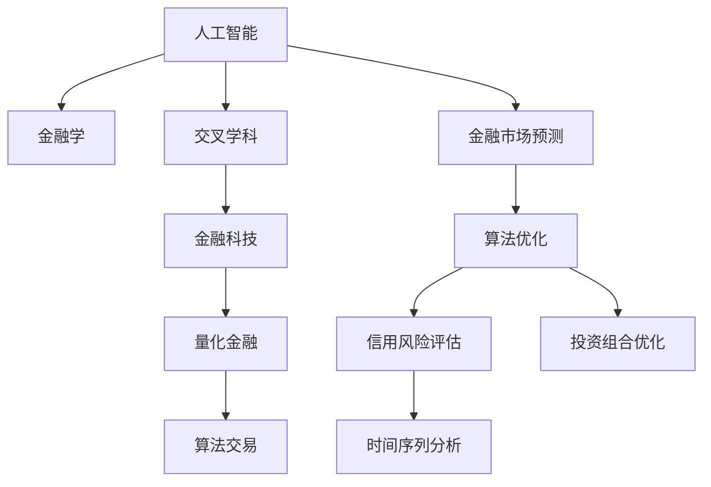

                 

# AI与金融学交叉原理与代码实战案例讲解

> 关键词：人工智能, 金融学, 交叉学科, 代码实战, 投资组合优化, 信用风险评估, 时间序列分析, 金融市场预测

## 1. 背景介绍

### 1.1 问题由来
近年来，随着人工智能技术的快速发展和金融市场的数字化转型，AI与金融学的交叉融合成为了学术和产业界的热点。金融机构利用AI技术提升风险控制、投资管理、客户服务等方面的能力，AI技术也在金融领域得到广泛应用。然而，AI在金融学中的具体应用场景和方法，以及其原理与代码实现，仍是业界关注的热点问题。

### 1.2 问题核心关键点
本文聚焦于AI与金融学的交叉研究，旨在通过理论结合代码实战，系统讲解AI在金融领域的关键应用场景。包括但不限于投资组合优化、信用风险评估、时间序列分析、金融市场预测等。我们将详细阐述AI在金融学中的原理和实践，以期对金融科技从业者提供全面的技术指引。

### 1.3 问题研究意义
AI与金融学的交叉研究，对于推动金融科技的创新和发展，提升金融服务的智能化水平，具有重要意义：

1. **风险管理**：通过AI技术进行信用风险评估和市场风险预测，有效降低金融系统的风险。
2. **投资决策**：利用AI进行投资组合优化和市场趋势预测，提升投资回报率。
3. **客户服务**：使用AI提升客户咨询、风险评估和个性化金融推荐服务，提高客户满意度。
4. **运营效率**：AI在金融运营中的自动化和智能化，有助于提升业务效率，降低成本。
5. **数据驱动决策**：通过AI对海量金融数据的分析挖掘，帮助金融机构制定更加科学的决策策略。

本文将详细探讨这些应用场景，通过理论结合代码实践，帮助读者全面理解AI在金融学中的原理与方法。

## 2. 核心概念与联系

### 2.1 核心概念概述

为更好地理解AI与金融学的交叉应用，本节将介绍几个密切相关的核心概念：

- **人工智能**：涵盖机器学习、深度学习、自然语言处理、计算机视觉等技术，旨在模拟人类智能行为，解决复杂问题。
- **金融学**：研究货币、银行、证券市场、保险等领域，旨在理解金融市场的运作机制和金融工具的定价。
- **交叉学科**：AI与金融学的交叉融合，旨在结合两者的优势，提升金融服务的智能化水平。
- **金融科技**：将科技手段应用于金融领域，提升金融服务的效率和智能化水平。
- **量化金融**：利用数据和算法进行金融决策，强调模型的客观性和科学性。
- **算法交易**：基于算法进行高频交易，提升交易效率和精准度。
- **金融市场预测**：利用AI技术对金融市场进行预测和分析，指导投资决策。

这些核心概念之间的逻辑关系可以通过以下Mermaid流程图来展示：



这个流程图展示了大语言模型的核心概念及其之间的关系：

1. 人工智能为金融学提供技术支持。
2. AI与金融学的交叉学科应用，产生金融科技。
3. 金融科技中的量化金融和算法交易，利用AI进行金融决策。
4. 金融市场预测、信用风险评估和投资组合优化，具体应用场景。
5. 算法优化和时间序列分析等基础技术支持。

这些概念共同构成了AI在金融学中的应用框架，使得金融科技能够更好地服务实体经济，推动金融市场的健康发展。

## 3. 核心算法原理 & 具体操作步骤
### 3.1 算法原理概述

AI与金融学的交叉研究，核心在于利用AI技术解决金融问题，提升金融服务的智能化水平。其核心思想是：

1. **数据驱动**：金融问题的解决依赖于大量高质量的数据。AI通过对金融数据的深度学习，提取其特征和模式，辅助决策。
2. **模型优化**：利用AI模型对金融数据进行分析挖掘，优化投资组合、风险控制等决策过程。
3. **算法自动化**：将AI算法应用于金融流程，提升业务效率，降低人工干预。
4. **跨学科融合**：结合金融学和AI的学科知识，创新金融工具和方法，提升金融服务质量。

AI与金融学的交叉研究涉及多个领域，包括但不限于机器学习、深度学习、自然语言处理、时间序列分析等。本文将重点介绍其中的几个关键算法原理，并通过代码实战案例进行讲解。

### 3.2 算法步骤详解

**Step 1: 数据收集与预处理**
- 收集金融领域的相关数据，如股票价格、利率、汇率、信用评级等。
- 对数据进行清洗和标准化，去除异常值和噪声，以保证数据质量。
- 将数据分为训练集、验证集和测试集，以便进行模型评估。

**Step 2: 模型选择与训练**
- 根据具体问题选择适当的AI模型，如决策树、随机森林、神经网络等。
- 在训练集上训练模型，优化模型的超参数，以提高模型的泛化能力。
- 使用验证集评估模型的性能，调整模型参数。

**Step 3: 模型评估与部署**
- 在测试集上评估模型的性能，计算准确率、召回率、F1分数等指标。
- 将模型部署到实际业务场景中，进行业务验证和优化。
- 持续监控模型的运行状态，根据业务需求进行动态调整。

**Step 4: 模型迭代与优化**
- 根据业务反馈和实际效果，不断迭代和优化模型。
- 引入新数据和新方法，更新模型，提升模型的性能。
- 持续学习新知识，适应不断变化的金融市场。

### 3.3 算法优缺点

AI与金融学的交叉研究具有以下优点：
1. **提高决策效率**：通过AI自动化处理大量数据和复杂计算，提升决策效率和精准度。
2. **优化风险控制**：AI在信用风险评估、市场风险预测等方面的应用，能有效降低金融风险。
3. **提升客户体验**：AI在客户服务、个性化推荐等方面的应用，提升客户满意度和忠诚度。
4. **促进金融创新**：结合AI和金融学的学科知识，创新金融工具和方法，推动金融市场发展。

同时，该方法也存在一定的局限性：
1. **数据依赖**：AI在金融中的应用依赖于高质量的数据，数据缺失或错误可能导致模型失效。
2. **模型复杂**：AI模型的复杂性可能导致解释性不足，难以理解模型决策过程。
3. **技术门槛**：AI在金融领域的应用需要专业的技术和知识，可能导致人才短缺。
4. **市场波动**：金融市场的复杂性和不确定性，可能导致AI模型在实际应用中的泛化性能不足。
5. **伦理和安全问题**：AI在金融中的应用涉及大量敏感数据和隐私信息，存在伦理和安全问题。

尽管存在这些局限性，但AI与金融学的交叉研究仍是大数据和智能时代下金融科技发展的必然趋势。未来相关研究的重点在于如何进一步降低技术门槛，提升模型透明度和解释性，保障数据安全和隐私，以更好地服务于金融市场和实体经济。

### 3.4 算法应用领域

AI与金融学的交叉研究，已经在多个领域得到应用，例如：

- **信用风险评估**：利用AI模型进行信用评分和风险预测，帮助金融机构评估客户的信用风险。
- **投资组合优化**：通过AI算法进行资产组合管理和优化，提升投资回报率。
- **市场预测与分析**：利用AI模型进行金融市场预测和分析，指导投资决策。
- **客户服务**：使用AI技术提升客户咨询、风险评估和个性化金融推荐服务，提高客户满意度。
- **高频交易**：基于AI算法进行高频交易，提升交易效率和精准度。

除了上述这些经典应用外，AI与金融学的交叉研究还在智能投顾、金融监管、反欺诈等领域持续创新，推动金融科技的发展。

## 4. 数学模型和公式 & 详细讲解  
### 4.1 数学模型构建

本节将使用数学语言对AI在金融学中的应用进行更加严格的刻画。

假设金融领域的数据集为 $D=\{(x_i,y_i)\}_{i=1}^N$，其中 $x_i$ 为输入特征， $y_i$ 为金融事件（如信用评分、股票价格等）。定义模型 $M_{\theta}$ 在输入 $x_i$ 上的预测输出为 $\hat{y}_i$。

### 4.2 公式推导过程

以信用评分为例，假设模型 $M_{\theta}$ 为线性回归模型，其预测公式为：

$$
\hat{y}_i = \theta^T \varphi(x_i)
$$

其中 $\theta$ 为模型参数， $\varphi(x_i)$ 为特征映射函数，将输入特征 $x_i$ 映射到高维空间。

假设模型在训练集 $D$ 上的损失函数为均方误差损失，即：

$$
\mathcal{L}(\theta) = \frac{1}{N} \sum_{i=1}^N (\hat{y}_i - y_i)^2
$$

通过梯度下降等优化算法，最小化损失函数，得到最优参数：

$$
\theta^* = \mathop{\arg\min}_{\theta} \mathcal{L}(\theta)
$$

通过迭代优化，模型不断更新参数 $\theta$，直到收敛。

### 4.3 案例分析与讲解

以信用评分为例，我们通过Python代码实现信用评分的线性回归模型，并使用均方误差损失函数进行训练和评估。

```python
import numpy as np
from sklearn.linear_model import LinearRegression
from sklearn.metrics import mean_squared_error

# 生成数据
np.random.seed(0)
x = np.random.randn(100, 5)
y = 0.5 * x[:, 0] + 0.2 * x[:, 1] + np.random.randn(100)

# 分割数据集
x_train, x_test = x[:80], x[80:]
y_train, y_test = y[:80], y[80:]

# 训练模型
model = LinearRegression()
model.fit(x_train, y_train)

# 预测并评估
y_pred = model.predict(x_test)
mse = mean_squared_error(y_test, y_pred)
print(f"均方误差: {mse}")
```

以上代码实现了基本的线性回归模型，通过训练和预测，得到了均方误差作为评估指标。在实际应用中，我们还需要对数据进行更深入的处理，如特征工程、正则化、交叉验证等，以提升模型的性能。

## 5. 项目实践：代码实例和详细解释说明
### 5.1 开发环境搭建

在进行AI与金融学的交叉应用实践前，我们需要准备好开发环境。以下是使用Python进行TensorFlow开发的环境配置流程：

1. 安装Anaconda：从官网下载并安装Anaconda，用于创建独立的Python环境。

2. 创建并激活虚拟环境：
```bash
conda create -n tf-env python=3.8 
conda activate tf-env
```

3. 安装TensorFlow：根据CUDA版本，从官网获取对应的安装命令。例如：
```bash
conda install tensorflow tensorflow-gpu -c conda-forge
```

4. 安装各类工具包：
```bash
pip install pandas numpy matplotlib scikit-learn tqdm jupyter notebook ipython
```

完成上述步骤后，即可在`tf-env`环境中开始AI与金融学的交叉应用实践。

### 5.2 源代码详细实现

这里我们以信用风险评估为例，给出使用TensorFlow进行线性回归模型的PyTorch代码实现。

首先，定义数据集：

```python
import tensorflow as tf
import pandas as pd
import numpy as np

# 读取数据集
df = pd.read_csv('credit_data.csv')

# 分割数据集
x_train = df.drop('default', axis=1).values
y_train = df['default'].values

# 数据归一化
scaler = StandardScaler()
x_train = scaler.fit_transform(x_train)
```

然后，定义模型和优化器：

```python
model = tf.keras.Sequential([
    tf.keras.layers.Dense(10, activation='relu', input_shape=(10,)),
    tf.keras.layers.Dense(1, activation='sigmoid')
])

optimizer = tf.keras.optimizers.Adam(learning_rate=0.001)
```

接着，定义训练和评估函数：

```python
@tf.function
def train_step(x, y):
    with tf.GradientTape() as tape:
        predictions = model(x, training=True)
        loss = tf.losses.BinaryCrossentropy(from_logits=True)(predictions, y)
    gradients = tape.gradient(loss, model.trainable_variables)
    optimizer.apply_gradients(zip(gradients, model.trainable_variables))
    return loss

@tf.function
def evaluate_step(x, y):
    predictions = model(x, training=False)
    loss = tf.losses.BinaryCrossentropy(from_logits=True)(predictions, y)
    accuracy = tf.metrics.AUC()(predictions, y)
    return loss, accuracy
```

最后，启动训练流程并在测试集上评估：

```python
epochs = 100
batch_size = 32

for epoch in range(epochs):
    for i in range(0, len(x_train), batch_size):
        x_batch = x_train[i:i+batch_size]
        y_batch = y_train[i:i+batch_size]
        loss = train_step(x_batch, y_batch)
    if epoch % 10 == 0:
        x_test = scaler.transform(test_data)
        loss, accuracy = evaluate_step(x_test, y_test)
        print(f"Epoch {epoch+1}, Loss: {loss}, Accuracy: {accuracy}")
```

以上就是使用TensorFlow对线性回归模型进行信用风险评估的完整代码实现。可以看到，TensorFlow的Eager Execution特性使得模型训练和评估的代码实现变得简洁高效。

### 5.3 代码解读与分析

让我们再详细解读一下关键代码的实现细节：

**信用评分数据集**：
- 从CSV文件中读取数据，并分割为训练集和测试集。
- 对输入特征进行归一化处理，以提升模型性能。

**模型定义**：
- 使用TensorFlow的Sequential模型定义线性回归模型，包括一个隐藏层和一个输出层。
- 隐藏层使用ReLU激活函数，输出层使用Sigmoid激活函数，输出二分类结果。

**优化器**：
- 使用Adam优化器，设置初始学习率为0.001。

**训练和评估函数**：
- `train_step`函数定义训练步骤，使用梯度下降优化损失函数。
- `evaluate_step`函数定义评估步骤，计算损失和准确率。
- 使用Eager Execution特性，将函数定义和执行分开，提高代码的可读性和复用性。

**训练流程**：
- 循环训练多个epoch，每次迭代使用一个批次的数据。
- 每10个epoch输出一次损失和准确率，以监控模型训练状态。

可以看到，TensorFlow使得模型训练和评估的代码实现变得非常高效和灵活。开发者可以根据具体需求，设计更复杂的模型和优化策略，以进一步提升模型性能。

## 6. 实际应用场景
### 6.1 智能投顾系统

智能投顾系统通过AI技术，为投资者提供个性化的投资建议。AI可以分析历史交易数据、市场行情、宏观经济指标等，评估投资风险和预期收益，从而辅助投资者做出更明智的决策。

在技术实现上，可以收集投资者的个人信息和历史交易记录，使用AI模型进行数据分析和预测，生成投资建议。例如，利用深度学习模型进行价格趋势预测，利用聚类算法进行资产组合优化，利用自然语言处理技术进行用户情感分析，从而提供个性化的投资建议。

### 6.2 金融市场预测

金融市场预测是AI在金融学中的重要应用之一。通过AI技术，可以对股票价格、汇率、利率等金融指标进行预测，帮助投资者制定投资策略，优化资产配置。

具体而言，可以收集历史金融数据，使用时间序列分析模型（如ARIMA、LSTM等）进行预测。在预测过程中，还可以结合市场情绪分析、新闻舆情等因素，进一步提升预测准确度。

### 6.3 风险管理与控制

AI在金融风险管理中的应用，主要集中在信用风险评估和市场风险预测。通过AI模型对大量的历史数据进行分析，可以识别出风险较高的客户和交易，从而提前采取措施降低损失。

例如，可以利用分类模型进行信用评分，判断客户的违约概率。在模型训练过程中，可以引入多种特征，如收入、职业、家庭状况等，以提升模型的准确度。同时，还可以结合市场行情、宏观经济指标等，进一步评估市场风险。

### 6.4 金融市场量化交易

量化交易是一种基于AI算法进行高频交易的方法，通过自动化交易系统实现高频交易，提高交易效率和收益。

在量化交易中，AI算法可以分析历史交易数据、市场行情、技术指标等，生成交易策略和信号。例如，利用机器学习模型进行价格预测，利用深度学习模型进行交易策略优化，利用强化学习模型进行交易策略学习。

## 7. 工具和资源推荐
### 7.1 学习资源推荐

为了帮助开发者系统掌握AI在金融学中的应用，这里推荐一些优质的学习资源：

1. 《Python for Finance》系列书籍：介绍了如何使用Python进行金融数据分析和建模。
2. 《Machine Learning Yearning》书籍：斯坦福大学教授Andrew Ng的机器学习实战指南，包含大量金融领域的案例。
3. CS229《Machine Learning》课程：斯坦福大学开设的机器学习课程，包含金融领域的经典案例。
4. Coursera上的《Financial Engineering and Risk Management》课程：耶鲁大学开设的金融工程课程，涵盖量化金融和金融市场预测等内容。
5. Kaggle金融数据集：包含大量金融领域的公开数据集，适合进行数据驱动的金融应用研究。

通过对这些资源的学习实践，相信你一定能够快速掌握AI在金融学中的原理与方法，并用于解决实际的金融问题。

### 7.2 开发工具推荐

高效的开发离不开优秀的工具支持。以下是几款用于AI与金融学的交叉应用开发的常用工具：

1. TensorFlow：由Google主导开发的深度学习框架，生产部署方便，适合大规模工程应用。
2. PyTorch：基于Python的开源深度学习框架，灵活动态，适合快速迭代研究。
3. Scikit-learn：基于Python的机器学习库，简单易用，适合初学者。
4. NumPy和Pandas：Python中的基础数学和数据处理库，适合进行数据处理和分析。
5. Weights & Biases：模型训练的实验跟踪工具，可以记录和可视化模型训练过程中的各项指标。
6. TensorBoard：TensorFlow配套的可视化工具，可实时监测模型训练状态，并提供丰富的图表呈现方式。

合理利用这些工具，可以显著提升AI在金融学中的应用开发效率，加快创新迭代的步伐。

### 7.3 相关论文推荐

AI与金融学的交叉研究源于学界的持续研究。以下是几篇奠基性的相关论文，推荐阅读：

1. "Machine Learning in Finance" by Sebastian M. Ross：概述了机器学习在金融学中的应用。
2. "Deep Learning for Credit Risk Assessment" by Daniel A. Lemire：利用深度学习模型进行信用风险评估。
3. "Algorithmic Trading" by Rama Rajamani：介绍了算法交易的原理和实现方法。
4. "Quantitative Methods for Financial Engineering" by Bruno Dupire：涵盖量化金融的多个方面。
5. "Neural Networks and Machine Learning in Finance" by Dan loose：介绍了神经网络在金融领域的多种应用。

这些论文代表了大语言模型微调技术的发展脉络。通过学习这些前沿成果，可以帮助研究者把握学科前进方向，激发更多的创新灵感。

## 8. 总结：未来发展趋势与挑战
### 8.1 总结

本文对AI与金融学的交叉研究进行了全面系统的介绍。首先阐述了AI在金融学中的研究背景和意义，明确了AI在金融学中的具体应用场景。其次，从原理到实践，详细讲解了AI在金融学中的关键算法和代码实现，并通过实例讲解了信用评分、市场预测、风险控制等具体应用。

通过本文的系统梳理，可以看到，AI在金融学中的应用前景广阔，能够在金融决策、风险管理、客户服务等方面发挥重要作用。未来，伴随AI技术的不断发展，AI与金融学的交叉研究必将在金融科技领域得到更广泛的应用，推动金融市场的高质量发展。

### 8.2 未来发展趋势

展望未来，AI与金融学的交叉研究将呈现以下几个发展趋势：

1. **数据驱动决策**：AI通过分析大量金融数据，帮助金融机构制定更加科学的决策策略，提升决策效率和精准度。
2. **模型自动化**：AI算法在金融决策和风险管理中的应用，将进一步实现自动化和智能化，降低人工干预。
3. **跨领域融合**：AI在金融学中的应用将与其他学科如经济学、社会学等进行深度融合，推动金融科技的发展。
4. **个性化金融服务**：AI通过分析客户数据，提供个性化的金融推荐和定制服务，提升客户体验和满意度。
5. **金融市场预测**：AI技术在金融市场预测中的应用将更加广泛，帮助投资者制定合理的投资策略。
6. **金融风险管理**：AI在信用风险评估和市场风险预测中的应用，将进一步提升金融风险管理的水平。

以上趋势凸显了AI在金融学中的巨大潜力。这些方向的探索发展，必将进一步提升金融服务的智能化水平，为金融市场的发展注入新的动力。

### 8.3 面临的挑战

尽管AI在金融学中的应用取得了显著进展，但在迈向更加智能化、普适化应用的过程中，仍面临诸多挑战：

1. **数据质量**：金融数据的完整性、准确性和一致性直接影响AI模型的性能。数据缺失、噪声等问题可能导致模型失效。
2. **模型复杂性**：AI模型的复杂性可能导致解释性不足，难以理解模型决策过程。
3. **技术门槛**：AI在金融领域的应用需要专业的技术和知识，可能导致人才短缺。
4. **市场波动**：金融市场的复杂性和不确定性，可能导致AI模型在实际应用中的泛化性能不足。
5. **伦理和安全问题**：AI在金融中的应用涉及大量敏感数据和隐私信息，存在伦理和安全问题。

尽管存在这些挑战，但AI与金融学的交叉研究仍是大数据和智能时代下金融科技发展的必然趋势。未来相关研究的重点在于如何进一步降低技术门槛，提升模型透明度和解释性，保障数据安全和隐私，以更好地服务于金融市场和实体经济。

### 8.4 研究展望

面对AI与金融学的交叉研究所面临的种种挑战，未来的研究需要在以下几个方面寻求新的突破：

1. **数据治理**：提高金融数据的质量和可用性，确保数据的完整性、准确性和一致性。
2. **模型可解释性**：开发更具解释性的AI模型，增强模型的透明性和可信度。
3. **跨学科融合**：结合金融学和其他学科的知识，推动AI技术在金融领域的应用。
4. **隐私保护**：加强对金融数据的隐私保护，确保数据安全和合规性。
5. **伦理规范**：制定AI在金融领域应用的伦理规范，避免潜在的伦理风险。

这些研究方向的探索，必将引领AI在金融学中的应用进入新的高度，为构建安全、可靠、可解释、可控的金融智能系统铺平道路。面向未来，AI与金融学的交叉研究还需要与其他人工智能技术进行更深入的融合，如知识表示、因果推理、强化学习等，多路径协同发力，共同推动金融科技的发展。

## 9. 附录：常见问题与解答

**Q1：AI在金融学中的应用是否需要大量标注数据？**

A: AI在金融学中的应用不一定需要大量标注数据。对于一些预测性任务，如股票价格预测、信用评分等，可以通过时间序列分析和回归模型等方法，利用无标注数据进行训练和预测。但对于分类任务，如信用评估，确实需要一定量的标注数据进行训练和优化。

**Q2：AI在金融学中的应用是否具有可解释性？**

A: 部分AI模型（如线性回归、决策树等）具有较好的可解释性，可以通过特征权重和特征重要性等指标进行解释。但对于深度学习模型（如神经网络），其内部机制较为复杂，难以进行解释。目前，一些可解释性方法如LIME、SHAP等，可以帮助解释复杂模型的决策过程，提升模型的透明性和可信度。

**Q3：AI在金融学中的应用是否需要高昂的计算资源？**

A: 部分AI模型（如线性回归、决策树等）计算资源需求较低，适合在普通机器上运行。但对于深度学习模型（如神经网络），由于其参数量较大，计算资源需求较高，需要高性能计算设备支持。

**Q4：AI在金融学中的应用是否存在伦理和安全问题？**

A: AI在金融学中的应用确实存在伦理和安全问题。如数据隐私保护、模型偏见、公平性等问题。在数据处理和模型训练过程中，需要采取多种措施保障数据安全和隐私。同时，需要制定伦理规范，避免潜在的伦理风险。

**Q5：AI在金融学中的应用是否需要跨学科知识？**

A: AI在金融学中的应用确实需要跨学科知识。金融学涉及经济学、社会学、心理学等多个学科，AI在金融中的应用需要结合这些学科的知识，进行全面的分析和预测。同时，AI技术本身也涉及数学、统计学、计算机科学等多个领域，需要结合多个学科的知识进行深入研究。

这些问题的解答，希望能为你提供更全面的理解和实践指导。AI与金融学的交叉研究正在蓬勃发展，未来将带来更多创新和变革，推动金融科技的发展。相信通过不断的努力和探索，我们能够构建更加智能、高效、安全的金融系统，为人类社会的进步贡献力量。

---

作者：禅与计算机程序设计艺术 / Zen and the Art of Computer Programming

