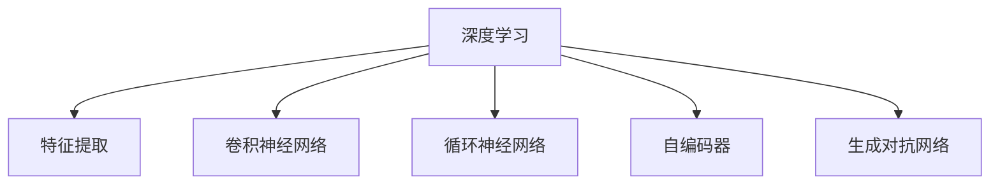
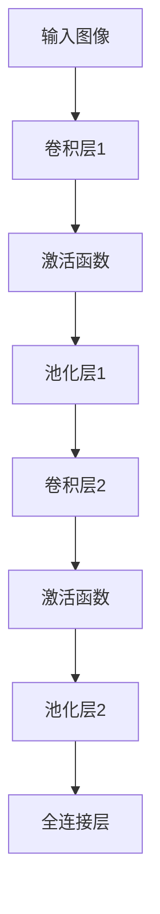

                 

# AI人工智能 Agent：利用深度学习进行特征提取

> 关键词：AI，人工智能Agent，特征提取，深度学习

## 1. 背景介绍

### 1.1 问题由来
在人工智能(AI)领域，特征提取一直是深度学习模型训练的基础。传统的特征提取方法依赖于人工提取，需要大量的专家知识和经验，且对数据的要求较高。随着深度学习技术的普及，利用神经网络自动提取特征的方法逐渐兴起，成为AI应用的重要手段。

深度学习模型，特别是卷积神经网络(CNN)和循环神经网络(RNN)，通过多层非线性变换，能够自动从原始数据中学习到丰富的特征表示。这些自动提取的特征不仅可以用于监督学习，还能用于无监督学习、半监督学习和强化学习等多种AI应用场景。

在实践中，特征提取的好坏直接决定了AI模型的性能，因此对其研究一直是AI领域的热点问题。本文将深入探讨深度学习模型中的特征提取机制，并结合实际应用场景进行详细阐述。

## 2. 核心概念与联系

### 2.1 核心概念概述

为更好地理解深度学习模型中的特征提取，本节将介绍几个密切相关的核心概念：

- 深度学习：利用多层神经网络进行数据建模的一种机器学习范式，能够自动学习数据的高维特征表示。
- 特征提取：将原始数据映射为更高维的特征空间，提高数据的表现力，提升模型的学习效果。
- 卷积神经网络(CNN)：专门设计用于图像处理的任务，通过卷积操作提取局部特征。
- 循环神经网络(RNN)：适用于序列数据的特征提取，能够捕捉序列中的时序依赖关系。
- 自编码器(Autoencoder)：一种无监督学习范式，通过重建输入数据来提取特征。
- 生成对抗网络(GAN)：通过生成器和判别器的对抗学习，生成高质量的样本特征。

这些核心概念之间的逻辑关系可以通过以下Mermaid流程图来展示：



这个流程图展示了几类典型的深度学习特征提取方法：

1. 深度学习通过多层非线性变换进行特征提取。
2. CNN专门用于图像处理，通过卷积操作提取局部特征。
3. RNN用于序列数据，捕捉时序依赖关系。
4. 自编码器通过无监督学习重建输入数据，提取特征。
5. GAN通过对抗学习生成高质量样本特征。

## 3. 核心算法原理 & 具体操作步骤

### 3.1 算法原理概述

深度学习模型中的特征提取，本质上是将原始数据映射到更高维特征空间的过程。通过多层非线性变换，深度学习模型能够学习到数据中的复杂结构，从而提升模型的性能。

一般而言，深度学习模型的特征提取过程包括以下几个步骤：

1. 输入层：将原始数据（如图像、文本等）转换为模型可以处理的向量形式。
2. 隐藏层：通过多层神经网络对输入向量进行非线性变换，提取高维特征。
3. 输出层：将隐藏层的特征映射为模型预测或输出的形式。

以CNN为例，其特征提取过程主要分为两个阶段：

1. 卷积层：通过卷积操作提取局部特征。
2. 池化层：通过降维操作减少特征维度和冗余信息。

以下是一个简单的CNN结构图：



其中，卷积层通过卷积核提取局部特征，池化层通过池化操作降维，全连接层将特征映射为输出。

### 3.2 算法步骤详解

深度学习模型中的特征提取步骤具体包括：

1. 数据预处理：将原始数据进行归一化、标准化等处理，使其符合模型输入的要求。
2. 构建网络结构：设计并搭建深度学习模型，确定各层的节点数、激活函数等参数。
3. 训练模型：使用标注数据对模型进行训练，更新模型参数，使其学习到数据的特征表示。
4. 特征提取：使用训练好的模型，对新的数据进行特征提取，得到模型输出的特征向量。

以CNN为例，其特征提取步骤如下：

1. 数据预处理：将输入图像进行归一化处理。
2. 构建网络结构：定义多个卷积层和池化层，每个卷积层后跟一个激活函数，最终输出全连接层。
3. 训练模型：使用标注图像对模型进行训练，最小化损失函数，更新模型参数。
4. 特征提取：对新的图像数据进行前向传播，输出全连接层的特征向量。

### 3.3 算法优缺点

深度学习模型中的特征提取具有以下优点：

1. 自动提取：深度学习模型能够自动学习数据的特征表示，无需人工提取，减少了专家知识和经验的需求。
2. 高维表示：深度学习模型能够学习到高维的特征表示，提高了数据的表达能力。
3. 泛化能力强：深度学习模型具有较强的泛化能力，能够在不同数据集上获得较好的表现。

但同时也存在一些局限性：

1. 计算复杂度高：深度学习模型通常需要大量的计算资源，训练时间较长。
2. 模型可解释性差：深度学习模型往往被视为"黑盒"，难以解释其内部工作机制。
3. 过拟合风险高：深度学习模型容易过拟合，尤其是在训练数据不足的情况下。

### 3.4 算法应用领域

深度学习模型中的特征提取广泛应用于计算机视觉、自然语言处理、语音识别等多个领域。以下是几个典型的应用场景：

- 计算机视觉：利用CNN对图像进行特征提取，用于图像分类、目标检测、图像分割等任务。
- 自然语言处理：利用RNN、Transformer等模型对文本进行特征提取，用于机器翻译、情感分析、问答系统等任务。
- 语音识别：利用卷积神经网络对语音信号进行特征提取，用于语音识别、语音合成等任务。
- 医学影像：利用深度学习模型对医学影像进行特征提取，用于疾病诊断、影像重建等任务。

## 4. 数学模型和公式 & 详细讲解 & 举例说明

### 4.1 数学模型构建

以CNN为例，其特征提取过程可以形式化地表示为：

$$
y = h_W \cdot x + b
$$

其中，$x$ 为输入向量，$W$ 为卷积核，$b$ 为偏置项，$h_W$ 为卷积操作。

### 4.2 公式推导过程

卷积操作的推导过程如下：

$$
y_i = \sum_{k=-r}^{r} x_{i+k} \cdot w_k
$$

其中，$r$ 为卷积核大小，$w_k$ 为卷积核权重。

### 4.3 案例分析与讲解

假设有一张尺寸为 $28\times28$ 的灰度图像，通过 $3\times3$ 的卷积核进行卷积操作，得到特征图 $14\times14\times3$。

令卷积核大小为 $3$，步长为 $1$，则卷积操作如下：

$$
y_{i,j} = \sum_{k=-1}^{1} \sum_{l=-1}^{1} x_{i+k,j+l} \cdot w_k
$$

其中，$x_{i,j}$ 为原始图像的像素值，$w_k$ 为卷积核的权重。

## 5. 项目实践：代码实例和详细解释说明

### 5.1 开发环境搭建

在进行特征提取项目实践前，我们需要准备好开发环境。以下是使用Python进行Keras开发的环境配置流程：

1. 安装Anaconda：从官网下载并安装Anaconda，用于创建独立的Python环境。

2. 创建并激活虚拟环境：
```bash
conda create -n keras-env python=3.8 
conda activate keras-env
```

3. 安装Keras：
```bash
pip install keras
```

4. 安装TensorFlow：
```bash
pip install tensorflow
```

5. 安装相关库：
```bash
pip install numpy pandas scikit-learn matplotlib
```

完成上述步骤后，即可在`keras-env`环境中开始特征提取实践。

### 5.2 源代码详细实现

下面以手写数字识别任务为例，给出使用Keras进行卷积神经网络特征提取的代码实现。

首先，定义数据集预处理函数：

```python
from keras.datasets import mnist
from keras.utils import to_categorical
import numpy as np

(x_train, y_train), (x_test, y_test) = mnist.load_data()

x_train = x_train.reshape(-1, 28, 28, 1).astype('float32') / 255.0
x_test = x_test.reshape(-1, 28, 28, 1).astype('float32') / 255.0

y_train = to_categorical(y_train, 10)
y_test = to_categorical(y_test, 10)
```

然后，定义模型和优化器：

```python
from keras.models import Sequential
from keras.layers import Conv2D, MaxPooling2D, Flatten, Dense

model = Sequential()
model.add(Conv2D(32, kernel_size=(3, 3), activation='relu', input_shape=(28, 28, 1)))
model.add(MaxPooling2D(pool_size=(2, 2)))
model.add(Conv2D(64, kernel_size=(3, 3), activation='relu'))
model.add(MaxPooling2D(pool_size=(2, 2)))
model.add(Flatten())
model.add(Dense(128, activation='relu'))
model.add(Dense(10, activation='softmax'))

optimizer = Adam(learning_rate=0.001)
```

接着，定义训练和评估函数：

```python
from keras.callbacks import EarlyStopping

def train_epoch(model, x_train, y_train, batch_size, optimizer):
    model.compile(loss='categorical_crossentropy', optimizer=optimizer, metrics=['accuracy'])
    model.fit(x_train, y_train, batch_size=batch_size, epochs=1, validation_split=0.1, callbacks=[EarlyStopping(patience=3)])
    
def evaluate(model, x_test, y_test, batch_size):
    model.evaluate(x_test, y_test, batch_size=batch_size)
```

最后，启动训练流程并在测试集上评估：

```python
epochs = 5
batch_size = 128

for epoch in range(epochs):
    train_epoch(model, x_train, y_train, batch_size, optimizer)
    print(f"Epoch {epoch+1}, test accuracy: {evaluate(model, x_test, y_test, batch_size)[1]*100:.2f}%")
```

以上就是使用Keras进行手写数字识别任务卷积神经网络特征提取的完整代码实现。可以看到，Keras的封装使得模型构建和训练过程变得简洁高效。

### 5.3 代码解读与分析

让我们再详细解读一下关键代码的实现细节：

**mnist.load_data()**：
- 加载手写数字识别数据集，返回训练集和测试集。

**x_train, x_test = reshape**：
- 将输入数据从二维数组转换为三维张量，并进行归一化处理，使输入数据符合模型要求。

**y_train, y_test = to_categorical**：
- 将标签数据进行独热编码，使其符合模型的输出形式。

**Sequential()**：
- 创建序列模型，依次添加卷积层、池化层、全连接层等组件。

**Conv2D()**：
- 添加二维卷积层，包括卷积核大小、数量、激活函数等参数。

**MaxPooling2D()**：
- 添加二维池化层，包括池化大小、步长等参数。

**Flatten()**：
- 将特征图转换为一维向量，为全连接层做准备。

**Dense()**：
- 添加全连接层，包括节点数、激活函数等参数。

**Adam()**：
- 定义优化器，包括学习率等参数。

**EarlyStopping()**：
- 定义提前停止回调函数，用于防止过拟合。

**model.compile()**：
- 编译模型，指定损失函数、优化器和评价指标。

**model.fit()**：
- 训练模型，指定输入数据、标签数据、批次大小、迭代轮数等参数。

**model.evaluate()**：
- 评估模型，返回损失值和准确率。

可以看到，Keras通过封装常用的深度学习组件和优化器，极大简化了模型的构建和训练过程。开发者可以将更多精力放在模型设计和参数调优上，而不必过多关注底层的实现细节。

当然，工业级的系统实现还需考虑更多因素，如模型的保存和部署、超参数的自动搜索、更灵活的任务适配层等。但核心的特征提取范式基本与此类似。

## 6. 实际应用场景

### 6.1 计算机视觉

计算机视觉是深度学习特征提取的重要应用领域，利用卷积神经网络对图像进行特征提取，已经成为图像处理的基础技术。在实践中，CNN广泛应用于图像分类、目标检测、图像分割等任务。

以图像分类为例，利用CNN提取图像的特征向量，然后通过分类器进行分类，可以高效识别各种类型的图像。例如，ImageNet中的大规模图像分类任务， just train a CNN with multiple convolutional layers and pooling layers。

### 6.2 自然语言处理

自然语言处理是深度学习特征提取的另一重要应用领域，利用RNN、Transformer等模型对文本进行特征提取，已经成为文本处理的基础技术。在实践中，RNN和Transformer广泛应用于机器翻译、情感分析、问答系统等任务。

以机器翻译为例，利用RNN或Transformer模型提取源语言和目标语言的特征向量，然后进行编码解码，生成翻译结果。例如，Google的Transformer模型已经在机器翻译领域取得优异表现。

### 6.3 语音识别

语音识别是深度学习特征提取的另一个重要应用领域，利用卷积神经网络对语音信号进行特征提取，已经成为语音处理的基础技术。在实践中，CNN广泛应用于语音识别、语音合成等任务。

以语音识别为例，利用卷积神经网络提取语音信号的特征向量，然后通过分类器进行识别，可以高效识别各种类型的语音。例如，Spectrogram-based approach is used to extract feature from audio signal, and then classify using RNN or CNN.

### 6.4 未来应用展望

随着深度学习技术的不断发展，基于特征提取的大模型应用将迎来更多创新和突破。

在智慧医疗领域，基于深度学习的特征提取方法可以应用于医学影像的自动分析，快速识别病变区域和病种，提高诊疗效率。

在智能制造领域，基于深度学习的特征提取方法可以应用于工业图像的缺陷检测，快速识别产品的缺陷，提高生产质量。

在智慧城市治理中，基于深度学习的特征提取方法可以应用于交通图像的自动分析，实时监测交通状况，提高交通管理效率。

此外，在农业、金融、安全等领域，基于深度学习的特征提取方法也将不断涌现，为传统行业数字化转型升级提供新的技术路径。相信随着技术的日益成熟，特征提取方法将成为AI落地应用的重要手段，推动AI技术向更广阔的领域加速渗透。

## 7. 工具和资源推荐

### 7.1 学习资源推荐

为了帮助开发者系统掌握深度学习特征提取的理论基础和实践技巧，这里推荐一些优质的学习资源：

1. 《深度学习》系列书籍：由机器学习专家Ian Goodfellow等著作，全面介绍深度学习的概念和算法，是深度学习领域的经典教材。

2. Coursera《深度学习》课程：由斯坦福大学教授Andrew Ng开设的深度学习课程，有Lecture视频和配套作业，适合入门深度学习基础。

3. Udacity《深度学习入门》课程：适合零基础学习者，通过动手实践掌握深度学习的核心概念和算法。

4. arXiv《深度学习》论文合集：收集了深度学习领域的经典论文，方便读者系统学习和了解前沿进展。

5. TensorFlow官方文档：TensorFlow的官方文档，提供了丰富的深度学习模型和优化器资源，是上手实践的必备资料。

通过对这些资源的学习实践，相信你一定能够快速掌握深度学习特征提取的精髓，并用于解决实际的AI问题。

### 7.2 开发工具推荐

高效的开发离不开优秀的工具支持。以下是几款用于深度学习特征提取开发的常用工具：

1. TensorFlow：由Google主导开发的开源深度学习框架，生产部署方便，适合大规模工程应用。同样有丰富的深度学习模型资源。

2. PyTorch：基于Python的开源深度学习框架，灵活动态的计算图，适合快速迭代研究。大部分深度学习模型都有PyTorch版本的实现。

3. Keras：Keras的高级API，封装了TensorFlow和Theano，使得模型构建和训练过程变得简洁高效。

4. Weights & Biases：模型训练的实验跟踪工具，可以记录和可视化模型训练过程中的各项指标，方便对比和调优。

5. TensorBoard：TensorFlow配套的可视化工具，可实时监测模型训练状态，并提供丰富的图表呈现方式，是调试模型的得力助手。

合理利用这些工具，可以显著提升深度学习特征提取的开发效率，加快创新迭代的步伐。

### 7.3 相关论文推荐

深度学习特征提取的发展源于学界的持续研究。以下是几篇奠基性的相关论文，推荐阅读：

1. ImageNet Classification with Deep Convolutional Neural Networks：提出AlexNet模型，引入了卷积神经网络，在图像分类任务中取得了优异表现。

2. Deep Residual Learning for Image Recognition：提出ResNet模型，解决了深度神经网络中的梯度消失问题，使得神经网络可以更深。

3. Learning Phrase Representations using RNN Encoder–Decoder for Statistical Machine Translation：提出RNN模型，用于机器翻译任务，取得了很好的效果。

4. Attention Is All You Need：提出Transformer模型，引入自注意力机制，大幅提高了机器翻译、文本生成的效果。

5. The Importance of Being Side-Regularized：提出侧正则化技术，解决了深度学习模型过拟合的问题。

这些论文代表了大模型特征提取的发展脉络。通过学习这些前沿成果，可以帮助研究者把握学科前进方向，激发更多的创新灵感。

## 8. 总结：未来发展趋势与挑战

### 8.1 总结

本文对深度学习模型中的特征提取机制进行了全面系统的介绍。首先阐述了深度学习在AI中的重要作用，强调了特征提取的重要性。其次，从原理到实践，详细讲解了深度学习模型中的特征提取方法，包括卷积神经网络、循环神经网络、自编码器等。最后，结合实际应用场景，探讨了特征提取在计算机视觉、自然语言处理、语音识别等多个领域的应用前景。

通过本文的系统梳理，可以看到，深度学习模型中的特征提取技术已经在多个AI应用场景中得到广泛应用，并取得了显著效果。未来，随着深度学习技术的不断进步，特征提取方法也将不断演进，推动AI技术向更广阔的领域扩展。

### 8.2 未来发展趋势

展望未来，深度学习特征提取技术将呈现以下几个发展趋势：

1. 模型规模不断增大：随着算力成本的下降和数据规模的扩张，深度学习模型的参数量将持续增长。超大规模深度学习模型蕴含的丰富特征，将进一步提升模型的表现能力。

2. 多模态特征提取崛起：当前的深度学习特征提取方法主要聚焦于单一模态数据的处理，未来将拓展到多模态数据融合。例如，结合视觉、语音、文本等多模态数据进行联合特征提取，将显著提升模型的泛化能力和适用性。

3. 自监督特征学习崛起：传统的特征提取方法依赖于标注数据，未来将探索更多自监督学习范式，如生成对抗网络、数据增强等，提高特征提取的效率和效果。

4. 可解释性增强：深度学习模型的"黑盒"特性是当前的一个瓶颈，未来将探索更多可解释性的方法，如注意力机制、可视化工具等，帮助用户理解模型的内部机制和决策过程。

5. 持续学习能力增强：深度学习模型需要持续学习新数据以保持性能，未来将探索更多持续学习范式，如在线学习、增量学习等，提高模型的适应能力。

6. 分布式训练普及：深度学习模型训练的计算需求高，未来将探索更多分布式训练方法，如分布式深度学习框架、边缘计算等，提高训练效率和资源利用率。

这些趋势凸显了深度学习特征提取技术的广阔前景。这些方向的探索发展，必将进一步提升深度学习模型的性能和应用范围，为AI技术的发展带来新的突破。

### 8.3 面临的挑战

尽管深度学习特征提取技术已经取得了瞩目成就，但在迈向更加智能化、普适化应用的过程中，它仍面临着诸多挑战：

1. 标注成本高昂：深度学习模型训练需要大量标注数据，标注成本高昂，尤其是在长尾领域。如何降低标注成本，利用少量标注数据进行高效特征提取，仍是一大难题。

2. 计算资源需求大：深度学习模型通常需要大量的计算资源，训练时间较长，推理速度慢。如何优化模型结构，降低计算资源需求，提高训练和推理效率，仍需进一步研究。

3. 模型可解释性差：深度学习模型往往被视为"黑盒"，难以解释其内部工作机制。如何赋予模型更强的可解释性，使其更容易被理解和接受，仍需更多研究。

4. 过拟合风险高：深度学习模型容易过拟合，尤其是在训练数据不足的情况下。如何避免过拟合，提高模型的泛化能力，仍需更多研究。

5. 数据分布变化快：深度学习模型需要持续学习新数据以保持性能，但数据分布的变化速度较快，如何有效跟踪数据分布的变化，仍需更多研究。

6. 数据隐私保护：深度学习模型需要大量的数据进行训练，如何保护数据隐私，防止数据泄露，仍需更多研究。

### 8.4 研究展望

面对深度学习特征提取所面临的种种挑战，未来的研究需要在以下几个方面寻求新的突破：

1. 探索无监督和半监督特征提取方法。摆脱对大量标注数据的依赖，利用自监督学习、主动学习等无监督和半监督范式，最大限度利用非结构化数据，实现更加灵活高效的特征提取。

2. 研究参数高效和计算高效的特征提取方法。开发更加参数高效的特征提取方法，在固定大部分模型参数的情况下，只更新极少量的任务相关参数。同时优化模型计算图，减少前向传播和反向传播的资源消耗，实现更加轻量级、实时性的部署。

3. 融合因果和对比学习范式。通过引入因果推断和对比学习思想，增强特征提取模型建立稳定因果关系的能力，学习更加普适、鲁棒的数据表示。

4. 引入更多先验知识。将符号化的先验知识，如知识图谱、逻辑规则等，与神经网络模型进行巧妙融合，引导特征提取过程学习更准确、合理的特征表示。

5. 结合因果分析和博弈论工具。将因果分析方法引入特征提取模型，识别出模型决策的关键特征，增强输出解释的因果性和逻辑性。借助博弈论工具刻画人机交互过程，主动探索并规避模型的脆弱点，提高系统稳定性。

6. 纳入伦理道德约束。在特征提取模型训练目标中引入伦理导向的评估指标，过滤和惩罚有害的输出倾向。同时加强人工干预和审核，建立模型行为的监管机制，确保输出的安全性。

这些研究方向的探索，必将引领深度学习特征提取技术迈向更高的台阶，为构建安全、可靠、可解释、可控的智能系统铺平道路。面向未来，深度学习特征提取技术还需要与其他人工智能技术进行更深入的融合，如知识表示、因果推理、强化学习等，多路径协同发力，共同推动自然语言理解和智能交互系统的进步。只有勇于创新、敢于突破，才能不断拓展深度学习特征提取的边界，让智能技术更好地造福人类社会。

## 9. 附录：常见问题与解答

**Q1：什么是深度学习特征提取？**

A: 深度学习特征提取是指利用深度学习模型自动学习数据的高维表示，通过多层非线性变换，将原始数据映射到高维特征空间的过程。这些自动提取的特征可以用于监督学习、无监督学习、半监督学习等多种AI应用场景。

**Q2：深度学习特征提取的优势是什么？**

A: 深度学习特征提取具有以下优势：
1. 自动提取：无需人工提取特征，减少了专家知识和经验的需求。
2. 高维表示：可以学习到高维的特征表示，提高数据的表达能力。
3. 泛化能力强：能够在不同数据集上获得较好的表现。

**Q3：深度学习特征提取的局限性是什么？**

A: 深度学习特征提取也存在一些局限性：
1. 计算复杂度高：需要大量的计算资源，训练时间较长。
2. 模型可解释性差：往往被视为"黑盒"，难以解释其内部工作机制。
3. 过拟合风险高：容易过拟合，尤其是在训练数据不足的情况下。

**Q4：深度学习特征提取的应用场景有哪些？**

A: 深度学习特征提取广泛应用于计算机视觉、自然语言处理、语音识别等多个领域。具体应用场景包括：
1. 图像分类：利用CNN提取图像的特征向量，进行图像分类。
2. 机器翻译：利用RNN或Transformer模型提取源语言和目标语言的特征向量，进行机器翻译。
3. 语音识别：利用CNN提取语音信号的特征向量，进行语音识别。

**Q5：如何提高深度学习特征提取的效率？**

A: 提高深度学习特征提取的效率可以从以下几个方面入手：
1. 模型压缩：通过剪枝、量化等方法减少模型参数量，提高计算效率。
2. 分布式训练：利用分布式深度学习框架，提高训练速度和资源利用率。
3. 数据增强：通过数据增强技术，丰富训练集的多样性，提高模型的泛化能力。
4. 预训练和微调：在预训练大模型的基础上进行微调，可以提高模型的初始化效果，减少训练时间。

**Q6：深度学习特征提取与传统特征提取方法的区别是什么？**

A: 深度学习特征提取与传统特征提取方法的区别在于：
1. 自动提取：深度学习特征提取能够自动学习数据的高维表示，无需人工提取。
2. 高维表示：深度学习特征提取可以学习到高维的特征表示，提高数据的表达能力。
3. 学习能力强：深度学习特征提取能够学习到数据中的复杂结构，具有较强的学习能力和泛化能力。

**Q7：如何处理深度学习特征提取中的过拟合问题？**

A: 处理深度学习特征提取中的过拟合问题可以从以下几个方面入手：
1. 数据增强：通过数据增强技术，丰富训练集的多样性，提高模型的泛化能力。
2. 正则化：使用L2正则化、Dropout等技术，防止模型过度适应训练数据。
3. 提前停止：通过提前停止策略，避免模型过拟合。

这些建议都是深度学习特征提取中的常用方法，不同场景下需灵活应用。只有全面优化数据、模型、训练、推理等各环节，才能最大限度地发挥深度学习特征提取的威力。

---

作者：禅与计算机程序设计艺术 / Zen and the Art of Computer Programming

