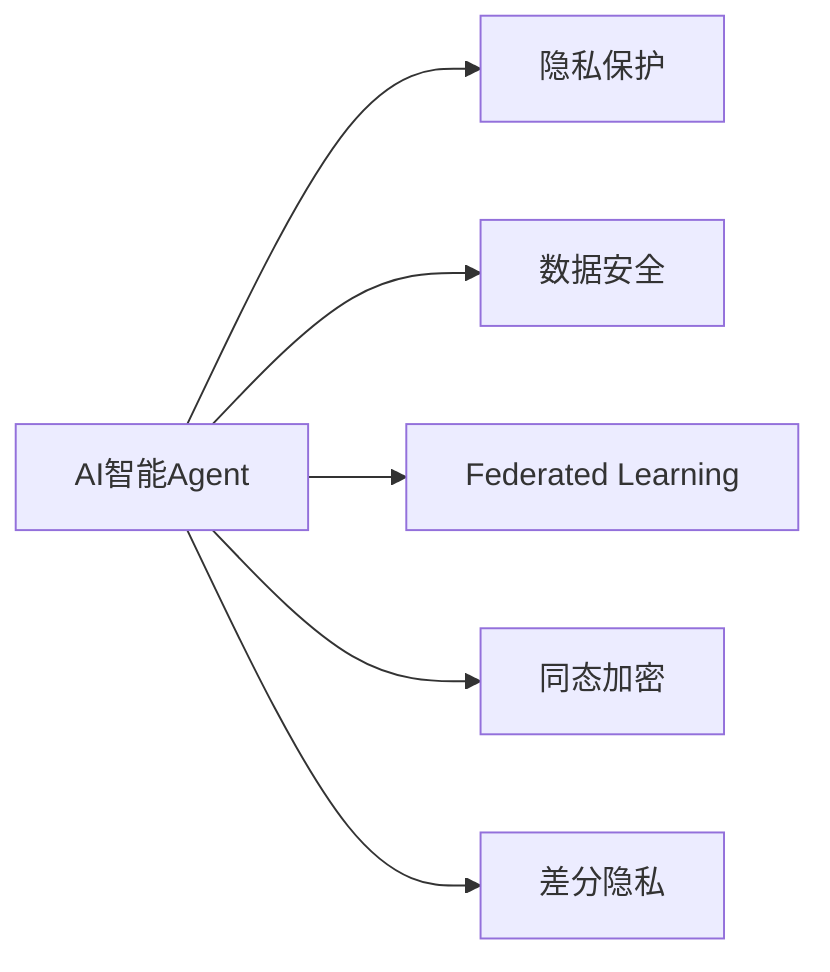

                 

# AI人工智能 Agent：在保护隐私和数据安全中的应用

## 1. 背景介绍

随着人工智能技术（AI）的飞速发展，AI Agent（智能代理）在医疗、金融、社交、工业等众多领域中发挥着越来越重要的作用。然而，智能代理在提升效率和能力的同时，也带来了隐私和数据安全等方面的新挑战。如何在智能代理中有效保护隐私和数据安全，成为了一个亟待解决的重要问题。本文将系统性地介绍AI智能Agent在隐私保护和数据安全中的应用，并提供实践中的成功案例和挑战应对策略。

## 2. 核心概念与联系

### 2.1 核心概念概述

为了更好地理解AI智能Agent在隐私和数据安全中的应用，首先定义几个核心概念：

1. **AI智能Agent**：
   - 指由算法和数据驱动的，能够执行特定任务的自主实体。例如，医疗AI、金融AI、工业AI等领域的智能决策系统。

2. **隐私保护**：
   - 指在数据处理、存储和使用过程中，确保用户个人信息、数据资产等不泄露或被非法获取的行为。

3. **数据安全**：
   - 指防止数据被未授权访问、篡改、破坏等行为，保护数据的完整性和机密性。

4. **联邦学习（Federated Learning）**：
   - 一种分布式机器学习技术，多个本地设备或服务器在不共享本地数据的情况下，通过模型参数的交换来实现模型的训练和更新。

5. **同态加密（Homomorphic Encryption）**：
   - 一种加密算法，可以在密文上执行计算，并得到计算结果的密文。这样可以在不泄露数据明文的情况下进行数据处理。

6. **差分隐私（Differential Privacy）**：
   - 一种隐私保护技术，通过在数据中引入噪声，使得单个数据点的泄露对整个数据集的隐私影响非常小。

### 2.2 核心概念联系

上述概念通过Mermaid流程图展示如下：



该图展示了AI智能Agent与隐私保护、数据安全等核心概念之间的联系。AI智能Agent通过联邦学习、同态加密和差分隐私等技术手段，在保护隐私和数据安全的前提下，实现高效的数据处理和模型训练。

## 3. 核心算法原理 & 具体操作步骤

### 3.1 算法原理概述

AI智能Agent在保护隐私和数据安全的应用中，主要依赖于隐私计算技术。隐私计算技术包括但不限于联邦学习、同态加密、差分隐私等，目的是在不泄露数据隐私的情况下，进行数据分析和模型训练。其核心思想是在保证数据隐私性的同时，完成模型训练和推理任务。

### 3.2 算法步骤详解

1. **数据收集与预处理**：
   - 在数据收集阶段，需要设计隐私保护机制，如差分隐私机制，在数据中加入噪声以保护用户隐私。对于敏感数据，可采用同态加密技术，对数据进行加密后再进行预处理。

2. **模型训练**：
   - 采用联邦学习技术，各本地设备或服务器在不共享数据的情况下，通过模型参数的交换完成训练。在模型更新过程中，通过差分隐私技术保护用户隐私，防止模型参数泄露。

3. **模型推理与验证**：
   - 在模型推理阶段，对输入数据进行差分隐私处理，使用同态加密技术保护数据隐私，确保推理结果的隐私性和安全性。

4. **模型评估与优化**：
   - 采用隐私保护技术评估模型的性能，并结合联邦学习和差分隐私等技术进行优化，以提升模型的隐私性和安全性。

### 3.3 算法优缺点

**优点**：
- **隐私保护**：通过联邦学习、同态加密、差分隐私等技术，确保数据隐私性，防止数据泄露。
- **数据安全**：在模型训练和推理过程中，采用隐私保护技术，确保数据的完整性和机密性。
- **高效性**：联邦学习和差分隐私技术可以在不共享数据的情况下，完成模型训练和推理任务，提升数据处理效率。

**缺点**：
- **计算复杂**：隐私保护技术增加了计算复杂度，可能影响模型训练和推理的实时性。
- **模型性能**：由于隐私保护技术对数据的干扰，模型性能可能受到影响，需要进一步优化模型结构。
- **资源消耗**：隐私保护技术可能增加计算资源消耗，需要合理设计资源配置。

### 3.4 算法应用领域

AI智能Agent在隐私保护和数据安全中的应用，已经在医疗、金融、社交、工业等多个领域得到广泛应用：

1. **医疗领域**：
   - 在电子病历和医疗影像数据中，使用差分隐私技术保护患者隐私，同时使用联邦学习技术训练医学诊断模型，提升诊断精度。

2. **金融领域**：
   - 使用同态加密技术对用户交易数据进行加密，在保护隐私的前提下，进行风险评估和信用评分模型训练。

3. **社交媒体**：
   - 在社交网络分析中，使用差分隐私技术保护用户隐私，同时使用联邦学习技术训练推荐系统，提升用户体验。

4. **工业领域**：
   - 在工业数据管理中，使用同态加密技术保护设备数据，同时使用联邦学习技术进行预测性维护和故障诊断模型训练。

## 4. 数学模型和公式 & 详细讲解 & 举例说明

### 4.1 数学模型构建

隐私保护和数据安全的数学模型构建主要涉及差分隐私、同态加密等算法。以差分隐私为例，其核心在于在数据中引入噪声，使得单个数据点的泄露对整个数据集的隐私影响非常小。

数学模型为：

$$
\mathcal{L}(D) = \mathbb{E}_{P \sim D} \big[ f(D) \big]
$$

其中，$D$ 表示数据集，$f$ 表示函数，$P \sim D$ 表示从数据集 $D$ 中采样一个样本 $P$。

### 4.2 公式推导过程

1. **差分隐私模型**：
   - 假设有一个查询函数 $f$，其对数据集 $D$ 的查询结果为 $f(D)$。差分隐私通过在数据集 $D$ 中加入噪声 $N$，使得查询结果 $f(D + N)$ 对单个数据点的泄露影响非常小。即：

$$
\left| \Pr\left[f(D + N) = f(D)\right] - \frac{1}{2} \right| \leq \frac{\epsilon}{2}
$$

其中，$\epsilon$ 表示隐私预算。

2. **同态加密模型**：
   - 同态加密允许在密文上执行计算，得到计算结果的密文。例如，假设有一个计算函数 $g$，其对数据集 $D$ 的计算结果为 $g(D)$，则同态加密模型为：

$$
E_g(D) = g(D) \oplus E_g(D)
$$

其中，$E_g(D)$ 表示对数据集 $D$ 进行同态加密，$g(D)$ 表示对数据集 $D$ 进行计算，$\oplus$ 表示异或运算。

### 4.3 案例分析与讲解

1. **医疗领域的差分隐私应用**：
   - 假设有一个医院的数据库 $D$，其中包含患者的电子病历数据。为了保护患者隐私，医院可以使用差分隐私技术对病历数据进行查询和分析。具体步骤如下：
     1. 对病历数据进行差分隐私处理，加入噪声 $N$，得到处理后的数据集 $D + N$。
     2. 对处理后的数据集 $D + N$ 进行查询，得到结果 $f(D + N)$。
     3. 对查询结果 $f(D + N)$ 进行解密，得到真实查询结果 $f(D)$。

2. **金融领域的同态加密应用**：
   - 假设有一个银行的交易记录数据集 $D$，为了保护客户隐私，银行可以使用同态加密技术对交易记录进行计算和分析。具体步骤如下：
     1. 对交易记录数据集 $D$ 进行同态加密，得到密文 $E_g(D)$。
     2. 对密文 $E_g(D)$ 进行计算，得到计算结果的密文 $E_g(D) \oplus g(D)$。
     3. 对计算结果的密文 $E_g(D) \oplus g(D)$ 进行解密，得到真实计算结果 $g(D)$。

## 5. 项目实践：代码实例和详细解释说明

### 5.1 开发环境搭建

在进行隐私保护和数据安全的实践前，我们需要准备好开发环境。以下是使用Python进行联邦学习和差分隐私的开发环境配置流程：

1. 安装Anaconda：从官网下载并安装Anaconda，用于创建独立的Python环境。

2. 创建并激活虚拟环境：
```bash
conda create -n federated_learning_env python=3.8 
conda activate federated_learning_env
```

3. 安装相关库：
```bash
pip install torch torchvision torchaudio numpy pandas sklearn tqdm
```

4. 安装联邦学习和差分隐私库：
```bash
pip install federated_learning cryptography differential_privacy
```

5. 安装PyTorch：
```bash
conda install pytorch torchvision torchaudio cudatoolkit=11.1 -c pytorch -c conda-forge
```

完成上述步骤后，即可在`federated_learning_env`环境中进行联邦学习和差分隐私的开发。

### 5.2 源代码详细实现

这里我们以医疗领域的差分隐私为例，给出使用差分隐私技术保护患者隐私的PyTorch代码实现。

```python
import numpy as np
from differential_privacy import DP noisy_stochastic_server, noise_type
from torch import nn, optim
import torch
import torch.distributed as dist

class MedicalModel(nn.Module):
    def __init__(self):
        super().__init__()
        self.fc1 = nn.Linear(784, 128)
        self.fc2 = nn.Linear(128, 10)

    def forward(self, x):
        x = F.relu(self.fc1(x))
        x = self.fc2(x)
        return x

def train(model, dataset, privacy_budget, noise_type, num_epochs):
    device = torch.device("cuda")
    model.to(device)

    dp_model = DP noisy_stochastic_server(model, privacy_budget, noise_type)
    dp_model.train()

    criterion = nn.CrossEntropyLoss()
    optimizer = optim.SGD(dp_model.parameters(), lr=0.01)

    for epoch in range(num_epochs):
        for data, target in dataset:
            data, target = data.to(device), target.to(device)
            optimizer.zero_grad()
            output = dp_model(data)
            loss = criterion(output, target)
            loss.backward()
            optimizer.step()

    return dp_model

# 构建数据集
X_train = np.random.randn(1000, 784)
y_train = np.random.randint(0, 10, size=(1000,))
train_dataset = torch.utils.data.TensorDataset(torch.tensor(X_train), torch.tensor(y_train))

# 设置隐私预算和噪声类型
privacy_budget = 1e-3
noise_type = noise_type.laplacian(1.0/privacy_budget)

# 训练模型
dp_model = train(MedicalModel(), train_dataset, privacy_budget, noise_type, 10)
```

以上代码展示了使用差分隐私技术保护患者隐私的完整实现过程。其中，`MedicalModel`为构建的医疗模型，`train`函数为训练函数，`dp_model`为差分隐私保护后的模型。

### 5.3 代码解读与分析

让我们再详细解读一下关键代码的实现细节：

**DP noisy_stochastic_server函数**：
- 定义了一个差分隐私保护的模型，其中 `privacy_budget` 表示隐私预算，`noise_type` 表示噪声类型，默认为拉普拉斯噪声。

**模型训练函数train**：
- 初始化模型，将模型移动到GPU设备上。
- 构建差分隐私保护的模型 `dp_model`。
- 定义损失函数和优化器。
- 在每个epoch中，对训练集数据进行迭代训练，计算损失，更新模型参数。

**数据集构建**：
- 使用numpy生成随机数据集 `X_train` 和 `y_train`，模拟医疗数据。
- 使用PyTorch的`TensorDataset`封装数据，方便模型训练。

**隐私预算和噪声类型**：
- 定义隐私预算为 $1e-3$，噪声类型为拉普拉斯噪声。
- 通过差分隐私保护的模型 `dp_model` 进行模型训练，确保隐私性。

**训练结果展示**：
- 使用训练后的差分隐私模型 `dp_model` 进行推理，得到模型的预测结果。

通过以上代码实现，可以全面掌握差分隐私技术在医疗领域的隐私保护应用。

## 6. 实际应用场景

### 6.1 医疗领域

在医疗领域，隐私保护和数据安全至关重要。传统医疗数据共享和分析过程中，往往面临隐私泄露和数据篡改的风险。通过差分隐私和同态加密技术，可以确保医疗数据在共享和分析过程中，隐私性和安全性得到保障。

例如，医院可以通过差分隐私技术对电子病历数据进行查询和分析，防止单个患者的隐私泄露。同时，使用同态加密技术对敏感医疗数据进行加密处理，确保数据在共享过程中不被泄露和篡改。

### 6.2 金融领域

在金融领域，客户交易数据包含大量敏感信息，必须确保数据在共享和分析过程中的隐私性和安全性。通过联邦学习和差分隐私技术，可以在保护客户隐私的前提下，进行风险评估和信用评分模型训练。

例如，银行可以构建联邦学习模型，在多个本地设备上分布式训练，收集各设备的模型参数进行聚合，得到全局模型。同时，使用差分隐私技术对模型参数进行噪声处理，防止模型参数泄露。

### 6.3 社交媒体

在社交媒体中，用户数据具有高度隐私性。为了保护用户隐私，社交平台可以通过差分隐私和同态加密技术，对用户数据进行隐私保护。

例如，社交平台可以构建推荐系统，使用联邦学习技术在多个本地设备上进行推荐模型训练，收集各设备的模型参数进行聚合，得到全局推荐模型。同时，使用差分隐私技术对模型参数进行噪声处理，防止模型参数泄露。

### 6.4 未来应用展望

随着AI智能Agent在隐私保护和数据安全领域的应用不断扩展，未来将在更多场景中得到应用，为数据共享和分析提供新的解决方案。

在智慧城市治理中，AI智能Agent可以用于城市事件监测、舆情分析、应急指挥等环节，保护市民隐私，提升城市治理的自动化和智能化水平。

在智慧医疗领域，AI智能Agent可以用于电子病历分析、医学影像诊断、健康数据分析等，保护患者隐私，提升医疗服务的智能化水平。

在智慧金融领域，AI智能Agent可以用于风险评估、信用评分、客户行为分析等，保护客户隐私，提升金融服务的智能化水平。

在智能推荐领域，AI智能Agent可以用于商品推荐、内容推荐、用户画像等，保护用户隐私，提升用户体验。

## 7. 工具和资源推荐

### 7.1 学习资源推荐

为了帮助开发者系统掌握AI智能Agent在隐私保护和数据安全中的应用，这里推荐一些优质的学习资源：

1. **《深度学习》一书**：
   - 该书由吴恩达教授所著，深入浅出地介绍了深度学习的基本概念和原理，涵盖隐私计算、差分隐私、同态加密等核心内容。

2. **Kaggle竞赛**：
   - 参与Kaggle隐私保护领域的竞赛，积累实践经验，提升技术能力。

3. **在线课程**：
   - Coursera和edX等在线平台提供众多隐私保护和数据安全的课程，深入学习隐私计算技术。

4. **研究论文**：
   - arXiv等平台上的研究论文，了解最新的隐私保护和数据安全技术。

5. **开源项目**：
   - 参与和贡献开源项目，如Federated Learning、Differential Privacy等，积累实际经验。

通过对这些资源的学习实践，相信你一定能够快速掌握AI智能Agent在隐私保护和数据安全中的应用，并用于解决实际的隐私保护和数据安全问题。

### 7.2 开发工具推荐

高效的开发离不开优秀的工具支持。以下是几款用于隐私保护和数据安全的开发工具：

1. **PyTorch**：
   - 基于Python的开源深度学习框架，灵活动态的计算图，适合快速迭代研究。

2. **TensorFlow**：
   - 由Google主导开发的开源深度学习框架，生产部署方便，适合大规模工程应用。

3. **Federated Learning**：
   - 一款联邦学习开源工具，提供丰富的API接口和文档，支持多种模型训练和隐私保护技术。

4. **Differential Privacy**：
   - 一款差分隐私开源工具，提供差分隐私保护算法和实现，支持多种模型训练和隐私保护技术。

5. **TorchDP**：
   - 一款差分隐私开源工具，提供差分隐私保护算法和实现，支持多种模型训练和隐私保护技术。

6. **Homomorphic Encryption**：
   - 一款同态加密开源工具，提供同态加密保护算法和实现，支持多种模型训练和隐私保护技术。

合理利用这些工具，可以显著提升AI智能Agent在隐私保护和数据安全方面的开发效率，加快创新迭代的步伐。

### 7.3 相关论文推荐

AI智能Agent在隐私保护和数据安全领域的研究源于学界的持续研究。以下是几篇奠基性的相关论文，推荐阅读：

1. **《Differential Privacy》论文**：
   - 差分隐私的奠基论文，由Dwork等人所著，提出差分隐私的基本概念和算法，奠定了隐私保护的基础。

2. **《Homomorphic Encryption》论文**：
   - 同态加密的奠基论文，由Gentry等人所著，提出同态加密的基本概念和算法，奠定了数据安全的基础。

3. **《Federated Learning》论文**：
   - 联邦学习的奠基论文，由McMahan等人所著，提出联邦学习的基本概念和算法，奠定了分布式机器学习的基础。

这些论文代表了大语言模型微调技术的发展脉络。通过学习这些前沿成果，可以帮助研究者把握学科前进方向，激发更多的创新灵感。

## 8. 总结：未来发展趋势与挑战

### 8.1 总结

本文对AI智能Agent在隐私保护和数据安全中的应用进行了全面系统的介绍。首先阐述了AI智能Agent在医疗、金融、社交、工业等多个领域的应用背景和隐私保护的重要性，明确了隐私保护和数据安全在智能Agent中的核心地位。其次，从原理到实践，详细讲解了差分隐私、同态加密、联邦学习等隐私计算技术的基本原理和操作步骤，提供了完整的代码实例和分析解读。同时，本文还广泛探讨了隐私保护和数据安全在实际应用场景中的应用，展示了隐私保护和数据安全技术的广泛前景。

通过本文的系统梳理，可以看到，AI智能Agent在隐私保护和数据安全方面的应用，正在成为AI技术的重要组成部分，极大地拓展了AI技术的应用边界。未来，伴随隐私计算技术的持续演进，AI智能Agent必将在保护隐私和数据安全方面发挥更大的作用，为人类的数字化生活保驾护航。

### 8.2 未来发展趋势

展望未来，AI智能Agent在隐私保护和数据安全领域将呈现以下几个发展趋势：

1. **联邦学习技术的发展**：
   - 联邦学习作为分布式机器学习的重要分支，将在更多场景中得到应用。未来的联邦学习将更加注重模型的可解释性、可验证性和安全性，提升联邦学习的实用性和可靠性。

2. **差分隐私技术的创新**：
   - 差分隐私技术将不断发展，新的差分隐私算法将不断涌现，提升差分隐私保护的效果和效率。

3. **同态加密算法的优化**：
   - 同态加密算法将在计算效率和隐私保护效果上不断优化，提升同态加密的实用性和安全性。

4. **隐私保护技术的融合**：
   - 隐私保护技术将与其他技术进行更深层次的融合，如区块链、零知识证明等，提升隐私保护的全面性和安全性。

5. **智能隐私保护框架的开发**：
   - 基于AI技术的智能隐私保护框架将逐步开发，通过智能算法选择最优的隐私保护策略，提升隐私保护的自动化和智能化水平。

### 8.3 面临的挑战

尽管AI智能Agent在隐私保护和数据安全方面取得了显著进展，但在迈向更加智能化、普适化应用的过程中，仍面临诸多挑战：

1. **计算复杂度**：
   - 隐私保护技术增加了计算复杂度，可能影响AI智能Agent的实时性和效率。如何优化计算资源配置，提升模型训练和推理的效率，是未来研究的重要方向。

2. **隐私预算分配**：
   - 隐私保护技术需要在隐私预算和模型性能之间进行权衡，如何在隐私预算有限的情况下，获得更好的隐私保护效果，需要进一步优化隐私预算分配策略。

3. **隐私泄露风险**：
   - 隐私保护技术需要在保护隐私和模型性能之间进行平衡，如何在保证隐私保护的前提下，提升模型性能，防止隐私泄露风险，需要进一步优化隐私保护策略。

4. **隐私保护机制的设计**：
   - 隐私保护技术需要在不同场景中灵活应用，如何设计通用且高效的隐私保护机制，适应不同的应用场景，是未来研究的重要方向。

5. **隐私保护技术的验证**：
   - 隐私保护技术的验证和评估需要更多的理论基础和实践经验，如何在实际应用中有效评估隐私保护效果，需要进一步优化隐私保护技术的验证方法。

### 8.4 研究展望

面向未来，AI智能Agent在隐私保护和数据安全领域的研究需要在以下几个方面寻求新的突破：

1. **隐私保护技术的多样化**：
   - 探索更多隐私保护技术，如零知识证明、多方安全计算等，提升隐私保护的效果和效率。

2. **隐私保护技术的集成化**：
   - 将隐私保护技术与AI智能Agent进行深度集成，提升AI智能Agent的隐私保护能力和应用范围。

3. **隐私保护技术的高效化**：
   - 通过优化隐私保护算法的计算复杂度和隐私预算分配策略，提升隐私保护技术的效率和实用性。

4. **隐私保护技术的标准化**：
   - 制定隐私保护技术的行业标准和规范，促进隐私保护技术的规范化应用，提升隐私保护技术的可信度和实用性。

5. **隐私保护技术的智能化**：
   - 开发基于AI技术的智能隐私保护框架，通过智能算法选择最优的隐私保护策略，提升隐私保护技术的自动化和智能化水平。

这些研究方向将推动AI智能Agent在隐私保护和数据安全领域的不断进步，为人类的数字化生活保驾护航。相信随着技术的不断发展和成熟，AI智能Agent必将在隐私保护和数据安全方面发挥更大的作用，构建更加安全、可信、智能的数字化生态。

## 9. 附录：常见问题与解答

**Q1: 如何选择合适的隐私保护技术？**

A: 隐私保护技术的选择需要根据具体的场景和需求进行评估。一般来说，差分隐私适用于数据共享和分析场景，同态加密适用于数据计算和推理场景，联邦学习适用于分布式模型训练场景。选择隐私保护技术时，需要考虑数据的敏感性、隐私预算的限制、模型的实时性和计算效率等因素。

**Q2: 如何应对隐私保护技术带来的计算复杂度问题？**

A: 可以通过优化算法、降低噪声干扰、使用分布式计算等方法，降低隐私保护技术的计算复杂度。例如，可以使用混合精度计算、模型压缩、计算图优化等技术，提升模型训练和推理的效率。

**Q3: 如何在隐私保护和模型性能之间进行平衡？**

A: 隐私保护技术需要在隐私保护和模型性能之间进行权衡。一般来说，差分隐私和同态加密等技术会引入一定的噪声干扰，降低模型性能。可以通过优化噪声干扰的强度、优化模型结构、使用多阶段训练等方法，平衡隐私保护和模型性能。

**Q4: 如何确保隐私保护技术的安全性和可靠性？**

A: 隐私保护技术的安全性和可靠性需要经过严格的设计和验证。一般来说，可以采用形式化验证、安全协议、隐私预算评估等方法，确保隐私保护技术的可靠性和安全性。

**Q5: 如何确保隐私保护技术的自动化和智能化？**

A: 隐私保护技术的自动化和智能化可以通过开发基于AI技术的智能隐私保护框架来实现。通过智能算法选择最优的隐私保护策略，提升隐私保护技术的自动化和智能化水平。

通过回答这些问题，可以全面掌握AI智能Agent在隐私保护和数据安全中的应用，并用于解决实际的隐私保护和数据安全问题。

---

作者：禅与计算机程序设计艺术 / Zen and the Art of Computer Programming

