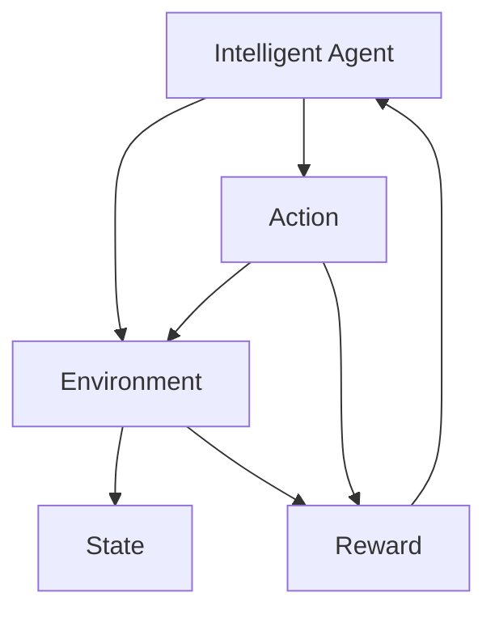

                 

# AI人工智能 Agent：环境建模与模拟

> 关键词：人工智能, 环境建模, 模拟, 行为学习, 优化算法, 应用场景, 实时仿真

## 1. 背景介绍

### 1.1 问题由来
在AI领域，特别是智能体(Agent)的研究中，环境建模与模拟是核心任务之一。智能体需要与环境进行交互，学习并优化其行为，以实现特定的目标。环境建模准确与否，直接影响到智能体的性能和决策效果。

近年来，随着深度学习、强化学习的迅猛发展，越来越多的智能体模型被提出，如Q-learning、DQN、Actor-Critic等，但这些模型的训练和评估均需要与实际环境交互，不仅耗时耗力，还难以在复杂、动态的环境中进行。因此，环境建模与模拟技术成为智能体研究的关键技术之一。

### 1.2 问题核心关键点
- 环境建模（Environment Modeling）：构建环境的状态表示，以供智能体学习与决策。
- 模拟（Simulation）：在虚拟环境中模拟智能体的行为，通过优化算法优化智能体策略。
- 行为学习（Behavior Learning）：智能体在虚拟环境中学习与优化行为，提升在真实环境中的表现。
- 优化算法（Optimization Algorithms）：如梯度下降、遗传算法等，用于优化智能体的策略。
- 应用场景（Applications）：如自动驾驶、机器人导航、金融交易、游戏AI等。

## 2. 核心概念与联系

### 2.1 核心概念概述

为了更好地理解环境建模与模拟，本节将介绍几个密切相关的核心概念：

- 智能体（Agent）：AI系统的一个单元，通过与环境交互来执行任务，如自动驾驶汽车、游戏AI角色等。
- 环境（Environment）：智能体互动的对象，可以是现实世界，也可以是虚拟世界。
- 状态（State）：环境的当前状态，包含智能体及其交互对象的状态信息。
- 动作（Action）：智能体对环境采取的行动，如加速、刹车、转向等。
- 奖励（Reward）：环境对智能体行为的反馈，鼓励智能体采取最优行动。

这些核心概念之间的逻辑关系可以通过以下Mermaid流程图来展示：



这个流程图展示智能体与环境之间的交互，通过观察状态、采取动作、接收奖励来更新状态，进而优化行为。

## 3. 核心算法原理 & 具体操作步骤

### 3.1 算法原理概述

基于环境建模与模拟的智能体学习过程，通常包括以下几个关键步骤：

1. **环境建模**：构建环境的数学模型，以描述环境的状态转换和智能体的行为影响。
2. **策略优化**：通过优化算法，寻找最优策略，以最大化奖励函数。
3. **行为模拟**：在虚拟环境中模拟智能体的行为，评估策略性能。
4. **状态更新**：根据智能体的动作和环境反馈，更新环境状态。

形式化地，假设环境的状态表示为 $S$，智能体的动作空间为 $A$，奖励函数为 $R$，智能体的策略为 $\pi$。智能体的目标是通过学习策略 $\pi$，最大化期望累计奖励 $J(\pi)$：

$$
J(\pi) = \mathbb{E}_{s_0}[\sum_{t=0}^{\infty} \gamma^t R(s_t, a_t)]
$$

其中 $s_0$ 为环境初始状态，$\gamma$ 为折扣因子。

### 3.2 算法步骤详解

以下我们详细介绍基于环境建模与模拟的智能体学习过程：

**Step 1: 构建环境模型**
- 确定环境的状态空间 $S$，动作空间 $A$。
- 定义状态转换函数 $P(s'|s,a)$，描述状态之间的转移概率。
- 定义奖励函数 $R(s,a)$，描述环境对智能体行为的反馈。

**Step 2: 设计优化算法**
- 选择优化算法，如梯度下降、遗传算法等。
- 设定初始策略 $\pi_0$ 和最优策略 $\pi^*$。
- 设定优化参数，如学习率、种群大小、迭代次数等。

**Step 3: 进行行为模拟**
- 在虚拟环境中模拟智能体行为，计算奖励。
- 记录智能体的动作和环境反馈，评估当前策略性能。
- 根据优化算法更新策略参数。

**Step 4: 状态更新**
- 根据智能体的动作和环境反馈，更新环境状态。
- 重复模拟过程，直至策略收敛或达到预设迭代次数。

### 3.3 算法优缺点

基于环境建模与模拟的智能体学习方法，具有以下优点：
1. 灵活性高。适用于各种复杂环境，能够构建不同规模的虚拟环境进行行为学习。
2. 控制性强。可以精确控制环境参数，避免环境对智能体性能的干扰。
3. 效率高。可以在虚拟环境中进行大规模模拟，快速评估策略性能。
4. 可重复性好。模拟过程可重复执行，便于调参和实验。

同时，该方法也存在一些局限性：
1. 环境建模难度大。复杂环境建模往往需要大量时间和专业知识，难以完全精确模拟。
2. 模型与实际环境差距大。虚拟环境与实际环境往往存在差异，影响智能体在真实环境中的性能。
3. 仿真效率低。大规模仿真计算需要高配置硬件支持，耗时较长。
4. 样本数量限制。虚拟环境中的样本数量有限，难以完全覆盖所有可能情况。

尽管存在这些局限性，基于环境建模与模拟的智能体学习方法仍是当前AI研究的热门范式，广泛应用于自动驾驶、游戏AI、机器人导航等领域。

### 3.4 算法应用领域

基于环境建模与模拟的智能体学习方法，在以下领域得到了广泛的应用：

- 自动驾驶：通过虚拟环境模拟智能体在复杂道路上的行为，训练自动驾驶系统。
- 机器人导航：在虚拟环境中训练机器人在复杂环境中的路径规划和避障能力。
- 金融交易：利用虚拟市场环境进行策略测试，优化交易策略。
- 游戏AI：在虚拟游戏环境中训练AI角色，提高游戏表现。
- 物流优化：在虚拟环境中进行路径规划和配送测试，优化物流方案。
- 工业仿真：在虚拟生产环境中进行设备运行和维护模拟，优化生产流程。

此外，环境建模与模拟技术还在军事模拟、灾害预测、城市规划等领域得到应用，为社会治理、安全防范等提供新的技术手段。

## 4. 数学模型和公式 & 详细讲解 & 举例说明

### 4.1 数学模型构建

在本节中，我们将使用数学语言对环境建模与模拟过程进行严格描述。

假设环境状态空间 $S$ 由离散状态 $s = \{s_1, s_2, ..., s_n\}$ 组成，智能体动作空间 $A$ 由离散动作 $a = \{a_1, a_2, ..., a_m\}$ 组成。环境奖励函数 $R(s,a)$ 和状态转移概率 $P(s'|s,a)$ 均为随机变量，定义为：

$$
R(s,a) = R(s,a) + \epsilon
$$

$$
P(s'|s,a) = P(s'|s,a) + \delta
$$

其中，$R(s,a)$ 和 $P(s'|s,a)$ 分别为期望奖励和转移概率，$\epsilon$ 和 $\delta$ 为随机噪声，用于模拟实际环境的不确定性。

### 4.2 公式推导过程

以Q-learning算法为例，推导智能体策略优化的数学公式。

Q-learning算法通过迭代更新状态-动作对 $(s,a)$ 的Q值，即：

$$
Q(s,a) = Q(s,a) + \alpha [R(s,a) + \gamma \max_{a'} Q(s',a') - Q(s,a)]
$$

其中，$\alpha$ 为学习率，$\gamma$ 为折扣因子，$Q(s,a)$ 为状态-动作对的价值函数，即：

$$
Q(s,a) = \mathbb{E}_{s_0}[\sum_{t=0}^{\infty} \gamma^t R(s_t,a_t)]
$$

根据Q-learning算法，智能体在当前状态 $s$ 下采取动作 $a$ 的奖励为 $R(s,a)$，未来状态 $s'$ 的最大Q值为 $\max_{a'} Q(s',a')$，折扣后的累积奖励为 $\gamma \max_{a'} Q(s',a')$，从而实现策略优化。

### 4.3 案例分析与讲解

以自动驾驶为例，分析基于环境建模与模拟的智能体学习过程：

1. **环境建模**：构建自动驾驶环境的数学模型，包括道路、交通信号、行人等元素。

2. **策略优化**：在虚拟环境中模拟自动驾驶汽车的行为，训练其避障、路径规划等策略。

3. **行为模拟**：在虚拟城市环境中，模拟汽车在不同道路和交通条件下的行驶行为，计算奖励。

4. **状态更新**：根据汽车的行驶动作和环境反馈，更新环境状态，如道路状态、交通信号、行人位置等。

通过上述过程，自动驾驶汽车能够在虚拟环境中不断优化其行为策略，提升在真实环境中的安全性和效率。

## 5. 项目实践：代码实例和详细解释说明

### 5.1 开发环境搭建

在进行环境建模与模拟的实践前，我们需要准备好开发环境。以下是使用Python进行SimPy开发的环境配置流程：

1. 安装Anaconda：从官网下载并安装Anaconda，用于创建独立的Python环境。

2. 创建并激活虚拟环境：
```bash
conda create -n simpy-env python=3.8 
conda activate simpy-env
```

3. 安装SimPy：
```bash
conda install simpy
```

4. 安装其他工具包：
```bash
pip install numpy matplotlib
```

完成上述步骤后，即可在`simpy-env`环境中开始开发实践。

### 5.2 源代码详细实现

下面我们以自动驾驶为例，给出使用SimPy进行环境建模与模拟的Python代码实现。

首先，定义自动驾驶环境：

```python
from simpy import Resource, Environment

class RoadEnvironment:
    def __init__(self, env, num_lanes):
        self.env = env
        self.lanes = [Resource(env, num_lanes) for _ in range(num_lanes)]
        
    def get_lane(self, lane_id):
        return self.lanes[lane_id]
```

然后，定义自动驾驶汽车：

```python
from simpy import Process

class AutodriveCar:
    def __init__(self, env, road_env):
        self.env = env
        self.road_env = road_env
        self.speed = 0
        self.lane = None
        
    def run(self):
        while True:
            # 从可用车道中选择一个
            lane = self.env.random.choice(self.road_env.lanes)
            with lane.request() as req:
                if req.status == 'granted':
                    # 在车道上行驶
                    self.speed += 1
                    yield self.env.timeout(1)
                elif req.status == 'rejected':
                    # 切换车道
                    lane = self.env.random.choice(self.road_env.lanes)
                    while lane.request().status == 'granted':
                        yield self.env.timeout(1)
```

最后，定义环境运行过程：

```python
import simpy

env = simpy.Environment()

road_env = RoadEnvironment(env, num_lanes=2)
car1 = AutodriveCar(env, road_env)
car2 = AutodriveCar(env, road_env)

env.process(car1.run())
env.process(car2.run())

env.run(until=10)
```

以上代码实现了一个包含两条车道的自动驾驶环境，每辆车以固定速度在车道上行驶。通过SimPy库，我们可以灵活定义环境元素和行为，实现大规模复杂系统的模拟。

### 5.3 代码解读与分析

让我们再详细解读一下关键代码的实现细节：

**RoadEnvironment类**：
- `__init__`方法：初始化环境对象，创建多个车道资源。
- `get_lane`方法：根据车道ID获取车道资源。

**AutodriveCar类**：
- `__init__`方法：初始化车辆对象，包括速度、当前车道等属性。
- `run`方法：定义车辆的行为，包括选择车道、加速、切换车道等。

**env.run**方法：
- `env`：SimPy环境对象。
- `run(until=10)`：运行环境，模拟至指定时间或事件发生。

通过上述过程，我们可以方便地构建虚拟自动驾驶环境，并在其中模拟车辆行为，评估策略性能。

## 6. 实际应用场景

### 6.1 自动驾驶

基于环境建模与模拟的智能体学习技术，可以应用于自动驾驶系统的开发和测试。传统自动驾驶系统需要依赖大量的道路测试，不仅耗时耗力，还存在一定的安全隐患。通过虚拟环境模拟，可以在不同路况、天气条件下测试自动驾驶系统，提升其安全性和可靠性。

在实践中，可以构建包含交叉口、行人、其他车辆等多种元素的虚拟城市环境，对自动驾驶汽车进行行为训练。通过Q-learning等优化算法，不断优化自动驾驶策略，以应对不同场景下的复杂决策。模拟结果可用于指导实际道路测试，加速自动驾驶技术的迭代升级。

### 6.2 机器人导航

机器人导航面临复杂的物理环境和行为约束，需要高效的模拟技术支持。基于环境建模与模拟的智能体学习技术，可以构建仿真环境，训练机器人路径规划和避障算法。

在实践中，可以定义地图、障碍物、传感器等环境元素，并在虚拟环境中进行机器人行为模拟。通过优化算法，不断调整机器人行为策略，使其在复杂环境中能够高效、安全地进行导航。仿真结果可用于实际机器人的行为测试，提升其智能化水平。

### 6.3 金融交易

金融市场环境复杂多变，传统的策略测试方法难以全面覆盖所有可能情况。基于环境建模与模拟的智能体学习技术，可以在虚拟市场环境中测试交易策略，评估其性能和鲁棒性。

在实践中，可以构建包含多种交易品种、价格波动、交易量等元素的虚拟市场环境，进行策略测试。通过强化学习等优化算法，不断优化交易策略，以应对市场变化和不确定性。模拟结果可用于实际交易系统的策略部署，提升交易性能和风险管理能力。

### 6.4 未来应用展望

随着环境建模与模拟技术的不断进步，基于智能体学习的方法将在更多领域得到应用，为各行各业带来变革性影响。

在智慧医疗领域，基于智能体学习的环境模拟技术可以用于模拟手术流程、药物试验等，提升医疗决策的科学性和安全性。

在智能教育领域，智能体学习技术可以应用于在线教育系统，模拟学生学习行为，优化教学策略，提升教育效果。

在智慧城市治理中，智能体学习技术可以应用于城市应急响应、资源调配等环节，提高城市管理的自动化和智能化水平，构建更安全、高效的未来城市。

此外，在企业生产、社会治理、文娱传媒等众多领域，基于智能体学习的环境模拟技术也将不断涌现，为经济社会发展注入新的动力。相信随着技术的日益成熟，智能体学习技术将成为AI技术落地的重要范式，推动人工智能技术在更多行业的应用。

## 7. 工具和资源推荐

### 7.1 学习资源推荐

为了帮助开发者系统掌握环境建模与模拟的理论基础和实践技巧，这里推荐一些优质的学习资源：

1. 《Reinforcement Learning: An Introduction》书籍：由Richard S. Sutton和Andrew G. Barto合著，全面介绍了强化学习的基本原理和应用实例，是学习环境建模与模拟的入门书籍。

2. SimPy官方文档：SimPy库的官方文档，提供了丰富的环境和行为模拟示例，是理解SimPy库的必备资料。

3. PyBullet官方文档：PyBullet库的官方文档，提供了机器人仿真的详细教程，是学习机器人仿真的必备资料。

4. OpenAI Gym文档：OpenAI Gym库的官方文档，提供了丰富的游戏AI仿真环境，是学习游戏AI的必备资料。

5. ROS官方文档：Robot Operating System的官方文档，提供了机器人操作系统和环境模拟的详细教程，是学习机器人仿真的必备资料。

通过对这些资源的学习实践，相信你一定能够快速掌握环境建模与模拟的精髓，并用于解决实际的AI问题。

### 7.2 开发工具推荐

高效的开发离不开优秀的工具支持。以下是几款用于环境建模与模拟开发的常用工具：

1. SimPy：Python环境建模与仿真库，支持复杂的系统模拟和行为分析。
2. PyBullet：Python机器人仿真库，支持多物理引擎，适用于机器人操作和环境模拟。
3. OpenAI Gym：Python游戏AI环境库，支持多种游戏环境的模拟和强化学习测试。
4. ROS：Robot Operating System，适用于机器人操作系统和环境模拟的开发和部署。
5. Gazebo：开源机器人仿真引擎，支持复杂物理环境和传感器模拟。
6. Unity3D：强大的游戏引擎，支持高度逼真的虚拟环境建模和行为模拟。

合理利用这些工具，可以显著提升环境建模与模拟的开发效率，加快创新迭代的步伐。

### 7.3 相关论文推荐

环境建模与模拟技术的发展源于学界的持续研究。以下是几篇奠基性的相关论文，推荐阅读：

1. Q-Learning: A New Method for General Reinforcement Learning（Q-Learning论文）：提出了Q-Learning算法，是强化学习的经典之作，奠定了强化学习在环境建模与模拟中的应用基础。

2. On the Properties of Neural Network Models for Automated Game Playing（DQN论文）：提出DQN算法，展示了神经网络在强化学习中的应用潜力，为环境建模与模拟技术带来了新思路。

3. A Survey of Robot Simulation（Robot Simulation论文）：综述了机器人仿真的主要技术和应用，为机器人学习和行为分析提供了全面视角。

4. Reinforcement Learning: A Survey（强化学习综述）：由Ian Osband等合著，全面综述了强化学习的最新进展，涵盖了环境建模与模拟技术的诸多方面。

这些论文代表了大语言模型微调技术的发展脉络。通过学习这些前沿成果，可以帮助研究者把握学科前进方向，激发更多的创新灵感。

## 8. 总结：未来发展趋势与挑战

### 8.1 总结

本文对基于环境建模与模拟的智能体学习过程进行了全面系统的介绍。首先阐述了环境建模与模拟的研究背景和意义，明确了智能体学习在智能体行为优化中的核心作用。其次，从原理到实践，详细讲解了环境建模与模拟的数学原理和关键步骤，给出了智能体学习任务开发的完整代码实例。同时，本文还广泛探讨了环境建模与模拟技术在自动驾驶、机器人导航、金融交易等多个行业领域的应用前景，展示了环境建模与模拟技术的广阔前景。

通过本文的系统梳理，可以看到，基于环境建模与模拟的智能体学习技术正在成为AI研究的热门范式，极大地拓展了智能体的应用边界，催生了更多的落地场景。受益于复杂环境的精确模拟，智能体在复杂决策和行为优化上取得了显著进步，为实际应用提供了有力支持。未来，伴随环境建模与模拟技术的持续演进，相信AI技术将在更多领域大放异彩，深刻影响人类的生产生活方式。

### 8.2 未来发展趋势

展望未来，环境建模与模拟技术将呈现以下几个发展趋势：

1. 环境复杂度提升。随着深度学习、强化学习技术的进步，虚拟环境能够模拟更复杂的物理和行为过程，提升智能体的行为学习能力。

2. 多模态融合。将视觉、语音、动作等多种模态信息融合到环境模拟中，提升智能体的感知和决策能力。

3. 实时仿真优化。通过优化算法和硬件支持，实现实时仿真，提高智能体的行为测试效率和可靠性。

4. 迁移学习应用。将智能体在虚拟环境中学习到的策略迁移到实际环境中，提高策略泛化能力和鲁棒性。

5. 因果学习融合。引入因果推断方法，提高智能体对因果关系的理解和决策能力。

6. 集成式仿真平台。开发集成式仿真平台，支持多种智能体模型和优化算法的组合使用，提升仿真效果和效率。

以上趋势凸显了环境建模与模拟技术的广阔前景。这些方向的探索发展，必将进一步提升智能体的性能和应用范围，为人类认知智能的进化带来深远影响。

### 8.3 面临的挑战

尽管环境建模与模拟技术已经取得了瞩目成就，但在迈向更加智能化、普适化应用的过程中，它仍面临着诸多挑战：

1. 环境建模难度大。构建高度逼真的虚拟环境，需要大量的时间和专业知识，难以完全精确模拟复杂环境。

2. 仿真效率低。大规模仿真计算需要高配置硬件支持，耗时较长，难以支持实时仿真。

3. 策略泛化能力有限。虚拟环境与实际环境往往存在差异，智能体在虚拟环境中学到的策略可能无法有效应用到实际环境。

4. 多模态融合困难。将多种模态信息融合到环境模拟中，需要多学科交叉的合作，技术难度较大。

5. 数据获取困难。真实环境中的数据难以获取和标注，限制了智能体学习效果的评估和优化。

6. 伦理和安全性问题。智能体在虚拟环境中学习到的行为可能存在伦理和安全性问题，需要深入研究。

正视环境建模与模拟技术面临的这些挑战，积极应对并寻求突破，将是大语言模型微调走向成熟的必由之路。相信随着学界和产业界的共同努力，这些挑战终将一一被克服，智能体学习技术将成为AI技术落地的重要范式，推动人工智能技术在更多行业的应用。

### 8.4 研究展望

面对环境建模与模拟技术面临的挑战，未来的研究需要在以下几个方面寻求新的突破：

1. 探索高效的仿真算法。开发高效的仿真算法，提升仿真效率，支持实时仿真和复杂环境模拟。

2. 发展多模态融合技术。将视觉、语音、动作等多种模态信息融合到环境模拟中，提升智能体的感知和决策能力。

3. 引入因果推断方法。通过因果推断方法，提升智能体对因果关系的理解和决策能力，减少策略泛化风险。

4. 集成多种智能体模型。开发集成式仿真平台，支持多种智能体模型和优化算法的组合使用，提升仿真效果和效率。

5. 引入外部知识库。将外部知识库、规则库等专家知识与智能体学习相结合，增强智能体的决策能力和知识应用能力。

这些研究方向的探索，必将引领环境建模与模拟技术迈向更高的台阶，为智能体学习技术的落地应用提供新的技术手段。面向未来，环境建模与模拟技术还需要与其他人工智能技术进行更深入的融合，如知识表示、因果推理、强化学习等，多路径协同发力，共同推动人工智能技术的进步。只有勇于创新、敢于突破，才能不断拓展智能体的边界，让智能技术更好地造福人类社会。

## 9. 附录：常见问题与解答

**Q1：环境建模与模拟技术是否适用于所有智能体学习任务？**

A: 环境建模与模拟技术适用于各种复杂的智能体学习任务，如自动驾驶、机器人导航、金融交易等。但在一些特定任务中，可能需要结合其他技术手段，如模拟仿真、现实世界测试等，以确保智能体的行为和决策能力。

**Q2：如何选择合适环境的建模方法？**

A: 选择合适环境的建模方法需要考虑多个因素，如任务复杂度、仿真效率、数据需求等。对于简单的任务，可以选择基于规则或概率模型的建模方法；对于复杂的任务，需要结合深度学习、强化学习等技术手段，构建高精度的仿真环境。

**Q3：如何提高智能体的泛化能力？**

A: 提高智能体的泛化能力需要从多个方面进行优化，如引入多模态信息、增加仿真环境的多样性、应用迁移学习等。通过多方面的综合优化，智能体能够在更复杂、多变的环境中表现出色。

**Q4：如何在虚拟环境中进行行为测试？**

A: 在虚拟环境中进行行为测试，需要选择合适的网络结构和优化算法。Q-Learning、DQN、Actor-Critic等算法均适用于智能体行为测试。同时，需要进行大规模模拟实验，以充分验证智能体的性能和鲁棒性。

**Q5：环境建模与模拟技术有哪些具体应用场景？**

A: 环境建模与模拟技术在自动驾驶、机器人导航、金融交易、游戏AI等多个领域得到广泛应用。通过构建虚拟环境，测试智能体的行为策略，优化决策效果，提升系统性能和鲁棒性。

通过对这些常见问题的解答，相信你能够更好地理解和应用环境建模与模拟技术，将其应用于各种智能体学习任务中，提升系统的智能化水平。

