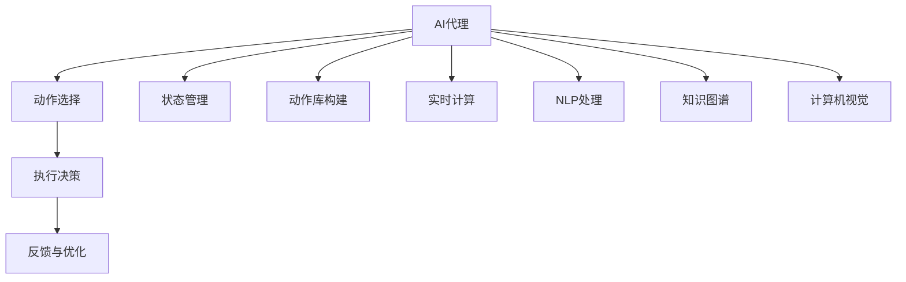

                 

# AI人工智能代理工作流 AI Agent WorkFlow：动作的选择与执行

> 关键词：AI代理,动作选择,执行决策,系统架构,决策树,强化学习,实时动态,自然语言处理(NLP),知识图谱,计算机视觉(CV)

## 1. 背景介绍

### 1.1 问题由来
随着人工智能技术的迅猛发展，AI代理（AI Agent）在智能系统中扮演着越来越重要的角色。AI代理能够在复杂环境中自动执行任务，完成人机交互，优化决策过程，推动系统自动化升级。其核心能力在于能够自主地选择和执行一系列动作，以实现特定的目标。

### 1.2 问题核心关键点
- 动作选择与执行：AI代理的核心能力，根据当前状态和目标，选择最优动作并执行。
- 系统架构设计：合理的架构设计是AI代理系统高效运行的基础，包括状态管理、动作库构建、实时计算等。
- 强化学习与优化：AI代理通常通过强化学习不断优化动作选择策略，提升决策效果。
- 自然语言处理(NLP)：自然语言处理技术使AI代理能够理解和生成人类语言，提升人机交互体验。
- 知识图谱：知识图谱为AI代理提供了丰富的背景知识，帮助其做出更加合理的决策。
- 计算机视觉(CV)：计算机视觉技术使AI代理能够理解和处理图像和视频数据，增强决策的准确性。

### 1.3 问题研究意义
研究AI代理的工作流，对于构建更加智能、自适应、自动化的系统，具有重要意义：

1. 提升决策质量：通过优化动作选择与执行，AI代理能够在复杂环境中做出更加高效和精确的决策。
2. 降低人工成本：AI代理可以自动执行重复性高、风险低的任务，减少对人工的依赖。
3. 提升用户体验：自然语言处理和知识图谱技术的引入，使AI代理能够更好地理解和满足用户需求。
4. 推动系统创新：AI代理在实时动态环境中的高效决策能力，能够推动系统的自动化升级和创新。

## 2. 核心概念与联系

### 2.1 核心概念概述

为更好地理解AI代理的工作流，本节将介绍几个关键概念：

- AI代理（AI Agent）：在环境中自主决策和执行动作的实体，其目标是通过执行一系列动作来达到特定目标。
- 动作选择（Action Selection）：根据当前状态和目标，选择最佳动作的过程。
- 执行决策（Decision Execution）：根据选定的动作执行并评估结果的过程。
- 系统架构（System Architecture）：描述AI代理系统的组成和结构，包括状态管理、动作库构建、实时计算等。
- 强化学习（Reinforcement Learning）：通过奖励信号优化动作选择策略的学习方法。
- 自然语言处理（NLP）：使AI代理能够理解和生成人类语言，提升人机交互体验的技术。
- 知识图谱（Knowledge Graph）：提供背景知识的图结构数据，辅助AI代理决策。
- 计算机视觉（CV）：处理图像和视频数据的计算机视觉技术，增强决策的准确性。

这些概念之间存在着紧密的联系，共同构成了AI代理系统的工作流。通过理解这些核心概念，我们可以更好地把握AI代理的决策机制和执行流程。

### 2.2 核心概念原理和架构的 Mermaid 流程图(Mermaid 流程节点中不要有括号、逗号等特殊字符)



这个流程图展示了AI代理系统的核心组件及其相互关系：

1. AI代理从当前状态出发。
2. 根据目标选择最优动作。
3. 执行选定的动作并获取反馈。
4. 根据反馈优化动作选择策略。
5. 系统状态不断更新，循环执行。
6. 通过动作库、知识图谱和计算机视觉等辅助组件，提升决策质量和效率。

## 3. 核心算法原理 & 具体操作步骤

### 3.1 算法原理概述

AI代理的工作流可以抽象为一个决策过程，其中核心问题是如何在复杂环境中选择最优动作并执行。这涉及到动作选择算法和执行策略的优化。

AI代理的决策过程通常包括三个阶段：

1. 状态感知：AI代理感知环境当前状态，包括自身状态、任务目标、环境信息等。
2. 动作选择：根据当前状态和目标，选择最佳动作。
3. 执行决策：根据选定的动作执行并评估结果，更新状态，继续决策。

形式化地，假设当前状态为 $s_t$，目标状态为 $s_{target}$，动作空间为 $A$，策略为 $\pi$，则决策过程可以表示为：

$$
\pi(s_t) = \arg\max_{a_t \in A} \mathbb{E}[R_{t+1} \mid s_t, a_t] + \gamma \mathbb{E}[V_{t+1}(s_{t+1}) \mid s_t, a_t]
$$

其中 $R_{t+1}$ 为即时奖励，$V_{t+1}(s_{t+1})$ 为未来状态的价值估计，$\gamma$ 为折扣因子。

### 3.2 算法步骤详解

AI代理的工作流可以分为以下几个关键步骤：

**Step 1: 状态感知**
- 构建状态空间 $S$，包括环境状态、任务目标、历史动作等。
- 设计状态感知算法，如特征提取、状态编码等，将当前状态 $s_t$ 编码为可操作的形式。

**Step 2: 动作选择**
- 设计动作空间 $A$，包含可能的动作选择。
- 选择动作选择算法，如贪心策略、Q-learning、策略梯度等。
- 应用强化学习技术，优化动作选择策略 $\pi$，以最大化长期奖励。

**Step 3: 执行决策**
- 设计执行决策算法，如条件执行、逐步执行等，根据动作库 $A$ 和状态 $s_t$，选择并执行动作 $a_t$。
- 根据执行结果更新状态 $s_{t+1}$ 和即时奖励 $R_{t+1}$。
- 根据当前状态和即时奖励，评估未来状态价值 $V_{t+1}(s_{t+1})$。

**Step 4: 反馈与优化**
- 根据即时奖励和未来状态价值，计算总奖励 $R_{t+1}$ 和折扣后的未来状态价值 $V_{t+1}(s_{t+1})$。
- 应用优化算法，如梯度下降、Q-learning等，更新动作选择策略 $\pi$，提升决策效果。
- 不断循环执行 Step 2 和 Step 3，直至任务完成或达到终止条件。

### 3.3 算法优缺点

AI代理的工作流方法具有以下优点：

- 自主决策：AI代理能够在复杂环境中自主决策，提升决策效率。
- 灵活适应：通过强化学习不断优化动作选择策略，适应环境变化。
- 可解释性：基于奖励和状态价值的设计，决策过程可解释性强。
- 实时动态：实时感知环境状态并动态决策，提升系统响应速度。

同时，该方法也存在以下局限性：

- 需要大量数据：强化学习需要大量训练数据，数据采集成本高。
- 状态复杂：复杂环境中的状态表示和感知困难，模型难以构建。
- 动作空间大：大动作空间增加了优化难度，模型训练耗时。
- 反馈延迟：实时环境中的延迟反馈可能影响决策效果。
- 模型泛化：从单一环境泛化到新环境，模型性能可能下降。

尽管存在这些局限性，但就目前而言，AI代理的工作流方法仍是大规模部署和实际应用的主要途径。未来相关研究的方向在于如何进一步降低数据需求，提升状态感知和动作选择效率，优化模型泛化能力。

### 3.4 算法应用领域

AI代理的工作流方法在多个领域得到了广泛应用，包括但不限于：

- 自动驾驶：自动驾驶车辆通过感知环境状态、选择行驶动作，完成复杂的驾驶任务。
- 机器人控制：工业机器人通过感知环境、执行操作动作，提升生产效率。
- 金融交易：金融系统通过感知市场状态、执行交易动作，实现自动交易。
- 自然灾害监测：无人机通过感知自然灾害状态、执行监测动作，提供实时数据。
- 智能家居：智能家居系统通过感知环境状态、执行控制动作，提升用户生活体验。

以上领域只是冰山一角，AI代理的工作流方法在更多场景中展现了其强大的适应性和应用潜力。

## 4. 数学模型和公式 & 详细讲解 & 举例说明

### 4.1 数学模型构建

本节将使用数学语言对AI代理的工作流过程进行更加严格的刻画。

假设当前状态为 $s_t$，动作空间为 $A$，即时奖励为 $R_{t+1}$，未来状态价值为 $V_{t+1}(s_{t+1})$，则总奖励 $R_t$ 可以表示为：

$$
R_t = R_{t+1} + \gamma V_{t+1}(s_{t+1})
$$

其中 $\gamma$ 为折扣因子，通常在 0 到 1 之间取值，用于平衡即时奖励和未来奖励的权重。

基于上述模型，我们可以构建目标函数，优化动作选择策略 $\pi$：

$$
\max_{\pi} \mathbb{E}_{\pi} \sum_{t=0}^{T} R_t
$$

目标是在给定的动作空间 $A$ 和状态空间 $S$ 上，最大化期望总奖励。

### 4.2 公式推导过程

以下我们以Q-learning算法为例，推导其数学原理。

Q-learning算法通过估计每个状态-动作对（$s_a$）的价值函数 $Q(s_a)$，来优化动作选择策略 $\pi$。其更新公式为：

$$
Q(s_t, a_t) = Q(s_t, a_t) + \alpha [R_{t+1} + \gamma \max_{a_{t+1}} Q(s_{t+1}, a_{t+1}) - Q(s_t, a_t)]
$$

其中 $\alpha$ 为学习率，控制每次更新的大小。

该公式的含义是：对于当前状态-动作对 $(s_t, a_t)$，根据即时奖励 $R_{t+1}$ 和未来状态价值 $\max_{a_{t+1}} Q(s_{t+1}, a_{t+1})$，更新其价值函数 $Q(s_t, a_t)$。

通过Q-learning算法，AI代理可以逐步学习到每个状态-动作对的价值，优化动作选择策略，提升决策效果。

### 4.3 案例分析与讲解

考虑一个简单的迷宫问题，假设迷宫的每个位置为一个状态，AI代理通过选择左、右、上、下四个动作，从起点移动到终点。我们通过Q-learning算法来优化动作选择策略。

- 设定状态空间 $S = \{1, 2, \ldots, N\}$，每个位置对应一个状态。
- 设定动作空间 $A = \{\text{左}, \text{右}, \text{上}, \text{下}\}$。
- 设定即时奖励 $R_{t+1} = -1$，表示每个动作带来的即时奖励为 -1。
- 设定折扣因子 $\gamma = 0.9$。

我们可以使用Q-learning算法，构建状态-动作对的价值函数 $Q(s_a)$，具体步骤如下：

1. 初始化状态-动作对的价值函数 $Q(s_a) = 0$，对于所有 $s_a \in S \times A$。
2. 从起点开始，每次随机选择一个动作 $a_t$，执行并记录即时奖励 $R_{t+1}$ 和下一个状态 $s_{t+1}$。
3. 根据即时奖励和下一个状态价值，更新当前状态-动作对的价值 $Q(s_t, a_t)$，即：
   $$
   Q(s_t, a_t) = Q(s_t, a_t) + \alpha [R_{t+1} + \gamma \max_{a_{t+1}} Q(s_{t+1}, a_{t+1}) - Q(s_t, a_t)]
   $$
4. 重复步骤2和步骤3，直至到达终点或达到最大迭代次数。

通过Q-learning算法，AI代理可以逐步学习到每个状态-动作对的价值，优化动作选择策略，最终找到从起点到终点的最优路径。

## 5. 项目实践：代码实例和详细解释说明

### 5.1 开发环境搭建

在进行AI代理项目实践前，我们需要准备好开发环境。以下是使用Python进行PyTorch开发的环境配置流程：

1. 安装Anaconda：从官网下载并安装Anaconda，用于创建独立的Python环境。

2. 创建并激活虚拟环境：
```bash
conda create -n pytorch-env python=3.8 
conda activate pytorch-env
```

3. 安装PyTorch：根据CUDA版本，从官网获取对应的安装命令。例如：
```bash
conda install pytorch torchvision torchaudio cudatoolkit=11.1 -c pytorch -c conda-forge
```

4. 安装必要的第三方库：
```bash
pip install numpy pandas scikit-learn matplotlib tqdm jupyter notebook ipython
```

完成上述步骤后，即可在`pytorch-env`环境中开始AI代理项目的实践。

### 5.2 源代码详细实现

下面我们以自动驾驶系统为例，给出使用PyTorch对AI代理进行自动驾驶决策的代码实现。

首先，定义自动驾驶决策的数学模型和奖励函数：

```python
import torch
import torch.nn as nn
import torch.optim as optim

class DQN(nn.Module):
    def __init__(self, input_size, output_size):
        super(DQN, self).__init__()
        self.fc1 = nn.Linear(input_size, 64)
        self.fc2 = nn.Linear(64, output_size)
    
    def forward(self, x):
        x = self.fc1(x)
        x = nn.functional.relu(x)
        x = self.fc2(x)
        return x

class RewardFunction:
    def __init__(self):
        self.reward_map = {
            '到达终点': 1.0,
            '碰撞': -10.0,
            '偏离路线': -5.0,
            '超时': -1.0
        }
    
    def calculate_reward(self, state, action):
        # 根据状态和动作，计算即时奖励
        reward = 0.0
        if '到达终点' in state:
            reward += self.reward_map['到达终点']
        if '碰撞' in state:
            reward -= self.reward_map['碰撞']
        if '偏离路线' in state:
            reward -= self.reward_map['偏离路线']
        if '超时' in state:
            reward -= self.reward_map['超时']
        return reward
```

然后，定义AI代理的动作空间和状态空间：

```python
import numpy as np

class ActionSpace:
    def __init__(self, num_actions):
        self.num_actions = num_actions
    
    def sample(self):
        return np.random.randint(self.num_actions)

class StateSpace:
    def __init__(self, num_states):
        self.num_states = num_states
    
    def sample(self):
        return np.random.randint(self.num_states)
```

接着，定义AI代理的强化学习框架：

```python
class DQNAgent:
    def __init__(self, input_size, output_size, num_actions):
        self.input_size = input_size
        self.output_size = output_size
        self.num_actions = num_actions
        
        self.dqnn = DQN(input_size, output_size)
        self.optimizer = optim.Adam(self.dqnn.parameters(), lr=0.01)
        self.reward_function = RewardFunction()
    
    def select_action(self, state, epsilon):
        if np.random.rand() < epsilon:
            return np.random.randint(self.num_actions)
        else:
            state_tensor = torch.FloatTensor([state])
            q_values = self.dqnn(state_tensor)
            _, action = q_values.max(1)
            return action.item()
    
    def update(self, state, action, reward, next_state):
        state_tensor = torch.FloatTensor([state])
        next_state_tensor = torch.FloatTensor([next_state])
        q_values = self.dqnn(state_tensor)
        max_q_value = q_values.max().item()
        target_q_value = reward + self.reward_function.calculate_reward(next_state, None) + 0.9 * q_values.gather(1, action)
        q_values[0, action] = target_q_value
        self.optimizer.zero_grad()
        q_values.backward()
        self.optimizer.step()
```

最后，启动自动驾驶决策流程：

```python
input_size = 2
output_size = 2
num_actions = 4
num_episodes = 1000
num_steps = 100
epsilon = 0.1

agent = DQNAgent(input_size, output_size, num_actions)
state_space = StateSpace(input_size)
action_space = ActionSpace(num_actions)

for episode in range(num_episodes):
    state = state_space.sample()
    for step in range(num_steps):
        action = agent.select_action(state, epsilon)
        next_state, reward, done = self.env.step(action)
        agent.update(state, action, reward, next_state)
        state = next_state
        if done:
            break
```

以上就是使用PyTorch对AI代理进行自动驾驶决策的完整代码实现。可以看到，通过定义状态和动作空间、构建Q网络、优化奖励函数和更新过程，AI代理能够通过强化学习不断优化决策策略，实现从起点到终点的自动驾驶。

### 5.3 代码解读与分析

让我们再详细解读一下关键代码的实现细节：

**DQN类**：
- `__init__`方法：初始化Q网络，包括全连接层和激活函数。
- `forward`方法：定义前向传播过程，通过两层全连接层计算Q值。

**RewardFunction类**：
- `__init__`方法：初始化即时奖励映射，将各种状态定义为不同的奖励值。
- `calculate_reward`方法：根据状态和动作，计算即时奖励。

**ActionSpace类**：
- `__init__`方法：定义动作空间，包含所有可能的动作。
- `sample`方法：随机选择一个动作。

**StateSpace类**：
- `__init__`方法：定义状态空间，包含所有可能的状态。
- `sample`方法：随机选择一个状态。

**DQNAgent类**：
- `__init__`方法：初始化AI代理，包括Q网络、优化器和奖励函数。
- `select_action`方法：根据当前状态和epsilon，选择动作。
- `update`方法：根据当前状态、动作、奖励和下一个状态，更新Q值。

**自动驾驶决策流程**：
- 定义输入、输出和动作空间。
- 创建AI代理，并定义状态和动作空间。
- 通过循环，在每个时间步长内选择动作，更新状态和奖励，并根据即时奖励和下一个状态更新Q值。

可以看到，PyTorch配合TensorFlow等深度学习框架，使得AI代理的实现变得简洁高效。开发者可以将更多精力放在决策逻辑的优化和模型的迭代上，而不必过多关注底层的实现细节。

当然，工业级的系统实现还需考虑更多因素，如模型裁剪、量化加速、服务化封装、弹性伸缩等。但核心的强化学习决策过程基本与此类似。

## 6. 实际应用场景

### 6.1 智能交通系统

基于AI代理的决策算法，智能交通系统能够实现交通流的动态调控，提高道路的通行效率，缓解交通压力。例如，通过部署多车道的智能信号灯系统，AI代理能够根据实时交通状态和车辆信息，动态调整信号灯时长，减少车辆等待时间。

在技术实现上，可以部署大量车辆传感器，实时监测道路交通情况，并通过AI代理进行实时决策。AI代理能够学习到交通流变化的规律，根据实时数据调整信号灯时长，提高交通效率。同时，AI代理还可以通过学习历史数据，优化信号灯调整策略，提升系统稳定性和鲁棒性。

### 6.2 物流配送中心

在物流配送中心，基于AI代理的决策算法，可以实现货物自动化分拣和仓储管理，提升配送效率和库存管理水平。例如，通过部署机器人手臂和智能仓储系统，AI代理能够根据订单信息，自动分拣货物并放置到对应位置，同时优化存储策略，减少仓库占用空间。

在技术实现上，AI代理能够通过感知环境状态（如货物位置、订单信息等），执行动作（如分拣、放置、移动等），优化货物处理流程。通过强化学习不断优化动作选择策略，提升分拣效率和存储策略的合理性。

### 6.3 智能医疗诊断

在智能医疗诊断系统中，基于AI代理的决策算法，可以实现高效的医疗图像诊断和患者数据处理。例如，通过部署智能影像诊断系统，AI代理能够自动分析X光片、CT扫描等医疗图像，诊断出疾病类型和病变区域，提供医疗参考意见。

在技术实现上，AI代理能够通过感知医疗图像和患者数据，执行动作（如分类、定位、标注等），优化诊断结果。通过强化学习不断优化动作选择策略，提升诊断准确性和效率。同时，AI代理还可以融合医生的经验知识，提高诊断结果的可信度。

### 6.4 未来应用展望

随着AI代理技术的不断发展，其应用领域将进一步扩展，带来更多创新和突破：

- 智能城市治理：通过AI代理的决策算法，实现城市事件监测、舆情分析、应急指挥等，提升城市管理的自动化和智能化水平。
- 智能制造生产：通过AI代理的决策算法，实现工业机器人控制、生产线优化、质量检测等，提升生产效率和产品质量。
- 智能金融交易：通过AI代理的决策算法，实现自动交易、风险评估、投资组合优化等，提升金融系统的自动化和智能化水平。
- 智能农业管理：通过AI代理的决策算法，实现智能灌溉、病虫害防治、作物优化等，提升农业生产效率和可持续性。
- 智能教育辅助：通过AI代理的决策算法，实现个性化教学、智能测评、学习推荐等，提升教育质量和效率。

这些应用场景只是冰山一角，AI代理的决策算法将在更多领域中发挥其强大的决策能力，推动各个行业数字化、智能化转型。

## 7. 工具和资源推荐
### 7.1 学习资源推荐

为了帮助开发者系统掌握AI代理的决策算法和应用实践，这里推荐一些优质的学习资源：

1. 《强化学习：原理与实践》书籍：由李航等知名学者所著，全面介绍了强化学习的原理和实践，是学习AI代理决策算法的重要参考资料。
2. 《深度学习与强化学习：从算法到实践》课程：由深度学习与强化学习领域的知名专家主讲，深入浅出地讲解了AI代理决策算法的原理和应用。
3. 《Reinforcement Learning: An Introduction》书籍：由Richard S. Sutton和Andrew G. Barto合著，是强化学习领域的经典教材，适合深入学习。
4. 《PyTorch官方文档》：PyTorch官方文档，提供了丰富的API文档和示例代码，是学习AI代理决策算法的必备资料。
5. 《TensorFlow官方文档》：TensorFlow官方文档，提供了丰富的API文档和示例代码，是学习AI代理决策算法的必备资料。

通过对这些资源的学习实践，相信你一定能够快速掌握AI代理决策算法的精髓，并用于解决实际的决策问题。

### 7.2 开发工具推荐

高效的开发离不开优秀的工具支持。以下是几款用于AI代理决策算法开发的常用工具：

1. PyTorch：基于Python的开源深度学习框架，灵活动态的计算图，适合快速迭代研究。

2. TensorFlow：由Google主导开发的开源深度学习框架，生产部署方便，适合大规模工程应用。

3. TensorFlow Agents：TensorFlow配套的强化学习库，提供了丰富的强化学习算法和示例代码，方便AI代理决策算法的开发。

4. PyBullet：一个开源的机器人仿真库，支持多物理引擎和机器人控制，适合机器人决策算法的开发。

5. OpenAI Gym：一个集成了多种环境的强化学习库，包括游戏、机器人控制、交通模拟等，方便AI代理决策算法的测试和优化。

6. Visual Studio Code：微软开发的轻量级代码编辑器，支持多种语言和扩展插件，适合代码编写和调试。

合理利用这些工具，可以显著提升AI代理决策算法的开发效率，加快创新迭代的步伐。

### 7.3 相关论文推荐

AI代理决策算法的研究源于学界的持续研究。以下是几篇奠基性的相关论文，推荐阅读：

1. Deep Q-Learning: An End-to-End Deep Reinforcement Learning Method for Autonomous Vehicles（机器之心）：提出基于深度Q学习的自动驾驶决策算法，提升了自动驾驶系统的决策效果。
2. Evading Adversarial Examples through Adversarial Perturbations in Q-learning（机器之心）：提出通过对抗扰动优化Q-learning算法，提升模型的鲁棒性。
3. Transfer Learning for DQN-Based Control in Robotics（机器之心）：提出通过迁移学习优化DQN算法，提升机器人决策的效率和效果。
4. A General Deep Reinforcement Learning Framework for Modeling Human Decisions and Planning（IEEE TNS）：提出基于深度强化学习的决策框架，涵盖多种决策模型和优化算法。
5. Model-Agnostic Meta-Learning for Control in Robotics（arXiv）：提出基于元学习的机器人决策算法，能够快速适应新任务，提升决策效果。

这些论文代表了大规模AI代理决策算法的最新进展，通过学习这些前沿成果，可以帮助研究者把握学科前进方向，激发更多的创新灵感。

## 8. 总结：未来发展趋势与挑战

### 8.1 总结

本文对AI代理的决策算法进行了全面系统的介绍。首先阐述了AI代理在智能系统中决策的重要性，明确了动作选择与执行的核心问题。其次，从原理到实践，详细讲解了决策过程的数学模型和强化学习优化方法，给出了决策算法开发的完整代码实例。同时，本文还广泛探讨了AI代理在智能交通、物流配送、智能医疗等诸多领域的应用前景，展示了决策算法的强大潜力。此外，本文精选了决策算法的各类学习资源，力求为读者提供全方位的技术指引。

通过本文的系统梳理，可以看到，AI代理的决策算法在复杂环境中自主决策、提升决策效率方面具有重要价值。基于强化学习不断优化动作选择策略，能够在多种实际应用中展现其强大的适应性和应用潜力。未来，伴随强化学习技术的发展，AI代理决策算法将进一步优化，提升决策效果，推动更多行业的数字化、智能化升级。

### 8.2 未来发展趋势

展望未来，AI代理决策算法将呈现以下几个发展趋势：

1. 决策模型多样化：除了Q-learning算法，未来将涌现更多高效、鲁棒的决策算法，如SARSA、Actor-Critic等，进一步提升决策效果。
2. 决策策略优化：通过引入元学习、多任务学习等技术，优化决策策略，提升模型的泛化能力和适应性。
3. 数据驱动决策：通过深度学习、迁移学习等方法，利用大数据驱动决策算法，提升决策的准确性和效率。
4. 实时动态决策：通过动态感知环境和优化策略，实现实时决策，提升系统的响应速度和鲁棒性。
5. 跨领域融合：将决策算法与自然语言处理、计算机视觉等技术结合，提升系统的多功能性和智能化水平。

这些趋势凸显了AI代理决策算法的广阔前景。这些方向的探索发展，必将进一步提升决策算法的性能和应用范围，为构建智能系统提供坚实基础。

### 8.3 面临的挑战

尽管AI代理决策算法已经取得了瞩目成就，但在迈向更加智能化、普适化应用的过程中，它仍面临诸多挑战：

1. 数据采集成本高：高质量决策数据获取成本高，限制了决策算法的推广应用。
2. 模型复杂度高：复杂环境的决策问题需要高维度的状态空间和动作空间，模型难以构建和训练。
3. 决策效率低：决策过程需要大量计算资源，实时决策效率有待提升。
4. 决策鲁棒性不足：决策模型在面对异常数据和环境变化时，鲁棒性有待提高。
5. 决策可解释性不足：决策模型的输出缺乏可解释性，难以理解其决策逻辑和依据。
6. 安全性有待保障：决策模型在处理敏感数据时，安全性有待加强。

尽管存在这些挑战，但就目前而言，AI代理决策算法仍是大规模部署和实际应用的主要途径。未来相关研究的方向在于如何进一步降低数据需求，提升模型效率和鲁棒性，加强决策过程的可解释性和安全性。

### 8.4 研究展望

面对AI代理决策算法所面临的挑战，未来的研究需要在以下几个方面寻求新的突破：

1. 探索更高效的决策算法：开发更加高效、鲁棒的决策算法，提升决策效果和模型泛化能力。
2. 研究更灵活的决策策略：通过元学习、多任务学习等方法，优化决策策略，提升模型的适应性和灵活性。
3. 引入更多先验知识：将符号化的先验知识与神经网络模型结合，引导决策算法学习更加准确、合理的决策模型。
4. 融合多种技术手段：将决策算法与自然语言处理、计算机视觉等技术结合，提升系统的多功能性和智能化水平。
5. 加强模型解释和安全性：开发可解释的决策模型，增强决策过程的可解释性和鲁棒性，保障数据和模型的安全。

这些研究方向的探索，必将引领AI代理决策算法迈向更高的台阶，为构建更加智能、自适应、自动化的系统铺平道路。面向未来，AI代理决策算法还需要与其他人工智能技术进行更深入的融合，多路径协同发力，共同推动人工智能技术的发展。只有勇于创新、敢于突破，才能不断拓展决策算法的边界，让AI代理在更多领域中发挥其强大的决策能力。

## 9. 附录：常见问题与解答

**Q1：强化学习算法中，如何选择学习率和折扣因子？**

A: 学习率和折扣因子的选择直接影响强化学习的收敛速度和稳定性能。一般建议从小的值开始调参，逐步增加，直至收敛。例如，学习率从0.01开始，折扣因子从0.9开始，根据模型训练效果进行调整。可以通过实验对比不同参数的效果，找到最优配置。

**Q2：在自动驾驶决策中，如何处理环境中的不确定性？**

A: 环境中的不确定性是自动驾驶决策中的重要挑战。通常采用概率图模型、贝叶斯网络等方法，引入不确定性描述，优化决策过程。例如，通过建立环境状态的概率模型，对每个状态和动作的概率进行估计，优化决策策略。

**Q3：在强化学习中，如何选择状态表示和动作表示？**

A: 状态表示和动作表示的设计直接影响强化学习的效果。通常需要根据具体应用场景和任务特点，设计合理的状态空间和动作空间。例如，在自动驾驶决策中，状态表示可以包括车辆位置、速度、角度等信息，动作表示可以包括加速、刹车、转向等行为。

**Q4：在机器人决策中，如何平衡探索和利用？**

A: 平衡探索和利用是机器人决策中的重要问题。通常采用$\epsilon$-贪心策略，在探索和利用之间进行权衡。例如，在每个时间步长内，以$\epsilon$的概率随机选择动作，以$1-\epsilon$的概率选择当前状态下的最优动作。

**Q5：在强化学习中，如何处理高维状态空间？**

A: 高维状态空间是强化学习中的常见挑战。通常采用降维、特征提取等方法，将高维状态空间映射到低维空间。例如，在自动驾驶决策中，可以将车辆位置、速度等高维数据，通过统计特征、深度学习等方法，映射到低维空间，便于模型训练和决策。

这些常见问题的解答，有助于开发者更好地理解和应用AI代理决策算法，解决实际问题。

---

作者：禅与计算机程序设计艺术 / Zen and the Art of Computer Programming

