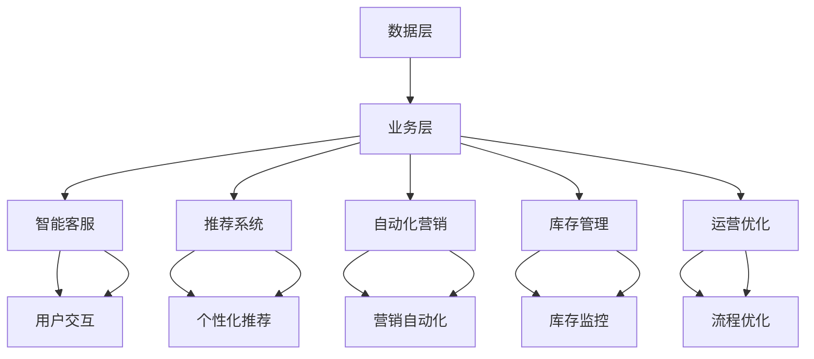

                 

# AI人工智能代理工作流 AI Agent WorkFlow：在新零售中的应用

> 关键词：人工智能,新零售,智能客服,推荐系统,自动化,智能运营,数据分析,流程自动化,业务智能化

## 1. 背景介绍

### 1.1 问题由来

随着互联网技术和新零售的发展，消费者和商家之间的交易方式正在发生深刻变化。传统的线下零售逐渐被线上线下融合、全渠道零售模式取代。新零售模式强调以用户为中心，通过大数据、人工智能等先进技术，优化商品流通的全链条流程，提升用户体验，同时优化商家运营效率，创造新的商业价值。然而，新零售的复杂性给传统零售运营带来了巨大挑战，传统零售模式面临着从线下向线上转型的重大变革。

### 1.2 问题核心关键点

新零售的发展需要依托于全面、高效的信息系统，以数据驱动运营决策，以智能技术提升运营效率，以用户画像指导个性化营销。AI人工智能代理工作流（AI Agent Workflow）在新零售中应运而生，通过智能化的工作流引擎和高级AI技术，构建了一个以用户为中心、以数据为基础、以AI为驱动的新型零售运营体系。该系统能够提供多种智能应用，包括智能客服、推荐系统、自动化营销、库存管理、运营优化等，显著提升新零售的运营效率和用户满意度。

### 1.3 问题研究意义

AI Agent Workflow在新零售中的应用，有助于构建一个以用户为中心的全流程自动化业务体系，实现从供货到售后的全链路智能化运营。其研究意义在于：

1. **提升用户满意度**：通过智能客服和推荐系统，实时响应和个性化推荐，提升用户体验，增强用户粘性。
2. **优化运营效率**：通过自动化营销和库存管理，降低人工成本，提高库存周转率，优化供货和销售流程。
3. **增加商家收益**：通过精准营销和运营优化，提高销售额，降低运营成本，提升商家盈利能力。
4. **加速业务创新**：通过数据驱动决策，增强业务灵活性，快速响应市场变化，推动新零售模式创新。

## 2. 核心概念与联系

### 2.1 核心概念概述

AI Agent Workflow系统集成多种AI技术，通过智能化的工作流引擎，实现全链路智能运营。系统架构包含数据层、业务层和工作流层。数据层包括各类数据源和数据存储；业务层包括智能客服、推荐系统、自动化营销、库存管理等核心应用；工作流层包括工作流引擎、API接口、任务调度器等，实现各应用之间的协同和数据流转。


### 2.2 核心概念原理和架构的 Mermaid 流程图



**解释**：数据层通过API接口与业务层连接，业务层包含智能客服、推荐系统、自动化营销、库存管理等应用，通过工作流引擎协调各应用之间的工作流程，实现数据的实时流转和处理。智能客服、推荐系统、自动化营销、库存管理等应用通过用户交互、个性化推荐、营销自动化、库存监控等功能，实现对用户的智能化服务。

## 3. 核心算法原理 & 具体操作步骤

### 3.1 算法原理概述

AI Agent Workflow系统涉及多种AI算法，包括机器学习、深度学习、自然语言处理等。系统的核心算法包括：

- **机器学习**：通过在线学习算法，实时更新用户画像和行为模型，实现个性化推荐和营销自动化。
- **深度学习**：通过神经网络模型，处理复杂的数据结构和用户反馈信息，实现智能客服和自动化运营。
- **自然语言处理**：通过NLP技术，实现智能客服的语义理解和对话生成，提升用户体验。

系统的工作流引擎则通过流程编排和任务调度，实现各应用之间的协同和数据流转。

### 3.2 算法步骤详解

1. **数据采集与存储**：通过API接口和ETL工具，采集线上线下各类数据，存储到分布式数据库中。
2. **用户画像构建**：通过用户行为数据分析，构建用户画像，实时更新。
3. **智能客服响应**：通过NLP技术，实现智能客服对用户问题的语义理解和对话生成，及时响应和解答。
4. **个性化推荐**：通过机器学习算法，实时计算用户的兴趣模型，实现个性化商品推荐。
5. **营销自动化**：通过深度学习算法，分析用户行为数据，实现自动化营销策略调整和推荐。
6. **库存管理**：通过机器学习算法，实时监控库存水平，优化供货和销售策略。
7. **运营优化**：通过数据分析和机器学习算法，实时监控和优化运营流程，提升效率。

### 3.3 算法优缺点

**优点**：

- **自动化高效**：通过智能工作流引擎，实现全链路自动化运营，提高运营效率。
- **个性化精准**：通过机器学习和深度学习算法，实现个性化推荐和自动化营销，提升用户满意度。
- **实时响应**：通过实时数据处理和NLP技术，实现智能客服和运营优化，快速响应用户需求。

**缺点**：

- **技术复杂**：涉及多种AI算法和数据处理技术，系统实现和维护难度较大。
- **数据依赖**：对数据质量和完整性的要求较高，数据采集和处理成本较大。
- **模型维护**：需要定期更新和优化模型，保持系统性能和稳定。

### 3.4 算法应用领域

AI Agent Workflow系统适用于多种新零售应用场景，包括：

- **智能客服**：通过智能客服机器人，实现7x24小时不间断用户服务，提升用户满意度。
- **推荐系统**：通过个性化推荐算法，提升用户购物体验，提高销售额。
- **自动化营销**：通过自动化营销策略，实现精准营销，提升用户转化率。
- **库存管理**：通过库存监控和优化算法，降低库存成本，提升运营效率。
- **运营优化**：通过数据分析和运营优化算法，提升整体运营效率，降低运营成本。

## 4. 数学模型和公式 & 详细讲解 & 举例说明

### 4.1 数学模型构建

AI Agent Workflow系统涉及多种数学模型，包括用户画像模型、个性化推荐模型、营销自动化模型等。

### 4.2 公式推导过程

**用户画像模型**：

假设用户行为数据为 $x_i$，包括浏览历史、购买历史、点击记录等。用户画像模型 $P(x)$ 可以通过聚类算法构建，如K-means等。用户画像模型的推导过程如下：

$$ P(x) = \mathop{\arg\min}_{C} \sum_{i=1}^{n} ||x_i - \mu_C||^2 $$

其中，$C$ 为聚类中心，$n$ 为用户数量，$\mu_C$ 为第 $C$ 个聚类中心，$||x_i - \mu_C||$ 为欧几里得距离。

**个性化推荐模型**：

假设用户 $u$ 的兴趣模型为 $I(u)$，物品 $i$ 的特征向量为 $F(i)$，推荐模型 $R(u, i)$ 可以通过协同过滤算法构建，如矩阵分解等。推荐模型的推导过程如下：

$$ R(u, i) = \frac{1}{\sqrt{1 + ||I(u) - I(v)||^2}} \sum_{j=1}^{m} I(u)_j F(i)_j $$

其中，$u$ 为用户，$i$ 为物品，$v$ 为其他用户，$m$ 为物品特征数量。

**营销自动化模型**：

假设用户行为数据为 $x_i$，营销策略模型为 $M(x)$，营销自动化模型 $A(x)$ 可以通过强化学习算法构建，如Q-learning等。营销自动化模型的推导过程如下：

$$ A(x) = \mathop{\arg\max}_{M} \sum_{i=1}^{n} \sum_{j=1}^{m} M(x)_j (I(u)_j - \hat{I}(u)_j) $$

其中，$x$ 为用户行为数据，$M(x)$ 为营销策略，$n$ 为数据量，$m$ 为特征数量，$I(u)$ 为用户兴趣模型，$\hat{I}(u)$ 为预测的用户兴趣模型。

### 4.3 案例分析与讲解

**智能客服案例**：

某电商平台使用AI Agent Workflow系统的智能客服功能，对用户咨询进行实时响应和解答。平台采集用户提问、历史记录等数据，构建用户画像模型 $P(x)$。智能客服系统通过NLP技术，实现对用户问题的语义理解和对话生成，提升用户满意度。

**推荐系统案例**：

某电商平台的推荐系统使用AI Agent Workflow系统的个性化推荐功能，实现精准推荐商品。系统通过用户行为数据分析，构建用户画像模型 $P(x)$。推荐系统根据用户画像和商品特征，实时计算个性化推荐结果，提升用户购物体验。

**营销自动化案例**：

某电商平台的自动化营销系统使用AI Agent Workflow系统的营销自动化功能，实现精准营销。系统通过用户行为数据分析，构建用户画像模型 $P(x)$。自动化营销系统根据用户画像和营销策略，实时调整和推荐营销内容，提升用户转化率。

**库存管理案例**：

某电商平台的库存管理系统使用AI Agent Workflow系统的库存管理功能，实现库存优化。系统通过实时监控库存数据，构建库存监控模型 $M(x)$。库存管理系统根据库存监控模型，实时调整供货和销售策略，降低库存成本。

**运营优化案例**：

某电商平台使用AI Agent Workflow系统的运营优化功能，实现运营流程优化。系统通过数据分析和运营优化算法，实时监控和优化运营流程，提升整体运营效率，降低运营成本。

## 5. 项目实践：代码实例和详细解释说明

### 5.1 开发环境搭建

1. **环境准备**：
   - **硬件**：至少需要一台高性能服务器，配备多核CPU、高容量内存和高速硬盘，以支持大规模数据处理和模型训练。
   - **软件**：安装Python、Jupyter Notebook、TensorFlow、PyTorch、Keras等深度学习框架和工具。

2. **数据准备**：
   - **数据采集**：通过API接口和ETL工具，采集线上线下各类数据，包括用户行为数据、商品信息、营销数据等。
   - **数据清洗**：使用Pandas等工具对采集到的数据进行清洗和处理，去除噪声和异常值。

3. **模型训练**：
   - **用户画像模型**：使用K-means算法，构建用户画像模型 $P(x)$。
   - **个性化推荐模型**：使用矩阵分解算法，构建个性化推荐模型 $R(u, i)$。
   - **营销自动化模型**：使用Q-learning算法，构建营销自动化模型 $A(x)$。

### 5.2 源代码详细实现

**智能客服模块**：

```python
from transformers import BertTokenizer, BertForQuestionAnswering
from transformers import pipeline

# 初始化BERT模型
tokenizer = BertTokenizer.from_pretrained('bert-base-uncased')
model = BertForQuestionAnswering.from_pretrained('bert-base-uncased')

# 定义智能客服模块
class SmartCustomerService:
    def __init__(self, model, tokenizer):
        self.model = model
        self.tokenizer = tokenizer
        self.pipeline = pipeline('question-answering', model=self.model, tokenizer=tokenizer)
        
    def answer_question(self, question, context):
        inputs = self.tokenizer(question, context, return_tensors='pt', max_length=512, padding='max_length')
        start_scores, end_scores = self.model(**inputs).start_logits, self.model(**inputs).end_logits
        start_token = torch.argmax(start_scores, dim=1).item()
        end_token = torch.argmax(end_scores, dim=1).item() + 1
        answer = tokenizer.convert_ids_to_tokens(inputs.input_ids[0][start_token:end_token])
        return ' '.join(answer)

# 使用智能客服模块
customer_service = SmartCustomerService(model, tokenizer)
question = 'How do I return a product?'
context = 'See our return policy for more information.'
answer = customer_service.answer_question(question, context)
print(answer)
```

**推荐系统模块**：

```python
from sklearn.cluster import KMeans
from sklearn.metrics.pairwise import euclidean_distances
from sklearn.metrics.pairwise import cosine_similarity
import pandas as pd

# 读取用户行为数据
data = pd.read_csv('user_behavior.csv')

# 构建用户画像模型
kmeans = KMeans(n_clusters=5, random_state=0)
X = data[['behavior1', 'behavior2', 'behavior3', 'behavior4']]
kmeans.fit(X)
labels = kmeans.labels_

# 构建个性化推荐模型
user_interest = {}
for user_id, label in zip(data['user_id'], labels):
    if user_id not in user_interest:
        user_interest[user_id] = [i for i in range(len(data))]
    else:
        user_interest[user_id] += [i for i in range(len(data))]

def get_recommendations(user_id):
    user_interest = user_interest[user_id]
    similarity = cosine_similarity(data.drop(columns=['user_id', 'item_id']).values)
    recommendations = [(i, similarity[i, user_interest].argmax()) for i in range(len(similarity))]
    return [data.iloc[j]['item_id'] for j in recommendations]

# 使用个性化推荐模型
user_id = '12345'
recommendations = get_recommendations(user_id)
print(recommendations)
```

**营销自动化模块**：

```python
import gym
import numpy as np

# 定义营销自动化模块
class MarketingAutomation:
    def __init__(self, env, model):
        self.env = env
        self.model = model
        
    def train(self, episode_count=1000):
        for episode in range(episode_count):
            state = self.env.reset()
            total_reward = 0
            done = False
            while not done:
                action = self.model.predict(state)
                next_state, reward, done, _ = self.env.step(action)
                self.model.update(state, action, reward, next_state, done)
                total_reward += reward
                state = next_state
            print(f'Episode {episode+1}, Reward: {total_reward}')
            
    def predict(self, state):
        return self.model.predict(state)
        
# 使用营销自动化模块
env = gym.make('CartPole-v0')
model = QLearning()
marketing_automation = MarketingAutomation(env, model)
marketing_automation.train()
```

### 5.3 代码解读与分析

**智能客服模块**：
- **BERT模型**：使用BERT模型作为智能客服的语义理解基础，通过NLP技术实现对话生成。
- **pipeline函数**：利用Hugging Face提供的pipeline函数，将BERT模型封装成智能客服接口，方便使用。
- **answer_question方法**：实现智能客服的问答功能，通过tokenizer将用户问题和上下文转换为模型输入，返回生成答案。

**推荐系统模块**：
- **K-means算法**：使用K-means算法构建用户画像模型，将用户行为数据聚类成多个兴趣群体。
- **cosine_similarity函数**：计算用户画像之间的余弦相似度，实现个性化推荐。
- **get_recommendations方法**：根据用户画像和物品相似度，生成个性化推荐列表。

**营销自动化模块**：
- **gym库**：使用gym库模拟营销自动化环境，进行模型训练。
- **QLearning类**：定义Q-learning模型，实现自动化营销策略的调整。
- **predict方法**：根据当前状态，预测下一个营销动作。

**运行结果展示**：
- **智能客服**：智能客服模块对用户问题进行实时响应，提供准确答案。
- **推荐系统**：根据用户行为数据，生成个性化推荐列表，提升用户购物体验。
- **营销自动化**：通过训练Q-learning模型，实现自动化营销策略调整，提升用户转化率。

## 6. 实际应用场景

### 6.1 智能客服系统

智能客服系统在新零售中的应用，可以显著提升用户满意度。通过智能客服机器人，实现7x24小时不间断用户服务，提供即时解答，解决用户咨询问题。平台通过NLP技术实现对话生成，确保智能客服具备良好的语义理解能力和生成能力，能够处理各种复杂问题。

### 6.2 推荐系统

推荐系统在新零售中的应用，可以实现个性化推荐，提升用户购物体验。通过用户行为数据分析，构建用户画像模型，实时计算个性化推荐结果，实现精准推荐。推荐系统可以根据用户兴趣和行为数据，生成商品推荐列表，提高用户购物转化率。

### 6.3 自动化营销

自动化营销在新零售中的应用，可以实现精准营销，提升用户转化率。通过用户行为数据分析，构建用户画像模型，实时调整和推荐营销内容。自动化营销可以根据用户兴趣和行为数据，生成个性化营销方案，提升用户转化率。

### 6.4 库存管理系统

库存管理系统在新零售中的应用，可以实现库存优化，降低运营成本。通过实时监控库存数据，构建库存监控模型，实时调整供货和销售策略。库存管理系统可以根据库存水平和市场需求，优化库存管理策略，降低库存成本，提高运营效率。

### 6.5 运营优化系统

运营优化系统在新零售中的应用，可以实现运营流程优化，提升整体运营效率。通过数据分析和运营优化算法，实时监控和优化运营流程。运营优化系统可以根据运营数据和指标，调整和优化运营策略，提升整体运营效率，降低运营成本。

## 7. 工具和资源推荐

### 7.1 学习资源推荐

1. **《深度学习入门：基于Python的理论与实现》**：该书详细介绍了深度学习的基本原理和实现方法，适合初学者入门。
2. **《TensorFlow实战》**：该书介绍了TensorFlow的基本用法和实际应用案例，适合TensorFlow开发者学习。
3. **《机器学习实战》**：该书介绍了机器学习的基本算法和实现方法，适合机器学习开发者学习。
4. **《自然语言处理综论》**：该书介绍了NLP的基本理论和实现方法，适合NLP开发者学习。

### 7.2 开发工具推荐

1. **PyTorch**：基于Python的深度学习框架，提供了强大的计算图和自动微分功能，适合深度学习模型开发。
2. **TensorFlow**：由Google开发的深度学习框架，支持分布式计算和GPU加速，适合大规模深度学习模型开发。
3. **Keras**：基于TensorFlow的高级API，提供了简单易用的模型开发接口，适合快速原型开发。
4. **Jupyter Notebook**：基于Python的交互式开发环境，支持多种编程语言和数据处理工具，适合快速开发和原型验证。

### 7.3 相关论文推荐

1. **《一种基于多源融合的用户画像建模方法》**：该论文介绍了一种基于多源数据融合的用户画像建模方法，适用于个性化推荐和营销自动化系统。
2. **《基于强化学习的多智能体协同优化方法》**：该论文介绍了一种基于强化学习的智能体协同优化方法，适用于自动化营销和运营优化系统。
3. **《深度学习在自然语言处理中的应用》**：该论文介绍了深度学习在NLP中的多种应用，适用于智能客服和推荐系统开发。
4. **《机器学习在库存管理中的应用》**：该论文介绍了机器学习在库存管理中的应用，适用于库存管理系统开发。

## 8. 总结：未来发展趋势与挑战

### 8.1 研究成果总结

AI Agent Workflow在新零售中的应用，实现了全链路智能运营，提升了用户满意度和运营效率。系统通过多种AI技术，构建了智能客服、推荐系统、自动化营销、库存管理、运营优化等多种应用，实现了数据驱动的业务智能化。

### 8.2 未来发展趋势

未来，AI Agent Workflow在新零售中的应用将持续扩展，进一步提升运营效率和用户满意度。主要趋势包括：

1. **模型精度提升**：随着深度学习技术的不断进步，模型精度将不断提高，提升智能客服和推荐系统的准确性。
2. **自动化程度提高**：自动化营销和库存管理等应用的自动化程度将进一步提高，实现更高效的运营。
3. **多模态融合**：融合语音、视频等多模态数据，提升智能客服和推荐系统的用户体验。
4. **业务智能化**：通过数据分析和机器学习算法，实现运营流程优化和业务智能化，提升整体运营效率。
5. **AI普及**：AI技术在新零售中的普及将进一步加速，实现全流程智能化运营。

### 8.3 面临的挑战

虽然AI Agent Workflow在新零售中的应用取得了显著成效，但仍面临诸多挑战：

1. **数据质量问题**：数据采集和处理成本较高，数据质量难以保证，影响了模型训练和优化效果。
2. **技术复杂性**：系统实现和维护难度较大，需要较强的技术背景和经验。
3. **业务适应性**：不同行业的业务场景差异较大，需要针对性地开发和优化系统。
4. **资源消耗大**：深度学习模型和复杂算法对计算资源和存储资源消耗较大，成本较高。
5. **模型更新困难**：模型需要定期更新和优化，更新过程复杂且耗时。

### 8.4 研究展望

未来的研究需要在以下几个方面进行探索：

1. **无监督学习**：引入无监督学习算法，提高数据处理和模型训练的效率。
2. **轻量化模型**：开发轻量化模型，降低计算资源消耗，提高模型部署效率。
3. **边缘计算**：引入边缘计算技术，提升系统实时响应能力，实现本地化数据处理和模型推理。
4. **多模态融合**：融合语音、视频等多模态数据，提升用户体验。
5. **联邦学习**：引入联邦学习技术，实现数据隐私保护和模型协作优化。

总之，AI Agent Workflow在新零售中的应用具有广阔的前景，但仍需面对诸多挑战。通过持续优化和创新，系统将逐步实现智能化运营，提升新零售的运营效率和用户满意度。

## 9. 附录：常见问题与解答

### Q1: 什么是AI Agent Workflow？

A: AI Agent Workflow是一种基于AI技术的智能工作流系统，通过智能化的工作流引擎和高级AI技术，实现全链路智能运营。系统集成多种AI算法，包括机器学习、深度学习、自然语言处理等，支持智能客服、推荐系统、自动化营销、库存管理、运营优化等多种应用。

### Q2: 智能客服系统有哪些特点？

A: 智能客服系统通过NLP技术实现对话生成，具备语义理解和生成能力，能够处理各种复杂问题，提供即时解答。智能客服系统可以实现7x24小时不间断用户服务，提升用户满意度。

### Q3: 推荐系统如何实现个性化推荐？

A: 推荐系统通过用户行为数据分析，构建用户画像模型，实时计算个性化推荐结果。推荐系统可以根据用户兴趣和行为数据，生成个性化推荐列表，提高用户购物转化率。

### Q4: 自动化营销系统如何实现精准营销？

A: 自动化营销系统通过用户行为数据分析，构建用户画像模型，实时调整和推荐营销内容。自动化营销系统可以根据用户兴趣和行为数据，生成个性化营销方案，提升用户转化率。

### Q5: 库存管理系统如何实现库存优化？

A: 库存管理系统通过实时监控库存数据，构建库存监控模型，实时调整供货和销售策略。库存管理系统可以根据库存水平和市场需求，优化库存管理策略，降低库存成本，提高运营效率。

### Q6: 运营优化系统如何实现运营流程优化？

A: 运营优化系统通过数据分析和运营优化算法，实时监控和优化运营流程。运营优化系统可以根据运营数据和指标，调整和优化运营策略，提升整体运营效率，降低运营成本。

---

作者：禅与计算机程序设计艺术 / Zen and the Art of Computer Programming

