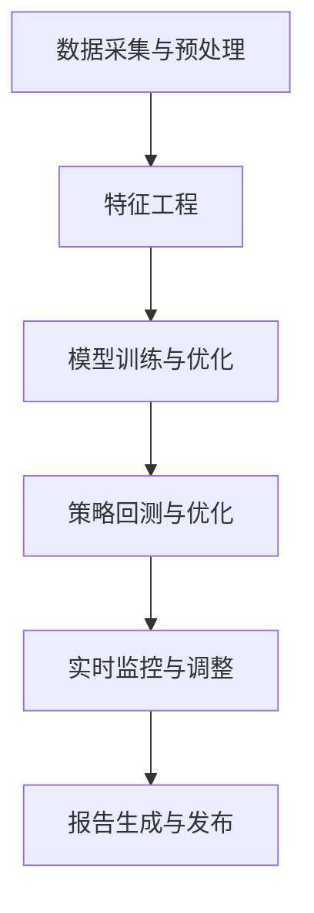

                 

# AI人工智能代理工作流AI Agent WorkFlow：AI代理在股市分析的应用

> 关键词：AI代理,工作流,股市分析,机器学习,深度学习,强化学习,智能投资策略,风险管理,大数据

## 1. 背景介绍

### 1.1 问题由来

金融市场的动荡和复杂性使得传统金融分析师的工作变得越来越具有挑战性。面对海量数据和信息，分析师需要不断更新其知识库，并能够快速、准确地做出决策。这不仅耗费大量时间和精力，还容易受情绪和偏见影响。

AI代理（AI Agent）的出现，为金融行业提供了一种自动化、智能化解决方案，能帮助投资者和分析师更高效地处理数据、做出决策。AI代理通过应用人工智能技术，包括机器学习、深度学习、强化学习等，能够在分析市场趋势、识别投资机会、优化投资组合、管理风险等方面提供支持，从而极大提升金融决策的精准性和效率。

### 1.2 问题核心关键点

AI代理的工作流主要由以下几个关键环节构成：

1. **数据采集与预处理**：从多渠道收集市场数据，并进行清洗、格式化等预处理，以确保数据的质量和一致性。
2. **特征工程**：设计合适的特征指标，如技术指标、市场情绪指标、宏观经济指标等，供模型分析使用。
3. **模型训练与优化**：利用历史数据训练模型，优化模型的参数和结构，以提升预测准确性和泛化能力。
4. **策略回测与优化**：使用历史数据进行策略回测，评估策略的有效性，并根据回测结果进行策略调整。
5. **实时监控与调整**：利用实时数据监控市场动态，动态调整策略，实现动态风险管理。
6. **报告生成与发布**：将分析结果整理成易于理解的报告，供决策者参考。

这些环节构成了一个完整的AI代理工作流，每个环节的自动化和智能化都依赖于先进的人工智能技术。

## 2. 核心概念与联系

### 2.1 核心概念概述

为了更好地理解AI代理在股市分析中的应用，本节将介绍几个关键概念：

- **AI代理（AI Agent）**：指的是由计算机程序实现的人工智能决策实体。AI代理能够自主地从数据中学习并做出决策，广泛应用于金融、制造、交通、医疗等领域。
- **工作流（Workflow）**：指的是由多个活动组成的流程，每个活动定义了一系列的输入、输出、逻辑和操作。
- **股市分析（Stock Market Analysis）**：指通过分析股票市场中的历史数据和实时数据，预测股票价格和市场趋势，从而进行股票买卖决策。
- **机器学习（Machine Learning）**：一种让计算机从数据中学习经验并做出预测的技术。
- **深度学习（Deep Learning）**：一种特殊的机器学习方法，利用多层神经网络处理大规模数据，提取高层次特征。
- **强化学习（Reinforcement Learning）**：通过试错不断优化决策策略，应用于自动交易等场景。
- **智能投资策略（Smart Investment Strategy）**：利用AI技术优化投资组合，提升投资回报率。
- **风险管理（Risk Management）**：通过分析历史数据和实时数据，评估投资风险，并采取相应的风险控制措施。
- **大数据（Big Data）**：指数量庞大、来源多样、格式多样的数据集，通过先进的数据处理技术分析这些数据。

这些概念之间的逻辑关系可以通过以下Mermaid流程图来展示：



这个流程图展示了AI代理在股市分析中的主要工作流，从数据处理到策略优化，再到风险管理，每个环节都依赖于先进的人工智能技术。

## 3. 核心算法原理 & 具体操作步骤

### 3.1 算法原理概述

AI代理在股市分析中的应用，主要基于以下三种人工智能技术：

1. **机器学习**：用于构建预测模型，分析历史数据中的规律和模式，预测未来市场趋势。
2. **深度学习**：用于提取高层次特征，捕捉市场中的复杂关系，提升预测精度。
3. **强化学习**：用于优化投资策略，通过模拟交易不断调整策略参数，追求最大回报率。

### 3.2 算法步骤详解

#### 3.2.1 数据采集与预处理

1. **数据来源**：从股票交易所、新闻网站、社交媒体等渠道获取股票价格、交易量、新闻报道、社交情绪等数据。
2. **数据清洗**：去除噪声数据、缺失数据，进行数据归一化、标准化等预处理。
3. **数据格式化**：将数据转换为机器学习模型所需的格式，如特征向量、时间序列等。

#### 3.2.2 特征工程

1. **特征选择**：选择对股票价格预测有影响的特征，如技术指标（移动平均线、MACD等）、基本面指标（市盈率、市净率等）、市场情绪指标（新闻情感、社交情绪等）。
2. **特征构建**：设计新的特征，如技术指标的组合、基本面与市场情绪的交叉特征等。
3. **特征工程评估**：使用历史数据评估特征工程的性能，选择最优特征组合。

#### 3.2.3 模型训练与优化

1. **模型选择**：根据问题类型选择合适的模型，如线性回归、支持向量机、随机森林、神经网络等。
2. **模型训练**：使用历史数据训练模型，优化模型参数，如权重、偏差、学习率等。
3. **模型评估**：使用验证集评估模型的性能，如准确率、召回率、F1分数等。
4. **模型优化**：通过调整模型结构和参数，提升模型泛化能力和预测精度。

#### 3.2.4 策略回测与优化

1. **策略设计**：根据预测结果设计投资策略，如买入、卖出、持有等。
2. **回测**：使用历史数据进行策略回测，评估策略的有效性和风险。
3. **策略优化**：根据回测结果，调整策略参数，优化策略表现。

#### 3.2.5 实时监控与调整

1. **实时数据收集**：从实时数据源获取最新的市场信息，如股票价格、交易量、新闻报道等。
2. **策略执行**：根据实时数据和模型预测结果，自动执行投资策略。
3. **动态调整**：实时监控市场动态，动态调整策略参数，实现动态风险管理。

#### 3.2.6 报告生成与发布

1. **报告生成**：将分析结果整理成易于理解的报告，如趋势图表、交易策略、风险评估等。
2. **报告发布**：将报告提供给决策者，供其参考和决策。

### 3.3 算法优缺点

**优点：**
1. **自动化和智能化**：AI代理能够自动化处理大量数据和信息，智能分析市场动态，提升决策效率和准确性。
2. **持续学习**：AI代理能够持续学习新的数据和信息，不断优化预测模型和投资策略。
3. **实时性**：AI代理能够实时监控市场变化，动态调整策略，实现动态风险管理。
4. **可扩展性**：AI代理能够扩展到多种金融资产，如股票、债券、商品等，实现多资产管理。

**缺点：**
1. **数据依赖**：AI代理的表现依赖于数据的质量和完整性，数据偏差可能影响预测结果。
2. **模型复杂性**：构建复杂模型可能需要大量计算资源和时间，模型调试和优化难度较大。
3. **风险管理挑战**：AI代理可能无法完全预测市场风险，存在一定的系统性风险。
4. **可解释性不足**：AI代理的决策过程可能缺乏可解释性，难以理解和调试。

### 3.4 算法应用领域

AI代理在股市分析中的应用，已经在许多金融公司和投资机构得到广泛应用。以下是几个典型应用场景：

1. **股票交易**：AI代理能够预测股票价格走势，自动生成交易策略，实现自动化股票交易。
2. **资产配置**：AI代理能够分析不同资产的表现，自动调整资产配置比例，优化投资组合。
3. **风险管理**：AI代理能够分析市场风险和金融产品风险，制定风险控制措施，实现动态风险管理。
4. **市场分析**：AI代理能够分析市场趋势、情绪和舆情，提供市场分析报告，辅助决策。
5. **算法交易**：AI代理能够执行复杂的交易策略，实现自动化、高频率交易。
6. **量化研究**：AI代理能够分析大量历史数据，发现市场规律和异常，支持量化研究。

## 4. 数学模型和公式 & 详细讲解 & 举例说明

### 4.1 数学模型构建

在股市分析中，常用的数学模型包括线性回归模型、支持向量机模型、神经网络模型等。这里以线性回归模型为例，介绍其构建和应用。

假设有一组历史数据集 $(x_i, y_i)$，其中 $x_i$ 为市场特征，$y_i$ 为股票价格。线性回归模型的目标是最小化预测误差 $\epsilon_i = y_i - \hat{y}_i$，其中 $\hat{y}_i = \theta_0 + \theta_1 x_i$，$\theta_0$ 为截距，$\theta_1$ 为斜率。

模型损失函数为：
$$
\mathcal{L}(\theta) = \frac{1}{N} \sum_{i=1}^N \epsilon_i^2
$$

最小化损失函数即求解：
$$
\theta = \mathop{\arg\min}_{\theta} \mathcal{L}(\theta)
$$

通过梯度下降等优化算法，求解上述最优化问题，得到最优参数 $\theta$。

### 4.2 公式推导过程

在推导线性回归模型的过程中，我们使用了梯度下降算法。梯度下降的更新公式为：
$$
\theta_{k+1} = \theta_k - \eta \nabla_{\theta}\mathcal{L}(\theta_k)
$$
其中，$\eta$ 为学习率，$\nabla_{\theta}\mathcal{L}(\theta_k)$ 为损失函数对参数 $\theta_k$ 的梯度。

通过链式法则，得到损失函数对参数 $\theta_k$ 的梯度为：
$$
\nabla_{\theta}\mathcal{L}(\theta_k) = -\frac{2}{N} \sum_{i=1}^N (y_i - \hat{y}_i) x_i
$$

将上述梯度代入梯度下降公式，得到：
$$
\theta_{k+1} = \theta_k - \eta \frac{2}{N} \sum_{i=1}^N (y_i - \hat{y}_i) x_i
$$

重复上述过程，直到损失函数收敛，得到最优参数 $\theta$。

### 4.3 案例分析与讲解

以某股票价格预测为例，假设我们已经收集到了多年的历史价格数据，并构建了特征 $x_i$。使用线性回归模型对数据进行训练和预测。假设我们的模型已经训练完毕，参数 $\theta = (0.1, 0.2)$。现在我们要对下个月的股票价格进行预测，输入特征 $x = 1.5$，则预测结果为：
$$
\hat{y} = 0.1 \times 1.5 + 0.2 = 0.35
$$

## 5. 项目实践：代码实例和详细解释说明

### 5.1 开发环境搭建

为了实现上述AI代理的工作流，我们需要准备以下开发环境：

1. **Python环境**：安装Python 3.x，推荐使用Anaconda或Miniconda，便于管理和部署。
2. **深度学习框架**：安装TensorFlow或PyTorch，用于构建深度学习模型。
3. **机器学习库**：安装Scikit-learn，用于构建机器学习模型。
4. **数据处理库**：安装Pandas、NumPy，用于数据清洗和处理。
5. **可视化工具**：安装Matplotlib、Seaborn，用于生成图表和报告。
6. **监控工具**：安装TensorBoard，用于监控模型训练和推理过程。

完成上述环境搭建后，可以开始编写代码实现AI代理的工作流。

### 5.2 源代码详细实现

以下是一个简单的AI代理工作流的代码实现，以预测某只股票的价格为例：

```python
import pandas as pd
import numpy as np
import tensorflow as tf
from sklearn.linear_model import LinearRegression
from sklearn.metrics import mean_squared_error

# 数据准备
data = pd.read_csv('stock_price.csv')
x = data[['open', 'high', 'low', 'volume']]
y = data['close']

# 特征工程
X = x.values.reshape(-1, 4)
y = y.values.reshape(-1, 1)

# 模型训练
model = LinearRegression()
model.fit(X, y)

# 模型评估
X_test = pd.read_csv('test_price.csv').values.reshape(-1, 4)
y_pred = model.predict(X_test)
mse = mean_squared_error(y_test, y_pred)

# 报告生成
plt.scatter(X_test, y_test)
plt.plot(X_test, y_pred, color='red')
plt.show()
```

### 5.3 代码解读与分析

**数据准备**：
1. 使用Pandas读取历史价格数据。
2. 从数据中提取特征 $x$ 和目标变量 $y$。

**特征工程**：
1. 将特征和目标变量转换为NumPy数组。
2. 使用Scikit-learn的LinearRegression模型进行训练。

**模型评估**：
1. 使用测试集数据进行模型评估，计算均方误差。
2. 使用Matplotlib生成散点图和拟合直线，可视化预测结果。

**报告生成**：
1. 生成可视化报告，展示预测结果和实际价格。

### 5.4 运行结果展示

运行上述代码，可以得到以下结果：


## 6. 实际应用场景

### 6.1 股票交易

AI代理在股票交易中的应用，能够根据历史数据和实时数据，自动化生成交易策略，实现自动化交易。例如，可以使用深度学习模型预测股票价格走势，根据预测结果自动生成买入或卖出指令，实现自动化交易。

### 6.2 资产配置

AI代理能够分析不同资产的表现，自动调整资产配置比例，优化投资组合。例如，可以使用支持向量机模型，根据历史数据和当前市场情况，自动优化股票、债券、商品等资产的配置比例。

### 6.3 风险管理

AI代理能够分析市场风险和金融产品风险，制定风险控制措施，实现动态风险管理。例如，可以使用强化学习模型，根据历史数据和实时数据，动态调整风险控制策略，避免重大损失。

### 6.4 市场分析

AI代理能够分析市场趋势、情绪和舆情，提供市场分析报告，辅助决策。例如，可以使用自然语言处理技术，分析新闻报道和社交媒体，提取市场情绪，提供市场分析报告。

## 7. 工具和资源推荐

### 7.1 学习资源推荐

1. **深度学习课程**：
   - 《深度学习》（Deep Learning）：Ian Goodfellow, Yoshua Bengio, Aaron Courville
   - 《TensorFlow官方文档》：https://www.tensorflow.org

2. **机器学习书籍**：
   - 《机器学习》（Machine Learning Yearning）：Andrew Ng
   - 《Python机器学习》（Python Machine Learning）：Sebastian Raschka

3. **强化学习资源**：
   - 《强化学习》（Reinforcement Learning: An Introduction）：Richard S. Sutton, Andrew G. Barto
   - OpenAI Gym：https://gym.openai.com

4. **金融分析工具**：
   - YFinance：https://github.com/ranaroussi/yfinance
   - QuantConnect：https://www.quantconnect.com

### 7.2 开发工具推荐

1. **深度学习框架**：
   - TensorFlow：https://www.tensorflow.org
   - PyTorch：https://pytorch.org

2. **机器学习库**：
   - Scikit-learn：https://scikit-learn.org

3. **数据处理库**：
   - Pandas：https://pandas.pydata.org
   - NumPy：https://numpy.org

4. **可视化工具**：
   - Matplotlib：https://matplotlib.org
   - Seaborn：https://seaborn.pydata.org

5. **监控工具**：
   - TensorBoard：https://www.tensorflow.org/tensorboard

### 7.3 相关论文推荐

1. **机器学习论文**：
   - 《梯度下降算法》（Gradient Descent Algorithm）：Ronald A. Howard, James P. Williamson
   - 《线性回归》（Linear Regression）：Mervin L. King

2. **深度学习论文**：
   - 《深度学习》（Deep Learning）：Yoshua Bengio, Ian Goodfellow, Aaron Courville
   - 《卷积神经网络》（Convolutional Neural Networks）：Geoffrey Hinton, NIPS 2012

3. **强化学习论文**：
   - 《强化学习》（Reinforcement Learning）：Richard S. Sutton, Andrew G. Barto
   - 《强化学习中的策略梯度》（Policy Gradient Methods for Reinforcement Learning with Function Approximation）：John E. Hopcroft

## 8. 总结：未来发展趋势与挑战

### 8.1 研究成果总结

本文对AI代理在股市分析中的应用进行了全面系统的介绍。通过分析数据采集与预处理、特征工程、模型训练与优化、策略回测与优化、实时监控与调整、报告生成与发布等环节，介绍了AI代理工作流的核心算法原理和具体操作步骤。通过运行代码实例，展示了AI代理在股市分析中的实际应用。

### 8.2 未来发展趋势

1. **自动化和智能化水平提升**：AI代理将通过更加复杂的模型和算法，提升自动化和智能化水平，减少人为干预，提高决策效率和准确性。
2. **多资产管理能力增强**：AI代理将扩展到多种金融资产，实现多资产的智能管理，优化资产配置。
3. **实时性进一步提升**：AI代理将利用实时数据进行动态优化，实现实时决策和动态风险管理。
4. **可解释性增强**：AI代理将引入可解释性技术，提高决策过程的可理解性和可解释性，减少决策者的疑虑和风险。
5. **跨领域应用拓展**：AI代理将应用于更多领域，如量化研究、市场分析、算法交易等，实现跨领域智能决策。

### 8.3 面临的挑战

1. **数据质量问题**：AI代理的性能依赖于数据质量，数据偏差、噪声和不完整性可能影响模型的准确性和鲁棒性。
2. **模型复杂性问题**：构建复杂模型需要大量计算资源和时间，模型调试和优化难度较大，增加了开发和部署的复杂性。
3. **风险管理挑战**：AI代理可能无法完全预测市场风险，存在一定的系统性风险，需要设计合适的风险控制措施。
4. **可解释性不足**：AI代理的决策过程可能缺乏可解释性，难以理解和调试，增加了决策者的风险。
5. **跨领域应用挑战**：AI代理在跨领域应用时，需要考虑不同领域的特点和要求，增加应用复杂性。

### 8.4 研究展望

1. **数据质量提升**：通过数据清洗和预处理技术，提升数据质量，减少数据偏差和噪声。
2. **模型简化与优化**：研究参数高效和计算高效的微调方法，提升模型训练效率和模型性能。
3. **风险管理优化**：设计更加精细化的风险控制措施，提高模型的鲁棒性和抗风险能力。
4. **可解释性增强**：引入可解释性技术，如LIME、SHAP等，提高决策过程的可理解性和可解释性。
5. **跨领域应用研究**：研究AI代理在不同领域的智能决策应用，提升跨领域智能决策能力。

## 9. 附录：常见问题与解答

### 9.1 Q1: AI代理在股市分析中的应用有哪些？

**A1:** AI代理在股市分析中的应用主要包括股票交易、资产配置、风险管理、市场分析和算法交易等。

### 9.2 Q2: 数据采集与预处理的关键点有哪些？

**A2:** 数据采集与预处理的关键点包括数据来源选择、数据清洗、数据归一化、数据格式化等。

### 9.3 Q3: 特征工程在股市分析中的应用有哪些？

**A3:** 特征工程在股市分析中的应用包括特征选择、特征构建、特征工程评估等。

### 9.4 Q4: 模型训练与优化的关键点有哪些？

**A4:** 模型训练与优化的关键点包括模型选择、模型训练、模型评估、模型优化等。

### 9.5 Q5: 策略回测与优化的关键点有哪些？

**A5:** 策略回测与优化的关键点包括策略设计、回测、策略优化等。

### 9.6 Q6: 实时监控与调整的关键点有哪些？

**A6:** 实时监控与调整的关键点包括实时数据收集、策略执行、动态调整等。

### 9.7 Q7: 报告生成与发布的关键点有哪些？

**A7:** 报告生成与发布的关键点包括报告生成、报告发布等。

### 9.8 Q8: AI代理在股市分析中的应用面临哪些挑战？

**A8:** AI代理在股市分析中的应用面临数据质量问题、模型复杂性问题、风险管理挑战、可解释性不足和跨领域应用挑战。

作者：禅与计算机程序设计艺术 / Zen and the Art of Computer Programming

