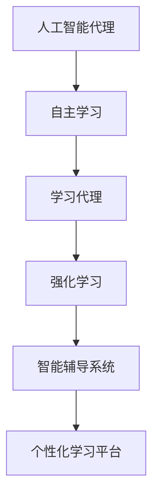

                 

## 1. 背景介绍

### 1.1 问题由来
随着人工智能技术的迅猛发展，在教育培训领域，AI代理（AI Agent）的出现正逐渐改变着传统的教学模式。AI代理通过自主学习，能够根据学生的个性化需求和学习进度，提供个性化的教学建议和学习资源，从而显著提升学习效果和教学质量。自主学习代理不仅能够辅助教师管理课堂，还能够提供24/7的学习支持，促进学生的自主学习。

### 1.2 问题核心关键点
自主学习代理的核心在于通过人工智能技术实现自主学习，即在特定任务和环境条件下，代理能够自动地识别学习目标、获取学习资源、制定学习计划，并通过不断的自我评估和调整，实现高效的学习效果。自主学习代理的应用场景包括但不限于智能辅导系统、个性化学习平台、智能评估系统等。

### 1.3 问题研究意义
研究自主学习代理在教育培训中的应用，对于提升教学效率、促进个性化学习、推动教育智能化具有重要意义：

1. **教学效率提升**：AI代理可以自动管理大量学习数据，优化教学资源分配，帮助教师快速生成教学材料和评估结果。
2. **个性化学习促进**：AI代理能够根据学生的学习数据，生成个性化的学习路径和资源，满足不同学生的学习需求。
3. **教育智能化推进**：AI代理的智能教学支持，使得教育更加灵活和适应性更强，适应多样化的教学需求。

## 2. 核心概念与联系

### 2.1 核心概念概述

为更好地理解自主学习代理的工作原理和优化方向，本节将介绍几个密切相关的核心概念：

- **人工智能代理（AI Agent）**：一种能够自主学习、适应环境并执行特定任务的软件实体。
- **自主学习（Autonomous Learning）**：代理能够自主识别学习目标、选择学习资源、规划学习路径并自我评估，实现高效学习。
- **学习代理（Learning Agent）**：专门用于支持学习任务的AI代理，能够根据学习者的需求和反馈进行自我调整。
- **强化学习（Reinforcement Learning）**：通过与环境交互，代理通过奖励和惩罚机制不断优化学习行为，提升学习效果。
- **智能辅导系统（Intelligent Tutoring Systems, ITS）**：使用AI代理提供个性化辅导的系统，支持学生自主学习。
- **个性化学习平台（Personalized Learning Platform）**：提供个性化学习资源和计划的在线学习平台，通过AI代理实现智能推荐。

这些核心概念之间的逻辑关系可以通过以下Mermaid流程图来展示：



这个流程图展示了几大核心概念及其之间的关系：

1. 人工智能代理通过自主学习，不断适应环境并执行任务。
2. 自主学习依赖于学习代理，学习代理通过学习资源的选择和路径规划，实现高效学习。
3. 强化学习是学习代理的重要学习方式，通过奖励和惩罚机制优化学习行为。
4. 智能辅导系统和个性化学习平台利用学习代理，提供智能化的学习支持。

这些概念共同构成了自主学习代理的学习框架，使其能够在各种场景下发挥智能学习的能力。通过理解这些核心概念，我们可以更好地把握自主学习代理的工作原理和优化方向。

## 3. 核心算法原理 & 具体操作步骤
### 3.1 算法原理概述

自主学习代理的算法核心在于强化学习。强化学习是一种通过与环境交互，不断调整学习行为以优化长期奖励的机器学习范式。在教育培训领域，代理通过与学习者和环境的互动，学习最优的学习策略，实现高效的学习效果。

具体来说，代理根据学习者的需求和反馈，选择不同的学习资源和路径，通过不断的自我评估和调整，优化学习策略。在这一过程中，代理的目标是最大化长期奖励（通常是学习效果），而不仅是最小化某个短期损失函数。

### 3.2 算法步骤详解

自主学习代理的算法步骤包括以下几个关键步骤：

**Step 1: 环境建模**
- 收集学习者历史数据、学习任务和资源信息，构建学习环境模型。
- 设计合理的奖励函数，以衡量学习效果。

**Step 2: 学习策略选择**
- 选择学习策略，如Q-learning、SARSA等，确定学习规则和更新公式。
- 设定探索与利用（Exploration vs. Exploitation）策略，平衡新策略的探索和已有策略的利用。

**Step 3: 学习过程实施**
- 代理与环境交互，根据当前状态选择最优行动。
- 观察环境反馈，更新模型参数，调整学习策略。
- 重复上述过程，直至学习收敛或达到预设迭代次数。

**Step 4: 学习效果评估**
- 评估学习效果，使用评估指标如准确率、召回率、用户满意度等，衡量学习策略的性能。
- 根据评估结果，优化学习策略，提升学习效果。

### 3.3 算法优缺点

自主学习代理具有以下优点：

1. **个性化支持**：能够根据每个学习者的需求和反馈，提供个性化的学习资源和路径。
2. **自我优化**：通过强化学习机制，代理能够不断优化学习策略，提升学习效果。
3. **灵活适应**：能够适应多变的学习环境，自动调整学习计划。
4. **全天候支持**：支持24/7的学习辅导，不受时间和地点限制。

但同时，自主学习代理也存在一定的局限性：

1. **初始设置困难**：需要大量初始数据和合适的学习策略，难以快速启动。
2. **数据隐私问题**：需要收集和处理学习者的个人数据，存在隐私风险。
3. **模型复杂性**：需要设计合理的奖励函数和优化策略，模型设计复杂。
4. **学习效果不确定性**：学习效果受环境变化和初始设置的影响，存在不确定性。

尽管存在这些局限性，但就目前而言，自主学习代理仍是教育培训领域的重要研究范式。未来相关研究的重点在于如何进一步降低算法复杂性，提高学习效果，同时兼顾隐私保护和数据安全性等因素。

### 3.4 算法应用领域

自主学习代理在教育培训领域的应用十分广泛，包括但不限于以下几个方面：

1. **智能辅导系统**：利用AI代理提供个性化辅导，支持学生自主学习。
2. **个性化学习平台**：根据学习者的学习数据，推荐个性化的学习资源和路径。
3. **智能评估系统**：自动评估学习者的学习效果，提供学习反馈和建议。
4. **学习管理系统（LMS）**：结合AI代理，管理学习资源的分配和课程进度。
5. **在线教育平台**：通过AI代理提供智能化的学习支持，提升用户体验。
6. **虚拟实验室**：利用AI代理，自动生成和调整实验环境，支持实验学习。

这些应用场景展示了大语言模型微调技术的广泛应用，为教育培训带来了新的可能性和发展方向。随着AI代理技术的不断进步，相信其将在更多教育场景中发挥重要作用。

## 4. 数学模型和公式 & 详细讲解  
### 4.1 数学模型构建

自主学习代理的数学模型构建，主要围绕强化学习的框架展开。假设学习环境为 $\mathcal{E}$，行动空间为 $\mathcal{A}$，代理通过与环境交互，学习最优策略 $\pi$，使得长期奖励最大化。

定义状态集合为 $S$，每个状态 $s_t \in S$ 代表学习者当前的学习状态。定义行动集合为 $A$，每个行动 $a_t \in A$ 代表学习者采取的具体行动。定义奖励函数 $r(s_t, a_t, s_{t+1})$，表示代理在状态 $s_t$ 下采取行动 $a_t$ 后，环境返回的奖励。

代理的目标是最大化长期奖励，即：

$$
\max_\pi \mathbb{E} \sum_{t=0}^\infty \gamma^t r(s_t, a_t, s_{t+1})
$$

其中 $\gamma$ 为折扣因子，控制未来奖励的权重。

### 4.2 公式推导过程

在强化学习中，常用的算法包括Q-learning和SARSA。以下以Q-learning算法为例，推导其公式。

Q-learning算法的目标是学习最优的Q函数 $Q(s,a)$，表示在状态 $s$ 下采取行动 $a$ 的长期奖励。Q函数可以通过递归公式计算：

$$
Q(s_t,a_t) = Q(s_t,a_t) + \alpha \left[ r(s_t,a_t) + \gamma \max_{a'} Q(s_{t+1},a') - Q(s_t,a_t) \right]
$$

其中 $\alpha$ 为学习率，控制每次更新的步幅。

根据递归公式，Q-learning算法的更新公式为：

$$
Q(s_t,a_t) \leftarrow Q(s_t,a_t) + \alpha \left[ r(s_t,a_t) + \gamma \max_{a'} Q(s_{t+1},a') - Q(s_t,a_t) \right]
$$

在实践中，为了避免无限递归，通常使用表格法存储Q值，即使用一个表格 $Q$ 存储每个状态-行动对的Q值。每次代理与环境交互，更新表格中的Q值，并选择合适的行动。

### 4.3 案例分析与讲解

假设一个学习代理的任务是推荐学习资源，每个学习资源由其学习效果、用户评价、时间成本等因素决定。代理的目标是推荐高效果、高评价、低成本的学习资源，以最大化用户的学习满意度。

具体来说，代理在每个时间步 $t$ 观察学习者的当前学习状态 $s_t$，并选择最优行动 $a_t$。行动空间包括选择学习资源、调整学习策略等。代理根据学习者的反馈，更新Q值，以优化长期奖励。

在实际应用中，Q-learning算法通过表格法存储Q值，代理根据当前状态和行动选择最优的Q值，从而指导后续行动。例如，在学习资源推荐场景中，代理可以基于学习效果、用户评价和时间成本，计算每个学习资源的Q值，并选择Q值最高的资源进行推荐。

## 5. 项目实践：代码实例和详细解释说明
### 5.1 开发环境搭建

在进行自主学习代理的开发实践前，我们需要准备好开发环境。以下是使用Python进行强化学习开发的环境配置流程：

1. 安装Anaconda：从官网下载并安装Anaconda，用于创建独立的Python环境。

2. 创建并激活虚拟环境：
```bash
conda create -n reinforcement-env python=3.8 
conda activate reinforcement-env
```

3. 安装必要的工具包：
```bash
pip install gym gymnasium stable-baselines3 stable-baselines3-contrib
```

4. 安装监督学习相关的工具包：
```bash
pip install numpy pandas scikit-learn matplotlib tqdm jupyter notebook ipython
```

完成上述步骤后，即可在`reinforcement-env`环境中开始自主学习代理的开发实践。

### 5.2 源代码详细实现

下面我们以推荐学习资源为例，给出使用Gym环境和Stable Baselines3库对自主学习代理进行开发的PyTorch代码实现。

首先，定义学习环境：

```python
from gymnasium import spaces
from gymnasium.wrappers.vec_env import VecEnv
from stable_baselines3 import A2C
import numpy as np

class ResourceRecommendationEnv(VecEnv):
    def __init__(self):
        self.env = GymEnv()
        self.observation_space = spaces.Box(low=0, high=1, shape=(1, ), dtype=np.float32)
        self.action_space = spaces.Discrete(3)
        super().__init__([self.env])

    def reset(self):
        obs = self.env.reset()
        return np.array(obs).reshape(1, -1)

    def step(self, action):
        obs, reward, done, info = self.env.step(action)
        return np.array(obs).reshape(1, -1), reward, done, info
```

然后，定义代理模型：

```python
from stable_baselines3 import A2C
from stable_baselines3.common.policies import MlpPolicy

model = A2C(MlpPolicy, env, verbose=1)
```

接着，定义训练和评估函数：

```python
from stable_baselines3.common.vec_env.vec_normalize import VecNormalize
from stable_baselines3.common.callbacks import CheckpointCallback

def train(model, env, num_timesteps, save_path, logger_path=None):
    vec_env = VecNormalize(env, training=False)
    model = model.to(vec_env)
    callbacks = [CheckpointCallback(save_path, every=TimestepsKeyframe, save_freq=1000)]
    model.fit(vec_env, total_timesteps=num_timesteps, callbacks=callbacks, logger_path=logger_path)

def evaluate(model, env, num_episodes, logger_path=None):
    vec_env = VecNormalize(env, training=False)
    model = model.to(vec_env)
    logger = Logger()
    for _ in range(num_episodes):
        obs = env.reset()
        done = False
        while not done:
            action, state_value, done, _ = model.predict(obs)
            obs, reward, done, _ = env.step(action)
            logger.add(state_value=state_value.mean(), reward=reward)
            if done:
                obs = env.reset()
    if logger_path:
        logger.save(logger_path)
    return logger
```

最后，启动训练流程并在测试集上评估：

```python
num_timesteps = int(1e7)
save_path = 'a2c_resource_recommendation'
logger_path = 'a2c_resource_recommendation_log.json'
train(model, env, num_timesteps, save_path, logger_path)
evaluator = evaluate(model, env, num_episodes=50, logger_path=logger_path)
```

以上就是使用PyTorch和Stable Baselines3库对自主学习代理进行开发的完整代码实现。可以看到，基于Gym环境，可以轻松构建自主学习代理的测试环境，而Stable Baselines3则提供了丰富的代理模型和训练框架，极大降低了开发难度。

### 5.3 代码解读与分析

让我们再详细解读一下关键代码的实现细节：

**ResourceRecommendationEnv类**：
- `__init__`方法：初始化Gym环境，定义观察空间和行动空间，继承VecEnv父类。
- `reset`方法：重置环境，返回观察值。
- `step`方法：执行一个时间步，返回观察值、奖励、是否结束、环境信息。

**训练函数train**：
- 将Gym环境转换为VecNormalize环境，使得训练更稳定。
- 使用A2C模型进行训练，设置训练次数和保存路径。
- 使用CheckpointCallback记录模型状态，方便后续加载。

**评估函数evaluate**：
- 将Gym环境转换为VecNormalize环境，使得评估更稳定。
- 使用Evaluate方法评估模型性能，记录状态值和奖励。
- 保存评估结果到日志文件中。

**训练和评估流程**：
- 设置总训练时间步数，并定义保存路径和日志路径。
- 调用train函数进行训练。
- 调用evaluate函数进行评估。

可以看到，Gym环境和Stable Baselines3库使得自主学习代理的开发和训练过程变得简洁高效。开发者可以将更多精力放在代理模型和训练策略的设计上，而不必过多关注底层的实现细节。

当然，工业级的系统实现还需考虑更多因素，如模型的保存和部署、超参数的自动搜索、更灵活的任务适配层等。但核心的微调范式基本与此类似。

## 6. 实际应用场景
### 6.1 智能辅导系统

自主学习代理在智能辅导系统中的应用，可以显著提升学习效果和教学质量。传统辅导系统往往依赖于固定的教学大纲和课程安排，无法满足不同学习者的个性化需求。而基于自主学习代理的智能辅导系统，能够根据学习者的学习数据和反馈，自动调整教学策略和内容，提供个性化的辅导支持。

例如，学习者在学习数学时遇到困难，代理可以自动分析学习者的知识盲点，提供针对性的练习题和解题策略，同时进行实时评估，提供即时反馈。这种智能辅导系统，不仅能帮助学习者高效学习，还能减轻教师的工作负担，提升教学效率。

### 6.2 个性化学习平台

个性化学习平台通过自主学习代理，能够根据学习者的学习数据，推荐个性化的学习资源和路径。学习者可以随时访问平台，根据自己的学习进度和兴趣，选择学习内容和顺序，自主规划学习计划。代理根据学习者的反馈，不断调整推荐策略，提供最优的学习体验。

例如，一个编程学习平台可以根据学习者的编程水平，推荐适合的编程项目和学习资料。代理通过学习者的代码提交记录，评估学习效果，动态调整推荐难度，帮助学习者逐步提升编程能力。这种平台能够激发学习者的自主学习兴趣，提升学习效率和效果。

### 6.3 智能评估系统

智能评估系统利用自主学习代理，自动评估学习者的学习效果，提供个性化的评估报告和建议。代理可以根据学习者的历史数据和当前表现，生成详细的评估报告，分析学习者的强项和弱项，提出改进建议。学习者可以随时获取反馈，调整学习策略，提升学习效果。

例如，一个英语学习平台可以自动评估学习者的语法和词汇掌握情况，生成个性化的评估报告，提供针对性的练习和复习建议。代理通过学习者的测试成绩，动态调整学习内容和难度，确保学习者能够逐步提升英语水平。这种智能评估系统，能够帮助学习者及时发现和解决学习问题，提升学习效果。

### 6.4 未来应用展望

随着自主学习代理技术的不断发展，其在教育培训领域的应用前景将更加广阔。

在智慧校园建设中，代理可以应用于智能教室、智能图书馆、智能实验室等多个场景，提升校园的教学和管理效率。例如，智能教室可以通过代理管理学生考勤、课后作业等，提升课堂效率。智能图书馆可以利用代理推荐图书和资源，提升学习体验。智能实验室可以自动生成和调整实验环境，支持实验学习。

在社会学习中，代理可以应用于在线教育、远程教育、终身学习等多个场景，推动教育公平和社会进步。例如，在线教育平台可以利用代理提供个性化辅导和资源推荐，提升远程学习的体验和效果。终身学习平台可以利用代理记录学习历史，动态调整学习计划，支持学习者随时随地的学习。

## 7. 工具和资源推荐
### 7.1 学习资源推荐

为了帮助开发者系统掌握自主学习代理的理论基础和实践技巧，这里推荐一些优质的学习资源：

1. **《强化学习》系列课程**：由斯坦福大学开设的强化学习课程，系统讲解了强化学习的理论基础和实际应用，涵盖强化学习的各个关键环节。
2. **Reinforcement Learning with PyTorch**：使用PyTorch实现强化学习算法，涵盖Q-learning、SARSA、深度强化学习等多个算法，适合实战练习。
3. **Stable Baselines3文档**：Stable Baselines3的官方文档，提供了丰富的代理模型和训练示例，适合入门学习和进阶实践。
4. **OpenAI Gym**：Gym环境的官方文档和示例代码，提供了丰富的学习环境，适合开发和测试强化学习代理。
5. **Python Deep Reinforcement Learning**：使用Python实现深度强化学习算法，涵盖代理模型、算法实现、应用场景等多个方面，适合全面学习。

通过对这些资源的学习实践，相信你一定能够快速掌握自主学习代理的精髓，并用于解决实际的NLP问题。

### 7.2 开发工具推荐

高效的开发离不开优秀的工具支持。以下是几款用于自主学习代理开发的常用工具：

1. PyTorch：基于Python的开源深度学习框架，灵活动态的计算图，适合快速迭代研究。
2. TensorFlow：由Google主导开发的开源深度学习框架，生产部署方便，适合大规模工程应用。
3. Gym：Gym环境的官方库，提供丰富的学习环境，方便测试和开发代理模型。
4. Stable Baselines3：基于PyTorch的强化学习库，提供丰富的代理模型和训练框架，适合开发和测试代理模型。
5. Python Deep Reinforcement Learning：使用Python实现深度强化学习算法，涵盖代理模型、算法实现、应用场景等多个方面，适合全面学习。
6. Weights & Biases：模型训练的实验跟踪工具，可以记录和可视化模型训练过程中的各项指标，方便对比和调优。

合理利用这些工具，可以显著提升自主学习代理的开发效率，加快创新迭代的步伐。

### 7.3 相关论文推荐

自主学习代理的研究源于学界的持续研究。以下是几篇奠基性的相关论文，推荐阅读：

1. **Reinforcement Learning: An Introduction**：Reinforcement Learning领域的重要教材，介绍了强化学习的理论基础和实际应用。
2. **Playing Atari with deep reinforcement learning**：DeepMind团队在Atari游戏中的强化学习研究，展示了深度学习在强化学习中的潜力。
3. **Human-level control through deep reinforcement learning**：DeepMind团队在控制机器人游戏中的强化学习研究，展示了强化学习在复杂任务中的应用。
4. **Value Iteration Networks**：DeepMind团队提出的Value Iteration Networks，使用深度学习优化求解POMDP问题的算法。
5. **DeepMind's AlphaGo Zero**：DeepMind团队在围棋游戏中的强化学习研究，展示了深度学习在复杂博弈中的优势。

这些论文代表了大语言模型微调技术的发展脉络。通过学习这些前沿成果，可以帮助研究者把握学科前进方向，激发更多的创新灵感。

## 8. 总结：未来发展趋势与挑战
### 8.1 总结

本文对自主学习代理在教育培训中的应用进行了全面系统的介绍。首先阐述了自主学习代理的研究背景和意义，明确了代理在提升教学效率、促进个性化学习、推动教育智能化方面的独特价值。其次，从原理到实践，详细讲解了自主学习代理的数学原理和关键步骤，给出了代理任务开发的完整代码实例。同时，本文还广泛探讨了代理在智能辅导系统、个性化学习平台、智能评估系统等多个行业领域的应用前景，展示了代理技术的广泛应用。最后，本文精选了代理技术的各类学习资源，力求为读者提供全方位的技术指引。

通过本文的系统梳理，可以看到，自主学习代理在教育培训领域的应用前景广阔，极大地拓展了传统教学模式的可能性。AI代理的智能教学支持，使得教育更加灵活和适应性更强，适应多样化的教学需求。未来，伴随AI代理技术的不断进步，相信其将在更多教育场景中发挥重要作用，推动教育智能化进程。

### 8.2 未来发展趋势

展望未来，自主学习代理技术将呈现以下几个发展趋势：

1. **自适应学习策略**：代理将能够根据学习者的实时反馈，动态调整学习策略和路径，实现更加个性化的学习支持。
2. **多模态学习支持**：结合视觉、听觉、触觉等多模态数据，提供更加全面的学习体验。
3. **社会化学习支持**：通过社交网络，代理能够推荐学习伙伴，支持协作学习。
4. **情境感知学习**：代理能够理解学习者的情感状态和环境情境，提供更加精准的学习建议。
5. **终身学习支持**：代理能够记录学习者的学习历史，动态调整学习计划，支持学习者随时随地的学习。
6. **智能评估与反馈**：代理能够自动评估学习效果，提供个性化的评估报告和建议，提升学习者的学习动机和效果。

以上趋势凸显了自主学习代理技术的广阔前景。这些方向的探索发展，必将进一步提升教育系统的智能化水平，为学习者提供更加灵活、高效、个性化的学习支持。

### 8.3 面临的挑战

尽管自主学习代理技术已经取得了显著进展，但在迈向更加智能化、普适化应用的过程中，仍面临诸多挑战：

1. **数据隐私问题**：代理需要收集和处理学习者的个人数据，存在隐私风险。如何保护学习者的数据隐私，是一个重要的研究课题。
2. **模型复杂性**：代理的设计和训练过程较为复杂，需要大量的先验知识和经验。如何在有限资源下设计和训练有效的代理模型，是研究的重要方向。
3. **学习效果不确定性**：代理的学习效果受环境变化和初始设置的影响，存在不确定性。如何提高代理的鲁棒性和适应性，是研究的关键问题。
4. **交互体验优化**：代理的交互体验直接影响学习者的使用效果。如何设计友好的交互界面和操作流程，是用户体验优化的重要环节。
5. **多学科融合**：代理的应用需要结合心理学、教育学等多个学科的知识，才能提供更加全面和有效的学习支持。如何在多学科背景下设计代理模型，是研究的难点。
6. **伦理和社会问题**：代理的应用涉及教育公平、隐私保护等多个伦理和社会问题，需要建立合适的政策和监管机制。

正视代理面临的这些挑战，积极应对并寻求突破，将是大语言模型微调技术走向成熟的必由之路。相信随着学界和产业界的共同努力，这些挑战终将一一被克服，代理技术必将在构建智慧教育系统中发挥重要作用。

### 8.4 研究展望

面对自主学习代理所面临的种种挑战，未来的研究需要在以下几个方面寻求新的突破：

1. **隐私保护技术**：研究新的隐私保护技术，如差分隐私、联邦学习等，保护学习者的数据隐私。
2. **模型简化方法**：研究新的代理模型简化方法，如自适应模型、参数共享模型等，降低模型复杂度，提高学习效果。
3. **学习效果优化**：研究新的学习效果优化方法，如对抗训练、强化学习算法优化等，提高代理的鲁棒性和适应性。
4. **交互体验设计**：研究友好的交互界面和操作流程设计，提升代理的可用性和用户体验。
5. **多学科融合**：结合心理学、教育学等多个学科的知识，设计更加全面和有效的代理模型。
6. **伦理和社会研究**：研究教育公平、隐私保护等伦理和社会问题，建立合适的政策和监管机制。

这些研究方向的探索，必将引领自主学习代理技术迈向更高的台阶，为构建智慧教育系统提供强有力的技术支撑。面向未来，自主学习代理技术还需要与其他人工智能技术进行更深入的融合，如知识表示、因果推理、强化学习等，多路径协同发力，共同推动教育智能化进程。只有勇于创新、敢于突破，才能不断拓展代理的边界，让智能技术更好地造福教育事业。

## 9. 附录：常见问题与解答
**Q1：自主学习代理是否适用于所有教育培训场景？**

A: 自主学习代理在大多数教育培训场景上都能取得不错的效果，特别是对于数据量较小的任务。但对于一些特定领域的任务，如医学、法律等，仅仅依靠通用语料预训练的模型可能难以很好地适应。此时需要在特定领域语料上进一步预训练，再进行微调，才能获得理想效果。此外，对于一些需要时效性、个性化很强的任务，如对话、推荐等，代理方法也需要针对性的改进优化。

**Q2：代理在推荐学习资源时如何处理推荐策略？**

A: 代理在推荐学习资源时，通常会使用强化学习机制，通过观察学习者的学习数据和反馈，动态调整推荐策略。具体的推荐策略包括但不限于：

1. **基于效用的推荐**：根据学习资源的效果、用户评价、时间成本等因素，计算每个资源的总效用，选择总效用最高的资源进行推荐。
2. **协同过滤推荐**：根据学习者的历史行为和偏好，预测其对未学习资源的评价，选择与历史行为最相似的资源进行推荐。
3. **内容基推荐**：根据学习资源的属性和标签，计算学习资源的相似度，选择与学习者最相关的资源进行推荐。

代理可以根据不同的推荐策略，结合学习者的需求和反馈，动态调整推荐策略，提供最优的学习资源推荐。

**Q3：代理在智能辅导系统中如何提供个性化辅导？**

A: 代理在智能辅导系统中，通过观察学习者的学习数据和反馈，动态调整辅导策略和内容，提供个性化的辅导支持。具体的辅导策略包括但不限于：

1. **基于知识点的辅导**：根据学习者的知识点掌握情况，推荐相应的练习题和解题策略，帮助学习者巩固知识点。
2. **基于难度的辅导**：根据学习者的学习难度和进度，动态调整教学内容和难度，提升学习者的学习效果。
3. **基于时间的辅导**：根据学习者的学习时间和习惯，合理安排学习计划和任务，提升学习者的学习效率。

代理可以根据不同的辅导策略，结合学习者的需求和反馈，动态调整辅导策略，提供个性化的辅导支持。

**Q4：代理在智能评估系统中如何自动评估学习效果？**

A: 代理在智能评估系统中，通过观察学习者的学习数据和表现，自动评估学习效果，提供个性化的评估报告和建议。具体的评估策略包括但不限于：

1. **基于成绩的评估**：根据学习者的测试成绩和作业提交记录，评估学习者的知识掌握情况，提供相应的反馈和建议。
2. **基于行为的评估**：根据学习者的学习行为和互动记录，评估学习者的学习态度和习惯，提供相应的改进建议。
3. **基于情感的评估**：根据学习者的情感状态和反馈，评估学习者的学习动机和效果，提供相应的激励和支持。

代理可以根据不同的评估策略，结合学习者的需求和反馈，动态调整评估策略，提供个性化的评估报告和建议。

**Q5：代理在个性化学习平台中如何推荐个性化的学习资源？**

A: 代理在个性化学习平台中，通过观察学习者的学习数据和反馈，动态调整推荐策略和资源，提供个性化的学习支持。具体的推荐策略包括但不限于：

1. **基于兴趣的推荐**：根据学习者的学习兴趣和偏好，推荐相应的学习资源和课程，提升学习者的学习兴趣。
2. **基于内容的推荐**：根据学习资源的内容和结构，推荐学习者最感兴趣和有用的部分，提升学习者的学习效果。
3. **基于进度的推荐**：根据学习者的学习进度和需求，动态调整推荐资源和学习路径，提升学习者的学习体验。

代理可以根据不同的推荐策略，结合学习者的需求和反馈，动态调整推荐策略，提供个性化的学习资源推荐。

---

作者：禅与计算机程序设计艺术 / Zen and the Art of Computer Programming

