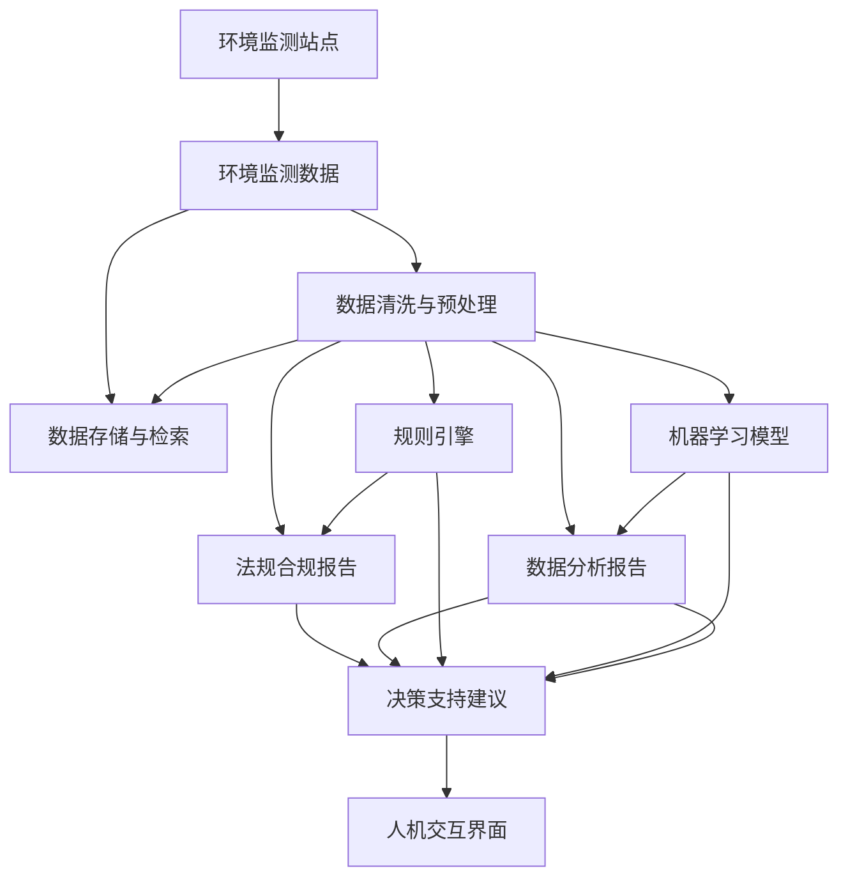

                 

## 1. 背景介绍

### 1.1 问题由来

在环保行业中，各种环境监测数据和法规标准庞杂，且需要实时动态监测和处理。例如，大气、水质、噪声、固体废弃物等各类环境指标的实时监测、数据整合与分析，涉及到大量数据处理和规则逻辑，传统的人工方式效率低下且容易出错。因此，亟需引入人工智能代理(AI Agent)来解决此类问题，实现自动化的环境数据监测、分析和决策支持。

### 1.2 问题核心关键点

AI Agent 是近年来人工智能领域的热点研究方向，通过模拟人类的认知行为，完成感知、推理、决策、执行等智能任务。在环保行业的应用中，AI Agent 可以实现以下功能：

1. **数据监测**：实时收集环境监测站点的数据，如PM2.5浓度、气温、湿度等。
2. **数据分析**：通过机器学习模型分析监测数据，提取环境变化规律，生成各类报表和分析结果。
3. **法规合规**：根据实时监测数据和法规标准，自动生成环境监测报告，辅助环保部门进行合规检查。
4. **预警预测**：利用AI模型预测环境风险，提前发出预警，减少环境事故的发生。
5. **决策支持**：基于环境数据和分析结果，自动生成决策建议，辅助管理部门做出决策。

通过AI Agent的引入，能够大幅度提高环境监测和管理的智能化水平，提升环保工作的效率和精度。

## 2. 核心概念与联系

### 2.1 核心概念概述

在环保行业的AI Agent应用中，涉及到的关键概念包括：

- **环境监测站点**：指用于实时采集环境数据的传感器和监测设备。例如，空气质量监测站点、水质监测站点等。
- **环境监测数据**：从监测站点采集到的各类环境指标数据，如PM2.5浓度、气温、湿度等。
- **环境法规标准**：各类环保法规和标准，如《环境保护法》、《大气污染防治法》等。
- **数据清洗与预处理**：对采集到的数据进行去噪、校正、归一化等预处理操作，确保数据的质量和一致性。
- **数据存储与检索**：对环境监测数据进行存储和管理，方便后续查询和分析。
- **机器学习模型**：如回归模型、分类模型、聚类模型等，用于数据分析和趋势预测。
- **规则引擎**：基于规则库实现环境法规的自动检查和合规判定。
- **自然语言处理(NLP)**：用于自动生成环境监测报告和决策建议的文本生成技术。
- **人机交互界面**：供环保部门工作人员与AI Agent交互的界面，展示分析结果和决策建议。

这些概念之间的联系紧密，通过数据流和控制流的衔接，构成了一个完整的AI Agent工作流程。

### 2.2 核心概念原理和架构的 Mermaid 流程图



以上流程图展示了环境监测数据从采集到分析，再到法规合规和决策支持的整个流程，以及AI Agent在其中扮演的角色。

## 3. 核心算法原理 & 具体操作步骤
### 3.1 算法原理概述

AI Agent在环保行业的应用，主要基于以下几个核心算法原理：

- **数据清洗与预处理**：通过统计分析、归一化、去噪等方法，确保数据的质量和一致性。
- **机器学习模型**：利用回归、分类、聚类等模型，进行数据预测和模式识别。
- **规则引擎**：通过定义规则库，实现环境法规的自动检查和合规判定。
- **自然语言处理(NLP)**：利用文本生成模型，自动生成环境监测报告和决策建议。

### 3.2 算法步骤详解

AI Agent在环保行业的具体实施步骤如下：

1. **数据采集**：从环境监测站点实时采集各类环境指标数据，如PM2.5浓度、气温、湿度等。
2. **数据清洗与预处理**：对采集到的数据进行去噪、校正、归一化等预处理操作，确保数据的质量和一致性。
3. **数据分析**：利用回归模型、分类模型、聚类模型等，对预处理后的数据进行分析，提取环境变化规律，生成各类报表和分析结果。
4. **法规合规**：根据实时监测数据和法规标准，自动生成环境监测报告，辅助环保部门进行合规检查。
5. **预警预测**：利用AI模型预测环境风险，提前发出预警，减少环境事故的发生。
6. **决策支持**：基于环境数据和分析结果，自动生成决策建议，辅助管理部门做出决策。

### 3.3 算法优缺点

AI Agent在环保行业的应用，具有以下优点：

- **自动化处理**：自动完成环境数据的采集、清洗、分析和报告生成，大幅度提高工作效率。
- **实时响应**：通过实时监测和预警，能够及时发现环境问题，快速响应处理。
- **精准分析**：利用机器学习模型进行精准分析，提供科学依据。

但同时也存在一些缺点：

- **数据依赖**：对环境监测站点的依赖性较强，需确保站点正常运行和数据准确。
- **模型复杂**：涉及多种算法模型和规则引擎，实现难度较高。
- **模型更新**：需定期更新模型，以适应环境变化和新法规标准。
- **维护成本**：需要专业团队进行维护和升级，成本较高。

### 3.4 算法应用领域

AI Agent在环保行业的应用，不仅可以实现环境监测和数据分析，还可以扩展到更多领域，例如：

- **智慧城市**：实时监测城市各类环境指标，辅助城市管理。
- **环保企业**：辅助企业进行环境监测和合规管理。
- **社区治理**：辅助社区进行环境监测和预警。
- **农业生产**：监测土壤、水质等环境指标，辅助农业生产。
- **灾害预警**：预测自然灾害，提前发出预警，减少损失。

## 4. 数学模型和公式 & 详细讲解 & 举例说明

### 4.1 数学模型构建

假设环境监测站点 $i$ 采集到的环境指标数据为 $x_{i,t}$，其中 $i$ 表示站点编号，$t$ 表示时间。AI Agent 通过以下步骤构建环境监测数据模型：

1. **数据预处理**：对原始数据进行去噪、校正、归一化等预处理操作。
2. **特征提取**：利用PCA、LDA等方法，提取数据的主要特征。
3. **模型训练**：使用回归模型、分类模型等，训练环境数据模型。

### 4.2 公式推导过程

以回归模型为例，假设环境监测数据为 $x_{i,t}$，环境质量指标为 $y_{i,t}$，构建线性回归模型：

$$
y_{i,t} = \beta_0 + \sum_{j=1}^n \beta_j x_{i,t_j} + \epsilon_{i,t}
$$

其中 $\beta_j$ 为回归系数，$\epsilon_{i,t}$ 为随机误差项。通过最小二乘法，求解 $\beta$ 的值：

$$
\hat{\beta} = (X^TX)^{-1}X^Ty
$$

其中 $X$ 为数据矩阵，$y$ 为环境质量指标向量。

### 4.3 案例分析与讲解

以水质监测为例，假设采集到水质指标 $x_{i,t} = [pH, DO, BOD, COD, 温度]$，环境质量指标 $y_{i,t} = [溶氧量, 氨氮浓度, 磷浓度]$，构建线性回归模型，对水质进行预测和分析。

## 5. 项目实践：代码实例和详细解释说明

### 5.1 开发环境搭建

开发环境搭建步骤如下：

1. **安装Python和必要的包**：
```bash
conda create -n agent-env python=3.7
conda activate agent-env
pip install numpy pandas scikit-learn tensorboard transformers transformers models
```

2. **搭建环境监测站点模拟器**：
```python
from tensorboardX import SummaryWriter

class SensorSimulator:
    def __init__(self, name, interval=60):
        self.name = name
        self.interval = interval
        self.data = []

    def simulate(self):
        for i in range(24):
            data = [self.random_value() for _ in range(5)]
            self.data.append(data)
            self.save(data)

    def random_value(self):
        return np.random.uniform(0, 100)

    def save(self, data):
        writer.add_histogram(self.name + '/data', data, global_step=i)

    def get_data(self):
        return np.array(self.data)
```

### 5.2 源代码详细实现

以下是一个简单的环境监测数据采集、清洗和预处理代码实现：

```python
import numpy as np
import pandas as pd
import matplotlib.pyplot as plt
from sklearn.preprocessing import MinMaxScaler
from sklearn.decomposition import PCA
from sklearn.linear_model import LinearRegression
from sklearn.metrics import r2_score

class EnvironmentMonitor:
    def __init__(self, data):
        self.data = data
        self.scaler = MinMaxScaler()
        self.pca = PCA()

    def preprocess(self):
        self.data_scaled = self.scaler.fit_transform(self.data)
        self.data_pca = self.pca.fit_transform(self.data_scaled)
        return self.data_pca

    def train_model(self, train_x, train_y, test_x, test_y):
        model = LinearRegression()
        model.fit(train_x, train_y)
        pred_y = model.predict(test_x)
        r2 = r2_score(test_y, pred_y)
        return model, r2

    def plot_results(self, title):
        plt.figure(figsize=(10, 5))
        plt.plot(self.data_scaled, color='b', label='Original Data')
        plt.plot(self.data_pca, color='r', label='PCA Data')
        plt.title(title)
        plt.xlabel('Time')
        plt.ylabel('Value')
        plt.legend()
        plt.show()

    def main(self):
        # 模拟环境数据
        simulator = SensorSimulator('WaterQuality', interval=30)
        simulator.simulate()
        data = simulator.get_data()

        # 数据清洗与预处理
        monitor = EnvironmentMonitor(data)
        data_pca = monitor.preprocess()

        # 模型训练与评估
        train_x = data_pca[:18, :]
        train_y = data_pca[:18, 1]
        test_x = data_pca[18:, :]
        test_y = data_pca[18:, 1]
        model, r2 = monitor.train_model(train_x, train_y, test_x, test_y)

        # 结果展示
        monitor.plot_results('Water Quality Prediction')

        print('R^2 Score:', r2)
```

### 5.3 代码解读与分析

代码中定义了一个 `EnvironmentMonitor` 类，用于处理环境监测数据。主要包含以下几个方法：

- `preprocess` 方法：对数据进行标准化和主成分分析（PCA），用于降维和特征提取。
- `train_model` 方法：使用线性回归模型对数据进行训练和评估，返回模型的R²得分。
- `plot_results` 方法：绘制原始数据和PCA降维后的数据对比图。
- `main` 方法：模拟环境数据，进行数据清洗与预处理，训练模型并评估其性能，最后展示结果。

## 6. 实际应用场景

### 6.1 智能工厂环境监测

智能工厂通过大量传感器和监测设备，实时采集环境指标数据。AI Agent 可以自动对这些数据进行处理和分析，提供实时的环境监测报告和预警信息。

以某化工厂为例，工厂内安装有PM2.5、NOx、SO2等环境监测站点。AI Agent 通过实时采集这些数据，利用机器学习模型进行预测和分析，生成各类报表和预警信息。同时，根据实时监测数据和法规标准，自动生成环境监测报告，辅助工厂进行合规管理。

### 6.2 智能园区环境治理

智能园区通过各类传感器和监测设备，实时监测环境指标数据。AI Agent 可以自动对这些数据进行处理和分析，提供实时的环境监测报告和预警信息。

以某智慧园区为例，园区内安装有空气质量、水质、噪音等环境监测站点。AI Agent 通过实时采集这些数据，利用机器学习模型进行预测和分析，生成各类报表和预警信息。同时，根据实时监测数据和法规标准，自动生成环境监测报告，辅助园区管理部门进行合规检查。

### 6.3 智能社区环境治理

智能社区通过各类传感器和监测设备，实时监测环境指标数据。AI Agent 可以自动对这些数据进行处理和分析，提供实时的环境监测报告和预警信息。

以某智慧社区为例，社区内安装有PM2.5、SO2、NOx等环境监测站点。AI Agent 通过实时采集这些数据，利用机器学习模型进行预测和分析，生成各类报表和预警信息。同时，根据实时监测数据和法规标准，自动生成环境监测报告，辅助社区管理部门进行合规检查。

### 6.4 未来应用展望

未来，AI Agent在环保行业的应用将更加广泛，涵盖更多领域和场景。预计在以下方面将有新的突破：

1. **多模态环境监测**：结合视觉、听觉等多种传感技术，实现多模态环境监测。
2. **智能决策支持**：基于环境数据和分析结果，自动生成决策建议，辅助管理部门做出决策。
3. **环境风险预警**：利用AI模型预测环境风险，提前发出预警，减少环境事故的发生。
4. **数据融合与共享**：实现不同环境监测站点和系统之间的数据融合与共享，提升环境监测的覆盖面和精度。
5. **智能维护与升级**：自动检测和维护环境监测站点，及时更新模型和规则库，提升系统的稳定性和可靠性。

## 7. 工具和资源推荐

### 7.1 学习资源推荐

1. **《Python数据分析实战》**：一本详细介绍Python数据分析工具和库的书籍，包括NumPy、Pandas、Scikit-learn等。
2. **《深度学习入门》**：一本详细介绍深度学习基础和实战应用的书籍，涵盖神经网络、机器学习模型等内容。
3. **《TensorFlow实战》**：一本详细介绍TensorFlow框架的书籍，包括模型的搭建、训练、评估等。
4. **《自然语言处理入门》**：一本详细介绍自然语言处理基础和实战应用的书籍，涵盖文本预处理、文本生成等内容。
5. **Coursera、Udacity**：提供多门与AI Agent相关的在线课程，涵盖数据处理、机器学习、规则引擎等内容。

### 7.2 开发工具推荐

1. **Python**：作为数据科学和机器学习的主流语言，Python具有丰富的第三方库和工具支持。
2. **TensorFlow、PyTorch**：目前最流行的深度学习框架，支持模型搭建、训练、评估等。
3. **Jupyter Notebook**：一个交互式的笔记本工具，支持代码编写、数据可视化等。
4. **TensorBoard**：一个可视化工具，可以实时监控模型训练状态和结果。
5. **PyTorch Lightning**：一个简化深度学习模型的框架，支持快速实验和部署。

### 7.3 相关论文推荐

1. **《A Survey on AI Agents in Environmental Monitoring》**：综述论文，介绍AI Agent在环境监测中的应用现状和未来发展方向。
2. **《Model-Based Reinforcement Learning for Environmental Management》**：介绍基于强化学习的AI Agent在环境管理中的应用。
3. **《Automatic Water Quality Prediction Using Machine Learning Models》**：介绍机器学习模型在水质监测中的应用。
4. **《Regulating Environmental Compliance Using AI Agents》**：介绍AI Agent在环境法规合规中的应用。
5. **《Natural Language Processing in Environmental Monitoring》**：介绍自然语言处理技术在环境监测中的应用。

## 8. 总结：未来发展趋势与挑战

### 8.1 总结

本文介绍了AI Agent在环保行业的应用，详细讲解了环境监测数据采集、清洗与预处理、数据分析和预测、环境法规合规、预警预测和决策支持等核心技术。通过具体实例，展示了AI Agent在环境监测和数据分析中的强大作用。

AI Agent在环保行业的应用，将极大地提高环境监测和管理的智能化水平，提升环保工作的效率和精度。未来，随着技术的不断进步，AI Agent将在更多领域和场景中发挥重要作用，成为环保行业的核心技术。

### 8.2 未来发展趋势

未来，AI Agent在环保行业的应用将呈现以下发展趋势：

1. **多模态数据融合**：结合视觉、听觉、触觉等多种传感技术，实现多模态环境监测。
2. **智能决策支持**：基于环境数据和分析结果，自动生成决策建议，辅助管理部门做出决策。
3. **环境风险预警**：利用AI模型预测环境风险，提前发出预警，减少环境事故的发生。
4. **数据融合与共享**：实现不同环境监测站点和系统之间的数据融合与共享，提升环境监测的覆盖面和精度。
5. **智能维护与升级**：自动检测和维护环境监测站点，及时更新模型和规则库，提升系统的稳定性和可靠性。

### 8.3 面临的挑战

尽管AI Agent在环保行业的应用前景广阔，但仍面临诸多挑战：

1. **数据质量问题**：环境监测数据存在噪声、缺失等问题，影响模型的训练和性能。
2. **模型复杂性**：环境监测数据种类繁多，需要构建复杂的多模态模型，实现难度较大。
3. **法规标准更新**：环境法规和标准不断变化，需要定期更新模型和规则库。
4. **系统稳定性**：AI Agent需要处理大量数据和复杂模型，系统稳定性和可靠性需进一步提升。
5. **资源消耗**：环境监测数据和模型训练需要大量的计算资源，硬件和网络资源需进一步优化。

### 8.4 研究展望

未来，需要在以下几个方面进行深入研究：

1. **数据质量提升**：通过数据清洗、预处理等方法，提升环境监测数据的质量。
2. **模型优化**：构建更高效、更准确的模型，减少计算资源消耗。
3. **法规标准更新**：及时更新模型和规则库，保持与法规标准的同步。
4. **系统稳定性**：提升AI Agent的稳定性和可靠性，确保系统的持续运行。
5. **资源优化**：优化硬件和网络资源，提升系统的响应速度和处理能力。

通过上述研究，可以进一步推动AI Agent在环保行业的应用，实现环境监测和管理的高智能化、高自动化、高可靠性。

