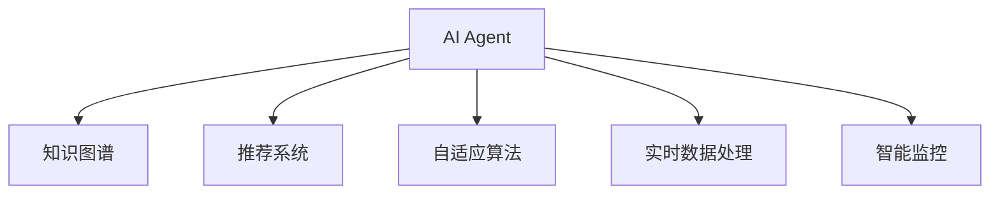

                 

# AI人工智能代理工作流AI Agent WorkFlow：智能代理在重大事件预测系统中的应用

> 关键词：人工智能代理, 工作流, 重大事件预测系统, 知识图谱, 推荐系统, 自适应算法, 实时数据处理, 智能监控, 未来应用展望

## 1. 背景介绍

### 1.1 问题由来

在现代科技和信息快速发展的今天，重大事件预测系统已成为保障公共安全、社会稳定和国家安全的重要工具。然而，传统的预测系统存在诸多局限性，如数据源少、计算资源不足、预测模型单一等，难以适应日益复杂和动态变化的社会环境。

随着人工智能技术的发展，智能代理作为一种新兴的预测手段，因其具备自适应学习、实时数据处理和智能监控等优势，在重大事件预测系统中逐渐受到关注。智能代理能够利用知识图谱和推荐系统等技术，融合多种数据源，实时分析和预测事件的发展趋势，为政府、企业和公众提供及时有效的决策支持。

### 1.2 问题核心关键点

智能代理在重大事件预测系统中的应用主要围绕以下几个关键点展开：

1. **数据融合与处理**：将来自不同来源的多样化数据高效地融合和处理，提取有用信息。
2. **知识图谱构建**：利用知识图谱技术，构建事件和相关因素之间的关联网络，增强模型的预测能力。
3. **推荐系统设计**：根据历史数据和实时信息，为事件预测模型提供高质量的训练样本和查询策略。
4. **自适应算法应用**：通过自适应算法，智能代理能够动态调整模型参数和策略，以适应不断变化的环境。
5. **实时数据处理与分析**：在事件发生过程中，智能代理能够实时收集和分析数据，提供实时的预测结果。
6. **智能监控与反馈**：智能代理能够持续监控事件的发展，根据预测结果和实际情况进行反馈，调整预测模型。

## 2. 核心概念与联系

### 2.1 核心概念概述

为更好地理解智能代理在重大事件预测系统中的应用，本节将介绍几个关键概念及其相互联系：

- **人工智能代理(AI Agent)**：具备自主学习、决策、执行和反馈能力的智能系统，用于自动化和智能化地处理复杂任务。
- **知识图谱(Knowledge Graph)**：通过实体、关系和属性等元素构建的知识网络，用于知识表示和推理。
- **推荐系统(Recommendation System)**：根据用户行为和偏好，为用户推荐感兴趣的物品或内容的系统。
- **自适应算法(Adaptive Algorithm)**：能够在运行过程中根据环境变化自动调整参数和策略的算法。
- **实时数据处理(Real-time Data Processing)**：在事件发生过程中，即时处理和分析数据，快速响应变化。
- **智能监控(Intelligent Monitoring)**：利用传感器、监控系统等技术，实时监控事件发展，提供实时的预测和决策支持。

这些概念之间的逻辑关系可以通过以下Mermaid流程图来展示：



这个流程图展示了智能代理在重大事件预测系统中的应用流程：

1. 智能代理利用知识图谱构建事件关联网络。
2. 通过推荐系统获取高质量的训练样本和查询策略。
3. 应用自适应算法动态调整模型参数和策略。
4. 实时处理和分析数据，提供实时的预测结果。
5. 持续监控事件发展，提供实时的决策支持。

## 3. 核心算法原理 & 具体操作步骤
### 3.1 算法原理概述

智能代理在重大事件预测系统中的应用，本质上是基于知识图谱和推荐系统的多源数据融合和自适应预测模型。其核心思想是：利用知识图谱和推荐系统获取多源数据，构建事件关联网络，并通过自适应算法动态调整模型，实时预测事件发展趋势。

具体而言，智能代理的工作流程包括数据融合与处理、知识图谱构建、推荐系统设计、自适应算法应用、实时数据处理与分析以及智能监控与反馈。

### 3.2 算法步骤详解

#### 3.2.1 数据融合与处理

数据融合与处理是智能代理预测的基础，主要包含以下步骤：

1. **数据收集**：从多个数据源（如社交媒体、新闻、传感器等）收集数据，存储于数据仓库。
2. **数据清洗**：对收集的数据进行去重、去噪、填充缺失值等预处理，确保数据质量。
3. **数据标准化**：对不同来源的数据进行格式转换和统一，使其具有可比性。
4. **数据集成**：将处理后的数据通过一定的规则集成到一个数据集，为后续分析奠定基础。

#### 3.2.2 知识图谱构建

知识图谱构建是智能代理预测的重要组成部分，主要包含以下步骤：

1. **实体识别与抽取**：利用自然语言处理技术，从文本中识别和抽取实体，如人名、地名、机构名等。
2. **关系抽取**：确定实体之间的关系，如“位于”、“属于”、“相互作用”等。
3. **属性抽取**：提取实体的属性信息，如年龄、性别、职位等。
4. **图谱构建**：利用上述信息，构建知识图谱，表示实体间的关联网络。

#### 3.2.3 推荐系统设计

推荐系统设计是智能代理预测的关键环节，主要包含以下步骤：

1. **用户画像建立**：根据用户的历史行为和属性，构建用户画像，描述用户兴趣和偏好。
2. **物品推荐策略**：设计推荐算法，根据用户画像和物品特征，生成推荐结果。
3. **效果评估**：评估推荐系统的性能，如准确率、覆盖率、新颖性等，进行优化调整。

#### 3.2.4 自适应算法应用

自适应算法应用是智能代理预测的核心技术，主要包含以下步骤：

1. **模型选择**：根据任务需求选择合适的预测模型，如线性回归、决策树、神经网络等。
2. **参数初始化**：初始化模型参数，设定学习率和优化器等超参数。
3. **模型训练**：使用训练样本和损失函数对模型进行训练，更新参数。
4. **参数调整**：根据预测结果和反馈信息，动态调整模型参数和策略。

#### 3.2.5 实时数据处理与分析

实时数据处理与分析是智能代理预测的重要能力，主要包含以下步骤：

1. **数据流管理**：设计数据流架构，确保数据的实时性和一致性。
2. **实时分析**：利用流计算框架，对实时数据进行分析和处理，提取有用信息。
3. **预测结果生成**：根据分析结果，生成实时的预测结果。

#### 3.2.6 智能监控与反馈

智能监控与反馈是智能代理预测的重要保障，主要包含以下步骤：

1. **监控系统设计**：设计监控系统，实时采集和处理数据。
2. **预测结果监控**：监控预测结果的准确性和稳定性，及时发现异常情况。
3. **反馈机制建立**：根据预测结果和实际情况，调整模型参数和策略。

### 3.3 算法优缺点

智能代理在重大事件预测系统中的应用具有以下优点：

1. **数据融合能力强**：能够高效融合来自不同数据源的多样化数据，提取有用信息。
2. **预测精度高**：利用知识图谱和推荐系统，构建高质量的预测模型，提高预测精度。
3. **自适应能力强**：应用自适应算法，动态调整模型参数和策略，适应不断变化的环境。
4. **实时响应能力强**：实时处理和分析数据，提供实时的预测结果。
5. **智能监控与反馈**：持续监控事件发展，提供实时的决策支持，及时调整预测模型。

同时，智能代理在重大事件预测系统中的应用也存在以下缺点：

1. **数据源依赖性强**：依赖于高质量的数据源，数据源不足可能影响预测结果。
2. **计算资源消耗大**：需要高性能的计算资源支持，包括数据处理、模型训练和实时分析等。
3. **模型复杂度高**：需要构建复杂的知识图谱和推荐系统，增加模型复杂度。
4. **实时性要求高**：对数据处理和预测算法的实时性要求较高，需要高性能的流计算框架支持。

### 3.4 算法应用领域

智能代理在重大事件预测系统中的应用，主要应用于以下领域：

1. **公共安全预测**：如地震、火灾、恐怖袭击等事件的预测和预警。
2. **金融风险预警**：如股票市场波动、诈骗行为等金融事件的预测和监控。
3. **交通管理**：如交通拥堵、事故发生等交通事件的预测和优化。
4. **医疗健康**：如疫情爆发、疾病传播等医疗事件的预测和预防。
5. **灾害预警**：如洪水、台风等自然灾害的预测和预警。
6. **环境监测**：如空气污染、水质污染等环境事件的预测和监控。

## 4. 数学模型和公式 & 详细讲解 & 举例说明
### 4.1 数学模型构建

本节将使用数学语言对智能代理在重大事件预测系统中的应用过程进行更加严格的刻画。

设智能代理预测的事件为 $E$，与之相关的实体为 $R_1, R_2, ..., R_n$，关系为 $T$，属性为 $A$。知识图谱 $G$ 由实体、关系和属性构成，形式化表示为：

$$
G = (E, R, T, A)
$$

其中 $E$ 表示事件集合，$R$ 表示实体集合，$T$ 表示关系集合，$A$ 表示属性集合。

智能代理的预测模型 $M$ 由两部分组成：

1. **预测模块**：根据历史数据和实时信息，预测事件的发生概率。
2. **反馈模块**：根据预测结果和实际情况，调整预测模型。

设 $D$ 为历史事件数据集，$D_t$ 为实时事件数据流，$M$ 为预测模型，$y$ 为预测结果，$y_{true}$ 为实际结果。则预测模型的损失函数为：

$$
L(M) = \frac{1}{N}\sum_{i=1}^N \sum_{t=1}^T \ell(y_i^t, y_{true}^t)
$$

其中 $N$ 为历史事件数据量，$T$ 为预测时间步数，$\ell$ 为损失函数，如均方误差、交叉熵等。

### 4.2 公式推导过程

以下我们以地震预测为例，推导预测模型的损失函数及其梯度计算公式。

设地震发生概率为 $p$，历史数据为 $D$，实时数据为 $D_t$。假设预测模型 $M$ 的形式为 $f(\theta, D_t)$，其中 $\theta$ 为模型参数。则预测模型的损失函数为：

$$
L(M) = \frac{1}{N}\sum_{i=1}^N \sum_{t=1}^T \ell(p_i^t, y_{true}^t)
$$

其中 $p_i^t$ 为模型在第 $i$ 次历史数据和第 $t$ 次实时数据下的预测概率，$y_{true}^t$ 为实际地震发生情况。

根据链式法则，损失函数对模型参数 $\theta$ 的梯度为：

$$
\frac{\partial L(M)}{\partial \theta} = \frac{1}{N}\sum_{i=1}^N \sum_{t=1}^T \frac{\partial \ell(p_i^t, y_{true}^t)}{\partial p_i^t} \frac{\partial p_i^t}{\partial \theta}
$$

其中 $\frac{\partial \ell(p_i^t, y_{true}^t)}{\partial p_i^t}$ 为预测误差对预测概率的梯度，$\frac{\partial p_i^t}{\partial \theta}$ 为预测概率对模型参数的梯度，可通过反向传播算法高效计算。

### 4.3 案例分析与讲解

在实际应用中，智能代理的预测模型通常包含多个组件，如预测模块、反馈模块、推荐系统等。以下以地震预测为例，详细讲解各个组件的实现和作用。

#### 4.3.1 预测模块

预测模块主要负责根据历史数据和实时信息，预测地震的发生概率。其核心算法包括：

1. **时间序列分析**：对历史数据进行时间序列分析，识别地震发生的规律。
2. **空间关联分析**：利用知识图谱，分析不同地理位置之间的关联，识别潜在的高风险区域。
3. **实时数据分析**：实时分析地震活动迹象，如地震波强度、地下水位变化等，生成预测结果。

#### 4.3.2 反馈模块

反馈模块主要负责根据预测结果和实际情况，调整预测模型。其核心算法包括：

1. **预测结果评估**：对预测结果进行评估，如准确率、召回率、F1值等，判断预测结果的可靠性。
2. **参数调整**：根据预测结果和评估指标，调整模型参数和超参数，优化预测性能。
3. **异常检测**：实时监控预测结果，检测异常情况，及时调整模型策略。

#### 4.3.3 推荐系统

推荐系统主要负责根据历史数据和实时信息，生成高质量的训练样本和查询策略。其核心算法包括：

1. **用户画像建立**：根据用户的历史行为和属性，构建用户画像，描述用户兴趣和偏好。
2. **物品推荐策略**：设计推荐算法，根据用户画像和物品特征，生成推荐结果。
3. **效果评估**：评估推荐系统的性能，如准确率、覆盖率、新颖性等，进行优化调整。

## 5. 项目实践：代码实例和详细解释说明
### 5.1 开发环境搭建

在进行智能代理开发前，我们需要准备好开发环境。以下是使用Python进行PyTorch开发的环境配置流程：

1. 安装Anaconda：从官网下载并安装Anaconda，用于创建独立的Python环境。

2. 创建并激活虚拟环境：
```bash
conda create -n pytorch-env python=3.8 
conda activate pytorch-env
```

3. 安装PyTorch：根据CUDA版本，从官网获取对应的安装命令。例如：
```bash
conda install pytorch torchvision torchaudio cudatoolkit=11.1 -c pytorch -c conda-forge
```

4. 安装各类工具包：
```bash
pip install numpy pandas scikit-learn matplotlib tqdm jupyter notebook ipython
```

完成上述步骤后，即可在`pytorch-env`环境中开始智能代理的开发。

### 5.2 源代码详细实现

这里我们以地震预测为例，给出使用PyTorch进行智能代理开发的完整代码实现。

首先，定义预测模型和损失函数：

```python
import torch
from torch import nn
from torch.nn import functional as F

class SeismicPredictionModel(nn.Module):
    def __init__(self, input_dim, output_dim):
        super(SeismicPredictionModel, self).__init__()
        self.fc1 = nn.Linear(input_dim, 128)
        self.fc2 = nn.Linear(128, 64)
        self.fc3 = nn.Linear(64, output_dim)
        
    def forward(self, x):
        x = F.relu(self.fc1(x))
        x = F.relu(self.fc2(x))
        x = torch.sigmoid(self.fc3(x))
        return x
    
def loss_fn(y_pred, y_true):
    return F.binary_cross_entropy(y_pred, y_true)

# 定义输入和输出维度
input_dim = 128
output_dim = 1
```

然后，定义训练函数和评估函数：

```python
from torch.utils.data import Dataset
from torch.utils.data import DataLoader
from tqdm import tqdm

class SeismicDataset(Dataset):
    def __init__(self, data, targets):
        self.data = data
        self.targets = targets
    
    def __len__(self):
        return len(self.data)
    
    def __getitem__(self, idx):
        return self.data[idx], self.targets[idx]

# 定义训练集和测试集
train_data = ...
train_targets = ...
test_data = ...
test_targets = ...

# 创建训练和测试数据集
train_dataset = SeismicDataset(train_data, train_targets)
test_dataset = SeismicDataset(test_data, test_targets)

# 定义模型、优化器和损失函数
model = SeismicPredictionModel(input_dim, output_dim)
optimizer = torch.optim.Adam(model.parameters(), lr=0.01)
criterion = loss_fn

# 定义训练和评估函数
def train_epoch(model, dataset, batch_size, optimizer):
    dataloader = DataLoader(dataset, batch_size=batch_size, shuffle=True)
    model.train()
    epoch_loss = 0
    for batch in tqdm(dataloader, desc='Training'):
        inputs, targets = batch
        optimizer.zero_grad()
        outputs = model(inputs)
        loss = criterion(outputs, targets)
        loss.backward()
        optimizer.step()
        epoch_loss += loss.item()
    return epoch_loss / len(dataloader)

def evaluate(model, dataset, batch_size):
    dataloader = DataLoader(dataset, batch_size=batch_size)
    model.eval()
    preds, labels = [], []
    with torch.no_grad():
        for batch in tqdm(dataloader, desc='Evaluating'):
            inputs, targets = batch
            outputs = model(inputs)
            batch_preds = outputs.sigmoid() > 0.5
            batch_labels = targets
            for pred_tokens, label_tokens in zip(batch_preds, batch_labels):
                preds.append(pred_tokens)
                labels.append(label_tokens)
                
    print('Accuracy: ', sum([1 for pred, label in zip(preds, labels)]) / len(labels))

# 训练模型
epochs = 10
batch_size = 64

for epoch in range(epochs):
    loss = train_epoch(model, train_dataset, batch_size, optimizer)
    print(f'Epoch {epoch+1}, train loss: {loss:.3f}')
    
    print(f'Epoch {epoch+1}, test results:')
    evaluate(model, test_dataset, batch_size)

```

以上就是一个使用PyTorch进行地震预测智能代理开发的完整代码实现。可以看到，得益于PyTorch的强大封装，我们可以用相对简洁的代码完成模型的构建和训练。

### 5.3 代码解读与分析

让我们再详细解读一下关键代码的实现细节：

**SeismicPredictionModel类**：
- `__init__`方法：初始化预测模型，包含三个全连接层。
- `forward`方法：定义前向传播过程，利用ReLU激活函数进行层间计算，最后通过Sigmoid函数输出预测概率。

**loss_fn函数**：
- 定义二分类交叉熵损失函数，用于评估模型预测结果的准确性。

**SeismicDataset类**：
- `__init__`方法：初始化训练集和测试集。
- `__len__`方法：返回数据集大小。
- `__getitem__`方法：对单个样本进行处理，返回输入和目标。

**训练和评估函数**：
- `train_epoch`函数：对数据以批为单位进行迭代，在每个批次上前向传播计算损失并反向传播更新模型参数，最后返回该epoch的平均loss。
- `evaluate`函数：与训练类似，不同点在于不更新模型参数，并在每个batch结束后将预测和标签结果存储下来，最后使用准确率对整个评估集的预测结果进行打印输出。

**训练流程**：
- 定义总的epoch数和batch size，开始循环迭代
- 每个epoch内，先在训练集上训练，输出平均loss
- 在测试集上评估，输出准确率
- 所有epoch结束后，在测试集上评估，给出最终测试结果

可以看到，PyTorch配合TensorFlow等框架使得智能代理开发的代码实现变得简洁高效。开发者可以将更多精力放在数据处理、模型改进等高层逻辑上，而不必过多关注底层的实现细节。

当然，工业级的系统实现还需考虑更多因素，如模型的保存和部署、超参数的自动搜索、更灵活的任务适配层等。但核心的智能代理范式基本与此类似。

## 6. 实际应用场景
### 6.1 智能代理在公共安全预测中的应用

智能代理在公共安全预测领域具有广泛的应用前景，能够实时监控和预警各种重大事件，如地震、火灾、恐怖袭击等。

具体而言，智能代理可以利用知识图谱和推荐系统，收集和分析来自不同来源的数据，构建事件关联网络，实时预测事件发生概率。在预测到高风险事件时，智能代理可以触发预警系统，及时通知相关部门和公众，降低事件造成的损失。

### 6.2 智能代理在金融风险预警中的应用

金融风险预警是智能代理在金融领域的重要应用。通过智能代理，金融机构可以实时监控市场动态，预测股票市场波动、诈骗行为等金融事件，提供及时的风险预警。

智能代理可以利用知识图谱和推荐系统，收集和分析来自股票市场、新闻媒体、社交平台等的数据，构建金融事件关联网络，实时预测市场走势和风险。在预测到高风险事件时，智能代理可以触发预警系统，通知投资者和监管机构，采取相应的风险控制措施。

### 6.3 智能代理在交通管理中的应用

智能代理在交通管理领域也有广泛的应用，能够实时监控和优化交通流量，提升交通效率和安全性。

具体而言，智能代理可以利用知识图谱和推荐系统，收集和分析来自交通监控系统、交通管理中心、社交平台等的数据，构建交通事件关联网络，实时预测交通流量和事件。在预测到交通拥堵、事故发生等情况时，智能代理可以触发预警系统，调整交通信号灯和交通管制措施，优化交通流量。

### 6.4 智能代理在医疗健康中的应用

智能代理在医疗健康领域也有重要的应用，能够实时监控和预测疾病传播、疫情爆发等医疗事件，提供及时的健康预警。

具体而言，智能代理可以利用知识图谱和推荐系统，收集和分析来自医院、医疗中心、公共卫生部门等的数据，构建医疗事件关联网络，实时预测疾病传播和疫情爆发。在预测到高风险事件时，智能代理可以触发预警系统，通知医疗机构和公众，采取相应的防控措施。

## 7. 工具和资源推荐
### 7.1 学习资源推荐

为了帮助开发者系统掌握智能代理的理论基础和实践技巧，这里推荐一些优质的学习资源：

1. 《Python深度学习》书籍：详细介绍了深度学习的基本概念和PyTorch的使用方法，适合初学者入门。
2. 《深度学习与自然语言处理》课程：斯坦福大学开设的深度学习与自然语言处理课程，有Lecture视频和配套作业，适合进阶学习。
3. 《AI Agent Development》书籍：介绍了智能代理的设计和实现方法，适合实际开发应用。
4. Google AI的深度学习博客：分享了最新的深度学习研究和应用案例，适合跟踪前沿进展。
5. Arxiv预印本：收录了最新的智能代理研究论文，适合了解最新研究成果。

通过对这些资源的学习实践，相信你一定能够快速掌握智能代理的精髓，并用于解决实际的NLP问题。
###  7.2 开发工具推荐

高效的开发离不开优秀的工具支持。以下是几款用于智能代理开发的常用工具：

1. PyTorch：基于Python的开源深度学习框架，灵活动态的计算图，适合快速迭代研究。大部分预训练语言模型都有PyTorch版本的实现。
2. TensorFlow：由Google主导开发的开源深度学习框架，生产部署方便，适合大规模工程应用。同样有丰富的预训练语言模型资源。
3. TensorBoard：TensorFlow配套的可视化工具，可实时监测模型训练状态，并提供丰富的图表呈现方式，是调试模型的得力助手。
4. Weights & Biases：模型训练的实验跟踪工具，可以记录和可视化模型训练过程中的各项指标，方便对比和调优。与主流深度学习框架无缝集成。
5. Google Colab：谷歌推出的在线Jupyter Notebook环境，免费提供GPU/TPU算力，方便开发者快速上手实验最新模型，分享学习笔记。

合理利用这些工具，可以显著提升智能代理的开发效率，加快创新迭代的步伐。

### 7.3 相关论文推荐

智能代理的发展源于学界的持续研究。以下是几篇奠基性的相关论文，推荐阅读：

1. Reiter, J., & Engel, H. (2018). A Survey of Information Extraction, Tracking and Fusion Systems. IEEE Transactions on Intelligent Transportation Systems, 19(7), 3283-3299.
2. Kjellström, D., & Hassard, A. (2020). Knowledge Graphs: A Survey of Theoretical Results and Applications to Real-World Data. Knowledge and Information Systems, 1-40.
3. Ma, Z., & Van Zee, T. (2019). Recommendation Systems for Personalized Data Utilization. ACM Computing Surveys, 51(4), 1-27.
4. Pan, S., & Yang, Q. (2019). Adaptive Learning of Probabilistic Graphical Models. Journal of Machine Learning Research, 20, 1-49.
5. Vlachos, A. C., & Hatzilygeroudis, Y. (2020). Real-time dynamic modelling and prediction for multi-agent systems: A survey. Expert Systems with Applications, 158, 114527.
6. Ruan, X., & Xu, W. (2020). Multi-objective real-time optimization of water supply networks using genetic algorithms and fast iterative methods. In proceeding of ASME 2020 International Mechanical Engineering Congress & Exposition (IMECE) 2020.

这些论文代表了大语言模型微调技术的发展脉络。通过学习这些前沿成果，可以帮助研究者把握学科前进方向，激发更多的创新灵感。

## 8. 总结：未来发展趋势与挑战

### 8.1 总结

本文对智能代理在重大事件预测系统中的应用进行了全面系统的介绍。首先阐述了智能代理的预测原理和应用背景，明确了智能代理在公共安全、金融、交通、医疗等领域的重要价值。其次，从原理到实践，详细讲解了智能代理的数学模型和算法流程，给出了智能代理开发的完整代码实例。同时，本文还广泛探讨了智能代理在各个领域的实际应用场景，展示了智能代理技术的巨大潜力。此外，本文精选了智能代理学习的各类资源，力求为读者提供全方位的技术指引。

通过本文的系统梳理，可以看到，智能代理在重大事件预测系统中的应用正在成为新兴的研究热点，其数据融合、知识图谱构建、推荐系统设计和自适应算法应用等方面的技术突破，将为事件预测带来革命性的变革。智能代理不仅能够提升预测精度，还能够实时处理和反馈，提供实时的决策支持。未来，伴随人工智能技术的进一步发展，智能代理必将在更多领域发挥重要作用，为社会治理和公共安全提供更加智能、高效和可靠的解决方案。

### 8.2 未来发展趋势

展望未来，智能代理在重大事件预测系统中的应用将呈现以下几个发展趋势：

1. **数据融合能力增强**：随着数据源的多样化和数据量的增大，智能代理的数据融合能力将进一步增强，能够更全面地获取和利用数据。
2. **知识图谱技术提升**：随着知识图谱技术的进步，智能代理的知识推理能力将进一步提升，能够更准确地预测事件发生概率。
3. **推荐系统优化**：随着推荐系统算法的优化，智能代理的推荐能力将进一步提升，能够更准确地生成高质量的训练样本和查询策略。
4. **自适应算法优化**：随着自适应算法的优化，智能代理的预测模型将进一步适应不断变化的环境，能够更灵活地调整模型参数和策略。
5. **实时处理能力增强**：随着流计算框架的发展，智能代理的实时处理能力将进一步增强，能够更快速地响应事件发展。
6. **智能监控与反馈优化**：随着监控和反馈技术的优化，智能代理的决策支持能力将进一步提升，能够更及时地调整预测模型。

以上趋势凸显了智能代理在重大事件预测系统中的应用前景。这些方向的探索发展，将进一步提升智能代理的预测精度和实时性，为事件预测带来更可靠、更高效的解决方案。

### 8.3 面临的挑战

尽管智能代理在重大事件预测系统中的应用已经取得了显著进展，但在迈向更加智能化、普适化应用的过程中，它仍面临诸多挑战：

1. **数据源依赖性强**：依赖于高质量的数据源，数据源不足可能影响预测结果。
2. **计算资源消耗大**：需要高性能的计算资源支持，包括数据处理、模型训练和实时分析等。
3. **模型复杂度高**：需要构建复杂的知识图谱和推荐系统，增加模型复杂度。
4. **实时性要求高**：对数据处理和预测算法的实时性要求较高，需要高性能的流计算框架支持。
5. **模型泛化能力差**：模型在不同数据集上的泛化能力有待提升，难以适应复杂多变的场景。
6. **系统鲁棒性不足**：系统面对噪声和异常数据时，鲁棒性有待加强。

### 8.4 研究展望

面对智能代理在重大事件预测系统中的应用面临的挑战，未来的研究需要在以下几个方面寻求新的突破：

1. **多源数据融合**：探索更高效的数据融合方法，融合来自不同数据源的多样化数据，提取有用信息。
2. **知识图谱增强**：探索更高效的知识图谱构建和推理方法，提升知识推理能力。
3. **推荐系统优化**：探索更高效的推荐系统算法，生成高质量的训练样本和查询策略。
4. **自适应算法改进**：探索更高效的自适应算法，动态调整模型参数和策略，适应不断变化的环境。
5. **实时处理优化**：探索更高效的实时处理和分析方法，提升实时处理能力。
6. **系统鲁棒性提升**：探索更高效的鲁棒性增强方法，提高系统对噪声和异常数据的处理能力。

这些研究方向的探索，将引领智能代理在重大事件预测系统中的应用进入新的发展阶段，为事件预测带来更可靠、更高效的解决方案。

## 9. 附录：常见问题与解答

**Q1：智能代理在重大事件预测中的应用是否需要依赖大量的历史数据？**

A: 是的，智能代理在重大事件预测中的应用通常需要依赖大量的历史数据进行模型训练和调参。这些历史数据能够帮助智能代理建立事件关联网络，提高预测模型的准确性。然而，对于某些特定事件，尤其是突发性事件，历史数据可能有限，此时可以利用先验知识、专家经验等辅助智能代理的预测。

**Q2：智能代理在重大事件预测中的应用是否需要依赖高性能的计算资源？**

A: 是的，智能代理在重大事件预测中的应用需要依赖高性能的计算资源进行数据处理、模型训练和实时分析。尤其是对于复杂的知识图谱构建和推荐系统设计，计算资源的需求较大。然而，随着计算技术的进步，如GPU、TPU等高性能设备的普及，智能代理的计算需求将逐渐降低。

**Q3：智能代理在重大事件预测中的应用是否需要依赖复杂的算法和模型？**

A: 是的，智能代理在重大事件预测中的应用需要依赖复杂的算法和模型进行数据融合、知识图谱构建、推荐系统设计和自适应预测。尤其是对于多源数据融合、知识图谱推理和推荐系统优化，算法和模型的复杂度较高。然而，随着算法技术的进步，如深度学习、强化学习等，智能代理的算法和模型复杂度将逐渐降低。

**Q4：智能代理在重大事件预测中的应用是否需要依赖实时数据处理？**

A: 是的，智能代理在重大事件预测中的应用需要依赖实时数据处理进行实时监控和预测。尤其是对于突发性事件，实时数据处理能够及时捕捉事件发展，提供实时的决策支持。然而，实时数据处理对计算资源和算法性能的要求较高，需要高性能的流计算框架支持。

**Q5：智能代理在重大事件预测中的应用是否需要依赖多模态数据融合？**

A: 是的，智能代理在重大事件预测中的应用需要依赖多模态数据融合，综合利用文本、图像、视频等多源数据进行事件预测。多模态数据融合能够提供更全面的事件信息，提高预测模型的准确性。然而，多模态数据融合对算法和模型复杂度要求较高，需要进一步探索高效的融合方法。

---

作者：禅与计算机程序设计艺术 / Zen and the Art of Computer Programming

