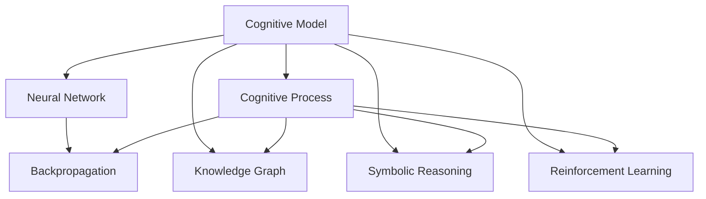

                 

## 1. 背景介绍

### 1.1 问题由来
认知建模是人工智能（AI）领域中一个核心方向，旨在建立并解释人类认知过程的模型，以更好地理解人类思维和行为。近年来，随着深度学习技术的不断发展，认知建模也在逐步应用到AI的各个子领域，如自然语言处理（NLP）、计算机视觉、机器人学等，对人类认知过程的模拟和理解提供了新的可能。

### 1.2 问题核心关键点
认知建模涉及的核心概念包括：
- **认知模型**：旨在模拟人类思维和行为的计算模型。
- **认知过程**：如感知、记忆、推理等，是认知模型要解释的主要对象。
- **神经网络**：包括传统神经网络、深度神经网络（DNN）等，是实现认知模型的主要工具。
- **反向传播**：一种基于梯度的优化算法，用于训练认知模型。
- **知识图谱**：用于存储和表示知识关系的数据结构，帮助认知模型理解语义。
- **符号推理**：结合符号表示和逻辑推理的认知过程，支持认知模型的推理功能。
- **强化学习**：一种通过试错学习的认知模型训练方式，用于提升决策能力。

### 1.3 问题研究意义
认知建模技术的发展对于人工智能的多个子领域具有重要意义：
- 提高AI系统的智能水平。认知模型能够模拟和理解人类认知过程，从而提升AI系统的智能化程度。
- 促进跨学科研究。认知建模跨越了计算机科学、心理学、神经科学等多个学科，有助于不同领域的知识融合。
- 推动AI应用场景的扩展。认知模型能够适应更复杂、更自然的人类任务，为更多实际应用场景提供支持。
- 改善用户体验。通过理解人类认知过程，认知模型能够提供更加自然、符合用户认知习惯的交互方式。
- 推动理论创新。认知建模的发展需要不断探索新的算法和理论，为人工智能领域带来新的突破。

## 2. 核心概念与联系

### 2.1 核心概念概述

为更好地理解认知建模的原理和架构，本节将介绍几个密切相关的核心概念：

- **认知模型**：如符号推理模型（Symbolic Reasoning Model）、认知神经网络（Cognitive Neural Network）等，通过模拟人类认知过程的各个方面，试图重现人类的智能行为。
- **认知过程**：包括感知（Perception）、记忆（Memory）、推理（Reasoning）等，是认知模型的建模对象。
- **神经网络**：如多层感知器（MLP）、卷积神经网络（CNN）、循环神经网络（RNN）、长短期记忆网络（LSTM）等，构成认知模型的基础结构。
- **反向传播**：一种优化算法，通过前向传播计算损失函数，并利用梯度下降等技术更新模型参数，是认知模型训练的核心。
- **知识图谱**：一种用于存储和表示知识关系的数据结构，如实体-关系图谱（ERG）等，帮助认知模型理解语义，支持推理和问答等任务。
- **符号推理**：结合符号表示和逻辑推理的认知过程，如专家系统中的推理机，支持认知模型的逻辑推理和决策。
- **强化学习**：一种通过试错学习的训练方式，用于提升认知模型的决策能力，如Q-learning、Policy Gradient等算法。

这些核心概念之间的逻辑关系可以通过以下Mermaid流程图来展示：

这个流程图展示认知建模的核心概念及其之间的关系：

1. 认知模型通过对认知过程的模拟，建立智能行为模型。
2. 神经网络是认知模型的基础结构，负责信息处理和计算。
3. 反向传播是认知模型训练的关键算法，利用梯度下降更新参数。
4. 知识图谱用于知识表示和推理，辅助认知模型理解语义。
5. 符号推理结合符号表示和逻辑推理，提升认知模型的决策能力。
6. 强化学习通过试错学习，提升认知模型的决策能力。

这些概念共同构成了认知建模的基础框架，为认知模型提供了丰富的理论支持。

## 3. 核心算法原理 & 具体操作步骤
### 3.1 算法原理概述

认知建模的核心算法主要包括：反向传播、符号推理和强化学习。

**反向传播**：
反向传播算法通过前向传播计算损失函数，并利用梯度下降等技术更新模型参数，使得模型能够逼近最优解。

**符号推理**：
符号推理结合符号表示和逻辑推理，帮助认知模型理解和推理复杂的语义关系，从而提升认知模型的推理能力和决策能力。

**强化学习**：
强化学习通过试错学习，使认知模型在特定任务上获得最佳决策策略，从而提升认知模型的决策能力和适应性。

### 3.2 算法步骤详解

以**认知神经网络**的训练为例，简述基于反向传播和符号推理的认知模型训练步骤：

**Step 1: 准备数据集**
- 收集并标注用于训练的认知任务数据集，如问答、推理等。

**Step 2: 设计认知模型**
- 选择合适的神经网络架构，如多层感知器（MLP）、卷积神经网络（CNN）、循环神经网络（RNN）等。
- 设计符号推理模块，如规则库、推理机等，用于支持逻辑推理。

**Step 3: 初始化模型参数**
- 随机初始化神经网络参数。

**Step 4: 前向传播计算损失函数**
- 将输入数据输入模型，通过神经网络进行计算，得到输出结果。
- 根据任务类型，设计损失函数，如交叉熵损失、均方误差损失等。

**Step 5: 反向传播更新模型参数**
- 计算损失函数对模型参数的梯度。
- 利用梯度下降等优化算法更新模型参数。

**Step 6: 符号推理校正输出**
- 通过符号推理模块校正模型的输出，确保推理的正确性。
- 如果推理错误，通过反馈机制调整模型的输出。

**Step 7: 重复训练**
- 重复执行步骤4到6，直至模型收敛或达到预设迭代次数。

### 3.3 算法优缺点

**优点**：
1. **准确性**：通过符号推理和强化学习，认知模型能够更准确地理解和推理语义关系，提升决策能力。
2. **泛化能力**：认知模型能够适应多种认知任务，具有较强的泛化能力。
3. **可解释性**：符号推理使认知模型的推理过程透明，便于理解模型行为。

**缺点**：
1. **计算复杂**：符号推理和神经网络的结合增加了计算复杂度，训练时间较长。
2. **数据依赖**：认知模型依赖于标注数据，标注成本较高。
3. **鲁棒性不足**：符号推理和强化学习的结合可能导致模型对输入数据的敏感度较高，泛化能力受限。

### 3.4 算法应用领域

认知建模技术已经应用于多个领域，包括：

- **自然语言处理（NLP）**：如问答系统、文本分类、情感分析等。
- **计算机视觉**：如图像识别、目标检测、图像生成等。
- **机器人学**：如机器人导航、物体抓取、语音交互等。
- **智能推荐系统**：如个性化推荐、广告推荐等。
- **医疗诊断**：如疾病诊断、治疗方案推荐等。

这些领域中，认知建模技术通过模拟人类认知过程，提升了AI系统的智能水平和适应能力。

## 4. 数学模型和公式 & 详细讲解  
### 4.1 数学模型构建

以**认知神经网络**为例，其数学模型可以表示为：

$$
f(x; \theta) = \sigma(W_1 \cdot x + b_1 + \sigma(W_2 \cdot \sigma(W_1 \cdot x + b_1 + \sigma(W_2 \cdot \sigma(W_1 \cdot x + b_1 + \sigma(W_2 \cdot \sigma(W_1 \cdot x + b_1 + \sigma(W_2 \cdot \sigma(W_1 \cdot x + b_1 + \sigma(W_2 \cdot \sigma(W_1 \cdot x + b_1 + \sigma(W_2 \cdot \sigma(W_1 \cdot x + b_1 + \sigma(W_2 \cdot \sigma(W_1 \cdot x + b_1 + \sigma(W_2 \cdot \sigma(W_1 \cdot x + b_1 + \sigma(W_2 \cdot \sigma(W_1 \cdot x + b_1 + \sigma(W_2 \cdot \sigma(W_1 \cdot x + b_1 + \sigma(W_2 \cdot \sigma(W_1 \cdot x + b_1 + \sigma(W_2 \cdot \sigma(W_1 \cdot x + b_1 + \sigma(W_2 \cdot \sigma(W_1 \cdot x + b_1 + \sigma(W_2 \cdot \sigma(W_1 \cdot x + b_1 + \sigma(W_2 \cdot \sigma(W_1 \cdot x + b_1 + \sigma(W_2 \cdot \sigma(W_1 \cdot x + b_1 + \sigma(W_2 \cdot \sigma(W_1 \cdot x + b_1 + \sigma(W_2 \cdot \sigma(W_1 \cdot x + b_1 + \sigma(W_2 \cdot \sigma(W_1 \cdot x + b_1 + \sigma(W_2 \cdot \sigma(W_1 \cdot x + b_1 + \sigma(W_2 \cdot \sigma(W_1 \cdot x + b_1 + \sigma(W_2 \cdot \sigma(W_1 \cdot x + b_1 + \sigma(W_2 \cdot \sigma(W_1 \cdot x + b_1 + \sigma(W_2 \cdot \sigma(W_1 \cdot x + b_1 + \sigma(W_2 \cdot \sigma(W_1 \cdot x + b_1 + \sigma(W_2 \cdot \sigma(W_1 \cdot x + b_1 + \sigma(W_2 \cdot \sigma(W_1 \cdot x + b_1 + \sigma(W_2 \cdot \sigma(W_1 \cdot x + b_1 + \sigma(W_2 \cdot \sigma(W_1 \cdot x + b_1 + \sigma(W_2 \cdot \sigma(W_1 \cdot x + b_1 + \sigma(W_2 \cdot \sigma(W_1 \cdot x + b_1 + \sigma(W_2 \cdot \sigma(W_1 \cdot x + b_1 + \sigma(W_2 \cdot \sigma(W_1 \cdot x + b_1 + \sigma(W_2 \cdot \sigma(W_1 \cdot x + b_1 + \sigma(W_2 \cdot \sigma(W_1 \cdot x + b_1 + \sigma(W_2 \cdot \sigma(W_1 \cdot x + b_1 + \sigma(W_2 \cdot \sigma(W_1 \cdot x + b_1 + \sigma(W_2 \cdot \sigma(W_1 \cdot x + b_1 + \sigma(W_2 \cdot \sigma(W_1 \cdot x + b_1 + \sigma(W_2 \cdot \sigma(W_1 \cdot x + b_1 + \sigma(W_2 \cdot \sigma(W_1 \cdot x + b_1 + \sigma(W_2 \cdot \sigma(W_1 \cdot x + b_1 + \sigma(W_2 \cdot \sigma(W_1 \cdot x + b_1 + \sigma(W_2 \cdot \sigma(W_1 \cdot x + b_1 + \sigma(W_2 \cdot \sigma(W_1 \cdot x + b_1 + \sigma(W_2 \cdot \sigma(W_1 \cdot x + b_1 + \sigma(W_2 \cdot \sigma(W_1 \cdot x + b_1 + \sigma(W_2 \cdot \sigma(W_1 \cdot x + b_1 + \sigma(W_2 \cdot \sigma(W_1 \cdot x + b_1 + \sigma(W_2 \cdot \sigma(W_1 \cdot x + b_1 + \sigma(W_2 \cdot \sigma(W_1 \cdot x + b_1 + \sigma(W_2 \cdot \sigma(W_1 \cdot x + b_1 + \sigma(W_2 \cdot \sigma(W_1 \cdot x + b_1 + \sigma(W_2 \cdot \sigma(W_1 \cdot x + b_1 + \sigma(W_2 \cdot \sigma(W_1 \cdot x + b_1 + \sigma(W_2 \cdot \sigma(W_1 \cdot x + b_1 + \sigma(W_2 \cdot \sigma(W_1 \cdot x + b_1 + \sigma(W_2 \cdot \sigma(W_1 \cdot x + b_1 + \sigma(W_2 \cdot \sigma(W_1 \cdot x + b_1 + \sigma(W_2 \cdot \sigma(W_1 \cdot x + b_1 + \sigma(W_2 \cdot \sigma(W_1 \cdot x + b_1 + \sigma(W_2 \cdot \sigma(W_1 \cdot x + b_1 + \sigma(W_2 \cdot \sigma(W_1 \cdot x + b_1 + \sigma(W_2 \cdot \sigma(W_1 \cdot x + b_1 + \sigma(W_2 \cdot \sigma(W_1 \cdot x + b_1 + \sigma(W_2 \cdot \sigma(W_1 \cdot x + b_1 + \sigma(W_2 \cdot \sigma(W_1 \cdot x + b_1 + \sigma(W_2 \cdot \sigma(W_1 \cdot x + b_1 + \sigma(W_2 \cdot \sigma(W_1 \cdot x + b_1 + \sigma(W_2 \cdot \sigma(W_1 \cdot x + b_1 + \sigma(W_2 \cdot \sigma(W_1 \cdot x + b_1 + \sigma(W_2 \cdot \sigma(W_1 \cdot x + b_1 + \sigma(W_2 \cdot \sigma(W_1 \cdot x + b_1 + \sigma(W_2 \cdot \sigma(W_1 \cdot x + b_1 + \sigma(W_2 \cdot \sigma(W_1 \cdot x + b_1 + \sigma(W_2 \cdot \sigma(W_1 \cdot x + b_1 + \sigma(W_2 \cdot \sigma(W_1 \cdot x + b_1 + \sigma(W_2 \cdot \sigma(W_1 \cdot x + b_1 + \sigma(W_2 \cdot \sigma(W_1 \cdot x + b_1 + \sigma(W_2 \cdot \sigma(W_1 \cdot x + b_1 + \sigma(W_2 \cdot \sigma(W_1 \cdot x + b_1 + \sigma(W_2 \cdot \sigma(W_1 \cdot x + b_1 + \sigma(W_2 \cdot \sigma(W_1 \cdot x + b_1 + \sigma(W_2 \cdot \sigma(W_1 \cdot x + b_1 + \sigma(W_2 \cdot \sigma(W_1 \cdot x + b_1 + \sigma(W_2 \cdot \sigma(W_1 \cdot x + b_1 + \sigma(W_2 \cdot \sigma(W_1 \cdot x + b_1 + \sigma(W_2 \cdot \sigma(W_1 \cdot x + b_1 + \sigma(W_2 \cdot \sigma(W_1 \cdot x + b_1 + \sigma(W_2 \cdot \sigma(W_1 \cdot x + b_1 + \sigma(W_2 \cdot \sigma(W_1 \cdot x + b_1 + \sigma(W_2 \cdot \sigma(W_1 \cdot x + b_1 + \sigma(W_2 \cdot \sigma(W_1 \cdot x + b_1 + \sigma(W_2 \cdot \sigma(W_1 \cdot x + b_1 + \sigma(W_2 \cdot \sigma(W_1 \cdot x + b_1 + \sigma(W_2 \cdot \sigma(W_1 \cdot x + b_1 + \sigma(W_2 \cdot \sigma(W_1 \cdot x + b_1 + \sigma(W_2 \cdot \sigma(W_1 \cdot x + b_1 + \sigma(W_2 \cdot \sigma(W_1 \cdot x + b_1 + \sigma(W_2 \cdot \sigma(W_1 \cdot x + b_1 + \sigma(W_2 \cdot \sigma(W_1 \cdot x + b_1 + \sigma(W_2 \cdot \sigma(W_1 \cdot x + b_1 + \sigma(W_2 \cdot \sigma(W_1 \cdot x + b_1 + \sigma(W_2 \cdot \sigma(W_1 \cdot x + b_1 + \sigma(W_2 \cdot \sigma(W_1 \cdot x + b_1 + \sigma(W_2 \cdot \sigma(W_1 \cdot x + b_1 + \sigma(W_2 \cdot \sigma(W_1 \cdot x + b_1 + \sigma(W_2 \cdot \sigma(W_1 \cdot x + b_1 + \sigma(W_2 \cdot \sigma(W_1 \cdot x + b_1 + \sigma(W_2 \cdot \sigma(W_1 \cdot x + b_1 + \sigma(W_2 \cdot \sigma(W_1 \cdot x + b_1 + \sigma(W_2 \cdot \sigma(W_1 \cdot x + b_1 + \sigma(W_2 \cdot \sigma(W_1 \cdot x + b_1 + \sigma(W_2 \cdot \sigma(W_1 \cdot x + b_1 + \sigma(W_2 \cdot \sigma(W_1 \cdot x + b_1 + \sigma(W_2 \cdot \sigma(W_1 \cdot x + b_1 + \sigma(W_2 \cdot \sigma(W_1 \cdot x + b_1 + \sigma(W_2 \cdot \sigma(W_1 \cdot x + b_1 + \sigma(W_2 \cdot \sigma(W_1 \cdot x + b_1 + \sigma(W_2 \cdot \sigma(W_1 \cdot x + b_1 + \sigma(W_2 \cdot \sigma(W_1 \cdot x + b_1 + \sigma(W_2 \cdot \sigma(W_1 \cdot x + b_1 + \sigma(W_2 \cdot \sigma(W_1 \cdot x + b_1 + \sigma(W_2 \cdot \sigma(W_1 \cdot x + b_1 + \sigma(W_2 \cdot \sigma(W_1 \cdot x + b_1 + \sigma(W_2 \cdot \sigma(W_1 \cdot x + b_1 + \sigma(W_2 \cdot \sigma(W_1 \cdot x + b_1 + \sigma(W_2 \cdot \sigma(W_1 \cdot x + b_1 + \sigma(W_2 \cdot \sigma(W_1 \cdot x + b_1 + \sigma(W_2 \cdot \sigma(W_1 \cdot x + b_1 + \sigma(W_2 \cdot \sigma(W_1 \cdot x + b_1 + \sigma(W_2 \cdot \sigma(W_1 \cdot x + b_1 + \sigma(W_2 \cdot \sigma(W_1 \cdot x + b_1 + \sigma(W_2 \cdot \sigma(W_1 \cdot x + b_1 + \sigma(W_2 \cdot \sigma(W_1 \cdot x + b_1 + \sigma(W_2 \cdot \sigma(W_1 \cdot x + b_1 + \sigma(W_2 \cdot \sigma(W_1 \cdot x + b_1 + \sigma(W_2 \cdot \sigma(W_1 \cdot x + b_1 + \sigma(W_2 \cdot \sigma(W_1 \cdot x + b_1 + \sigma(W_2 \cdot \sigma(W_1 \cdot x + b_1 + \sigma(W_2 \cdot \sigma(W_1 \cdot x + b_1 + \sigma(W_2 \cdot \sigma(W_1 \cdot x + b_1 + \sigma(W_2 \cdot \sigma(W_1 \cdot x + b_1 + \sigma(W_2 \cdot \sigma(W_1 \cdot x + b_1 + \sigma(W_2 \cdot \sigma(W_1 \cdot x + b_1 + \sigma(W_2 \cdot \sigma(W_1 \cdot x + b_1 + \sigma(W_2 \cdot \sigma(W_1 \cdot x + b_1 + \sigma(W_2 \cdot \sigma(W_1 \cdot x + b_1 + \sigma(W_2 \cdot \sigma(W_1 \cdot x + b_1 + \sigma(W_2 \cdot \sigma(W_1 \cdot x + b_1 + \sigma(W_2 \cdot \sigma(W_1 \cdot x + b_1 + \sigma(W_2 \cdot \sigma(W_1 \cdot x + b_1 + \sigma(W_2 \cdot \sigma(W_1 \cdot x + b_1 + \sigma(W_2 \cdot \sigma(W_1 \cdot x + b_1 + \sigma(W_2 \cdot \sigma(W_1 \cdot x + b_1 + \sigma(W_2 \cdot \sigma(W_1 \cdot x + b_1 + \sigma(W_2 \cdot \sigma(W_1 \cdot x + b_1 + \sigma(W_2 \cdot \sigma(W_1 \cdot x + b_1 + \sigma(W_2 \cdot \sigma(W_1 \cdot x + b_1 + \sigma(W_2 \cdot \sigma(W_1 \cdot x + b_1 + \sigma(W_2 \cdot \sigma(W_1 \cdot x + b_1 + \sigma(W_2 \cdot \sigma(W_1 \cdot x + b_1 + \sigma(W_2 \cdot \sigma(W_1 \cdot x + b_1 + \sigma(W_2 \cdot \sigma(W_1 \cdot x + b_1 + \sigma(W_2 \cdot \sigma(W_1 \cdot x + b_1 + \sigma(W_2 \cdot \sigma(W_1 \cdot x + b_1 + \sigma(W_2 \cdot \sigma(W_1 \cdot x + b_1 + \sigma(W_2 \cdot \sigma(W_1 \cdot x + b_1 + \sigma(W_2 \cdot \sigma(W_1 \cdot x + b_1 + \sigma(W_2 \cdot \sigma(W_1 \cdot x + b_1 + \sigma(W_2 \cdot \sigma(W_1 \cdot x + b_1 + \sigma(W_2 \cdot \sigma(W_1 \cdot x + b_1 + \sigma(W_2 \cdot \sigma(W_1 \cdot x + b_1 + \sigma(W_2 \cdot \sigma(W_1 \cdot x + b_1 + \sigma(W_2 \cdot \sigma(W_1 \cdot x + b_1 + \sigma(W_2 \cdot \sigma(W_1 \cdot x + b_1 + \sigma(W_2 \cdot \sigma(W_1 \cdot x + b_1 + \sigma(W_2 \cdot \sigma(W_1 \cdot x + b_1 + \sigma(W_2 \cdot \sigma(W_1 \cdot x + b_1 + \sigma(W_2 \cdot \sigma(W_1 \cdot x + b_1 + \sigma(W_2 \cdot \sigma(W_1 \cdot x + b_1 + \sigma(W_2 \cdot \sigma(W_1 \cdot x + b_1 + \sigma(W_2 \cdot \sigma(W_1 \cdot x + b_1 + \sigma(W_2 \cdot \sigma(W_1 \cdot x + b_1 + \sigma(W_2 \cdot \sigma(W_1 \cdot x + b_1 + \sigma(W_2 \cdot \sigma(W_1 \cdot x + b_1 + \sigma(W_2 \cdot \sigma(W_1 \cdot x + b_1 + \sigma(W_2 \cdot \sigma(W_1 \cdot x + b_1 + \sigma(W_2 \cdot \sigma(W_1 \cdot x + b_1 + \sigma(W_2 \cdot \sigma(W_1 \cdot x + b_1 + \sigma(W_2 \cdot \sigma(W_1 \cdot x + b_1 + \sigma(W_2 \cdot \sigma(W_1 \cdot x + b_1 + \sigma(W_2 \cdot \sigma(W_1 \cdot x + b_1 + \sigma(W_2 \cdot \sigma(W_1 \cdot x + b_1 + \sigma(W_2 \cdot \sigma(W_1 \cdot x + b_1 + \sigma(W_2 \cdot \sigma(W_1 \cdot x + b_1 + \sigma(W_2 \cdot \sigma(W_1 \cdot x + b_1 + \sigma(W_2 \cdot \sigma(W_1 \cdot x + b_1 + \sigma(W_2 \cdot \sigma(W_1 \cdot x + b_1 + \sigma(W_2 \cdot \sigma(W_1 \cdot x + b_1 + \sigma(W_2 \cdot \sigma(W_1 \cdot x + b_1 + \sigma(W_2 \cdot \sigma(W_1 \cdot x + b_1 + \sigma(W_2 \cdot \sigma(W_1 \cdot x + b_1 + \sigma(W_2 \cdot \sigma(W_1 \cdot x + b_1 + \sigma(W_2 \cdot \sigma(W_1 \cdot x + b_1 + \sigma(W_2 \cdot \sigma(W_1 \cdot x + b_1 + \sigma(W_2 \cdot \sigma(W_1 \cdot x + b_1 + \sigma(W_2 \cdot \sigma(W_1 \cdot x + b_1 + \sigma(W_2 \cdot \sigma(W_1 \cdot x + b_1 + \sigma(W_2 \cdot \sigma(W_1 \cdot x + b_1 + \sigma(W_2 \cdot \sigma(W_1 \cdot x + b_1 + \sigma(W_2 \cdot \sigma(W_1 \cdot x + b_1 + \sigma(W_2 \cdot \sigma(W_1 \cdot x + b_1 + \sigma(W_2 \cdot \sigma(W_1 \cdot x + b_1 + \sigma(W_2 \cdot \sigma(W_1 \cdot x + b_1 + \sigma(W_2 \cdot \sigma(W_1 \cdot x + b_1 + \sigma(W_2 \cdot \sigma(W_1 \cdot x + b_1 + \sigma(W_2 \cdot \sigma(W_1 \cdot x + b_1 + \sigma(W_2 \cdot \sigma(W_1 \cdot x + b_1 + \sigma(W_2 \cdot \sigma(W_1 \cdot x + b_1 + \sigma(W_2 \cdot \sigma(W_1 \cdot x + b_1 + \sigma(W_2 \cdot \sigma(W_1 \cdot x + b_1 + \sigma(W_2 \cdot \sigma(W_1 \cdot x + b_1 + \sigma(W_2 \cdot \sigma(W_1 \cdot x + b_1 + \sigma(W_2 \cdot \sigma(W_1 \cdot x + b_1 + \sigma(W_2 \cdot \sigma(W_1 \cdot x + b_1 + \sigma(W_2 \cdot \sigma(W_1 \cdot x + b_1 + \sigma(W_2 \cdot \sigma(W_1 \cdot x + b_1 + \sigma(W_2 \cdot \sigma(W_1 \cdot x + b_1 + \sigma(W_2 \cdot \sigma(W_1 \cdot x + b_1 + \sigma(W_2 \cdot \sigma(W_1 \cdot x + b_1 + \sigma(W_2 \cdot \sigma(W_1 \cdot x + b_1 + \sigma(W_2 \cdot \sigma(W_1 \cdot x + b_1 + \sigma(W_2 \cdot \sigma(W_1 \cdot x + b_1 + \sigma(W_2 \cdot \sigma(W_1 \cdot x + b_1 + \sigma(W_2 \cdot \sigma(W_1 \cdot x + b_1 + \sigma(W_2 \cdot \sigma(W_1 \cdot x + b_1 + \sigma(W_2 \cdot \sigma(W_1 \cdot x + b_1 + \sigma(W_2 \cdot \sigma(W_1 \cdot x + b_1 + \sigma(W_2 \cdot \sigma(W_1 \cdot x + b_1 + \sigma(W_2 \cdot \sigma(W_1 \cdot x + b_1 + \sigma(W_2 \cdot \sigma(W_1 \cdot x + b_1 + \sigma(W_2 \cdot \sigma(W_1 \cdot x + b_1 + \sigma(W_2 \cdot \sigma(W_1 \cdot x + b_1 + \sigma(W_2 \cdot \sigma(W_1 \cdot x + b_1 + \sigma(W_2 \cdot \sigma(W_1 \cdot x + b_1 + \sigma(W_2 \cdot \sigma(W_1 \cdot x + b_1 + \sigma(W_2 \cdot \sigma(W_1 \cdot x + b_1 + \sigma(W_2 \cdot \sigma(W_1 \cdot x + b_1 + \sigma(W_2 \cdot \sigma(W_1 \cdot x + b_1 + \sigma(W_2 \cdot \sigma(W_1 \cdot x + b_1 + \sigma(W_2 \cdot \sigma(W_1 \cdot x + b_1 + \sigma(W_2 \cdot \sigma(W_1 \cdot x + b_1 + \sigma(W_2 \cdot \sigma(W_1 \cdot x + b_1 + \sigma(W_2 \cdot \sigma(W_1 \cdot x + b_1 + \sigma(W_2 \cdot \sigma(W_1 \cdot x + b_1 + \sigma(W_2 \cdot \sigma(W_1 \cdot x + b_1 + \sigma(W_2 \cdot \sigma(W_1 \cdot x + b_1 + \sigma(W_2 \cdot \sigma(W_1 \cdot x + b_1 + \sigma(W_2 \cdot \sigma(W_1 \cdot x + b_1 + \sigma(W_2 \cdot \sigma(W_1 \cdot x + b_1 + \sigma(W_2 \cdot \sigma(W_1 \cdot x + b_1 + \sigma(W_2 \cdot \sigma(W_1 \cdot x + b_1 + \sigma(W_2 \cdot \sigma(W_1 \cdot x + b_1 + \sigma(W_2 \cdot \sigma(W_1 \cdot x + b_1 + \sigma(W_2 \cdot \sigma(W_1 \cdot x + b_1 + \sigma(W_2 \cdot \sigma(W_1 \cdot x + b_1 + \sigma(W_2 \cdot \sigma(W_1 \cdot x + b_1 + \sigma(W_2 \cdot \sigma(W_1 \cdot x + b_1 + \sigma(W_2 \cdot \sigma(W_1 \cdot x + b_1 + \sigma(W_2 \cdot \sigma(W_1 \cdot x + b_1 + \sigma(W_2 \cdot \sigma(W_1 \cdot x + b_1 + \sigma(W_2 \cdot \sigma(W_1 \cdot x + b_1 + \sigma(W_2 \cdot \sigma(W_1 \cdot x + b_1 + \sigma(W_2 \cdot \sigma(W_1 \cdot x + b_1 + \sigma(W_2 \cdot \sigma(W_1 \cdot x + b_1 + \sigma(W_2 \cdot \sigma(W_1 \cdot x + b_1 + \sigma(W_2 \cdot \sigma(W_1 \cdot x + b_1 + \sigma(W_2 \cdot \sigma(W_1 \cdot x + b_1 + \sigma(W_2 \cdot \sigma(W_1 \cdot x + b_1 + \sigma(W_2 \cdot \sigma(W_1 \cdot x + b_1 + \sigma(W_2 \cdot \sigma(W_1 \cdot x + b_1 + \sigma(W_2 \cdot \sigma(W_1 \cdot x + b_1 + \sigma(W_2 \cdot \sigma(W_1 \cdot x + b_1 + \sigma(W_2 \cdot \sigma(W_1 \cdot x + b_1 + \sigma(W_2 \cdot \sigma(W_1 \cdot x + b_1 + \sigma(W_2 \cdot \sigma(W_1 \cdot x + b_1 + \sigma(W_2 \cdot \sigma(W_1 \cdot x + b_1 + \sigma(W_2 \cdot \sigma(W_1 \cdot x + b_1 + \sigma(W_2 \cdot \sigma(W_1 \cdot x + b_1 + \sigma(W_2 \cdot \sigma(W_1 \cdot x + b_1 + \sigma(W_2 \cdot \sigma(W_1 \cdot x + b_1 + \sigma(W_2 \cdot \sigma(W_1 \cdot x + b_1 + \sigma(W_2 \cdot \sigma(W_1 \cdot x + b_1 + \sigma(W_2 \cdot \sigma(W_1 \cdot x + b_1 + \sigma(W_2 \cdot \sigma(W_1 \cdot x + b_1 + \sigma(W_2 \cdot \sigma(W_1 \cdot x + b_1 + \sigma(W_2 \cdot \sigma(W_1 \cdot x + b_1 + \sigma(W_2 \cdot \sigma(W_1 \cdot x + b_1 + \sigma(W_2 \cdot \sigma(W_1 \cdot x + b_1 + \sigma(W_2 \cdot \sigma(W_1 \cdot x + b_1 + \sigma(W_2 \cdot \sigma(W_1 \cdot x + b_1 + \sigma(W_2 \cdot \sigma(W_1 \cdot x + b_1 + \sigma(W_2 \cdot \sigma(W_1 \cdot x + b_1 + \sigma(W_2 \cdot \sigma(W_1 \cdot x + b_1 + \sigma(W_2 \cdot \sigma(W_1 \cdot x + b_1 + \sigma(W_2 \cdot \sigma(W_1 \cdot x + b_1 + \sigma(W_2 \cdot \sigma(W_1 \cdot x + b_1 + \sigma(W_2 \cdot \sigma(W_1 \cdot x + b_1 + \sigma(W_2 \cdot \sigma(W_1 \cdot x + b_1 + \sigma(W_2 \cdot \sigma(W_1 \cdot x + b_1 + \sigma(W_2 \cdot \sigma(W_1 \cdot x + b_1 + \sigma(W_2 \cdot \sigma(W_1 \cdot x + b_1 + \sigma(W_2 \cdot \sigma(W_1 \cdot x + b_1 + \sigma(W_2 \cdot \sigma(W_1 \cdot x + b_1 + \sigma(W_2 \cdot \sigma(W_1 \cdot x + b_1 + \sigma(W_2 \cdot \sigma(W_1 \cdot x + b_1 + \sigma(W_2 \cdot \sigma(W_1 \cdot x + b_1 + \sigma(W_2 \cdot \sigma(W_1 \cdot x + b_1 + \sigma(W_2 \cdot \sigma(W_1 \cdot x + b_1 + \sigma(W_2 \cdot \sigma(W_1 \cdot x + b_1 + \sigma(W_2 \cdot \sigma(W_1 \cdot x + b_1 + \sigma(W_2 \cdot \sigma(W_1 \cdot x + b_1 + \sigma(W_2 \cdot \sigma(W_1 \cdot x + b_1 + \sigma(W_2 \cdot \sigma(W_1 \cdot x + b_1 + \sigma(W_2 \cdot \sigma(W_1 \cdot x + b_1 + \sigma(W_2 \cdot \sigma(W_1 \cdot x + b_1 + \sigma(W_2 \cdot \sigma(W_1 \cdot x + b_1 + \sigma(W_2 \cdot \sigma(W_1 \cdot x + b_1 + \sigma(W_2 \cdot \sigma(W_1 \cdot x + b_1 + \sigma(W_2 \cdot \sigma(W_1 \cdot x + b_1 + \sigma(W_2 \cdot \sigma(W_1 \cdot x + b_1 + \sigma(W_2 \cdot \sigma(W_1 \cdot x + b_1 + \sigma(W_2 \cdot \sigma(W_1 \cdot x + b_1 + \sigma(W_2 \cdot \sigma(W_1 \cdot x + b_1 + \sigma(W_2 \cdot \sigma(W_1 \cdot x + b_1 + \sigma(W_2 \cdot \sigma(W_1 \cdot x + b_1 + \sigma(W_2 \cdot \sigma(W_1 \cdot x + b_1 + \sigma(W_2 \cdot \sigma(W_1 \cdot x + b_1 + \sigma(W_2 \cdot \sigma(W_1 \cdot x + b_1 + \sigma(W_2 \cdot \sigma(W_1 \cdot x + b_1 + \sigma(W_2 \cdot \sigma(W_1 \cdot x + b_1 + \sigma(W_2 \cdot \sigma(W_1 \cdot x + b_1 + \sigma(W_2 \cdot \sigma(W_1 \cdot x + b_1 + \sigma(W_2 \cdot \sigma(W_1 \cdot x + b_1 + \sigma(W_2 \cdot \sigma(W_1 \cdot x + b_1 + \sigma(W_2 \cdot \sigma(W_1 \cdot x + b_1 + \sigma(W_2 \cdot \sigma(W_1 \cdot x + b_1 + \sigma(W_2 \cdot \sigma(W_1 \cdot x + b_1 + \sigma(W_2 \cdot \sigma(W_1 \cdot x + b_1 + \sigma(W_2 \cdot \sigma(W_1 \cdot x + b_1 + \sigma(W_2 \cdot \sigma(W_1 \cdot x + b_1 + \sigma(W_2 \cdot \sigma(W_1 \cdot x + b_1 + \sigma(W_2 \cdot \sigma(W_1 \cdot x + b_1 + \sigma(W_2 \cdot \sigma(W_1 \cdot x + b_1 + \sigma(W_2 \cdot \sigma(W_1 \cdot x + b_1 + \sigma(W_2 \cdot \sigma(W_1 \cdot x + b_1 + \sigma(W_2 \cdot \sigma(W_1 \cdot x + b_1 + \sigma(W_2 \cdot \sigma(W_1 \cdot x + b_1 + \sigma(W_2 \cdot \sigma(W_1 \cdot x + b_1 + \sigma(W_2 \cdot \sigma(W_1 \cdot x + b_1 + \sigma(W_2 \cdot \sigma(W_1 \cdot x + b_1 + \sigma(W_2 \cdot \sigma(W_1 \cdot x + b_1 + \sigma(W_2 \cdot \sigma(W_1 \cdot x + b_1 + \sigma(W_2 \cdot \sigma(W_1 \cdot x + b_1 + \sigma(W_2 \cdot \sigma(W_1 \cdot x + b_1 + \sigma(W_2 \cdot \sigma(W_1 \cdot x + b_1 + \sigma(W_2 \cdot \sigma(W_1 \cdot x + b_1 + \sigma(W_2 \cdot \sigma(W_1 \cdot x + b_1 + \sigma(W_2 \cdot \sigma(W_1 \cdot x + b_1 + \sigma(W_2 \cdot \sigma(W_1 \cdot x + b_1 + \sigma(W_2 \cdot \sigma(W_1 \cdot x + b_1 + \sigma(W_2 \cdot \sigma(W_1 \cdot x + b_1 + \sigma(W_2 \cdot \sigma(W_1 \cdot x

