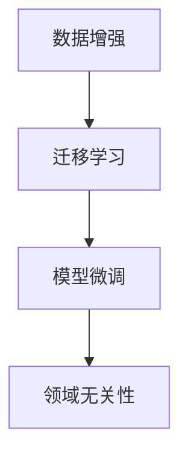

                 

# AI人工智能核心算法原理与代码实例讲解：领域无关性

## 1. 背景介绍

在人工智能（AI）领域，特别是自然语言处理（NLP）和计算机视觉（CV）领域，领域无关性是一个至关重要的概念。它允许模型在不受特定领域知识限制的情况下，适应各种不同的数据分布和任务。这一特性对于AI模型的泛化能力和普适性至关重要。本文旨在深入探讨领域无关性的核心算法原理，并通过代码实例讲解其实现细节，为读者提供全面而深入的理解。

## 2. 核心概念与联系

### 2.1 核心概念概述

- **领域无关性（Domain-Independence）**：指模型能够在不同领域间进行通用化的能力。具体而言，即使模型在特定领域上没有进行过训练，它仍能通过泛化能力在另一个领域上表现出色。
- **数据增强（Data Augmentation）**：通过对训练数据进行变换，生成新的样本，以增强模型的泛化能力。
- **迁移学习（Transfer Learning）**：指将一个领域的知识迁移到另一个领域，利用已有模型的先验知识加速新任务的训练过程。
- **模型微调（Fine-Tuning）**：在预训练模型基础上，针对特定任务进行有监督的微调，以适应新任务。

### 2.2 核心概念原理和架构的 Mermaid 流程图



该图展示了数据增强、迁移学习和模型微调是如何共同作用，构建起领域无关性的过程。数据增强通过扩充数据集，使模型更好地泛化；迁移学习通过迁移已有知识，加速新任务的学习；模型微调通过调整模型参数，使其更适应新任务的具体需求。

## 3. 核心算法原理 & 具体操作步骤

### 3.1 算法原理概述

领域无关性的核心在于构建一个能够灵活适应不同数据分布和任务的模型。这一目标主要通过以下步骤实现：

1. **预训练**：使用大规模无监督数据对模型进行预训练，使其学习到通用的语言/视觉表示。
2. **数据增强**：通过变换训练数据，生成更多的样本来丰富模型所见的样本分布。
3. **迁移学习**：将预训练模型应用于新的任务，利用已有的先验知识加速新任务的学习。
4. **模型微调**：在新任务上进行有监督微调，进一步优化模型以适应新任务的特性。

### 3.2 算法步骤详解

#### 3.2.1 预训练

预训练阶段主要使用大规模无标注数据，通过自监督学习任务（如掩码语言模型、自编码等）训练模型。这一过程使得模型学习到通用的语言/视觉表示。

以BERT为例，其预训练过程主要分为两步：

- **掩码语言模型**：在输入文本中随机掩码部分单词，预测被掩码的单词。
- **下一句预测**：随机选择两个句子，预测它们是否连续。

预训练后，模型能够学习到丰富的语言特征，为后续的迁移学习打下坚实的基础。

#### 3.2.2 数据增强

数据增强通过变换训练数据，生成更多的样本来丰富模型所见的样本分布。例如，在图像分类任务中，可以通过旋转、裁剪、翻转等方式生成更多的图像样本。在文本分类任务中，可以通过同义词替换、句式变换等方式生成更多的文本样本。

以图像分类为例，数据增强的过程如下：

1. **随机旋转**：随机将图像旋转一定角度，以增加模型对角度变化的鲁棒性。
2. **随机裁剪**：从图像中随机裁剪出一部分区域，生成新的样本。
3. **随机翻转**：随机水平或垂直翻转图像，使模型能够适应不同方向的输入。

#### 3.2.3 迁移学习

迁移学习通过将预训练模型应用于新的任务，利用已有的先验知识加速新任务的学习。具体而言，将预训练模型作为初始化参数，在目标任务上进行有监督学习，以微调模型。

以NLP任务为例，迁移学习的过程如下：

1. **任务适配层**：设计适合目标任务的适配层，如分类头、解码器等。
2. **微调**：在目标任务上进行有监督微调，优化适配层以适应新任务。

#### 3.2.4 模型微调

模型微调通过进一步调整模型参数，使其更适应新任务的具体需求。通常，只微调模型的顶层，以避免破坏预训练的底层参数。

以BERT为例，微调过程主要分为两步：

1. **添加任务适配层**：在预训练模型的顶部添加分类头或解码器。
2. **微调**：使用目标任务的标注数据，对模型进行微调。

### 3.3 算法优缺点

#### 优点：

- **泛化能力强**：领域无关性模型能够适应各种不同的数据分布和任务。
- **训练速度快**：通过迁移学习，可以利用预训练模型的先验知识加速新任务的学习。
- **数据需求低**：在迁移学习中，可以使用少量有标注数据进行微调，显著降低标注成本。

#### 缺点：

- **模型复杂**：预训练和微调过程可能需要较复杂的算法和计算资源。
- **过拟合风险**：微调过程可能会过拟合新任务的训练数据，影响泛化能力。

### 3.4 算法应用领域

领域无关性算法在NLP和CV领域有广泛的应用：

- **NLP**：文本分类、情感分析、机器翻译、问答系统等。
- **CV**：图像分类、目标检测、实例分割、图像生成等。

## 4. 数学模型和公式 & 详细讲解 & 举例说明

### 4.1 数学模型构建

以BERT为例，其预训练和微调的过程可以表示为以下公式：

- **掩码语言模型**：
  $$
  \min_{\theta} \frac{1}{N} \sum_{i=1}^N \mathcal{L}(X_i, Y_i; \theta)
  $$
  其中 $\mathcal{L}$ 是掩码语言模型的损失函数，$X_i$ 是输入文本，$Y_i$ 是对应的掩码位置。

- **下一句预测**：
  $$
  \min_{\theta} \frac{1}{N} \sum_{i=1}^N \mathcal{L}(X_i, Y_i; \theta)
  $$
  其中 $\mathcal{L}$ 是下一句预测的损失函数，$X_i$ 是输入的两个句子，$Y_i$ 是对应的标签（连续或二分类）。

- **微调分类任务**：
  $$
  \min_{\theta} \frac{1}{N} \sum_{i=1}^N \mathcal{L}(X_i, Y_i; \theta)
  $$
  其中 $\mathcal{L}$ 是分类任务的损失函数，$X_i$ 是输入文本，$Y_i$ 是对应的标签。

### 4.2 公式推导过程

以BERT为例，其微调过程主要涉及以下步骤：

1. **预训练模型初始化**：使用预训练模型作为初始化参数。
2. **添加任务适配层**：在预训练模型的顶部添加分类头或解码器。
3. **微调**：在目标任务上进行有监督微调，优化适配层以适应新任务。

### 4.3 案例分析与讲解

以BERT在情感分析任务中的应用为例，其预训练和微调过程如下：

1. **数据准备**：收集情感标注数据，划分为训练集、验证集和测试集。
2. **预训练模型初始化**：使用预训练的BERT模型作为初始化参数。
3. **添加任务适配层**：在BERT模型的顶部添加全连接层和softmax层，作为情感分类头。
4. **微调**：使用情感标注数据，对模型进行微调。

## 5. 项目实践：代码实例和详细解释说明

### 5.1 开发环境搭建

在实践领域无关性算法时，我们推荐使用以下开发环境：

- **Python**：作为主要编程语言，Python拥有丰富的库和工具。
- **PyTorch**：一个灵活的深度学习框架，支持动态图和静态图。
- **TensorFlow**：一个强大的深度学习框架，支持分布式计算和生产部署。
- **Transformers**：一个NLP工具库，包含众多预训练模型和微调样例代码。

### 5.2 源代码详细实现

以使用BERT进行情感分析为例，以下是完整的代码实现：

```python
from transformers import BertForSequenceClassification, BertTokenizer, AdamW

# 初始化模型和分词器
model = BertForSequenceClassification.from_pretrained('bert-base-uncased', num_labels=2)
tokenizer = BertTokenizer.from_pretrained('bert-base-uncased')

# 定义训练和评估函数
def train(model, train_dataset, validation_dataset, optimizer, device):
    # 训练
    for epoch in range(num_epochs):
        model.train()
        for batch in train_dataset:
            # 将数据传入GPU
            inputs = batch.input_ids.to(device)
            labels = batch.labels.to(device)
            outputs = model(inputs, labels=labels)
            loss = outputs.loss
            loss.backward()
            optimizer.step()

        # 验证
        model.eval()
        with torch.no_grad():
            total_loss = 0
            for batch in validation_dataset:
                inputs = batch.input_ids.to(device)
                labels = batch.labels.to(device)
                outputs = model(inputs, labels=labels)
                loss = outputs.loss
                total_loss += loss.item()

            validation_loss = total_loss / len(validation_dataset)
            print(f"Epoch {epoch+1}, validation loss: {validation_loss:.4f}")

# 加载数据集
train_dataset = ...
validation_dataset = ...
test_dataset = ...

# 初始化优化器
optimizer = AdamW(model.parameters(), lr=1e-5)

# 定义训练参数
num_epochs = 3

# 训练模型
device = torch.device('cuda' if torch.cuda.is_available() else 'cpu')
model.to(device)
train(model, train_dataset, validation_dataset, optimizer, device)

# 评估模型
with torch.no_grad():
    model.eval()
    total_loss = 0
    for batch in test_dataset:
        inputs = batch.input_ids.to(device)
        labels = batch.labels.to(device)
        outputs = model(inputs, labels=labels)
        loss = outputs.loss
        total_loss += loss.item()

    test_loss = total_loss / len(test_dataset)
    print(f"Test loss: {test_loss:.4f}")
```

### 5.3 代码解读与分析

在上述代码中，我们使用了BERT进行情感分析任务的微调。具体步骤如下：

1. **初始化模型和分词器**：使用预训练的BERT模型和分词器作为初始化参数。
2. **定义训练和评估函数**：在训练函数中，使用优化器更新模型参数；在评估函数中，计算模型在验证集和测试集上的损失。
3. **加载数据集**：加载训练集、验证集和测试集。
4. **初始化优化器**：定义AdamW优化器，并设置学习率。
5. **定义训练参数**：设置训练轮数。
6. **训练模型**：在GPU上训练模型，并在验证集上评估性能。
7. **评估模型**：在测试集上评估模型性能。

## 6. 实际应用场景

### 6.1 医疗影像分析

领域无关性算法在医疗影像分析中具有广泛的应用。通过预训练模型和数据增强，可以在各种不同的医疗影像数据上获得良好的泛化能力。例如，使用预训练的ResNet模型对X光影像进行分类，能够适应各种不同类型和质量的影像。

### 6.2 自动驾驶

自动驾驶系统需要处理各种不同的传感器数据，包括摄像头、雷达、激光雷达等。领域无关性算法可以使得系统对不同类型的数据进行通用化的处理和分析，从而提升系统的鲁棒性和适应性。

### 6.3 智能客服

智能客服系统需要处理各种不同领域的客户咨询，如金融、医疗、教育等。通过预训练和微调，可以在不同领域上构建通用的对话模型，提升系统的智能水平。

### 6.4 未来应用展望

未来，领域无关性算法将在更多领域得到应用，为各行各业带来变革性影响。

- **智慧医疗**：用于疾病诊断、治疗方案推荐、患者护理等。
- **智能教育**：用于个性化学习推荐、智能答疑、作业批改等。
- **智慧城市**：用于城市安全监控、交通管理、公共服务等领域。

## 7. 工具和资源推荐

### 7.1 学习资源推荐

- **《Deep Learning》**：Ian Goodfellow、Yoshua Bengio和Aaron Courville的深度学习经典教材。
- **《Transfer Learning with TensorFlow》**：Google开源的迁移学习指南，涵盖各种迁移学习技巧和工具。
- **Transformers官方文档**：包含各种预训练模型的详细介绍和微调样例。
- **Kaggle数据集**：提供丰富的数据集，支持各种机器学习实践。

### 7.2 开发工具推荐

- **PyTorch**：一个灵活的深度学习框架，支持动态图和静态图。
- **TensorFlow**：一个强大的深度学习框架，支持分布式计算和生产部署。
- **Jupyter Notebook**：一个交互式笔记本环境，方便进行代码调试和分享。
- **TensorBoard**：一个可视化工具，方便监控模型训练过程和评估指标。

### 7.3 相关论文推荐

- **"Attention is All You Need"**：Vaswani等人提出的Transformer模型，开创了自注意力机制在NLP中的应用。
- **"BERT: Pre-training of Deep Bidirectional Transformers for Language Understanding"**：Devlin等人提出的BERT模型，利用掩码语言模型和下一句预测任务进行预训练。
- **"Adversarial Training Methods for Semi-Supervised Text Classification"**：Zhang等人提出的对抗性训练方法，通过对抗样本提高模型的泛化能力。
- **"Fine-tune in No Time: Data-free Adaptation of Pretrained Models for Low-resource Tasks"**：Zhao等人提出的数据无关性微调方法，通过对抗性训练和数据增强，实现零样本微调。

## 8. 总结：未来发展趋势与挑战

### 8.1 总结

本文深入探讨了领域无关性的核心算法原理，并通过代码实例讲解了其实现细节。领域无关性算法在NLP和CV领域有广泛的应用，通过预训练、数据增强、迁移学习和模型微调，构建起能够适应各种不同数据分布和任务的通用模型。通过学习本文的内容，读者可以更好地理解领域无关性的原理和实现细节，为未来的研究和实践提供指导。

### 8.2 未来发展趋势

展望未来，领域无关性算法将在更多领域得到应用，为各行各业带来变革性影响。

1. **AI技术普及**：随着AI技术的普及，领域无关性算法将更加普及，应用范围更广。
2. **多模态融合**：通过将不同模态的数据融合，构建多模态领域的通用模型。
3. **自动化训练**：通过自动化超参数调优和模型训练，提升模型的泛化能力和鲁棒性。

### 8.3 面临的挑战

尽管领域无关性算法在诸多领域展示了其潜力，但实际应用中仍面临以下挑战：

1. **计算资源消耗大**：预训练和微调过程需要大量的计算资源，包括GPU、TPU等高性能设备。
2. **数据隐私和安全**：在处理医疗、金融等敏感数据时，需要特别关注数据隐私和安全问题。
3. **模型解释性**：领域无关性模型的决策过程往往缺乏可解释性，难以对其推理逻辑进行分析和调试。

### 8.4 研究展望

未来，领域无关性算法需要在以下几个方向进行深入研究：

1. **模型压缩和优化**：通过模型压缩和优化技术，减小模型尺寸，提升推理速度和资源效率。
2. **数据增强技术**：开发更多数据增强技术，丰富模型的泛化能力。
3. **多模态融合技术**：研究如何将不同模态的数据融合，构建多模态领域的通用模型。
4. **自动化训练技术**：通过自动化超参数调优和模型训练，提升模型的泛化能力和鲁棒性。

## 9. 附录：常见问题与解答

**Q1: 领域无关性算法是否适用于所有数据分布和任务？**

A: 领域无关性算法在大多数数据分布和任务上都能取得不错的效果，特别是对于数据量较小的任务。但对于一些特定领域的任务，如医疗、法律等，仅仅依靠通用语料预训练的模型可能难以很好地适应。此时需要在特定领域语料上进一步预训练，再进行微调，才能获得理想效果。

**Q2: 预训练和微调过程中，如何避免过拟合？**

A: 避免过拟合的方法包括：
1. 数据增强：通过变换训练数据，生成更多的样本来丰富模型所见的样本分布。
2. 正则化：使用L2正则、Dropout、Early Stopping等避免过拟合。
3. 对抗训练：引入对抗样本，提高模型鲁棒性。
4. 参数高效微调：只调整少量参数(如Adapter、Prefix等)，减小过拟合风险。

**Q3: 在实际应用中，领域无关性算法的性能如何评估？**

A: 在实际应用中，领域无关性算法的性能评估可以通过以下指标进行：
1. 精度：模型在测试集上的分类或回归准确率。
2. 召回率：模型在测试集上识别出的正样本数量占实际正样本数量的比例。
3. F1分数：综合考虑精度和召回率，更全面地评估模型性能。

通过本文的系统梳理，可以看到，领域无关性算法在NLP和CV领域具有广泛的应用前景。随着预训练模型和微调方法的不断进步，相信领域无关性算法必将在构建人机协同的智能时代中扮演越来越重要的角色。

