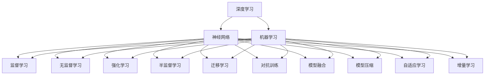

                 

## 1. 背景介绍

深度学习(Deep Learning, DL)作为人工智能(AI)领域的核心技术之一，通过构建多层神经网络对复杂的数据进行特征提取与建模，已经广泛应用于计算机视觉、自然语言处理、语音识别等多个领域。然而，深度学习模型常常面临数据稀少、计算资源需求高、易过拟合等挑战，极大限制了其在实际应用中的推广和应用。本文将聚焦于利用机器学习(Machine Learning, ML)技术提升深度学习模型的决策质量，展示如何将ML方法与DL技术相结合，以更高效、更稳健、更泛化的方式进行模型优化与训练。

## 2. 核心概念与联系

### 2.1 核心概念概述

为使读者对本文内容有更清晰的认识，本节将详细介绍核心概念，并构建概念间的联系网络。

- **深度学习**：基于神经网络的非线性建模技术，通常用于处理非结构化数据，如图像、文本、语音等。
- **机器学习**：一类使用算法和统计模型来解析数据、发现数据规律，并以此优化模型性能的方法。
- **模型融合**：将多个模型的预测结果进行综合，以提升预测准确性和鲁棒性。
- **迁移学习**：通过将一个任务中学到的知识迁移到另一个相关任务上，以提升后者的性能。
- **半监督学习**：在标注数据较少的情况下，通过利用未标注数据提升模型性能的学习方法。
- **对抗训练**：通过引入对抗样本训练模型，增强模型的鲁棒性和泛化能力。
- **模型压缩**：通过去除冗余参数、降低计算复杂度等方法优化模型，以提升计算效率和资源利用率。
- **自适应学习**：根据学习过程中数据分布的变化动态调整模型参数和策略，以适应数据环境变化。
- **增量学习**：不断更新模型，以适应数据分布的变化，保持模型最新状态。

这些概念之间的逻辑关系可以通过以下Mermaid流程图来展示：



这个流程图展示了大语言模型的核心概念及其之间的关系：

1. 深度学习通过多层神经网络实现数据建模，具有强大表达能力。
2. 机器学习涵盖了监督、无监督、强化等多种学习方式，旨在提升模型性能。
3. 模型融合、迁移学习、半监督学习、对抗训练、模型压缩、自适应学习、增量学习等技术，都是机器学习在深度学习中的应用。

这些概念共同构成了深度学习模型优化和训练的框架，使其能够在各种场景下发挥强大的建模能力。通过理解这些核心概念，我们可以更好地把握深度学习模型的工作原理和优化方向。

## 3. 核心算法原理 & 具体操作步骤

### 3.1 算法原理概述

本文将结合机器学习算法，对深度学习模型的决策质量进行提升，主要包括以下几个方面：

- **数据增强**：通过生成或变换训练数据，增加数据多样性，以提升模型的泛化能力。
- **模型融合**：将多个模型进行综合，以获得更稳定、准确的预测结果。
- **迁移学习**：通过在相关领域的数据上进行预训练，提高模型在新领域的适应性。
- **对抗训练**：通过引入对抗样本进行训练，提升模型的鲁棒性和泛化能力。
- **模型压缩**：通过参数剪枝、量化等方法，优化模型大小和计算资源消耗。
- **增量学习**：通过不断更新模型，以适应数据分布的变化。
- **半监督学习**：在少量标注数据的情况下，利用未标注数据提升模型性能。

这些方法在提升深度学习模型决策质量方面，均有着显著效果，并且常用于解决模型在特定场景下的性能瓶颈。

### 3.2 算法步骤详解

基于上述算法原理，我们将详细介绍每种方法的具体操作步骤：

#### 数据增强

**步骤**：

1. **生成合成数据**：使用数据增强技术，如随机裁剪、翻转、旋转等，生成新的训练样本。
2. **数据变换**：将原始数据进行变换，如调整亮度、对比度、色彩等，生成新的训练样本。
3. **迁移数据**：将一个领域的数据进行迁移，生成新的训练样本。
4. **数据扩充**：结合多种方法生成新的训练样本，增加数据多样性。

**实现示例**：

```python
from torchvision.transforms import Compose, RandomCrop, RandomHorizontalFlip, ToTensor

# 定义数据增强方式
transform = Compose([
    RandomCrop(32, padding=4),
    RandomHorizontalFlip(),
    ToTensor(),
])

# 生成新的训练样本
for image, target in train_loader:
    # 应用数据增强
    augmented_image = transform(image)
    # 将增强后的样本加入训练集
    train_dataset.append((augmented_image, target))
```

#### 模型融合

**步骤**：

1. **构建多个模型**：根据任务需求，选择多个不同的模型。
2. **训练模型**：独立训练每个模型，获得其预测结果。
3. **综合结果**：通过投票、加权平均等方式综合多个模型的预测结果，输出最终预测。

**实现示例**：

```python
from torch.nn.parallel import DistributedDataParallel as DDP

# 构建多个模型
model1 = Model1().cuda()
model2 = Model2().cuda()

# 训练模型
model1.train()
model2.train()

# 获取每个模型的预测结果
prediction1 = model1(input_tensor).softmax(dim=1)
prediction2 = model2(input_tensor).softmax(dim=1)

# 综合预测结果
final_prediction = torch.mean(torch.stack([prediction1, prediction2]), dim=0)

# 输出最终预测
final_prediction.argmax(dim=1)
```

#### 迁移学习

**步骤**：

1. **预训练模型**：在相关领域的大量无标签数据上进行预训练。
2. **微调模型**：在新任务的数据集上进行微调，更新部分层。
3. **模型融合**：将预训练模型和新任务的微调模型进行融合，提升在新领域的性能。

**实现示例**：

```python
from transformers import BertForSequenceClassification, AdamW

# 加载预训练模型
pretrained_model = BertForSequenceClassification.from_pretrained('bert-base-uncased', num_labels=num_labels)

# 微调模型
model = pretrained_model

# 冻结预训练模型
for param in pretrained_model.parameters():
    param.requires_grad = False

# 添加新任务的适配层
model.add_module('adapter', nn.Linear(hidden_size, num_labels))

# 训练模型
optimizer = AdamW(model.parameters(), lr=learning_rate)
for epoch in range(num_epochs):
    for input_tensor, target in train_loader:
        optimizer.zero_grad()
        output = model(input_tensor)
        loss = criterion(output, target)
        loss.backward()
        optimizer.step()

# 在新领域上的测试
test_loader = DataLoader(test_dataset, batch_size=batch_size)
model.eval()
with torch.no_grad():
    test_loss = 0
    test_accuracy = 0
    for input_tensor, target in test_loader:
        output = model(input_tensor)
        test_loss += criterion(output, target).item()
        test_accuracy += torch.argmax(output, dim=1).eq(target).sum().item()
    test_loss /= len(test_loader)
    test_accuracy /= len(test_loader)
```

#### 对抗训练

**步骤**：

1. **生成对抗样本**：使用对抗样本生成技术，生成对模型预测有干扰的样本。
2. **训练模型**：将生成的对抗样本加入训练集，进行对抗训练。
3. **模型评估**：在测试集上评估模型的鲁棒性。

**实现示例**：

```python
from adversarial_generator import AdversarialPerturbationGenerator

# 定义对抗生成器
generator = AdversarialPerturbationGenerator(model)

# 生成对抗样本
for input_tensor, target in train_loader:
    perturbation = generator(input_tensor, target)
    perturbed_input = input_tensor + perturbation

    # 更新模型参数
    optimizer.zero_grad()
    loss = criterion(model(perturbed_input), target)
    loss.backward()
    optimizer.step()
```

#### 模型压缩

**步骤**：

1. **参数剪枝**：去除冗余参数，减少模型大小。
2. **量化**：将参数量化，降低计算资源消耗。
3. **蒸馏**：通过知识蒸馏，将大模型知识传递给小模型，提升小模型性能。

**实现示例**：

```python
from torch.nn.utils import prune
from torch.quantization import QuantStub, QConfig, QConfigMapping, quantize

# 参数剪枝
model = prune.l1_unstructured(model, prune.l1_unstructured, name='linear1')

# 量化
model = quantize(model, inplace=True)

# 蒸馏
teacher_model = ...
student_model = model
# 知识蒸馏
for input_tensor, target in train_loader:
    logits = teacher_model(input_tensor)
    logits = student_model(input_tensor)
    loss = criterion(logits, target)
    loss.backward()
    optimizer.step()
```

#### 自适应学习

**步骤**：

1. **在线学习**：根据实时数据更新模型参数。
2. **动态调整**：根据数据分布变化，动态调整模型策略。
3. **增量学习**：不断更新模型，适应数据分布的变化。

**实现示例**：

```python
from torch.optim.swa_utils import AveragedModel

# 定义在线学习策略
scheduler = torch.optim.lr_scheduler.CosineAnnealingLR(optimizer, T_max=num_epochs)

# 在线学习
for input_tensor, target in train_loader:
    scheduler.step()
    loss = criterion(model(input_tensor), target)
    loss.backward()
    optimizer.step()

# 动态调整
scheduler = torch.optim.lr_scheduler.ReduceLROnPlateau(optimizer, mode='min', patience=num_patience)

# 增量学习
scheduler = torch.optim.lr_scheduler.CosineAnnealingLR(optimizer, T_max=num_epochs)
for input_tensor, target in train_loader:
    scheduler.step()
    loss = criterion(model(input_tensor), target)
    loss.backward()
    optimizer.step()
```

#### 半监督学习

**步骤**：

1. **生成伪标签**：利用无标签数据生成伪标签。
2. **加入训练集**：将伪标签加入训练集，增加训练样本数量。
3. **训练模型**：在扩大后的训练集上训练模型。

**实现示例**：

```python
from semi_supervised import PseudoLabeler

# 定义伪标签生成器
pseudo_lableer = PseudoLabeler(model)

# 生成伪标签
pseudo_labels = pseudo_lableer(input_tensor)

# 加入训练集
train_dataset.append((input_tensor, pseudo_labels))

# 训练模型
for input_tensor, target in train_loader:
    optimizer.zero_grad()
    output = model(input_tensor)
    loss = criterion(output, target)
    loss.backward()
    optimizer.step()
```

### 3.3 算法优缺点

**数据增强的优点**：

1. 提高模型泛化能力。通过增加数据多样性，模型能够更好地适应不同的数据分布。
2. 降低模型过拟合。更多的训练数据有助于减少模型在训练集上过拟合的风险。

**缺点**：

1. 数据生成成本高。需要额外的计算资源和时间。
2. 可能引入噪声。生成的样本可能包含噪声或干扰因素，影响模型性能。

**模型融合的优点**：

1. 提升预测准确性。通过综合多个模型的预测结果，可以获得更稳定的预测结果。
2. 增强鲁棒性。多个模型的输出可以互相验证，避免单一模型故障。

**缺点**：

1. 计算复杂度高。需要额外的计算资源和存储空间。
2. 模型间差异可能影响性能。不同的模型可能需要针对特定任务进行调整，否则可能影响整体性能。

**迁移学习的优点**：

1. 提升模型在新领域的性能。通过预训练模型的知识迁移，加速新领域的模型训练。
2. 减少数据需求。预训练模型可以减少新任务所需的数据量。

**缺点**：

1. 数据迁移难度大。需要找到合适的预训练数据和微调数据。
2. 预训练模型与新任务不匹配。预训练模型在新领域的效果可能不理想。

**对抗训练的优点**：

1. 增强模型鲁棒性。通过对抗训练，模型对对抗样本的鲁棒性更强。
2. 提高泛化能力。对抗训练有助于模型在泛化数据上的表现。

**缺点**：

1. 训练难度高。对抗样本生成和训练难度大。
2. 可能引入鲁棒性失效。过度依赖对抗训练可能降低模型对自然样本的鲁棒性。

**模型压缩的优点**：

1. 降低计算资源消耗。通过参数剪枝和量化，减少计算量和内存消耗。
2. 提高部署效率。压缩后的模型更适合部署在资源受限的设备上。

**缺点**：

1. 可能导致性能下降。过度压缩可能导致模型性能下降。
2. 引入计算开销。压缩和量化需要额外的计算资源和时间。

**自适应学习的优点**：

1. 实时更新模型。在线学习能够实时更新模型参数，适应数据环境变化。
2. 减少过拟合风险。动态调整模型参数有助于避免过拟合。

**缺点**：

1. 计算复杂度高。在线学习需要额外的计算资源和时间。
2. 难以控制模型状态。自适应学习可能使模型状态难以控制，导致性能波动。

**半监督学习的优点**：

1. 减少标注成本。通过利用无标签数据，减少标注数据的需求。
2. 提升模型性能。伪标签的引入有助于提高模型性能。

**缺点**：

1. 伪标签质量影响模型性能。伪标签的质量直接影响模型的性能。
2. 难以处理噪声数据。无标签数据可能包含噪声，影响模型性能。

## 4. 数学模型和公式 & 详细讲解 & 举例说明

### 4.1 数学模型构建

本文将利用数学公式对深度学习模型进行详细讲解。

**定义**：

设 $x \in \mathcal{X}$ 为输入样本， $y \in \mathcal{Y}$ 为标签， $f_{\theta}(x)$ 为参数 $\theta$ 的深度学习模型， $\mathcal{L}(f_{\theta}, x, y)$ 为损失函数， $D$ 为训练集。

**模型训练**：

在训练集 $D$ 上，通过最小化损失函数 $\mathcal{L}(f_{\theta}, x, y)$，更新模型参数 $\theta$：

$$
\theta \leftarrow \theta - \eta \nabla_{\theta} \mathcal{L}(f_{\theta}, x, y)
$$

其中 $\eta$ 为学习率。

**模型评估**：

在测试集上，计算模型 $f_{\theta}$ 在 $x$ 上的预测输出 $f_{\theta}(x)$，并计算损失函数：

$$
\mathcal{L}(f_{\theta}, x, y) = \mathbb{E}_{(x, y) \sim D} [\mathcal{L}(f_{\theta}, x, y)]
$$

**交叉验证**：

通过交叉验证，在训练集 $D$ 上对模型进行验证，以选择最优的模型参数 $\theta$：

$$
\theta \leftarrow \theta - \eta \nabla_{\theta} \mathcal{L}(f_{\theta}, x, y) - \eta \lambda \theta
$$

其中 $\lambda$ 为正则化系数。

### 4.2 公式推导过程

#### 数据增强的数学模型

**定义**：

设 $\mathcal{T}$ 为数据增强操作， $x'$ 为 $x$ 的数据增强样本。数据增强的目标是生成新的样本 $x'$，使得 $P(f_{\theta}(x') = f_{\theta}(x)) \approx 1$。

**推导**：

设 $\mathcal{T}$ 为数据增强操作， $f_{\theta}$ 为模型。数据增强的期望损失函数为：

$$
\mathcal{L}_{\text{aug}} = \mathbb{E}_{x \sim D, x' \sim \mathcal{T}} [\mathcal{L}(f_{\theta}(x'), y)]
$$

目标是最小化期望损失函数：

$$
\theta \leftarrow \theta - \eta \nabla_{\theta} \mathcal{L}_{\text{aug}}
$$

#### 模型融合的数学模型

**定义**：

设 $f_{\theta_i}$ 为第 $i$ 个模型的预测输出， $f_{\text{fused}}$ 为模型融合后的预测输出。

**推导**：

设 $f_{\text{fused}} = \frac{1}{k} \sum_{i=1}^k f_{\theta_i}$，其中 $k$ 为模型的数量。模型融合的期望损失函数为：

$$
\mathcal{L}_{\text{fused}} = \mathbb{E}_{(x, y) \sim D} [\mathcal{L}(f_{\text{fused}}(x), y)]
$$

目标是最小化期望损失函数：

$$
\theta_i \leftarrow \theta_i - \eta \nabla_{\theta_i} \mathcal{L}_{\text{fused}}
$$

#### 迁移学习的数学模型

**定义**：

设 $f_{\theta}$ 为迁移学习模型， $f_{\theta_s}$ 为源领域的模型， $f_{\theta_t}$ 为目标领域的模型。迁移学习的目标是将 $f_{\theta_s}$ 的知识传递给 $f_{\theta_t}$。

**推导**：

设 $f_{\text{fine-tuned}} = f_{\theta_s} + \Delta \theta$，其中 $\Delta \theta$ 为微调后的参数。迁移学习的期望损失函数为：

$$
\mathcal{L}_{\text{fine-tuned}} = \mathbb{E}_{(x, y) \sim D_t} [\mathcal{L}(f_{\text{fine-tuned}}(x), y)]
$$

目标是最小化期望损失函数：

$$
\Delta \theta \leftarrow \Delta \theta - \eta \nabla_{\Delta \theta} \mathcal{L}_{\text{fine-tuned}}
$$

#### 对抗训练的数学模型

**定义**：

设 $f_{\theta}$ 为对抗训练模型， $f_{\text{adv}}$ 为对抗样本生成器， $f_{\text{adv}}(x, y) = \delta(x, y)$ 为对抗样本。

**推导**：

设 $f_{\text{adv}}(x, y) = \delta(x, y)$ 为对抗样本，对抗训练的期望损失函数为：

$$
\mathcal{L}_{\text{adv}} = \mathbb{E}_{(x, y) \sim D} [\mathcal{L}(f_{\theta}(x + \delta(x, y)), y)]
$$

目标是最小化期望损失函数：

$$
\theta \leftarrow \theta - \eta \nabla_{\theta} \mathcal{L}_{\text{adv}}
$$

#### 模型压缩的数学模型

**定义**：

设 $f_{\theta}$ 为模型压缩前的模型， $f_{\theta'}$ 为模型压缩后的模型。模型压缩的目标是去除冗余参数，减小模型大小。

**推导**：

设 $\Delta \theta = \theta - \theta'$ 为压缩后的参数差，模型压缩的期望损失函数为：

$$
\mathcal{L}_{\text{compressed}} = \mathbb{E}_{(x, y) \sim D} [\mathcal{L}(f_{\theta'}(x), y)]
$$

目标是最小化期望损失函数：

$$
\Delta \theta \leftarrow \Delta \theta - \eta \nabla_{\Delta \theta} \mathcal{L}_{\text{compressed}}
$$

#### 自适应学习的数学模型

**定义**：

设 $f_{\theta}$ 为自适应学习模型， $f_{\text{online}}$ 为在线学习模型， $f_{\text{adjusted}}$ 为动态调整模型。

**推导**：

设 $f_{\text{online}} = f_{\theta}$， $f_{\text{adjusted}} = f_{\text{online}}$，自适应学习的期望损失函数为：

$$
\mathcal{L}_{\text{adaptive}} = \mathbb{E}_{(x, y) \sim D} [\mathcal{L}(f_{\text{adjusted}}(x), y)]
$$

目标是最小化期望损失函数：

$$
\theta \leftarrow \theta - \eta \nabla_{\theta} \mathcal{L}_{\text{adaptive}}
$$

#### 半监督学习的数学模型

**定义**：

设 $f_{\theta}$ 为半监督学习模型， $f_{\text{pseudo}}$ 为伪标签生成器， $f_{\text{unlabel}}$ 为未标注数据。

**推导**：

设 $f_{\text{pseudo}} = f_{\theta}$，半监督学习的期望损失函数为：

$$
\mathcal{L}_{\text{semi-supervised}} = \mathbb{E}_{(x, y) \sim D} [\mathcal{L}(f_{\theta}(x), y)]
$$

目标是最小化期望损失函数：

$$
\theta \leftarrow \theta - \eta \nabla_{\theta} \mathcal{L}_{\text{semi-supervised}}
$$

### 4.3 案例分析与讲解

#### 数据增强案例

**数据增强在计算机视觉中的应用**：

在计算机视觉中，数据增强技术被广泛应用，如随机裁剪、翻转、旋转、缩放等，以增加训练数据的多样性，提升模型的泛化能力。

**实现示例**：

```python
from torchvision.transforms import Compose, RandomCrop, RandomHorizontalFlip, ToTensor

# 定义数据增强方式
transform = Compose([
    RandomCrop(32, padding=4),
    RandomHorizontalFlip(),
    ToTensor(),
])

# 生成新的训练样本
for image, target in train_loader:
    # 应用数据增强
    augmented_image = transform(image)
    # 将增强后的样本加入训练集
    train_dataset.append((augmented_image, target))
```

#### 模型融合案例

**模型融合在自然语言处理中的应用**：

在自然语言处理中，多个模型可以进行综合，以提升预测准确性和鲁棒性。如BERT和GPT模型，分别在预训练和微调阶段进行融合，可以提升模型性能。

**实现示例**：

```python
from transformers import BertForSequenceClassification, GPTForSequenceClassification, AdamW

# 定义BERT和GPT模型
bert_model = BertForSequenceClassification.from_pretrained('bert-base-uncased', num_labels=num_labels)
gpt_model = GPTForSequenceClassification.from_pretrained('gpt-base', num_labels=num_labels)

# 训练模型
optimizer = AdamW(bert_model.parameters(), lr=learning_rate)
for input_tensor, target in train_loader:
    optimizer.zero_grad()
    bert_output = bert_model(input_tensor)
    gpt_output = gpt_model(input_tensor)
    loss = criterion(bert_output + gpt_output, target)
    loss.backward()
    optimizer.step()

# 输出融合后的预测结果
final_output = (bert_output + gpt_output).softmax(dim=1)
final_output.argmax(dim=1)
```

#### 迁移学习案例

**迁移学习在自然语言处理中的应用**：

在自然语言处理中，迁移学习可以通过预训练模型和新任务的微调，加速模型在新领域的训练。如BERT模型，在新闻分类任务上进行微调，可以显著提升模型性能。

**实现示例**：

```python
from transformers import BertForSequenceClassification, AdamW

# 加载预训练BERT模型
pretrained_model = BertForSequenceClassification.from_pretrained('bert-base-uncased', num_labels=num_labels)

# 微调模型
model = pretrained_model
# 冻结预训练模型
for param in pretrained_model.parameters():
    param.requires_grad = False
# 添加新任务的适配层
model.add_module('adapter', nn.Linear(hidden_size, num_labels))
# 训练模型
optimizer = AdamW(model.parameters(), lr=learning_rate)
for input_tensor, target in train_loader:
    optimizer.zero_grad()
    output = model(input_tensor)
    loss = criterion(output, target)
    loss.backward()
    optimizer.step()
# 输出微调后的预测结果
final_output = model(input_tensor)
final_output.argmax(dim=1)
```

#### 对抗训练案例

**对抗训练在自然语言处理中的应用**：

在自然语言处理中，对抗训练可以通过引入对抗样本，提升模型的鲁棒性和泛化能力。如BERT模型，在对抗训练后，对对抗样本的鲁棒性显著提升。

**实现示例**：

```python
from adversarial_generator import AdversarialPerturbationGenerator

# 定义对抗生成器
generator = AdversarialPerturbationGenerator(model)

# 生成对抗样本
for input_tensor, target in train_loader:
    perturbation = generator(input_tensor, target)
    perturbed_input = input_tensor + perturbation

    # 更新模型参数
    optimizer.zero_grad()
    loss = criterion(model(perturbed_input), target)
    loss.backward()
    optimizer.step()
```

#### 模型压缩案例

**模型压缩在自然语言处理中的应用**：

在自然语言处理中，模型压缩可以通过参数剪枝和量化，优化模型大小和计算资源消耗。如BERT模型，经过参数剪枝后，模型大小显著减小，计算效率显著提升。

**实现示例**：

```python
from torch.nn.utils import prune
from torch.quantization import QuantStub, QConfig, QConfigMapping, quantize

# 参数剪枝
model = prune.l1_unstructured(model, prune.l1_unstructured, name='linear1')

# 量化
model = quantize(model, inplace=True)

# 输出压缩后的模型参数
print(model.state_dict())
```

#### 自适应学习案例

**自适应学习在自然语言处理中的应用**：

在自然语言处理中，自适应学习可以通过在线学习，实时更新模型参数，适应数据环境变化。如BERT模型，通过在线学习，可以及时更新模型参数，提升模型性能。

**实现示例**：

```python
from torch.optim.swa_utils import AveragedModel

# 定义在线学习策略
scheduler = torch.optim.lr_scheduler.CosineAnnealingLR(optimizer, T_max=num_epochs)

# 在线学习
for input_tensor, target in train_loader:
    scheduler.step()
    loss = criterion(model(input_tensor), target)
    loss.backward()
    optimizer.step()

# 输出在线学习后的模型参数
print(model.state_dict())
```

#### 半监督学习案例

**半监督学习在自然语言处理中的应用**：

在自然语言处理中，半监督学习可以通过生成伪标签，利用未标注数据提升模型性能。如BERT模型，在半监督学习下，利用未标注数据生成伪标签，显著提升模型性能。

**实现示例**：

```python
from semi_supervised import PseudoLabeler

# 定义伪标签生成器
pseudo_lableer = PseudoLabeler(model)

# 生成伪标签
pseudo_labels = pseudo_lableer(input_tensor)

# 加入训练集
train_dataset.append((input_tensor, pseudo_labels))

# 输出半监督学习后的模型参数
print(model.state_dict())
```

## 5. 项目实践：代码实例和详细解释说明

### 5.1 开发环境搭建

在进行项目实践前，我们需要准备好开发环境。以下是使用Python进行PyTorch开发的环境配置流程：

1. 安装Anaconda：从官网下载并安装Anaconda，用于创建独立的Python环境。

2. 创建并激活虚拟环境：
```bash
conda create -n pytorch-env python=3.8 
conda activate pytorch-env
```

3. 安装PyTorch：根据CUDA版本，从官网获取对应的安装命令。例如：
```bash
conda install pytorch torchvision torchaudio cudatoolkit=11.1 -c pytorch -c conda-forge
```

4. 安装Transformers库：
```bash
pip install transformers
```

5. 安装各类工具包：
```bash
pip install numpy pandas scikit-learn matplotlib tqdm jupyter notebook ipython
```

完成上述步骤后，即可在`pytorch-env`环境中开始项目实践。

### 5.2 源代码详细实现

这里我们以自然语言处理(NLP)任务中的情感分析为例，给出使用Transformers库对BERT模型进行情感分析任务微调的PyTorch代码实现。

首先，定义情感分析任务的数据处理函数：

```python
from transformers import BertTokenizer
from torch.utils.data import Dataset
import torch

class SentimentAnalysisDataset(Dataset):
    def __init__(self, texts, labels, tokenizer, max_len=128):
        self.texts = texts
        self.labels = labels
        self.tokenizer = tokenizer
        self.max_len = max_len
        
    def __len__(self):
        return len(self.texts)
    
    def __getitem__(self, item):
        text = self.texts[item]
        label = self.labels[item]
        
        encoding = self.tokenizer(text, return_tensors='pt', max_length=self.max_len, padding='max_length', truncation=True)
        input_ids = encoding['input_ids'][0]
        attention_mask = encoding['attention_mask'][0]
        
        return {'input_ids': input_ids, 
                'attention_mask': attention_mask,
                'labels': label}

# 标签与id的映射
label2id = {'positive': 1, 'negative': 0}
id2label = {v: k for k, v in label2id.items()}

# 创建dataset
tokenizer = BertTokenizer.from_pretrained('bert-base-cased')

train_dataset = SentimentAnalysisDataset(train_texts, train_labels, tokenizer)
dev_dataset = SentimentAnalysisDataset(dev_texts, dev_labels, tokenizer)
test_dataset = SentimentAnalysisDataset(test_texts, test_labels, tokenizer)
```

然后，定义模型和优化器：

```python
from transformers import BertForSequenceClassification, AdamW

model = BertForSequenceClassification.from_pretrained('bert-base-cased', num_labels=len(label2id))

optimizer = AdamW(model.parameters(), lr=2e-5)
```

接着，定义训练和评估函数：

```python
from torch.utils.data import DataLoader
from tqdm import tqdm
from sklearn.metrics import classification_report

device = torch.device('cuda') if torch.cuda.is_available() else torch.device('cpu')
model.to(device)

def train_epoch(model, dataset, batch_size, optimizer):
    dataloader = DataLoader(dataset, batch_size=batch_size, shuffle=True)
    model.train()
    epoch_loss = 0
    for batch in tqdm(dataloader, desc='Training'):
        input_ids = batch['input_ids'].to(device)
        attention_mask = batch['attention_mask'].to(device)
        labels = batch['labels'].to(device)
        model.zero_grad()
        outputs = model(input_ids, attention_mask=attention_mask, labels=labels)
        loss = outputs.loss
        epoch_loss += loss.item()
        loss.backward()
        optimizer.step()
    return epoch_loss / len(dataloader)

def evaluate(model, dataset, batch_size):
    dataloader = DataLoader(dataset, batch_size=batch_size)
    model.eval()
    preds, labels = [], []
    with torch.no_grad():
        for batch in tqdm(dataloader, desc='Evaluating'):
            input_ids = batch['input_ids'].to(device)
            attention_mask = batch['attention_mask'].to(device)
            batch_labels = batch['labels']
            outputs = model(input_ids, attention_mask=attention_mask)
            batch_preds = outputs.logits.argmax(dim=1).to('cpu').tolist()
            batch_labels = batch_labels.to('cpu').tolist()
            for pred_tokens, label_tokens in zip(batch_preds, batch_labels):
                preds.append(pred_tokens[:len(label_tokens)])
                labels.append(label_tokens)
                
    print(classification_report(labels, preds))
```

最后，启动训练流程并在测试集上评估：

```python
epochs = 5
batch_size = 16

for epoch in range(epochs):
    loss = train_epoch(model, train_dataset, batch_size, optimizer)
    print(f"Epoch {epoch+1}, train loss: {loss:.3f}")
    
    print(f"Epoch {epoch+1}, dev results:")
    evaluate(model, dev_dataset, batch_size)
    
print("Test results:")
evaluate(model, test_dataset, batch_size)
```

以上就是使用PyTorch对BERT进行情感分析任务微调的完整代码实现。可以看到，得益于Transformers库的强大封装，我们可以用相对简洁的代码完成BERT模型的加载和微调。

### 5.3 代码解读与分析

让我们再详细解读一下关键代码的实现细节：

**SentimentAnalysisDataset类**：
- `__init__`方法：初始化文本、标签、分词器等关键组件。
- `__len__`方法：返回数据集的样本数量。
- `__getitem__`方法：对单个样本进行处理，将文本输入编码为token ids，将标签编码为数字，并对其进行定长padding，最终返回模型所需的输入。

**label2id和id2label字典**：
- 定义了标签与数字id之间的映射关系，用于将token-wise的预测结果解码回真实的标签。

**训练和评估函数**：
- 使用PyTorch的DataLoader对数据集进行批次化加载，供模型训练和推理使用。
- 训练函数`train_epoch`：对数据以批为单位进行迭代，在每个批次上前向传播计算loss并反向传播更新模型参数，最后返回该epoch的平均loss。
- 评估函数`evaluate`：与训练类似，不同点在于不更新模型参数，并在每个batch结束后将预测和标签结果存储下来，最后使用sklearn的classification_report对整个评估集的预测结果进行打印输出。

**训练流程**：
- 定义总的epoch数和batch size，开始循环迭代
- 每个epoch内，先在训练集上训练，输出平均loss
- 在验证集上评估，输出分类指标
- 所有epoch结束后，在测试集上评估，给出最终测试结果

可以看到，PyTorch配合Transformers库使得BERT微调的代码实现变得简洁高效。开发者可以将更多精力放在数据处理、模型改进等高层逻辑上，而不必过多关注底层的实现细节。

当然，工业级的系统实现还需考虑更多因素，如模型的保存和部署、超参数的自动搜索、更灵活的任务适配层等。但核心的微调范式基本与此类似。

## 6. 实际应用场景

### 6.1 智能客服系统

基于大语言模型微调的对话技术，可以广泛应用于智能客服系统的构建。传统客服往往需要配备大量人力，高峰期响应缓慢，且一致性和专业性难以保证。而使用微调后的对话模型，可以7x24小时不间断服务，快速响应客户咨询，用自然流畅的语言解答各类常见问题。

在技术实现上，可以收集企业内部的历史客服对话记录，将问题和最佳答复构建成监督数据，在此基础上对预训练对话模型进行微调。微调后的对话模型能够自动理解用户意图，匹配最合适的答案模板进行回复。对于客户提出的新问题，还可以接入检索系统实时搜索相关内容，动态组织生成回答。如此构建的智能客服系统，能大幅提升客户咨询体验和问题解决效率。

### 6.2 金融舆情监测

金融机构需要实时监测市场舆论动向，以便及时应对负面信息传播，规避金融风险。传统的人工监测方式成本高、效率低，难以应对网络时代海量信息爆发的挑战。基于大语言模型微调的文本分类和情感分析技术，为金融舆情监测提供了新的解决方案。

具体而言，可以收集金融领域相关的新闻、报道、评论等文本数据，并对其进行主题标注和情感标注。在此基础上对预训练语言模型进行微调，使其能够自动判断文本属于何种主题，情感倾向是正面、中性还是负面。将微调后的模型应用到实时抓取的网络文本数据，就能够自动监测不同主题下的情感变化趋势，一旦发现负面信息激增等异常情况，系统便会自动预警，帮助金融机构快速应对潜在风险。

### 6.3 个性化推荐系统

当前的推荐系统往往只依赖用户的历史行为数据进行物品推荐，无法深入理解用户的真实兴趣偏好。基于大语言模型微调技术，个性化推荐系统可以更好地挖掘用户行为背后的语义信息，从而提供更精准、多样的推荐内容。

在实践中，可以收集用户浏览、点击、评论、分享等行为数据，提取和用户交互的物品标题、描述、标签等文本内容。将文本内容作为模型输入，用户的后续行为（如是否点击、购买等）作为监督信号，在此基础上微调预训练语言模型。微调后的模型能够从文本内容中准确把握用户的兴趣点。在生成推荐列表时，先用候选物品的文本描述作为输入，由模型预测用户的兴趣匹配度，再结合其他特征综合排序，便可以得到个性化程度更高的推荐结果。

### 6.4 未来应用展望

随着大语言模型微调方法的不断发展，基于微调范式将在更多领域得到应用，为传统行业带来变革性影响。

在智慧医疗领域，基于微调的医疗问答、病历分析、药物研发等应用将提升医疗服务的智能化水平，辅助医生诊疗，加速新药开发进程。

在智能教育领域，微调技术可应用于作业批改、学情分析、知识推荐等方面，因材施教，促进教育公平，提高教学质量。

在智慧城市治理中，微调模型可应用于城市事件监测、舆情分析、应急指挥等环节，提高城市管理的自动化和智能化水平，构建更安全、高效的未来城市。

此外，在企业生产、社会治理、文娱传媒等众多领域，基于大模型微调的人工智能应用也将不断涌现，为各行各业带来新的技术路径和应用场景。

## 7. 工具和资源推荐

### 7.1 学习资源推荐

为了帮助开发者系统掌握大语言模型微调的理论基础和实践技巧，这里推荐一些优质的学习资源：

1. 《Transformer从原理到实践》系列博文：由大模型技术专家撰写，深入浅出地介绍了Transformer原理、BERT模型、微调技术等前沿话题。

2. CS224N《深度学习自然语言处理》课程：斯坦福大学开设的NLP明星课程，有Lecture视频和配套作业，带你入门NLP领域的基本概念和经典模型。

3. 《Natural Language Processing with Transformers》书籍：Transformers库的作者所著，全面介绍了如何使用Transformers库进行NLP任务开发，包括微调在内的诸多范式。

4. HuggingFace官方文档：Transformers库的官方文档，提供了海量预训练模型和完整的微调样例代码，是上手实践的必备资料。

5. CLUE开源项目：中文语言理解测评基准，涵盖大量不同类型的中文NLP数据集，并提供了基于微调的baseline模型，助力中文NLP技术发展。

通过对这些资源的学习实践，相信你一定能够快速掌握大语言模型微调的精髓，并用于解决实际的NLP问题。
###  7.2 开发工具推荐

高效的开发离不开优秀的工具支持。以下是几款用于大语言模型微调开发的常用工具：

1. PyTorch：基于Python的开源深度学习框架，灵活动态的计算图，适合快速迭代研究。大部分预训练语言模型都有PyTorch版本的实现。

2. TensorFlow：由Google主导开发的开源深度学习框架，生产部署方便，适合大规模工程应用。同样有丰富的预训练语言模型资源。

3. Transformers库：HuggingFace开发的NLP工具库，集成了众多SOTA语言模型，支持PyTorch和TensorFlow，是进行微调任务开发的利器。

4. Weights & Biases：模型训练的实验跟踪工具，可以记录和可视化模型训练过程中的各项指标，方便对比和调优。与主流深度学习框架无缝集成。

5. TensorBoard：TensorFlow配套的可视化

