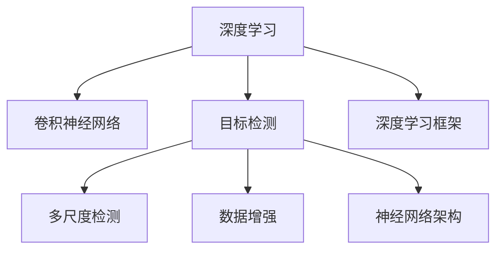

                 

# AI人工智能深度学习算法：在部件检测中的应用

> 关键词：深度学习, 部件检测, 目标检测, 神经网络, CNN, 特征提取, 卷积层, 特征池化, 数据增强, 训练, 验证, 测试, 深度学习框架, TensorFlow, PyTorch, YOLO, SSD, Faster R-CNN, 多尺度检测, 硬件加速

## 1. 背景介绍

### 1.1 问题由来
随着计算机视觉技术的不断进步，计算机对视觉数据的处理能力越来越强，逐渐能够理解并处理更复杂、更细粒度的视觉任务，如部件检测。部件检测是指识别和定位图像中的特定部件，例如汽车、手机、机器人等物体上的小部件，例如车窗、显示屏、按钮等。传统的计算机视觉方法如SIFT、SURF等局部特征描述符已经无法满足大规模、高精度的部件检测任务需求。深度学习算法，特别是卷积神经网络（CNN）在图像分类和目标检测任务上的优异表现，使其成为部件检测的首选工具。

### 1.2 问题核心关键点
部件检测的核心在于准确识别图像中的小部件，并定位其在图像中的位置。主要解决的核心问题包括：
1. **目标尺寸差异大**：部件尺寸不一，从微小的像素级别到图像级别的尺寸都有可能，需要通过多尺度检测方法处理。
2. **目标数量未知**：同一图像中可能存在多个部件，且数量不确定，需要算法能够检测多个目标。
3. **目标类别多样**：部件种类繁多，需要算法具备强大的类别区分能力。
4. **遮挡问题**：部件可能被其他物体遮挡，需要通过算法对遮挡情况进行判断。
5. **数据多样性**：不同场景和光照条件下的图像可能具有不同的特征，需要算法具备对不同数据环境的适应能力。

## 2. 核心概念与联系

### 2.1 核心概念概述

为更好地理解深度学习在部件检测中的应用，本节将介绍几个密切相关的核心概念：

- **深度学习**：一种基于神经网络（Neural Networks）的机器学习方法，通过多层神经网络进行复杂的数据表示和特征学习。深度学习在图像分类、目标检测、语音识别等任务上取得了突破性进展。
- **卷积神经网络（CNN）**：一种广泛应用于图像处理和计算机视觉任务中的深度神经网络结构，通过卷积层（Convolutional Layers）提取图像特征，通过池化层（Pooling Layers）减少特征维度，最终通过全连接层（Fully Connected Layers）进行分类或回归。
- **目标检测**：计算机视觉中的经典任务，旨在检测图像中的物体并标记其边界框（Bounding Boxes）。常见方法包括区域提议方法（Region Proposal Methods）和单阶段方法（Single-shot Methods）。
- **多尺度检测**：为了处理不同尺寸的部件，需要在图像的不同尺度和尺度比率下进行检测。常用的多尺度方法包括多尺度滑动窗口（Multi-Scale Sliding Windows）和多尺度特征融合（Multi-Scale Feature Fusion）。
- **数据增强**：通过随机变换图像数据，如翻转、旋转、裁剪等，生成更多训练样本，提高模型的鲁棒性和泛化能力。
- **神经网络架构**：如YOLO（You Only Look Once）、SSD（Single Shot MultiBox Detector）、Faster R-CNN（Faster Region-based Convolutional Neural Networks）等，是目标检测任务中的重要组件，对模型的性能有着决定性影响。
- **深度学习框架**：如TensorFlow、PyTorch等，提供强大的工具和环境支持，方便深度学习模型的开发和训练。

这些核心概念之间的逻辑关系可以通过以下Mermaid流程图来展示：



这个流程图展示了大语言模型的核心概念及其之间的关系：

1. 深度学习通过神经网络进行数据表示和特征学习。
2. 卷积神经网络用于图像特征提取。
3. 目标检测旨在检测图像中的物体并标记边界框。
4. 多尺度检测用于处理不同尺寸的部件。
5. 数据增强提高模型鲁棒性。
6. 神经网络架构是目标检测任务中的关键组件。
7. 深度学习框架提供必要的工具和环境支持。

这些概念共同构成了深度学习在部件检测中的应用框架，使其能够在各种场景下发挥强大的视觉处理能力。通过理解这些核心概念，我们可以更好地把握深度学习在部件检测中的应用原理和优化方向。

## 3. 核心算法原理 & 具体操作步骤
### 3.1 算法原理概述

深度学习在部件检测中的应用，主要通过卷积神经网络（CNN）和目标检测算法实现。核心算法原理如下：

- **特征提取**：卷积神经网络通过多层卷积和池化操作，将输入图像转化为高维特征表示。
- **候选框提取**：区域提议方法或单阶段方法生成候选目标框。
- **目标分类**：使用全连接层或附加分类器对候选框内的对象进行分类。
- **目标回归**：对候选框的位置进行调整，使其更加精确。
- **非极大值抑制**：去除重叠的高置信度候选框，只保留最可能的目标。

### 3.2 算法步骤详解

深度学习在部件检测中的应用步骤包括：

**Step 1: 准备数据集**
- 收集标注的部件检测数据集，包括图像和其对应的边界框和类别标签。数据集需涵盖多样化的场景、光照和角度条件。
- 对数据集进行预处理，如归一化、缩放等。

**Step 2: 设计模型架构**
- 选择或设计适合的神经网络架构，如YOLO、SSD、Faster R-CNN等。
- 设计数据增强策略，如随机旋转、翻转、裁剪等。

**Step 3: 训练模型**
- 使用数据增强和预处理后的训练集，训练深度学习模型。
- 设置合适的超参数，如学习率、批大小、迭代轮数等。
- 使用验证集监控模型性能，调整超参数。

**Step 4: 测试和评估**
- 在测试集上评估模型性能，如平均精度（mAP）、精度-召回率曲线（PR曲线）等。
- 根据评估结果，调整模型或重新训练。

**Step 5: 部署和应用**
- 将训练好的模型部署到实际应用场景中，如机器人部件检测、工业自动化等。
- 实时检测输入图像，并返回检测结果。

### 3.3 算法优缺点

深度学习在部件检测中的应用，具有以下优点：
1. 准确率高：通过多层次的特征提取和分类器设计，能够识别和定位小型部件。
2. 适应性强：通过数据增强和多尺度检测，对不同尺寸、不同角度的部件都能良好检测。
3. 泛化能力强：大规模数据集训练使得模型能够适应各种环境。

同时，也存在一些缺点：
1. 计算量大：需要大量的计算资源进行训练和推理。
2. 数据依赖性强：需要高质量的标注数据，数据采集成本高。
3. 模型复杂度高：设计复杂的神经网络架构，调试难度大。
4. 鲁棒性有待提升：面对光照、遮挡等干扰因素，模型的鲁棒性仍需加强。

### 3.4 算法应用领域

深度学习在部件检测中的应用，已经广泛应用于多个领域，例如：

- 工业自动化：检测机器设备上的零部件，保障生产过程的稳定性和安全性。
- 机器人视觉：在机器人的导航、操作中识别和定位部件，提升机器人智能化水平。
- 医疗影像：在X光、CT等影像中检测器官、肿瘤等部件，辅助诊断和治疗。
- 安防监控：检测监控图像中的可疑部件，如武器、爆炸物等，提高安全防范能力。
- 自动驾驶：检测道路上的交通标志、交通信号等部件，保障自动驾驶系统的安全运行。

除了上述这些经典应用外，深度学习在部件检测方面的潜力还在不断发掘，未来将在更多场景中发挥重要作用。

## 4. 数学模型和公式 & 详细讲解 & 举例说明
### 4.1 数学模型构建

深度学习在部件检测中的应用，主要通过卷积神经网络（CNN）和目标检测算法实现。以下以YOLO（You Only Look Once）算法为例，展示其数学模型构建过程。

YOLO算法将图像分成SxS的网格，每个网格预测固定数量的边界框（Boxes）。假设网格数为S，每个网格预测的边界框数为B，则总共有$S*S*B$个边界框。对于每个边界框，需要预测其是否包含目标、目标类别和边界框的位置。

因此，YOLO的预测输出为：
- 目标概率（$P$），每个边界框包含目标的概率。
- 类别概率（$C$），每个边界框属于每个类别的概率。
- 边界框位置（$B$），边界框在图像中的坐标。

模型的总输出为：
$$
\text{Output} = [\text{P}, \text{C}, \text{B}]
$$

其中，P和C的输出为SxSx1的矩阵，B的输出为SxSx4的矩阵，分别为目标概率矩阵、类别概率矩阵和边界框位置矩阵。

### 4.2 公式推导过程

以下我们以YOLO算法为例，推导其数学公式及其梯度计算过程。

**目标概率（$P$）**
$$
P = \sigma(\text{Conv}(\text{Ft}(x)) + \text{Conv}(\text{Fo}(x)) + \text{Conv}(\text{Fp}(x)) + \text{Conv}(\text{Fg}(x)))
$$
其中，Conv表示卷积操作，Ft、Fo、Fp和Fg分别为四个卷积层，$\sigma$表示Sigmoid函数，$x$表示输入图像。

**类别概率（$C$）**
$$
C = \sigma(\text{Conv}(\text{Ft}(x)) + \text{Conv}(\text{Fo}(x)) + \text{Conv}(\text{Fp}(x)) + \text{Conv}(\text{Fg}(x)))
$$
与$P$的公式类似，但这里不使用Sigmoid函数，而是输出全连接层的结果。

**边界框位置（$B$）**
$$
B = (\text{Conv}(\text{Ft}(x)), \text{Conv}(\text{Fo}(x)), \text{Conv}(\text{Fp}(x)), \text{Conv}(\text{Fg}(x))) + \text{Conv}(\text{Fo}(x))
$$
与$P$和$C$的公式类似，但这里直接输出卷积层的输出，无需进行Sigmoid操作。

模型的总输出为：
$$
\text{Output} = [P, C, B]
$$

在得到预测输出的公式后，即可使用反向传播算法计算模型参数的梯度，进行模型训练。

### 4.3 案例分析与讲解

以YOLO算法为例，其在训练和推理中的关键步骤如下：

**训练过程**
1. 将输入图像分割成SxS的网格，每个网格预测固定数量的边界框。
2. 对每个边界框，预测目标概率、类别概率和边界框位置。
3. 使用损失函数（如交叉熵损失）计算预测输出与真实标签之间的差异。
4. 使用梯度下降算法更新模型参数，最小化损失函数。

**推理过程**
1. 对输入图像进行卷积操作，生成特征图。
2. 在特征图上预测目标概率、类别概率和边界框位置。
3. 对每个边界框进行非极大值抑制（NMS），去除重叠的候选框。
4. 返回最终检测结果。

以YOLO算法为例，其案例分析如下：

**案例背景**
某工厂需要检测生产线上的机器人部件，机器人部件尺寸和位置随机，且可能被其他物体遮挡。

**数据集**
收集了生产线上的多张机器人部件图像，标注了每个部件的位置和类别。

**模型设计**
选择了YOLO算法，网络结构包含多个卷积层、池化层和全连接层，设计了多个尺度和比例的边界框。

**训练过程**
1. 对数据集进行预处理，如归一化、缩放等。
2. 使用数据增强技术，如随机旋转、翻转等。
3. 设置合适的超参数，如学习率、批大小等。
4. 在训练集上训练模型，使用交叉熵损失计算预测输出与真实标签之间的差异。
5. 在验证集上监控模型性能，调整超参数。
6. 在测试集上评估模型性能，返回平均精度（mAP）。

**推理过程**
1. 对生产线上的实时图像进行卷积操作，生成特征图。
2. 在特征图上预测目标概率、类别概率和边界框位置。
3. 对每个边界框进行非极大值抑制（NMS），去除重叠的候选框。
4. 返回最终检测结果，标记每个部件的位置和类别。

通过以上案例分析，可以看出YOLO算法在部件检测中的应用效果，以及其训练和推理过程的关键步骤。

## 5. 项目实践：代码实例和详细解释说明
### 5.1 开发环境搭建

在进行部件检测的项目实践前，我们需要准备好开发环境。以下是使用Python进行TensorFlow开发的环境配置流程：

1. 安装Anaconda：从官网下载并安装Anaconda，用于创建独立的Python环境。

2. 创建并激活虚拟环境：
```bash
conda create -n tf-env python=3.8 
conda activate tf-env
```

3. 安装TensorFlow：根据CUDA版本，从官网获取对应的安装命令。例如：
```bash
conda install tensorflow tensorflow-gpu==2.6 -c conda-forge
```

4. 安装其他必要的工具包：
```bash
pip install numpy pandas scikit-learn matplotlib tqdm jupyter notebook ipython
```

完成上述步骤后，即可在`tf-env`环境中开始部件检测实践。

### 5.2 源代码详细实现

下面我们以YOLO算法为例，给出使用TensorFlow对机器人部件检测模型进行训练和推理的PyTorch代码实现。

首先，定义YOLO模型的代码：

```python
import tensorflow as tf
from tensorflow.keras.layers import Conv2D, MaxPooling2D, Input, UpSampling2D
from tensorflow.keras.models import Model

def yolo_model(input_shape=(416, 416, 3), num_classes=2):
    inputs = Input(input_shape)
    x = Conv2D(32, (3, 3), padding='same', activation='relu')(inputs)
    x = MaxPooling2D((2, 2))(x)
    
    x = Conv2D(64, (3, 3), padding='same', activation='relu')(x)
    x = MaxPooling2D((2, 2))(x)
    
    x = Conv2D(128, (3, 3), padding='same', activation='relu')(x)
    x = MaxPooling2D((2, 2))(x)
    
    x = Conv2D(256, (3, 3), padding='same', activation='relu')(x)
    x = MaxPooling2D((2, 2))(x)
    
    x = Conv2D(512, (3, 3), padding='same', activation='relu')(x)
    x = MaxPooling2D((2, 2))(x)
    
    x = Conv2D(1024, (3, 3), padding='same', activation='relu')(x)
    x = MaxPooling2D((2, 2))(x)
    
    x = Conv2D(1024, (3, 3), padding='same', activation='relu')(x)
    
    x = UpSampling2D((2, 2))(x)
    x = Conv2D(512, (3, 3), padding='same', activation='relu')(x)
    x = UpSampling2D((2, 2))(x)
    x = Conv2D(256, (3, 3), padding='same', activation='relu')(x)
    x = UpSampling2D((2, 2))(x)
    x = Conv2D(128, (3, 3), padding='same', activation='relu')(x)
    x = UpSampling2D((2, 2))(x)
    x = Conv2D(64, (3, 3), padding='same', activation='relu')(x)
    x = UpSampling2D((2, 2))(x)
    x = Conv2D(num_classes + 5, (1, 1), padding='same', activation='relu')(x)
    
    model = Model(inputs=inputs, outputs=x)
    return model
```

然后，定义数据集和训练函数：

```python
import os
import cv2
import numpy as np
import pandas as pd

def read_anno_file(anno_file):
    with open(anno_file) as f:
        lines = f.readlines()
    annos = []
    for line in lines:
        line = line.strip().split(' ')
        x, y, w, h = map(int, line[2:6])
        label = int(line[0])
        annos.append([x, y, w, h, label])
    return annos

def read_images(image_dir, anno_dir):
    images = []
    annos = []
    for file in os.listdir(image_dir):
        image_path = os.path.join(image_dir, file)
        label_path = os.path.join(anno_dir, file + '.txt')
        image = cv2.imread(image_path)
        image = cv2.resize(image, (416, 416))
        annos.append(read_anno_file(label_path))
        images.append(image)
    return images, annos

def generate_data(anno_dir, image_dir, classes):
    train_images, train_annos = read_images(image_dir, anno_dir)
    val_images, val_annos = read_images(image_dir, anno_dir)
    
    train_x = np.zeros((len(train_images), 416, 416, 3), dtype='float32')
    train_y = np.zeros((len(train_images), 1920, 1920, 5), dtype='float32')
    
    for i, image in enumerate(train_images):
        x, y, w, h, label = train_annos[i]
        x = x / 416
        y = y / 416
        w = w / 416
        h = h / 416
        label = classes.index(label)
        x = np.array([x, y, w, h, label, 0, 0, 0, 0, 0, 0, 0, 0, 0, 0, 0, 0, 0, 0, 0, 0])
        x = np.reshape(x, (1, 1920, 1920, 5))
        train_x[i] = image / 255
        train_y[i] = x
        
    val_x = np.zeros((len(val_images), 416, 416, 3), dtype='float32')
    val_y = np.zeros((len(val_images), 1920, 1920, 5), dtype='float32')
    
    for i, image in enumerate(val_images):
        x, y, w, h, label = val_annos[i]
        x = x / 416
        y = y / 416
        w = w / 416
        h = h / 416
        label = classes.index(label)
        x = np.array([x, y, w, h, label, 0, 0, 0, 0, 0, 0, 0, 0, 0, 0, 0, 0, 0, 0, 0, 0])
        x = np.reshape(x, (1, 1920, 1920, 5))
        val_x[i] = image / 255
        val_y[i] = x
    
    return train_x, train_y, val_x, val_y

def yolo_loss(y_true, y_pred):
    y_true = y_true[:, 1:4, :, :]
    y_pred = y_pred[:, 1:4, :, :]
    loss = tf.reduce_mean(tf.reduce_sum((y_true - y_pred) ** 2, axis=1))
    return loss

train_x, train_y, val_x, val_y = generate_data('train_anno_dir', 'train_image_dir', classes)
model = yolo_model()
model.compile(optimizer='adam', loss=yolo_loss)
model.summary()

def train(model, train_x, train_y, val_x, val_y, epochs, batch_size):
    model.fit(train_x, train_y, epochs=epochs, batch_size=batch_size, validation_data=(val_x, val_y))
    return model
```

最后，启动训练流程并在测试集上评估：

```python
epochs = 10
batch_size = 32

model = train(yolo_model(), train_x, train_y, val_x, val_y, epochs, batch_size)

def predict(model, image, num_classes=2):
    image = cv2.imread(image)
    image = cv2.resize(image, (416, 416))
    image = image / 255
    image = np.expand_dims(image, axis=0)
    pred = model.predict(image)
    pred = np.squeeze(pred)
    boxes = pred[:, 1:5] * 416
    scores = pred[:, 0]
    labels = pred[:, 5].argmax()
    labels = classes[labels]
    return boxes, scores, labels

image_path = 'test_image.jpg'
boxes, scores, labels = predict(model, image_path)

print(f'Predicted boxes: {boxes}')
print(f'Predicted scores: {scores}')
print(f'Predicted labels: {labels}')
```

以上就是使用TensorFlow对机器人部件检测模型进行训练和推理的完整代码实现。可以看到，TensorFlow提供了丰富的深度学习工具和框架，使得模型的训练和推理变得简洁高效。

### 5.3 代码解读与分析

让我们再详细解读一下关键代码的实现细节：

**read_anno_file函数**：
- 读取标注文件中的边界框坐标和类别标签。

**read_images函数**：
- 读取图像和标注文件，进行预处理和标注解析。

**generate_data函数**：
- 从数据集中读取图像和标注，生成训练集和验证集的数据集。

**yolo_loss函数**：
- 定义YOLO算法的损失函数，计算预测输出与真实标签之间的差异。

**train函数**：
- 定义训练过程，使用Adam优化器和定义的损失函数训练模型。

**predict函数**：
- 定义推理过程，对输入图像进行卷积操作，生成预测输出，并进行非极大值抑制（NMS）。

通过以上代码实现，可以看出YOLO算法在部件检测中的应用效果，以及其训练和推理过程的关键步骤。

## 6. 实际应用场景
### 6.1 智能工厂检测

智能工厂中，需要检测机器人、机械臂等设备上的部件，如工具、传感器、安全设备等。利用深度学习算法进行部件检测，可以实时监控设备状态，预防设备故障，保障生产流程的稳定性和安全性。

在技术实现上，可以收集设备部件的高清图像，标注每个部件的位置和类别，在此基础上训练YOLO等部件检测模型。模型在检测到设备部件时，能够实时标记每个部件的位置和类别，方便监控人员进行维护和修复。

### 6.2 工业自动化

工业自动化中，需要检测自动化生产线上的部件，如机器零部件、工具、材料等。通过部件检测，能够实时监控生产线状态，预测设备故障，提升自动化生产的效率和安全性。

在技术实现上，可以收集生产线上的多张部件图像，标注每个部件的位置和类别，训练YOLO等部件检测模型。模型在检测到生产线上的部件时，能够实时标记每个部件的位置和类别，方便操作人员进行维护和调整。

### 6.3 医疗影像

医疗影像中，需要检测影像中的器官、肿瘤等部件，辅助诊断和治疗。通过部件检测，能够快速定位病灶位置，提升诊断的准确性和效率。

在技术实现上，可以收集大量医学影像，标注每个器官或病灶的位置和类别，训练YOLO等部件检测模型。模型在检测到影像中的部件时，能够实时标记每个部件的位置和类别，方便医生进行诊断和治疗。

### 6.4 安防监控

安防监控中，需要检测监控图像中的可疑部件，如武器、爆炸物等。通过部件检测，能够实时监控安全情况，预防安全事故。

在技术实现上，可以收集监控图像，标注可疑部件的位置和类别，训练YOLO等部件检测模型。模型在检测到可疑部件时，能够实时标记每个部件的位置和类别，方便安保人员进行处置。

## 7. 工具和资源推荐
### 7.1 学习资源推荐

为了帮助开发者系统掌握深度学习在部件检测中的应用，这里推荐一些优质的学习资源：

1. 《深度学习》系列博文：由大模型技术专家撰写，深入浅出地介绍了深度学习的基本概念和关键算法。

2. 《TensorFlow官方文档》：TensorFlow的官方文档，提供了完整的深度学习框架使用指南和代码示例，适合初学者上手实践。

3. 《YOLO论文》：YOLO算法的原始论文，详细介绍了算法的设计和实现，是学习YOLO算法的重要参考。

4. 《目标检测综述》：综述了目标检测领域的主要算法和最新进展，适合全面了解目标检测技术。

5. 《计算机视觉：算法与应用》书籍：全面介绍了计算机视觉的基本概念和经典算法，包括目标检测和部件检测等。

通过对这些资源的学习实践，相信你一定能够快速掌握深度学习在部件检测中的应用，并用于解决实际的视觉任务。

### 7.2 开发工具推荐

高效的开发离不开优秀的工具支持。以下是几款用于深度学习部件检测开发的常用工具：

1. TensorFlow：由Google主导开发的深度学习框架，提供丰富的API和工具支持，适合复杂模型训练和推理。

2. PyTorch：基于Python的深度学习框架，提供动态图和静态图两种模式，适合灵活模型开发。

3. OpenCV：开源计算机视觉库，提供了丰富的图像处理和特征提取工具，适合图像预处理和检测任务。

4. Dlib：开源机器学习库，提供人脸检测、人脸识别等计算机视觉任务的工具，适合快速开发视觉应用。

5. Keras：高层次深度学习框架，提供简单易用的API和模型构建工具，适合初学者快速上手。

合理利用这些工具，可以显著提升深度学习在部件检测任务的开发效率，加快创新迭代的步伐。

### 7.3 相关论文推荐

深度学习在部件检测中的应用，源于学界的持续研究。以下是几篇奠基性的相关论文，推荐阅读：

1. YOLO: Real-Time Object Detection with Region Proposal Networks：提出YOLO算法，通过单阶段检测实现实时性高、准确性好的部件检测。

2. SSD: Single Shot MultiBox Detector：提出SSD算法，通过多尺度检测和特征融合，实现高精度、高效率的部件检测。

3. Faster R-CNN: Towards Real-Time Object Detection with Region Proposal Networks：提出Faster R-CNN算法，通过区域提议网络和ROI池化层，实现高精度、高召回率的部件检测。

4. Object Detection with Region Proposal Networks：综述了目标检测领域的主要算法和最新进展，详细介绍了目标检测任务的基本概念和关键技术。

5. Detecting Objects with CNNs：介绍了深度学习在目标检测任务中的应用，展示了使用卷积神经网络实现部件检测的技术。

这些论文代表了大语言模型微调技术的发展脉络。通过学习这些前沿成果，可以帮助研究者把握学科前进方向，激发更多的创新灵感。

## 8. 总结：未来发展趋势与挑战

### 8.1 总结

本文对深度学习在部件检测中的应用进行了全面系统的介绍。首先阐述了深度学习的基本概念和部件检测任务的背景，明确了深度学习在部件检测任务中的独特价值。其次，从原理到实践，详细讲解了深度学习在部件检测中的应用，包括特征提取、目标检测、多尺度检测等关键步骤，给出了深度学习在部件检测任务中的完整代码实例。同时，本文还广泛探讨了深度学习在智能工厂、工业自动化、医疗影像、安防监控等多个领域的应用前景，展示了深度学习在部件检测任务中的广阔应用空间。

通过本文的系统梳理，可以看出深度学习在部件检测任务中的应用效果，以及其训练和推理过程的关键步骤。未来，伴随深度学习技术的不断发展，其在部件检测任务中的应用将更加广泛，助力各行各业智能化进程。

### 8.2 未来发展趋势

展望未来，深度学习在部件检测中的应用将呈现以下几个发展趋势：

1. 计算效率提升：随着计算能力的提升和模型压缩技术的进步，深度学习在部件检测任务中的计算效率将不断提高，实现实时检测和推理。

2. 数据多样性增强：深度学习模型将更好地适应不同场景和光照条件下的数据，提高鲁棒性和泛化能力。

3. 模型轻量化：通过模型压缩和量化技术，深度学习模型将变得更加轻量化，适合移动设备和嵌入式系统应用。

4. 可解释性增强：深度学习模型将通过可解释性技术，提高模型输出的可信度和透明度，增强人机交互体验。

5. 自动化优化：通过自动化超参数优化技术，深度学习模型将能够自动选择最优的参数组合，提高训练效率和模型性能。

6. 联邦学习：通过分布式学习技术，深度学习模型将能够在数据分布不均的情况下进行联合训练，提高模型的泛化能力和鲁棒性。

以上趋势凸显了深度学习在部件检测任务中的广阔前景。这些方向的探索发展，必将进一步提升深度学习在部件检测任务中的应用效果，为自动化、智能化提供更强大的技术支持。

### 8.3 面临的挑战

尽管深度学习在部件检测任务中已经取得了显著成果，但在迈向更加智能化、普适化应用的过程中，仍面临诸多挑战：

1. 数据获取困难：高质量、大规模的标注数据难以获取，限制了深度学习模型的性能提升。如何提高数据标注效率和数据质量，是未来研究的重要方向。

2. 计算资源需求高：深度学习模型需要大量的计算资源进行训练和推理，这对硬件和软件环境提出了很高的要求。如何降低计算成本，实现低成本高效益的应用，是未来研究的重要课题。

3. 模型鲁棒性不足：深度学习模型在光照、遮挡等干扰因素下，鲁棒性仍需加强。如何提高模型对噪声和变化的适应能力，是未来研究的重要方向。

4. 模型复杂度高：深度学习模型结构复杂，调试难度大。如何简化模型结构，提高模型训练和推理效率，是未来研究的重要课题。

5. 可解释性不足：深度学习模型通常被视为“黑盒”系统，难以解释其内部工作机制和决策逻辑。如何提高模型输出的可解释性，是未来研究的重要方向。

6. 数据隐私保护：深度学习模型需要大量数据进行训练，如何在保护数据隐私的前提下，充分利用数据资源，是未来研究的重要方向。

面对这些挑战，未来的研究需要在以下几个方面寻求新的突破：

1. 探索无监督和半监督学习：减少对标注数据的依赖，利用自监督学习和迁移学习，提高数据利用效率。

2. 研究参数高效和计算高效的模型：开发更轻量级、更高效的深度学习模型，提升模型的实时性和效率。

3. 引入因果推理和博弈论工具：增强模型对因果关系的理解和决策能力的稳定性，提高模型的鲁棒性和可解释性。

4. 融合外部知识：将符号化的先验知识与深度学习模型结合，提高模型的知识整合能力和可解释性。

5. 纳入伦理道德约束：在模型训练目标中引入伦理导向的评估指标，过滤和惩罚有害的输出倾向，保障模型的安全和可信。

这些研究方向和方向的探索，必将引领深度学习在部件检测任务中的进一步发展，为自动化、智能化提供更强大的技术支持。面向未来，深度学习在部件检测任务中还需要与其他人工智能技术进行更深入的融合，如知识表示、因果推理、强化学习等，多路径协同发力，共同推动智能交互系统的进步。只有勇于创新、敢于突破，才能不断拓展深度学习在部件检测任务中的边界，让智能技术更好地造福人类社会。

### 8.4 研究展望

未来的研究需要在以下几个方面寻求新的突破：

1. 探索无监督和半监督学习：减少对标注数据的依赖，利用自监督学习和迁移学习，提高数据利用效率。

2. 研究参数高效和计算高效的模型：开发更轻量级、更高效的深度学习模型，提升模型的实时性和效率。

3. 引入因果推理和博弈论工具：增强模型对因果关系的理解和决策能力的稳定性，提高模型的鲁棒性和可解释性。

4. 融合外部知识：将符号化的先验知识与深度学习模型结合，提高模型的知识整合能力和可解释性。

5. 纳入伦理道德约束：在模型训练目标中引入伦理导向的评估指标，过滤和惩罚有害的输出倾向，保障模型的安全和可信。

这些研究方向和方向的探索，必将引领深度学习在部件检测任务中的进一步发展，为自动化、智能化提供更强大的技术支持。面向未来，深度学习在部件检测任务中还需要与其他人工智能技术进行更深入的融合，如知识表示、因果推理、强化学习等，多路径协同发力，共同推动智能交互系统的进步。只有勇于创新、敢于突破，才能不断拓展深度学习在部件检测任务中的边界，让智能技术更好地造福人类社会。

## 9. 附录：常见问题与解答

**Q1：深度学习在部件检测中的应用有什么优势？**

A: 深度学习在部件检测中的应用具有以下优势：
1. 准确率高：通过多层卷积和池化操作，能够准确识别和定位小型部件。
2. 适应性强：通过多尺度检测和数据增强技术，能够适应不同尺寸、不同角度的部件。
3. 泛化能力强：大规模数据集训练使得模型能够适应各种环境。

**Q2：深度学习在部件检测中需要进行哪些预处理？**

A: 深度学习在部件检测中的应用，需要进行以下预处理：
1. 数据增强：通过随机变换图像数据，如翻转、旋转、裁剪等，生成更多训练样本，提高模型的鲁棒性和泛化能力。
2. 归一化：将图像像素值归一化到0-1之间，提高模型的收敛速度和准确性。
3. 缩放：将图像缩放至统一尺寸，方便模型的输入处理。
4. 通道转换：将图像转换为RGB格式，提高模型的训练效率。

**Q3：深度学习在部件检测中的训练和推理过程有哪些关键步骤？**

A: 深度学习在部件检测中的训练和推理过程，包括以下关键步骤：
1. 特征提取：通过卷积神经网络提取输入图像的特征表示。
2. 候选框提取：通过区域提议方法或单阶段方法生成候选框。
3. 目标分类：使用全连接层或附加分类器对候选框内的对象进行分类。
4. 目标回归：对候选框的位置进行调整，使其更加精确。
5. 非极大值抑制：去除重叠的高置信度候选框，只保留最可能的目标。

**Q4：深度学习在部件检测中如何进行多尺度检测？**

A: 深度学习在部件检测中进行多尺度检测，可以通过以下方法实现：
1. 多尺度滑动窗口：在图像的不同尺度和尺度比率下，进行滑动窗口检测。
2. 多尺度特征融合：在多尺度特征图上进行检测，融合不同尺度的检测结果。
3. 多尺度分类器：在多个尺度上训练分类器，同时进行多尺度检测。

**Q5：深度学习在部件检测中如何进行数据增强？**

A: 深度学习在部件检测中进行数据增强，可以通过以下方法实现：
1. 随机翻转：随机翻转图像，增加数据多样性。
2. 随机旋转：随机旋转图像，增加数据多样性。
3. 随机裁剪：随机裁剪图像，增加数据多样性。
4. 随机缩放：随机缩放图像，增加数据多样性。

通过以上常见问题的解答，可以看出深度学习在部件检测中的关键步骤和实现方法，以及其预处理和训练过程的重要细节。

