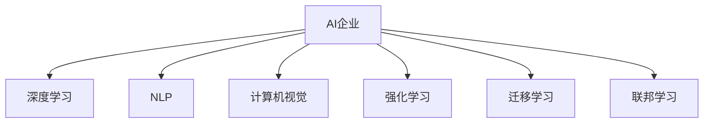

                 

# AI企业的未来发展方向

## 1. 背景介绍

### 1.1 问题由来
在数字化转型的大潮中，人工智能(AI)已经成为企业竞争力的关键因素。AI技术不仅能提高生产效率、降低运营成本，还能为企业带来新的商业模式和市场机会。随着深度学习、自然语言处理、计算机视觉等AI技术逐渐成熟，越来越多的企业开始引入AI，推动业务创新，提升市场竞争力。

### 1.2 问题核心关键点
当前，AI企业在发展过程中面临诸多挑战，包括但不限于数据获取、模型训练、算法优化、应用部署和业务落地等。如何构建高效、稳定、可扩展的AI系统，以支撑企业数字化转型，成为AI企业发展的核心议题。

### 1.3 问题研究意义
本文聚焦于AI企业的未来发展方向，结合当前技术趋势和企业需求，探讨构建高效、稳定、可扩展的AI系统的策略。通过深入分析AI技术的最新进展和应用实践，为企业AI发展提供全面的指导和建议。

## 2. 核心概念与联系

### 2.1 核心概念概述

为更好地理解AI企业的未来发展方向，本节将介绍几个密切相关的核心概念：

- **AI企业**：利用AI技术推动企业业务创新、提升市场竞争力的企业形态。AI企业覆盖了从研发到应用的各个环节，涉及数据管理、模型训练、算法优化、应用部署等多个方面。

- **深度学习(Deep Learning)**：一种通过多层神经网络逼近复杂非线性映射的机器学习方法，适用于图像识别、自然语言处理、语音识别等任务。

- **自然语言处理(Natural Language Processing, NLP)**：一种AI应用，旨在使计算机能够理解、分析和生成自然语言，广泛应用于机器翻译、情感分析、文本摘要等任务。

- **计算机视觉(Computer Vision)**：一种AI应用，旨在使计算机能够通过图像、视频等视觉数据进行分析和理解，广泛应用于目标检测、图像识别、视频监控等任务。

- **强化学习(Reinforcement Learning, RL)**：一种通过试错学习，逐步优化决策策略的机器学习方法，广泛应用于机器人控制、游戏AI、推荐系统等任务。

- **迁移学习(Transfer Learning)**：一种机器学习方法，将在一个任务上训练好的模型参数迁移到另一个相关任务上，以加快模型训练速度和提升模型性能。

- **联邦学习(Federated Learning)**：一种分布式机器学习方法，通过多个设备协同训练模型，保护数据隐私的同时提升模型性能。

这些核心概念之间的逻辑关系可以通过以下Mermaid流程图来展示：



这个流程图展示了大语言模型的核心概念及其之间的关系：

1. AI企业通过多种AI技术实现业务创新，如深度学习、自然语言处理、计算机视觉等。
2. 深度学习提供强大的特征提取和模式识别能力，适用于复杂的图像和文本处理任务。
3. 自然语言处理帮助AI企业理解和生成自然语言，提升人机交互体验。
4. 计算机视觉使AI企业能够处理和分析图像、视频等视觉数据。
5. 强化学习通过试错学习，提升决策能力，广泛应用于智能控制、游戏AI等任务。
6. 迁移学习使AI企业能够快速适应新任务，通过模型迁移提升模型性能。
7. 联邦学习使AI企业能够在保护数据隐私的前提下，协同训练模型，提升模型性能。

这些概念共同构成了AI企业的技术和应用框架，使得AI企业能够构建高效、稳定、可扩展的AI系统。通过理解这些核心概念，我们可以更好地把握AI企业的发展方向。

## 3. 核心算法原理 & 具体操作步骤

### 3.1 算法原理概述

AI企业的未来发展方向主要依赖于深度学习、自然语言处理、计算机视觉等核心技术的进步。以深度学习为例，其核心原理包括多层神经网络、反向传播算法和优化器等。深度学习通过多层神经网络逼近复杂的非线性映射，实现对大规模数据的有效处理。反向传播算法则通过链式法则计算梯度，更新模型参数。优化器如Adam、SGD等则负责选择合适的学习率和更新策略，提高模型训练效率。

### 3.2 算法步骤详解

AI企业在构建深度学习模型时，一般包括以下几个关键步骤：

**Step 1: 数据收集与预处理**
- 收集与任务相关的数据，并进行清洗、归一化等预处理操作。
- 对数据进行划分，划分为训练集、验证集和测试集。

**Step 2: 构建模型架构**
- 选择合适的深度学习框架，如TensorFlow、PyTorch等。
- 设计模型的架构，包括卷积层、池化层、全连接层等。

**Step 3: 模型训练与优化**
- 使用训练集数据，通过反向传播算法更新模型参数。
- 使用验证集数据，调整模型超参数，防止过拟合。
- 使用测试集数据，评估模型性能，选择最优模型。

**Step 4: 模型部署与应用**
- 将训练好的模型部署到生产环境中，供业务应用调用。
- 根据业务需求，进行模型微调，优化模型性能。
- 定期更新模型参数，保持模型性能稳定。

### 3.3 算法优缺点

深度学习在AI企业的应用中具有以下优点：
1. 强大的特征提取能力，适用于大规模数据的处理。
2. 广泛的适用性，适用于图像识别、文本处理、语音识别等任务。
3. 端到端的自动化流程，减少了人工干预，提高了开发效率。

但深度学习也存在以下局限：
1. 需要大量标注数据，数据标注成本较高。
2. 模型复杂度高，训练和推理计算资源消耗较大。
3. 对数据的噪声和缺失敏感，模型容易过拟合。
4. 模型的解释性较差，难以解释模型内部决策过程。

### 3.4 算法应用领域

深度学习在AI企业中的应用领域广泛，主要包括：

- **计算机视觉**：图像分类、目标检测、人脸识别、视频分析等。
- **自然语言处理**：机器翻译、文本分类、情感分析、问答系统等。
- **语音识别与处理**：语音识别、语音合成、语音情感分析等。
- **推荐系统**：商品推荐、广告推荐、个性化推荐等。
- **智能控制**：机器人控制、自动驾驶、智能家居等。
- **医疗健康**：医学影像分析、药物发现、疾病预测等。
- **金融领域**：风险评估、信用评分、智能投顾等。

这些应用领域展示了深度学习在AI企业中的广泛应用和巨大潜力。

## 4. 数学模型和公式 & 详细讲解 & 举例说明

### 4.1 数学模型构建

在AI企业的深度学习应用中，通常涉及以下数学模型：

- **多层感知机(Multilayer Perceptron, MLP)**：一种前馈神经网络，包含多个隐藏层，用于分类和回归任务。
- **卷积神经网络(Convolutional Neural Network, CNN)**：一种适用于图像和视频处理的神经网络，包含卷积层和池化层。
- **循环神经网络(Recurrent Neural Network, RNN)**：一种适用于序列数据处理的神经网络，包含LSTM、GRU等变种。

以卷积神经网络为例，其数学模型构建如下：

$$
y = \mathrm{ReLU}(\mathbf{W}_1 \mathbf{x} + \mathbf{b}_1)
$$
$$
\mathbf{H} = \mathrm{Conv2D}(\mathbf{y})
$$
$$
y = \mathrm{ReLU}(\mathbf{W}_2 \mathbf{H} + \mathbf{b}_2)
$$
$$
\mathbf{y} = \mathrm{Softmax}(\mathbf{W}_3 \mathbf{y} + \mathbf{b}_3)
$$

其中，$\mathbf{W}$和$\mathbf{b}$分别为卷积核和偏置，$\mathbf{x}$为输入数据，$\mathbf{y}$为输出结果，$\mathrm{ReLU}$和$\mathrm{Softmax}$分别为激活函数和损失函数。

### 4.2 公式推导过程

以卷积神经网络为例，公式推导过程如下：

设输入数据 $\mathbf{x} \in \mathbb{R}^{N\times M\times D}$，卷积核 $\mathbf{W} \in \mathbb{R}^{H\times W\times D \times C}$，偏置 $\mathbf{b} \in \mathbb{R}^C$，卷积操作 $\mathrm{Conv2D}$，激活函数 $\mathrm{ReLU}$，输出结果 $\mathbf{y} \in \mathbb{R}^{N\times H\times W\times C}$。

卷积操作定义为：
$$
\mathbf{H} = \mathrm{Conv2D}(\mathbf{y}) = \mathbf{W} \ast \mathbf{x} + \mathbf{b}
$$

其中，$\ast$ 表示卷积运算。

激活函数定义为：
$$
\mathrm{ReLU}(\mathbf{y}) = \max(0, \mathbf{y})
$$

输出结果定义为：
$$
\mathbf{y} = \mathrm{Softmax}(\mathbf{W}_3 \mathbf{y} + \mathbf{b}_3)
$$

其中，$\mathrm{Softmax}$ 表示概率分布函数。

### 4.3 案例分析与讲解

以图像分类任务为例，使用卷积神经网络进行模型训练和推理。

**Step 1: 数据收集与预处理**
- 收集图像数据集，并进行图像归一化处理。
- 将数据集划分为训练集、验证集和测试集。

**Step 2: 构建模型架构**
- 使用PyTorch框架，定义卷积神经网络模型。
- 设置卷积层、池化层和全连接层的参数。

**Step 3: 模型训练与优化**
- 使用训练集数据，进行模型训练，调整超参数。
- 使用验证集数据，评估模型性能，选择最优模型。
- 使用测试集数据，评估模型性能，输出结果。

## 5. 项目实践：代码实例和详细解释说明

### 5.1 开发环境搭建

在进行深度学习项目实践前，我们需要准备好开发环境。以下是使用Python进行TensorFlow开发的环境配置流程：

1. 安装Anaconda：从官网下载并安装Anaconda，用于创建独立的Python环境。

2. 创建并激活虚拟环境：
```bash
conda create -n tf-env python=3.8 
conda activate tf-env
```

3. 安装TensorFlow：根据CUDA版本，从官网获取对应的安装命令。例如：
```bash
conda install tensorflow==2.8 -c pytorch -c conda-forge
```

4. 安装PyTorch：从官网下载并安装PyTorch，确保与TensorFlow版本兼容。

5. 安装各类工具包：
```bash
pip install numpy pandas scikit-learn matplotlib tqdm jupyter notebook ipython
```

完成上述步骤后，即可在`tf-env`环境中开始深度学习项目实践。

### 5.2 源代码详细实现

这里我们以图像分类任务为例，给出使用TensorFlow对卷积神经网络进行图像分类的Python代码实现。

```python
import tensorflow as tf
from tensorflow.keras import datasets, layers, models

# 加载数据集
(train_images, train_labels), (test_images, test_labels) = datasets.cifar10.load_data()

# 数据预处理
train_images, test_images = train_images / 255.0, test_images / 255.0

# 构建模型
model = models.Sequential([
    layers.Conv2D(32, (3, 3), activation='relu', input_shape=(32, 32, 3)),
    layers.MaxPooling2D((2, 2)),
    layers.Conv2D(64, (3, 3), activation='relu'),
    layers.MaxPooling2D((2, 2)),
    layers.Conv2D(64, (3, 3), activation='relu'),
    layers.Flatten(),
    layers.Dense(64, activation='relu'),
    layers.Dense(10)
])

# 编译模型
model.compile(optimizer='adam',
              loss=tf.keras.losses.SparseCategoricalCrossentropy(from_logits=True),
              metrics=['accuracy'])

# 训练模型
history = model.fit(train_images, train_labels, epochs=10, 
                    validation_data=(test_images, test_labels))

# 评估模型
test_loss, test_acc = model.evaluate(test_images,  test_labels, verbose=2)
print(test_acc)
```

以上就是使用TensorFlow进行卷积神经网络图像分类的完整代码实现。可以看到，TensorFlow提供了丰富的API，使得模型构建和训练过程非常简单。

### 5.3 代码解读与分析

让我们再详细解读一下关键代码的实现细节：

**数据预处理**：
- 使用CIFAR-10数据集，加载训练集和测试集数据。
- 将图像数据归一化到[0,1]区间，以便模型更好地学习特征。

**模型构建**：
- 定义卷积神经网络模型，包含3个卷积层、2个池化层和2个全连接层。
- 设置卷积核大小、通道数、激活函数等超参数。
- 使用Sequential模型封装各个层。

**模型编译**：
- 选择Adam优化器，设置损失函数为交叉熵，设置准确率作为评估指标。

**模型训练**：
- 使用训练集数据，进行模型训练，设置训练轮数为10。
- 使用验证集数据，评估模型性能。
- 输出测试集上的准确率。

## 6. 实际应用场景

### 6.1 智能客服系统

AI企业通过深度学习构建的智能客服系统，可以显著提升客户服务体验和效率。传统客服依赖人工客服，响应时间长、效率低、服务质量不稳定。而智能客服系统通过深度学习模型，能够实时理解客户查询，并提供精准的响应，极大提高了服务质量和客户满意度。

**具体实现**：
- 收集历史客服对话数据，标注问题和答案。
- 使用深度学习模型训练客户问答模型。
- 部署模型到客服系统中，实时接收客户查询，自动匹配问题和答案。
- 集成多轮对话机制，提升对话效果。

**效果评估**：
- 自动匹配问题和答案的准确率。
- 客户满意度调查，提升服务体验。
- 实时监控对话系统性能，及时调整模型。

### 6.2 金融风险评估

AI企业通过深度学习构建的金融风险评估系统，能够实时监测市场风险，及时预警金融风险，帮助金融机构规避损失。传统金融风险评估依赖专家经验，难以全面覆盖所有风险点。而深度学习模型，能够通过历史数据，自动学习风险特征，提升风险评估的准确性和及时性。

**具体实现**：
- 收集金融市场数据，标注风险特征。
- 使用深度学习模型训练风险评估模型。
- 部署模型到风险监测系统中，实时监测市场风险。
- 设置风险预警阈值，及时发出风险预警。

**效果评估**：
- 风险评估的准确率。
- 风险预警的及时性。
- 金融机构损失规避效果。

### 6.3 医疗影像诊断

AI企业通过深度学习构建的医疗影像诊断系统，能够自动分析医学影像，辅助医生进行诊断，提升医疗服务的精准性和效率。传统医学影像诊断依赖医生的经验，容易产生误诊或漏诊。而深度学习模型，能够通过大规模医学影像数据，自动学习影像特征，辅助医生进行诊断。

**具体实现**：
- 收集医学影像数据，标注医学诊断结果。
- 使用深度学习模型训练影像诊断模型。
- 部署模型到医学影像系统中，实时分析医学影像。
- 提供诊断建议，辅助医生进行诊断。

**效果评估**：
- 影像诊断的准确率。
- 辅助诊断的效果。
- 医生的工作效率提升。

### 6.4 未来应用展望

随着深度学习技术的不断进步，AI企业在各领域的深度学习应用将不断扩展，带来更广泛的社会价值。

- **智慧城市**：通过深度学习构建的智慧城市系统，能够实时监测城市环境，提升城市治理能力。例如，通过深度学习模型分析交通流量，优化交通管理，提升道路通行效率。

- **自动驾驶**：通过深度学习构建的自动驾驶系统，能够实时感知环境，进行精准控制，提升交通安全。例如，通过深度学习模型识别交通标志，避免交通事故。

- **个性化推荐**：通过深度学习构建的个性化推荐系统，能够根据用户行为和兴趣，推荐个性化的商品和服务，提升用户体验。例如，通过深度学习模型分析用户行为数据，推荐商品，提升销售转化率。

## 7. 工具和资源推荐

### 7.1 学习资源推荐

为了帮助开发者系统掌握深度学习的应用和实践，这里推荐一些优质的学习资源：

1. **《深度学习》课程**：由斯坦福大学教授Andrew Ng开设的深度学习课程，内容覆盖深度学习基础和常见算法，适合初学者和进阶者。

2. **《TensorFlow实战》书籍**：由Google工程师撰写的TensorFlow实战书籍，详细介绍TensorFlow的使用方法和最佳实践，适合深度学习项目开发。

3. **《PyTorch深度学习》书籍**：由知名AI学者撰写的PyTorch深度学习书籍，详细介绍PyTorch的使用方法和深度学习算法，适合深度学习项目开发。

4. **Kaggle竞赛**：Kaggle数据科学竞赛平台，提供大量深度学习项目数据和竞赛任务，适合实践和经验积累。

5. **深度学习框架文档**：TensorFlow、PyTorch等深度学习框架的官方文档，提供详细的API接口和最佳实践，适合快速学习和开发。

通过对这些资源的学习实践，相信你一定能够快速掌握深度学习的应用和实践技巧，并用于解决实际的AI问题。

### 7.2 开发工具推荐

高效的开发离不开优秀的工具支持。以下是几款用于深度学习开发和部署的常用工具：

1. **TensorFlow**：由Google主导开发的深度学习框架，支持多种硬件设备，广泛应用于生产环境。

2. **PyTorch**：由Facebook主导开发的深度学习框架，灵活动态的计算图，适合快速迭代研究。

3. **Keras**：由Google主导开发的高级API，简化深度学习模型的构建过程，适合初学者和快速开发。

4. **MXNet**：由Amazon主导开发的深度学习框架，支持多种编程语言，适合大规模工程应用。

5. **TensorBoard**：TensorFlow配套的可视化工具，实时监测模型训练状态，提供丰富的图表呈现方式。

6. **Weights & Biases**：模型训练的实验跟踪工具，记录和可视化模型训练过程中的各项指标，方便对比和调优。

7. **Jupyter Notebook**：开源的交互式编程环境，支持多种编程语言和库，适合研究和开发。

合理利用这些工具，可以显著提升深度学习模型的开发效率和优化效果。

### 7.3 相关论文推荐

深度学习在AI企业中的应用源于学界的持续研究。以下是几篇奠基性的相关论文，推荐阅读：

1. **《ImageNet Classification with Deep Convolutional Neural Networks》**：提出卷积神经网络模型，用于大规模图像分类任务，刷新了ImageNet分类竞赛记录。

2. **《Attention is All You Need》**：提出Transformer模型，用于自然语言处理任务，展示了大规模预训练模型的效果。

3. **《AlphaGo Zero》**：提出强化学习算法，用于围棋游戏，展示了强化学习在复杂决策问题上的潜力。

4. **《BERT: Pre-training of Deep Bidirectional Transformers for Language Understanding》**：提出BERT模型，用于大规模预训练和微调，刷新了多项NLP任务SOTA。

5. **《Yolov3: An Object Detection Framework》**：提出YOLO系列模型，用于目标检测任务，展示了深度学习在计算机视觉领域的应用效果。

这些论文代表了大语言模型微调技术的发展脉络。通过学习这些前沿成果，可以帮助研究者把握学科前进方向，激发更多的创新灵感。

## 8. 总结：未来发展趋势与挑战

### 8.1 研究成果总结

本文对AI企业的未来发展方向进行了全面系统的介绍。首先阐述了AI企业在数字化转型中的重要地位，明确了深度学习、自然语言处理、计算机视觉等核心技术的价值。其次，从原理到实践，详细讲解了深度学习模型的构建和优化过程，给出了深度学习项目开发的完整代码实例。同时，本文还广泛探讨了深度学习在智能客服、金融风险评估、医疗影像诊断等领域的实际应用前景，展示了深度学习技术的广阔前景。

### 8.2 未来发展趋势

展望未来，深度学习在AI企业的发展将呈现以下几个趋势：

1. **模型规模持续增大**：随着算力成本的下降和数据规模的扩张，深度学习模型的参数量还将持续增长，超大模型将成为主流。

2. **模型性能不断提升**：通过更复杂的网络结构、更丰富的数据集和更高效的训练方法，深度学习模型的性能将不断提升，应用领域将更加广泛。

3. **模型集成和融合**：深度学习模型将与其他AI技术进行更多集成和融合，如强化学习、自然语言处理等，形成更加全面、复杂的应用系统。

4. **端到端自动化的普及**：深度学习将更多应用于端到端的自动化流程中，如自动驾驶、智能客服等，减少人工干预，提升效率和效果。

5. **模型解释和可信度提升**：通过引入可解释性技术，深度学习模型将具备更好的解释性和可信度，增强用户和市场的信任。

### 8.3 面临的挑战

尽管深度学习在AI企业的发展中取得了显著进展，但仍面临诸多挑战：

1. **数据获取和标注**：深度学习模型依赖大量高质量标注数据，数据获取和标注成本较高，难以覆盖所有应用场景。

2. **模型鲁棒性和泛化性**：深度学习模型对数据噪声和分布变化敏感，容易过拟合，泛化性能有限。

3. **计算资源消耗**：深度学习模型参数量大，计算资源消耗高，难以在边缘设备上进行高效推理。

4. **模型复杂性和可解释性**：深度学习模型复杂度高，难以解释模型内部决策过程，缺乏可解释性。

5. **安全性与伦理问题**：深度学习模型可能学习到有害或偏见信息，产生误导性输出，引发安全与伦理问题。

### 8.4 研究展望

面对深度学习面临的挑战，未来的研究需要在以下几个方面寻求新的突破：

1. **无监督学习和半监督学习**：开发无监督和半监督学习算法，减少对标注数据的依赖，提升模型的鲁棒性和泛化性。

2. **知识图谱与符号学习**：结合知识图谱和符号学习，增强模型的先验知识和解释性，提升模型的可信度和解释性。

3. **端到端自动化优化**：研究模型压缩、量化加速等技术，优化深度学习模型的推理速度和资源消耗，提升模型在边缘设备上的应用效果。

4. **模型可信度和伦理导向**：引入可信度和伦理导向的评估指标，过滤和惩罚有害输出，提升模型的安全性与伦理导向。

这些研究方向将引领深度学习技术的持续进步，推动AI企业构建更加高效、稳定、可扩展的AI系统，带来更广泛的社会价值。

## 9. 附录：常见问题与解答

**Q1: 深度学习在AI企业中的应用有哪些？**

A: 深度学习在AI企业中的应用广泛，主要包括：

1. **计算机视觉**：图像分类、目标检测、人脸识别、视频分析等。

2. **自然语言处理**：机器翻译、文本分类、情感分析、问答系统等。

3. **语音识别与处理**：语音识别、语音合成、语音情感分析等。

4. **推荐系统**：商品推荐、广告推荐、个性化推荐等。

5. **智能控制**：机器人控制、自动驾驶、智能家居等。

6. **医疗健康**：医学影像分析、药物发现、疾病预测等。

7. **金融领域**：风险评估、信用评分、智能投顾等。

**Q2: 深度学习模型的训练和优化需要注意哪些问题？**

A: 深度学习模型的训练和优化需要注意以下问题：

1. **数据获取和预处理**：确保数据集的多样性和代表性，进行数据清洗和归一化。

2. **模型选择和架构设计**：选择合适的深度学习框架和模型架构，设计合理的超参数。

3. **模型训练和优化**：选择合适的优化器和学习率调度策略，设置合适的训练轮数和批量大小。

4. **模型评估和验证**：使用验证集数据评估模型性能，及时调整模型超参数。

5. **模型部署和应用**：选择合适的部署平台和推理引擎，确保模型的高效性和稳定性。

**Q3: 如何提高深度学习模型的可解释性？**

A: 提高深度学习模型的可解释性可以采取以下措施：

1. **使用可解释性技术**：如LIME、SHAP等，通过局部线性近似方法解释模型决策过程。

2. **引入符号化先验知识**：结合知识图谱、逻辑规则等专家知识，指导模型的训练和推理。

3. **可视化模型内部结构**：使用可视化工具，如TensorBoard，展示模型内部结构，理解模型特征提取过程。

4. **设计合理的任务适配层**：使用任务适配层，简化模型结构，提高模型可解释性。

5. **引入因果分析和博弈论工具**：通过因果分析方法，识别模型决策的关键特征，增强输出解释的因果性和逻辑性。

6. **建立模型监管机制**：设置伦理导向的评估指标，过滤和惩罚有害输出，提升模型的安全性与伦理导向。

这些措施可以帮助提高深度学习模型的可解释性和可信度，增强用户和市场的信任。

**Q4: 如何在AI企业中构建高效、稳定、可扩展的AI系统？**

A: 在AI企业中构建高效、稳定、可扩展的AI系统需要考虑以下几个方面：

1. **选择合适的深度学习框架和工具**：如TensorFlow、PyTorch等，根据项目需求选择合适的框架和工具。

2. **优化模型架构和超参数**：设计合理的模型架构和超参数，减少过拟合和计算资源消耗。

3. **引入可解释性和可信度技术**：使用LIME、SHAP等可解释性技术，增强模型的解释性和可信度。

4. **结合多种AI技术**：结合自然语言处理、计算机视觉、强化学习等多种AI技术，形成全面、复杂的应用系统。

5. **引入联邦学习和多模型集成**：使用联邦学习和多模型集成技术，提升模型的泛化性和鲁棒性。

6. **优化模型部署和推理**：选择合适的部署平台和推理引擎，优化模型的推理速度和资源消耗，确保模型的高效性和稳定性。

7. **建立模型监管机制**：设置伦理导向的评估指标，过滤和惩罚有害输出，提升模型的安全性与伦理导向。

通过以上措施，AI企业可以构建高效、稳定、可扩展的AI系统，实现业务的智能化和自动化，提升市场竞争力。

**Q5: 如何在AI企业中推动深度学习技术的普及和应用？**

A: 在AI企业中推动深度学习技术的普及和应用需要考虑以下几个方面：

1. **提供全面的技术支持**：提供深度学习项目开发的全套技术支持，包括模型训练、模型优化、模型部署等环节。

2. **建立标准化的开发流程**：建立标准化的深度学习项目开发流程，提高开发效率和项目质量。

3. **提供优质的学习资源**：提供深度学习项目开发的学习资源，如教程、书籍、论文等，帮助开发者快速上手。

4. **结合业务需求进行优化**：结合具体业务需求，优化深度学习模型和应用系统，提升业务价值。

5. **引入开源社区和合作平台**：引入开源社区和合作平台，充分利用开源社区的资源和智慧，推动深度学习技术的普及和应用。

6. **建立透明的合作机制**：建立透明的合作机制，保障数据隐私和知识产权，推动深度学习技术的商业化应用。

通过以上措施，AI企业可以推动深度学习技术的普及和应用，提升企业的数字化转型能力和市场竞争力。

---

作者：禅与计算机程序设计艺术 / Zen and the Art of Computer Programming

