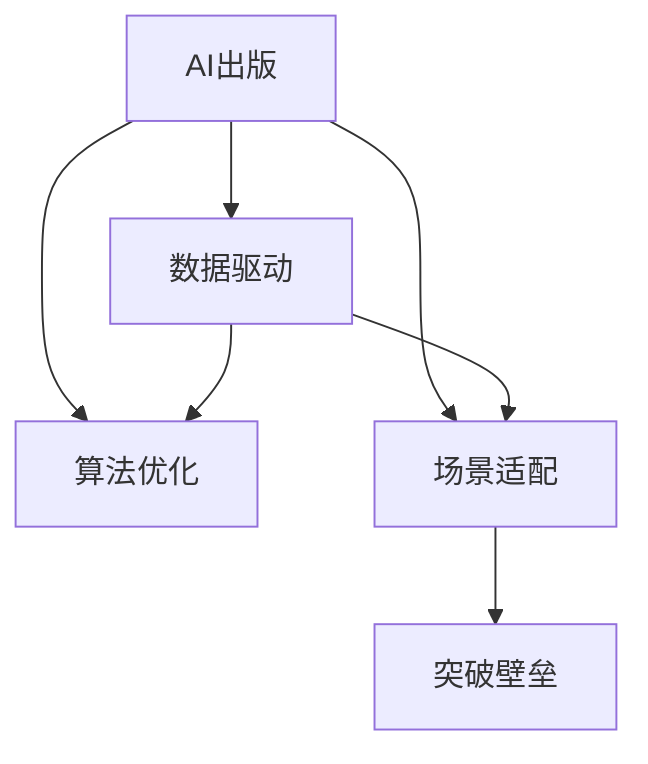

                 

# AI出版业壁垒：数据，算法与场景协同

> 关键词：出版业, 数据驱动, 算法优化, 场景应用, AI出版, 壁垒, 突破

## 1. 背景介绍

### 1.1 问题由来
在数字化转型的浪潮下，出版业正经历前所未有的变革。传统的纸质图书销售模式逐渐被数字化、在线化、智能化等新兴模式所取代，出版商面临着内容创作、运营管理、市场竞争等多方面的挑战。AI技术作为新型工具，正在逐步改变出版业的运营方式，推动内容生产的自动化、个性化、智能化，帮助出版商打破固有的业务壁垒，提升市场竞争力。

然而，AI在出版业的应用并非一帆风顺。虽然一些大型出版商和科技公司已经成功应用AI技术，但多数中小型出版商仍然面临着技术门槛高、数据获取难、场景适配难等诸多难题。这些壁垒不仅制约了出版商对AI技术的利用，也限制了AI技术在出版业的应用深度和广度。

### 1.2 问题核心关键点
AI在出版业的应用核心关键点包括：
- **数据驱动**：出版内容创作、推荐系统、营销分析等环节都需要依赖高质量的数据。
- **算法优化**：使用先进的算法技术处理数据，实现内容的智能化推荐、个性化编辑、精准营销等功能。
- **场景适配**：将AI技术适配到不同的业务场景，如智能编辑、版权管理、发行渠道等。
- **突破壁垒**：解决中小出版商的数据、算法、场景适配等问题，降低技术门槛。

## 2. 核心概念与联系

### 2.1 核心概念概述

为更好地理解AI在出版业的应用，本节将介绍几个关键概念：

- **AI出版**：利用人工智能技术进行出版内容创作、编辑、推荐、营销等环节的自动化处理，提升出版效率和内容质量。
- **数据驱动**：通过收集和分析大量用户行为数据、市场数据、出版内容数据等，引导内容创作、精准推荐和营销决策。
- **算法优化**：使用机器学习、深度学习等算法技术对数据进行处理和分析，实现模型的预测、分类、推荐等核心功能。
- **场景适配**：将AI技术应用到具体的出版业务场景中，解决特定问题，提升业务运营效率。
- **突破壁垒**：通过技术支持和资源共享，帮助中小出版商克服技术门槛，顺利应用AI技术。

这些概念之间的逻辑关系可以通过以下Mermaid流程图来展示：



这个流程图展示了几大核心概念及其之间的关系：

1. AI出版作为总体目标，通过数据驱动、算法优化和场景适配实现。
2. 数据驱动和算法优化为AI出版提供技术支持。
3. 场景适配将AI出版应用于具体业务场景。
4. 突破壁垒帮助中小出版商克服技术应用中的各种问题。

## 3. 核心算法原理 & 具体操作步骤
### 3.1 算法原理概述

AI出版业的核心在于数据驱动、算法优化和场景适配。其核心算法原理可以概括为以下几个步骤：

1. **数据采集与预处理**：通过爬虫、API接口、自有数据系统等手段获取出版相关的数据，并进行清洗、标注、标准化等预处理。
2. **特征工程与模型训练**：根据业务需求，选择合适的特征提取方法，构建训练数据集，使用机器学习、深度学习等算法进行模型训练。
3. **模型评估与优化**：通过交叉验证、A/B测试等方式对模型进行评估，根据评估结果调整模型参数，提升模型效果。
4. **部署与应用**：将训练好的模型部署到实际应用场景中，实现AI出版业务的自动化、智能化。

### 3.2 算法步骤详解

基于上述算法原理，AI出版业的具体操作步骤可以细化为以下几个步骤：

**Step 1: 数据采集与预处理**
- 收集出版商的自有数据，如用户行为数据、市场数据、销售数据等。
- 通过爬虫、API接口等方式获取公开的出版内容数据，如书评、摘要、书单等。
- 对数据进行清洗，去除噪音数据、异常值、重复数据等。
- 对数据进行标注，如分类、关键词提取、情感分析等。
- 对数据进行标准化处理，如文本归一化、时间戳处理、数据格式统一等。

**Step 2: 特征工程与模型训练**
- 根据出版业务需求，选择和构建特征，如用户兴趣、阅读时长、图书评分等。
- 使用特征构建训练数据集，划分训练集、验证集和测试集。
- 选择合适的算法模型，如线性回归、随机森林、深度神经网络等。
- 进行模型训练，根据训练集数据更新模型参数，减小误差。
- 在验证集上评估模型效果，根据评估结果调整模型超参数。

**Step 3: 模型评估与优化**
- 使用测试集数据对模型进行最终评估，计算各种指标如准确率、召回率、F1分数等。
- 根据测试集评估结果，确定最终选择的模型。
- 通过交叉验证、A/B测试等方式对模型进行进一步优化，提升模型效果。
- 对模型进行调优，如调整学习率、迭代次数、正则化系数等。

**Step 4: 部署与应用**
- 将训练好的模型部署到实际应用系统中，如推荐系统、智能编辑、版权管理系统等。
- 对应用系统进行优化，提升响应速度、降低延迟、减少资源占用。
- 对应用系统进行测试，确保其稳定性和可靠性。
- 对应用系统进行监控和维护，及时发现和解决故障。

### 3.3 算法优缺点

AI出版业的核心算法具有以下优点：
1. 自动化处理：大幅降低人力成本，提高内容创作和编辑的效率。
2. 数据驱动：通过数据分析精准把握用户需求，提高内容推荐和市场分析的准确性。
3. 场景适配：灵活应用AI技术解决具体业务问题，提升运营效率。
4. 持续优化：通过模型评估和调优，不断提升模型效果，满足用户需求。

同时，该算法也存在一些缺点：
1. 数据依赖：模型的效果高度依赖于数据质量，数据获取和处理难度较大。
2. 算法复杂：深度学习等算法的模型构建和训练较为复杂，对技术要求较高。
3. 场景多样：出版业涉及的业务场景众多，需要定制化的AI解决方案。
4. 成本较高：模型构建和优化需要较大的数据和计算资源，初期投入较大。

尽管如此，AI出版业的算法核心仍是目前出版商提升竞争力的重要手段。

### 3.4 算法应用领域

AI出版业的算法核心技术主要应用于以下几个领域：

- **智能推荐系统**：根据用户的历史阅读行为和偏好，推荐感兴趣的出版内容，提升用户粘性和购买转化率。
- **内容创作辅助**：通过自然语言处理技术，帮助作者进行内容创作和编辑，提高内容质量和创作效率。
- **版权管理系统**：通过数据分析和机器学习，识别版权侵权行为，提升版权保护和打击盗版的效率。
- **发行渠道优化**：通过数据分析和智能决策，优化出版内容的分发策略，提高市场覆盖率和发行效果。
- **用户行为分析**：通过分析用户行为数据，洞察用户需求和市场趋势，指导内容创作和市场推广。

## 4. 数学模型和公式 & 详细讲解  
### 4.1 数学模型构建

本节将使用数学语言对AI出版业的算法核心进行更加严格的刻画。

记出版内容为 $X$，用户行为数据为 $Y$，用户特征为 $Z$。假设出版内容与用户行为之间的映射关系为 $f(X,Y)=Z$。

定义数据集为 $D=\{(X_i,Y_i)\}_{i=1}^N$，模型 $f$ 在数据集 $D$ 上的经验风险为：

$$
\mathcal{L}(f) = \frac{1}{N} \sum_{i=1}^N \|f(X_i,Y_i) - Z_i\|^2
$$

其中 $\|\cdot\|$ 为范数，用于衡量预测结果与真实结果的差异。

通过最小化经验风险，可得模型 $f$ 的参数 $\theta$：

$$
\theta^* = \mathop{\arg\min}_{\theta} \mathcal{L}(f)
$$

在实践中，我们通常使用基于梯度的优化算法（如SGD、Adam等）来近似求解上述最优化问题。设 $\eta$ 为学习率，$\lambda$ 为正则化系数，则参数的更新公式为：

$$
\theta \leftarrow \theta - \eta \nabla_{\theta}\mathcal{L}(f) - \eta\lambda\theta
$$

其中 $\nabla_{\theta}\mathcal{L}(f)$ 为损失函数对参数 $\theta$ 的梯度，可通过反向传播算法高效计算。

### 4.2 公式推导过程

以下我们以内容推荐系统为例，推导模型训练的公式。

假设模型 $f$ 在输入 $X$ 上的输出为 $Z=f(X)$，表示用户对 $X$ 的兴趣评分。真实标签 $Y \in \{0,1\}$ 表示用户是否对 $X$ 感兴趣。则内容推荐系统的损失函数定义为：

$$
\ell(f(X_i),Y_i) = -[y_i\log f(X_i)+(1-y_i)\log(1-f(X_i))]
$$

将其代入经验风险公式，得：

$$
\mathcal{L}(f) = -\frac{1}{N}\sum_{i=1}^N [y_i\log f(X_i)+(1-y_i)\log(1-f(X_i))]
$$

根据链式法则，损失函数对参数 $\theta_k$ 的梯度为：

$$
\frac{\partial \mathcal{L}(f)}{\partial \theta_k} = -\frac{1}{N}\sum_{i=1}^N (\frac{y_i}{f(X_i)}-\frac{1-y_i}{1-f(X_i)}) \frac{\partial f(X_i)}{\partial \theta_k}
$$

其中 $\frac{\partial f(X_i)}{\partial \theta_k}$ 可进一步递归展开，利用自动微分技术完成计算。

在得到损失函数的梯度后，即可带入参数更新公式，完成模型的迭代优化。重复上述过程直至收敛，最终得到适应出版内容推荐的最优模型参数 $\theta^*$。

## 5. 项目实践：代码实例和详细解释说明
### 5.1 开发环境搭建

在进行AI出版业务的算法实现前，我们需要准备好开发环境。以下是使用Python进行TensorFlow开发的环境配置流程：

1. 安装Anaconda：从官网下载并安装Anaconda，用于创建独立的Python环境。

2. 创建并激活虚拟环境：
```bash
conda create -n tf-env python=3.8 
conda activate tf-env
```

3. 安装TensorFlow：根据CUDA版本，从官网获取对应的安装命令。例如：
```bash
conda install tensorflow tensorflow-cpu tensorflow-addons -c conda-forge
```

4. 安装TensorBoard：用于可视化模型训练过程。
```bash
pip install tensorboard
```

5. 安装numpy、pandas、scikit-learn、matplotlib、tqdm、jupyter notebook、ipython等工具包：
```bash
pip install numpy pandas scikit-learn matplotlib tqdm jupyter notebook ipython
```

完成上述步骤后，即可在`tf-env`环境中开始算法实现。

### 5.2 源代码详细实现

这里我们以内容推荐系统为例，给出使用TensorFlow对推荐模型进行训练和评估的PyTorch代码实现。

首先，定义数据处理函数：

```python
import tensorflow as tf
import numpy as np

class RecommendationDataset(tf.keras.utils.Sequence):
    def __init__(self, X, Y, batch_size=32):
        self.X = X
        self.Y = Y
        self.batch_size = batch_size
        
    def __len__(self):
        return len(self.X) // self.batch_size
        
    def __getitem__(self, item):
        X_batch = self.X[item*self.batch_size:(item+1)*self.batch_size]
        Y_batch = self.Y[item*self.batch_size:(item+1)*self.batch_size]
        return np.array(X_batch), np.array(Y_batch)
```

然后，定义模型和优化器：

```python
from tensorflow.keras.layers import Dense, Input, Embedding
from tensorflow.keras.models import Model
from tensorflow.keras.optimizers import Adam

input_X = Input(shape=(None, ), dtype='int32')
embedding = Embedding(input_dim=X.shape[1], output_dim=128, mask_zero=True)(input_X)
x = tf.keras.layers.GlobalAveragePooling1D()(embedding)
x = Dense(64, activation='relu')(x)
x = Dense(1, activation='sigmoid')(x)
model = Model(inputs=input_X, outputs=x)

model.compile(loss='binary_crossentropy', optimizer=Adam(lr=0.001), metrics=['accuracy'])
```

接着，定义训练和评估函数：

```python
from tensorflow.keras.preprocessing import sequence
from sklearn.model_selection import train_test_split

X_train, X_test, Y_train, Y_test = train_test_split(X, Y, test_size=0.2, random_state=42)
X_train = sequence.pad_sequences(X_train, maxlen=100, padding='post', truncating='post')
X_test = sequence.pad_sequences(X_test, maxlen=100, padding='post', truncating='post')

train_dataset = RecommendationDataset(X_train, Y_train)
test_dataset = RecommendationDataset(X_test, Y_test)

def train_epoch(model, dataset, batch_size, optimizer):
    dataloader = tf.data.Dataset.from_generator(lambda: dataset.__getitem__(0), output_signature=((tf.float32, tf.float32), (tf.int32, tf.int32)))
    dataloader = dataloader.batch(batch_size)
    model.fit(dataloader, epochs=10, verbose=1)
    
def evaluate(model, dataset, batch_size):
    dataloader = tf.data.Dataset.from_generator(lambda: dataset.__getitem__(0), output_signature=((tf.float32, tf.float32), (tf.int32, tf.int32)))
    dataloader = dataloader.batch(batch_size)
    model.evaluate(dataloader)
```

最后，启动训练流程并在测试集上评估：

```python
epochs = 10
batch_size = 32

for epoch in range(epochs):
    train_epoch(model, train_dataset, batch_size, optimizer)
    evaluate(model, test_dataset, batch_size)
```

以上就是使用TensorFlow进行内容推荐系统训练和评估的完整代码实现。可以看到，TensorFlow提供了高效的自动微分机制和模型构建工具，使得模型训练和评估的过程相对简单。

### 5.3 代码解读与分析

让我们再详细解读一下关键代码的实现细节：

**RecommendationDataset类**：
- `__init__`方法：初始化输入数据和批量大小。
- `__len__`方法：返回数据集长度。
- `__getitem__`方法：对单个样本进行处理，将输入数据和标签转换为张量。

**train_epoch和evaluate函数**：
- `train_epoch`函数：对数据集进行批次化加载，对模型进行训练，计算并输出损失和准确率。
- `evaluate`函数：对模型在测试集上进行评估，计算并输出损失和准确率。

**TensorFlow环境配置**：
- 使用Anaconda创建虚拟环境，安装必要的Python库。
- 使用TensorFlow提供的自动微分机制和模型构建工具，方便进行模型训练和评估。
- 使用TensorBoard进行模型训练过程的可视化，监控训练效果。

## 6. 实际应用场景
### 6.1 智能编辑系统

智能编辑系统通过自然语言处理技术，帮助编辑进行内容的自动化审核、纠错和完善。具体而言，可以构建一个多任务学习模型，同时处理拼写错误、语法错误、事实错误等不同类型的错误。

在技术实现上，可以收集大量的编辑标注数据，包括拼写错误、语法错误、事实错误等，将其构建为监督数据集。在此基础上对预训练语言模型进行微调，使其具备错误检测和纠错的能力。微调后的模型可以对用户提交的内容进行实时审核，自动发现和修正错误，提升内容质量和创作效率。

### 6.2 版权管理系统

版权管理系统通过数据分析和机器学习技术，识别出版内容中的版权信息，保护作者的合法权益。具体而言，可以构建一个基于序列标注任务的模型，标注出出版内容中的版权信息，如作者、出版社、出版年份等。

在技术实现上，可以收集大量的版权信息标注数据，构建版权信息标注数据集。在此基础上对预训练语言模型进行微调，使其能够自动标注出版内容中的版权信息。微调后的模型可以部署到自动化系统，对大量出版内容进行版权信息标注，快速识别版权侵权行为，提升版权保护和打击盗版的效率。

### 6.3 智能营销系统

智能营销系统通过数据分析和机器学习技术，精准定位目标读者，优化营销策略。具体而言，可以构建一个推荐系统，根据读者的历史阅读行为和兴趣，推荐感兴趣的出版内容，提升读者的购买转化率。

在技术实现上，可以收集读者的历史阅读数据，构建推荐系统数据集。在此基础上对预训练语言模型进行微调，使其具备推荐功能。微调后的模型可以部署到推荐系统，根据读者的行为数据进行内容推荐，提高读者的粘性和购买转化率。

### 6.4 未来应用展望

随着AI技术的发展，AI出版业将展现出更加广阔的前景。未来，AI技术将在出版业的应用将更加深入和广泛，带来更多新的应用场景和商业模式。

- **多模态出版**：将AI技术与图像、视频、音频等多模态数据结合，提升出版内容的丰富度和互动性。
- **AI辅助创作**：通过自然语言生成技术，帮助作者进行内容创作和编辑，提升内容质量和创作效率。
- **智能版权保护**：通过区块链和AI技术结合，实现内容版权的数字化和智能化保护。
- **智能营销系统**：通过数据分析和机器学习技术，精准定位目标读者，优化营销策略，提升市场覆盖率和购买转化率。
- **智慧出版平台**：将AI技术与出版商的自有平台结合，实现内容创作、编辑、推荐、营销等环节的自动化处理，提升平台的用户粘性和业务收益。

## 7. 工具和资源推荐
### 7.1 学习资源推荐

为了帮助开发者系统掌握AI出版业的核心算法和技术，这里推荐一些优质的学习资源：

1. 《深度学习》系列书籍：由著名深度学习专家Yoshua Bengio、Ian Goodfellow、Aaron Courville合著，深入浅出地介绍了深度学习的基本概念和经典模型。
2. TensorFlow官方文档：提供了TensorFlow的详细使用指南和API文档，是TensorFlow学习的重要资源。
3. Kaggle竞赛平台：提供丰富的数据集和挑战，通过实践项目积累深度学习经验，提升算法应用能力。
4. PyTorch官方文档：提供了PyTorch的详细使用指南和API文档，是PyTorch学习的重要资源。
5. Fast.ai课程：提供了深度学习实践课程，通过实际项目训练深度学习模型，快速掌握算法和应用。

通过对这些资源的学习实践，相信你一定能够快速掌握AI出版业的核心算法和技术，并用于解决实际的出版问题。

### 7.2 开发工具推荐

高效的开发离不开优秀的工具支持。以下是几款用于AI出版业务开发的常用工具：

1. TensorFlow：由Google主导开发的开源深度学习框架，生产部署方便，适合大规模工程应用。
2. PyTorch：基于Python的开源深度学习框架，灵活动态的计算图，适合快速迭代研究。
3. TensorBoard：TensorFlow配套的可视化工具，可实时监测模型训练状态，提供丰富的图表呈现方式。
4. Fast.ai：提供了深度学习实践课程，通过实际项目训练深度学习模型，快速掌握算法和应用。
5. Weights & Biases：模型训练的实验跟踪工具，可以记录和可视化模型训练过程中的各项指标，方便对比和调优。

合理利用这些工具，可以显著提升AI出版业务的开发效率，加快创新迭代的步伐。

### 7.3 相关论文推荐

AI出版业的发展源于学界的持续研究。以下是几篇奠基性的相关论文，推荐阅读：

1. Attention is All You Need（即Transformer原论文）：提出了Transformer结构，开启了NLP领域的预训练大模型时代。
2. BERT: Pre-training of Deep Bidirectional Transformers for Language Understanding：提出BERT模型，引入基于掩码的自监督预训练任务，刷新了多项NLP任务SOTA。
3. Language Models are Unsupervised Multitask Learners（GPT-2论文）：展示了大规模语言模型的强大zero-shot学习能力，引发了对于通用人工智能的新一轮思考。
4. Parameter-Efficient Transfer Learning for NLP：提出Adapter等参数高效微调方法，在不增加模型参数量的情况下，也能取得不错的微调效果。
5. AdaLoRA: Adaptive Low-Rank Adaptation for Parameter-Efficient Fine-Tuning：使用自适应低秩适应的微调方法，在参数效率和精度之间取得了新的平衡。
6. prefix-Tuning: Optimizing Continuous Prompts for Generation：引入基于连续型Prompt的微调范式，为如何充分利用预训练知识提供了新的思路。

这些论文代表了大语言模型微调技术的发展脉络。通过学习这些前沿成果，可以帮助研究者把握学科前进方向，激发更多的创新灵感。

## 8. 总结：未来发展趋势与挑战

### 8.1 总结

本文对AI出版业的核心算法进行了全面系统的介绍。首先阐述了AI出版业的背景和重要性，明确了数据驱动、算法优化和场景适配的核心概念。其次，从原理到实践，详细讲解了AI出版业的算法核心步骤，给出了完整的代码实例。同时，本文还探讨了AI出版业在智能编辑、版权保护、智能营销等多个场景的应用前景，展示了AI技术在出版业的前景。

通过本文的系统梳理，可以看到，AI出版业的核心算法正在成为出版商提升竞争力的重要手段。这些技术的深度应用，将使得出版业从传统的手工操作逐步向智能化、自动化、精准化的方向转变，显著提升出版效率和内容质量，带来更多新的商业模式和机会。

### 8.2 未来发展趋势

展望未来，AI出版业的发展将呈现以下几个趋势：

1. **多模态融合**：将AI技术与图像、视频、音频等多模态数据结合，提升出版内容的丰富度和互动性。
2. **深度学习普及**：随着深度学习技术的不断成熟，AI出版业将更加普及，应用范围将更加广泛。
3. **智能化创作**：通过自然语言生成技术，帮助作者进行内容创作和编辑，提升内容质量和创作效率。
4. **智慧化运营**：通过数据分析和机器学习技术，优化出版商的运营决策，提升业务效率和收益。
5. **全流程自动化**：将AI技术应用于出版内容的创作、编辑、推荐、营销等全流程，实现自动化处理。

这些趋势将推动AI出版业向更加智能化、自动化的方向发展，为出版商带来更多的商业机会和创新空间。

### 8.3 面临的挑战

尽管AI出版业的发展前景广阔，但在实际应用中仍面临诸多挑战：

1. **数据获取难**：高质量的标注数据获取难度大，制约了AI技术的应用。
2. **算法复杂**：深度学习等算法的模型构建和训练较为复杂，对技术要求较高。
3. **场景多样**：出版业涉及的业务场景众多，需要定制化的AI解决方案。
4. **成本较高**：模型构建和优化需要较大的数据和计算资源，初期投入较大。
5. **伦理问题**：AI技术的应用可能带来隐私、版权等伦理问题，需要进一步规范和监管。

这些挑战需要出版商和AI技术提供商共同努力，通过技术创新和政策引导，逐步解决。

### 8.4 研究展望

未来，AI出版业的研究将在以下几个方面寻求新的突破：

1. **数据增强技术**：通过数据增强技术，提高数据质量和标注效率，降低数据获取难度。
2. **轻量化模型**：开发轻量化模型，减小模型参数量，降低计算资源需求，提高模型推理速度。
3. **场景适配技术**：针对特定场景，设计专用模型和算法，提升模型效果和应用效率。
4. **隐私保护技术**：通过隐私保护技术，确保数据和模型使用的安全性，解决数据隐私问题。
5. **跨模态融合技术**：将不同模态的数据结合，提升出版内容的丰富度和互动性，实现跨模态智能出版。

这些研究方向的探索，将推动AI出版业向更加智能化、自动化的方向发展，为出版商带来更多的商业机会和创新空间。

## 9. 附录：常见问题与解答

**Q1：AI出版业的主要技术有哪些？**

A: AI出版业的核心技术包括数据驱动、算法优化和场景适配。其中，数据驱动和算法优化是基础，场景适配是具体应用。

**Q2：如何选择合适的深度学习模型？**

A: 选择合适的深度学习模型需要考虑模型的复杂度、训练数据的数量、计算资源的可用性等因素。对于小数据集，可以选择轻量级模型，如线性回归、随机森林等；对于大数据集，可以选择复杂模型，如深度神经网络等。

**Q3：如何处理出版业的多模态数据？**

A: 处理出版业的多模态数据需要设计多模态融合算法，如特征融合、数据对齐等。可以通过特征提取、特征拼接等方式，将多模态数据整合到同一模型中进行处理。

**Q4：如何降低AI出版业的成本？**

A: 降低AI出版业的成本可以从以下几个方面入手：
1. 优化数据采集和标注流程，提高数据质量和标注效率。
2. 使用轻量化模型，减小模型参数量，降低计算资源需求。
3. 采用分布式计算技术，提高模型训练和推理效率。
4. 优化模型结构，提高模型推理速度，降低资源消耗。

**Q5：如何确保AI出版业的伦理安全性？**

A: 确保AI出版业的伦理安全性需要从以下几个方面入手：
1. 保护数据隐私，确保用户数据的安全性。
2. 遵循版权法规，确保版权信息的合法使用。
3. 建立监管机制，确保AI技术的透明性和可解释性。
4. 引入伦理导向的评估指标，避免有害信息的输出。

这些措施需要出版商和AI技术提供商共同努力，通过技术创新和政策引导，逐步解决。

