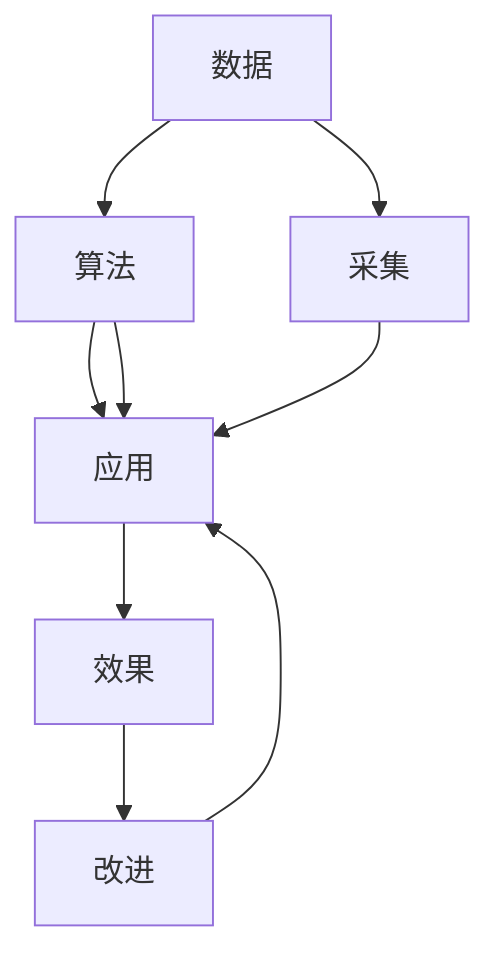

                 

# AI出版业壁垒：数据，算法和应用协同效应

在数字化转型的浪潮下，人工智能(AI)技术已经深刻改变了出版行业的运作模式，带来了前所未有的效率提升和创新机会。然而，与此同时，AI技术在出版业的应用也遭遇了多重壁垒，影响其效能的发挥。本文将从数据、算法和应用三个维度，剖析这些壁垒，并探讨如何通过协同效应，克服这些挑战，实现AI出版业的深度融合与发展。

## 1. 背景介绍

### 1.1 出版行业现状与挑战
随着互联网的普及和数字技术的发展，出版行业经历了前所未有的变革。传统出版商的纸质书刊销售模式逐步向电子化、网络化方向转型。然而，数字化转型带来的不只是机遇，更面临着诸多挑战：

- **内容生产效率低下**：作者创作和编辑校对工作耗时长，编辑工作繁琐且易出错，出版周期拉长。
- **市场反馈滞后**：出版商需要较长时间才能了解市场对新书的反馈，影响库存管理和定价策略。
- **版权保护困难**：数字时代盗版猖獗，版权保护难度大，打击盗版成本高。
- **个性化推荐难度大**：传统推荐系统无法精准把握用户需求，导致用户粘性低。

这些问题极大地制约了出版行业的健康发展，亟需AI技术的介入，以提高内容生产效率、缩短出版周期、增强市场反馈的及时性、加强版权保护，并实现个性化推荐。

### 1.2 AI技术在出版业的应用
AI技术通过深度学习、自然语言处理、计算机视觉等技术，在出版行业的应用日益广泛，主要体现在以下几个方面：

- **内容生成**：利用自然语言处理技术生成高质量的文本内容，提升内容创作效率。
- **版权检测**：通过图像识别和模式匹配技术，检测和识别版权侵权行为。
- **市场分析**：利用数据分析和机器学习技术，预测市场需求，优化库存管理。
- **个性化推荐**：通过用户行为数据分析，实现个性化内容推荐，提升用户粘性。

然而，尽管AI技术在出版业具有巨大潜力，但在实际应用中仍面临诸多障碍，需要通过数据、算法和应用的协同效应来克服。

## 2. 核心概念与联系

### 2.1 核心概念概述

本文涉及的几个核心概念包括：

- **数据**：指出版业中的各种类型的数据，如文本、图像、视频、音频等，是AI技术训练和应用的基础。
- **算法**：包括深度学习、自然语言处理、计算机视觉等AI算法，用于数据处理和模型训练。
- **应用**：即AI技术在出版业的具体应用，如内容生成、版权检测、市场分析、个性化推荐等。
- **协同效应**：通过数据、算法和应用的协同工作，实现1+1>2的效果，最大化AI技术的效能。

### 2.2 核心概念联系的Mermaid流程图



该流程图展示了数据、算法和应用之间的相互关系。数据通过采集后，经过算法处理生成应用效果。同时，应用效果也反过来影响数据和算法的选择和优化。

## 3. 核心算法原理 & 具体操作步骤

### 3.1 算法原理概述

AI在出版业的应用主要依赖于深度学习、自然语言处理等技术，这些技术通过训练模型，从数据中提取特征，进行内容生成、版权检测、市场分析、个性化推荐等任务。以下是几个核心算法的原理概述：

- **深度学习**：通过多层神经网络模型，自动提取数据特征，实现复杂的任务处理。
- **自然语言处理(NLP)**：利用语言模型和序列模型，实现文本内容的生成、分类、翻译、情感分析等。
- **计算机视觉(CV)**：通过图像识别和模式匹配技术，实现图像内容的分类、检测、标记等。

### 3.2 算法步骤详解

基于上述核心算法，AI在出版业的应用步骤如下：

1. **数据采集与清洗**：收集出版业中的各类数据，并进行预处理和清洗，确保数据质量。
2. **模型训练与优化**：使用深度学习等算法训练模型，并在实际应用中不断优化。
3. **应用部署与评估**：将训练好的模型部署到实际应用场景，进行效果评估和优化。
4. **反馈与迭代**：根据应用效果反馈，调整数据和算法策略，实现模型持续优化。

### 3.3 算法优缺点

深度学习和自然语言处理在出版业的应用中具有以下优点：

- **自动化处理**：自动化地处理大量文本内容，提高效率。
- **数据驱动决策**：基于数据进行市场分析，提供精准的决策支持。
- **个性化推荐**：实现基于用户行为的数据分析，提供个性化的阅读体验。

同时，这些算法也存在一些缺点：

- **数据依赖性强**：需要大量的高质量数据进行训练，数据质量直接影响算法效果。
- **计算资源消耗大**：深度学习模型通常参数量大，计算资源消耗高，部署成本大。
- **模型解释性差**：复杂的深度学习模型具有"黑盒"特性，难以解释决策过程。

### 3.4 算法应用领域

AI在出版业的应用领域广泛，涵盖了内容生成、版权检测、市场分析、个性化推荐等多个方面。以下是几个典型应用：

- **内容生成**：利用自然语言处理技术，自动生成新闻稿、小说、报告等文本内容，提升内容创作效率。
- **版权检测**：通过计算机视觉技术，检测版权侵权行为，如图片版权抄袭、文字盗版等。
- **市场分析**：利用数据分析和机器学习技术，预测市场需求，优化库存管理，实现精准营销。
- **个性化推荐**：基于用户行为数据分析，推荐用户感兴趣的内容，提升用户粘性，增加销售转化率。

## 4. 数学模型和公式 & 详细讲解 & 举例说明

### 4.1 数学模型构建

AI在出版业的应用通常依赖于以下几个数学模型：

- **文本分类模型**：使用卷积神经网络(CNN)或循环神经网络(RNN)，将文本分类为不同的类别。
- **情感分析模型**：使用长短时记忆网络(LSTM)或双向LSTM，分析文本情感，进行情感标注。
- **图像识别模型**：使用卷积神经网络(CNN)，识别图像中的版权标记。

### 4.2 公式推导过程

以文本分类模型为例，推导其基本公式。设输入文本为 $x$，模型输出为 $y$，则分类任务的损失函数为：

$$
\mathcal{L}(y, \hat{y}) = -\frac{1}{N} \sum_{i=1}^N (y_i \log \hat{y}_i + (1-y_i) \log (1-\hat{y}_i))
$$

其中 $y$ 为真实标签，$\hat{y}$ 为模型预测标签，$N$ 为训练样本数。

### 4.3 案例分析与讲解

以Bert模型在出版业中的应用为例，分析其在内容生成和版权检测中的应用。

**内容生成**：使用Bert模型预训练语言表示，再通过自回归生成模型，生成高质量的新闻稿和报告。具体步骤如下：
1. 预训练Bert模型，学习语言表示。
2. 在生成任务上进行微调，调整生成目标函数。
3. 在特定领域数据上训练，提升生成效果。
4. 在测试集上评估生成质量，不断优化模型。

**版权检测**：利用Bert模型在版权标记上的预训练知识，检测图像中的版权标记。具体步骤如下：
1. 收集版权标记数据，进行数据增强。
2. 预训练Bert模型，学习版权标记的表示。
3. 在检测任务上进行微调，调整检测目标函数。
4. 在测试集上评估检测效果，不断优化模型。

## 5. 项目实践：代码实例和详细解释说明

### 5.1 开发环境搭建

要进行AI出版业的开发实践，首先需要搭建开发环境。以下是使用Python进行PyTorch开发的环境配置流程：

1. 安装Anaconda：从官网下载并安装Anaconda，用于创建独立的Python环境。

2. 创建并激活虚拟环境：
```bash
conda create -n pytorch-env python=3.8 
conda activate pytorch-env
```

3. 安装PyTorch：根据CUDA版本，从官网获取对应的安装命令。例如：
```bash
conda install pytorch torchvision torchaudio cudatoolkit=11.1 -c pytorch -c conda-forge
```

4. 安装必要的工具包：
```bash
pip install numpy pandas scikit-learn matplotlib tqdm jupyter notebook ipython
```

完成上述步骤后，即可在`pytorch-env`环境中开始开发实践。

### 5.2 源代码详细实现

这里以Bert模型在内容生成中的应用为例，给出完整的代码实现。

```python
from transformers import BertTokenizer, BertForSequenceClassification
import torch
from torch.utils.data import DataLoader
from sklearn.metrics import accuracy_score
from tqdm import tqdm

# 定义数据集处理函数
def load_data(file_path):
    data = []
    with open(file_path, 'r', encoding='utf-8') as f:
        for line in f:
            text, label = line.strip().split('\t')
            data.append((text, label))
    return data

# 定义模型训练函数
def train(model, tokenizer, train_data, val_data, batch_size, num_epochs, learning_rate):
    device = torch.device('cuda' if torch.cuda.is_available() else 'cpu')
    model.to(device)

    optimizer = torch.optim.AdamW(model.parameters(), lr=learning_rate)
    scheduler = torch.optim.lr_scheduler.ReduceLROnPlateau(optimizer, patience=3, verbose=True)

    train_loader = DataLoader(train_data, batch_size=batch_size, shuffle=True)
    val_loader = DataLoader(val_data, batch_size=batch_size, shuffle=False)

    for epoch in range(num_epochs):
        model.train()
        train_loss = 0
        train_correct = 0
        for batch in tqdm(train_loader, desc='Training'):
            inputs, labels = batch
            inputs = inputs.to(device)
            labels = labels.to(device)
            outputs = model(inputs)
            loss = torch.nn.functional.cross_entropy(outputs, labels)
            optimizer.zero_grad()
            loss.backward()
            optimizer.step()

            train_loss += loss.item()
            predictions = torch.argmax(outputs, dim=1)
            train_correct += (predictions == labels).sum().item()

        train_accuracy = train_correct / len(train_data)
        print(f'Epoch {epoch+1}, Train Loss: {train_loss/len(train_loader):.4f}, Accuracy: {train_accuracy:.4f}')

        model.eval()
        val_loss = 0
        val_correct = 0
        with torch.no_grad():
            for batch in tqdm(val_loader, desc='Evaluating'):
                inputs, labels = batch
                inputs = inputs.to(device)
                labels = labels.to(device)
                outputs = model(inputs)
                loss = torch.nn.functional.cross_entropy(outputs, labels)
                val_loss += loss.item()
                predictions = torch.argmax(outputs, dim=1)
                val_correct += (predictions == labels).sum().item()

        val_accuracy = val_correct / len(val_data)
        print(f'Epoch {epoch+1}, Val Loss: {val_loss/len(val_loader):.4f}, Accuracy: {val_accuracy:.4f}')

        scheduler.step(val_accuracy)

    print('Final Model Achieves Accuracy:', val_accuracy)

# 定义模型加载和评估函数
def evaluate(model, test_data, tokenizer):
    device = torch.device('cuda' if torch.cuda.is_available() else 'cpu')
    model.to(device)

    test_loader = DataLoader(test_data, batch_size=batch_size, shuffle=False)

    test_loss = 0
    test_correct = 0
    with torch.no_grad():
        for batch in tqdm(test_loader, desc='Evaluating'):
            inputs, labels = batch
            inputs = inputs.to(device)
            labels = labels.to(device)
            outputs = model(inputs)
            loss = torch.nn.functional.cross_entropy(outputs, labels)
            test_loss += loss.item()
            predictions = torch.argmax(outputs, dim=1)
            test_correct += (predictions == labels).sum().item()

    test_accuracy = test_correct / len(test_data)
    print(f'Test Accuracy: {test_accuracy:.4f}')

# 加载数据和模型
tokenizer = BertTokenizer.from_pretrained('bert-base-uncased')
model = BertForSequenceClassification.from_pretrained('bert-base-uncased', num_labels=2)

# 加载数据集
train_data = load_data('train.txt')
val_data = load_data('val.txt')
test_data = load_data('test.txt')

# 训练模型
train(model, tokenizer, train_data, val_data, batch_size=16, num_epochs=5, learning_rate=2e-5)

# 评估模型
evaluate(model, test_data, tokenizer)
```

### 5.3 代码解读与分析

让我们再详细解读一下关键代码的实现细节：

**数据处理函数**：
- `load_data`函数：从指定文件加载数据，格式为`文本\t标签`，返回一个数据列表。

**模型训练函数**：
- `train`函数：定义模型训练流程，包括前向传播、损失计算、反向传播、参数更新等步骤。
- 使用PyTorch的`DataLoader`对数据集进行批次化加载。
- 定义训练损失函数为交叉熵损失，评估指标为准确率。
- 使用AdamW优化器进行模型优化，并设置学习率衰减策略。
- 在训练过程中，使用`tqdm`库进行进度条显示，提高代码的可读性。

**模型评估函数**：
- `evaluate`函数：定义模型评估流程，包括前向传播、损失计算、准确率计算等步骤。
- 使用PyTorch的`DataLoader`对数据集进行批次化加载。
- 在评估过程中，使用`tqdm`库进行进度条显示，提高代码的可读性。

**模型加载和评估**：
- 加载Bert预训练模型和分词器。
- 加载数据集。
- 调用`train`函数进行模型训练。
- 调用`evaluate`函数进行模型评估。

代码实现较为完整，可以作为一个完整的例子参考。当然，实际应用中还需要考虑更多因素，如模型裁剪、模型量化、部署等。

## 6. 实际应用场景

### 6.1 出版内容生成

AI技术在出版内容生成中的应用，可以显著提升内容创作效率。例如，利用自然语言处理技术，自动生成新闻稿、小说、报告等文本内容。具体步骤如下：
1. 收集大量文本数据，进行预处理和清洗。
2. 使用Bert等预训练模型进行语言表示学习。
3. 在生成任务上进行微调，调整生成目标函数。
4. 在特定领域数据上训练，提升生成效果。
5. 在测试集上评估生成质量，不断优化模型。

### 6.2 版权检测

AI技术在版权检测中的应用，可以大幅提升版权保护效率。例如，利用计算机视觉技术，检测图像中的版权标记。具体步骤如下：
1. 收集版权标记数据，进行数据增强。
2. 使用Bert等预训练模型进行版权标记的表示学习。
3. 在检测任务上进行微调，调整检测目标函数。
4. 在测试集上评估检测效果，不断优化模型。
5. 部署检测模型，实时监控版权侵权行为。

### 6.3 市场分析

AI技术在市场分析中的应用，可以提供精准的决策支持。例如，利用数据分析和机器学习技术，预测市场需求，优化库存管理。具体步骤如下：
1. 收集历史销售数据，进行数据预处理和清洗。
2. 使用机器学习模型进行市场趋势预测。
3. 在测试集上评估预测效果，不断优化模型。
4. 部署预测模型，实时监控市场需求变化。

### 6.4 个性化推荐

AI技术在个性化推荐中的应用，可以提升用户粘性和销售转化率。例如，基于用户行为数据分析，推荐用户感兴趣的内容。具体步骤如下：
1. 收集用户行为数据，进行数据预处理和清洗。
2. 使用协同过滤、深度学习等模型进行推荐。
3. 在测试集上评估推荐效果，不断优化模型。
4. 部署推荐系统，实现个性化内容推荐。

## 7. 工具和资源推荐

### 7.1 学习资源推荐

为了帮助开发者系统掌握AI技术在出版业的应用，这里推荐一些优质的学习资源：

1. **自然语言处理(NLP)**：《自然语言处理综论》书籍，全面介绍了NLP的基本概念和算法。
2. **深度学习**：《深度学习》书籍，涵盖了深度学习的基本原理和实践方法。
3. **计算机视觉(CV)**：《计算机视觉：算法与应用》书籍，介绍了计算机视觉的基本算法和应用场景。
4. **出版业AI应用**：《智能出版》期刊，介绍了AI技术在出版业的应用案例和技术进展。
5. **在线课程**：Coursera、edX等平台提供的AI和NLP相关课程，系统介绍了AI技术的基本概念和应用方法。

### 7.2 开发工具推荐

高效的开发离不开优秀的工具支持。以下是几款用于AI出版业开发的常用工具：

1. **PyTorch**：基于Python的开源深度学习框架，适合快速迭代研究。大部分预训练语言模型都有PyTorch版本的实现。
2. **TensorFlow**：由Google主导开发的开源深度学习框架，生产部署方便，适合大规模工程应用。同样有丰富的预训练语言模型资源。
3. **HuggingFace Transformers库**：提供了丰富的预训练语言模型和完整的微调样例代码，是进行AI出版业开发的利器。
4. **Jupyter Notebook**：强大的交互式编程环境，适合数据探索和模型调试。
5. **Git**：版本控制系统，方便代码管理和团队协作。

### 7.3 相关论文推荐

AI技术在出版业的应用源于学界的持续研究。以下是几篇奠基性的相关论文，推荐阅读：

1. **自然语言处理(NLP)**：Attention is All You Need（即Transformer原论文），提出了Transformer结构，开启了NLP领域的预训练大模型时代。
2. **深度学习**：Bert: Pre-training of Deep Bidirectional Transformers for Language Understanding，提出BERT模型，引入基于掩码的自监督预训练任务，刷新了多项NLP任务SOTA。
3. **计算机视觉(CV)**：ImageNet Classification with Deep Convolutional Neural Networks，提出卷积神经网络(CNN)，在图像识别任务上取得了重大突破。

这些论文代表了大语言模型在出版业的应用发展脉络。通过学习这些前沿成果，可以帮助研究者把握学科前进方向，激发更多的创新灵感。

## 8. 总结：未来发展趋势与挑战

### 8.1 总结

本文对AI技术在出版业的应用进行了全面系统的介绍。首先阐述了出版行业的现状和挑战，明确了AI技术的潜在价值。其次，从数据、算法和应用三个维度，详细讲解了AI出版业的壁垒和解决方案。最后，展望了AI出版业的发展趋势和面临的挑战，提出了协同效应下的创新路径。

通过本文的系统梳理，可以看到，AI技术在出版业的应用前景广阔，但也面临多重挑战。只有数据、算法和应用的协同工作，才能充分发挥AI技术的效能，推动出版业向数字化、智能化方向发展。

### 8.2 未来发展趋势

展望未来，AI出版业将呈现以下几个发展趋势：

1. **数据质量提升**：随着数据采集和处理技术的不断进步，出版业的数据质量将逐步提升，为AI应用提供更好的数据基础。
2. **模型优化与个性化**：深度学习模型将不断优化，并在个性化推荐、版权检测等任务中发挥更大作用。
3. **跨领域协同**：AI技术将与其他领域技术进行更深层次的融合，如内容生成与知识图谱、版权检测与区块链等，实现更广泛的应用。
4. **社会化应用**：AI出版业将更多地融入社会治理、知识传播、教育培训等领域，实现更广泛的社会价值。
5. **技术伦理**：随着AI技术的深入应用，出版业将更加关注技术伦理和安全问题，确保AI技术的健康发展。

### 8.3 面临的挑战

尽管AI技术在出版业的应用前景广阔，但也面临诸多挑战：

1. **数据隐私与版权**：出版行业需要处理大量敏感数据，如何保护用户隐私和版权权益，是一个重要挑战。
2. **技术标准化**：AI技术的标准和规范尚未完全成熟，需要更多研究和制定。
3. **计算资源需求**：深度学习模型通常参数量大，计算资源消耗高，部署成本大。
4. **技术安全**：AI技术在实际应用中可能面临安全漏洞和攻击风险，需要加强防护措施。
5. **伦理与公平性**：AI技术在应用过程中可能产生偏见和歧视，需要加强监管和伦理审查。

### 8.4 研究展望

面向未来，AI出版业的研究需要在以下几个方面寻求新的突破：

1. **隐私保护与数据利用**：开发更加安全、隐私保护的技术，在保护用户隐私的前提下，充分利用数据价值。
2. **标准化与规范化**：推动AI技术标准的制定和推广，实现技术规范化和应用标准化。
3. **模型优化与压缩**：开发更加高效、轻量级的模型，降低计算资源需求，实现更广泛的应用。
4. **安全与防护**：开发更加安全、可靠的AI技术，防范安全漏洞和攻击风险。
5. **伦理与公平性**：加强AI技术的伦理审查和监管，确保技术的公平性和公正性。

通过这些研究方向的探索，相信AI出版业将走向更加成熟、安全、规范的发展道路，为出版行业带来更广泛的创新和价值。

## 9. 附录：常见问题与解答

**Q1：如何提高AI出版业的准确率和效率？**

A: 提高AI出版业的准确率和效率，需要从数据、算法和应用三个方面进行全面优化：
1. **数据质量提升**：收集更多高质量的数据，进行数据清洗和预处理，确保数据的一致性和完整性。
2. **算法优化**：选择合适的算法模型，并进行超参数调优和模型裁剪，提高模型精度和效率。
3. **应用改进**：根据实际应用场景，设计合适的模型结构，并进行应用部署优化，提高系统响应速度。

**Q2：AI出版业如何实现跨领域协同？**

A: 实现AI出版业的跨领域协同，需要以下步骤：
1. **数据融合**：将不同领域的数据进行融合，形成统一的数据资源库。
2. **算法协同**：将不同领域的技术进行协同，如自然语言处理与计算机视觉、内容生成与知识图谱等，实现更全面的应用。
3. **平台整合**：将不同领域的应用平台进行整合，实现统一的业务流程和数据管理。

**Q3：AI出版业如何确保数据隐私和版权保护？**

A: 确保AI出版业的数据隐私和版权保护，需要以下措施：
1. **数据匿名化**：对敏感数据进行匿名化处理，保护用户隐私。
2. **数据加密**：对数据进行加密存储和传输，防止数据泄露。
3. **版权检测**：使用AI技术检测版权侵权行为，保护版权权益。
4. **伦理审查**：制定伦理审查机制，确保AI技术的公平性和公正性。

**Q4：AI出版业如何应对技术挑战？**

A: AI出版业应对技术挑战，需要以下策略：
1. **技术标准化**：推动AI技术标准的制定和推广，实现技术规范化和应用标准化。
2. **模型优化与压缩**：开发更加高效、轻量级的模型，降低计算资源需求，实现更广泛的应用。
3. **安全与防护**：开发更加安全、可靠的AI技术，防范安全漏洞和攻击风险。
4. **伦理与公平性**：加强AI技术的伦理审查和监管，确保技术的公平性和公正性。

通过这些策略和措施，可以有效应对AI出版业的技术挑战，推动技术的健康发展。

---

作者：禅与计算机程序设计艺术 / Zen and the Art of Computer Programming

