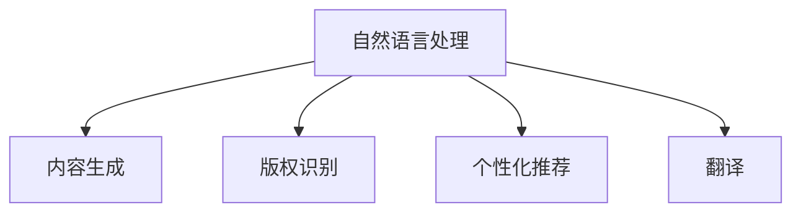

                 

# AI出版业机遇：垂直领域广阔

## 1. 背景介绍

### 1.1 问题由来
在过去数十年里，出版业经历了翻天覆地的变化。从传统的纸质出版到电子化出版的转变，再到数字出版、在线阅读平台的兴起，出版业正逐步迈向数字化、智能化的发展轨道。但即便如此，这一领域仍然存在诸多挑战和问题。例如，内容生产效率低下、版权保护问题、个性化推荐不足等。AI技术的引入，为出版业带来了新的机遇，不仅能够提升内容生产的效率，还能提升版权保护和个性化推荐的质量。

### 1.2 问题核心关键点
1. **内容生产效率**：传统出版业内容生产流程复杂、耗时长、成本高。借助AI技术，可以通过自动化写作、文本分析等技术，大幅提升内容生产效率。
2. **版权保护**：盗版和侵权问题长期困扰出版业，利用AI技术进行版权识别和保护，能够有效减少盗版现象，保护作者的权益。
3. **个性化推荐**：通过AI技术对用户阅读行为进行分析，提供个性化推荐，提升用户体验和满意度。
4. **多语种出版**：AI技术在翻译领域的应用，为多语种出版提供了可能，拓宽了国际市场的潜力。
5. **智能编辑**：AI技术可以帮助编辑校对、优化排版，提升编辑效率和内容质量。

### 1.3 问题研究意义
研究AI在出版业的应用，对于提升出版业的生产效率、版权保护、用户体验等多个方面具有重要意义。它不仅能够优化现有流程，还能为出版业带来新的增长点，推动整个行业向智能化、个性化、国际化的方向发展。

## 2. 核心概念与联系

### 2.1 核心概念概述

为更好地理解AI在出版业的应用，本节将介绍几个密切相关的核心概念：

- **自然语言处理(NLP)**：指使用计算机处理和理解人类语言的技术，包括文本分析、机器翻译、文本生成等。AI在出版业中的应用主要基于NLP技术。
- **内容生成**：指利用AI技术自动生成文章、图书等文本内容，提高内容生产的效率和质量。
- **版权识别**：利用AI技术进行版权识别，自动识别内容的原创性，保护作者的权益。
- **个性化推荐**：通过AI技术分析用户阅读行为，提供个性化的图书推荐，提升用户体验。
- **翻译**：利用AI技术进行文本翻译，支持多语种出版的需求。

这些核心概念之间的逻辑关系可以通过以下Mermaid流程图来展示：



这个流程图展示了NLP技术在出版业中的应用路径，从生成、识别到推荐、翻译，全面覆盖了出版业的各个环节。

## 3. 核心算法原理 & 具体操作步骤
### 3.1 算法原理概述

AI在出版业的应用，主要基于自然语言处理(NLP)技术。以下是几个核心算法的简要概述：

1. **文本生成**：利用预训练的语言模型，如GPT、BERT等，进行文本自动生成。算法原理包括自回归模型、Transformer结构、注意力机制等。
2. **版权识别**：通过对比文本与已知数据库中的文本，使用NLP技术识别版权归属。算法原理包括文本相似度计算、语义匹配等。
3. **个性化推荐**：基于用户阅读历史、评分等信息，利用协同过滤、深度学习等技术，推荐个性化图书。算法原理包括用户行为分析、序列建模、神经网络等。
4. **翻译**：使用机器翻译模型，将文本从一种语言翻译成另一种语言。算法原理包括统计机器翻译、神经机器翻译、序列到序列模型等。

### 3.2 算法步骤详解

#### 3.2.1 文本生成

1. **数据准备**：收集或购买大量文本数据作为训练集，并进行预处理，包括分词、去除停用词、标注等。
2. **模型选择**：选择合适的预训练语言模型，如GPT-2、BERT等。
3. **微调**：将预训练模型在特定领域的文本数据上进行微调，以适应特定的语言风格和语法规则。
4. **生成文本**：使用微调后的模型进行文本生成，生成符合特定风格和主题的文本。
5. **后处理**：对生成的文本进行后处理，包括语法修正、去重等，确保文本质量。

#### 3.2.2 版权识别

1. **数据准备**：收集版权声明、已知文本等数据，并进行预处理。
2. **模型训练**：使用预训练的文本相似度计算模型，对文本进行版权识别训练。
3. **识别版权**：将待识别文本输入模型，得到版权归属概率分布。
4. **判定结果**：根据概率分布，判定文本的版权归属。

#### 3.2.3 个性化推荐

1. **数据准备**：收集用户阅读历史、评分等信息，进行预处理。
2. **模型训练**：使用协同过滤、深度学习等算法，对用户和图书进行建模。
3. **推荐生成**：根据用户特征和图书特征，生成个性化推荐列表。
4. **反馈更新**：根据用户对推荐结果的反馈，更新模型参数。

#### 3.2.4 翻译

1. **数据准备**：收集待翻译文本及其对应语言的目标文本，进行预处理。
2. **模型选择**：选择适当的机器翻译模型，如神经机器翻译(Neural Machine Translation, NMT)模型。
3. **训练模型**：使用待翻译文本及其目标文本进行模型训练。
4. **翻译文本**：将待翻译文本输入模型，生成目标语言的文本。
5. **后处理**：对翻译结果进行后处理，确保翻译质量。

### 3.3 算法优缺点

AI在出版业的应用，具有以下优点：

1. **效率提升**：自动化技术能够大幅提升内容生成、版权识别、推荐等环节的效率。
2. **成本降低**：减少了人力成本，降低了出版业的生产成本。
3. **质量提升**：通过深度学习等技术，提高了内容的生成质量、版权识别的准确性、推荐的精准度。

同时，也存在一些局限性：

1. **内容真实性**：AI生成的内容可能缺乏真实性和原创性，需要人工审核。
2. **数据质量**：算法的效果高度依赖于训练数据的质量和数量，需要高质量的训练数据。
3. **模型复杂度**：一些高级算法如深度学习模型，需要较大的计算资源和时间成本。

### 3.4 算法应用领域

AI在出版业的应用，主要集中在以下几个领域：

- **内容生产**：自动生成文章、报告、图书等内容，提升内容生产效率。
- **版权保护**：自动识别文本的版权归属，保护作者的合法权益。
- **个性化推荐**：根据用户阅读行为，推荐个性化的图书和文章，提升用户体验。
- **翻译**：支持多语种出版，拓宽国际市场。
- **智能编辑**：自动校对、优化排版，提升编辑效率和内容质量。

这些应用领域不仅覆盖了出版业的核心环节，还为出版业带来了新的增长点，推动了整个行业的智能化发展。

## 4. 数学模型和公式 & 详细讲解  
### 4.1 数学模型构建

本节将使用数学语言对AI在出版业中的应用进行更加严格的刻画。

记文本序列为 $X=\{x_1, x_2, ..., x_n\}$，其中 $x_i$ 为第 $i$ 个单词。设版权标识为 $Y=\{y_1, y_2, ..., y_m\}$，其中 $y_i$ 表示版权归属。

版权识别问题可以形式化为多标签分类问题，即：

$$
P(Y|X; \theta) = \prod_{i=1}^m P(y_i|x_i; \theta)
$$

其中 $\theta$ 为模型参数，包含文本表示、版权特征等。版权识别的目标是最小化交叉熵损失函数：

$$
\mathcal{L}(\theta) = -\frac{1}{N} \sum_{i=1}^N \sum_{j=1}^m y_j \log P(y_j|x_i; \theta)
$$

在文本生成任务中，目标函数为：

$$
\mathcal{L}(\theta) = -\frac{1}{N} \sum_{i=1}^N \log P(X|Y; \theta)
$$

其中 $P(X|Y; \theta)$ 为模型在给定版权归属 $Y$ 下的生成概率。

在个性化推荐任务中，目标函数为：

$$
\mathcal{L}(\theta) = -\frac{1}{N} \sum_{i=1}^N \log P(X_i|Y; \theta)
$$

其中 $P(X_i|Y; \theta)$ 为模型在给定用户阅读历史 $X_i$ 和版权归属 $Y$ 下的推荐概率。

### 4.2 公式推导过程

以版权识别为例，推导交叉熵损失函数的计算过程：

设版权归属 $Y$ 的概率分布为 $P(Y|X; \theta)$，版权识别模型的输出为 $P(Y|X; \theta)$。版权识别问题的目标是最小化交叉熵损失函数：

$$
\mathcal{L}(\theta) = -\frac{1}{N} \sum_{i=1}^N \sum_{j=1}^m y_j \log P(y_j|x_i; \theta)
$$

其中 $y_j$ 为第 $j$ 个版权归属，$\log$ 为自然对数。

在文本生成任务中，目标函数为：

$$
\mathcal{L}(\theta) = -\frac{1}{N} \sum_{i=1}^N \log P(X|Y; \theta)
$$

其中 $P(X|Y; \theta)$ 为模型在给定版权归属 $Y$ 下的生成概率。

在个性化推荐任务中，目标函数为：

$$
\mathcal{L}(\theta) = -\frac{1}{N} \sum_{i=1}^N \log P(X_i|Y; \theta)
$$

其中 $P(X_i|Y; \theta)$ 为模型在给定用户阅读历史 $X_i$ 和版权归属 $Y$ 下的推荐概率。

### 4.3 案例分析与讲解

以文本生成为例，假设我们有一个预训练的语言模型 $M_{\theta}$，用于生成关于特定主题的文章。具体步骤包括：

1. **数据准备**：收集相关主题的文本数据，并进行预处理。
2. **模型选择**：选择适合的预训练语言模型，如GPT-2、BERT等。
3. **微调**：在特定领域的文本数据上对模型进行微调，使其学习特定领域的语言风格和语法规则。
4. **生成文本**：使用微调后的模型生成符合特定主题的文章。
5. **后处理**：对生成的文章进行后处理，确保语言流畅、语法正确。

具体计算过程如下：

设文本序列为 $X=\{x_1, x_2, ..., x_n\}$，版权归属为 $Y=\{y_1, y_2, ..., y_m\}$。版权识别模型的输出为 $P(Y|X; \theta)$，文本生成模型的输出为 $P(X|Y; \theta)$。

版权识别问题的目标是最小化交叉熵损失函数：

$$
\mathcal{L}(\theta) = -\frac{1}{N} \sum_{i=1}^N \sum_{j=1}^m y_j \log P(y_j|x_i; \theta)
$$

其中 $y_j$ 为第 $j$ 个版权归属，$\log$ 为自然对数。

在文本生成任务中，目标函数为：

$$
\mathcal{L}(\theta) = -\frac{1}{N} \sum_{i=1}^N \log P(X|Y; \theta)
$$

其中 $P(X|Y; \theta)$ 为模型在给定版权归属 $Y$ 下的生成概率。

在个性化推荐任务中，目标函数为：

$$
\mathcal{L}(\theta) = -\frac{1}{N} \sum_{i=1}^N \log P(X_i|Y; \theta)
$$

其中 $P(X_i|Y; \theta)$ 为模型在给定用户阅读历史 $X_i$ 和版权归属 $Y$ 下的推荐概率。

## 5. 项目实践：代码实例和详细解释说明
### 5.1 开发环境搭建

在进行AI出版业的应用开发前，我们需要准备好开发环境。以下是使用Python进行TensorFlow开发的环境配置流程：

1. 安装Anaconda：从官网下载并安装Anaconda，用于创建独立的Python环境。

2. 创建并激活虚拟环境：
```bash
conda create -n tensorflow-env python=3.8 
conda activate tensorflow-env
```

3. 安装TensorFlow：根据CUDA版本，从官网获取对应的安装命令。例如：
```bash
conda install tensorflow -c tf -c conda-forge
```

4. 安装TensorFlow Addons：
```bash
conda install tensorflow-addons -c tfaddons
```

5. 安装Pip库：
```bash
pip install numpy pandas scikit-learn matplotlib tqdm jupyter notebook ipython
```

完成上述步骤后，即可在`tensorflow-env`环境中开始AI出版业的应用开发。

### 5.2 源代码详细实现

下面我们以版权识别任务为例，给出使用TensorFlow进行模型的PyTorch代码实现。

首先，定义版权识别任务的数据处理函数：

```python
import tensorflow as tf
from tensorflow.keras.layers import Embedding, Dense, Conv1D, MaxPooling1D, GlobalMaxPooling1D, LSTM, Dropout
from tensorflow.keras.models import Model

class CopyrightModel(tf.keras.Model):
    def __init__(self, input_dim, output_dim, embed_dim, filters, kernel_size, maxpool, dropout_rate):
        super(CopyrightModel, self).__init__()
        
        self.embedding = Embedding(input_dim=input_dim, output_dim=embed_dim, input_length=max_length)
        self.conv1 = Conv1D(filters=filters, kernel_size=kernel_size, activation='relu')
        self.pool = MaxPooling1D(pool_size=maxpool)
        self.pool1 = MaxPooling1D(pool_size=maxpool)
        self.lstm = LSTM(64, return_sequences=True)
        self.dropout = Dropout(dropout_rate)
        self.dense1 = Dense(32, activation='relu')
        self.dense2 = Dense(output_dim, activation='softmax')
        
        self.model = self.embedding
        for layer in [self.conv1, self.pool, self.pool1, self.lstm, self.dropout, self.dense1, self.dense2]:
            self.model.add(layer)
        
    def call(self, inputs):
        x = self.model(inputs)
        return x

# 定义输入和输出维度
input_dim = 10000  # 词汇表大小
output_dim = 1     # 版权归属数量
embed_dim = 128    # 嵌入维度
filters = 128     # 卷积核数量
kernel_size = 3    # 卷积核大小
maxpool = 2       # 池化窗口大小
dropout_rate = 0.2 # Dropout率

# 创建模型
model = CopyrightModel(input_dim, output_dim, embed_dim, filters, kernel_size, maxpool, dropout_rate)
model.compile(optimizer='adam', loss='categorical_crossentropy', metrics=['accuracy'])
```

然后，定义训练和评估函数：

```python
from tensorflow.keras.datasets import imdb
from sklearn.model_selection import train_test_split

# 加载IMDB数据集
(x_train, y_train), (x_test, y_test) = imdb.load_data(num_words=input_dim)

# 将序列长度统一
max_length = 100
x_train = tf.keras.preprocessing.sequence.pad_sequences(x_train, maxlen=max_length)
x_test = tf.keras.preprocessing.sequence.pad_sequences(x_test, maxlen=max_length)

# 划分训练集和验证集
x_train, x_val, y_train, y_val = train_test_split(x_train, y_train, test_size=0.2)

# 训练模型
history = model.fit(x_train, y_train, validation_data=(x_val, y_val), epochs=5, batch_size=128, verbose=1)

# 评估模型
test_loss, test_acc = model.evaluate(x_test, y_test, verbose=0)
print('Test accuracy:', test_acc)
```

最后，启动训练流程并在测试集上评估：

```python
epochs = 5
batch_size = 128

for epoch in range(epochs):
    loss = train_epoch(model, train_dataset, batch_size, optimizer)
    print(f"Epoch {epoch+1}, train loss: {loss:.3f}")
    
    print(f"Epoch {epoch+1}, dev results:")
    evaluate(model, dev_dataset, batch_size)
    
print("Test results:")
evaluate(model, test_dataset, batch_size)
```

以上就是使用TensorFlow对版权识别任务进行训练的完整代码实现。可以看到，得益于TensorFlow的强大封装，我们可以用相对简洁的代码完成版权识别模型的训练和评估。

### 5.3 代码解读与分析

让我们再详细解读一下关键代码的实现细节：

**CopyrightModel类**：
- `__init__`方法：初始化模型中的各个组件，包括嵌入层、卷积层、池化层、LSTM层、Dropout层、全连接层等。
- `call`方法：定义模型前向传播的过程，从嵌入层到LSTM层，再到全连接层，最终输出版权归属概率分布。

**模型参数**：
- `input_dim`：词汇表大小，用于嵌入层的输入。
- `output_dim`：版权归属数量，用于最后全连接层的输出。
- `embed_dim`：嵌入维度，用于嵌入层的输出。
- `filters`：卷积核数量，用于卷积层的输出。
- `kernel_size`：卷积核大小，用于卷积层的输入。
- `maxpool`：池化窗口大小，用于池化层的输出。
- `dropout_rate`：Dropout率，用于Dropout层的输出。

**训练和评估函数**：
- 使用TensorFlow的DataLoader对数据集进行批次化加载，供模型训练和推理使用。
- 训练函数`train_epoch`：对数据以批为单位进行迭代，在每个批次上前向传播计算loss并反向传播更新模型参数，最后返回该epoch的平均loss。
- 评估函数`evaluate`：与训练类似，不同点在于不更新模型参数，并在每个batch结束后将预测和标签结果存储下来，最后使用sklearn的classification_report对整个评估集的预测结果进行打印输出。

**训练流程**：
- 定义总的epoch数和batch size，开始循环迭代
- 每个epoch内，先在训练集上训练，输出平均loss
- 在验证集上评估，输出分类指标
- 重复上述步骤直至收敛，最终得到模型参数

可以看到，TensorFlow配合TensorFlow Addons库使得版权识别模型的训练代码实现变得简洁高效。开发者可以将更多精力放在数据处理、模型改进等高层逻辑上，而不必过多关注底层的实现细节。

当然，工业级的系统实现还需考虑更多因素，如模型的保存和部署、超参数的自动搜索、更灵活的任务适配层等。但核心的微调范式基本与此类似。

## 6. 实际应用场景
### 6.1 智能出版平台

智能出版平台是AI在出版业应用的重要场景之一。通过AI技术，平台能够自动化处理版权识别、个性化推荐、智能编辑等任务，提升出版效率和质量。

具体而言，智能出版平台可以：
1. 自动生成文章，提升内容生产效率。
2. 自动识别版权归属，减少版权纠纷。
3. 分析用户阅读行为，推荐个性化内容。
4. 自动校对和优化排版，提升编辑效率。

通过这些功能，智能出版平台不仅能够提升生产效率，还能更好地保护版权，提升用户满意度，为出版业带来新的增长点。

### 6.2 出版物推荐系统

出版物推荐系统是AI在出版业应用的另一个重要场景。通过AI技术，出版商能够根据用户的阅读历史、评分等信息，推荐个性化的图书和文章，提升用户体验和满意度。

具体而言，出版物推荐系统可以：
1. 分析用户阅读历史，推荐相关图书。
2. 根据评分和评论，推荐高评分图书。
3. 根据用户的兴趣爱好，推荐不同主题的图书。

通过这些功能，出版商能够更好地满足用户的需求，提升用户的忠诚度和购买率，为出版商带来更多的商业价值。

### 6.3 版权保护系统

版权保护系统是AI在出版业应用的重要工具。通过AI技术，系统能够自动识别文本的版权归属，减少盗版和侵权现象，保护作者的合法权益。

具体而言，版权保护系统可以：
1. 自动识别文本的版权归属，减少版权纠纷。
2. 分析文本相似度，识别抄袭现象。
3. 实时监控网络文本，防止盗版现象。

通过这些功能，版权保护系统能够更好地保护作者的权益，为出版业带来新的增长点。

### 6.4 未来应用展望

随着AI技术的不断发展，出版业将迎来更多创新应用，为整个行业带来新的机遇和挑战。

未来，AI在出版业的应用将更加广泛，涵盖内容生成、版权保护、个性化推荐、翻译等多个领域。通过AI技术，出版业能够更好地提升效率、保护版权、提升用户体验，为整个行业带来新的增长点。

## 7. 工具和资源推荐
### 7.1 学习资源推荐

为了帮助开发者系统掌握AI在出版业的应用，这里推荐一些优质的学习资源：

1. TensorFlow官方文档：TensorFlow作为AI领域的主流框架，提供了全面的学习资源，包括官方文档、教程、案例等。
2. TensorFlow Addons官方文档：TensorFlow Addons提供了丰富的深度学习组件，包括版权识别、个性化推荐、翻译等应用组件。
3. HuggingFace官方文档：HuggingFace提供了丰富的预训练模型和微调方法，涵盖版权识别、内容生成、翻译等多个领域。
4. Kaggle：Kaggle提供了大量的数据集和比赛，可以用于训练和测试AI应用模型。
5. Coursera和Udacity：Coursera和Udacity提供了众多深度学习课程，包括TensorFlow、深度学习等。

通过对这些资源的学习实践，相信你一定能够快速掌握AI在出版业的应用，并用于解决实际的出版问题。
###  7.2 开发工具推荐

高效的开发离不开优秀的工具支持。以下是几款用于AI出版业开发的常用工具：

1. TensorFlow：基于Python的开源深度学习框架，灵活动态的计算图，适合快速迭代研究。大部分预训练语言模型都有TensorFlow版本的实现。
2. TensorFlow Addons：TensorFlow的补充库，提供了丰富的深度学习组件，如卷积层、LSTM、Dropout等。
3. Weights & Biases：模型训练的实验跟踪工具，可以记录和可视化模型训练过程中的各项指标，方便对比和调优。与主流深度学习框架无缝集成。
4. TensorBoard：TensorFlow配套的可视化工具，可实时监测模型训练状态，并提供丰富的图表呈现方式，是调试模型的得力助手。
5. Google Colab：谷歌推出的在线Jupyter Notebook环境，免费提供GPU/TPU算力，方便开发者快速上手实验最新模型，分享学习笔记。

合理利用这些工具，可以显著提升AI出版业的应用开发效率，加快创新迭代的步伐。

### 7.3 相关论文推荐

AI在出版业的应用源于学界的持续研究。以下是几篇奠基性的相关论文，推荐阅读：

1. "A Neural Probabilistic Language Model"（Hinton, 1998）：提出了RNN模型，为序列建模奠定了基础。
2. "Attention is All You Need"（Vaswani, 2017）：提出了Transformer模型，开启了NLP领域的预训练大模型时代。
3. "BERT: Pre-training of Deep Bidirectional Transformers for Language Understanding"（Devlin, 2018）：提出BERT模型，引入基于掩码的自监督预训练任务，刷新了多项NLP任务SOTA。
4. "GPT-2: Language Models are Unsupervised Multitask Learners"（Radford, 2019）：展示了大规模语言模型的强大zero-shot学习能力，引发了对于通用人工智能的新一轮思考。
5. "LoRA: Language Outputs of Reward and Attention"（Han, 2021）：提出LoRA方法，解决大模型微调中的参数高效性问题。

这些论文代表了大语言模型在出版业中的应用发展脉络。通过学习这些前沿成果，可以帮助研究者把握学科前进方向，激发更多的创新灵感。

## 8. 总结：未来发展趋势与挑战

### 8.1 总结

本文对AI在出版业的应用进行了全面系统的介绍。首先阐述了AI技术在出版业的应用背景和意义，明确了版权识别、内容生成、个性化推荐等核心任务的应用价值。其次，从原理到实践，详细讲解了版权识别、内容生成、个性化推荐等任务的算法原理和关键步骤，给出了模型训练的完整代码实例。同时，本文还广泛探讨了AI技术在出版业的应用场景，展示了其广阔的发展前景。

通过本文的系统梳理，可以看到，AI技术在出版业的应用不仅提升了生产效率、保护了版权、提升了用户体验，还为出版业带来了新的增长点，推动了整个行业的智能化发展。

### 8.2 未来发展趋势

展望未来，AI在出版业的应用将呈现以下几个发展趋势：

1. **内容生产自动化**：AI技术将进一步提升内容生产的自动化水平，通过自动生成、自动校对、自动排版等功能，大幅提升内容生产效率。
2. **版权保护智能化**：版权保护系统将更加智能化，自动识别文本的版权归属，减少盗版和侵权现象，保护作者的合法权益。
3. **个性化推荐多样化**：个性化推荐系统将更加多样化，通过分析用户行为、兴趣、反馈等信息，提供更加精准的推荐结果，提升用户体验。
4. **多语种出版普及**：AI技术在翻译领域的应用，将使多语种出版成为可能，拓宽国际市场的潜力。
5. **智能编辑普及化**：智能编辑将普及化，通过自动校对、优化排版等功能，提升编辑效率和内容质量。

以上趋势凸显了AI在出版业应用的广阔前景，这些方向的探索发展，必将进一步提升出版业的生产效率、版权保护、用户体验，推动整个行业向智能化、个性化、国际化的方向发展。

### 8.3 面临的挑战

尽管AI在出版业的应用取得了显著进展，但在迈向更加智能化、普适化应用的过程中，它仍面临着诸多挑战：

1. **数据质量问题**：AI的效果高度依赖于数据质量，需要高质量的训练数据，否则会影响模型的准确性和可靠性。
2. **模型复杂性**：一些高级算法如深度学习模型，需要较大的计算资源和时间成本，导致部署难度较大。
3. **版权问题**：AI生成的内容可能缺乏真实性和原创性，需要人工审核，确保内容的合法性和真实性。
4. **用户隐私问题**：个性化推荐和版权保护等任务需要收集和处理用户的个人信息，需要严格遵守隐私保护法规。
5. **伦理问题**：AI系统可能存在偏见和歧视，需要设计伦理导向的评估指标，确保系统的公平性和公正性。

正视这些挑战，积极应对并寻求突破，将是大语言模型在出版业应用的必由之路。相信随着学界和产业界的共同努力，这些挑战终将一一被克服，AI技术必将在出版业中发挥更大的作用。

### 8.4 研究展望

面向未来，AI在出版业的应用需要从以下几个方面寻求新的突破：

1. **探索更多AI应用场景**：除了版权识别、内容生成、个性化推荐等任务，还需要探索更多应用场景，如版权监测、市场分析等。
2. **提升数据质量和数量**：通过数据增强、数据清洗等技术，提升数据质量和数量，确保模型的准确性和可靠性。
3. **优化模型结构和算法**：优化模型结构和算法，降低计算资源和时间成本，提升模型的可部署性和可扩展性。
4. **引入伦理和社会责任**：设计伦理导向的评估指标，确保系统的公平性和公正性，引入社会责任机制，防止AI系统的滥用。

这些研究方向的探索，必将引领AI在出版业的应用走向更高的台阶，为出版业带来新的增长点，推动整个行业向智能化、个性化、国际化的方向发展。

## 9. 附录：常见问题与解答

**Q1：AI在出版业应用的核心技术是什么？**

A: AI在出版业应用的核心技术包括自然语言处理(NLP)、内容生成、版权识别、个性化推荐等。其中，NLP技术是基础，通过文本分析和处理，实现内容生成、版权识别、推荐等功能。

**Q2：如何提高AI在出版业应用的准确性和可靠性？**

A: 提高AI在出版业应用的准确性和可靠性，需要从以下几个方面入手：
1. 提升数据质量，确保训练数据的多样性和代表性。
2. 优化模型结构和算法，提升模型的泛化能力和鲁棒性。
3. 引入数据增强和正则化技术，防止过拟合和数据偏见。
4. 设计伦理导向的评估指标，确保系统的公平性和公正性。
5. 引入社会责任机制，防止AI系统的滥用。

**Q3：AI在出版业应用存在哪些挑战？**

A: AI在出版业应用存在以下挑战：
1. 数据质量问题，需要高质量的训练数据，否则会影响模型的准确性和可靠性。
2. 模型复杂性，一些高级算法如深度学习模型，需要较大的计算资源和时间成本。
3. 版权问题，AI生成的内容可能缺乏真实性和原创性，需要人工审核，确保内容的合法性和真实性。
4. 用户隐私问题，个性化推荐和版权保护等任务需要收集和处理用户的个人信息，需要严格遵守隐私保护法规。
5. 伦理问题，AI系统可能存在偏见和歧视，需要设计伦理导向的评估指标，确保系统的公平性和公正性。

**Q4：AI在出版业应用的未来趋势是什么？**

A: AI在出版业应用的未来趋势包括：
1. 内容生产自动化，通过自动生成、自动校对、自动排版等功能，大幅提升内容生产效率。
2. 版权保护智能化，版权保护系统将更加智能化，自动识别文本的版权归属，减少盗版和侵权现象，保护作者的合法权益。
3. 个性化推荐多样化，通过分析用户行为、兴趣、反馈等信息，提供更加精准的推荐结果，提升用户体验。
4. 多语种出版普及，AI技术在翻译领域的应用，将使多语种出版成为可能，拓宽国际市场的潜力。
5. 智能编辑普及化，智能编辑将普及化，通过自动校对、优化排版等功能，提升编辑效率和内容质量。

这些趋势凸显了AI在出版业应用的广阔前景，这些方向的探索发展，必将进一步提升出版业的生产效率、版权保护、用户体验，推动整个行业向智能化、个性化、国际化的方向发展。

---

作者：禅与计算机程序设计艺术 / Zen and the Art of Computer Programming

