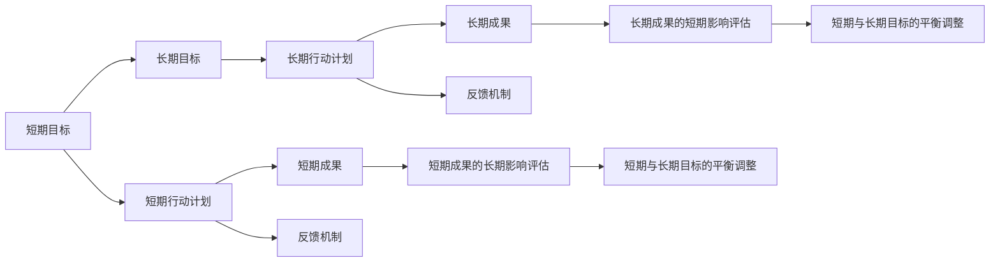

                 

# AI创业公司如何平衡短期与长期目标?

> 关键词：AI创业公司,短期目标,长期目标,平衡策略,业务增长,技术创新,人才管理,数据策略,投资策略

## 1. 背景介绍

在当今这个快速变化的市场环境中，AI创业公司面临着众多挑战，其中最关键的挑战之一是如何平衡短期目标和长期目标。在快速成长的压力下，企业需要迅速响应市场变化，抓住机会，但同时也要为未来持续发展打下坚实的基础。本文将探讨AI创业公司在平衡短期与长期目标方面所面临的挑战，并提出一些策略和方法来帮助公司实现这一平衡。

## 2. 核心概念与联系

### 2.1 核心概念概述

为了更好地理解如何在AI创业公司中平衡短期与长期目标，本文将首先介绍几个核心概念：

- **短期目标 (Short-term Goals)**: 这些目标通常是在较短的时间内（如1年或更短时间）实现，旨在迅速增加收入、提高市场份额或解决特定问题。
- **长期目标 (Long-term Goals)**: 这些目标旨在在未来（如5年或更长时间）实现，涉及公司核心能力的建设、技术的研发、品牌的建立和市场的渗透。
- **平衡策略 (Balancing Strategy)**: 指如何在追求短期目标的同时，不失对长期目标的关注，从而实现公司的持续增长和发展。

### 2.2 核心概念原理和架构的 Mermaid 流程图(Mermaid 流程节点中不要有括号、逗号等特殊字符)



这个流程图展示了短期目标与长期目标之间的相互作用。短期行动计划（B）和长期行动计划（D）分别对应短期目标（A）和长期目标（C）。短期成果（E）和长期成果（F）分别来自短期行动计划（B）和长期行动计划（D）。此外，反馈机制（G和H）确保了短期和长期目标之间的动态平衡，而评估和调整（I和J）保证了公司能够不断优化其策略。

## 3. 核心算法原理 & 具体操作步骤

### 3.1 算法原理概述

平衡短期与长期目标的算法原理主要集中在资源分配、项目优先级设定和进度跟踪上。核心思想是将公司的资源、时间和精力合理分配给短期和长期目标，确保每个阶段都能取得进展，同时为未来的发展铺平道路。

### 3.2 算法步骤详解

1. **目标设定**: 首先，公司需要明确其短期和长期目标。这些目标应该是SMART（具体、可衡量、可实现、相关和有时限）的，并且应当具有战略意义。

2. **资源评估**: 评估公司可用于短期和长期目标的资源（如资金、人力、时间），并确保资源的合理分配。

3. **优先级排序**: 根据目标的重要性和紧急性，对短期和长期目标进行优先级排序。这可以通过建立加权评分系统来实现。

4. **行动计划制定**: 为每个目标制定详细的行动计划，包括具体的步骤、所需资源、时间表和负责人。

5. **执行与监控**: 执行行动计划，并定期监控进展情况。使用项目管理工具可以帮助团队跟踪进度。

6. **反馈与调整**: 根据实际进展和反馈调整行动计划。如果短期目标影响长期目标，公司需要灵活调整策略以保持平衡。

### 3.3 算法优缺点

**优点**:
- **灵活性**: 通过优先级排序和动态调整，公司可以在不断变化的市场环境中保持灵活性。
- **风险管理**: 明确区分短期和长期目标有助于公司识别和管理风险。
- **资源优化**: 合理分配资源可以最大化利用有限的资源。

**缺点**:
- **短视行为**: 过于关注短期目标可能导致忽视长期目标。
- **执行力不足**: 复杂的目标管理和动态调整可能导致执行效率降低。
- **决策困难**: 短期和长期目标之间的冲突可能导致决策困难。

### 3.4 算法应用领域

这些策略广泛应用于各个行业的AI创业公司，包括但不限于：

- **金融科技 (FinTech)**: 快速推出新功能与提升市场份额。
- **医疗健康 (Healthcare)**: 开发新药物与提高诊断精度。
- **零售电商 (Retail E-commerce)**: 增强用户体验与提升销售量。
- **自动驾驶 (Autonomous Driving)**: 实现技术突破与拓展市场份额。

## 4. 数学模型和公式 & 详细讲解 & 举例说明（备注：数学公式请使用latex格式，latex嵌入文中独立段落使用 $$，段落内使用 $)
### 4.1 数学模型构建

为了构建一个数学模型来模拟AI创业公司在短期和长期目标之间的平衡，我们假设公司有$n$个目标，其中$i$个是短期的，$n-i$个是长期的。每个目标$i$的权重为$w_i$，完成时间$t_i$，初始成本$C_i$和预期的回报$R_i$。

$$\text{Total Cost} = \sum_{i=1}^{n} C_i + \sum_{j=i+1}^{n} t_j \cdot C_j$$

$$\text{Total Revenue} = \sum_{i=1}^{n} R_i$$

$$\text{ROI} = \frac{\text{Total Revenue}}{\text{Total Cost}}$$

### 4.2 公式推导过程

公式推导基于加权决策模型，考虑了每个目标的权重、时间成本和回报。总成本包括初始成本和随时间累积的成本。总回报是所有目标的预期回报之和。投资回报率(ROI)是总回报与总成本的比率，用以评估公司在资源分配上的效率。

### 4.3 案例分析与讲解

假设一家AI创业公司有两个目标：

- 短期目标：开发并推出一个新产品。成本为$C=1000000$，时间$t=1$年，预期回报$R=500000$。
- 长期目标：建立一个研发中心，成本为$C=10000000$，时间$t=5$年，预期回报$R=20000000$。

首先，计算总成本和总回报：

$$\text{Total Cost} = 1000000 + 10000000 = 11000000$$
$$\text{Total Revenue} = 500000 + 20000000 = 20500000$$

然后计算ROI：

$$\text{ROI} = \frac{20500000}{11000000} = 1.87$$

这意味着公司在资源分配上的效率非常高，但如果过于优先短期目标，可能会牺牲长期发展的潜力。

## 5. 项目实践：代码实例和详细解释说明

### 5.1 开发环境搭建

1. **安装Python**: 在所有开发机器上安装Python 3.x，并配置虚拟环境（例如，使用Anaconda或Pyenv）。
2. **安装相关库**: 安装必要的库，如pandas、numpy、scikit-learn、matplotlib等。
3. **设置项目管理工具**: 选择适当的项目管理工具，如JIRA、Trello或Asana，来跟踪任务和进度。

### 5.2 源代码详细实现

以下是一个简单的Python代码示例，用于计算目标的权重、时间和成本，并评估ROI。

```python
import numpy as np

class Target:
    def __init__(self, weight, time, cost, revenue):
        self.weight = weight
        self.time = time
        self.cost = cost
        self.revenue = revenue
    
    def calculate_roi(self):
        total_cost = sum([self.cost, (self.time - 1) * cost])
        total_revenue = sum([self.revenue, (self.time - 1) * revenue])
        return total_revenue / total_cost

targets = [
    Target(0.5, 1, 1000000, 500000),
    Target(0.5, 5, 10000000, 20000000)
]

for target in targets:
    print(f"ROI for {target}: {target.calculate_roi()}")
```

### 5.3 代码解读与分析

该代码示例展示了如何使用Python计算每个目标的ROI。首先定义了一个`Target`类，用于存储目标的权重、时间、成本和收益。然后，计算每个目标的ROI，并输出结果。

## 6. 实际应用场景

### 6.1 金融科技 (FinTech)

在金融科技领域，公司可能会同时面对多个短期和长期目标。例如，短期目标可能包括推出新的支付平台或金融服务，而长期目标可能包括开发新的风险管理算法或建立数据安全基础设施。通过平衡这两个目标，公司可以迅速响应市场需求，同时为未来的发展打下基础。

### 6.2 医疗健康 (Healthcare)

医疗健康领域的AI创业公司可能需要在短期内推出新药物或诊断工具，同时长期投入于建立数据平台和算法研究。这可以通过动态调整资源分配和优先级排序来实现，确保公司在快速增长和长远发展之间保持平衡。

### 6.3 零售电商 (Retail E-commerce)

零售电商公司可能需要在短期内提升在线销售和用户体验，同时长期投资于物流优化、供应链管理和人工智能技术的开发。通过明确短期和长期目标，并制定相应的行动计划，公司可以既满足即时需求，又为未来的增长做准备。

### 6.4 自动驾驶 (Autonomous Driving)

自动驾驶技术的发展涉及多个复杂的短期和长期目标，如提升驾驶安全、减少交通拥堵和实现完全自动驾驶。通过平衡这些目标，公司可以逐步实现技术突破，同时确保市场的持续增长。

## 7. 工具和资源推荐

### 7.1 学习资源推荐

1. **书籍**: 《平衡法则：组织中的短期与长期目标管理》（The Balance Sheet: Managing Short and Long-Term Goals in Organizations），作者：Michael Porter。
2. **在线课程**: Coursera上的《组织行为学》（Organizational Behavior）课程，由宾夕法尼亚大学沃顿商学院提供。
3. **研讨会**: “平衡短期与长期目标”研讨会，涵盖理论、策略和实践。

### 7.2 开发工具推荐

1. **项目管理工具**: JIRA、Trello、Asana等，帮助团队跟踪任务和进度。
2. **资源优化工具**: 谷歌云平台、AWS、Azure等云服务提供商提供的自动化工具。
3. **数据分析工具**: Tableau、Power BI等数据可视化工具，帮助公司分析数据和决策。

### 7.3 相关论文推荐

1. **“短期与长期目标的平衡管理”**: A study on the balance of short-term and long-term goals, by Tom Peters.
2. **“目标管理理论与实践”**: “Goal Setting Theory” by Edwin Locke and Gary Latham.

## 8. 总结：未来发展趋势与挑战

### 8.1 研究成果总结

本文通过深入探讨AI创业公司在平衡短期与长期目标时所面临的挑战和策略，帮助公司更好地理解如何有效管理资源，优化项目优先级，从而实现持续增长。

### 8.2 未来发展趋势

未来的发展趋势包括：

- **技术融合**: AI与区块链、物联网、大数据等技术的深度融合。
- **全球化**: 公司将面临更广泛的全球市场，需要更好地管理跨文化团队和地域差异。
- **可持续发展**: 公司需要更加注重环境保护和可持续发展目标。

### 8.3 面临的挑战

面临的挑战包括：

- **数据隐私**: 如何在保护用户隐私的同时利用大数据分析。
- **道德与伦理**: 确保AI技术的应用符合道德和伦理标准。
- **法律法规**: 符合各国法律法规，避免法律风险。

### 8.4 研究展望

未来的研究应该专注于：

- **多目标优化算法**: 开发更有效的多目标优化算法，帮助公司在短期与长期目标之间取得最佳平衡。
- **自动化决策系统**: 通过自动化决策系统，提高资源的有效利用和管理效率。
- **持续学习与改进**: 采用机器学习算法，不断优化资源分配和目标管理策略。

## 9. 附录：常见问题与解答

**Q1: 如何确定短期和长期目标的优先级？**

A: 通过加权评分系统，考虑目标的重要性、紧急性、可行性和影响范围来确定优先级。

**Q2: 公司如何确保短期目标与长期目标的动态平衡？**

A: 使用项目管理工具和反馈机制，定期评估目标进展，并根据需要进行调整。

**Q3: 在实现短期目标时，如何避免忽视长期目标？**

A: 分配专门资源用于监测长期目标的进展，并确保短期目标的实现不会对长期目标造成不利影响。

**Q4: 如何在资源有限的情况下平衡短期与长期目标？**

A: 采用多目标优化算法，找到资源分配的最佳方案，确保每个目标都能在有限资源下取得进展。

**Q5: 如何通过技术手段优化目标管理？**

A: 使用自动化决策系统和机器学习算法，优化资源分配和目标管理策略。

作者：禅与计算机程序设计艺术 / Zen and the Art of Computer Programming

