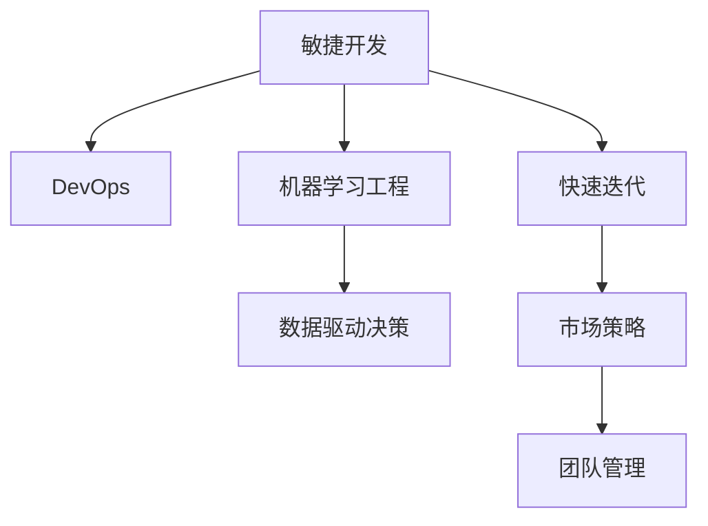

                 

## 1. 背景介绍

### 1.1 问题由来
在当今快速变化的商业环境中，AI创业公司面临着前所未有的挑战。市场竞争激烈，用户需求多变，技术迭代加速，这要求AI公司不仅要具备强大的技术实力，还需具备敏锐的业务洞察力和灵活的运营策略，才能在市场中占据一席之地。在竞争激烈的赛场上，如何应对市场变化，成为每个AI创业公司都必须面对的重要课题。

### 1.2 问题核心关键点
AI创业公司应对市场变化的核心在于，通过敏捷的创新和灵活的策略，快速响应市场需求和竞争态势，持续提升产品的竞争力。具体来说，这涉及到以下几个关键点：

- **技术创新**：持续研发新技术，突破技术瓶颈，保持行业领先地位。
- **业务敏锐度**：精准把握市场趋势，快速发现和抢占新的增长点。
- **产品迭代**：快速迭代产品，不断优化用户体验，提高产品市场竞争力。
- **市场策略**：灵活调整市场策略，平衡产品、营销、渠道等多方面的资源投入。
- **团队管理**：打造高效的团队文化，激励员工创新，提升团队凝聚力和执行力。

## 2. 核心概念与联系

### 2.1 核心概念概述

为更好地理解AI创业公司如何应对市场变化，本文将介绍几个关键概念：

- **敏捷开发**：一种快速迭代、持续改进的软件开发方法，通过快速响应需求变化，实现灵活高效的业务敏捷性。
- **DevOps**：将软件开发和运维紧密结合的实践，旨在提升交付速度和质量，加速产品迭代周期。
- **机器学习工程**：将机器学习算法应用于实际业务场景，涉及数据工程、模型训练、模型部署、模型运维等环节，旨在提高模型的业务价值。
- **数据驱动决策**：基于数据的分析和决策过程，指导企业的业务运营，优化资源配置和运营策略。

这些核心概念之间的逻辑关系可以通过以下Mermaid流程图来展示：



这个流程图展示的核心概念及其之间的关系：

1. 敏捷开发通过快速迭代实现灵活高效，为AI公司快速响应市场变化提供了保障。
2. DevOps将软件开发和运维紧密结合，加快了产品从研发到部署的速度。
3. 机器学习工程将机器学习算法应用于业务场景，提升产品的智能化水平。
4. 数据驱动决策通过数据分析指导企业运营，优化资源配置。

## 3. 核心算法原理 & 具体操作步骤
### 3.1 算法原理概述

AI创业公司应对市场变化的核心在于，通过敏捷的创新和灵活的策略，快速响应市场需求和竞争态势，持续提升产品的竞争力。具体来说，这涉及到以下几个关键点：

- **技术创新**：持续研发新技术，突破技术瓶颈，保持行业领先地位。
- **业务敏锐度**：精准把握市场趋势，快速发现和抢占新的增长点。
- **产品迭代**：快速迭代产品，不断优化用户体验，提高产品市场竞争力。
- **市场策略**：灵活调整市场策略，平衡产品、营销、渠道等多方面的资源投入。
- **团队管理**：打造高效的团队文化，激励员工创新，提升团队凝聚力和执行力。

### 3.2 算法步骤详解

以下是AI创业公司应对市场变化的具体操作步骤：

**Step 1: 确定市场定位和目标**
- 分析市场需求，确定公司定位和长期目标。
- 明确核心业务领域，聚焦主航道。

**Step 2: 制定敏捷开发策略**
- 采用敏捷开发方法论，如Scrum、Kanban，快速迭代产品原型和功能。
- 采用用户故事和需求优先级，确保开发工作围绕用户需求展开。

**Step 3: 建立DevOps体系**
- 采用CI/CD流水线，自动化测试、部署和监控。
- 持续集成和持续交付，实现快速迭代和持续改进。
- 实施基础设施即代码（IaC），提升资源管理和运维效率。

**Step 4: 构建机器学习工程团队**
- 组建数据工程、模型训练、模型部署、模型运维等专业团队。
- 使用先进的数据处理和存储技术，如大数据平台、数据湖等，提升数据利用率。
- 实施MLops，即机器学习运维，提升模型效率和稳定性。

**Step 5: 实施数据驱动决策**
- 收集和整理业务数据，建立数据仓库和数据湖。
- 采用先进的数据分析技术，如机器学习、数据挖掘等，深入挖掘数据价值。
- 基于数据洞察制定决策，优化运营策略和资源配置。

**Step 6: 灵活调整市场策略**
- 实时监控市场动态，分析竞争对手和用户行为。
- 快速调整产品功能、定价、推广策略，抢占市场先机。
- 灵活运用渠道策略，平衡线上线下资源投入。

**Step 7: 打造高效团队文化**
- 建立开放、协作、创新的企业文化。
- 实施绩效激励机制，激发员工创造力和执行力。
- 定期开展团队建设和培训活动，提升团队凝聚力。

### 3.3 算法优缺点

敏捷开发和DevOps等方法在应对市场变化中具有以下优点：
1. 灵活高效：通过快速迭代和持续改进，快速响应市场需求变化。
2. 资源优化：自动化流程提高效率，降低资源消耗。
3. 团队协作：通过跨团队协作，提升整体执行力。
4. 产品质量：通过自动化测试和部署，提升产品质量和稳定性。

同时，这些方法也存在一定的局限性：
1. 复杂度提升：敏捷开发和DevOps需要更高的技术和管理复杂度。
2. 资源投入：初期需要较大的技术和管理投入，对小型公司较为困难。
3. 沟通协调：跨团队协作需要良好的沟通机制和协同工具。

尽管存在这些局限性，但就目前而言，敏捷开发和DevOps仍是应对市场变化的主流方法。未来相关研究的重点在于如何进一步降低复杂度，提高灵活性和效率，同时兼顾资源投入和团队协作。

### 3.4 算法应用领域

敏捷开发和DevOps方法在AI创业公司中得到了广泛应用，涉及以下几个关键领域：

- **产品开发**：敏捷开发方法论广泛应用于产品设计和开发，提升迭代速度和产品竞争力。
- **运维管理**：DevOps将开发和运维紧密结合，提升系统的稳定性和运维效率。
- **数据分析**：数据驱动决策在产品优化、运营策略、用户行为分析等方面发挥重要作用。
- **市场拓展**：灵活调整市场策略，快速响应市场需求，开拓新市场。
- **团队管理**：打造高效团队文化，激励员工创新，提升团队凝聚力和执行力。

## 4. 数学模型和公式 & 详细讲解 & 举例说明

### 4.1 数学模型构建

本节将使用数学语言对AI创业公司应对市场变化的决策过程进行更加严格的刻画。

假设公司目标函数为 $f(X)$，其中 $X$ 为决策变量，包括产品功能、价格、推广策略等。公司需要在市场变化中调整 $X$，以最大化目标函数 $f(X)$。

### 4.2 公式推导过程

对于目标函数 $f(X)$，我们需要求解以下优化问题：

$$
\max_{X} f(X)
$$

其中 $X$ 的取值范围应满足 $X \in \mathcal{X}$，即决策变量 $X$ 必须在合理的范围内。

在实际操作中，我们可以将 $f(X)$ 分解为多个子目标函数，并引入约束条件：

$$
f(X) = \sum_{i=1}^n w_i f_i(X) + \sum_{i=1}^m c_i g_i(X)
$$

其中 $f_i(X)$ 为子目标函数，$w_i$ 为权重，$c_i$ 为约束条件系数，$g_i(X)$ 为约束条件。

### 4.3 案例分析与讲解

以一个AI创业公司为例，假设公司主要产品为智能客服系统。市场变化中，公司需要调整产品功能、价格和推广策略，以最大化市场份额和用户满意度。

- 产品功能：引入新的语音识别技术，提升客服系统智能化水平。
- 价格策略：在初期定价较高，后期根据市场反馈逐步降价。
- 推广策略：在线上平台和线下渠道同时推广，扩大用户覆盖。

公司需要求解以下优化问题：

$$
\max_{X} f(X) = f_{产品}(X) + w_{价格} f_{价格}(X) + w_{推广} f_{推广}(X)
$$

其中 $f_{产品}(X)$ 为产品功能提升带来的市场份额增加，$f_{价格}(X)$ 为定价策略带来的收入增长，$f_{推广}(X)$ 为推广策略带来的用户覆盖扩大。

约束条件包括：
- 价格策略必须满足市场合理性，即价格 $p$ 应满足 $p \in [p_{min}, p_{max}]$。
- 推广策略应符合预算限制，即推广费用 $c$ 应满足 $c \in [c_{min}, c_{max}]$。
- 产品功能应满足技术可行性，即功能 $f$ 应满足 $f \in [f_{min}, f_{max}]$。

通过求解上述优化问题，公司可以制定出最优的市场应对策略。

## 5. 项目实践：代码实例和详细解释说明

### 5.1 开发环境搭建

在进行市场应对策略决策的开发实践中，我们需要准备好开发环境。以下是使用Python进行决策分析开发的Python环境配置流程：

1. 安装Anaconda：从官网下载并安装Anaconda，用于创建独立的Python环境。

2. 创建并激活虚拟环境：
```bash
conda create -n decision-env python=3.8 
conda activate decision-env
```

3. 安装PyTorch：根据CUDA版本，从官网获取对应的安装命令。例如：
```bash
conda install pytorch torchvision torchaudio cudatoolkit=11.1 -c pytorch -c conda-forge
```

4. 安装SciPy、NumPy、Pandas、Matplotlib等科学计算和可视化库：
```bash
pip install scipy numpy pandas matplotlib tqdm jupyter notebook ipython
```

5. 安装相关决策分析库，如PuLP、Gurobi等：
```bash
pip install pulp gurobi
```

完成上述步骤后，即可在`decision-env`环境中开始决策分析实践。

### 5.2 源代码详细实现

以下是一个简单的决策分析模型示例，使用PuLP库进行求解：

```python
from pulp import *

# 定义决策变量
price = LpVariable('price', lowBound=10, highBound=30, type=LpInteger)
promotion = LpVariable('promotion', lowBound=0, highBound=5000, type=LpInteger)
feature = LpVariable('feature', lowBound=1, highBound=10, type=LpInteger)

# 定义目标函数
lpObjective = LpMaximize(price + 1.5 * promotion + 0.2 * feature)

# 定义约束条件
priceConstraint = LpConstraint(20, 50)
promotionConstraint = LpConstraint(0, 5000)
featureConstraint = LpConstraint(1, 10)

# 求解优化问题
lpProblem = LpProblem('DecisionProblem', LpMaximize, lpObjective)
lpProblem.addConstraints([priceConstraint, promotionConstraint, featureConstraint])
lpProblem.solve()

# 输出结果
print(f"Price: {price.value()}")
print(f"Promotion: {promotion.value()}")
print(f"Feature: {feature.value()}")
```

在这个示例中，我们定义了三个决策变量：价格、推广费用、产品功能。目标函数是最大化市场份额和用户满意度，约束条件包括价格合理性、推广费用预算和产品功能的技术可行性。

### 5.3 代码解读与分析

让我们再详细解读一下关键代码的实现细节：

**变量定义**：
- `price`：价格变量，取值范围为[10, 30]，整数类型。
- `promotion`：推广费用变量，取值范围为[0, 5000]，整数类型。
- `feature`：产品功能变量，取值范围为[1, 10]，整数类型。

**目标函数定义**：
- `lpObjective`：定义优化问题的目标函数，为价格、推广费用、产品功能的线性组合。

**约束条件定义**：
- `priceConstraint`：价格变量必须满足[20, 50]的范围。
- `promotionConstraint`：推广费用变量必须满足[0, 5000]的范围。
- `featureConstraint`：产品功能变量必须满足[1, 10]的范围。

**求解优化问题**：
- `lpProblem`：定义优化问题，传入目标函数和约束条件。
- `lpProblem.solve()`：求解优化问题，得到最优解。

**输出结果**：
- 打印出最优解中各个变量的值。

可以看到，通过简单的代码示例，我们定义了一个基于线性规划的优化问题，并求解得到最优的决策变量值。这个示例可以用于处理各种决策问题，如产品定价、广告预算、市场份额分配等。

## 6. 实际应用场景
### 6.1 智能客服系统

在智能客服系统中，基于市场变化的快速应对策略是关键。通过敏捷开发和DevOps方法，公司可以灵活迭代产品功能，快速响应客户需求，提高客户满意度。

**敏捷开发**：公司可以采用敏捷开发方法论，快速迭代产品功能，如引入新的自然语言处理技术，提升客服系统的智能化水平。

**DevOps**：通过CI/CD流水线，自动化测试、部署和监控，确保系统稳定性和快速迭代。同时，使用IaC技术，提升资源管理和运维效率。

**数据驱动决策**：实时监控用户反馈和市场变化，通过数据分析优化产品策略，提升用户体验和市场份额。

### 6.2 金融风险控制

金融行业需要实时监控市场动态，灵活调整投资策略和风险控制措施。敏捷开发和DevOps方法可以应用于金融系统的快速迭代和灵活应对。

**敏捷开发**：快速迭代风控模型和算法，及时捕捉市场变化，优化风险控制策略。

**DevOps**：通过CI/CD流水线，自动化测试、部署和监控，确保模型和系统的稳定性。

**数据驱动决策**：实时监控市场数据和金融指标，通过数据分析优化风险控制策略，确保投资安全和盈利能力。

### 6.3 智能制造

智能制造领域需要快速响应市场需求和生产变化，灵活调整生产计划和资源配置。敏捷开发和DevOps方法可以应用于生产系统的快速迭代和灵活应对。

**敏捷开发**：快速迭代生产流程和工艺，优化生产效率和质量。

**DevOps**：通过CI/CD流水线，自动化测试、部署和监控，确保生产系统的稳定性和快速迭代。

**数据驱动决策**：实时监控生产数据和市场需求，通过数据分析优化生产计划和资源配置，提升生产效率和市场竞争力。

### 6.4 未来应用展望

伴随敏捷开发和DevOps方法的不断发展，其在AI创业公司中的应用前景广阔，未来将涉及更多领域：

- **医疗健康**：快速迭代医疗设备和诊疗系统，灵活应对患者需求和医疗市场变化。

- **教育培训**：灵活调整在线教育内容和教学方法，提升教学效果和用户体验。

- **智慧城市**：快速迭代城市管理系统和智慧设备，提升城市治理和公共服务水平。

- **农业生产**：快速迭代农业设备和生产流程，优化农业生产效率和资源配置。

未来，随着敏捷开发和DevOps方法的持续演进，其在AI创业公司中的应用将更加广泛，推动更多行业实现数字化转型和智能化升级。

## 7. 工具和资源推荐
### 7.1 学习资源推荐

为了帮助开发者系统掌握敏捷开发、DevOps和机器学习工程的理论基础和实践技巧，这里推荐一些优质的学习资源：

1. **《敏捷开发实践指南》**：一本关于敏捷开发方法论的书籍，涵盖Scrum、Kanban等方法，详细介绍了敏捷开发的核心理念和最佳实践。

2. **《DevOps实践指南》**：一本关于DevOps实践的书籍，涵盖CI/CD、IaC等技术，详细介绍了DevOps的实践方法和工具链。

3. **《机器学习工程实践》**：一本关于机器学习工程实践的书籍，涵盖数据工程、模型训练、模型部署、模型运维等环节，详细介绍了机器学习工程的最佳实践。

4. **Kaggle平台**：一个数据科学竞赛平台，提供大量机器学习项目和数据集，帮助你实践和提升机器学习技能。

5. **HackerRank平台**：一个编程技能测试平台，提供各种算法和数据结构题目，帮助你提升编程技能和解决问题能力。

通过这些资源的学习实践，相信你一定能够快速掌握敏捷开发、DevOps和机器学习工程的精髓，并用于解决实际的业务问题。

### 7.2 开发工具推荐

高效的开发离不开优秀的工具支持。以下是几款用于敏捷开发、DevOps和机器学习工程开发的常用工具：

1. **JIRA**：一个项目管理工具，支持敏捷开发方法论，提供任务管理、进度跟踪、团队协作等功能。

2. **GitLab**：一个开源的DevOps平台，支持CI/CD流水线、代码管理、项目管理等功能。

3. **Docker**：一个容器化平台，支持快速部署和管理应用，提升开发和运维效率。

4. **Kubernetes**：一个容器编排平台，支持自动部署、扩展和管理容器化应用，提升资源利用率和系统稳定性。

5. **Jupyter Notebook**：一个交互式编程环境，支持Python、R等语言，提供丰富的科学计算和数据可视化工具。

合理利用这些工具，可以显著提升敏捷开发、DevOps和机器学习工程的开发效率，加快创新迭代的步伐。

### 7.3 相关论文推荐

敏捷开发和DevOps方法的发展源于学界的持续研究。以下是几篇奠基性的相关论文，推荐阅读：

1. **《敏捷软件开发：原则、模式与实践》**：由Robert C. Martin（马丁）撰写，全面介绍了敏捷开发的核心理念和实践方法。

2. **《DevOps：持续交付的未来》**：由Andrew Cox、Patrick Debois撰写，介绍了DevOps的核心理念和实践方法。

3. **《机器学习工程：从模型训练到部署》**：由Google AI撰写，介绍了机器学习工程的最佳实践和工具链。

这些论文代表了大语言模型微调技术的发展脉络。通过学习这些前沿成果，可以帮助研究者把握学科前进方向，激发更多的创新灵感。

## 8. 总结：未来发展趋势与挑战

### 8.1 总结

本文对AI创业公司如何应对市场变化进行了全面系统的介绍。首先阐述了市场变化对AI公司带来的挑战，明确了敏捷开发、DevOps和机器学习工程在应对市场变化中的重要性。其次，从原理到实践，详细讲解了这些方法的数学模型和操作步骤，给出了具体代码实例。同时，本文还广泛探讨了这些方法在智能客服、金融风险控制、智能制造等多个行业领域的应用前景，展示了这些方法的巨大潜力。此外，本文精选了相关学习资源，力求为读者提供全方位的技术指引。

通过本文的系统梳理，可以看到，敏捷开发和DevOps方法在大语言模型微调中的应用前景广阔，极大地拓展了AI公司应对市场变化的能力。未来，伴随敏捷开发和DevOps方法的持续演进，相信AI公司将能够更加灵活高效地应对市场变化，实现持续创新和快速成长。

### 8.2 未来发展趋势

展望未来，敏捷开发和DevOps方法将呈现以下几个发展趋势：

1. **智能化升级**：引入更多AI技术，如自然语言处理、机器学习等，提升敏捷开发和DevOps的自动化水平。

2. **云计算普及**：云计算技术的普及和成熟，将使得敏捷开发和DevOps更加灵活和高效，降低企业IT成本。

3. **数据驱动决策**：通过大数据分析和AI技术，提升敏捷开发和DevOps的决策精准性，优化资源配置和运营策略。

4. **跨团队协作**：引入更多协同工具和技术，提升跨团队协作的效率和质量，确保敏捷开发和DevOps的高效实施。

5. **用户反馈机制**：建立用户反馈机制，实时获取用户需求和意见，优化产品功能和用户体验。

6. **开源社区贡献**：鼓励开发者参与开源社区，共享最佳实践和工具，提升整体技术水平和创新能力。

以上趋势凸显了敏捷开发和DevOps方法的广阔前景。这些方向的探索发展，必将进一步提升AI公司应对市场变化的能力，推动更多行业实现数字化转型和智能化升级。

### 8.3 面临的挑战

尽管敏捷开发和DevOps方法已经取得了瞩目成就，但在迈向更加智能化、普适化应用的过程中，它仍面临着诸多挑战：

1. **复杂度提升**：敏捷开发和DevOps需要更高的技术和管理复杂度，对小型公司较为困难。

2. **资源投入**：初期需要较大的技术和管理投入，对小型公司较为困难。

3. **沟通协调**：跨团队协作需要良好的沟通机制和协同工具。

4. **人才短缺**：需要大量有经验和技能的敏捷开发、DevOps工程师，对于许多公司来说，人才短缺是一个重要挑战。

尽管存在这些挑战，但就目前而言，敏捷开发和DevOps仍是应对市场变化的主流方法。未来相关研究的重点在于如何进一步降低复杂度，提高灵活性和效率，同时兼顾资源投入和团队协作。

### 8.4 研究展望

面对敏捷开发和DevOps方法所面临的种种挑战，未来的研究需要在以下几个方面寻求新的突破：

1. **引入更多AI技术**：将更多AI技术应用于敏捷开发和DevOps，提升自动化水平和决策精准性。

2. **优化资源配置**：通过大数据分析和AI技术，优化资源配置和运营策略，降低企业成本。

3. **提升跨团队协作**：引入更多协同工具和技术，提升跨团队协作的效率和质量。

4. **优化工具链**：不断优化和改进敏捷开发和DevOps的工具链，提升开发和运维效率。

5. **建立用户反馈机制**：建立用户反馈机制，实时获取用户需求和意见，优化产品功能和用户体验。

6. **参与开源社区**：鼓励开发者参与开源社区，共享最佳实践和工具，提升整体技术水平和创新能力。

这些研究方向将进一步提升敏捷开发和DevOps方法的灵活性和效率，推动更多行业实现数字化转型和智能化升级。

## 9. 附录：常见问题与解答

**Q1：如何平衡敏捷开发和DevOps与企业文化的适应性？**

A: 敏捷开发和DevOps需要建立开放、协作、创新的企业文化。以下是一些具体建议：

1. **团队协作**：通过建立跨团队协作机制，打破部门壁垒，促进知识共享和技术协同。

2. **持续改进**：鼓励团队成员提出改进意见，通过持续改进提升团队效率和质量。

3. **灵活性**：保持企业文化灵活性，适应敏捷开发和DevOps的快速迭代和灵活应对。

4. **激励机制**：建立绩效激励机制，激发员工创新和执行，提升团队凝聚力。

**Q2：敏捷开发和DevOps是否适合所有类型的企业？**

A: 敏捷开发和DevOps适合需要快速响应市场需求和竞争态势的企业，特别是技术驱动型的互联网企业。对于一些传统行业，如制造业、金融业等，需要结合具体业务特点，进行适当的调整和优化。

**Q3：如何衡量敏捷开发和DevOps的效率和效果？**

A: 敏捷开发和DevOps的效率和效果可以通过以下指标进行衡量：

1. **交付速度**：通过衡量交付速度（如周期时间、迭代次数等）来评估敏捷开发和DevOps的效率。

2. **代码质量**：通过代码审查、自动化测试等手段，评估代码质量和稳定性。

3. **用户体验**：通过用户反馈和满意度调查，评估用户体验和市场反应。

4. **资源利用率**：通过衡量资源利用率（如CPU、内存、存储等）来评估DevOps的效率和稳定性。

5. **故障率**：通过衡量系统故障率和修复时间，评估DevOps的稳定性和运维效果。

**Q4：如何优化敏捷开发和DevOps的资源管理？**

A: 敏捷开发和DevOps的资源管理可以通过以下方法进行优化：

1. **容器化**：使用容器化技术（如Docker），提高资源利用率和部署效率。

2. **云计算**：利用云计算平台（如AWS、Azure），按需扩展资源，降低IT成本。

3. **自动化**：通过自动化测试、部署和监控，提高资源利用率和系统稳定性。

4. **持续集成和持续交付**：通过CI/CD流水线，实现快速迭代和持续改进。

5. **基础设施即代码**：通过IaC技术，提升资源管理和运维效率。

**Q5：敏捷开发和DevOps对人才需求有哪些？**

A: 敏捷开发和DevOps需要以下类型的人才：

1. **敏捷开发工程师**：具备敏捷开发方法论和实践经验，熟悉Scrum、Kanban等方法。

2. **DevOps工程师**：熟悉CI/CD、IaC等DevOps技术，具备自动化部署和运维能力。

3. **数据分析师**：具备数据分析和可视化能力，能够通过数据驱动决策。

4. **测试工程师**：熟悉自动化测试技术，具备测试驱动开发的能力。

5. **产品经理**：具备产品管理和用户需求分析能力，能够引导团队快速迭代和优化产品。

6. **团队领导者**：具备领导和管理能力，能够激励团队成员创新和执行。

通过引进和培养这些人才，企业能够更好地实现敏捷开发和DevOps，提升产品竞争力和市场响应速度。

---

作者：禅与计算机程序设计艺术 / Zen and the Art of Computer Programming

