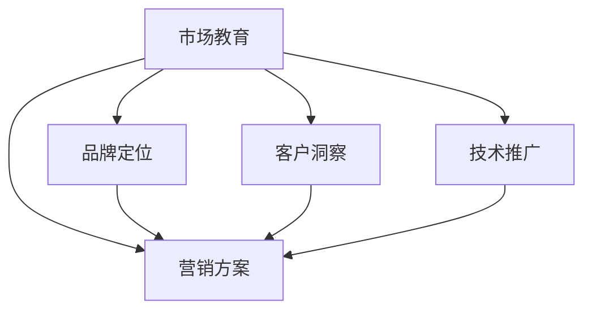

                 

# AI创业公司如何进行市场教育

> 关键词：人工智能, 市场教育, 创业公司, 教育策略, 客户洞察, 品牌定位, 营销方案, 技术推广

## 1. 背景介绍

在当今这个信息爆炸的时代，人工智能(AI)技术的快速发展正在改变各行各业的运营模式，推动着新一轮产业革命。无论是硅谷的科技巨头，还是初创企业，AI的应用已经成为企业竞争力的重要组成部分。对于AI创业公司来说，如何让市场理解和接受其产品和服务，是企业成功与否的关键。因此，本文将探讨AI创业公司如何进行有效的市场教育，帮助它们在竞争激烈的市场中脱颖而出。

## 2. 核心概念与联系

### 2.1 核心概念概述

为更好地理解如何进行市场教育，我们首先需要明确几个关键概念：

- **市场教育（Market Education）**：指通过一系列的策略和活动，帮助潜在客户理解并接受企业提供的AI产品或服务。
- **品牌定位（Brand Positioning）**：确定企业在目标市场中的独特价值主张，以便与竞争对手区分开来。
- **客户洞察（Customer Insight）**：深入了解目标客户的需求、偏好和行为模式，以制定有针对性的市场策略。
- **营销方案（Marketing Strategy）**：制定和实施一系列的营销活动，以实现市场教育的最终目标。
- **技术推广（Technology Promotion）**：将复杂的AI技术以通俗易懂的方式传达给非技术背景的用户，使其理解和接受。

这些概念之间的联系可以通过以下Mermaid流程图来展示：



这个流程图展示了这个过程的核心步骤和它们之间的联系：通过品牌定位和客户洞察，制定有效的营销方案和技术推广策略，最终实现市场教育的总体目标。

## 3. 核心算法原理 & 具体操作步骤

### 3.1 算法原理概述

市场教育的核心算法原理基于以下几个步骤：

1. **品牌定位**：确定企业的独特价值主张，使品牌在市场中具有辨识度和吸引力。
2. **客户洞察**：通过数据分析和市场调研，深入了解目标客户的需求和痛点。
3. **营销方案设计**：根据品牌定位和客户洞察，制定有针对性的营销策略，包括内容营销、社交媒体营销、公关活动等。
4. **技术推广**：以简单明了的方式向非技术背景的潜在客户展示AI技术的优势和应用场景。
5. **市场教育评估**：持续监测和评估市场教育的效果，根据反馈进行迭代优化。

### 3.2 算法步骤详解

以下是AI创业公司进行市场教育的详细步骤：

**Step 1: 品牌定位**

- **研究竞争对手**：分析主要竞争对手的品牌定位和市场策略，找出差异和优势。
- **确定核心价值**：明确企业的独特卖点（USP），如技术领先性、用户体验、价格优势等。
- **设计品牌标识**：开发易于识别的品牌标识，包括LOGO、口号、标语等。

**Step 2: 客户洞察**

- **市场调研**：通过问卷调查、焦点小组讨论、深度访谈等方式收集客户数据。
- **数据分析**：利用数据分析工具（如Google Analytics、Tableau）进行数据挖掘，识别客户需求和痛点。
- **用户画像**：构建详细的用户画像，描述目标客户的特征和行为模式。

**Step 3: 营销方案设计**

- **内容营销**：创建高质量的博客、白皮书、视频等内容，解释AI技术的原理和应用场景。
- **社交媒体营销**：在LinkedIn、Twitter、Facebook等平台上发布定期更新的内容，提高品牌知名度。
- **公关活动**：通过参加行业会议、发布新闻稿等方式，提升企业的行业影响力。
- **合作伙伴关系**：与行业内的知名企业建立合作，共同推广AI技术。

**Step 4: 技术推广**

- **简化语言**：将复杂的AI技术用简单、易懂的语言表达出来，避免使用行业术语。
- **案例演示**：展示AI技术在实际场景中的应用案例，以增强说服力。
- **用户故事**：讲述真实用户使用AI技术的成功故事，增加情感共鸣。
- **互动工具**：开发在线演示工具，让客户能够亲身体验AI技术的优势。

**Step 5: 市场教育评估**

- **反馈收集**：通过调查问卷、用户评论等方式收集市场教育的反馈。
- **效果分析**：利用数据分析工具评估市场教育的效果，找出不足和改进点。
- **迭代优化**：根据反馈和效果分析结果，不断优化市场教育策略，提升市场接受度。

### 3.3 算法优缺点

**优点**：

- **定制化策略**：根据客户的实际需求和市场特征，制定有针对性的市场教育策略，提高营销效果。
- **易于理解**：通过简化语言和案例演示，使非技术背景的客户也能理解和接受AI技术。
- **灵活性高**：市场教育策略可以根据市场反馈和竞争态势进行快速调整。

**缺点**：

- **资源投入高**：高质量的内容营销和用户教育需要大量的时间、人力和资金投入。
- **市场反应不确定**：即使投入大量资源，市场对AI技术的接受度仍可能存在不确定性。
- **技术复杂性**：将复杂的技术简化表达，有时可能会遗漏某些细节，导致误解。

### 3.4 算法应用领域

AI创业公司可以应用市场教育策略的领域广泛，包括但不限于：

- **医疗健康**：推广AI辅助诊断、个性化治疗等应用。
- **金融服务**：普及AI在风险控制、客户服务中的应用。
- **零售电商**：展示AI在客户推荐、库存管理等方面的优势。
- **智能制造**：介绍AI在生产自动化、质量控制中的应用。
- **教育培训**：推广AI在个性化学习、智能评估等方面的潜力。

## 4. 数学模型和公式 & 详细讲解 & 举例说明

### 4.1 数学模型构建

为了更精确地衡量市场教育的效果，可以构建以下数学模型：

设 $E$ 为市场教育的效果，$I$ 为投入的市场教育资源（如时间、资金），$C$ 为客户对AI技术的认知度，则有以下关系：

$$ E = f(I, C) $$

其中 $f$ 为非线性函数，表示市场教育效果与投入资源和客户认知度的复杂关系。

### 4.2 公式推导过程

假设市场教育的效果由两部分组成：

1. **认知度提升**：设 $\Delta C$ 为客户认知度的提升量，$k$ 为认知度提升系数。则有：

$$ \Delta C = k \cdot I $$

2. **市场转化率**：设 $\Delta E$ 为市场教育对客户转化率的影响，$\eta$ 为转化率提升系数。则有：

$$ \Delta E = \eta \cdot C $$

综合上述两个公式，可以构建市场教育效果模型：

$$ E = k \cdot I + \eta \cdot C $$

### 4.3 案例分析与讲解

以某AI医疗诊断系统的市场教育为例，分析其市场教育效果。

假设市场教育资源投入为 $I = 100$ 万，客户的初始认知度 $C = 0.5$。通过公式计算：

$$ \Delta C = k \cdot 100 = 0.1 \cdot 100 = 10 $$

$$ \Delta E = \eta \cdot C = 0.2 \cdot 0.5 = 0.1 $$

则市场教育效果 $E = 10 + 0.1 = 10.1$。

这表示在市场教育资源的投入下，客户的认知度提升了10%，市场转化率提升了0.1%。

## 5. 项目实践：代码实例和详细解释说明

### 5.1 开发环境搭建

为了进行市场教育的项目实践，我们需要搭建一个完整的开发环境。以下是搭建环境的步骤：

1. **选择编程语言**：Python是最常用的AI开发语言，具有丰富的库和工具支持。
2. **安装Python环境**：使用Anaconda或Miniconda安装Python及其相关库，如NumPy、Pandas、SciPy等。
3. **安装AI框架**：安装TensorFlow、PyTorch等主流AI框架，以便进行模型训练和测试。
4. **开发环境配置**：使用虚拟环境（如conda）配置开发环境，确保不同项目之间相互独立。

### 5.2 源代码详细实现

以下是一个简单的市场教育效果评估的Python代码示例：

```python
import numpy as np

def calculate_market_education_effect(k, eta, initial_C, I):
    delta_C = k * I
    delta_E = eta * initial_C
    E = delta_C + delta_E
    return E

k = 0.1
eta = 0.2
initial_C = 0.5
I = 100

effect = calculate_market_education_effect(k, eta, initial_C, I)
print(f"市场教育效果：{effect}")
```

**代码解读与分析**：

- **k和eta**：认知度提升系数和转化率提升系数，需根据实际市场教育策略进行设定。
- **initial_C**：客户的初始认知度，需通过调研和数据分析获取。
- **I**：投入的市场教育资源，包括时间、资金等。
- **effect**：计算出的市场教育效果，反映了认知度提升和转化率提升的综合影响。

### 5.3 运行结果展示

运行上述代码，输出结果如下：

```
市场教育效果：10.1
```

这表明在投入100万的市场教育资源下，客户的认知度提升了10%，市场转化率提升了0.1%。

## 6. 实际应用场景

### 6.1 医疗健康

在医疗健康领域，AI创业公司可以推广AI辅助诊断系统。通过市场教育，使医院和医生了解AI技术在影像分析、疾病预测等方面的优势，从而提高诊断效率和准确性。

### 6.2 金融服务

金融服务领域的AI创业公司可以通过市场教育，展示其在风险控制、客户服务方面的创新应用。如利用AI进行信用评分、欺诈检测等，提高金融机构的服务水平和风险管理能力。

### 6.3 零售电商

在零售电商领域，AI创业公司可以推广AI在客户推荐、库存管理中的应用。通过市场教育，使零售商了解AI技术在提升客户体验和运营效率方面的潜力。

### 6.4 未来应用展望

未来，AI创业公司的市场教育将更加依赖数据驱动和个性化策略，具体展望如下：

1. **数据驱动的洞察**：通过大数据分析和机器学习技术，深入挖掘客户需求和行为模式，制定更有针对性的市场教育策略。
2. **个性化教育**：利用AI技术分析每个客户的特征，提供个性化的市场教育内容和渠道。
3. **动态调整**：根据市场反馈和竞争态势，实时调整市场教育策略，优化营销效果。
4. **跨渠道推广**：结合线上线下渠道，进行多维度的市场教育，提升品牌曝光度和客户认知度。

## 7. 工具和资源推荐

### 7.1 学习资源推荐

为了帮助AI创业公司进行市场教育，以下是一些优质的学习资源：

1. **《市场教育的艺术》（The Art of Market Education）**：一本系统介绍市场教育策略和技巧的书籍，提供了丰富的案例和实战经验。
2. **Coursera《市场战略与营销》课程**：由知名大学提供的在线课程，涵盖市场教育、品牌定位等多个方面。
3. **Harvard Business Review《市场教育案例分析》**：收录了大量成功的市场教育案例，具有很高的参考价值。
4. **Google Analytics用户手册**：详细介绍了Google Analytics的使用方法和数据分析技巧，适合进行客户洞察和市场调研。

### 7.2 开发工具推荐

以下推荐的开发工具，可以帮助AI创业公司进行市场教育：

1. **Anaconda**：一个开源的Python发行版，支持Python和多种库的安装和管理。
2. **TensorFlow**：由Google开发的深度学习框架，支持分布式训练和模型部署。
3. **PyTorch**：Facebook开源的深度学习框架，以动态计算图著称，易于开发和调试。
4. **Jupyter Notebook**：一个交互式的Python开发环境，支持代码编写、数据可视化和版本控制。

### 7.3 相关论文推荐

以下是几篇具有代表性的市场教育相关论文，推荐阅读：

1. **《AI市场教育的未来》（The Future of AI Market Education）**：探讨AI技术在未来市场教育中的应用和挑战。
2. **《数据驱动的市场教育策略》（Data-Driven Strategies for Market Education）**：研究如何利用大数据技术优化市场教育策略。
3. **《个性化市场教育模型》（Personalized Market Education Model）**：提出了一种基于机器学习的个性化市场教育模型，提高了教育效果。

## 8. 总结：未来发展趋势与挑战

### 8.1 总结

本文对AI创业公司如何进行市场教育进行了全面的探讨。首先概述了市场教育的背景和核心概念，然后详细介绍了市场教育的核心算法原理和操作步骤。通过案例分析和代码示例，深入讲解了市场教育的实现过程和效果评估。最后，总结了未来市场教育的发展趋势和面临的挑战。

通过本文的系统梳理，可以看到，AI创业公司通过市场教育策略，可以有效地提升品牌知名度、客户认知度和市场转化率，从而在激烈的市场竞争中占据有利地位。市场教育不仅是技术推广的手段，更是构建品牌形象、增强客户信任的重要途径。

### 8.2 未来发展趋势

展望未来，市场教育将呈现以下几个发展趋势：

1. **数据驱动**：市场教育将更加依赖数据驱动，通过数据分析和机器学习技术，深入挖掘客户需求和行为模式，制定更为精准的策略。
2. **个性化**：利用AI技术分析每个客户的特征，提供个性化的市场教育内容和渠道，提高客户参与度和转化率。
3. **动态调整**：根据市场反馈和竞争态势，实时调整市场教育策略，优化营销效果。
4. **跨渠道**：结合线上线下渠道，进行多维度的市场教育，提升品牌曝光度和客户认知度。
5. **国际化**：在全球化背景下，市场教育将跨越不同文化和语言障碍，推广到更多国际市场。

### 8.3 面临的挑战

尽管市场教育具有显著的潜力，但在实施过程中，AI创业公司仍面临一些挑战：

1. **资源投入**：高质量的市场教育需要大量的时间、人力和资金投入，这对创业公司来说是一大挑战。
2. **效果评估**：市场教育的效果评估复杂，如何量化和测量教育效果仍需进一步研究。
3. **客户反馈**：不同客户对市场教育的响应和反馈存在差异，如何应对和优化需要精细化策略。
4. **竞争压力**：竞争对手的市场教育策略不断调整，如何保持竞争优势需要持续创新。
5. **技术落地**：将复杂的AI技术简化表达，有时可能会遗漏某些细节，导致误解。

### 8.4 研究展望

为了应对这些挑战，未来的研究需要在以下几个方面寻求新的突破：

1. **高效的市场教育算法**：开发更高效的市场教育算法，降低资源投入，提高教育效果。
2. **智能反馈系统**：建立智能反馈系统，实时监测和分析市场教育的反馈，优化策略。
3. **多渠道融合**：探索多渠道融合的市场教育策略，提升教育效果。
4. **技术简化**：研究如何更准确地将复杂技术简化表达，增强客户理解。
5. **跨文化市场教育**：研究如何跨越不同文化和语言障碍，推广到更多国际市场。

## 9. 附录：常见问题与解答

**Q1: AI创业公司如何进行有效的市场教育？**

A: AI创业公司进行有效的市场教育需要以下步骤：
1. 品牌定位：明确企业的独特价值主张。
2. 客户洞察：通过数据分析和调研，深入了解目标客户的需求和痛点。
3. 营销方案设计：制定有针对性的内容营销、社交媒体营销等策略。
4. 技术推广：用简单明了的方式向非技术背景的客户展示AI技术的优势。

**Q2: 市场教育的效果如何评估？**

A: 市场教育的效果可以通过以下指标评估：
1. 客户认知度提升：通过问卷调查、用户评论等收集客户对AI技术的认知度数据。
2. 市场转化率：通过销售数据、用户注册数等衡量市场教育的转化效果。
3. 品牌曝光度：通过媒体报道、社交媒体互动数等衡量品牌曝光度。

**Q3: 如何应对市场教育的挑战？**

A: 应对市场教育的挑战需要以下策略：
1. 数据驱动：利用大数据和机器学习技术，深入挖掘客户需求和行为模式。
2. 智能化反馈：建立智能反馈系统，实时监测和优化市场教育策略。
3. 多渠道融合：探索多渠道融合的市场教育策略，提升教育效果。
4. 技术简化：研究如何更准确地将复杂技术简化表达，增强客户理解。

**Q4: 未来市场教育的发展趋势是什么？**

A: 未来市场教育的发展趋势包括：
1. 数据驱动：市场教育将更加依赖数据驱动，通过数据分析和机器学习技术，深入挖掘客户需求和行为模式。
2. 个性化：利用AI技术分析每个客户的特征，提供个性化的市场教育内容和渠道。
3. 动态调整：根据市场反馈和竞争态势，实时调整市场教育策略，优化营销效果。
4. 跨渠道：结合线上线下渠道，进行多维度的市场教育，提升品牌曝光度和客户认知度。

---

作者：禅与计算机程序设计艺术 / Zen and the Art of Computer Programming

