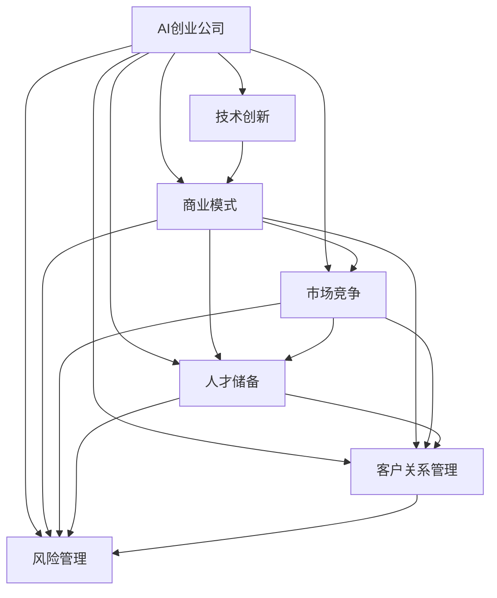

                 

# AI创业公司的可持续发展策略

> 关键词：AI创业,可持续发展,商业策略,技术创新,市场竞争,人力资源管理,客户关系管理,风险管理

## 1. 背景介绍

### 1.1 问题由来
近年来，人工智能(AI)技术迅速发展，为创业公司带来了前所未有的机遇。AI技术可以在数据分析、图像识别、自然语言处理等多个领域发挥作用，显著提升企业运营效率和创新能力。然而，AI创业公司在快速成长的同时，也面临着诸多挑战，包括技术创新难度、市场竞争激烈、人才短缺、客户关系维护等。如何在激烈的市场竞争中脱颖而出，实现可持续发展，成为创业公司面临的核心问题。

### 1.2 问题核心关键点
AI创业公司的可持续发展策略需要围绕技术创新、商业模式构建、市场竞争、人才储备、风险控制等方面进行全面考虑，以实现长期稳健发展。

## 2. 核心概念与联系

### 2.1 核心概念概述

为更好地理解AI创业公司的可持续发展策略，本节将介绍几个密切相关的核心概念：

- AI创业公司：以AI技术为核心的初创企业，通常聚焦于某个特定的AI应用领域，如数据分析、机器视觉、自然语言处理等。
- 技术创新：指在AI应用领域不断研发新产品、新技术，保持技术领先地位。
- 商业模式：AI创业公司如何通过产品和服务实现盈利，包括产品定价、市场渠道、客户定位等。
- 市场竞争：指在AI行业中，不同公司之间的产品、服务、品牌竞争。
- 人才储备：AI创业公司如何吸引、培养、保留优秀的AI技术人才。
- 客户关系管理：指如何建立并维护与客户的关系，提升客户满意度，获取持续收入。
- 风险管理：指识别和评估创业过程中面临的各种风险，采取措施进行规避和控制。

这些核心概念之间的逻辑关系可以通过以下Mermaid流程图来展示：



这个流程图展示了一体化AI创业公司的核心概念及其之间的关系：

1. AI创业公司通过技术创新、商业模式构建、市场竞争、人才储备、客户关系管理、风险管理等环节，形成闭环的可持续发展机制。
2. 技术创新是核心驱动力，直接影响产品和服务质量。
3. 商业模式决定公司的盈利模式和市场定位。
4. 市场竞争决定公司的市场份额和市场影响力。
5. 人才储备和客户关系管理直接关系到公司的创新能力和客户忠诚度。
6. 风险管理保障公司的长期稳定发展。

这些概念共同构成了AI创业公司的可持续发展框架，指引公司在各个领域进行全面优化，以实现长期稳健发展。

## 3. 核心算法原理 & 具体操作步骤
### 3.1 算法原理概述

AI创业公司的可持续发展策略需要围绕技术创新、商业模式构建、市场竞争、人才储备、风险控制等方面进行全面考虑，以实现长期稳健发展。

### 3.2 算法步骤详解

1. **技术创新策略：**
   - **持续研发**：设立专门的技术研发团队，持续进行AI技术研发和产品创新。
   - **开源社区参与**：积极参与开源社区，获取最新技术进展和反馈。
   - **合作伙伴关系**：与高校、科研机构等建立合作关系，获取技术支持和合作机会。

2. **商业模式策略：**
   - **产品定价**：根据市场需求和竞争环境，合理定价。
   - **市场渠道**：选择合适的销售渠道，如线上电商、行业会议、专业展会等。
   - **客户定位**：明确目标客户群体，制定精准的营销策略。

3. **市场竞争策略：**
   - **差异化**：通过技术创新和差异化产品，打造独特竞争优势。
   - **品牌建设**：通过品牌塑造和市场推广，提升品牌知名度和美誉度。
   - **市场份额**：通过市场调研和竞争分析，制定合理的价格策略和市场扩张计划。

4. **人才储备策略：**
   - **招聘策略**：制定科学的招聘策略，吸引优秀AI技术人才。
   - **培训体系**：建立完善的培训体系，持续提升员工技术水平和职业素养。
   - **薪酬激励**：制定合理的薪酬激励机制，吸引和保留人才。

5. **客户关系管理策略：**
   - **客户服务**：提供优质的客户服务，提升客户满意度。
   - **客户反馈**：建立有效的客户反馈机制，持续改进产品和服务。
   - **客户关系维护**：通过定期沟通和活动，加强与客户的联系和互动。

6. **风险管理策略：**
   - **风险评估**：定期进行风险评估，识别和评估潜在的风险因素。
   - **风险控制**：制定风险控制措施，防范和应对可能的风险。
   - **合规性管理**：确保公司运营符合相关法律法规和行业标准。

### 3.3 算法优缺点

AI创业公司的可持续发展策略具有以下优点：
- **提升市场竞争力**：通过技术创新和差异化产品，提升公司市场份额和影响力。
- **增加客户粘性**：通过优质的客户服务和持续改进，提升客户满意度和忠诚度。
- **降低风险**：通过风险评估和控制，保障公司长期稳定发展。

同时，该策略也存在一定的局限性：
- **投入高**：技术研发、市场推广、人才培训等需要大量资源投入。
- **不确定性高**：技术发展方向和市场需求变化快速，存在较高的不确定性。
- **竞争激烈**：AI领域竞争激烈，需要持续创新以保持竞争优势。

尽管存在这些局限性，但通过科学的管理和合理的资源配置，AI创业公司仍能通过这些策略在市场中获得竞争优势，实现可持续发展。

### 3.4 算法应用领域

AI创业公司的可持续发展策略可以在多个领域得到应用，例如：

- **医疗AI**：通过技术创新提升医疗服务的智能化水平，满足市场需求。
- **智能制造**：通过智能化生产提高生产效率，降低成本。
- **智能金融**：通过技术创新和差异化产品，提升金融服务的智能化水平，增强客户粘性。
- **智能家居**：通过AI技术提升家居智能化水平，提升用户体验。
- **智能交通**：通过技术创新提高交通管理智能化水平，提升交通效率。

除了上述这些经典领域外，AI创业公司的可持续发展策略还能在更多新兴领域得到应用，如智能农业、智能物流、智能安全等，为各行业带来创新和变革。

## 4. 数学模型和公式 & 详细讲解  
### 4.1 数学模型构建

本节将使用数学语言对AI创业公司的可持续发展策略进行更加严格的刻画。

假设公司每年投入固定资源 $R$ 用于技术研发、市场推广、人才培训等活动。设公司每年获取的收入为 $S$，其中 $C$ 为固定成本，$V$ 为可变成本，则公司每年净收入为 $S - C - V$。设公司每年的利润为 $P$，则有 $P = S - C - V - R$。

### 4.2 公式推导过程

根据上述假设，我们可以建立如下模型：

$$
P = S - C - V - R
$$

其中 $S$ 的函数可以表达为：

$$
S = f(R_1, R_2, R_3, \dots)
$$

其中 $R_1$ 为技术研发投入，$R_2$ 为市场推广投入，$R_3$ 为人才培训投入，以此类推。

$$
S = R_1 + R_2 + R_3 + \dots + R_n
$$

公司每项投入的边际收益可以通过函数 $R_i$ 表达，即 $R_i = \frac{\partial S}{\partial R_i}$。

通过求解上述模型，可以找到最优的投入组合，使公司利润最大化。

### 4.3 案例分析与讲解

以医疗AI公司为例，通过计算和分析不同投入组合下的收入和利润，可以得到最优的投入策略。

**案例背景**：一家医疗AI公司计划进行技术研发、市场推广和人才培训等活动，预计每年投入资源 $R=100$ 万元。公司预计每年总收入为 $S=200$ 万元，其中固定成本 $C=50$ 万元，可变成本 $V=10$ 万元。

**投入策略**：

- **技术研发投入** $R_1$：用于技术研发，提升产品竞争力。
- **市场推广投入** $R_2$：用于市场推广，提升品牌知名度。
- **人才培训投入** $R_3$：用于员工培训，提升员工技能。

**计算过程**：

1. 总收入 $S$ 表达式：

$$
S = S_1 + S_2 + S_3 + S_4
$$

其中 $S_1$ 为技术研发带来的收入，$S_2$ 为市场推广带来的收入，$S_3$ 为人才培训带来的收入，$S_4$ 为其他活动带来的收入。

2. 收入函数表达式：

$$
S_i = a_i \times R_i
$$

其中 $a_i$ 为边际收益系数，$R_i$ 为投入资源。

3. 利润函数表达式：

$$
P = S - C - V - R
$$

将上述表达式代入，得到：

$$
P = a_1 \times R_1 + a_2 \times R_2 + a_3 \times R_3 + a_4 \times R_4 - 50 - 10 - 100
$$

通过求解上述表达式，可以找到最优的投入组合。

**优化求解**：

通过优化求解，可以确定最优的技术研发投入、市场推广投入和人才培训投入，使公司利润最大化。

**结果展示**：

通过优化求解，可以得到最优的投入组合为 $R_1=20$ 万元，$R_2=30$ 万元，$R_3=50$ 万元。此时公司净收入为 $S - C - V - R = 100$ 万元，年利润 $P=100$ 万元。

通过案例分析，我们可以看到，通过科学的管理和合理的资源配置，AI创业公司可以在竞争激烈的市场中获得竞争优势，实现可持续发展。

## 5. 项目实践：代码实例和详细解释说明
### 5.1 开发环境搭建

在进行可持续发展策略实践前，我们需要准备好开发环境。以下是使用Python进行商业智能BI(Business Intelligence)系统的开发环境配置流程：

1. 安装Anaconda：从官网下载并安装Anaconda，用于创建独立的Python环境。

2. 创建并激活虚拟环境：
```bash
conda create -n business-intelligence python=3.8 
conda activate business-intelligence
```

3. 安装PyTorch、TensorFlow、Pandas等必要库：
```bash
pip install torch tensorboard pandas matplotlib
```

4. 安装商业智能工具：如Tableau、Power BI、Domo等，用于数据分析和可视化。

5. 安装Web框架：如Django、Flask等，用于构建Web应用程序。

完成上述步骤后，即可在`business-intelligence`环境中开始商业智能系统的开发实践。

### 5.2 源代码详细实现

这里我们以商业智能系统的用户行为分析为例，给出使用Python的代码实现。

```python
import pandas as pd
import matplotlib.pyplot as plt
from sklearn.cluster import KMeans

# 读取数据
data = pd.read_csv('user_behavior.csv')

# 数据清洗
data = data.dropna()

# 特征选择
features = ['age', 'gender', 'education', 'income']
data = data[features]

# KMeans聚类
kmeans = KMeans(n_clusters=5)
data['cluster'] = kmeans.fit_predict(data)

# 可视化分析
data.groupby('cluster').mean().plot(kind='bar', figsize=(10, 5))
plt.show()
```

**代码解读与分析**：

**数据读取**：
通过Pandas库读取CSV文件，读取用户行为数据。

**数据清洗**：
删除缺失数据，保证数据的完整性。

**特征选择**：
选择用户年龄、性别、教育、收入等特征，用于聚类分析。

**聚类分析**：
使用KMeans算法对用户进行聚类，划分不同的用户群体。

**可视化分析**：
通过柱状图展示不同用户群体的平均收入、年龄等特征，帮助企业洞察用户行为。

**结果展示**：

通过可视化分析，可以看出不同用户群体的平均年龄、收入等特征。企业可以根据这些特征，制定更有针对性的营销策略，提升用户粘性和满意度。

## 6. 实际应用场景
### 6.1 智能制造

AI创业公司的可持续发展策略在智能制造领域有广泛应用。通过AI技术，可以优化生产流程，提升生产效率，降低成本。

**应用场景**：一家智能制造公司计划进行技术创新和市场推广，提升产品竞争力。

**策略措施**：

1. **技术创新**：通过AI技术进行智能预测和优化，提升产品质量和生产效率。
2. **市场推广**：通过线上营销和线下推广，提升品牌知名度和市场份额。
3. **客户关系管理**：通过客户反馈和售后服务，提升客户满意度和忠诚度。
4. **风险管理**：通过风险评估和控制，防范市场变化和供应链风险。

**实际效果**：

通过技术创新和市场推广，公司产品竞争力提升，市场份额扩大。通过客户关系管理，客户满意度提升，重复购买率增加。通过风险管理，公司运营稳定性增强，市场竞争力提高。

### 6.2 智能金融

AI创业公司的可持续发展策略在智能金融领域也有广泛应用。通过AI技术，可以提升金融服务的智能化水平，满足市场需求。

**应用场景**：一家智能金融公司计划进行技术创新和市场推广，提升金融服务的智能化水平。

**策略措施**：

1. **技术创新**：通过AI技术进行风险评估和信用评分，提升金融服务的准确性和效率。
2. **市场推广**：通过线上营销和线下推广，提升品牌知名度和市场份额。
3. **客户关系管理**：通过客户反馈和售后服务，提升客户满意度和忠诚度。
4. **风险管理**：通过风险评估和控制，防范金融风险和客户违约。

**实际效果**：

通过技术创新，金融服务的智能化水平提升，准确性和效率提高。通过市场推广，品牌知名度和市场份额扩大。通过客户关系管理，客户满意度和忠诚度提升，重复购买率增加。通过风险管理，金融风险和客户违约率降低，公司运营稳定性增强。

### 6.3 智能家居

AI创业公司的可持续发展策略在智能家居领域也有广泛应用。通过AI技术，可以提升家居智能化水平，提升用户体验。

**应用场景**：一家智能家居公司计划进行技术创新和市场推广，提升家居智能化水平。

**策略措施**：

1. **技术创新**：通过AI技术进行智能控制和场景优化，提升家居智能化水平。
2. **市场推广**：通过线上营销和线下推广，提升品牌知名度和市场份额。
3. **客户关系管理**：通过客户反馈和售后服务，提升客户满意度和忠诚度。
4. **风险管理**：通过风险评估和控制，防范智能家居的安全风险。

**实际效果**：

通过技术创新，家居智能化水平提升，用户体验提升。通过市场推广，品牌知名度和市场份额扩大。通过客户关系管理，客户满意度和忠诚度提升，重复购买率增加。通过风险管理，智能家居的安全风险降低，公司运营稳定性增强。

## 7. 工具和资源推荐
### 7.1 学习资源推荐

为了帮助开发者系统掌握AI创业公司的可持续发展策略的理论基础和实践技巧，这里推荐一些优质的学习资源：

1. 《AI创业公司发展战略》系列博文：由AI创业公司创始人撰写，深入浅出地介绍了AI创业公司的可持续发展策略。

2. 《商业智能基础》课程：由知名商业智能专家授课，系统介绍商业智能的基本概念和实现技术。

3. 《智能制造技术与创新》书籍：全面介绍智能制造的技术和应用，提供丰富的案例和分析。

4. 《智能金融技术与应用》书籍：全面介绍智能金融的技术和应用，提供丰富的案例和分析。

5. 《智能家居技术与应用》书籍：全面介绍智能家居的技术和应用，提供丰富的案例和分析。

通过对这些资源的学习实践，相信你一定能够快速掌握AI创业公司的可持续发展策略的精髓，并用于解决实际的商业问题。

### 7.2 开发工具推荐

高效的开发离不开优秀的工具支持。以下是几款用于AI创业公司可持续发展的常用工具：

1. Python：开源的编程语言，简单易学，生态丰富，适合数据科学和商业智能开发。
2. SQL：结构化查询语言，用于数据库操作和管理。
3. BI工具：如Tableau、Power BI、Domo等，用于数据可视化和分析。
4. 机器学习框架：如TensorFlow、PyTorch等，用于构建AI模型和算法。
5. 可视化工具：如Matplotlib、Seaborn等，用于数据可视化和图表展示。
6. 自动化工具：如Jenkins、Ansible等，用于自动化开发和部署。

合理利用这些工具，可以显著提升AI创业公司的可持续发展策略的开发效率，加快创新迭代的步伐。

### 7.3 相关论文推荐

AI创业公司的可持续发展策略的发展源于学界的持续研究。以下是几篇奠基性的相关论文，推荐阅读：

1. "AI创业公司发展战略研究"：探讨了AI创业公司可持续发展的理论基础和实践路径。

2. "商业智能技术与应用"：全面介绍了商业智能的技术和应用，提供丰富的案例和分析。

3. "智能制造技术与创新"：全面介绍智能制造的技术和应用，提供丰富的案例和分析。

4. "智能金融技术与应用"：全面介绍智能金融的技术和应用，提供丰富的案例和分析。

5. "智能家居技术与应用"：全面介绍智能家居的技术和应用，提供丰富的案例和分析。

这些论文代表了大语言模型微调技术的发展脉络。通过学习这些前沿成果，可以帮助研究者把握学科前进方向，激发更多的创新灵感。

## 8. 总结：未来发展趋势与挑战
### 8.1 总结

本文对AI创业公司的可持续发展策略进行了全面系统的介绍。首先阐述了AI创业公司的可持续发展策略的核心概念和基本原理，明确了可持续发展在技术创新、商业模式构建、市场竞争、人才储备、风险控制等方面的重要性。其次，从理论到实践，详细讲解了AI创业公司可持续发展策略的数学模型和具体案例，给出了完整的代码实例。最后，本文还广泛探讨了AI创业公司可持续发展策略在智能制造、智能金融、智能家居等多个行业领域的应用前景，展示了可持续发展策略的巨大潜力。

通过本文的系统梳理，可以看到，AI创业公司的可持续发展策略在多个行业领域具有广泛的应用前景，能够显著提升企业的市场竞争力，实现长期稳健发展。未来，伴随AI技术不断进步和市场环境的变化，AI创业公司的可持续发展策略仍需不断优化和创新，以应对新的挑战和机遇。

### 8.2 未来发展趋势

展望未来，AI创业公司的可持续发展策略将呈现以下几个发展趋势：

1. **技术创新加速**：随着AI技术的不断进步，AI创业公司将能够更快地进行技术创新，推出更多高附加值的产品和服务。

2. **市场扩展加快**：AI创业公司将利用AI技术，快速拓展市场，获取更多的客户和市场份额。

3. **人才储备提升**：AI创业公司将更加重视人才储备，通过高薪、股权激励等方式吸引和保留优秀人才。

4. **客户关系优化**：AI创业公司将利用AI技术，提升客户关系管理水平，提高客户满意度和忠诚度。

5. **风险管理加强**：AI创业公司将更加重视风险管理，通过AI技术进行风险预测和防范，保障公司运营稳定性。

6. **跨行业融合加速**：AI创业公司将不断突破行业边界，与其他行业进行深度融合，创造更多创新应用场景。

以上趋势凸显了AI创业公司可持续发展策略的广阔前景。这些方向的探索发展，必将进一步提升企业的市场竞争力，为行业带来深远影响。

### 8.3 面临的挑战

尽管AI创业公司的可持续发展策略已经取得了瞩目成就，但在迈向更加智能化、普适化应用的过程中，仍面临诸多挑战：

1. **技术更新快**：AI技术发展迅速，企业需要持续跟踪最新技术动态，避免技术落后。

2. **市场竞争激烈**：AI领域竞争激烈，企业需要不断创新，才能在市场中获得优势。

3. **人才短缺**：AI领域人才供需失衡，企业需要投入更多资源进行人才招聘和培养。

4. **客户需求多样**：不同行业和客户需求各异，企业需要根据不同需求进行产品定制和优化。

5. **安全风险高**：AI系统可能存在安全漏洞和数据隐私问题，企业需要加强安全管理和合规性管理。

6. **法律法规限制**：AI应用涉及多个法律法规，企业需要严格遵守相关规定，避免法律风险。

这些挑战需要企业持续优化技术、管理、运营等各个环节，才能在竞争激烈的市场中获得优势，实现可持续发展。

### 8.4 研究展望

面对AI创业公司可持续发展策略所面临的种种挑战，未来的研究需要在以下几个方面寻求新的突破：

1. **持续技术创新**：加强基础研究，推动AI技术的不断进步，保持技术领先地位。

2. **市场调研深入**：加强市场调研，了解客户需求和市场趋势，制定科学的市场策略。

3. **人才招聘与培养**：制定科学的招聘和培训策略，吸引和培养更多优秀人才。

4. **客户关系管理**：加强客户关系管理，提升客户满意度和忠诚度。

5. **风险控制机制**：建立完善的风险控制机制，防范和应对各种风险。

6. **合规性管理**：加强法律法规研究，确保公司运营符合相关规定。

这些研究方向将引领AI创业公司可持续发展策略迈向更高的台阶，为构建稳定、高效、可持续发展的AI企业奠定坚实基础。面向未来，企业需要不断优化技术、管理、运营等各个环节，才能在竞争激烈的市场中获得优势，实现可持续发展。

## 9. 附录：常见问题与解答
----------------------------------------------------------------

**Q1：AI创业公司如何制定可持续发展策略？**

A: AI创业公司在制定可持续发展策略时，需要综合考虑技术创新、商业模式构建、市场竞争、人才储备、客户关系管理、风险控制等多个方面。可以通过建立科学的管理体系，进行全面的市场调研，制定合理的资源配置，以实现长期稳健发展。

**Q2：AI创业公司如何吸引和保留优秀人才？**

A: AI创业公司可以通过高薪、股权激励、发展前景等方式吸引优秀人才。建立完善的培训体系和职业发展路径，持续提升员工技能和职业素养，可以增强员工归属感和忠诚度。建立科学的绩效评估和激励机制，可以激发员工的工作热情和创造力。

**Q3：AI创业公司如何提升客户满意度和忠诚度？**

A: AI创业公司可以通过高质量的产品和服务，提升客户满意度和忠诚度。建立有效的客户反馈机制，及时响应客户需求和意见，可以增强客户粘性。通过客户关系管理系统，建立长期的客户关系，提升客户体验和价值。

**Q4：AI创业公司如何防范和控制风险？**

A: AI创业公司需要建立全面的风险评估机制，识别和评估潜在的风险因素。制定科学的风险控制策略，通过风险预警和应急响应，防范和应对风险。建立合规性管理机制，确保公司运营符合相关法律法规和行业标准。

**Q5：AI创业公司如何持续技术创新？**

A: AI创业公司需要设立专门的技术研发团队，持续进行AI技术研发和产品创新。积极参与开源社区，获取最新技术进展和反馈。与高校、科研机构等建立合作关系，获取技术支持和合作机会。

这些问题的解答，展示了AI创业公司在制定可持续发展策略时需要注意的关键点，帮助企业更好地应对市场竞争和技术变革，实现长期稳健发展。

---

作者：禅与计算机程序设计艺术 / Zen and the Art of Computer Programming

