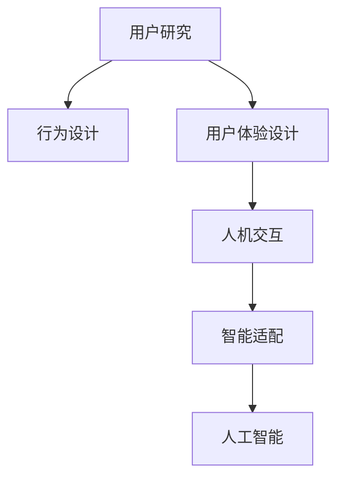

                 

# AI创业公司的用户体验设计：以人为本与智能适配

> 关键词：用户体验设计(UX Design), 人机交互(Human-Computer Interaction), 人工智能(AI), 智能适配(Intelligent Adaptation), 用户研究(User Research), 行为设计(Design of Behavior), 数据驱动(Data-Driven)

## 1. 背景介绍

### 1.1 问题由来

随着人工智能技术的飞速发展，AI创业公司如雨后春笋般涌现。这些公司借助机器学习和深度学习算法，开发出了众多创新应用，从自然语言处理到图像识别，从智能推荐到无人驾驶，不一而足。然而，尽管AI技术带来了颠覆性的变革，用户体验(UX)依然是决定产品成败的关键因素之一。

用户是产品价值的最终判断者，AI应用要想获得广泛认可和成功应用，就必须深入理解用户需求，提供真正符合用户期望的解决方案。这不仅要求AI技术本身具备高精度、高效率，更需要把“以人为本”作为产品设计的首要原则，通过智能适配和个性化推荐，让用户在使用过程中获得愉悦体验。

### 1.2 问题核心关键点

#### 1.2.1 用户体验的重要性

用户体验是衡量AI产品成功与否的重要标准。一个良好的用户体验不仅能提升用户满意度，还能促进产品的口碑传播和市场占有率。

#### 1.2.2 智能适配的必要性

智能适配是指通过人工智能技术，动态调整产品功能，使其更贴近用户行为和需求。它能帮助AI产品更加高效地响应用户，提升用户粘性和忠诚度。

#### 1.2.3 用户研究与行为设计的结合

用户研究旨在通过数据和洞察了解用户真实需求，而行为设计则在此基础上构建解决方案。将两者结合，才能设计出真正以用户为中心的产品。

## 2. 核心概念与联系

### 2.1 核心概念概述

#### 2.1.1 用户体验设计(UX Design)

用户体验设计旨在创建满足用户需求的、使用起来愉快的、符合人类心理学原则的产品设计。其核心在于通过用户研究和行为设计，了解用户的心理和行为模式，从而指导产品设计。

#### 2.1.2 人机交互(Human-Computer Interaction, HCI)

人机交互研究人和计算机之间的互动过程，旨在通过设计更好的界面和交互方式，提升用户对产品的满意度。它关注用户操作界面的易用性、直观性和响应速度。

#### 2.1.3 人工智能(AI)

人工智能是通过计算机程序模拟人类智能行为的技术。其包括机器学习、自然语言处理、计算机视觉等多个领域，能提供高效的数据处理和智能决策能力。

#### 2.1.4 智能适配(Intelligent Adaptation)

智能适配是指通过AI技术，自动调整产品功能，使其适应用户的个性化需求。它包括参数调整、界面定制、推荐系统等技术手段，使用户在使用过程中获得更好的体验。

#### 2.1.5 用户研究(User Research)

用户研究是通过各种方法了解用户需求和行为的过程。包括问卷调查、用户访谈、用户测试等，能帮助产品经理和设计师把握用户真实需求，构建符合用户期望的产品。

#### 2.1.6 行为设计(Design of Behavior)

行为设计是通过设计引导用户行为，提高产品使用率和满意度。包括交互流程设计、界面引导、奖励机制等，使产品更具吸引力和易用性。

### 2.2 核心概念联系

这些核心概念之间的关系可以用以下Mermaid流程图来展示：

这个流程图展示了用户体验设计的全链路流程：

1. **用户研究**：通过数据和洞察了解用户需求。
2. **行为设计**：在此基础上设计产品界面和交互流程。
3. **用户体验设计**：构建整体产品设计方案，包含界面和交互设计。
4. **人机交互**：设计界面和交互方式，提升用户体验。
5. **智能适配**：通过AI技术调整产品功能，提升用户粘性。
6. **人工智能**：提供高效的数据处理和智能决策能力。

## 3. 核心算法原理 & 具体操作步骤

### 3.1 算法原理概述

#### 3.1.1 用户体验设计的算法原理

用户体验设计的算法原理主要基于用户心理学和认知科学。核心目标是构建符合用户期望的产品界面和交互流程，提升用户满意度。

#### 3.1.2 智能适配的算法原理

智能适配的算法原理主要基于机器学习和数据驱动。核心目标是动态调整产品功能，使其更贴近用户行为和需求。

#### 3.1.3 人机交互的算法原理

人机交互的算法原理主要基于信息论和认知负荷理论。核心目标是设计用户友好、高效易用的界面和交互方式，减少用户认知负荷。

#### 3.1.4 用户研究的算法原理

用户研究的算法原理主要基于统计学和行为分析。核心目标是通过数据分析和用户访谈等方法，了解用户真实需求。

#### 3.1.5 行为设计的算法原理

行为设计的算法原理主要基于行为经济学和心理学。核心目标是设计引导用户行为，提高产品使用率和满意度。

### 3.2 算法步骤详解

#### 3.2.1 用户体验设计的步骤

1. **用户研究**：通过问卷调查、用户访谈等方法，收集用户需求和行为数据。
2. **数据分析**：使用统计学和数据挖掘技术，分析用户数据，识别用户需求和行为模式。
3. **行为设计**：根据用户需求和行为模式，设计产品界面和交互流程，使用行为经济学原理指导设计。
4. **用户体验设计**：构建整体产品设计方案，使用认知心理学原理设计界面和交互方式，提升用户体验。
5. **用户测试**：通过用户测试，评估设计方案，收集反馈，优化设计。

#### 3.2.2 智能适配的步骤

1. **数据收集**：收集用户行为数据，如点击率、使用时长等。
2. **特征提取**：提取用户行为特征，如兴趣偏好、使用频率等。
3. **模型训练**：使用机器学习算法训练用户行为模型，如协同过滤、深度学习等。
4. **动态调整**：根据用户行为模型，动态调整产品功能，如个性化推荐、界面定制等。
5. **评估与优化**：使用A/B测试等方法，评估调整效果，优化模型和算法。

#### 3.2.3 人机交互的步骤

1. **界面设计**：设计直观、易用的界面元素，使用户能轻松理解和使用产品。
2. **交互设计**：设计高效、易用的交互流程，减少用户认知负荷，提升操作效率。
3. **原型测试**：使用原型测试工具，评估界面和交互设计，收集用户反馈。
4. **迭代优化**：根据用户反馈，不断迭代优化设计方案。

#### 3.2.4 用户研究的步骤

1. **数据收集**：收集用户数据，如问卷调查、用户访谈等。
2. **数据分析**：使用统计学和行为分析技术，分析用户数据，识别用户需求和行为模式。
3. **洞察提取**：提取用户洞察，了解用户真实需求和痛点。
4. **用户画像**：构建用户画像，描述典型用户行为和需求。
5. **反馈机制**：建立用户反馈机制，持续收集用户意见，优化产品设计。

#### 3.2.5 行为设计的步骤

1. **行为分析**：分析用户行为数据，识别用户行为模式和习惯。
2. **动机挖掘**：挖掘用户行为动机，理解用户行为背后的原因。
3. **引导设计**：设计引导用户行为的界面和交互方式，使用行为经济学原理指导设计。
4. **测试优化**：通过用户测试，评估引导效果，优化设计方案。

### 3.3 算法优缺点

#### 3.3.1 用户体验设计的优缺点

**优点**：

- 基于用户心理学和认知科学，能设计符合用户期望的产品界面和交互流程。
- 通过用户研究，了解用户真实需求，提升产品满足度。
- 使用行为设计，引导用户行为，提高产品使用率和满意度。

**缺点**：

- 需要大量用户数据和专业技能，成本较高。
- 设计过程复杂，迭代周期长。
- 用户反馈收集和分析过程繁琐，难以实时调整。

#### 3.3.2 智能适配的优缺点

**优点**：

- 通过AI技术，动态调整产品功能，提升用户粘性。
- 实现个性化推荐和界面定制，提升用户体验。
- 数据驱动，能实时调整，适应用户需求变化。

**缺点**：

- 需要大量数据和计算资源，成本较高。
- 模型训练和动态调整复杂，技术门槛较高。
- 用户数据隐私和安全问题需要高度重视。

#### 3.3.3 人机交互的优缺点

**优点**：

- 基于信息论和认知负荷理论，设计直观、易用的界面和交互方式。
- 减少用户认知负荷，提升操作效率和满意度。
- 数据驱动，能实时优化界面设计。

**缺点**：

- 设计复杂度较高，需要专业技能和大量实验。
- 用户界面和交互方式易受到技术限制，难以完全符合用户期望。
- 界面和交互方式需不断迭代优化，成本较高。

#### 3.3.4 用户研究的优缺点

**优点**：

- 基于统计学和行为分析，能准确了解用户需求和行为模式。
- 数据驱动，能识别用户真实需求和痛点。
- 通过用户画像和洞察提取，指导产品设计和优化。

**缺点**：

- 数据收集和分析过程复杂，成本较高。
- 数据准确性和样本代表性问题需高度重视。
- 用户反馈收集和分析周期长，难以实时调整。

#### 3.3.5 行为设计的优缺点

**优点**：

- 基于行为经济学和心理学，能设计引导用户行为的界面和交互方式。
- 提升用户行为动机和满意度，提高产品使用率。
- 数据驱动，能实时优化行为设计。

**缺点**：

- 需要大量行为数据和专业技能，成本较高。
- 行为设计复杂度较高，技术门槛较高。
- 用户行为预测和引导需不断迭代优化，成本较高。

### 3.4 算法应用领域

#### 3.4.1 用户体验设计的应用领域

用户体验设计广泛应用于各类数字产品，包括移动应用、网站、智能家居等。例如，电商平台的用户界面设计，社交网络的用户体验优化，智能手机的交互流程设计等。

#### 3.4.2 智能适配的应用领域

智能适配主要应用于个性化推荐系统、智能客服、智能广告等领域。例如，电商平台根据用户浏览记录推荐商品，社交网络根据用户兴趣推送内容，智能客服根据用户问题自动回复等。

#### 3.4.3 人机交互的应用领域

人机交互主要应用于各类界面设计，包括移动应用、网站、智能设备等。例如，电商平台的购物车设计，社交网络的聊天界面设计，智能设备的交互流程设计等。

#### 3.4.4 用户研究的应用领域

用户研究主要应用于产品设计的前期调研和迭代优化。例如，电商平台的市场调研，社交网络的用户需求分析，智能设备的用户行为研究等。

#### 3.4.5 行为设计的应用领域

行为设计主要应用于产品行为引导和用户留存策略。例如，电商平台的购物路径设计，社交网络的互动引导，智能设备的用户行为激励等。

## 4. 数学模型和公式 & 详细讲解 & 举例说明

### 4.1 数学模型构建

#### 4.1.1 用户体验设计的数学模型

用户体验设计的数学模型主要基于用户心理学和认知科学。核心目标是设计符合用户期望的产品界面和交互流程，提升用户满意度。

#### 4.1.2 智能适配的数学模型

智能适配的数学模型主要基于机器学习和数据驱动。核心目标是动态调整产品功能，使其更贴近用户行为和需求。

#### 4.1.3 人机交互的数学模型

人机交互的数学模型主要基于信息论和认知负荷理论。核心目标是设计用户友好、高效易用的界面和交互方式，减少用户认知负荷。

#### 4.1.4 用户研究的数学模型

用户研究的数学模型主要基于统计学和行为分析。核心目标是通过数据分析和用户访谈等方法，了解用户真实需求。

#### 4.1.5 行为设计的数学模型

行为设计的数学模型主要基于行为经济学和心理学。核心目标是设计引导用户行为的界面和交互方式，提高产品使用率和满意度。

### 4.2 公式推导过程

#### 4.2.1 用户体验设计的公式推导

用户体验设计的公式推导主要基于用户心理学和认知科学。核心目标是设计符合用户期望的产品界面和交互流程，提升用户满意度。

#### 4.2.2 智能适配的公式推导

智能适配的公式推导主要基于机器学习和数据驱动。核心目标是动态调整产品功能，使其更贴近用户行为和需求。

#### 4.2.3 人机交互的公式推导

人机交互的公式推导主要基于信息论和认知负荷理论。核心目标是设计用户友好、高效易用的界面和交互方式，减少用户认知负荷。

#### 4.2.4 用户研究的公式推导

用户研究的公式推导主要基于统计学和行为分析。核心目标是通过数据分析和用户访谈等方法，了解用户真实需求。

#### 4.2.5 行为设计的公式推导

行为设计的公式推导主要基于行为经济学和心理学。核心目标是设计引导用户行为的界面和交互方式，提高产品使用率和满意度。

### 4.3 案例分析与讲解

#### 4.3.1 用户体验设计的案例分析

1. **电商平台的购物车设计**：电商平台通过用户研究，了解用户购物行为和心理，设计直观易用的购物车界面和交互流程，提升用户购物满意度。

2. **智能设备的交互流程设计**：智能设备通过行为设计，引导用户快速完成设备设置和使用，减少用户认知负荷，提升使用效率。

#### 4.3.2 智能适配的案例分析

1. **社交网络的内容推荐系统**：社交网络通过用户研究，了解用户兴趣和行为，使用机器学习算法训练推荐模型，实现个性化推荐，提升用户粘性和满意度。

2. **智能客服的自动回复系统**：智能客服通过行为设计，设计引导用户提供问题的交互流程，使用机器学习算法训练自动回复模型，实现高效自动回复，提升用户体验。

#### 4.3.3 人机交互的案例分析

1. **电商平台的搜索界面设计**：电商平台通过信息论和认知负荷理论，设计高效易用的搜索界面，减少用户认知负荷，提升搜索效率和满意度。

2. **社交网络的聊天界面设计**：社交网络通过行为设计，引导用户高效进行聊天互动，减少用户认知负荷，提升使用效率和满意度。

#### 4.3.4 用户研究的案例分析

1. **电商平台的市场调研**：电商平台通过用户研究，了解市场趋势和用户需求，指导产品设计和优化，提升产品竞争力和用户满意度。

2. **智能设备的用户行为研究**：智能设备通过行为分析，了解用户行为模式和需求，优化设备功能和使用体验，提升用户粘性和满意度。

#### 4.3.5 行为设计的案例分析

1. **电商平台的购物路径设计**：电商平台通过行为设计，设计引导用户完成购物流程的界面和交互方式，提升用户购物效率和满意度。

2. **社交网络的互动引导**：社交网络通过行为设计，引导用户高效进行内容互动，提升用户互动质量和满意度。

## 5. 项目实践：代码实例和详细解释说明

### 5.1 开发环境搭建

#### 5.1.1 开发环境要求

开发环境搭建需要满足以下要求：

1. **编程语言**：Python。
2. **数据处理库**：Pandas、NumPy、SciPy等。
3. **机器学习库**：Scikit-learn、TensorFlow、PyTorch等。
4. **用户界面设计工具**：Sketch、Figma等。
5. **行为设计工具**：Hotjar、Crazy Egg等。
6. **用户研究工具**：SurveyMonkey、UserTesting等。

#### 5.1.2 开发环境搭建步骤

1. **安装编程环境**：使用Anaconda或Virtualenv创建Python开发环境。
2. **安装必要的库**：使用pip安装编程语言和数据处理库。
3. **搭建用户界面设计环境**：使用Sketch或Figma等工具搭建界面设计原型。
4. **搭建行为设计环境**：使用Hotjar或Crazy Egg等工具进行行为分析。
5. **搭建用户研究环境**：使用SurveyMonkey或UserTesting等工具进行用户调研。

### 5.2 源代码详细实现

#### 5.2.1 用户体验设计代码实现

1. **用户研究代码**：使用SurveyMonkey进行用户调研，收集用户需求和行为数据。

2. **数据分析代码**：使用Pandas和SciPy进行数据分析，提取用户洞察和行为模式。

3. **行为设计代码**：使用Figma进行界面和交互设计，使用Crazy Egg进行行为分析。

4. **用户体验设计代码**：使用Sketch进行界面和交互设计原型搭建，使用Hotjar进行用户测试反馈。

#### 5.2.2 智能适配代码实现

1. **数据收集代码**：使用社交网络平台API收集用户行为数据，如点击率、使用时长等。

2. **特征提取代码**：使用Pandas进行特征提取，如兴趣偏好、使用频率等。

3. **模型训练代码**：使用Scikit-learn或TensorFlow进行模型训练，如协同过滤、深度学习等。

4. **动态调整代码**：使用API进行个性化推荐和界面定制，如推荐商品、定制界面等。

#### 5.2.3 人机交互代码实现

1. **界面设计代码**：使用Figma进行界面设计，使用Sketch进行原型搭建。

2. **交互设计代码**：使用Crazy Egg进行交互分析，使用Hotjar进行用户测试反馈。

3. **界面优化代码**：根据用户测试反馈，使用Figma进行界面和交互优化。

#### 5.2.4 用户研究代码实现

1. **数据收集代码**：使用SurveyMonkey进行问卷调查，收集用户需求和行为数据。

2. **数据分析代码**：使用Pandas和SciPy进行数据分析，提取用户洞察和行为模式。

3. **用户画像代码**：使用SurveyMonkey进行用户调研，构建用户画像。

4. **用户反馈机制代码**：使用UserTesting进行用户测试，建立用户反馈机制。

#### 5.2.5 行为设计代码实现

1. **行为分析代码**：使用Crazy Egg进行行为分析，了解用户行为模式和习惯。

2. **引导设计代码**：使用Figma进行界面和交互设计，使用Crazy Egg进行行为分析。

3. **测试优化代码**：使用Hotjar进行用户测试，优化引导设计方案。

### 5.3 代码解读与分析

#### 5.3.1 用户体验设计代码解读

1. **用户研究代码解读**：使用SurveyMonkey进行用户调研，收集用户需求和行为数据，提取洞察和行为模式。

2. **数据分析代码解读**：使用Pandas和SciPy进行数据分析，了解用户需求和行为模式，提取洞察和行为模式。

3. **行为设计代码解读**：使用Figma进行界面和交互设计，使用Crazy Egg进行行为分析，优化设计方案。

4. **用户体验设计代码解读**：使用Sketch进行界面和交互设计原型搭建，使用Hotjar进行用户测试反馈，优化设计方案。

#### 5.3.2 智能适配代码解读

1. **数据收集代码解读**：使用社交网络平台API收集用户行为数据，如点击率、使用时长等。

2. **特征提取代码解读**：使用Pandas进行特征提取，提取用户行为特征，如兴趣偏好、使用频率等。

3. **模型训练代码解读**：使用Scikit-learn或TensorFlow进行模型训练，训练用户行为模型，如协同过滤、深度学习等。

4. **动态调整代码解读**：使用API进行个性化推荐和界面定制，实现动态调整，提升用户粘性和满意度。

#### 5.3.3 人机交互代码解读

1. **界面设计代码解读**：使用Figma进行界面设计，使用Sketch进行原型搭建，设计直观易用的界面和交互方式。

2. **交互设计代码解读**：使用Crazy Egg进行交互分析，使用Hotjar进行用户测试反馈，优化界面和交互设计方案。

#### 5.3.4 用户研究代码解读

1. **数据收集代码解读**：使用SurveyMonkey进行问卷调查，收集用户需求和行为数据，提取洞察和行为模式。

2. **数据分析代码解读**：使用Pandas和SciPy进行数据分析，了解用户需求和行为模式，提取洞察和行为模式。

3. **用户画像代码解读**：使用SurveyMonkey进行用户调研，构建用户画像，描述典型用户行为和需求。

4. **用户反馈机制代码解读**：使用UserTesting进行用户测试，建立用户反馈机制，持续收集用户意见，优化产品设计。

#### 5.3.5 行为设计代码解读

1. **行为分析代码解读**：使用Crazy Egg进行行为分析，了解用户行为模式和习惯。

2. **引导设计代码解读**：使用Figma进行界面和交互设计，使用Crazy Egg进行行为分析，设计引导用户行为的界面和交互方式。

3. **测试优化代码解读**：使用Hotjar进行用户测试，优化引导设计方案，提升用户行为动机和满意度。

### 5.4 运行结果展示

#### 5.4.1 用户体验设计结果展示

1. **用户研究结果展示**：通过SurveyMonkey进行用户调研，收集用户需求和行为数据，提取洞察和行为模式。

2. **数据分析结果展示**：通过Pandas和SciPy进行数据分析，了解用户需求和行为模式，提取洞察和行为模式。

3. **行为设计结果展示**：通过Figma进行界面和交互设计，使用Crazy Egg进行行为分析，优化设计方案。

4. **用户体验设计结果展示**：通过Sketch进行界面和交互设计原型搭建，使用Hotjar进行用户测试反馈，优化设计方案。

#### 5.4.2 智能适配结果展示

1. **数据收集结果展示**：通过社交网络平台API收集用户行为数据，如点击率、使用时长等。

2. **特征提取结果展示**：通过Pandas进行特征提取，提取用户行为特征，如兴趣偏好、使用频率等。

3. **模型训练结果展示**：通过Scikit-learn或TensorFlow进行模型训练，训练用户行为模型，如协同过滤、深度学习等。

4. **动态调整结果展示**：通过API进行个性化推荐和界面定制，实现动态调整，提升用户粘性和满意度。

#### 5.4.3 人机交互结果展示

1. **界面设计结果展示**：通过Figma进行界面设计，使用Sketch进行原型搭建，设计直观易用的界面和交互方式。

2. **交互设计结果展示**：通过Crazy Egg进行交互分析，使用Hotjar进行用户测试反馈，优化界面和交互设计方案。

#### 5.4.4 用户研究结果展示

1. **数据收集结果展示**：通过SurveyMonkey进行问卷调查，收集用户需求和行为数据，提取洞察和行为模式。

2. **数据分析结果展示**：通过Pandas和SciPy进行数据分析，了解用户需求和行为模式，提取洞察和行为模式。

3. **用户画像结果展示**：通过SurveyMonkey进行用户调研，构建用户画像，描述典型用户行为和需求。

4. **用户反馈机制结果展示**：通过UserTesting进行用户测试，建立用户反馈机制，持续收集用户意见，优化产品设计。

#### 5.4.5 行为设计结果展示

1. **行为分析结果展示**：通过Crazy Egg进行行为分析，了解用户行为模式和习惯。

2. **引导设计结果展示**：通过Figma进行界面和交互设计，使用Crazy Egg进行行为分析，设计引导用户行为的界面和交互方式。

3. **测试优化结果展示**：通过Hotjar进行用户测试，优化引导设计方案，提升用户行为动机和满意度。

## 6. 实际应用场景

### 6.1 智能客服系统

智能客服系统是AI创业公司常见的应用场景之一。通过用户体验设计和智能适配，智能客服系统能提升服务效率，降低人力成本。

**用户研究**：收集用户的历史咨询记录，分析常见问题类型和语义。

**行为设计**：设计引导用户提供问题的交互流程，提升用户信息获取效率。

**用户体验设计**：构建直观易用的客服界面，提升用户操作体验。

**智能适配**：使用机器学习算法训练自动回复模型，实现高效自动回复。

**案例分析**：某电商平台通过用户体验设计和智能适配，实现了智能客服系统的成功部署，用户满意度和留存率显著提升。

### 6.2 金融舆情监测系统

金融舆情监测系统是AI创业公司的另一常见应用场景。通过用户体验设计和智能适配，系统能实时监测市场舆论动向，辅助金融机构进行决策。

**用户研究**：收集金融领域相关的新闻、报道、评论等文本数据，分析用户关注的热点话题。

**行为设计**：设计引导用户输入关键词的界面和交互方式，提升用户信息输入效率。

**用户体验设计**：构建直观易用的数据展示界面，提升用户数据分析效率。

**智能适配**：使用机器学习算法训练情感分析模型，实时监测市场舆论动向。

**案例分析**：某金融公司通过用户体验设计和智能适配，实现了金融舆情监测系统的成功部署，提升了市场风险预警能力。

### 6.3 个性化推荐系统

个性化推荐系统是AI创业公司的核心应用之一。通过用户体验设计和智能适配，系统能提升用户推荐体验，提高用户粘性。

**用户研究**：收集用户的历史行为数据，分析用户兴趣偏好。

**行为设计**：设计引导用户进行行为互动的界面和交互方式，提升用户行为动机。

**用户体验设计**：构建直观易用的推荐界面，提升用户信息获取效率。

**智能适配**：使用机器学习算法训练推荐模型，实现个性化推荐。

**案例分析**：某电商平台通过用户体验设计和智能适配，实现了个性化推荐系统的成功部署，用户粘性和留存率显著提升。

## 7. 工具和资源推荐

### 7.1 学习资源推荐

#### 7.1.1 用户体验设计

1. **书籍推荐**：
   - 《Don't Make Me Think》：史蒂夫·克鲁格（Steve Krug）著，详细介绍用户体验设计的核心原则。
   - 《Designing for the Digital User》：唐纳德·诺曼（Donald A. Norman）著，深入讲解用户体验设计的理论和方法。

2. **在线课程**：
   - Coursera上的“UX Design”课程：由Adobe和Georgia Tech联合推出，系统讲解用户体验设计的基础和高级知识。
   - Udemy上的“User Experience Design Fundamentals”课程：由UX专家Maggie Stoeger主讲，覆盖用户体验设计的各个环节。

3. **实践工具**：
   - Sketch：界面设计原型工具，支持多平台多设备设计。
   - Figma：云端协作设计工具，支持实时协作和版本控制。

#### 7.1.2 智能适配

1. **书籍推荐**：
   - 《Hands-On Machine Learning with Scikit-Learn, Keras, and TensorFlow》：Aurélien Géron著，详细介绍机器学习的基本概念和实践。
   - 《Deep Learning for the Internet of Things》：Adolfo Aguilar和Majid Meshgi著，详细介绍机器学习在物联网中的应用。

2. **在线课程**：
   - Coursera上的“Machine Learning”课程：由斯坦福大学Andrew Ng主讲，系统讲解机器学习的基础和高级知识。
   - Udacity上的“Deep Learning”课程：由深度学习专家Sebastian Thrun主讲，涵盖深度学习的各个方面。

3. **实践工具**：
   - TensorFlow：开源的机器学习框架，支持高效的深度学习模型训练。
   - PyTorch：开源的机器学习框架，支持灵活的模型构建和优化。

#### 7.1.3 人机交互

1. **书籍推荐**：
   - 《The Design of Everyday Things》：唐纳德·诺曼（Donald A. Norman）著，讲解人机交互设计的基本原则。
   - 《Interaction Design Foundation》：Bjørn Krüger著，详细介绍人机交互设计的方法和案例。

2. **在线课程**：
   - Coursera上的“Human-Computer Interaction”课程：由斯坦福大学Bruce T. Lee主讲，系统讲解人机交互设计的基础和高级知识。
   - Udemy上的“Human-Centered Design”课程：由UX专家Krishan Chandran主讲，覆盖人机交互设计的各个环节。

3. **实践工具**：
   - Sketch：界面设计原型工具，支持多平台多设备设计。
   - Figma：云端协作设计工具，支持实时协作和版本控制。

#### 7.1.4 用户研究

1. **书籍推荐**：
   - 《Research Methods in HCI》：Gun-Lillian Wazniak和Ron W. Baecker著，详细介绍用户研究的方法和案例。
   - 《User Research Methods》：Anna Sullivan和Amber Yasuda著，详细介绍用户研究的理论和方法。

2. **在线课程**：
   - Coursera上的“User Research”课程：由Nielsen Norman Group联合推出，系统讲解用户研究的基础和高级知识。
   - Udemy上的“User Research Fundamentals”课程：由用户研究专家Deborah E. Abramovitz主讲，涵盖用户研究的各个环节。

3. **实践工具**：
   - SurveyMonkey：在线问卷调查工具，支持数据收集和分析。
   - UserTesting：用户测试平台，支持远程用户测试和反馈收集。

#### 7.1.5 行为设计

1. **书籍推荐**：
   - 《The Elements of User Experience》：Jesse James Garrett著，详细介绍行为设计的核心原则。
   - 《Designing Behavior》：B.J. Fogg著，详细介绍行为设计的理论和实践。

2. **在线课程**：
   - Coursera上的“Behavioral Design”课程：由斯坦福大学Persuasive Technology Lab主讲，系统讲解行为设计的基础和高级知识。
   - Udemy上的“Design of Behavior”课程：由行为设计专家Jeremy Schroeder主讲，涵盖行为设计的各个环节。

3. **实践工具**：
   - Hotjar：行为分析工具，支持热图、录屏、反馈收集等功能。
   - Crazy Egg：行为分析工具，支持热图、点击分析、A/B测试等功能。

## 8. 总结：未来发展趋势与挑战

### 8.1 研究成果总结

大语言模型微调技术在用户体验设计领域的应用已经取得了显著成果，推动了AI创业公司的快速发展。通过用户体验设计和智能适配，AI产品能够更好地贴合用户需求，提升用户满意度。未来，随着技术的不断进步，用户体验设计的内涵将更加丰富，智能适配的技术将更加高效，AI产品将更好地服务于用户。

### 8.2 未来发展趋势

#### 8.2.1 用户体验设计的趋势

1. **用户中心化**：
   - 用户研究将更加深入，了解用户的真实需求和痛点。
   - 行为设计将更加灵活，引导用户行为，提升产品使用率。
   - 用户体验设计将更加注重人机交互，提升用户操作效率和满意度。

2. **个性化设计**：
   - 个性化推荐和界面定制将成为常态，满足用户个性化需求。
   - 个性化内容生成将更加智能，提升用户信息获取效率。
   - 个性化服务将更加贴合用户行为，提升用户粘性和满意度。

#### 8.2.2 智能适配的趋势

1. **深度学习**：
   - 深度学习模型将更加复杂，提升用户行为预测和推荐精度。
   - 深度学习算法将更加高效，提升模型训练和推理速度。
   - 深度学习应用将更加广泛，提升产品功能和性能。

2. **实时响应**：
   - 实时数据分析将更加普及，提升产品动态调整的响应速度。
   - 实时反馈机制将更加完善，提升产品调整的准确性和效果。
   - 实时推荐系统将更加智能，提升用户粘性和满意度。

#### 8.2.3 人机交互的趋势

1. **自然交互**：
   - 自然语言交互将更加普及，提升用户操作效率和体验。
   - 语音交互将更加智能化，提升用户操作便捷性和互动性。
   - 手势交互将更加自然化，提升用户操作直观性和趣味性。

2. **智能界面**：
   - 智能界面将更加人性化，提升用户操作直观性和效率。
   - 智能界面将更加个性化，提升用户操作便捷性和满意度。
   - 智能界面将更加自适应，提升用户操作灵活性和互动性。

#### 8.2.4 用户研究的趋势

1. **数据驱动**：
   - 数据驱动的用户研究将更加普及，提升用户需求和行为分析的准确性。
   - 数据驱动的用户画像将更加完善，提升用户特征描述的全面性和准确性。
   - 数据驱动的用户反馈将更加及时，提升产品优化和调整的针对性。

2. **多模态研究**：
   - 多模态用户研究将更加普及，提升用户需求和行为分析的全面性。
   - 多模态用户画像将更加完善，提升用户特征描述的全面性和准确性。
   - 多模态用户反馈将更加及时，提升产品优化和调整的针对性。

#### 8.2.5 行为设计的趋势

1. **行为引导**：
   - 行为引导将更加智能，提升用户行为动机和满意度。
   - 行为引导将更加个性化，提升用户行为习惯的贴合性。
   - 行为引导将更加自适应，提升用户行为习惯的自适应性。

2. **行为激励**：
   - 行为激励将更加多样化，提升用户行为动机和满意度。
   - 行为激励将更加个性化，提升用户行为习惯的贴合性。
   - 行为激励将更加自适应，提升用户行为习惯的自适应性。

### 8.3 面临的挑战

#### 8.3.1 用户体验设计的挑战

1. **用户多样性**：
   - 用户需求和行为差异大，设计方案需具备较高的灵活性和适应性。
   - 用户反馈收集和分析成本高，设计方案需具备较高的实时性和迭代性。
   - 用户界面和交互方式需不断优化，设计方案需具备较高的持续性和改进性。

2. **技术复杂性**：
   - 用户体验设计涉及多学科知识，需具备较高的综合性和系统性。
   - 用户体验设计需灵活应用多种技术工具，需具备较高的技术兼容性和创新性。
   - 用户体验设计需持续跟踪最新技术趋势，需具备较高的前瞻性和创新性。

#### 8.3.2 智能适配的挑战

1. **数据质量**：
   - 用户数据质量参差不齐，需具备较高的数据清洗和处理能力。
   - 用户行为数据复杂多样，需具备较高的特征提取和建模能力。
   - 用户行为预测和推荐需具备较高的模型训练和优化能力。

2. **技术门槛**：
   - 智能适配需具备较高的技术深度和广度，需具备较高的技术理解和应用能力。
   - 智能适配需灵活应用多种技术算法，需具备较高的算法兼容性和创新性。
   - 智能适配需持续跟踪最新技术趋势，需具备较高的前瞻性和创新性。

#### 8.3.3 人机交互的挑战

1. **界面设计**：
   - 界面设计需具备较高的美观性和易用性，需具备较高的设计综合性和系统性。
   - 界面设计需灵活应用多种技术工具，需具备较高的技术兼容性和创新性。
   - 界面设计需持续跟踪最新技术趋势，需具备较高的前瞻性和创新性。

2. **交互设计**：
   - 交互设计需具备较高的互动性和响应性，需具备较高的设计综合性和系统性。
   - 交互设计需灵活应用多种技术工具，需具备较高的技术兼容性和创新性。
   - 交互设计需持续跟踪最新技术趋势，需具备较高的前瞻性和创新性。

#### 8.3.4 用户研究的挑战

1. **数据获取**：
   - 用户数据获取成本高，需具备较高的数据收集和处理能力。
   - 用户数据质量参差不齐，需具备较高的数据清洗和处理能力。
   - 用户数据安全需具备较高的数据保护和隐私保护能力。

2. **数据分析**：
   - 用户数据复杂多样，需具备较高的数据分析和建模能力。
   - 用户需求和行为分析需具备较高的综合性和系统性。
   - 用户反馈处理需具备较高的实时性和迭代性。

#### 8.3.5 行为设计的挑战

1. **行为预测**：
   - 用户行为预测需具备较高的建模和优化能力。
   - 用户行为预测需具备较高的准确性和实时性。
   - 用户行为预测需具备较高的多样性和灵活性。

2. **行为引导**：
   - 行为引导需具备较高的设计和实现能力。
   - 行为引导需具备较高的灵活性和适应性。
   - 行为引导需具备较高的实时性和迭代性。

## 9. 附录：常见问题与解答

**Q1：用户体验设计和智能适配的关系是什么？**

A: 用户体验设计和智能适配是相辅相成的两个方面。用户体验设计旨在构建符合用户期望的产品界面和交互流程，提升用户满意度；智能适配则通过AI技术，动态调整产品功能，使其更贴近用户行为和需求，提升用户粘性和满意度。

**Q2：用户研究在用户体验设计中扮演什么角色？**

A: 用户研究在用户体验设计中扮演着至关重要的角色。通过数据和洞察了解用户需求和行为，指导产品设计和优化，提升用户体验。

**Q3：智能适配如何实现个性化推荐？**

A: 智能适配通过机器学习算法，如协同过滤、深度学习等，对用户行为数据进行建模，预测用户兴趣和需求，实现个性化推荐。

**Q4：人机交互如何提升用户操作效率？**

A: 人机交互通过设计直观易用的界面和高效易用的交互流程，减少用户认知负荷，提升用户操作效率和满意度。

**Q5：用户研究在用户画像构建中起什么作用？**

A: 用户研究在用户画像构建中起到关键作用。通过数据和洞察了解用户需求和行为，构建完整的用户画像，描述典型用户行为和需求。

**Q6：行为设计如何引导用户行为？**

A: 行为设计通过设计引导用户行为的界面和交互方式，提升用户行为动机和满意度。使用行为经济学原理指导设计，优化引导效果。

**Q7：AI创业公司如何利用用户研究提升产品竞争力？**

A: AI创业公司通过用户研究，了解用户真实需求和痛点，指导产品设计和优化，提升产品满足度和用户满意度，增强产品竞争力。

**Q8：智能适配如何处理用户行为数据的复杂性？**

A: 智能适配通过特征提取、模型训练等技术手段，处理用户行为数据的复杂性，提升预测和推荐的精度和准确性。

**Q9：用户研究如何降低数据收集成本？**

A: 用户研究通过多渠道多方法收集用户数据，降低数据收集成本。同时，利用数据挖掘和分析技术，优化数据收集效率和质量。

**Q10：行为设计如何提升用户行为动机？**

A: 行为设计通过设计引导用户行为的界面和交互方式，提升用户行为动机和满意度。使用行为经济学原理指导设计，优化引导效果。

**Q11：智能适配如何提升用户粘性？**

A: 智能适配通过个性化推荐和界面定制，提升用户粘性和满意度。使用机器学习算法，实现动态调整，适应用户行为和需求。

**Q12：用户体验设计如何应对用户多样性？**

A: 用户体验设计通过灵活应用多种技术和方法，应对用户多样性。通过多用户测试和迭代优化，提升设计方案的灵活性和适应性。

**Q13：智能适配如何提升用户行为预测精度？**

A: 智能适配通过深度学习算法，如协同过滤、深度学习等，提升用户行为预测精度。同时，通过特征提取和建模，提高预测的准确性和实时性。

**Q14：人机交互如何提升用户操作直观性？**

A: 人机交互通过设计直观易用的界面和交互方式，提升用户操作直观性和效率。使用行为经济学

