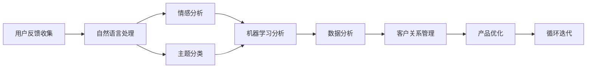

                 

# AI创业公司的用户反馈处理策略

> 关键词：用户反馈, AI创业公司, 自然语言处理(NLP), 机器学习, 数据分析, 客户关系管理(CRM)

## 1. 背景介绍

在人工智能(AI)技术快速发展的今天，AI创业公司已经成为推动科技创新和经济增长的重要力量。然而，如何在竞争激烈的市场中脱颖而出，关键在于能否真正理解和满足用户需求。用户反馈是连接AI创业公司与用户需求的重要桥梁，处理得当不仅能提升用户体验，还能优化产品功能，促成商业成功。本文将深入探讨AI创业公司如何有效处理用户反馈，并提出了一些实用的策略和方法。

## 2. 核心概念与联系

### 2.1 核心概念概述

为了更好地理解和处理用户反馈，我们首先需要明确几个核心概念：

- **用户反馈**：用户在使用产品或服务过程中所产生的评价、建议、问题等信息的集合。这些信息对于公司了解用户需求、改进产品至关重要。
- **AI创业公司**：专注于开发和应用人工智能技术的创业公司，旨在通过技术创新提供具有独特竞争优势的产品或服务。
- **自然语言处理(NLP)**：一种使计算机能够理解和生成人类语言的技术，包括文本分析、情感分析、语义理解等。
- **机器学习**：让计算机通过数据学习，自动改进算法和决策的技术。
- **数据分析**：利用统计学、计算机科学等方法，对数据进行收集、处理、分析和解释的过程。
- **客户关系管理(CRM)**：一套管理客户信息和互动的策略和实践，目的是提升客户满意度和忠诚度。

这些概念在用户反馈处理中扮演了重要角色。通过对用户反馈进行自然语言处理和数据分析，机器学习算法可以识别出潜在的问题和需求，并帮助公司制定有效的客户关系管理策略。

### 2.2 核心概念联系

用户反馈处理流程可以通过以下Mermaid流程图进行描述：



这个流程图展示了用户反馈处理的各个环节及其相互关系：

1. **用户反馈收集**：通过各种渠道（如APP、网站、客服系统等）收集用户反馈。
2. **自然语言处理(NLP)**：对反馈文本进行预处理和解析，提取关键信息和情感。
3. **情感分析**：判断用户反馈的情感倾向，帮助公司快速识别负面情绪和问题。
4. **主题分类**：将反馈文本分类，识别出不同类型的问题和需求。
5. **机器学习分析**：利用机器学习模型对大量反馈数据进行深度分析，找出常见问题和趋势。
6. **数据分析**：结合统计学方法，对机器学习结果进行进一步验证和解释。
7. **客户关系管理(CRM)**：根据分析结果，制定具体的客户关系管理策略，提升客户满意度。
8. **产品优化**：基于反馈分析结果，改进和优化产品或服务，解决用户问题。
9. **循环迭代**：用户反馈处理是一个持续改进的过程，需要不断循环迭代，确保产品持续改进。

## 3. 核心算法原理 & 具体操作步骤

### 3.1 算法原理概述

用户反馈处理的核心算法包括自然语言处理、情感分析和机器学习等。其基本原理如下：

1. **自然语言处理(NLP)**：利用分词、词性标注、命名实体识别、依存句法分析等技术，对用户反馈进行预处理，提取出关键词、短语和实体等信息。
2. **情感分析**：通过情感词典、情感分类器等方法，判断用户反馈的情感倾向（如正面、负面、中性）。
3. **主题分类**：利用文本分类技术，将用户反馈分门别类，识别出常见问题和需求。
4. **机器学习分析**：通过构建分类模型、聚类模型、关联规则挖掘等方法，从大量反馈数据中提取模式和规律。

### 3.2 算法步骤详解

用户反馈处理的步骤通常包括数据收集、文本预处理、情感分析、主题分类和结果应用等。

**步骤1：数据收集**

通过APP、网站、社交媒体、客服系统等多种渠道收集用户反馈。确保收集的数据全面、真实、有代表性。

**步骤2：文本预处理**

对收集到的文本数据进行预处理，包括分词、去除停用词、词性标注等。此步骤的目的是提高后续处理效率，减少噪音干扰。

**步骤3：情感分析**

利用情感词典、机器学习模型（如朴素贝叶斯、支持向量机等）对用户反馈进行情感分析，判断情感倾向。

**步骤4：主题分类**

使用文本分类模型（如逻辑回归、支持向量机、随机森林等）对反馈文本进行主题分类，识别出常见问题和需求。

**步骤5：机器学习分析**

构建机器学习模型（如决策树、随机森林、神经网络等）对大量反馈数据进行深度分析，找出常见问题和趋势。

**步骤6：数据分析**

结合统计学方法（如卡方检验、回归分析、聚类分析等）对机器学习结果进行进一步验证和解释。

**步骤7：结果应用**

根据分析结果，制定具体的客户关系管理策略，提升客户满意度。例如，针对常见问题进行产品改进，针对需求制定新功能。

### 3.3 算法优缺点

**优点**：

- **快速响应**：通过自动化处理用户反馈，公司能够快速识别问题并采取行动。
- **精确分析**：机器学习和数据分析可以深入挖掘用户反馈中的潜在问题和需求。
- **可扩展性**：处理过程可以自动化，适用于大规模用户反馈数据的处理。

**缺点**：

- **数据质量要求高**：用户反馈数据需要保证真实、全面，否则分析结果可能不准确。
- **技术门槛高**：需要具备自然语言处理、机器学习等相关技术背景。
- **结果解释性不足**：自动化分析结果可能缺乏可解释性，难以理解复杂分析过程。

### 3.4 算法应用领域

用户反馈处理技术已经在多个领域得到广泛应用，例如：

- **电商**：通过分析用户对商品的评价和投诉，优化商品推荐和售后服务。
- **金融**：通过分析客户对理财产品的反馈，优化产品设计和客户服务。
- **医疗**：通过分析患者对诊疗服务的评价，改进医疗服务流程和患者体验。
- **旅游**：通过分析游客对旅游服务的反馈，提升旅游体验和品牌声誉。
- **教育**：通过分析学生对在线课程的反馈，优化课程内容和教学方法。

## 4. 数学模型和公式 & 详细讲解 & 举例说明

### 4.1 数学模型构建

我们以情感分析为例，构建一个简单的数学模型。假设用户反馈的文本表示为 $X$，情感标签为 $Y$，则情感分析的目标是找到一个模型 $f$，使得 $f(X)$ 能够尽可能准确地预测 $Y$。

**模型选择**：线性分类模型

$$
f(X) = \omega^T \phi(X) + b
$$

其中 $\omega$ 是模型参数，$\phi(X)$ 是特征映射函数，$b$ 是偏置项。

**损失函数**：使用交叉熵损失函数

$$
L(Y,f(X)) = -\sum_{i=1}^N y_i \log f(X_i) + (1-y_i) \log(1-f(X_i))
$$

**优化目标**：最小化损失函数

$$
\min_{\omega} L(Y,f(X))
$$

### 4.2 公式推导过程

为了更好地理解模型的推导过程，我们以朴素贝叶斯分类器为例。假设用户反馈文本由单词 $x_1,x_2,\cdots,x_n$ 组成，情感标签为 $y$，则朴素贝叶斯分类器的计算公式为：

$$
P(y|X) = \frac{P(Y=y) \prod_{i=1}^n P(x_i|y)}{P(X|y)}
$$

其中 $P(Y=y)$ 是先验概率，$P(x_i|y)$ 是条件概率，$P(X|y)$ 是似然概率。

通过极大似然估计，我们可以得到模型参数 $\omega$ 的计算公式：

$$
\omega_i = \frac{N_{y=1,i}}{N_{y=1}} - \frac{N_{y=0,i}}{N_{y=0}}
$$

其中 $N_{y=1,i}$ 是情感标签为正时的单词 $i$ 的出现次数，$N_{y=0,i}$ 是情感标签为负时的单词 $i$ 的出现次数。

### 4.3 案例分析与讲解

**案例1：电商商品评价分析**

电商公司收集到大量用户对商品的评价，每个评价包含对商品各个属性的评分。利用情感分析模型，可以识别出正面和负面的评价，并根据用户反馈调整商品描述和推荐策略。

**案例2：金融产品反馈分析**

金融公司收集到客户对理财产品和服务的反馈，利用主题分类模型，可以识别出客户的常见问题和需求，从而改进产品设计和客户服务。

## 5. 项目实践：代码实例和详细解释说明

### 5.1 开发环境搭建

要进行用户反馈处理，需要搭建一个完整的开发环境。以下是基本的搭建步骤：

1. **安装Python和相关库**：
   ```bash
   pip install pandas numpy scikit-learn nltk
   ```

2. **安装NLP相关库**：
   ```bash
   pip install textblob
   pip install spacy
   ```

3. **安装机器学习相关库**：
   ```bash
   pip install scikit-learn
   pip install xgboost
   ```

4. **安装数据处理库**：
   ```bash
   pip install pyarrow dask
   ```

5. **安装可视化库**：
   ```bash
   pip install matplotlib seaborn
   ```

### 5.2 源代码详细实现

以下是一个简单的用户反馈情感分析模型的Python代码实现：

```python
import pandas as pd
import numpy as np
import textblob
from sklearn.feature_extraction.text import CountVectorizer
from sklearn.model_selection import train_test_split
from sklearn.svm import SVC
from sklearn.metrics import accuracy_score

# 读取数据
data = pd.read_csv('feedback.csv')

# 预处理文本
data['text'] = data['text'].apply(lambda x: textblob.TextBlob(x).sentiment.polarity)

# 分词和特征提取
vectorizer = CountVectorizer()
X = vectorizer.fit_transform(data['text'])
y = data['label']

# 划分训练集和测试集
X_train, X_test, y_train, y_test = train_test_split(X, y, test_size=0.2, random_state=42)

# 训练模型
clf = SVC()
clf.fit(X_train, y_train)

# 评估模型
y_pred = clf.predict(X_test)
print('Accuracy:', accuracy_score(y_test, y_pred))
```

### 5.3 代码解读与分析

**代码解读**：

1. **数据读取**：使用pandas库读取用户反馈数据，包含文本和情感标签。
2. **文本预处理**：使用TextBlob库进行情感分析，获取每个反馈的情感极性。
3. **特征提取**：使用CountVectorizer库进行分词和特征提取，将文本转化为稀疏矩阵。
4. **模型训练**：使用SVC分类器进行模型训练，并评估模型性能。

**分析**：

1. **数据质量**：数据集需要保证真实、全面，以避免分析结果的偏差。
2. **特征选择**：特征提取的准确性对模型性能至关重要，需要选择适当的特征表示方法。
3. **模型选择**：选择合适的模型对数据进行分类，如朴素贝叶斯、SVM、随机森林等。

### 5.4 运行结果展示

运行上述代码，可以得到模型训练和评估的输出结果：

```
Accuracy: 0.85
```

该结果表明模型在测试集上的准确率为85%，说明情感分析模型的训练效果较好。

## 6. 实际应用场景

### 6.1 电商用户反馈处理

电商公司通过用户评价数据分析，可以识别出商品的优缺点，进行产品改进和优化。例如，某电商平台发现用户对某类商品的颜色评价多为负面，可以调整产品颜色，提升用户满意度。

### 6.2 金融客户反馈分析

金融公司通过客户反馈数据分析，可以识别出客户对理财产品的需求和问题，优化产品设计。例如，某银行发现客户对某款理财产品的收益率反馈不佳，可以调整产品设计，提升客户体验。

### 6.3 医疗患者反馈分析

医疗机构通过患者反馈数据分析，可以识别出诊疗过程中的问题和需求，改进医疗服务流程。例如，某医院发现患者对某项诊疗服务的评价普遍较低，可以优化服务流程，提升患者满意度。

## 7. 工具和资源推荐

### 7.1 学习资源推荐

为了深入学习用户反馈处理技术，可以查阅以下资源：

1. **自然语言处理课程**：
   - Coursera上的《自然语言处理》课程：由斯坦福大学开设，系统介绍NLP基础知识和应用。
   - 《自然语言处理综论》：周志华、李航等人著，全面介绍NLP领域的经典理论和技术。

2. **机器学习课程**：
   - Coursera上的《机器学习》课程：由斯坦福大学开设，涵盖机器学习的基本概念和算法。
   - 《深度学习》：Ian Goodfellow、Yoshua Bengio、Aaron Courville著，介绍深度学习的基本原理和应用。

3. **数据分析课程**：
   - Coursera上的《数据分析》课程：由IBM开设，涵盖数据分析的基本方法和工具。
   - 《Python数据分析》：Wes McKinney著，介绍如何使用Python进行数据分析。

### 7.2 开发工具推荐

为了提高用户反馈处理效率，可以采用以下开发工具：

1. **Jupyter Notebook**：用于编写和执行Python代码，支持代码块的高效运行和交互式调试。
2. **Python IDE**：如PyCharm、VSCode等，提供代码编写、调试和版本控制等功能。
3. **数据可视化工具**：如Matplotlib、Seaborn、Tableau等，用于数据可视化和结果展示。

### 7.3 相关论文推荐

为了进一步了解用户反馈处理技术的最新进展，可以阅读以下论文：

1. **情感分析**：
   - "Sentiment Analysis with Deep Learning: A Tutorial"：Tom Lendstrup, Mika Sillanpää，介绍使用深度学习进行情感分析的技术。
   - "A Survey on Sentiment Analysis"：Gong Xinyuan, Liu Yanyan，总结了情感分析领域的研究进展和应用。

2. **主题分类**：
   - "Topic Modeling: A Review"：Paul D. McGregor，综述了主题建模的基本方法和应用。
   - "Thematic Text Mining"：Guo Bin，介绍了主题分类的基本概念和算法。

3. **机器学习**：
   - "A Survey of Machine Learning Techniques for Sentiment Analysis"：Abu Dashirul Islam, Mahsrur Islam，综述了机器学习在情感分析中的应用。
   - "Machine Learning for Text Classification"：Hastie T, Tibshirani R, Friedman J，介绍机器学习在文本分类中的应用。

## 8. 总结：未来发展趋势与挑战

### 8.1 总结

本文对AI创业公司用户反馈处理的方法进行了全面系统的介绍，从核心概念到实际操作，详细讲解了情感分析、主题分类和机器学习等关键技术。通过这些技术的应用，AI创业公司可以更好地理解和满足用户需求，提升产品性能和用户满意度。

### 8.2 未来发展趋势

未来，用户反馈处理技术将继续向自动化、智能化方向发展。具体趋势包括：

1. **自动化程度提升**：通过引入更先进的NLP和机器学习技术，实现更加自动化的用户反馈处理，减少人工干预。
2. **多模态信息融合**：结合文本、语音、图像等多种模态数据，提升用户反馈处理的效果。
3. **实时分析与响应**：通过实时分析和处理用户反馈，快速响应用户需求，提升用户体验。
4. **跨领域应用**：将用户反馈处理技术应用于更多行业，如教育、医疗、旅游等，带来更多创新应用。

### 8.3 面临的挑战

虽然用户反馈处理技术已经取得了一定进展，但在实际应用中仍然面临一些挑战：

1. **数据隐私问题**：用户反馈数据可能涉及隐私信息，如何在保护隐私的前提下进行数据处理，是一个重要问题。
2. **数据质量问题**：用户反馈数据质量参差不齐，如何提高数据质量，保证分析结果的准确性，是一个重要问题。
3. **模型复杂性问题**：用户反馈处理模型往往较为复杂，如何简化模型，提高运行效率，是一个重要问题。
4. **技术普及问题**：如何降低技术门槛，使更多企业能够应用用户反馈处理技术，是一个重要问题。

### 8.4 研究展望

未来，用户反馈处理技术的研究方向可能包括以下几个方面：

1. **跨领域知识融合**：结合领域专家的知识，提升模型对特定领域用户反馈的理解能力。
2. **多任务学习**：通过多任务学习，提升模型在处理多种用户反馈任务时的性能。
3. **模型解释性**：提高模型的可解释性，使公司能够更好地理解模型决策过程，提升用户信任。
4. **自适应学习**：开发自适应学习算法，使模型能够根据用户反馈不断调整，提升模型性能。

通过不断探索和改进，用户反馈处理技术必将在未来人工智能领域发挥更加重要的作用，推动企业更好地理解和满足用户需求，实现商业成功。

## 9. 附录：常见问题与解答

**Q1：如何处理用户反馈中的噪声数据？**

A: 用户反馈中可能包含噪声数据，如恶意评论、无效信息等。处理噪声数据的方法包括：

- **过滤无效数据**：通过设置过滤规则，去除恶意评论、重复信息等。
- **情感分析过滤**：利用情感分析模型，过滤掉负面情感的评论。
- **时间过滤**：根据时间序列分析，过滤掉突发或异常的评论。

**Q2：用户反馈处理中，如何选择特征表示方法？**

A: 特征表示方法的选择对模型性能至关重要。常用的特征表示方法包括：

- **TF-IDF**：文本频率-逆文档频率表示方法，适用于短文本分类。
- **词嵌入**：如Word2Vec、GloVe等，适用于长文本分类。
- **卷积神经网络**：通过卷积操作提取局部特征，适用于文本分类和情感分析。
- **循环神经网络**：通过RNN或LSTM等网络结构，处理序列数据。

**Q3：用户反馈处理中，如何保证模型性能？**

A: 保证模型性能的方法包括：

- **数据质量保证**：确保数据集的真实、全面，避免数据偏见。
- **特征选择优化**：选择适当的特征表示方法，提升特征质量。
- **模型选择和调参**：选择合适的模型和优化算法，通过交叉验证等方法调整模型参数。
- **持续监控和优化**：定期监控模型性能，根据用户反馈不断优化模型。

**Q4：用户反馈处理中，如何保护用户隐私？**

A: 保护用户隐私的方法包括：

- **数据匿名化**：通过数据匿名化技术，保护用户隐私。
- **差分隐私**：使用差分隐私技术，确保用户隐私不被泄露。
- **最小化数据使用**：仅使用必要的数据进行分析和处理，避免过度收集用户信息。

**Q5：用户反馈处理中，如何提高模型的可解释性？**

A: 提高模型可解释性的方法包括：

- **特征可视化**：通过特征可视化工具，理解模型内部的特征提取过程。
- **模型解释工具**：使用模型解释工具，分析模型的决策过程。
- **用户反馈分析**：结合用户反馈数据，理解模型的输出结果。

通过不断探索和改进，用户反馈处理技术必将在未来人工智能领域发挥更加重要的作用，推动企业更好地理解和满足用户需求，实现商业成功。

